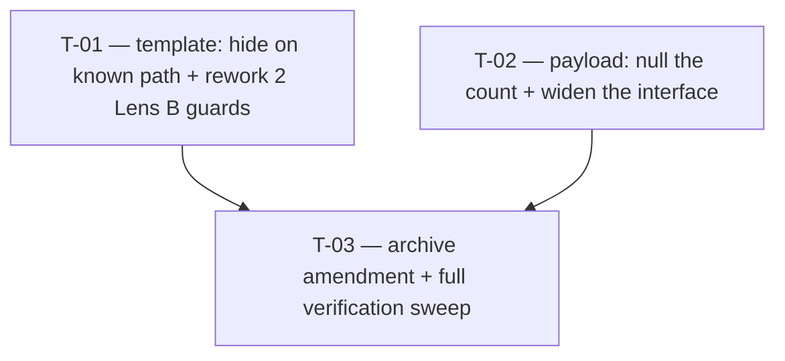

# Tasks — Changes / Organization count belongs to the unknown-organization path only

- **Module:** client — `innovation-use-details` (STAR result page), organization card
- **Spec id:** 2026-09-innovation-use-organization-count-known-path
- **Status:** in-progress — T-01 ✅ · T-02 ✅ · T-03 `[~]` (awaiting D-7)
- **Owner:** D. Casañas
- **Depth:** **Lite**
- **Linked requirements:** [`./requirements.md`](./requirements.md)
- **Linked design:** [`./design.md`](./design.md)
- **Budget (tripwire):** 3 tasks · ~90 LOC · 1 review round — `design.md` §11
- **Last updated:** 2026-09-03

---

## 1. Gate before execution — ✅ CLEARED

> ✅ **`OQ-1` resolved 2026-09-03 by the user; T-02 is unblocked.** No DB read was needed: Innovation Use is still in development, the `organization_count` values captured so far are consumed by nothing, and any matching rows are test data that can be deleted. Nulling them costs nothing real — no backfill, no MEL comms.
>
> Confirmed at source while closing: `resolveOrganizationCount` returns `{}` for any role other than `INNOVATION_USE`, so this change **cannot** reach an Innovation Dev row.

---

## 2. Dependency graph

Three tasks. `T-01` and `T-02` are **independent** — different files, different requirements — and may run in either order or concurrently by a single worker. `T-03` verifies both.

> ⚠️ Both tasks edit files in the **same package**. Per the root guide's concurrency rule, they must not be dispatched to two concurrent workers — same-package parallelism is unsafe. One worker, sequentially.

---

## 3. Task list

### T-01 — Render the count field only on the unknown path

- **Requirements covered:** `R-IUC-001` (all three scenarios, all four ACs)
- **Defect classes owned:** `D-1`, `D-2`, `D-5`, `D-11`
- **Design references:** `design.md` §5.1, `DD-1`, `DD-3`, `DD-4`
- **Files touched (intended):**
  - `client/research-indicators/src/app/pages/platform/pages/result/pages/innovation-use-details/components/innovation-use-organization-item/innovation-use-organization-item.component.html`
  - `.../innovation-use-organization-item/innovation-use-organization-item.component.spec.ts`
- **Description:** Move the `organization_count` `app-input` block (currently lines 155–165, with its `rs-mt-[12]` wrapper) inside the `@else` branch of `@if (body().is_organization_known)`, appended after the `Specify other` conditional. Leave the `showNotIdentifiedMessage` outlet outside both branches where it is. Then rework the two Lens B "Fix 3" guards and add the transition test.

- **Implementation notes:**
  - Per `DD-3`, move the block — do **not** wrap it in a second `@if (!body().is_organization_known)`.
  - Per `DD-1`, the branch condition is the existing `is_organization_known` alone. Do not add a check on `institution_id`.
  - Per `DD-4`, rewrite `spec.ts:183` — invert it to assert **absence** on the known path.
  - Per `DD-4`, rework `c8` at `spec.ts:384`: `expect(appInputs().length).toBe(1)` becomes `toBe(0)` for the known-path case, and the test **title** (line 366) must stop naming `count` among the controls it disables. Its `inputs.forEach(...)` disabled-assertion becomes vacuous on an empty list — remove it from the known-path case rather than leaving a no-op behind (that is precisely the vacuity Lens B added the guard against).
  - The `c8` **unknown**-path sibling (line 392) asserts selects only and is unaffected — do not touch it.
  - The new transition test (`D-5`) must arrange per **KZ-015**: render on the unknown path, `detectChanges()`, assert present, then flip the checkbox **on the live fixture**, `detectChanges()`, assert absent, then flip back. Setting `component.organization` before the first `detectChanges()` is the end-state pattern this test exists to avoid — the rest of the file uses it, and copying it here would test a state the product never transitions through.
  - Do **not** touch `onKnownToggle`, `body`, or `organizationIdentitySatisfied` (`design.md` §5.3).

- **Verification:**
  - `npx jest --testPathPattern innovation-use` — full innovation-use suite green.
  - `npx eslint <the two touched paths>` — 0 errors. *(Not `npm run lint`: it carries `--fix` and mutates, so it cannot gate — K-001.)*
  - **K-004 red first:** revert the template move, re-run, and confirm the rewritten `:183` guard **and** `c8` both redden, quoting the failure output. Then restore. A green written after the fix is not evidence.
  - **Disqualifier:** these are boolean DOM assertions — there is no inconclusive reading. What *does* disqualify them: a `[ ]` flipped without the red having been observed and quoted.
  - **Scope limit (KZ-017):** `npx eslint` does not lint `*.spec.ts` in this repo, so the spec edits rest on jest alone. jsdom cannot evaluate layout — this task proves tree membership, **not** how the card looks (that is `D-7`, owned by T-03's HITL check).

- **Acceptance / done check:**
  - [x] Known path: DOM query for the Organization count input returns nothing (`AC.1`).
  - [x] Known path: the organization `p-select`, partner preview and request-institution callout still render.
  - [x] Unknown path: the input renders with `[min]="0"`, `[maxFractionDigits]="0"` and the `How many?` placeholder intact (`AC.2`).
  - [x] Unknown path: the field did **not** become required, gain an asterisk, or change label.
  - [x] A ticked box with `institution_id` unset still hides the field (`AC.3`).
  - [x] Toggle both directions on an already-rendered fixture flips visibility (`AC.4`, KZ-015 arrangement).
  - [x] The actor and measure card specs pass **unmodified** — the `BUT it must NOT` clause of scenario 1.
  - [x] Both reworked guards observed **red** before the fix, output quoted in `execution.md`.

- **Dependencies:** none
- **Effort:** **S**
- **Skills:** `angular-developer`, `ui-ux-pro-max`
- **Status:** **done** — Reviewer PASS 2026-09-03, 1 attempt (`execution.md` → T-01)

---

### T-02 — Emit no organization count for a known-path row

- **Requirements covered:** `R-IUC-002` (both scenarios; `AC.1`–`AC.3`, and `AC.4` jointly with T-03)
- **Defect classes owned:** `D-3`, `D-4`, `D-10`
- **Design references:** `design.md` §5.2, `DD-2`, `DD-6`
- **Files touched (intended):**
  - `client/research-indicators/src/app/pages/platform/pages/result/pages/innovation-use-details/innovation-use-details.component.ts`
  - `.../innovation-use-details/innovation-use-details.component.spec.ts`
- **Description:** In `buildOrganizationPayload`, change `organization_count: row.organization_count` to the branch-keyed form using the already-bound `known`. Widen `InnovationUseOrganizationPayload.organization_count` to `number | null` so it compiles. Add the two payload assertions.

- **Implementation notes:**
  - Per `DD-6`, line 92 of the same file must become `organization_count?: number | null;` **before** the ternary compiles. The four sibling fields are already widened; this restores the symmetry.
  - Per `DD-6`, emit `null`, not `undefined` — even though both reach the DB identically.
  - Per `DD-2`, null at the payload boundary **only**. Do not clear `body`, and do not add clearing to `onKnownToggle` — the restore test at `innovation-use-organization-item.component.spec.ts:464` asserts `body().organization_count === 7` (`:474`) on a known-path row and must keep passing untouched.
  - `D-3`'s assertion goes into the **existing** `T-08 buildPayload() — Issue 1 fix` block (line 693), whose fixture already carries `is_organization_known: true` + `organization_count: 12`. Add an assertion; do not restructure the block or alter its four existing assertions.
  - Do **not** touch `organizationIdentitySatisfied` or the row filter at line 471.

- **Verification:**
  - **`npm run build` — MANDATORY, and the only gate for `D-10`.** `jest.config.ts` sets `isolatedModules: true`, so `npm test` type-checks nothing and would go fully green over the `TS2322`. Reporting green on jest alone does **not** verify this task.
  - `npx jest --testPathPattern innovation-use` — green.
  - `npx eslint <the two touched paths>` — 0 errors.
  - **K-004 red first:** (a) apply the ternary *without* `DD-6`'s widening and confirm `npm run build` fails with `TS2322`, quoting it — this red is free, it is the defect itself; (b) revert the ternary and confirm the new payload assertion reddens. Then restore both.
  - **Disqualifier:** a build that fails for an *unrelated* pre-existing reason is not evidence for `D-10`. Confirm the baseline build is green on untouched `HEAD` first; if it is not, report that and stop rather than reading a pre-existing red as this task's red.
  - **Scope limit (KZ-017):** the build type-checks; it does **not** prove the emitted JSON reaches the server correctly. No E2E or integration test in this spec exercises a real request — `NFR-IUC-001`'s reasoning (verified in `design.md` §6.1) is what covers the server side, not a run.

- **Acceptance / done check:**
  - [x] `npm run build` succeeds (`D-10`).
  - [x] Known-path row with a body count emits `organization_count: null` (`AC.1`).
  - [x] The same row still emits its `institution_id` — the `AND` clause of scenario 1.
  - [x] Unknown-path row emits its count verbatim, `institution_id` null (`AC.2`, and the `BUT it must NOT` clause).
  - [x] A mixed payload emits both outcomes in one build (`AC.3`).
  - [x] The `T-08 Issue 1 fix` block's four original assertions are unchanged and green.
  - [x] The restore test at `:464` passes **unmodified** (`DD-2`'s evidence).
  - [x] Both reds observed and quoted in `execution.md`.

- **Dependencies:** none
- **Effort:** **S**
- **Skills:** `angular-developer`
- **Status:** **done** — Reviewer PASS 2026-09-03, 1 attempt (`execution.md` → T-02)

---

### T-03 — Amend the archived spec and close the verification sweep

- **Requirements covered:** `NFR-IUC-001`, `NFR-IUC-002`; the `AND IT MUST` row-inclusion clause of `R-IUC-002` scenario 1; `R-IUC-002` `AC.4`
- **Defect classes owned:** `D-6`, `D-7`, `D-8`
- **Design references:** `DD-5`, `design.md` §7, §10
- **Files touched (intended):**
  - `docs/specs/archive/2026-08-26-innovation-use--details-page/design.md` (§5.5 table row)
  - `docs/specs/archive/2026-08-26-innovation-use--details-page/tasks.md` (line 309)
- **Description:** Record the reversal in the archived spec without erasing what it originally said, then run the whole-suite and no-server-diff sweep and stage the human visual check.

- **Implementation notes:**
  - Per `DD-5`, append a `⚠️ AMENDED 2026-09-03 by docs/specs/changes/innovation-use-organization-count-known-path` note to §5.5's `both paths` row and to `tasks.md:309`. **Do not rewrite the original sentences** — the precedent is `measure-number-signed-decimal` (`S-10`, `DC-12`), which amended this same archived design in place.
  - Per **KZ-013**, before editing, `grep -rn "2026-08-26-innovation-use--details-page" docs/` and re-read every document that cites the section being amended — a referrer may now assert something false. Record the hit count; a filtered or truncated search is not the search (**K-014**).
  - The `⚠️ SUPERSEDED` notes already added to this spec's own `proposal.md` §5/§11 are the backward sweep for the *edit-count* claim and need no repeat.

- **Verification:**
  - `npm test -- --silent` from `client/research-indicators/` — **full** suite. Run it **after** T-01 and T-02 report, never concurrently with an active worker: a full suite run alongside another is not a slow measurement but a wrong one (root guide, narrowed 2026-08-18).
  - `git diff --name-only` — **zero** paths under `server/` (`D-8`, `NFR-IUC-001`).
  - `git diff` on `innovation-use-organization-item.component.spec.ts` shows the `c6` block and the `:464` restore test **unchanged** (`NFR-IUC-002`).
  - `git diff` on `innovation-use-details.component.spec.ts` shows the `c2: blank organization rows are dropped` block **unchanged** (`D-6`).
  - **`D-7` — human check, no automated gate exists.** At the HITL pause, open the running app on an Innovation Use result and inspect the ORGANIZATIONS card on **both** paths: the card's vertical rhythm where the field was removed, and that the "This row does not identify an organization yet" message still sits correctly. jsdom cannot measure layout and no test in this repo asserts spacing — this is recorded as a substitute, not as coverage.
  - **Disqualifier:** a full-suite green obtained while any worker was still active is **not evidence** — discard it and re-measure in isolation. Likewise a `git diff` read over a dirty tree containing unrelated work.
  - **Scope limit (KZ-017):** the server suite is **not** run, because no server file changes. That is a declared non-measurement, not a green. `D-9` is out of reach of every command here — it is the `OQ-1` gate in §1.

- **Acceptance / done check:**
  - [x] Full client suite green, measured with no worker active.
  - [x] `git diff --name-only` contains no `server/` path.
  - [x] `c6`, the `:464` restore test, and the `c2` drop block are all byte-unchanged in the diff.
  - [x] Row inclusion is unchanged — the payload contains the same set of rows as before for the same input (`AC.4`).
  - [x] Archived `design.md` §5.5 and `tasks.md:309` carry the amendment note; originals not rewritten.
  - [x] KZ-013 backward grep run, hit count recorded, every referrer re-read.
  - [ ] **Human visual check performed on both paths and its outcome written down (`D-7`) — OPEN, with the user.** No automated gate exists for this; jsdom cannot measure layout.

- **Dependencies:** T-01, T-02
- **Effort:** **S**
- **Skills:** `angular-developer`
- **Status:** `[~]` **in-progress** — documentation + measurement halves PASS (Reviewer 2026-09-03, 1 attempt); **blocked on `D-7`, the human visual check.**

---

## 4. Coverage closure

Closed at **scenario and clause** granularity, not requirement ID. Every `BUT it must NOT` / `AND IT MUST` clause has a named owner.

| Requirement | Unit | Owner |
| --- | --- | --- |
| `R-IUC-001` | Sc.1 THEN (no input in DOM) | T-01 |
| | Sc.1 AND (select/preview/callout still render) | T-01 |
| | Sc.1 **BUT NOT** (other cards untouched) | T-01 |
| | Sc.1 **AND IT MUST** (hide with `institution_id` unset) | T-01 |
| | Sc.2 THEN + AND (present, attributes intact) | T-01 |
| | Sc.2 **BUT NOT** (not required / no asterisk / label unchanged) | T-01 |
| | Sc.3 THEN + AND (live toggle both ways) | T-01 |
| | Sc.3 **AND IT MUST** (transition arrangement, KZ-015) | T-01 |
| `R-IUC-002` | Sc.1 THEN (`null` on known path) | T-02 |
| | Sc.1 AND (`institution_id` still sent) | T-02 |
| | Sc.1 **BUT NOT** (no nulling on unknown path) | T-02 |
| | Sc.1 **AND IT MUST** (row inclusion unchanged) | T-03 |
| | Sc.2 THEN + AND (unknown path round-trips) | T-02 |
| `NFR-IUC-001` | zero `server/` paths in the diff | T-03 |
| `NFR-IUC-002` | `c6` unmodified and green | T-03 |

No clause is discharged by citing a different requirement.

---

## 5. PR strategy

**One PR.** ~90 LOC across two production files, two spec files and two archived docs, all in the client package, all serving one behavioural change. Splitting T-01 from T-02 would ship a state where the field is hidden but the count is still persisted — the exact defect `design.md` rejected as Option B. They must land together.
