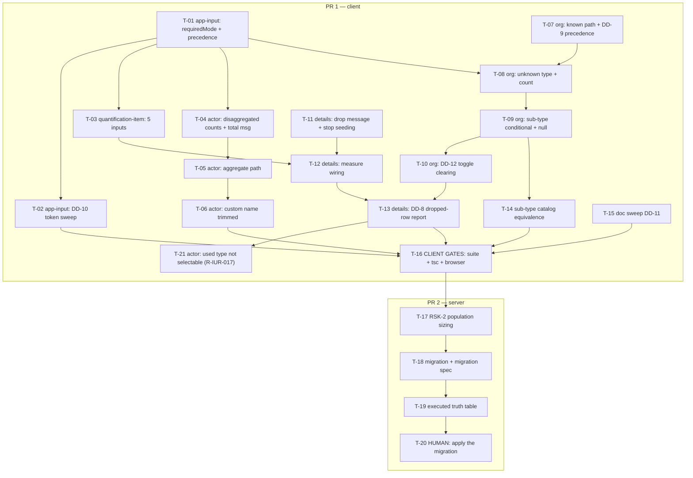

# Tasks — Innovation Use / Required-field semantics and green check

- **Module:** client (`innovation-use-details` + 2 shared components) · server (1 migration)
- **Spec id:** 2026-09-innovation-use-required-fields
- **Status:** in-progress — **per-task status lives in [`./execution.md`](./execution.md) §1.2 (status board)**, since §4 below carries no per-task checkbox
- **Owner:** D. Casañas
- **Linked requirements:** [`./requirements.md`](./requirements.md)
- **Linked design:** [`./design.md`](./design.md) — **revision 6**
- **Linked execution:** [`./execution.md`](./execution.md)
- **Findings ledger:** [`./judgment.md`](./judgment.md)
- **Last updated:** 2026-09-04
- **Depth:** Full

---

## 1. How to read this file

Every task carries four verification fields, not one. Three of them exist because a green command is
not the same as a correct artifact:

| Field | Question it answers |
| --- | --- |
| **Verify** | What command or observation produces the evidence |
| **Falsifying input** | What concrete input makes that check go **red**. *If none can be named, the check is not evidence, however green it reports* (`K-004`) |
| **Disqualifier** | What makes a produced reading **worthless**. An inconclusive verification is a legitimate outcome and must be reported as one — never collapsed into a pass because the command exited `0` |
| **Cannot prove** | The region the check structurally cannot inspect (`KZ-017`), and what a presence-assertion leaves unproven (`KZ-001`) |

**Standing gates for every client task** (`CLAUDE.md` §4.3, K-001):

- Lint: `npx eslint <changed paths>` — **never** `npm run lint`, which carries `--fix` and mutates.
- Tests: `npm test -- --silent` from `client/research-indicators/`.
- The worker may run `npx prettier --write`; the Leader re-measures. No command may both fix and verify.

**Concurrency:** tasks in the same file MUST be sequenced (see §2). Two concurrent **full-suite** runs
are banned outright — they produced phantom `excel-workbook.builder.spec.ts` failures twice
(`CLAUDE.md` §4.3). Workers verify their own scope; the Leader re-measures the full suite.

### 1.1 Budget breach — declared up front

`design.md` §11 (rev 4) budgeted **18 tasks / ~1,600 LOC / ~24 review rounds**. This decomposition
lands at **20 tasks**, a **+2 breach** the Leader must not absorb silently:

| Extra task | Why it is not folded into a sibling |
| --- | --- |
| **T-14** — sub-type catalog equivalence | `R-IUR-008` AC.4 demands enumeration over the whole catalog against `getInstitutionTypesByDepthLevel`, the **real** service. Folded into T-09 it would have been discharged by the jsdom mock that `DD-5` explicitly says cannot observe either the `is_active` or the root filter |
| **T-16** — client gate task | The three gates that can only run *after* every client change (full suite, normalized `tsc` set diff, human browser check) have no natural owner among the feature tasks, and a gate owned by everyone is owned by no one |

LOC re-baselined to **~1,650**. **Task count re-baselined 2026-09-07 to 21** by the T-13 Pivot (user ruling) — `T-21` implements `R-IUR-017`, the dropdown rule that replaces the withdrawn save block; `T-13` shrank from `L` to `M` in the same ruling. **Review rounds: see `design.md` §11, the single home for this figure** (`KZ-005`) — **re-baselined 2026-09-07 to ~37** by user ruling at the T-10 gate, from measured throughput rather than re-estimation. **Depth stays Full.**

---

## 2. Dependency graph

No cycles. `T-15` is fully independent and may run at any point in PR 1.

**Cross-package parallelism is safe for editing only.** `T-17` may start while PR 1 is still open;
its full-suite gate may not overlap `T-16`'s.

---

## 3. PR strategy

| PR | Contents | Merge order | Gate |
| --- | --- | --- | --- |
| **PR 1 — client** | T-01 … T-16 (~1,250 LOC) | **first** | `T-16` green, incl. the human browser check |
| **PR 2 — server** | T-17 … T-20 (~400 LOC) | **second** | `T-19` executed truth table; `T-20` is a human step |

**The order is load-bearing, not cosmetic** (`design.md` §9). Client-first leaves a window where the
UI is stricter than the green check — **safe**. The reverse order disables Submit with no on-screen
explanation. Per `cognitive-doc-design`, PR 2's description must link back to PR 1 and state that the
migration **does not self-apply** (`K-015`).

---

## 4. Tasks

### T-01 — `app-input`: add the opt-in `requiredMode`, with precedence

- **Requirements covered:** `R-IUR-004` S1 + its `AND IT MUST` (`0` satisfies "filled" for all four) · `R-IUR-005` AC.2/AC.3 · `R-IUR-009` S1 + its `AND IT MUST` (`0` is filled-but-not-positive) · `R-IUR-010`'s `AND IT MUST` clauses (reject `0`, accept negatives; reject whitespace-only `Unit`) · `R-IUR-013` AC.2
- **Design:** `DD-1` (incl. the rev-6 precedence paragraph), `DD-2`, §3.3
- **Defect classes:** `DC-2`, `DC-2b`
- **Files:** `client/.../custom-fields/input/input.component.ts` · `.html` · `.spec.ts`
- **Description:** Add `requiredMode: 'off' | 'filled' | 'positive' | 'nonzero'`, default `'off'`. `'filled'` trims strings but keeps numeric `0` filled (`String(0).trim() === '0'`). `'positive'` and `'nonzero'` distinguish the *required* message from the *boundary* message. Asterisk renders when `isRequired || requiredMode !== 'off'`.
- **Implementation notes:**
  - **Precedence is the whole task.** When `requiredMode !== 'off'`, the mode owns the verdict and the legacy branches at `:179`, `:184`, `:187` are bypassed for that field. Left additive, `isRequired && !value` still reddens a deliberate `0` and re-creates `DC-2` inside the fix.
  - Leave `validateEmpty` alone; it must not be passed alongside `requiredMode` (`DD-1`, `S-8`).
  - Do **not** touch the falsy check for `'off'` — the other 15 templates depend on today's behavior (`OQ-3` owns the audit).
- **Verify:** `npm test -- --silent -- input.component.spec` — one case per mode per boundary.
- **Falsifying input:** `requiredMode="filled"` **with `isRequired=true`** holding `0` — must render **no** amber and **no** message. This is the precedence case; a merely-additive implementation reddens here. Also: `'   '` under `'filled'` must redden; `-5` under `'nonzero'` must **not**.
- **Disqualifier:** a test that sets the value through the component's own `setValue()` and then asserts the component's own `inputValid()` is tautological. Drive the value through the **`signal` input** the way a call site does, since `inputValid()` reads `getNestedProperty(this.signal(), ...)` while `isInvalid()` reads `this.body()` — the two disagree on source and a same-source test hides it.
- **Cannot prove:** nothing about paint (`DC-1` → T-16), and nothing about the 15 untouched templates (`R-IUR-013` AC.2 is proven by T-16's full suite, not here).
- **Deps:** none · **Effort:** M · **Skills:** `angular-developer`, `systematic-debugging`

---

### T-02 — `app-input`: tokenize the five live literals, delete the dead `[style]`

- **Requirements covered:** `R-IUR-003` AC.1–AC.3 (`app-input` half) · `R-IUR-003` S1's `BUT`/`AND IT MUST NOT` pair (the narrowed cascade rule and its `p-inputNumber` exception) · `NFR-IUR-002`
- **Design:** `DD-10` (**inverted by `P-2`**, `:59` token corrected at rev 6), `DD-3`
- **Defect classes:** `DC-1`
- **Files:** `client/.../custom-fields/input/input.component.html`
- **Description:** Convert four amber literals (`:30`, `:49`, `:65`, `:71`) to `var(--ac-warning-1)` and the grey helper-text literal (`:59`) to `var(--ac-grey-600)`. Delete the dead `[style]` binding at `:55`.
- **Implementation notes:**
  - **`:49` is KEPT and converted — never deleted.** It is the live renderer for every numeric field in the application (`P-2`, browser screenshot). `:55` is the dead one: `p-inputNumber` declares `style` as an `@Input` and never applies it (`primeng-inputnumber.mjs:1677`).
  - `:59` goes to `--ac-grey-600` (`colors.scss:33`), **not** `--ac-warning-1`. `#8d9299` is grey; the blanket instruction of rev 3–4 would repaint the helper text amber.
  - Both colour changes are **zero-delta** by registry (`--ac-warning-1` = `#e69f00`, `--ac-grey-600` = `#8d9299`).
  - **`text-sm` → `fs-[14]` is NOT zero-delta** (`N-8`): `.fs-[14]` sets `font-size` only, `text-sm` also sets `line-height: 1.25rem`, and `:65`/`:71` render for all 18 consumers. **Decide explicitly and record the decision** — either pair `fs-[14]` with an explicit line-height, or keep `text-sm` and record the deviation from `G-3`. Do not leave it implicit.
- **Verify:** `npx eslint` on the file + a class/style assertion per site; the line-height decision recorded in the task's execution note.
- **Falsifying input:** revert any one converted literal back to its hex — a token-compliance assertion must redden. For the cascade rule: put a `border-*` **utility** on the `pInputText` branch — it must be rejected in review, since **no test will redden** (`DC-1`).
- **Disqualifier:** a diff that shows the token in the source is **not** evidence the colour still paints. If the human browser check in T-16 has not run, this task's visual claims are **inconclusive**, not passing.
- **Cannot prove:** that any border paints. jsdom paints nothing and `cssstyle@2.3.0` drops a shorthand carrying `var()` — which is why `element.style.border` must never be read. Sequenced after T-01 solely to avoid a same-file conflict.
- **Deps:** T-01 · **Effort:** S · **Skills:** `ui-ux-pro-max`, `angular-developer`

---

### T-03 — `quantification-item`: replace `fieldsRequired` with five per-field inputs

- **Requirements covered:** `R-IUR-010` AC.1, AC.3, **AC.5** (OICR unchanged, both call sites) · `R-IUR-010` S1's `BUT it must NOT change the OICR measure card` · `R-IUR-013` AC.1
- **Design:** `DD-4` (rev 6: `numberRequiredMode`, **not** `numberAllowsZero`; **`unitRequiredMode` added 2026-09-04 by pivot**)
- **Defect classes:** `DC-5`, `DC-8`
- **Files:** `client/.../quantification-item/quantification-item.component.ts` · `.html` · **`.spec.ts` (rewrite in scope)**
- **Description:** Remove `fieldsRequired`; add `numberRequired` (`true`), `unitRequired` (`true`), `commentsRequired` (`true`), `numberRequiredMode` (`'off'`), **`unitRequiredMode` (`'off'`)**. Pass **both** modes straight through to the respective `app-input`'s `requiredMode`. Remove the two dead `[validateEmpty]` bindings.
- **Implementation notes:**
  - **`numberAllowsZero` from revisions 1–4 does not exist and must not be created.** A boolean cannot express the corrected rule: `numberAllowsZero = true` makes `0` **valid**, the exact opposite of `R-IUR-010` AC.4. Three states are needed — OICR's falsy check, `'nonzero'`, and `off`.
  - OICR passes nothing at all (`oicr-details.component.html:60`, `:81`) and must receive every default.
  - The `[validateEmpty]` bindings at `.html:17`/`:23` are **provably dead**: both bind the same `fieldsRequired` as `[isRequired]`, so the `validateEmpty` branch (`input.component.ts:187`) is unreachable when `true` and inert when `false`.
  - **The removal is NOT self-gating** (`S-5`). `quantification-item.component.spec.ts:130`/`:134` reference `fieldsRequired` as a **TypeScript property**, which no template compiler sees.
- **Verify:** `npm test -- --silent -- quantification-item.component.spec`, asserting the **default, no-inputs-passed** configuration renders all three asterisks and all three required messages, **and that both `numberRequiredMode` and `unitRequiredMode` default to `'off'`** so OICR keeps its untrimmed falsy behavior (`R-IUR-010` AC.5).
- **Falsifying input:** an OICR measure card with `Comments` empty, rendered through the **real** component — it must still show its required message. Flip `commentsRequired`'s default to `false` and this must redden.
- **Disqualifier:** **a green OICR suite is not evidence here and must never be cited as such.** `oicr-details.component.spec.ts:872-880` stubs the card with an empty-template `FakeQuantificationItemComponent`, so it is structurally blind to every property AC.5 names — a green OICR run is compatible with all three asterisks vanishing (`C-3`, `S-7`).
- **Cannot prove:** the rendered *appearance* of the asterisks (presence ≠ paint, `DC-7`). Stale spec references are caught only by T-16's normalized `tsc` diff, not by this suite — `ts-jest` runs `isolatedModules` with no type-checking.
- **Deps:** T-01 · **Effort:** M · **Skills:** `angular-developer`, `ui-ux-pro-max`

---

### T-04 — Actor card, disaggregated path: four required counts and one total message

- **Requirements covered:** `R-IUR-004` **in full** — S1 (`0` is a value) + its `AND IT MUST`; S2 (four zeros) + its `BUT it must NOT report the four fields as empty`; S3 (partially filled); AC.1–AC.5 · `R-IUR-001` S2 (a started row invalidates its section)
- **Design:** `DD-2` (cross-field placement), `DD-3` (`p-select` setter spy)
- **Defect classes:** `DC-2`, `DC-7`
- **Files:** `client/.../innovation-use-actor-item/*.ts` · `.html` · `.spec.ts`
- **Description:** Pass `requiredMode="filled"` to the four count `app-input`s. Render the rule-4 total-positivity message **once**, beneath the four fields, with **no** border on any of them, driven by the existing `total()`.
- **Implementation notes:**
  - The two rules must not collide: when all four are filled and sum to `0`, **no field may say `This field is required`** — all four *are* filled. One message, never five.
  - `total()` already exists; consume it rather than recomputing.
  - `actor_type_id`'s `p-select` border uses the `[style]` **object binding** (`DD-3`), never a Tailwind utility — PrimeNG styles `.p-select` unlayered.
- **Verify:** `npm test -- --silent -- innovation-use-actor-item.component.spec`. Border assertion for the `p-select` via the setter spy exemplar already in-tree at `:291`, `:298`.
- **Falsifying input:** `0 / 5 / 0 / 0` — must be **valid** with no amber anywhere (the `DC-2` case). `0 / 0 / 0 / 0` — must show **exactly one** total message and **zero** required messages. One filled, three empty — three required messages, no total message.
- **Disqualifier:** a message-count assertion that counts `warning` icons **across the whole card** cannot separate the total message from the four field messages; scope the query to the fields' own containers or the assertion cannot distinguish "one total message" from "one leftover required message".
- **Cannot prove:** paint (T-16). The setter spy proves the `border` property was **set**, not that it rendered (`DC-7`) — record that limit beside it. It also **cannot fire for `p-inputNumber`** (`P-1`), so it must not be used for the four counts; assert the class there instead.
- **Deps:** T-01 · **Effort:** M · **Skills:** `angular-developer`, `ui-ux-pro-max`

---

### T-05 — Actor card, aggregate path: `How many` required and positive

- **Requirements covered:** `R-IUR-005` **in full** — S1 + its `BUT it must NOT evaluate the four disaggregated counts while this path is active`; AC.1–AC.5 (incl. AC.5, no stale message across a toggle)
- **Design:** `DD-1` `'positive'`, `DD-2`
- **Files:** `client/.../innovation-use-actor-item/*.ts` · `.html` · `.spec.ts`
- **Description:** Pass `requiredMode="positive"` to `actors_count`. Ensure the asterisk and the evaluation exist on this path **only**, and that toggling the mode leaves no message behind from the path just left.
- **Implementation notes:**
  - `onModeChange()` already clears the leaving mode's fields (`:111-125`) — this task relies on that and must not duplicate it.
  - The empty case and the `0` case must produce **distinguishable** messages (`This field is required` vs. `Must be greater than 0`).
- **Verify:** `npm test -- --silent -- innovation-use-actor-item.component.spec`.
- **Falsifying input:** toggle the checkbox **on** with the four counts holding amber messages — the four messages must be gone, not merely hidden. `How many = 0` must show the positivity message, **not** the required message.
- **Disqualifier:** asserting message text on a component that was constructed already in aggregate mode does not test the toggle; AC.5 is about the **transition** and needs a live toggle inside one test.
- **Cannot prove:** paint (T-16). Says nothing about the SQL half (`R-IUR-005` AC.2/AC.3's green-check clauses are T-19's).
- **Deps:** T-04 (same file) · **Effort:** S · **Skills:** `angular-developer`

---

### T-06 — Actor card: `Specify other` must be non-blank (trimmed)

- **Requirements covered:** `R-IUR-016` **in full** — S1 + its `BUT it must NOT be implemented through requiredMode` + its `AND IT MUST match the server's valid_text`; AC.1–AC.3
- **Design:** §3.3 (`N-11`), rule 2
- **Defect classes:** `DC-2b`
- **Files:** `client/.../innovation-use-actor-item/*.ts` · `.spec.ts`
- **Description:** Extend `otherNameMissing` (`:95`) with a trimmed test so a whitespace-only custom name is invalid, matching the server's `valid_text`.
- **Implementation notes:**
  - **`requiredMode` will never reach this field.** It is a plain `pInputText` owned by the card (`:95`), not an `app-input`. It needs its own check — this is why `R-IUR-016` was relocated out of `R-IUR-010` (`P-7`).
  - **AC.3: add no asterisk.** `OQ-2` is open and this task must not close it by implementation.
  - This repo has paid for this asymmetry once: `justificationWhitespaceOnly()` exists solely because `app-textarea`'s untrimmed check disagreed with a trimmed server check. Do not build the second instance.
- **Verify:** `npm test -- --silent -- innovation-use-actor-item.component.spec`.
- **Falsifying input:** `'   '` with `Actor type` = OTHER (`5`) — must be invalid. Before the change this passes; after it, it fails. A non-blank name must stay valid.
- **Disqualifier:** a test that passes `''` only. `''` is already caught by the existing falsy check, so it is green on `HEAD` and proves nothing about the change. **The input must be whitespace, not empty.**
- **Cannot prove:** server parity — SQL's `valid_text` is verified in T-19. No asterisk is rendered, so there is no visual claim.
- **Deps:** T-05 (same file) · **Effort:** S · **Skills:** `angular-developer`

---

### T-07 — Organization card, known path: institution required, with message precedence

- **Requirements covered:** `R-IUR-006` **in full** — S1 + its `BUT it must NOT render two competing messages`; AC.1–AC.4 (incl. AC.3, **suppressed not deleted**)
- **Design:** `DD-9` (precedence table; `OQ-6` closed = SUPPRESS)
- **Files:** `client/.../innovation-use-organization-item/*.ts` · `.html` · `.spec.ts`
- **Description:** Require `institution_id` on the known path with the amber treatment. Gate `showNotIdentifiedMessage`'s **render condition** so it does not render while a field-level required message shows on the same row.
- **Implementation notes:**
  - **Suppress, do not delete** (user ruling, `OQ-6`). The getter, the `ng-template #notIdentifiedMessage` (`.html:2-7`) and its render site all **stay**; only the condition gains a clause. Reversible in one line.
  - The new messages are **not** gated on `touched()` (`DD-9` immediacy) — this is what closes AC.3's "never zero" half for an untouched loaded row.
  - **Accepted:** with immediate messaging the suppressed branch is unreachable in practice — dead-but-reversible code, the recorded cost of the user's choice.
  - `p-select` border via `[style]` object binding (`DD-3`).
- **Verify:** `npm test -- --silent -- innovation-use-organization-item.component.spec`. *(**Corrected 2026-09-07 at the T-07 execution gate:** the `:302-316` rewrite instruction that stood here has been **moved to T-08**. `design.md` `DD-9`'s blast-radius table attributes that break to **`R-IUR-007`**, and the test arranges `is_organization_known: false` — the **unknown** path, which T-07 does not touch. Verified at the gate: it still passes, unmodified. Widening T-07's suppression clause to break it would have rendered **zero** messages on the unknown path, violating `R-IUR-006` AC.3's "never zero" half. Fifth misplaced citation in this spec — `A-N4` family.)*
- **Falsifying input:** an untouched known-path row loaded with no institution — must show **exactly one** message. Zero messages (today's behavior) and two messages both fail.
- **Disqualifier:** an assertion counting `warning` icons on the whole card conflates the row-level and field-level messages — precisely the confusion AC.3 exists to forbid. Count per message source.
- **Cannot prove:** paint (T-16). That the suppressed branch still *works* — it is unreachable, so no test can exercise it; record this as a known untested-but-retained path.
- **Deps:** none · **Effort:** M · **Skills:** `angular-developer`, `ui-ux-pro-max`

---

### T-08 — Organization card, unknown path: type required, count required and positive

- **Requirements covered:** `R-IUR-007` **in full** — S1; AC.1–AC.3 (incl. AC.3, not evaluated on the known path) · `R-IUR-009` AC.1–AC.3 + S1's `AND IT MUST` (`0` filled-but-not-positive)
- **Design:** rules 7 and 9, `DD-1` `'positive'`
- **Defect classes:** `DC-2`
- **Files:** `client/.../innovation-use-organization-item/*.ts` · `.html` · `.spec.ts` · **`client/.../innovation-use-details.component.spec.ts` (`c10`'s `organizationsCard` assertion only)** — *added 2026-09-07 at the T-08 execution gate. T-12 wrote that assertion and deferred it in an in-code comment to "T-07/T-08"; this task's `Organization type` asterisk (`R-IUR-007` AC.1) is what falsifies it, and no later task claimed it. The Leader's full-suite gate caught it red (1 failed / 6856 passed) after T-08's own spec was 36/36 green — a cross-file casualty invisible to the task's own file scope.*
- **Description:** Require `institution_type_id` (card-owned `p-select`) and pass `requiredMode="positive"` to `organization_count` (`app-input`), both on the unknown path only.
- **Implementation notes:** neither field carries an asterisk nor is evaluated while the known path is active (`R-IUR-007` AC.3). The empty and `0` messages must be distinguishable.
- **Verify:** `npm test -- --silent -- innovation-use-organization-item.component.spec`. **`:302-316` (now at `:413-427` after T-07) must be rewritten, not deleted** — *moved here from T-07 on 2026-09-07; `design.md` `DD-9` attributes this break to `R-IUR-007`, i.e. this task.* Adding a field-level required message to `Organization type` suppresses the row-level message on the unknown path, which that test asserts. **Two stale in-code claims go with it:** its comment asserts *"only in this `@if` branch is 'unknown path, no identity yet' true, so exactly one `material-symbols-rounded` warning icon exists in the DOM here"* — false once this task lands — and it uses `query` (first match), **not** `queryAll`, so it will silently begin matching this task's new icon instead of the row-level one while staying green (`KZ-014` + `KZ-001` together).
- **Falsifying input:** `Organization count = 0` — must show the **positivity** message, not the required one. Tick `Is the organization known?` — the type's asterisk and message must both disappear.
- **Disqualifier:** the `@if`/`@else` at `.html:36`/`:79` means the inactive path's controls **are not in the DOM**; a query that returns `null` is indistinguishable from a control that rendered without an asterisk. Assert on the active path's presence, and on the inactive path assert the **container** is absent.
- **Cannot prove:** paint (T-16); the SQL halves of `R-IUR-007` AC.2 and `R-IUR-009` AC.4 (T-19).
- **Deps:** T-01, T-07 (same file) · **Effort:** M · **Skills:** `angular-developer`

---

### T-09 — Organization card: sub-type conditionally required, and never stale

- **Requirements covered:** `R-IUR-008` S1, S2, its `BUT it must NOT leave a stale sub_institution_type_id contributing to validity`, AC.1–AC.3
- **Design:** `DD-5` (the corrected client predicate), `DD-5b` (explicit `null`)
- **Files:** `client/.../innovation-use-organization-item/*.ts` · `.html` · `.spec.ts` · `client/.../innovation-use-details.component.ts` (`buildOrganizationPayload`)
- **Description:** Require `sub_institution_type_id` exactly when the sub-type select renders. On a type change, send an explicit `null` rather than `undefined`.
- **Implementation notes:**
  - **The client predicate is narrower than it looks:** the type must be `is_active`, be a **root** type (`parent_code IS NULL`), and have children at depth 2 — `subTypesService.list(typeId)` is a `Map` fed only by `getInstitutionTypesByDepthLevel`. Do not restate it as `EXISTS(parent_code = type)`.
  - `onInstitutionTypeChange()` currently sets the field to `undefined`; **`undefined` is dropped by JSON serialization**, so the key never reaches the server and a previously stored sub-type survives (`DD-5b`). Send `null`.
- **Verify:** `npm test -- --silent -- innovation-use-organization-item.component.spec` + a `buildOrganizationPayload` assertion that the serialized payload **contains the key** with value `null`.
- **Falsifying input:** select a type with sub-types, choose a sub-type, switch to a type **without** sub-types, save — the payload must carry `sub_institution_type_id: null`. Assert on `JSON.stringify(payload)`, since `undefined` disappears there and an object-property assertion (`toBeUndefined()`) passes for **both** the bug and the fix.
- **Disqualifier:** a mocked sub-types service **cannot observe** either the `is_active` or the root filter, so it cannot establish which types render a select — it can only confirm the component reacts to whatever the mock returns. Equivalence is T-14's job; this task must not claim it.
- **Cannot prove:** catalog-wide agreement with SQL (T-14 + T-19). Paint (T-16).
- **Deps:** T-08 · **Effort:** M · **Skills:** `angular-developer`, `systematic-debugging`

---

### T-10 — Organization card: clear the path being left on toggle *(reversion — `DD-12`)*

- **Requirements covered:** `R-IUR-015` **in full** — S1 + its `BUT it must NOT clear the path being entered` + its `AND IT MUST behave symmetrically`; S2 + its `BUT it must NOT be confused with R-IUR-014's rule`; AC.1–AC.6 · ~~`R-IUR-014` AC.4b~~ *(withdrawn *(T-13 Pivot, 2026-09-07)*; T-10's observed red is recorded in `execution.md` as history)*
- **Design:** `DD-12`, `DD-8` (site 2 **withdrawn**)
- **Files:** `client/.../innovation-use-organization-item/*.ts` · `.spec.ts`
- **Description:** `onKnownToggle` clears the leaving path's fields in **both** directions, mirroring the actor card's `onModeChange`.
- **Implementation notes:**
  - Ticking clears `institution_type_id`, `sub_institution_type_id`, `institution_type_custom_name`, `organization_count`. Unticking clears `institution_id`.
  - **Symmetry is required, not optional** — one-sided clearing leaves the mirror trap (`institution_id` nulled at `:527`) alive.
  - This task is what makes `DD-8`'s site-2 gate unnecessary. **Do not add a save gate over the inactive path**: the inactive controls are not rendered and no select sets `[showClear]`, so such a gate produced a row that could neither be saved nor repaired, only deleted (`P-3`).
  - Clearing **is** data loss — but immediate, visible, and the direct result of an explicit user action. That is the tradeoff the actor card already ships. Divergence from innovation-dev is deliberate and recorded.
- **Verify:** `npm test -- --silent -- innovation-use-organization-item.component.spec`. The existing toggle test at `:217-232` asserts **control visibility**, not values — it must stay green untouched.
- **Falsifying input:** fill the unknown path, tick the box, untick it — the three fields must be **empty, not restored**. And `R-IUR-014` AC.4b: fill the unknown path, tick, pick an institution, save — the save must **succeed**.
- **Disqualifier:** asserting on the card's local state alone. The card's `effect` emits upward; if the cleared row is not what the parent holds, `buildOrganizationPayload` still sees the old values. Assert the **emitted** row.
- **Cannot prove:** that no legacy row in the database carries both paths populated — `R-IUR-014`'s explicit session-data-only exclusion (`P-6`). No client gate can distinguish a legacy row from a fresh one.
- **Deps:** T-09 · **Effort:** M · **Skills:** `angular-developer`

---

### T-11 — Details page: drop the "at least one actor" message and the seeded blank row *(reversion — `DD-7`)*

- **Requirements covered:** `R-IUR-002` **in full** — S1 + its `BUT it must NOT alter behavior when ≥ 1 actor returns` + its `AND IT MUST leave addActor() unchanged`; AC.1–AC.3 · `R-IUR-011` AC.1 + S1's `BUT it must NOT remove the per-row actor rules` · `R-IUR-001` S1's `BUT` (message renders in no state) and `AND IT MUST` (valid on first paint, no user action) · `R-IUR-001` S2's `BUT` (no cross-section flagging)
- **Design:** `DD-7` (challenge recorded), rule 13
- **Files:** `client/.../innovation-use-details.component.ts` · `.html` · `.spec.ts`
- **Description:** Remove the `At least one actor is required` message and stop seeding `[new InnovationUseActor()]` at `:353` when the API returns no actors.
- **Implementation notes:**
  - Only the **empty branch** of `:353` changes. A result returning ≥ 1 actor renders exactly as today, and `addActor()` is untouched.
  - **Derive the failing-test list from the run, not from a grep** (`K-018`). Known casualties: `describe('c2 — empty state')` at `:143-160` asserting `actorCards.length === 1` at `:157` (belongs to `R-IUR-002`), and the message assertions at `:347`, `:354`, and ~`:1766` (belong to `R-IUR-011`). Rev 1 missed the `c2` test entirely and cited `:346`/`:351`, which are a blank line and an arrangement.
  - The per-row rules survive: a row that *exists* is still fully validated.
- **Verify:** `npm test -- --silent -- innovation-use-details.component.spec`.
- **Falsifying input:** an all-empty `200` response — zero actor cards must render, and the section must show its guidance callout and `Add other actor` button. Re-add the seed and the new assertion must redden.
- **Disqualifier:** the seed's removal is **not** self-gating — nothing downstream requires ≥ 1 row (`buildPayload()` filters the array; a seeded row without `actor_type_id` has never reached the server). So a green suite after deleting the line proves the line was unused, not that the empty state renders correctly. Assert the rendered empty state positively.
- **Cannot prove:** the green check's half of `R-IUR-011` (T-18/T-19) — including AC.2/AC.3 and AC.4's single-function constraint.
- **Deps:** none · **Effort:** M · **Skills:** `angular-developer`

---

### T-12 — Details page: wire the measure card's five new inputs

- **Requirements covered:** `R-IUR-010` AC.1–AC.4 (client half), incl. AC.4's corrected boundary (`0` invalid, `-5` valid) · **AC.6 + S1's `AND IT MUST` reject a whitespace-only `Unit`** *(reassigned from `T-01` 2026-09-04 by pivot)* · `R-IUR-010` S1
- **Design:** `DD-4`, `DD-2` (`'nonzero'`), §3.3 + `DD-1` `'filled'` (the `Unit` half)
- **Files:** `client/.../innovation-use-details.component.html` (`:227`) · `.spec.ts`
- **Description:** Replace the `[fieldsRequired]` binding with `[numberRequired]="true"`, `[unitRequired]="true"`, `[commentsRequired]="false"`, `[numberRequiredMode]="'nonzero'"`, **`[unitRequiredMode]="'filled'"`**.
- **Implementation notes:**
  - **`'nonzero'`, not `'positive'`.** `quantification_number` is a signed decimal by `changes/measure-number-signed-decimal`, so a negative measure is legitimate and only `0` is not. Any implementation that rejects `-5` has built `> 0` and is wrong.
  - `:227` is the **only** template that binds the old input; OICR's two call sites pass nothing and would not redden if this were missed (`N-9`).
- **Verify:** `npm test -- --silent -- innovation-use-details.component.spec`.
- **Falsifying input:** `Number = 0` must redden with a message distinguishable from the required message; `Number = -5` must **not** redden. `Comments` empty must render no asterisk and no message. **`Unit = '   '` (whitespace only) must redden** — before the pivot this saved silently and the row was unsubmittable with nothing on screen (`DC-2b` + `DC-3`); drop `[unitRequiredMode]` and this must go green again, which is the observation that proves the binding is load-bearing (`K-004`).
- **Disqualifier:** a green suite after removing `fieldsRequired` is not evidence the new bindings arrived — a stale binding on the **one** template that carries it does redden, but the *absence* of a new binding is silent. Assert the child component's resolved input values.
- **Cannot prove:** OICR's unchanged behavior (T-03 owns AC.5, against the real component).
- **Deps:** T-03, T-11 (same file) · **Effort:** S · **Skills:** `angular-developer`

---

### T-13 — Details page: report what the save dropped *(REWRITTEN by the T-13 Pivot, 2026-09-07)*

> **Supersedes the save-blocking version.** Attempt 1 built and reviewed that version; the user ruled
> it out. Most of attempt 1's code **survives** — its predicates compute *what would be dropped*, which
> is exactly what the message needs. See `execution.md` → `Pivot Record: T-13`.

- **Requirements covered:** `R-IUR-014` — S1 (rewritten) + its `BUT it must NOT block the save, and must NOT make navigation conditional` + its `AND IT MUST apply the same rule to organization rows`; S2; AC.1, AC.2, AC.3, AC.4, AC.5, AC.6 · `NFR-IUR-003` (now **unnarrowed** — no exception)
- **Design:** `DD-8` (**revised — reports, never blocks**), `DD-18`, §8
- **Files:** `client/.../innovation-use-details.component.ts` · `.spec.ts`
- **Description:** Let every save proceed. When `buildPayload()` drops a row that carried typed data, raise a toast naming those rows. Blank rows are silent. `hasDuplicateActorType()` no longer gates `saveData`.
- **Implementation notes:**
  - **Keep** `actorRowWouldLoseData`, `organizationRowWouldLoseData`, `hasCountValue` and the message-building computed from attempt 1 — all reviewed and correct. **Rename** the computed away from `blockedSaveRowMessages` (nothing is blocked).
  - **Invert `saveData`'s `if/else`:** the PATCH always fires; the message is raised **alongside** it, not instead of it. Raise it **before** `await getData()`, so the user sees it before the refetch replaces the rows.
  - **Remove** `hasDuplicateActorType()` from `saveData`'s guard and drop its messages from the toast — `DD-18` prevents duplicates at source. The computed itself stays; it still drives the card's own message.
  - **Navigation is untouched** — the pivot removes the reason to change it.
  - An entirely blank row stays silent (`AC.3` / `R-IUD-001`).
- **Verify:** `npm test -- --silent -- innovation-use-details.component.spec`, asserting **both** that the PATCH **is** issued and that the toast names the dropped rows.
- **Falsifying input:** four counts + no actor type — the save proceeds, the row is dropped, **and the toast names it**. A silent drop fails. And the negative: a blank row saves with **no** message.
- **Disqualifier:** asserting only "the toast fired" leaves the save unproven, and asserting only "the PATCH fired" ships a silent drop — the exact defect this task exists to close. **Both halves or the reading is worthless.** A test spying `buildPayload` rather than the HTTP call cannot tell what was actually sent.
- **Cannot prove:** legacy rows carrying hidden state (`P-6`). `NFR-IUR-003`'s second half — a real `201`/`200` — is unreachable from jsdom (`ApiService` is mocked); **carry it to T-16 / the human gate rather than ticking it here.**
- **Deps:** T-10, T-12 · **Effort:** M *(reduced from `L` — the gate is gone and attempt 1's predicates survive)* · **Skills:** `angular-developer`, `systematic-debugging`

---

### T-21 — Actor card: an already-used actor type is not selectable *(NEW — T-13 Pivot, 2026-09-07)*

- **Requirements covered:** `R-IUR-017` S1 + its `BUT it must NOT be disabled in the dropdown of the row that holds it` + its `AND IT MUST exempt OTHER`; AC.1–AC.5
- **Design:** `DD-18`
- **Files:** `client/.../innovation-use-actor-item/*.ts` · `.html` · `.spec.ts` · `client/.../innovation-use-details.component.{ts,html}` (pass the used-type set down)
- **Description:** The parent computes which actor types are already taken and by which row; the card disables those options in its own `p-select`, excluding its own current value and excluding `OTHER`.
- **Implementation notes:**
  - PrimeNG `p-select` disables options via `[optionDisabled]` — a **property name on the option object**, not a predicate. The option list is a CLARISA-fed array, so the disabled flag must be **derived per row** rather than mutating the shared catalog array. **Do not mutate the service's array** — two rows would fight over it.
  - **`OTHER` is never disabled**, in any row (`AC.3`).
  - **A row never disables its own current value** (`AC.2`) — otherwise it renders its own selection greyed out.
  - Removing a row must re-enable its type everywhere (`AC.4`) — derive from `body().actors`, never from a cached set.
- **Verify:** `npm test -- --silent -- innovation-use-actor-item.component.spec` + a details-level test that two rendered cards disagree on which options are disabled.
- **Falsifying input:** two rows, row 1 = *Farmers*. Row 2's dropdown shows *Farmers* disabled; **row 1's own dropdown still shows it enabled**. Add a third row on `OTHER` twice — both stay enabled.
- **Disqualifier:** asserting on the component's derived array rather than on the **rendered** options cannot show what the user can actually click (`KZ-001`). Assert the rendered option state.
- **Cannot prove:** that no stored result already contains duplicates (`AC.5` — such a result must still save; this task adds **no** save-time gate).
- **Deps:** T-13 · **Effort:** M · **Skills:** `angular-developer`, `ui-ux-pro-max`

---

### T-14 — Prove the sub-type predicate agrees with SQL across the whole catalog

- **Requirements covered:** `R-IUR-008` **AC.4** + S2's `AND IT MUST evaluate "has sub-types" from the same source of truth on both surfaces`
- **Design:** `DD-5` (incl. `N-7`: `is_active` binds to the **parent** only)
- **Defect classes:** `DC-3`
- **Files:** a client-side enumeration spec under `client/.../innovation-use-organization-item/` (or a fixture under `server/.../test/fixtures/` if the catalog is only reachable server-side — the implementer decides and records which)
- **Description:** For **every** institution type in the CLARISA catalog, assert the client's "renders a sub-type select" and the SQL's "requires a sub-type" agree. By enumeration, not sampling.
- **Implementation notes:**
  - Run against `ClarisaInstitutionTypesService.getInstitutionTypesByDepthLevel` — the **real** source the client consults.
  - The equivalence rests on a stated invariant: the `Organization type` dropdown is fed by `GET_SubInstitutionTypes(1)`, so it offers **root types only**. Under that invariant the two agree; if the dropdown ever offers a non-root type they diverge silently. **The invariant is itself a required case.**
  - `is_active` applies to the **parent** type only. The descendants arrive via `relations: { children: { children: true } }`, an unconditioned join TypeORM does not filter — so an **inactive child still makes the select render**. A literal mirror written as `EXISTS(... c.parent_code = t.code AND c.is_active = TRUE)` is strictly narrower than the client and re-creates `DC-3` inside the decision written to close it.
- **Verify:** the enumeration runs and reports **zero** divergences, with the catalog size printed.
- **Falsifying input:** an **active, non-root type with children** — under a naive `EXISTS` mirror the SQL requires a sub-type while the client renders no select. Also an **inactive child** of an active root type: the client renders the select; a child-filtered SQL clause would not require it.
- **Disqualifier:** **a run against a mocked sub-types service is not evidence and must be reported as inconclusive** — a jsdom mock observes neither the `is_active` nor the root filter, so it would "prove" equivalence against a source the client never consults (`KZ-017`). Likewise, a catalog size of zero or a sampled subset disqualifies the reading: print the count and compare it to the catalog's real size before trusting the result.
- **Cannot prove:** that the *deployed* CLARISA catalog matches the one enumerated. Note the 5-minute TTL cache on `ClarisaProjectsService`/`MappingPhaseResolver` (`K-016`) if config-driven behavior is touched.
- **Deps:** T-09 · **Effort:** M · **Skills:** `angular-developer`, `nestjs-expert`, `systematic-debugging`

---

### T-15 — Documentation sweep

- **Requirements covered:** `R-IUR-002` **AC.4**
- **Design:** `DD-11`
- **Files:** `docs/ux-ui/design.md` (`:441`, `:560`) · `docs/specs/innovation-use/family.md` (`:113`)
- **Description:** Three edits: rewrite `:441`'s *"Every field on this card is optional — no asterisks"* to rules 6–9; mark details-page `DD-10` at `:560` **superseded** by this spec's `DD-7`, with the reason; correct `family.md:113`'s description of `innovation_use_validation` as **"frozen"**.
- **Implementation notes:**
  - `:560` is **superseded**, never rewritten in place — the ADR/decision convention (`CLAUDE.md` §1).
  - `family.md` is a **live, non-archived** manifest that this change falsifies. Its three chunks are `done`; this spec is not a child row and adds none.
  - Do not touch anything under `docs/specs/archive/` — archived specs are point-in-time records left intentionally unchanged.
- **Verify:** `grep -n` each of the three sites and read the raw output — **check for an error before counting** (`K-014`), and never truncate a discovery search with `head`/`tail`.
- **Falsifying input:** re-run the sweep against the pre-edit text — it must find the stale phrasing at all three sites. If it finds zero before the edit, the search is wrong, not the docs.
- **Disqualifier:** a line-number-keyed check is worthless once the file shifts; grep the **phrase**, not the line. Line citations in this spec have already rotted twice from shared edit windows (`A-N4`).
- **Cannot prove:** nothing about code behavior. This is a documentation-only task.
- **Deps:** none · **Effort:** S · **Skills:** `cognitive-doc-design`

---

### T-16 — Client gates: full suite, normalized `tsc` set diff, human browser check

- **Requirements covered:** `R-IUR-013` **in full** — S1 + its `BUT it must NOT be verified by a targeted run` + its `AND IT MUST be gated on the full client suite, not a pinned total`; AC.1–AC.3 · `R-IUR-003` **AC.5** (human browser check) + S1's `AND IT MUST be confirmed rendering in a real browser` · `NFR-IUR-002`
- **Design:** §12
- **Defect classes:** `DC-1`, `DC-5`, `DC-8`
- **Files:** none — this task produces evidence, not code
- **Description:** The three gates that can only run after every client change lands.
- **Implementation notes / the three gates:**

  | # | Gate | Rule |
  | --- | --- | --- |
  | 1 | `npm test -- --silent` from `client/research-indicators/` | Gate on **"full client suite green"**, never on a pinned suite/test total — any unrelated commit moves it (`C-15`). Must not overlap any other full-suite run (`CLAUDE.md` §4.3) |
  | 2 | `npx tsc -p tsconfig.spec.json --noEmit` | Compare as a **normalized before/after error set**: strip `(line,col)`, sort, diff **in the same window**. **A clean run is not achievable and must not be the criterion** — the repo carries a standing error population (938 on 2026-08-27) and `quantification-item.component.spec.ts` carries **5 pre-existing `TS2552`** (`SimpleChanges` at `:323,:341,:360,:370,:387` against an import of the singular `SimpleChange` at `:4`). Never compare totals; never expect zero |
  | 3 | **Human browser check**, light theme, real browser — **plus one dark-theme look, see 3b** | Every new border confirmed **painted**. Record **which fields were checked**, in words (`KZ-002`) — a human "looks fine" that covers an adjacent property is not evidence for this clause. Include T-02's `text-sm`/`fs-[14]` line-height decision. **Gate 3 is the sole owner of every visual claim in T-01 and T-02** — both tasks recorded their visual claims as `inconclusive`, never passing, pending this gate. Name in words: (a) the amber border on a **text** field (`:30`, `[style]` mechanism), (b) the amber border on a **number** field (`:49`, class mechanism), (c) the message rows' line-height after the `fs-[14] leading-[1.25rem]` swap, and (d) the two T-15 doc claims re-read once T-07…T-09 and T-11 have landed |
  | **3b** | **One dark-theme look at an `app-input` carrying `helperText`** *(added 2026-09-04 by user ruling at the T-02 execution gate)* | Confirm the helper text reads correctly in dark mode. **Why this exists:** T-02's only behavioural change is `--ac-grey-600` resolving to **`#949494`** under `[data-theme='dark']` instead of the hardcoded `#8d9299` (`colors.scss:33` vs. `:148`, block opens `:122`) — so the one change T-02 makes falls in the only theme gate 3 was scoped to skip. Intended, not a regression (`DD-10`), but unobserved without this row. Candidate surfaces: `innovation-details.component.html:31`, `oicr-form-fields.component.html:20`, `submit-result-content.component.html:58`, `evidence.component.html:10`. **Not scope creep** — a user decision taken at a gate, with its reason recorded, per the Advisory rules that forbid a Leader widening a task on its own |

- **Verify:** all three (**four counting gate 3b**), with gate 2's two error sets attached and gate 3's field list quoted in words.
- **Falsifying input:** gate 1 — revert any one field's `requiredMode` and the suite must redden. Gate 2 — leave one `fieldsRequired` reference in `quantification-item.component.spec.ts` and the diff must show a **new** error. Gate 3 — revert one `[style]` binding to a Tailwind utility on a `p-select`; **no test will redden and the border must visibly vanish in the browser.** That last one is the only proof gate 3 is load-bearing, and it **must be observed failing** before gate 3 is cited (`K-004`).
- **Disqualifier:** **a green client suite is not evidence for `R-IUR-012`** (the migration has not executed). **A jsdom presence assertion is not evidence for `R-IUR-003`.** If gate 3 has not been performed by a human in a browser, `R-IUR-003` is **inconclusive** — never a pass. If gate 2's two runs come from different windows, the diff is noise, not signal.
- **Cannot prove:** WCAG AA contrast — `--ac-warning-1` fails AA in both themes (2.09:1 / 2.25:1). This is an **accepted, user-owned exception** inherited from `changes/innovation-use-validation-warning-color` (`RB-1`/`RB-5`); this spec **widens its surface and does not re-open it**. `axe` cannot evaluate it over rasterized output anyway.
- **Deps:** T-02, T-06, T-13, T-14, T-15 · **Effort:** M · **Skills:** `ui-ux-pro-max`, `systematic-debugging`

---

### T-17 — Size the population that stops passing the green check *(`RSK-2`)*

- **Requirements covered:** `RSK-2` (requirements §9 — *"`tasks.md` owns this as a task, not an afterthought"*)
- **Files:** none — a read-only query and a recorded number
- **Description:** Before the migration is written, count the existing Innovation Use results that pass the green check **today** and will stop passing under the new rules: actor rows with some-but-not-all counts, zero-sum disaggregated rows, zero aggregate counts, zero organization counts, `0` measure numbers, whitespace-only units.
- **Implementation notes:**
  - **`SELECT` only, against Dev.** The Dev database is remote, shared, and **not disposable** — destructive data or schema operations there are a human decision (`CLAUDE.md` §4.3).
  - Scope every count with `is_active = TRUE` and the role discriminators (`actor_role_id = 2`, `institution_type_role_id = 2`, `quantification_role_id = 3`), or the number counts soft-deleted rows and is meaningless (`DD-0`, `S-1`).
  - There is **no backfill**. Existing rows are re-graded, not migrated — which is exactly why the number must be known before `T-18`, not after.
- **Verify:** the counts recorded in this file's §6 risk log, per rule, with the query text.
- **Falsifying input:** run the same query with the `is_active` filter removed — the numbers must **change**. If they do not, the query is not scoping rows the way the function will.
- **Disqualifier:** a count over a **failed** query is a confident zero (`K-014`) — read the raw output for an error before recording any number. A total without a per-rule breakdown cannot tell MEL which rule to sign off on, and `RSK-1`'s sign-off depends on it.
- **Cannot prove:** the Production population. Dev is a proxy; say so when reporting.
- **Deps:** T-16 · **Effort:** S · **Skills:** `nestjs-expert`

---

### T-18 — New migration: rewrite `innovation_use_validation`

- **Requirements covered:** `R-IUR-012` AC.2–AC.5 + S1's `AND IT MUST preserve the level and justification rules unchanged` · `R-IUR-011` AC.4 + S1's `AND IT MUST leave the INNOVATION_DEV actor role untouched` · the SQL column of rules 1–15 · `R-IUR-001` (SQL half)
- **Design:** `DD-6`, `DD-0`, `DD-5`, `DD-5b`, §3.0–§3.3, §5
- **Defect classes:** `DC-3`, `DC-4`, `DC-7`
- **Files:** `server/.../src/db/migrations/<timestamp>-updateInnovationUseValidation.ts` (**new, append-only**) + a sibling `*.spec.ts`
- **Description:** `DROP FUNCTION IF EXISTS` then `CREATE FUNCTION` with a new body: one `COUNT(*)` of **violating** rows per collection, returning true when every violation count is zero **and** rules 14–15 hold.
- **Implementation notes — five hard constraints:**
  1. **Rules 14–15 are copied verbatim** (`C-5`): the `SELECT ... INTO commonFields, useLevel, explanationValid` block including its `r.is_active` / `riu.is_active` filters and `LIMIT 1`, and the `IF(useLevel >= 6, explanationValid, TRUE)` conjunct. Mind the documented `level`-vs-`id` trap in the current migration's header — `useLevel` reads `ciul.level`, **not** the FK. Rev 1's table omitted these two rules while ordering a table-driven rewrite: a rewrite that silently dropped the level and justification requirements would have passed every stated check.
  2. **`is_active = TRUE` on all three row predicates** (`DD-0`). Rows are soft-deleted; a violation count scoped only by `result_id` + role counts every row the user ever deleted, turning the green check permanently `false` **with nothing on screen**, because a deactivated row is not rendered and cannot be fixed.
  3. **Every mode branch is NULL-safe** (`C-6`): `COALESCE(col, FALSE)` or the existing `IF(col = TRUE, a, b)` form. `sex_age_disaggregation_not_apply` and `is_organization_known` are both nullable, and in MySQL `NULL = TRUE` and `NULL = FALSE` are both `NULL` — an equality-branch rewrite lets a NULL-mode row match **neither** branch and be vacuously valid.
  4. **Every grouping explicitly parenthesized.** `A OR B AND C` has previously passed as `(A OR B) AND C` in this repo.
  5. **The sub-type clause mirrors the CLIENT predicate** (`DD-5`): active **parent**, root (`parent_code IS NULL`), has children — **no `is_active` on the child**. Plus rule 8b's join to `parent_code = institution_type_id`. Read the existing clause at `1758125999162-AdaptInnovationDevValidationToManyToolFunctions.ts:91` first; it carries the same latent mismatch this spec is correcting.
  - `down()` restores the **previous body verbatim** — the prior migration's `down()` drops the function, so a bare drop here leaves no function at all.
  - `DROP`/`CREATE` name **`innovation_use_validation` only**. No other validation function may be touched.
- **Verify:** `npx eslint` on the migration; the sibling spec asserts the structural constraints (exactly one function named, file append-only, `down()` non-empty).
- **Falsifying input:** add a second function name to the `DROP` — the structural spec must redden. Delete the `IF(useLevel >= 6, ...)` conjunct — a rules-14/15 preservation assertion must redden.
- **Disqualifier:** **asserting on the migration's SQL string is not evidence of behavior and must never be reported as parity** (`R-IUR-012` S1's `BUT`). A mocked query builder cannot represent operator precedence. Per `R-IUR-012` AC.5 the spec **must record in-file that it cannot prove the function's runtime behavior** (`DC-7`) — that proof is T-19's alone.
- **Cannot prove:** anything the function *does*. Structural assertions only.
- **Deps:** T-17 · **Effort:** L · **Skills:** `nestjs-expert`, `api-design-principles`

---

### T-19 — Execute the truth table against real MySQL

- **Requirements covered:** `R-IUR-012` **AC.1** + S1 · `R-IUR-004` **AC.6** · the green-check clause of `R-IUR-001` AC.1/AC.3, `R-IUR-005` AC.2–AC.4, `R-IUR-006` AC.2, `R-IUR-007` AC.2, `R-IUR-008` AC.1/AC.4, `R-IUR-009` AC.4, `R-IUR-010` AC.2/AC.6, `R-IUR-011` AC.2/AC.3, `R-IUR-016` AC.1
- **Design:** §12 (harness), `DD-6` constraint 3, `DD-0`
- **Defect classes:** `DC-4`, `DC-3`
- **Files:** `server/.../test/fixtures/**/innovation-use-validation.fixture-spec.ts` — **extended**, not replaced
- **Description:** A truth table with at minimum one **pass** and one **fail** row per rule, executed against a real MySQL instance, matching the client's verdict for the same data.
- **Implementation notes:**
  - **Only `*.fixture-spec.ts` is collected**, by `npm run test:fixtures` over `test/jest-fixtures.json`. A plain `*.spec.ts` is collected by **neither** runner and passes with **zero tests** — a green run that ran nothing.
  - The fixture already exists on reserved band **`900_100`**; extend it.
  - `migration:test:bootstrap` runs **exactly once** per fresh container and is **not idempotent**. No DDL against the shared scratch schema while it runs.
  - **Required cases beyond the per-rule pass/fail pairs:** a **soft-deleted** organization row on an otherwise valid result (`S-1`); an **active non-root type with children** (`DD-5`); a sub-type belonging to **another parent** (`DD-5b`); a result at level ≥ 6 with a **blank justification** (rule 15); a **NULL-mode** row for each of the two nullable flags (`C-6`); `Number = 0` **fail** and `Number = -5` **pass** (rule 10); whitespace-only `unit` and whitespace-only `actor_type_custom_name` (rules 11, 2); and a result with a level, a justification, and **zero rows everywhere** ⇒ **true** (`R-IUR-011` AC.2).
- **Verify:** `npm run test:fixtures` — the executed table, green.
- **Falsifying input:** remove one pair of parentheses from a mode branch — a precedence case must redden. Flip rule 10 from `<> 0` to `> 0` — the `-5` case must redden. Drop `is_active` from the actor predicate — the soft-deleted case must redden.
- **Disqualifier:** **if the truth table cannot run against real MySQL, this task reports `inconclusive` — never a pass** (§12). A green run that collected **zero tests** is the same non-result: assert the executed-case count against the table's row count before reporting. A mocked query builder disqualifies the reading entirely — it is the exact instrument `DC-4` exists to reject.
- **Cannot prove:** that the function is applied to Dev or Production (T-20). Client-side rendering.
- **Deps:** T-18 · **Effort:** L · **Skills:** `nestjs-expert`, `tdd`

---

### T-20 — **HUMAN:** apply the migration, then verify it applied

- **Requirements covered:** `NFR-IUR-001`
- **Design:** §9 steps 3–4
- **Defect classes:** `DC-6`
- **Owner:** **D. Casañas — by user ruling 2026-09-04 (`OQ-4`).** Not a pipeline step. **Not an Implementer step.**
- **Description:** After PR 1 has deployed and PR 2 is merged, apply the migration manually, then confirm it applied.
- **Implementation notes:**
  - Apply: `npm run typeorm migration:run -- -d ./src/db/config/mysql/orm.config.ts`
  - Verify: `npm run typeorm migration:show -- -d ./src/db/config/mysql/orm.config.ts`. **`migration:show` is not an npm script** — it exists only as this passthrough.
  - **Read the raw output for an error before counting** (`K-014`). The passthrough emits **ANSI escapes**, so `grep '^\[ \]'` matched nothing and read as "zero pending" while a migration **was** pending. Normalize before counting.
  - **The order matters.** Client first leaves the UI stricter than the gate — safe. Migration first disables Submit with no on-screen explanation.
  - `K-015`: the pipeline deploys **code only**. A merged migration can sit unapplied indefinitely with nothing surfacing it — `8431dc4b` went 4 days and several deploys untouched.
- **Verify:** the migration appears as applied in normalized `migration:show` output, and a submit-gate spot check on a known-good result returns the expected verdict.
- **Falsifying input:** run `migration:show` **before** applying — the migration must appear as **pending**. If it does not appear pending beforehand, the command is not reading the environment you think it is, and its "applied" reading afterwards means nothing.
- **Disqualifier:** **a grep over un-normalized output is not a reading** — strip ANSI first. A count over a failed command is a confident zero. If the raw output carries an error, the task is **blocked**, not passed.
- **Cannot prove:** **no test in this repo can observe a remote schema** (`DC-6`, accepted). This is deployment-time evidence, not build-time.
- **Deps:** T-19 · **Effort:** S · **Skills:** —

---

## 5. Coverage closure — scenario and clause granularity

**ID-level presence is not closure.** Every scenario and every `BUT it must NOT` / `AND IT MUST`
clause has a named owner below. A gap is never discharged by citing a different requirement.

| Requirement | Scenario / clause | Owner |
| --- | --- | --- |
| `R-IUR-001` | S1 all three sections empty | T-11 (client) + T-19 (SQL) |
| `R-IUR-001` | S1 `BUT` never render "At least one actor is required" | **T-11** |
| `R-IUR-001` | S1 `AND IT MUST` valid on first paint, no user action | **T-11** |
| `R-IUR-001` | S2 one started row invalidates its section | T-04 + T-19 |
| `R-IUR-001` | S2 `BUT` must not flag the other sections | **T-11** (per-collection independence) |
| `R-IUR-002` | S1 fresh result renders no actor card | **T-11** |
| `R-IUR-002` | S1 `BUT` unchanged when ≥ 1 actor returns | **T-11** |
| `R-IUR-002` | S1 `AND IT MUST` `addActor()` unchanged | **T-11** |
| `R-IUR-002` | AC.4 doc update at `design.md:560` | **T-15** |
| `R-IUR-003` | S1 amber appears and clears | T-01 (logic) + T-02 (token) + T-16 (paint) |
| `R-IUR-003` | S1 `BUT` no Tailwind utility on unlayered-styled controls | **T-02**, enforced in T-04/T-07/T-08 (`[style]` on `p-select`) |
| `R-IUR-003` | S1 `AND IT MUST NOT` blanket-ban — `p-inputNumber` exception | **T-02** |
| `R-IUR-003` | S1 `AND IT MUST` confirmed in a real browser · AC.5 | **T-16 gate 3** |
| `R-IUR-004` | S1 `0` is a value · `AND IT MUST` `0` filled ×4 | **T-01** + T-04 |
| `R-IUR-004` | S2 four zeros · `BUT` not reported as empty | **T-04** |
| `R-IUR-004` | S3 partially filled row | **T-04** |
| `R-IUR-004` | AC.6 green check identical | **T-19** |
| `R-IUR-005` | S1 aggregate zero rejected | T-01 + **T-05** |
| `R-IUR-005` | S1 `BUT` disaggregated counts not evaluated | **T-05** |
| `R-IUR-005` | AC.5 toggle leaves no stale message | **T-05** |
| `R-IUR-006` | S1 · `BUT` never two competing messages · AC.3 suppression | **T-07** |
| `R-IUR-007` | S1 · AC.1–AC.3 | **T-08** + T-19 |
| `R-IUR-008` | S1 type with sub-types · S2 type without | **T-09** |
| `R-IUR-008` | S2 `BUT` no stale `sub_institution_type_id` | **T-09** (explicit `null`) + **T-18** (rule 8b join) |
| `R-IUR-008` | S2 `AND IT MUST` same source of truth · AC.4 | **T-14** |
| `R-IUR-009` | S1 · `AND IT MUST` `0` filled-but-not-positive | T-01 + **T-08** |
| `R-IUR-009` | AC.4 green check boundary | **T-19** |
| `R-IUR-010` | S1 measure row started · AC.1–AC.3 | T-03 + **T-12** |
| `R-IUR-010` | S1 `BUT` must not change OICR · AC.5 both call sites | **T-03** |
| `R-IUR-010` | S1 `AND IT MUST` reject `0`, accept negatives · AC.4 | T-01 + **T-12** |
| `R-IUR-010` | S1 `AND IT MUST` reject whitespace-only `Unit` · AC.6 | **T-03 + T-12** + T-19 *(reassigned from `T-01` 2026-09-04 — see the Pivot Record in `execution.md`; `T-01` built the trimming mechanism but its three-file scope cannot route `Unit` into it)* |
| `R-IUR-011` | S1 the message is gone · AC.1 | **T-11** |
| `R-IUR-011` | S1 `BUT` per-row actor rules retained | **T-11** (+ T-04/T-05 retain them) |
| `R-IUR-011` | S1 `AND IT MUST` `INNOVATION_DEV` untouched · AC.4 | **T-18** |
| `R-IUR-011` | AC.2, AC.3 green-check verdicts | **T-19** |
| `R-IUR-012` | S1 proven not assumed · AC.1 | **T-19** |
| `R-IUR-012` | S1 `BUT` not by SQL string alone | **T-18** disqualifier + T-19 |
| `R-IUR-012` | S1 `AND IT MUST` preserve level + justification · AC.2 | **T-18** constraint 1 |
| `R-IUR-012` | AC.3 append-only · AC.4 `down()` · AC.5 spec records its limit | **T-18** |
| `R-IUR-013` | S1 the other 15 templates · AC.1, AC.2 | T-01, T-03 (opt-in defaults) |
| `R-IUR-013` | S1 `BUT` not a targeted run · `AND IT MUST` full suite, no pinned total · AC.3 | **T-16 gate 1** |
| `R-IUR-014` | S1 counts typed, no actor type · AC.1, AC.6 | **T-13** |
| `R-IUR-014` | S1 `BUT` must not block an entirely blank row · S2 · AC.3 | **T-13** |
| `R-IUR-014` | S1 `AND IT MUST` same rule for organization rows · AC.2 | **T-13** |
| `R-IUR-014` | AC.4 measures never produce a message | **T-13** |
| ~~`R-IUR-014`~~ | ~~AC.4b no gate over the inactive path~~ — **WITHDRAWN** *(T-13 Pivot, 2026-09-07)*: no gate exists anywhere, so the criterion is trivially satisfied. T-10's observed red stands as history | ~~T-10 + T-13~~ |
| `R-IUR-014` | AC.5 duplicates **prevented at source**, not blocked at save | **T-21** (`R-IUR-017`/`DD-18`) *(T-13 Pivot, 2026-09-07)* |
| `R-IUR-015` | S1 leaving the unknown path · AC.1, AC.6 | **T-10** |
| `R-IUR-015` | S1 `BUT` must not clear the path being entered · AC.3 | **T-10** |
| `R-IUR-015` | S1 `AND IT MUST` symmetric · AC.2 | **T-10** |
| `R-IUR-015` | S2 toggle is not a blockable event · `BUT` not confused with `R-IUR-014` | **T-10** |
| `R-IUR-015` | AC.4 nulling becomes a no-op · AC.5 existing toggle test green | **T-10** |
| `R-IUR-016` | S1 whitespace-only custom name · AC.1, AC.2 | **T-06** + T-19 |
| `R-IUR-016` | S1 `BUT` not through `requiredMode` | **T-06** |
| `R-IUR-016` | S1 `AND IT MUST` match server `valid_text` | T-06 + **T-19** |
| `R-IUR-016` | AC.3 **no asterisk added** (`OQ-2` stays open) | **T-06** |
| `NFR-IUR-001` | deployment safety, human apply | **T-20** |
| `NFR-IUR-002` | a11y of the required signal (+ accepted contrast gap) | **T-16** |
| `NFR-IUR-003` | draft saves stay permissive, **no exception** — the `DD-8` narrowing was removed *(T-13 Pivot, 2026-09-07)*. Its second half (a real `201`/`200`) is unreachable from jsdom | **T-13** + carried to **T-16** |
| `RSK-2` | population sizing before the rewrite | **T-17** |

**Two clauses are deliberately NOT closed by a task**, and are recorded rather than hidden:

| Clause | Why | Status |
| --- | --- | --- |
| `DC-1` — an amber border that is generated, correctly placed, and paints nothing | **No automated gate exists in this repo.** jsdom paints nothing; `cssstyle@2.3.0` drops a shorthand carrying `var()`. Seven automated gates passed over exactly this defect in the prior spec | Substituted by **T-16 gate 3** (human browser check) — an accepted, named substitution, not a gap |
| `DC-6` — the migration ships as code and is never applied | **No test in this repo can observe a remote schema** | Substituted by **T-20**, a human step with a named owner. Accepted deployment-time risk (`K-015`) |

---

## 6. Risks & blockers log

| # | Date | Risk / Blocker | Mitigation | Owner | Status |
| --- | --- | --- | --- | --- | --- |
| RB-1 | 2026-09-04 | **`RSK-1`** — the submit gate becomes strictly **weaker**; a result with no content at all becomes submittable | User decision `D-1`. **MEL / product-owner sign-off required** (requirements §12) | D. Casañas | **open — blocks PR 2 merge** |
| RB-2 | 2026-09-04 | **`RSK-2`** — the gate also becomes strictly **stronger**; results that pass today stop passing, with no notice and no backfill. **Population unmeasured** | **T-17** sizes it before T-18 writes the function | D. Casañas | open |
| RB-3 | 2026-09-04 | **`RSK-3` / `DC-1`** — the amber border can be inert. Seven automated gates missed exactly this before | Mandatory `[style]` object binding on unlayered-styled PrimeNG controls + **T-16 gate 3** | Implementer | open |
| RB-4 | 2026-09-04 | **`DC-6` / `K-015`** — CI/CD deploys code only; the migration can sit unapplied indefinitely | **T-20**, owner-named human step | D. Casañas | open |
| RB-5 | 2026-09-04 | `--ac-warning-1` fails WCAG AA in both themes (2.09:1 / 2.25:1); this spec **widens** that exception's surface | Accepted, user-owned exception inherited from `changes/innovation-use-validation-warning-color`. **Not re-opened here** | D. Casañas | accepted |
| RB-6 | 2026-09-04 | **`OQ-2` stays open** — whether `Specify other` gets a red `*`. T-06 deliberately adds none | Revisit after this spec; `R-IUR-003` AC.1's sweep deliberately does not reach `R-IUR-016` | D. Casañas | open, non-blocking |
| RB-7 | 2026-09-04 | **`OQ-3` stays open** — `app-input`'s falsy-`0` check across the other 15 templates. Latent, not active, at the sites this spec touches | Out of scope by design (opt-in change). Recommended as a **separate proposal** | D. Casañas | open, non-blocking |
| RB-8 | 2026-09-04 | **Budget breach: 20 tasks vs. the 18 budgeted** | Declared in §1.1 with the reason for each extra task; LOC re-baselined to ~1,650 | Leader | declared |

---

## 7. Done definition

- [ ] All `T-01` … `T-20` are `done`.
- [ ] Every requirement AC is checked, **and every scenario and `BUT`/`AND IT MUST` clause in §5 has its owner's evidence attached**.
- [ ] **T-16 gate 1** — full client suite green, from `client/research-indicators/`, not overlapping another full-suite run.
- [ ] **T-16 gate 2** — normalized `tsc -p tsconfig.spec.json` before/after error sets diffed in the same window; **no new errors**. Not a clean run — a clean run is not achievable.
- [ ] **T-16 gate 3** — human browser check performed (light theme), with the checked fields quoted in words: the amber border on a **text** field, on a **number** field, and the message rows' line-height.
- [ ] **T-16 gate 3b** — one dark-theme look at an `app-input` carrying `helperText` (added 2026-09-04 by user ruling at the T-02 gate; `--ac-grey-600` resolves to `#949494` under `[data-theme='dark']`).
- [ ] **T-19** — executed truth table green against real MySQL, with the executed-case count matched to the table's row count. An `inconclusive` result is **not** a pass.
- [ ] `npx eslint` clean on every changed path (**never** `npm run lint` as the gate — it carries `--fix`).
- [ ] **RB-1 signed off by MEL / the product owner** before PR 2 merges.
- [ ] **T-20** performed by D. Casañas, with normalized `migration:show` output recorded.
- [ ] No API, DTO, entity, controller, or service file changed (`R-IUR-013`, §6).
- [ ] `OQ-2` and `OQ-3` carried forward as recorded open questions, not silently closed by implementation.
