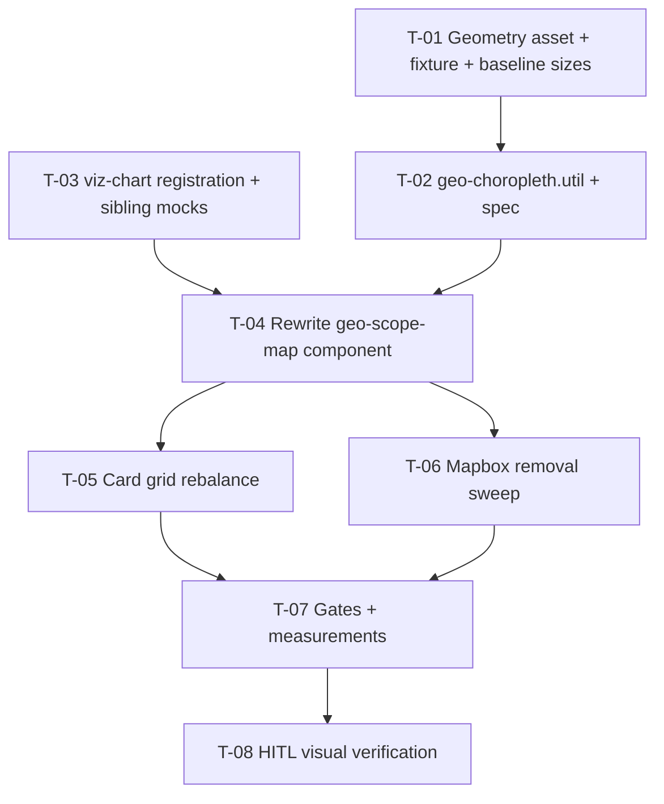

# Tasks — Changes / Geo Map Replacement (`leaflet-geo-map`)

- **Module:** changes (STAR client)
- **Spec id:** 2026-08-leaflet-geo-map
- **Status:** not-started
- **Owner:** j.cadavid@cgiar.org
- **Linked requirements:** ./requirements.md
- **Linked design:** ./design.md
- **Last updated:** 2026-08-22
- **Budget (from design §Step 2.4):** 8 tasks · ~650 net LOC · 1–2 review rounds — exceeding it is an escalation, not a silent continuation

---

## 1. Dependency graph

T-01, T-02, T-03 are parallel-safe with each other except T-01→T-02 (the util's coverage test needs the asset + fixture). All work is client-package-only — the §4.3 concurrency rule allows at most one full-suite run at a time.

---

## 2. Task list

### T-01 — Geometry asset, license note, fixture, baseline measurements

- **Requirements covered:** R-GEO-003 (AC.2 fixture half), NFR-GEO-101 (baseline half), NFR-GEO-104
- **Files touched (intended):**
  - `client/.../geo-scope-map/world-countries.geo.json` (new)
  - `client/.../geo-scope-map/world-countries.README.md` (new)
  - `client/src/app/testing/fixtures/clarisa-country-codes.fixture.ts` (new)
  - `client/tsconfig.json` (only if `resolveJsonModule` is absent)
- **Description:** **First, before any change**, capture the baseline: production `npm run build` output sizes (initial bundle + the project-dashboard lazy chunk), recorded verbatim. Then add a simplified Natural-Earth-derived world GeoJSON (~200–300 kB) co-located with the component, with a README recording source, license (PD), simplification level, and known edition quirks (e.g. `ISO_A2:'-99'` rows). Commit the CLARISA alpha-2 fixture that T-02's coverage test consumes. Wire `resolveJsonModule` if needed and prove a JSON import type-checks.
- **Implementation notes:**
  - The asset must carry an ISO alpha-2 property per feature (design D-GEO-4 keys on it via `nameProperty`).
  - Fixture content: the alpha-2 codes CLARISA serves (obtainable from the dev API or the existing countries interface usage) — a committed snapshot, dated in a comment.
- **Acceptance / done check:**
  - [x] Baseline sizes recorded (numbers + command + date) in the task evidence. **Disqualifier:** a build run while any delegated agent is active in this checkout is not evidence; if repeated builds differ by more than the delta later claimed, record the spread.
  - [x] Asset + README present; README names source, license, simplification, quirks.
  - [x] `npm run build` passes with a trivial JSON import in place. **Failing input (K-004):** import a wrong path once and observe the build redden before trusting it.
- **Dependencies:** none
- **Estimated effort:** S
- **Relevant skills:** `angular-developer`
- **Status:** done

### T-02 — `geo-choropleth.util.ts` + spec (join, exceptions, tableModel)

- **Requirements covered:** R-GEO-003 (AC.1, AC.2 test half, AC.3, both BUT/MUST clauses), R-GEO-005 (AC.1 tableModel completeness), R-GEO-002 (monotonic max-count input)
- **Files touched (intended):**
  - `client/src/app/shared/utils/geo-choropleth.util.ts` (+ `.spec.ts`) (new)
- **Description:** Pure functions: series data from `GeoScopeCountry[]` (alpha-2 join against the geometry's ISO property, exceptions map applied), tableModel builder (ALL rows — matched + unmatched — with caption), max-count. TDD (red first) with the named inputs below.
- **Implementation notes:**
  - Exceptions map is a code-level const here; **no name-based lookup anywhere** (R-GEO-003 `AND IT MUST NOT` — done-check greps the util for `country_name` used as a join key).
  - Coverage test: every fixture alpha-2 resolves to a feature or an exceptions entry.
- **Acceptance / done check:**
  - [x] Named failing inputs observed RED before implementation (K-012/K-004): `{iso_alpha_2:'HK',count:3}` with HK absent from the geometry ⇒ excluded from series, present in tableModel; `FR` when the shipped edition carries `ISO_A2:'-99'` ⇒ red until the exceptions entry exists; `{iso_alpha_2: undefined}` ⇒ excluded without throwing; fake code `XX` added to the fixture ⇒ coverage test reddens (then remove it).
  - [x] Targeted run passes **with `--coverage=false`** (K-020). **Disqualifier:** an exit code from a targeted run without that flag is not a signal in either direction.
  - [x] Grep confirms no join path reads `country_name`.
- **Dependencies:** T-01
- **Estimated effort:** M
- **Relevant skills:** `angular-developer`, `tdd`
- **Status:** done

### T-03 — viz-chart registration extension + sibling mock updates

- **Requirements covered:** R-GEO-005 (AC.2 wrapper contract intact), requirements §5 "broken echarts mocks" defect class
- **Files touched (intended):**
  - `client/src/app/shared/components/viz-chart/viz-chart.component.ts`
  - `client/src/app/shared/components/viz-chart/viz-chart.component.spec.ts`
  - `client/.../results-trend-card/results-trend-card.component.spec.ts`
  - `client/.../sp-alignment-graph/sp-alignment-graph.component.spec.ts`
- **Description:** Add `MapChart` + `GeoComponent` to the single `echarts.use([...])` site and extend the `EChartsOption` ComposeOption union. Update the three spec files whose `jest.mock('echarts/core', …)` factories must now expose the new modules and `registerMap`.
- **Acceptance / done check:**
  - [x] The import-time failure of the unmocked suites is **observed red first** (K-004): run the three suites after the `use([...])` edit and before the mock edit; capture the failure verbatim.
  - [x] After mock updates, the three suites pass; `viz-chart.component.spec.ts` still asserts SVG-renderer init and the tableModel pairing rule **unmodified in behavior** (presence of the new mock members is the only spec change — a presence edit, not a behavioral one; the pairing-rule assertions are the behavioral proof).
  - [x] `npm run build` passes (union extension type-checks).
- **Dependencies:** none
- **Estimated effort:** S
- **Relevant skills:** `angular-developer`
- **Status:** done

### T-04 — Rewrite `geo-scope-map` component (+ new spec)

- **Requirements covered:** R-GEO-001 (config-error path removal), R-GEO-002 (AC.1, both BUT/MUST clauses), R-GEO-004 (AC.1, both BUT/MUST clauses), R-GEO-005 (AC.2, `BUT NOT requireTable=false`), R-GEO-006 (AC.1, AC.2, "must NOT blank pane")
- **Files touched (intended):**
  - `client/.../geo-scope-map/geo-scope-map.component.{ts,html,scss}` (rewrite)
  - `client/.../geo-scope-map/geo-scope-map.component.spec.ts` (new)
- **Description:** Thin presenter per design §5–6: idempotent `registerMap` guard, computed option object (map series, continuous visualMap over the `chartTokens()` ramp, `var(--ac-grey-*)` neutrals, tooltip name+count, `roam:false`), computed tableModel via T-02's util, `<app-viz-chart>` host. Same selector + `countries` input (D-GEO-3). All Mapbox code paths, inner states, and `::ng-deep .mapboxgl-*` styles deleted with the rewrite.
- **Implementation notes:**
  - `DarkModeService.darkMode()` is a **method returning a Signal** — call it once, pass the signal to `chartTokens()`.
  - Guard empty-token strings per the `chartTokens()` no-fallback contract, as existing consumers do.
  - Option object is complete every recompute (wrapper uses `notMerge: true`).
- **Acceptance / done check:**
  - [ ] Spec asserts on the **generated option object** (KZ-001), not on call sequences: ramp array present in visualMap, series contains exactly the ISO-matched countries and no no-data entries, tooltip formatter output for a sample row, `roam:false`.
  - [ ] **KZ-015 transition fixture:** construct with `countries=[]` first `detectChanges()`, assert no chart options emitted; **then** set data and assert the chart appears. Same pattern for the theme flip: light first, assert, flip signal, assert recomputed values.
  - [ ] Spec proves: empty input ⇒ null options (no chart); theme-signal flip ⇒ option recomputed with re-resolved tokens. **Presence caveat declared:** these are option-object proofs; whether ECharts paints them is T-08's HITL scope, not this task's.
  - [ ] Template passes `tableModel` and does **not** set `requireTable` to false (grep of the template).
  - [ ] `geo-scope-card.component.spec.ts` passes **unmodified** (R-GEO-006 AC.1 / R-GEO-008 AC.1 by construction).
  - [ ] Strings "Check the Mapbox access token" and "No geographic points could be resolved" absent from the component files.
- **Dependencies:** T-02, T-03
- **Estimated effort:** L
- **Relevant skills:** `angular-developer`, `ui-ux-pro-max`
- **Status:** todo

### T-05 — Card grid rebalance (D-GEO-5)

- **Requirements covered:** R-GEO-008 (AC.1, the `AND IT MAY` grid clause, "must NOT modify service"), R-GEO-006 ("keep retry affordance")
- **Files touched (intended):**
  - `client/.../geo-scope-card/geo-scope-card.component.html` (grid classes only)
- **Description:** Rebalance the xl two-column grid so the map pane gets ≥ 50% (today `minmax(280px,.5fr)` vs `1.6fr`), keeping the summary + three ranked lists workable. Exact fractions tuned at T-08.
- **Acceptance / done check:**
  - [ ] Diff touches only grid/layout classes in this template — no `.ts`, no service, no list markup. **Disqualifier:** any diff outside the grid container invalidates this task's "layout-only" claim.
  - [ ] `geo-scope-card.component.spec.ts` passes unmodified; retry button markup untouched.
  - [ ] **Declared gap:** jsdom cannot measure the resulting layout — final proportions are verified only at T-08 (HITL).
- **Dependencies:** T-04
- **Estimated effort:** S
- **Relevant skills:** `angular-developer`, `ui-ux-pro-max`
- **Status:** todo

### T-06 — Mapbox removal sweep

- **Requirements covered:** R-GEO-007 (all ACs + both BUT/MUST clauses), R-GEO-001 (AC.2, "no new npm dependency"), R-GEO-006 (AC.3)
- **Files touched (intended):**
  - `client/package.json` + `package-lock.json` (drop `mapbox-gl`)
  - `client/angular.json` (drop the `mapbox-gl.css` global style — initial bundle)
  - `client/src/app/shared/services/mapbox-geocoding.service.ts` + `.spec.ts` (delete)
  - `client/src/app/shared/utils/geo-scope-map.util.ts` + `.spec.ts` (delete)
  - `client/src/app/shared/constants/country-centroids.constants.ts` (trim: remove `GEO_SCOPE_MAP_STYLE`, `COUNTRY_CENTROIDS`, `getCountryCentroid`; **retain `PROJECT_DASHBOARD_DEFAULT_LIMIT`**)
  - `client/src/environments/environment.example.ts` (remove the two Mapbox fields)
- **Description:** Execute the requirements §R-GEO-007 removal inventory exactly. The inventory is scout-verified complete; do not improvise additions or skip entries.
- **Acceptance / done check:**
  - [ ] `grep -ri "mapbox" client/research-indicators/src client/research-indicators/angular.json client/research-indicators/package.json` ⇒ zero hits. **Failing input:** the grep is proven able to fail by running it before the sweep (it is red now by construction — capture that red).
  - [ ] `PROJECT_DASHBOARD_DEFAULT_LIMIT` still resolves: `npm run build` green after `npm ci` on the pruned lockfile.
  - [ ] `docs/specs/archive/**` untouched (git status shows no archive diff).
  - [ ] Gitignored local `environment*.ts` explicitly NOT edited (they are developer-local; note stands in design §11). **Declared gap:** the grep cannot reach them — recorded, accepted.
- **Dependencies:** T-04
- **Estimated effort:** M
- **Relevant skills:** `angular-developer`
- **Status:** todo

### T-07 — Gates + generated-output measurements

- **Requirements covered:** NFR-GEO-101, NFR-GEO-102, NFR-GEO-103 (tokens half), R-GEO-002 (AC.2), R-GEO-008 (AC.2), requirements §5 type-gate rows
- **Files touched (intended):** none (verification only; evidence recorded in `execution.md` at execute time)
- **Description:** Run the full gate set over the finished tree and record the measurements the requirements demand.
- **Acceptance / done check:**
  - [ ] `npm run build` green; budget output captured; **initial bundle ≤ baseline** (mapbox CSS left it) and project-dashboard chunk delta recorded vs T-01 baseline, both directions. **Disqualifier:** sizes measured while any delegated agent runs, or with spread exceeding the claimed delta, are not evidence — report the spread instead.
  - [ ] Sentinel grep in `dist/`: a known geometry feature string found in the built dashboard chunk (NFR-GEO-102, KZ-001 — assert in generated output). **Failing input:** temporarily remove the geometry import and observe the grep return empty / the build redden; restore.
  - [ ] Full `npm test` green (single run, no parallel suites — §4.3).
  - [ ] `npx tsc -p tsconfig.spec.json --noEmit` — error count ≤ the 945 baseline (a rising count is the failure signal; "clean" is not the bar).
  - [ ] `npm run tokens:validate` green. **Declared scope (KZ-017):** it enforces ramp monotonicity only; contrast is printed, not enforced — contrast lands on T-08.
  - [ ] `git diff --stat origin/main -- server/` empty (R-GEO-008 AC.2).
- **Dependencies:** T-05, T-06
- **Estimated effort:** S
- **Relevant skills:** `systematic-debugging` (on any red)
- **Status:** todo

### T-08 — HITL visual verification (dominant defect class)

- **Requirements covered:** R-GEO-001 (AC.1, AC.3, "fresh checkout renders"), R-GEO-002 (AC.3, "must NOT color no-data countries" — visual half), R-GEO-004 (AC.2), NFR-GEO-103 (contrast half), D-GEO-5 final proportions
- **Files touched (intended):** possibly `geo-scope-card.component.html` (final grid fractions only, within T-05's scope rule)
- **Description:** Human check in a real browser (`npm start`, a project with geo data): choropleth paints; shading order matches counts; tooltip shows name+count; no-data countries neutral; **both themes** legible (ramp contrast against the card surface); grid proportions sane at xl and at the `md:` constrained breakpoint; network panel shows only same-origin requests during card load.
- **Acceptance / done check:**
  - [ ] Each item above observed and recorded (screenshots or explicit per-item confirmation) in the task evidence — **KZ-014: this task's checkbox, and any spec-level done claim, may not be marked from green suites alone while this check is pending.** This is the declared substitute gate for the visual defect class (requirements §5).
  - [ ] Dark-mode pass explicitly includes the visualMap legend text and tooltip readability.
  - [ ] **Disqualifier:** a check run against a project with empty geo data verifies nothing about shading — the evidence must name the project/contract used and its non-empty counts.
- **Dependencies:** T-07
- **Estimated effort:** S
- **Relevant skills:** `ui-ux-pro-max`
- **Status:** todo

---

## 3. Coverage closure (scenario / clause → owning task)

| Requirement clause | Owner |
|---|---|
| R-GEO-001 fresh-checkout renders / AC.1 | T-08 (visual) on T-04's implementation |
| R-GEO-001 no external requests / AC.3 | T-08 (network panel) |
| R-GEO-001 `BUT NOT` config-error path / grep AC.2 | T-04 (code path gone) + T-06 (grep) |
| R-GEO-001 `AND IT MUST` no new npm dependency | T-06 (lockfile) + T-07 (build after `npm ci`) |
| R-GEO-002 shading + tooltip / AC.1 | T-04 (option object) |
| R-GEO-002 `BUT NOT` color no-data countries | T-04 (series content assertion) + T-08 (visual) |
| R-GEO-002 `AND IT MUST` monotonic ramp / AC.2 | T-02 (max-count) + T-07 (`tokens:validate`) |
| R-GEO-002 AC.3 visual order | T-08 |
| R-GEO-003 AC.1 (HK fixture) / AC.3 (undefined code) | T-02 |
| R-GEO-003 AC.2 fixture coverage | T-01 (fixture) + T-02 (test) |
| R-GEO-003 `BUT NOT` throw/blank/wrong-shade | T-02 (no-throw) + T-04 (render with partial series) |
| R-GEO-003 `AND IT MUST NOT` runtime name matching | T-02 (grep done-check) |
| R-GEO-004 AC.1 theme recompute | T-04 |
| R-GEO-004 AC.2 both themes legible | T-08 |
| R-GEO-004 `BUT NOT` isDarkMode branch / `MUST NOT` hex literals | T-04 (done-check grep of component files) |
| R-GEO-005 AC.1 tableModel completeness | T-02 (builder) + T-04 (wiring) |
| R-GEO-005 AC.2 pairing rule intact / `BUT NOT` requireTable=false | T-03 (wrapper spec) + T-04 (template grep) |
| R-GEO-005 `AND IT MUST` unmatched rows in table | T-02 |
| R-GEO-006 AC.1 card spec unmodified | T-04 |
| R-GEO-006 AC.2 error ⇒ no chart | T-04 |
| R-GEO-006 AC.3 strings gone | T-04 (component) + T-06 (repo-wide grep) |
| R-GEO-006 `BUT NOT` blank pane / `MUST` retry affordance | T-04 (empty test) / T-05 (retry untouched) |
| R-GEO-007 all ACs + `BUT NOT` centroids wholesale + `MUST` archive untouched | T-06 |
| R-GEO-008 AC.1 lists unchanged | T-04 + T-05 (spec unmodified) |
| R-GEO-008 AC.2 no server diff / `BUT NOT` service change | T-07 |
| R-GEO-008 `AND IT MAY` grid only | T-05 (+T-08 final fractions) |
| NFR-GEO-101 | T-01 (baseline) + T-07 (after) |
| NFR-GEO-102 | T-07 (sentinel grep) |
| NFR-GEO-103 | T-07 (monotonicity) + T-08 (contrast) |
| NFR-GEO-104 | T-01 (README) |

No orphan clauses; no clause discharged by citing a different requirement.

---

## 4. Testing expectations

- New specs: `geo-choropleth.util.spec.ts`, `geo-scope-map.component.spec.ts`. Updated: `viz-chart.component.spec.ts` + 2 sibling mocks. Deleted: `mapbox-geocoding.service.spec.ts`, `geo-scope-map.util.spec.ts`.
- Coverage floors are the global client thresholds; the deletions remove well-covered files — T-07's full run confirms floors still hold.
- Every red-before-green input is named inside its task (K-012). Targeted runs always `--coverage=false` (K-020). Site lists for expectation realignment come from the failing run, not grep (K-018) — relevant in T-03.

## 5. Execution conventions

Per template §6: one PR per boundary below; commit style `<type>(<module>): <subject>`; branch stays `bilateral-visual-improvements` unless the lead says otherwise; hooks never bypassed.

**PR strategy:** two PRs recommended. **PR 1 — enablement (inert):** T-01 + T-02 + T-03 (asset, util, wrapper registration — nothing user-visible changes; the big JSON lands here so it does not drown the behavioral review). **PR 2 — swap + removal:** T-04…T-08 (atomic replacement; old and new never coexist). PR descriptions follow `cognitive-doc-design` review-empathy rules: what to review first, what is out of scope, link previous/next PR.

## 6. Risks & blockers log

| # | Date | Risk / Blocker | Mitigation | Owner | Status |
|---|---|---|---|---|---|
| RB-1 | 2026-08-22 | Geometry edition quirks (`ISO_A2:'-99'`) surface late | T-02's named failing input forces the exceptions entry before implementation completes | Implementer | open |
| RB-2 | 2026-08-22 | Full-suite runs colliding with parallel agents produce phantom failures (§4.3) | T-07 runs in the post-worker window, single suite at a time | Leader | open |

## 7. Done definition

- [ ] All T-01…T-08 done (T-08 requires recorded human observation — KZ-014).
- [ ] All requirement ACs checked; coverage matrix above has no orphan.
- [ ] Coverage floors green; `tsc` spec baseline not exceeded; budgets hold with recorded sizes.
- [ ] Rollout note honored: no flag; DevOps token-provisioning note delivered at release.
