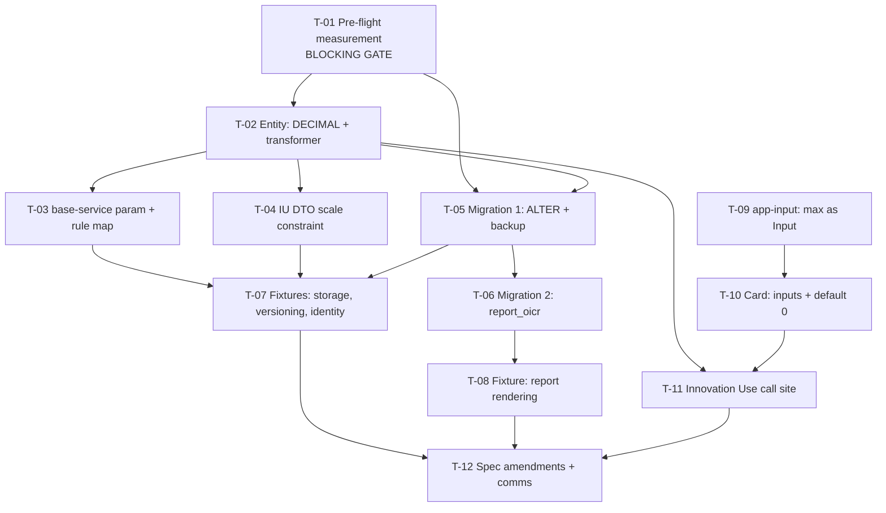

# Tasks — Results / Measure `Number` accepts signed decimals

- **Module:** results
- **Spec id:** `changes/measure-number-signed-decimal`
- **Status:** not-started
- **Owner:** <name / squad>
- **Linked requirements:** [./requirements.md](./requirements.md)
- **Linked design:** [./design.md](./design.md)
- **Judgment ledger:** [./judgment.md](./judgment.md) — **frozen at round 4; no further rounds authorized**
- **Depth:** Full
- **Last updated:** 2026-08-27

---

## 0. Read this before starting a task

**`design.md` is authoritative wherever it and `requirements.md` disagree.** That is the binding condition of the 2026-08-26 acceptance and it has not been lifted.

Four things bite, and they are the reason this spec is `Full` depth:

| # | |
| --- | --- |
| **A** | **`T-01`'s pre-flight is BLOCKING.** Two queries, not one. If either returns a disqualifying row, the change **stops** for a human ruling. It is not a formality and it is not confirmatory |
| **B** | **Code first, migrations second, never the reverse.** Applying the `ALTER` before `T-02`'s transformer ships puts a `DECIMAL` string on the wire with no normaliser → `400` on the Innovation Use path and **silent row replacement** on the OICR path (`DC-16`) |
| **C** | **The migration is applied by a human.** The pipeline deploys code but **not** migrations (`K-015`). Merging does not ship this schema |
| **D** | **Run every `/akili-*` command with cwd = `alliance-research-indicators-main`.** From `-management` the `akili-*` model wrappers and the `akili-tasks-gate` hook silently do not load — this actually happened during round 4 and is recorded in the ledger |

**`id ≠ level`** and the other family traps in `docs/specs/innovation-use/family.md` still bind.

---

## 1. Task numbering

`T-01` … `T-12`. Higher numbers do not imply higher priority — see §2.

---

## 2. Dependency graph

**PR boundary.** `T-01`…`T-08` are **PR 1 (server)**; `T-09`…`T-12` are **PR 2 (client + closure)**. `T-11` depends on `T-02`'s transformer existing, so PR 2 lands after PR 1.

---

## 3. Task list

### T-01 — Execute the blocking pre-flight and record its verbatim output

- **Requirements covered:** `NFR-MSD-002`; gates `R-MSD-011` AC.7
- **Design references:** `design.md` §11, `RK-4`, `RK-14`, `U-2`, `U-9`
- **Files touched (intended):** `execution.md` only — **no source file**
- **Description:** Run both pre-flight queries against the target database and paste the output verbatim into `execution.md`. This task can **stop the spec**. It exists because two of `design.md`'s numeric premises are unknowable from the repo.
- **Implementation notes:**
  - Query 1 — magnitude: `SELECT COUNT(*), MIN(quantification_number), MAX(quantification_number), MAX(LENGTH(TRIM(LEADING '-' FROM quantification_number))) FROM result_quantifications;`
  - Query 2 — **sign, by role** (added at round 4): `SELECT quantification_role_id, COUNT(*) FROM result_quantifications WHERE quantification_number < 0 GROUP BY quantification_role_id;`
  - Query 1 has **no role filter**, which is precisely why query 2 is not redundant: a global `MIN` cannot say *which* role holds it.
- **Acceptance / done check:**
  - [ ] Both queries executed against the target DB; **output pasted verbatim**, not summarised, not derived.
  - [ ] **STOP CONDITION 1** — any role-3 row with `|value| > 549,755,813,887` halts the change for a human ruling (`RK-4`).
  - [ ] **STOP CONDITION 2** — any role-1 or role-2 row with a negative value halts the change for a human ruling (`RK-14`). Such a row would `400` on a save its reporter never made.
  - [ ] The row count and `ALGORITHM=COPY` implication are recorded for `T-05`'s lock-window estimate (`U-2`).
- **What disqualifies this evidence:** a query run against a **local scratch schema** instead of the target database measures nothing — the whole point is live data. If the target DB is unreachable, this task is **BLOCKED**, not passed; record "unreachable" and stop. A summarised result ("no negatives found") without the pasted output is a `KZ-008` claim, not a measurement.
- **Input that would make this check FAIL:** seed a negative role-1 row and a role-3 row at `549,755,813,888` in a scratch copy and re-run — both stop conditions must fire. **If neither fires, the queries are not evidence.**
- **Dependencies:** none
- **Estimated effort:** S · **Skills:** none (DBA/DevOps coordination)
- **Status:** todo

---

### T-02 — Entity: `DECIMAL(24,4)` column + two-way null-safe transformer

- **Requirements covered:** `R-MSD-003` (scenario *An untouched measure row does not break the save*, `:256`, `:257`), `R-MSD-009`, `R-MSD-013`
- **Design references:** `DD-1`, `DD-2`, §5.3, §5.4
- **Files touched (intended):** `server/.../result-quantifications/entities/result-quantification.entity.ts`; `server/.../result-innovation-use/result-innovation-use.service.ts` (the `:287-288` doc comment only, `K-24`)
- **Description:** Change the column to `DECIMAL(24,4) NULL` and add a two-way, null-safe `transformer`. This is the single most load-bearing task in the spec: without it an untouched row `400`s **and** the upsert's composite key stops matching, replacing rows silently.
- **Implementation notes:**
  - **`null` must map to `null`, never `0`.** TypeORM applies the transformer to null *before* any type branch (`MysqlDriver.js:510-514`); a naive `Number(v)` breaks the `null ≠ 0` invariant, `quantificationRowAbsent`, and three ACs (`J-23`).
  - **Specify the `to` direction as well** — `upsertByCompositeKeys` re-saves hydrated entities, so it runs on every save of an unchanged row (`J-24`).
  - Do **not** use `decimalNumbers: true` on the datasource: seven existing `DECIMAL` columns plus every raw query are in that blast radius (`J-16`).
  - `bilateral.service.ts:669-686` is the in-repo precedent for the null-safe coercion shape.
- **Acceptance / done check:**
  - [ ] `null` round-trips as `null` in **both** directions, asserted separately per direction.
  - [ ] A read value resent verbatim does not `400` — exercised with a value **from a real read**, never a literal (`:257`, `DD-19`, **K-012**).
  - [ ] `String(value)` composite-key construction produces the **same key** before and after, for an unchanged row.
  - [ ] The `:287-288` doc comment no longer contradicts §5.4.
- **What disqualifies this evidence:** a unit test using a **mocked repository** proves nothing here — the defect lives in the driver's hydration type, which a mock supplies by fiat. Mocked-repo tests are allowed as fast feedback but **may not close** this task; `T-07`'s fixture is the gate.
- **Input that would make this check FAIL:** delete the `from` direction and the untouched-row test must `400`; delete the `to` direction and the composite key must change on resave; return `0` for null and `quantificationRowAbsent` must redden. **If any of those three still passes, the test is asserting the mock.**
- **Dependencies:** T-01
- **Estimated effort:** M · **Skills:** `nestjs-expert`, `tdd`
- **Status:** todo

---

### T-03 — `base-service.ts` optional `dataRole` + `createCustomValidation` override with the per-role rule map

- **Requirements covered:** `R-MSD-011` (all ACs, and scenario *The API stops silently rounding*, `:495`), `R-MSD-007`
- **Design references:** `DD-13` (**v4**), `RK-13`, `RK-14`, `RK-15`, `U-12`
- **Files touched (intended):** `server/.../shared/global-dto/base-service.ts`; `server/.../result-quantifications/result-quantifications.service.ts`; `server/.../result-quantifications/result-quantifications.service.spec.ts`
- **Description:** Add an **optional** `dataRole` second parameter to `createCustomValidation`, forward it from both existing call sites, and override the hook in `ResultQuantificationsService` with a per-role rule map. **This is the round-4 repair of `M-01`** — v3 named a seam that receives no role, so a payload-keyed map would have rejected every role-3 value this spec exists to enable.
- **Implementation notes:**
  - `base-service.ts:279-281` declares one parameter today. The role reaches the base only as `upsertByCompositeKeys`'s `dataRole`, attached to rows at `:354-355` — **after** the hook. Forward it at **`:134` and `:345`**.
  - **Additive by construction:** `grep -rn "createCustomValidation" src` → exactly `:134`, `:278`, `:345`, **no override anywhere**. Confirm this again before editing; if an override has appeared, this task's safety argument is void.
  - **The rule must key on the PARAMETER, never on a `quantification_role_id` in the payload.** `update-oicr.dto.ts` types its arrays as the full entity and its controller applies **no pipe**, so a payload-keyed map lets a client send `quantification_role_id: 3` and buy the permissive rule.
  - **Rule map:** default (roles 1, 2, any future role) = non-negative integer. Role 3 = signed, ≤ 4 decimals, within `DD-14`'s bound.
  - **Null contract:** `null`/`undefined` are accepted and skipped by **every** entry including the default (`R-MSD-011` AC.6).
- **Acceptance / done check:**
  - [ ] Role 3 accepts `-12.75`; roles 1 and 2 reject it `400`. Both asserted through `upsertByCompositeKeys`, **not** by calling the override directly.
  - [ ] `null` is accepted on **every** role, asserted per role.
  - [ ] The rule is selected from `dataRole`; a payload carrying `quantification_role_id: 3` on an OICR call is **still** validated as role 1 (`R-MSD-011` AC.2).
  - [ ] `git diff --exit-code` is clean for every file under `result-oicr/` (`R-MSD-011` AC.3).
  - [ ] Existing `base-service` consumers are unaffected — full server suite green.
- **What disqualifies this evidence:** asserting on a **call sequence** — "`createCustomValidation` was called with X" — proves the mock's wiring, not the rejection (**KZ-001**). The assertion must be on the thrown `400` / the persisted row. A test that calls the override directly bypasses the very forwarding this task adds and would stay green if `:134`/`:345` were never touched.
- **Input that would make this check FAIL:** revert the `dataRole` forwarding at `:345` — the role-3 acceptance test must redden (the map falls to the default and rejects `-12.75`). **If it still passes, the test is not exercising the seam.** Separately: send `quantification_role_id: 3` in an OICR payload; if that buys the permissive rule, the map is payload-keyed and the task is not done.
- **Declared and NOT fixed here:** `RK-13` (`updateOicr` is not transactional, so this `400` lands on a partially-committed update) and `RK-15` (`upsertQuantificationsByRole` bypasses the base class). Both are out of scope; do not silently fix either, and do not claim the guarantee is absolute.
- **Dependencies:** T-02
- **Estimated effort:** M · **Skills:** `nestjs-expert`, `tdd`, `error-handling-patterns`
- **Status:** todo

---

### T-04 — Innovation Use DTO: custom scale + range constraint, with the mandated evaluation order

- **Requirements covered:** `R-MSD-003` (scenario *The relaxation does not leak to the siblings*, `:265`, `:266`), `R-MSD-007`
- **Design references:** `DD-8`, `DD-17`, `DC-15`
- **Files touched (intended):** `server/.../result-innovation-use/dto/create-result-innovation-use.dto.ts` + its spec
- **Description:** Remove `@Min(0)` / `@IsInt()` from `quantification_number` **only**, and add a custom constraint whose four steps run in a mandated order. The six sibling count fields keep their decorators untouched.
- **Implementation notes:**
  - **Do not use `@IsNumber({ maxDecimalPlaces })`.** `class-validator` does `value.toString().split('.')[1].length`, which throws `TypeError` on exponential notation — a **`500`** where `@IsInt()` returned a clean `400` (`J-15`).
  - **Mandated order, each step gating the next:** ① reject non-`number`; ② reject non-finite; ③ reject outside `DD-14`'s bound — **this must precede any string conversion**, or `1e21` reproduces the very `TypeError` the constraint exists to remove; ④ only then derive the scale, and **not** via `toFixed` at high precision (`(2.55).toFixed(20)` → `"2.54999999999999982236"` rejects a legal value; `(1e-7).toFixed(4)` → `"0.0000"` silently rounds to zero).
  - The crash condition is **not** "any `|value| < 1e-6`": `1.5e-7` returns `true` today and is accepted (`K-05`).
  - Follow `IsActorCountModeExclusiveConstraint` in the same file.
- **Acceptance / done check:**
  - [ ] `1e-7`, `-1e-7` and `1e21` each return a clean **`400`**, never a `500` (`DC-15`).
  - [ ] `2.55` is **accepted** — the `toFixed` trap does not fire.
  - [ ] The `400` for a sibling field names `actors_count` and **does not** name `quantification_number` (`:265`, `:266`).
  - [ ] All **six** sibling count fields still reject `2.5`, asserted per field, not as a group.
  - [ ] The four steps are asserted **in order** — a test that only checks the end result would pass with steps ③ and ④ swapped, which is the `500` bug.
- **What disqualifies this evidence:** a single "rejects bad input" test that does not distinguish `400` from `500` cannot see `DC-15` at all — the status code **is** the defect. Assert the status, not merely that it threw.
- **Input that would make this check FAIL:** swap steps ③ and ④ and send `1e21` — the response must become a `500` and the test must redden. **If it stays green, the order is not actually asserted.**
- **Dependencies:** T-02
- **Estimated effort:** M · **Skills:** `nestjs-expert`, `tdd`, `error-handling-patterns`
- **Status:** todo

---

### T-05 — Migration 1: backup table → `ALTER` → whole-table diff

- **Requirements covered:** `NFR-MSD-001`, `R-MSD-004`
- **Design references:** `DD-1`, `DD-18`, `AR-2`, `U-2`
- **Files touched (intended):** `server/.../db/migrations/<ts>-alterQuantificationNumberToDecimal.ts`
- **Description:** Create a backup table, `ALTER` the column to `DECIMAL(24,4) NULL`, then diff the whole table. `p − s = 20 > 19` makes the `ALTER` lossless **by construction** for any `bigint`, so the backup is not a restore path for `up()` — it is the **only honest restore path for `down()`**, which rounds fractions and can **fail** on a wide value.
- **Implementation notes:**
  - ⚠️ A type change requires **`ALGORITHM=COPY`** — a full table rebuild that **locks writes** and needs disk headroom. On the shared Dev database that is an operational event; use `T-01`'s row count to size the window and tell DevOps before running.
  - Chosen over an in-table temporary column, which lives inside the table the `ALTER` rebuilds and forces three rebuilds instead of one.
  - The backup table is **retained until sign-off**, not dropped in the same migration.
- **Acceptance / done check:**
  - [ ] `up()` executed on a scratch schema; whole-table diff shows **zero** value changes.
  - [ ] `down()` executed and **its lossiness demonstrated, not asserted**: a fractional value rounds, and a value wider than a signed `bigint` makes it **fail** (`AR-2`, `R-MSD-004` AC.4).
  - [ ] Restoration from the backup table executed **at least once** (`R-MSD-004` AC.5) — a bare `down()` cannot recover a fraction.
  - [ ] Migration ordering places this **before** migration 2.
- **What disqualifies this evidence:** running `up()` on an **empty** scratch schema proves the DDL parses, not that it is lossless — a diff over zero rows is vacuously clean. Seed representative rows (including `NULL`, a negative, and a 19-digit value) **before** the diff, or the check has evaluated nothing.
- **Input that would make this check FAIL:** seed `9223372036854775807`, run `down()` — it must fail rather than silently truncate. Seed `2.5`, run `down()` — the value must round, and the backup-table restore must be what recovers it.
- **Dependencies:** T-01, T-02
- **Estimated effort:** L · **Skills:** `nestjs-expert`
- **Status:** todo

---

### T-06 — Migration 2: recreate `report_oicr` with `DD-10`'s expression

- **Requirements covered:** `R-MSD-010`
- **Design references:** `DD-10`, §9.1, §9.2, `U-1`, `U-3`, `U-5`, `U-8`, `OQ-1`
- **Files touched (intended):** `server/.../db/migrations/<ts>-normaliseQuantificationNumberInReportOicr.ts`
- **Description:** Recreate the `report_oicr` view using the expression written out in §9.2, so an OICR export does not start rendering `10.0000` where it rendered `10`. **~200 lines of view SQL — the higher-risk of the two migrations**, because it embeds an expression that cannot be edited after deploy (**ADR-5**).
- **Implementation notes:**
  - ⚠️ **`OQ-1` is open and gates `R-MSD-010` AC.3.** Recommendation on file is *ship it*; get the ruling before merging, not after.
  - **Transcribe the live view before writing about it** (`DD-10`, `D-10`). `U-3`: only the migration ordering is verified — a `SHOW CREATE VIEW` at rollout settles whether the live body matches `1780694172676`'s text.
  - `U-8` is **unsettled**: the charset/collation of the two `IF()` branches inside `CONCAT_WS`. The live view already needs `convert(report_field(...) using utf8mb3)` on another column (`baseline.sql:8080`) — direct evidence that collation aggregation here is not safely assumable. Resolve it against real MySQL in `T-08`, not by reasoning.
  - Needs nothing above MySQL 8.0.4; `OQ-D5` no longer gates this.
- **Acceptance / done check:**
  - [ ] `SHOW CREATE VIEW report_oicr` captured **before** the migration and pasted into `execution.md` (`U-3`).
  - [ ] `down()` restores the previous body byte-for-byte, verified by comparing the captured text.
  - [ ] Collation of the `CONCAT_WS` result asserted from an executed query, not assumed (`U-8`).
  - [ ] `OQ-1` ruling recorded before merge.
- **What disqualifies this evidence:** §9.2's expected renders are **predicted, not executed** (`U-1`, `U-5`) — no MySQL was reachable to any of the eight judges. **Reasoning about `DECIMAL` formatting is explicitly disqualified** as evidence by `:461`. Until `T-08` runs the query, this task's rendering claims are unverified and must be labelled so.
- **Input that would make this check FAIL:** run the trim expression against a `bigint` column — `'10'` must render `'1'`, demonstrating `DC-14`. **If it does not, the expression is not the one under test.**
- **Dependencies:** T-05
- **Estimated effort:** L · **Skills:** `nestjs-expert`
- **Status:** todo

---

### T-07 — Fixtures: storage, the `SP_versioning` copy path, and row identity on both paths

- **Requirements covered:** `R-MSD-004` (`:297`, `:298`), `R-MSD-005` (`:327`, `:328`), `R-MSD-013` (`:545`, `:546`), `R-MSD-003` (`:256`, `:257`)
- **Design references:** `DD-9`, `DD-19`, `DD-20`, `RK-9`, `DC-16`, `DC-13`
- **Files touched (intended):** `test/fixtures/.../innovation-use-section-round-trip.fixture-spec.ts`; `test/fixtures/.../innovation-use-lifecycle-routines.fixture-spec.ts`; **new** `test/fixtures/innovation-use/oicr-quantification-save.fixture-spec.ts`
- **Description:** The fixture tier is where this spec's real risk lives — `DC-16` (silent row replacement) is observable at no tier below it. Three concerns: the value survives MySQL, it survives `SP_versioning`'s copy path, and an unmodified save does not churn rows on **either** write path.
- **Implementation notes:**
  - **Untouched-row fixture must save → read → resave unmodified, seeded from the read.** A hand-written literal is always the right type and could never go red (**K-012**, `DD-19`).
  - **The copy-path comparison must be multi-row-aware and state its matching key.** `result_quantifications` holds several rows per result, including deactivated ones — match on `(result_id, quantification_role_id, unit, description)`, **never** on the value, which is what is under test (`DD-20`, `K-20`).
  - Only **`SP_versioning`'s copy path** names this column (`:367`, `:380`). The other three routines reference the table only, so they can orphan rows but cannot lose a value (`J-11`).
  - ⚠️ **The OICR fixture must EXPECT `L-08`**, not be surprised by it: `oicr-details.component.ts` sends `q.number ?? 0` while its read preserves `null`, so a `NULL`-valued OICR row churns on save even with `DD-2`. **Pre-existing client defect; this spec reports it and does not fix it.**
- **Acceptance / done check:**
  - [ ] `-12.75` stored and re-read as `-12.75` — not `3`, `2`, or `2.5000` re-read differently (`:297`).
  - [ ] The versioned row holds `-12.75`, read **out of MySQL** on both sides (`:328`), matched on the four-column key.
  - [ ] An unmodified save changes **no** primary key and deactivates **no** row, on **both** the IU and OICR paths (`:545`).
  - [ ] Every value under test is **seeded from a real read** (`:546`, `:257`).
  - [ ] The `NULL`-valued OICR churn is asserted as **expected** behaviour with a comment naming `L-08`.
- **What disqualifies this evidence:** a fixture that asserts `toHaveLength(1)` against `result_quantifications` is asserting a false premise — the table holds several rows per result (`J-20`). A green run against a schema that was **not** rebuilt from `baseline.sql` may be testing a stale view or a pre-migration column; rebuild first or the run is not evidence. **Routine bodies are not to be diffed** — `:327` explicitly disqualifies a body diff, because the body does not change.
- **Input that would make this check FAIL:** remove the entity transformer and re-run — the untouched-row save must `400` **and** the composite keys must change. **If either stays green, the fixture is not reaching the defect.** For the copy path: match on the value instead of the four-column key and the test must become vacuous.
- **Dependencies:** T-03, T-04, T-05
- **Estimated effort:** L · **Skills:** `tdd`, `nestjs-expert`
- **Status:** todo

---

### T-08 — Fixture: `report_oicr` / `report_field` rendering, executed against real MySQL

- **Requirements covered:** `R-MSD-010` (`:461`, `:462`, `:463`)
- **Design references:** `DD-10`, `DD-11`, `DC-7`, `DC-14`, `U-1`, `U-5`, `U-8`
- **Files touched (intended):** **new** `test/fixtures/innovation-use/report-oicr-number-rendering.fixture-spec.ts`
- **Description:** The gate `DC-7` and `DC-14` were wrongly told they could not have. `baseline.sql` ships `report_field` (`:6559`) and the `report_oicr` view into the bootstrapped scratch schema, and fixtures already run raw SQL — so this is automatable, and the human substitute the superseded draft named is withdrawn.
- **Implementation notes:**
  - Cover the **seven** cases from `DD-10`, **including `NULL`** and the `bigint` branch via `migration:test:revert`.
  - `:463` mandates the **`-10.0000`** case specifically — it is the one that distinguishes a `down()`-safe expression from one that is not.
  - This task is what converts `U-1` and `U-5` from *reasoned* to *executed*. Update `design.md` §17 when it does.
- **Acceptance / done check:**
  - [ ] All seven cases executed; **output pasted verbatim** into `execution.md` (`:462`).
  - [ ] The `-10.0000` case present and passing (`:463`).
  - [ ] The `bigint` branch exercised via `migration:test:revert` — `'10'` must render `'1'` on the un-migrated column, demonstrating `DC-14` is real.
  - [ ] `U-8`'s collation question answered from executed output.
  - [ ] `design.md` §17 updated: `U-1` and `U-5` move to verified, or the residue is named.
- **What disqualifies this evidence:** **SQL formatting reasoned about rather than observed is explicitly disqualified** (`:461`). A green run that skipped the `bigint` branch has not tested `DC-14` at all — it tested the happy path and reported success. **A `NULL` case that renders empty and a `NULL` case that was never run look identical in a pass count**; assert the count of cases executed.
- **Input that would make this check FAIL:** run the trim against the `bigint` column — `'10'` → `'1'` must redden the migrated-column expectation. **If nothing reddens, the fixture is not discriminating between the two column types.**
- **Dependencies:** T-06
- **Estimated effort:** M · **Skills:** `tdd`
- **Status:** todo

---

### T-09 — `app-input`: `max` becomes an `@Input`; the character guard is asserted UNCHANGED

- **Requirements covered:** `R-MSD-012` (AC.1, AC.2, AC.4), `R-MSD-006` (`:362`, `:363`, AC.3, AC.5, AC.6)
- **Design references:** `DD-14`, `DD-7` (**withdrawn**), `DD-16`, `RK-16`, `U-10`
- **Files touched (intended):** `client/.../shared/components/custom-fields/input/input.component.ts` + `.spec.ts`
- **Description:** Promote `max` from a plain field to an `@Input()` whose default is today's `Number.MAX_SAFE_INTEGER`. **Nothing else changes in this file** — `DD-7` is withdrawn, so the character guard is not touched, not re-united, and not removed.
- **Implementation notes:**
  - `max` is **already bound** at `input.component.html:47`, and `grep -rn "\[max\]" src --include=*.html` returns **only** that line — no call site binds it, so promotion is inert by construction.
  - **The guard's signal is shared with the `type === 'text'` branch.** Removing it deletes the only user feedback for 40,000-character paste truncation on **every** `app-input` in the app (`L-02`). This is why `DD-7` was withdrawn after three failed versions.
  - `DD-14`'s bound: `max = 2^(53 − ⌈log₂(10^scale)⌉) − 1`. Scale 4 → **549,755,813,887**. Scale 0 lands **exactly** on `Number.MAX_SAFE_INTEGER` as a consequence of the formula, not as a special case.
  - **The three enforcement shapes are asymmetric and must be asserted as such:** `maxFractionDigits` **prevents** (per keystroke); `min` **prevents** (`allowMinusSign()` is `this.min == null || this.min < 0`, `primeng-inputnumber.mjs:1270`); `max` **clamps** (checked on blur/Tab/Enter/spinner only).
- **Acceptance / done check:**
  - [ ] With no binding, `max` is `Number.MAX_SAFE_INTEGER` — asserted on the **real** instance, not a stub (`R-MSD-012` AC.4, **KZ-001**).
  - [ ] The scale→bound table is asserted for all of scales 0–4, with scale 0 falling out of the formula rather than being special-cased (`R-MSD-012` AC.2).
  - [ ] A scale outside `0…4` is rejected as a configuration error, not silently clamped (AC.1).
  - [ ] **The guard is asserted unchanged**: same threshold (18), same unit (**characters**), same `type === 'number'` branch, and the shared `type === 'text'` paste path untouched (`R-MSD-006` AC.5).
  - [ ] **The false positive is PINNED, not denied** (`R-MSD-006` AC.3): no warning for any in-bound value at scales 0–2, and warning **present** for the known 18-character signed values at scales 3–4 — e.g. `-549755813886.9999`.
  - [ ] `max` clamps and `min`/`maxFractionDigits` prevent — each asserted on the **rendered** value, never on the absence of a message (`:363`).
- **What disqualifies this evidence:** a test asserting `component.max === …` on the class instance is a **presence-assertion** — it proves the field's value, not that the template forwards it to PrimeNG. Assert on the rendered input. jsdom **cannot** measure layout or contrast, so nothing here covers `DC-11`; that goes to `T-11`'s HITL gate.
- **Input that would make this check FAIL:** change the guard's threshold from 18 to 19 — the pinned scale-3/4 warning assertions must redden. Remove the `[max]` template binding — the rendered-max assertion must redden. **If either stays green, the test is reading the class, not the DOM.**
- **Dependencies:** none
- **Estimated effort:** M · **Skills:** `angular-developer`, `tdd`
- **Status:** todo

---

### T-10 — `QuantificationItemComponent`: `min` / `max` / `placeholder` inputs, and `maxFractionDigits` defaulting to `0`

- **Requirements covered:** `R-MSD-002` (all ACs, and scenario *OICR keeps its floor because the card's defaults say so*, `:222`, `:223`), `R-MSD-012` (AC.3)
- **Design references:** `DD-4`, `DD-12`, `DD-14`, §6.1, §6.3, `U-4` (**resolved**), `U-11`
- **Files touched (intended):** `client/.../shared/components/quantification-item/*` (`.ts`, `.html`, `.spec.ts`)
- **Description:** Add `min`, `max` and `placeholder` as inputs defaulting to today's literals, add the scale-domain guard, and **change `maxFractionDigits`'s default from `undefined` to `0`**. That default change is why **no OICR file is edited**: OICR passes nothing and receives `0`.
- **Implementation notes:**
  - **This is the one default in the spec whose *value* changes**, and it deliberately turns two currently-green specs red: `quantification-item.component.spec.ts:158` and `:163` assert `toBeUndefined()`. Updating them is in scope and is the visible proof the default moved.
  - **`U-4` was resolved at round 4 and both prior readings were right about different branches:** the keystroke path (`primeng-inputnumber.mjs:1333-1343`) treats `undefined` as falsy and never inserts the separator — decimals are *already* refused when typing; the Intl path (`:834-838`) resolves to 3 and governs formatting and paste. Direction is safe either way: stricter or identical, never looser.
  - `U-11` is **narrowed, not closed** — the rendered end-to-end claim is unverified. `DC-3`'s rendered assertion is the gate.
  - Update the `:29` comment that claims the `undefined` default *"reproduces today's Intl resolution exactly"* — `DD-12` supersedes that intent (`R-MSD-011` AC.5).
- **Acceptance / done check:**
  - [ ] With nothing passed: `min` → `0`, `placeholder` → today's copy, `max` → `Number.MAX_SAFE_INTEGER`, **`maxFractionDigits` → `0`** (`R-MSD-002` AC.1, AC.2, AC.5, AC.6).
  - [ ] Each default reaches the **real `app-input` instance**, asserted on that instance — not on a call sequence, not on a stub that cannot forward it (AC.3, **KZ-001**).
  - [ ] The Unit field's `min` / `maxFractionDigits` / `placeholder` are unaffected by the Number field's values (AC.4).
  - [ ] The **rendered** integer behaviour is asserted once per OICR block — and **not** by enumerating which call site passes what (`:222`, `:223`).
  - [ ] `quantification-item.component.spec.ts:158,163` updated from `toBeUndefined()` to `0`.
- **What disqualifies this evidence:** **enumerating call sites is explicitly disqualified** by `:222` — that enumeration produced **four different wrong figures across three rounds**, which is the entire argument for relying on the default. An assertion on a **stub** card cannot forward an input and will pass whatever the default is (**KZ-001**).
- **Input that would make this check FAIL:** set the `maxFractionDigits` default back to `undefined` — the rendered OICR integer assertion must redden. **If it stays green, the assertion is on the class field and not on what PrimeNG received.**
- **Dependencies:** T-09
- **Estimated effort:** M · **Skills:** `angular-developer`, `ui-ux-pro-max`, `tdd`
- **Status:** todo

---

### T-11 — Innovation Use call site: bindings, read coercion, and **both** payload type declarations

- **Requirements covered:** `R-MSD-001` (`:181`, `:182`, `:189`, `:190`), `R-MSD-008`, `R-MSD-009` (`:430`, `:431`), `NFR-MSD-004`
- **Design references:** `DD-3`, `DD-5`, `DD-6`, `DD-15`, `DC-6`, `DC-11`
- **Files touched (intended):** `client/.../innovation-use-details/innovation-use-details.component.{html,ts}` + `.spec.ts`; `client/.../shared/interfaces/get-innovation-use-details.interface.ts`
- **Description:** Pass scale 4, the derived symmetric bound and the new placeholder copy; coerce on read inside the existing `quantificationsView` adapter; and reconcile **both** places the payload type is declared.
- **Implementation notes:**
  - ⚠️ **`DD-15`: there are TWO type declarations.** `innovation-use-details.component.ts:80-85` also types this field and `buildPayload():435` assigns into it — widening only the shared interface **does not compile** (`J-17`).
  - **Do not bind `step`** — PrimeNG's default of `1` already gives whole-unit stepping across zero (`DD-6`).
  - `min` must be **negative** for the minus key to work at all (`allowMinusSign()`); `DD-5` supplies it.
  - The read coercion is a **defensive assertion of `DD-2`'s invariant, not a second normaliser** — `result-actors.service.ts:377-384` is the precedent.
  - The placeholder no longer says "positive" (`R-MSD-008`, `SC-4`).
- **Acceptance / done check:**
  - [ ] `-12.75` survives entry: not rounded, not clamped to `0`, sign not dropped **at any point during entry** (`:181`).
  - [ ] `0` is treated as a value, never as empty (`:182`) — and `null` stays `null` (`DD-2`).
  - [ ] The spinner does not stop at `0` and steps by a **whole unit**, not the fractional scale (`:189`, `:190`).
  - [ ] A wire value of the **string** `"-0.7500"` renders `-0.75` — not `-0.7500`, `NaN`, `0`, or empty (`:430`).
  - [ ] Behaviour is **identical** whether the wire type is `string` or `number`, asserted for both (`:431`).
  - [ ] `npm run build` exits 0 — this is what catches the second type declaration (`J-17`).
  - [ ] **HITL visual gate** (`DC-11`, `NFR-MSD-004`): the field in both themes and in error state. **No automated substitute exists.**
- **What disqualifies this evidence:** **jsdom cannot evaluate contrast or rendered layout**, and an a11y checker that returns "incomplete" without failing has evaluated nothing. `DC-11` is **not** covered by any green test in this task — it is covered by the human check, or by a **T6 Multimodal** review of a screenshot, or not at all. A component fixture that sets the input *before* the first `detectChanges()` tests a state the product may never reach (**KZ-015**) — arrange the **transition**.
- **Input that would make this check FAIL:** revert the interface widening but keep the component change — `npm run build` must fail. Feed the numeric `-0.75` where the string is expected — the identical-behaviour assertion must exercise both, so removing either branch reddens. **If the suite is green with only one wire type tested, `:431` is not covered.**
- **Dependencies:** T-02, T-10
- **Estimated effort:** M · **Skills:** `angular-developer`, `ui-ux-pro-max`, `tdd`
- **Status:** todo

---

### T-12 — Close the spec debts: `S-10` amendments, the comms record, and full-suite verification

- **Requirements covered:** `NFR-MSD-005` (`:496`), `NFR-MSD-003`, `R-MSD-007` (the `R-IUP-008` correction), `R-MSD-011` scenario closure
- **Design references:** `S-10`, §11, `DC-12`, `RK-12`
- **Files touched (intended):** `docs/specs/archive/2026-08-26-innovation-use--details-page/requirements.md`; `docs/specs/innovation-use/family.md`; `execution.md`
- **Description:** Two documentation debts this spec owes and **neither is done**, plus the comms step and the closing verification. `S-10` has been open since chunk 3.
- **Implementation notes:**
  - Amend `R-IUP-008` in the archived spec — it still claims to govern `quantification_number` (`DC-12`).
  - Add the **`FR-12`** cross-reference row to `docs/specs/innovation-use/family.md`.
  - ⚠️ **Archiving breaks citations both ways** (**KZ-013**). Sweep **forward** (the superseded claim) *and* **backward** (who cites the section being changed) — `/akili-archive` only sweeps forward, which is exactly how a stale claim survives.
  - **The comms step has no automated gate and must not be assumed.** Record who was notified and when, by name.
- **Acceptance / done check:**
  - [ ] `R-IUP-008` amended; forward **and** backward grep sweeps run, and the sweep re-run until it reports **zero** twice (`DC-12`, **KZ-005**).
  - [ ] `FR-12` row present in `family.md`.
  - [ ] Comms record in `execution.md` naming the MEL/product owner, the OICR reporting owner, and any partner-platform contact (`NFR-MSD-005`, `:496`, `RK-12`).
  - [ ] Full server suite, **full** client suite (never targeted, **KZ-003**), and `npm run build` all green; coverage floors held (`NFR-MSD-003`).
  - [ ] Both lints clean via the **gate** invocations — `npx eslint <path>` on the server, `npm run lint -- --quiet` on the client. Re-check `git status` after: the client lint carries `--fix` and mutates files.
- **What disqualifies this evidence:** **a single clean sweep pass is not evidence — the fixed point is.** This spec's own history: passes 2 and 3 found survivors *after* pass 1 reported clean, and round 4's anchor repair broke 21 of 25 anchors in the pass that was fixing them. Run until two consecutive passes are clean. `npm run lint` on the **server** carries `--fix` and **cannot gate** (**K-001**). A coverage figure measured while a delegated worker is active is a *wrong* number, not a slow one.
- **Input that would make this check FAIL:** leave one superseded citation in place — the sweep must report it. **If a sweep reports zero on the first pass and you have not seeded a known survivor to prove it can report one, the sweep is not evidence.**
- **Dependencies:** T-07, T-08, T-11
- **Estimated effort:** M · **Skills:** `cognitive-doc-design`
- **Status:** todo

---

## 4. Clause-level coverage — all 12 scenarios, all 25 clauses

**Requirement-ID presence is not closure.** This table closes at scenario and clause granularity, because a prior spec in this family shipped three scenario-level orphans that an ID-keyed table read as covered.

| Requirement | Scenario | `BUT it must NOT` | `AND IT MUST` | Owning task |
| --- | --- | --- | --- | --- |
| `R-MSD-001` | A negative fraction survives entry | `:181` | `:182` | **T-11** |
| `R-MSD-001` | The spinner does not reintroduce the floor | `:189` | `:190` | **T-11** |
| `R-MSD-002` | OICR keeps its floor because the card's defaults say so | `:222` | `:223` | **T-10** |
| `R-MSD-003` | An untouched measure row does not break the save | `:256` | `:257` | **T-02** (unit) + **T-07** (fixture gate) |
| `R-MSD-003` | The relaxation does not leak to the siblings | `:265` | `:266` | **T-04** |
| `R-MSD-004` | A fraction survives the database | `:297` | `:298` | **T-07** |
| `R-MSD-005` | Versioning does not round the fraction | `:327` | `:328` | **T-07** |
| `R-MSD-006` | No value inside the bound is warned about | `:362` | `:363` | **T-09** |
| `R-MSD-009` | A string on the wire is not a broken field | `:430` | `:431` | **T-11** |
| `R-MSD-010` | The OICR export does not change shape by accident | `:461` | `:462`, `:463` | **T-08** |
| `R-MSD-011` | The API stops silently rounding | `:495` | `:496` | **T-03** (rejection) + **T-12** (comms) |
| `R-MSD-013` | An unmodified save does not churn rows | `:545` | `:546` | **T-07** |

**Totals: 12 `BUT` + 13 `AND IT MUST` = 25.** Matches `design.md` §2.3.

> ⚠️ **These anchors are line numbers and they rot.** Round 4 found all 25 of §2.3's stale, then broke 21 of them again while fixing them. **If you edit `requirements.md`, regenerate this table LAST and verify each anchor resolves to a line containing its clause** — the count reconciling (12 + 13 = 25) proves the clauses exist, **not** that the citations point at them.

### Requirements with no scenario — covered at AC level

| Requirement | Owning task(s) |
| --- | --- |
| `R-MSD-007` — every other numeric field keeps its floor | **T-04** (six sibling fields), **T-12** (`R-IUP-008`) |
| `R-MSD-008` — the field's copy states the real rule | **T-11** |
| `R-MSD-012` — scale and magnitude are declared parameters | **T-09** (AC.1, AC.2, AC.4), **T-10** (AC.3) |
| `NFR-MSD-001` — migration non-destructive and reversible | **T-05** |
| `NFR-MSD-002` — the precision choice carries its evidence | **T-01** |
| `NFR-MSD-003` — existing quality floors hold | **T-12** |
| `NFR-MSD-004` — no new accessibility regression | **T-11** (HITL / T6 — **no automated gate**) |
| `NFR-MSD-005` — the tightening is communicated | **T-12** |

---

## 5. Defect classes → the gate that catches each

| Class | Gate | Owning task |
| --- | --- | --- |
| `DC-1` sign/scale lost at entry | client unit, rendered | T-09, T-11 |
| `DC-2` shared-card regression | **full** client suite | T-10, T-12 |
| `DC-3` server accepts/rejects wrongly | server unit | T-03, T-04 |
| `DC-4`, `DC-8` storage/migration loss | fixture, real MySQL | T-05, T-07 |
| `DC-5` lifecycle-routine loss | fixture, real MySQL | T-07 |
| `DC-6` string-on-wire render | client unit | T-11 |
| `DC-7`, `DC-14` report rendering | fixture, real MySQL | T-08 |
| `DC-9` copy | client unit | T-11 |
| `DC-10` false `Maximum reached` | client unit, **pinned boundary** | T-09 |
| `DC-12` correction not closed | forward + backward sweep, to a fixed point | T-12 |
| `DC-13` untouched-row `400` | server unit + fixture | T-02, T-07 |
| `DC-15` validation crash | server unit, **asserting `400` not `500`** | T-04 |
| `DC-16` silent row replacement | fixture, **both** paths | T-07 |
| **`DC-11` visual / a11y** | ⚠️ **NO automated gate.** jsdom cannot measure contrast or layout | **T-11 — human check at the HITL pause, or a T6 Multimodal screenshot review** |

---

## 6. Budget — the tripwire `/akili-execute` trips against

| Signal | Budget |
| --- | --- |
| Tasks | **12** |
| LOC | **≈ 1,560** — ≈ 350 production, ≈ 1,210 test/fixture |
| Review rounds | **≈ 24** (12 × 2.0) |
| PRs | **2** |

**Exceeding a budget is information, not failure — but the Leader must STOP and escalate rather than continue.** This spec's history is the argument: three of its four accepted defects were removed by *deleting edits*, and the budget went **down** for the first time as a result.

---

## 7. PR strategy

**PR 1 — server** (`T-01`…`T-08`, ≈ 1,050 LOC). Review order: `T-02`'s transformer first (everything else assumes it), then `T-03`'s rule map, then the two migrations. Out of scope for this PR: any client file.

**PR 2 — client + closure** (`T-09`…`T-12`, ≈ 510 LOC). Review order: `T-09` → `T-10` → `T-11`, which is also the dependency order. **Depends on PR 1's transformer being merged.** Out of scope: any server file except the archived-spec amendment.

Both descriptions follow `cognitive-doc-design` review-empathy rules: what to review first, what is deliberately out of scope, and a link to the sibling PR.

---

## 8. Open questions carried into execution

| ID | Question | Owner | Blocks |
| --- | --- | --- | --- |
| **OQ-1** | `report_oicr`: accept `10.0000` in exports, or ship `DD-10`'s normalising expression? **Recommendation: ship it** | Product owner + eng lead | `T-06` merge |
| **OQ-3** | Target branch — stay on `AC-1679-…` or branch from `main`? | You | execution setup |
| **OQ-D5** | Dev and Prod MySQL versions (narrowed to 8.0.4 … 8.0.16) | DevOps | nothing now |

**Reported, not owned — worth tickets, none opened:** `O-1` (Innovation Use measures reach no report view at all), `O-3` (`orm.config.ts:53` is dead config), `RK-13` (`updateOicr` is not transactional), `RK-15` (the uncalled quantification upsert), and the still-open `FR-7` / [AC-1718](https://cgiarmel.atlassian.net/browse/AC-1718).

---

## 9. Sign-off

- [ ] Engineering lead
- [ ] MEL / product owner — owns `OQ-1`
- [ ] **Security review — REQUIRED.** No role, guard or secret changes, but this adds **validation to a previously unvalidated mutation endpoint** over live production data, in the service layer rather than a pipe, for a reason a reviewer should see (`design.md` DD-13). `RK-13`'s partial-write mode is part of what needs reviewing.
- [ ] **DevOps — REQUIRED.** The migration is applied to a shared database by human decision; the pipeline does not apply migrations. `T-05`'s `ALGORITHM=COPY` locks writes for the duration of a full table rebuild.
