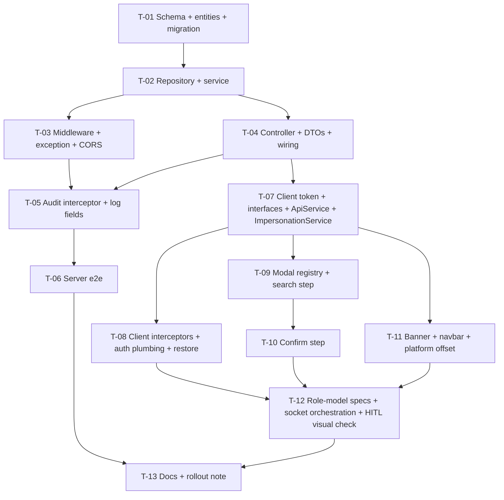

# Tasks — Changes / Profile Simulation (User Impersonation)

- **Module:** auth (cross-cutting, server + STAR client)
- **Spec id:** 2026-08-profile-simulation
- **Status:** in-progress
- **Owner:** Juan Carlos Cadavid
- **Linked requirements:** ./requirements.md
- **Linked design:** ./design.md (post-Judgment-Day revision, ./judgment.md)
- **Budget (design §13):** 13 tasks · ≈ 1,700 LOC · 2 review rounds — tripwire > 15 / > 2,200 / > 3
- **Approval Mode:** gated
- **Last updated:** 2026-08-25

Conventions binding every task: server lint gate is `npx eslint <path>` (never `npm run lint`, K-001); tests `npm test -- --silent` from the package; one full-suite run at a time (§4.3 concurrency); every gate below was chosen with its **failing input** named — if you cannot make it red with that input, the gate is not evidence (K-004/KZ-014).

---

## 1. Dependency graph

Parallel-safe pairs: T-03 ∥ T-04 (different files, same package — **edit** only, one test run at a time); T-07.. client tasks ∥ T-05/T-06 server tasks (cross-package).

---

## 2. Scenario / clause coverage map

Closure is at clause granularity (Step 3.2 rule). A gap may never be discharged by citing a different requirement.

| Requirement · scenario / clause | Owning task |
| --- | --- |
| R-IMP-001 Match found · ≤ 20 rows · `simulable=false` + reason · `BUT ≤ 20` · `MUST 400 <3 chars` | T-04 (unit), T-06 (e2e) |
| R-IMP-001 Non-admin → 403 | T-04, T-06 |
| R-IMP-002 Happy path · row exists · `BUT` one open session (superseded) · `MUST 409` admin target | T-02 (service), T-06 |
| R-IMP-002 Nested → 409 before guard | T-03 (middleware), T-06 |
| R-IMP-003 Visibility · `MUST` RolesGuard on target roles | T-06 |
| R-IMP-003 Write attribution · `BUT` no admin id in domain audit columns | T-06 (DB read-back) |
| R-IMP-003 Forged/foreign → 403 + header | T-03, T-06 |
| R-IMP-003 AC.4 reader enumeration (src + test) | T-05 |
| R-IMP-004 Manual end · next request 403 · `BUT` foreign `/end` → 403 | T-02, T-03, T-06 |
| R-IMP-004 Expiry → 403 + `end_reason='expired'` | T-02, T-06 |
| R-IMP-004 `/current` both states | T-04, T-08 (client use) |
| R-IMP-005 Mutation logged · thrown 409 logs 409 · `BUT` no GET · `MUST` survive insert failure | T-05, T-06 |
| R-IMP-006 Visibility (absent role 3 / present role 1 / `BUT` absent while active) | T-11 |
| R-IMP-007 six states · Select opens confirm · `BUT` blocked rows unclickable · AC.2 < 3 chars no request | T-09 |
| R-IMP-008 one `/start` call · `BUT` none on Cancel/Esc · error keeps dialog | T-10 |
| R-IMP-009 Behaves as target · `MUST` header incl. post-401 retry · `BUT` not on ROAR auth calls | T-08 |
| R-IMP-009 Reload restore · `MUST` clear + toast on inactive/403 | T-08 |
| R-IMP-009 AC.2 role model (Contributor / Center Admin) | T-12 |
| R-IMP-009 AC.3 banner `role="status"` + measured offset | T-11 (unit) + T-12 (human) |
| R-IMP-009 storage rule (`data.user` = target while active) | T-07 |
| R-IMP-010 One-click end · `MUST` stop header · `BUT` tokens untouched · AC.4 admin after reload | T-07, T-08 |
| R-IMP-010 `logOut` calls `/end` first · AC.3 header-driven auto-end, one toast | T-08 |
| NFR-IMP-001/002 | T-03, T-06 |
| NFR-IMP-003 latency sample | T-06 (recorded, with disqualifier) |
| NFR-IMP-004 log fields, no tokens | T-05 |
| NFR-IMP-005 contrast / focus / Escape | T-07 (token value), T-09/T-10 (focus, Esc), T-12 (human axe) |
| §5 migration human-applied (K-015) | T-01 |

---

## 3. Task list

### T-01 — Schema, entities, migration, enums

- **Requirements covered:** requirements §5; R-IMP-002/004/005 (data), OQ-5
- **Files touched (intended):**
  - `server/researchindicators/src/domain/entities/impersonation/entities/impersonation-session.entity.ts`
  - `…/entities/impersonation-action.entity.ts`
  - `…/enum/impersonation-end-reason.enum.ts`, `…/enum/impersonation-error-code.enum.ts`
  - `server/researchindicators/src/db/migrations/<timestamp>-createImpersonationTables.ts`
  - `server/researchindicators/.env.example` (`ARI_IMPERSONATION_TTL_MINUTES=240`)
- **Description:** Create both entities per design §3 (session extends `AuditableEntity`; action is append-only), generate the migration, and **confirm the real `sec_roles` columns** on dev (`DESCRIBE sec_roles`) — record the result in design §4 (OQ-5) before T-02 writes the query.
- **Implementation notes:**
  - `session_id` `char(36)` PK, no FK to `sec_users`.
  - Indexes named per design §3.
  - Migration `down` drops actions then sessions.
- **Acceptance / done check:**
  - [x] `npm run migration:generate` unavailable on dev (`orm_metadata` missing — execution.md T-01); migration hand-authored, reviewed byte-for-byte, applied on dev by a human-approved run (K-015) and `migration:show` shows it `[X] 384`.
  - [x] `npm run migration:revert` then re-apply both succeed (recorded in `execution.md`).
  - [x] OQ-5 answered with the `DESCRIBE sec_roles` output pasted into design §4.
- **Verification — failing input:** run `migration:show` **before** applying: the migration must appear `[ ]`; if it does not appear at all, the file is not being picked up — not evidence of "applied".
- **Disqualifier:** a `migration:show` count taken from a command that errored (connection refused) is a confident zero — check for an error line first.
- **Dependencies:** none · **Effort:** S · **Skills:** `nestjs-expert` · **Status:** done (PASS, execution.md T-01)

### T-02 — Repository + `ImpersonationService`

- **Requirements covered:** R-IMP-002 (all clauses), R-IMP-004 (end/expiry/current rules), R-IMP-005 `logAction`, R-IMP-001 search query
- **Files touched:**
  - `…/impersonation/repositories/impersonation-user.repository.ts` (constructor: `EntityManager` only)
  - `…/impersonation/impersonation.service.ts` + `impersonation.service.spec.ts`
  - `…/impersonation/impersonation.module.ts`
  - `server/researchindicators/src/domain/shared/utils/app-config.util.ts` (`IMPERSONATION_TTL_MINUTES`)
- **Description:** Implement `searchUsers`, `findProfile` (full `TargetProfileDto` incl. `role.focus_id/sec_role_id` from T-01's confirmed columns), `start` (validations, supersede in a transaction, explicit `created_by = actor`), `resolve(session_id, actor_id)` returning `{ state: 'valid'|'ended'|'expired'|'invalid', target?, session? }` with `is_active` filter and lazy expiry marking, `end`, `current`, `logAction`.
- **Implementation notes:**
  - Do **not** inject `CurrentUserUtil` anywhere in this module (design §2.0).
  - No cache (D-imp-4).
- **Acceptance / done check:**
  - [x] Unit spec covers: admin target → 409; self → 409; inactive → 404; second start supersedes first; resolve foreign → `invalid`; resolve expired → `expired` + update called with `end_reason='expired'`; end twice → same row.
  - [x] `npx eslint src/domain/entities/impersonation` clean (+ `app-config.util.ts`, KZ-017).
- **Verification — failing input:** in the supersede test, stub the repo to return an open session and assert the update is called with `end_reason: 'superseded'`; remove the update call in the service → the test must go red.
- **Disqualifier:** a spec that asserts on SQL text (KZ-001) is not evidence; only behaviour via mocked repo results counts here, DB truth belongs to T-06.
- **Dependencies:** T-01 · **Effort:** M · **Skills:** `nestjs-expert`, `error-handling-patterns` · **Status:** done (PASS, execution.md T-02)

### T-03 — Middleware `applyImpersonation`, exception + header, CORS

- **Requirements covered:** R-IMP-003 (steps 1–5, forged scenario, AC.1/AC.2), R-IMP-002 nested → 409, R-IMP-001 nested → 403, R-IMP-004 foreign `/end` → 403 + owned-ended tolerance, NFR-IMP-001/002
- **Files touched:**
  - `server/researchindicators/src/domain/shared/middlewares/jwr.middleware.ts` + `jwr.middleware.spec.ts`
  - `server/researchindicators/src/domain/shared/errors/impersonation.exception.ts`
  - `server/researchindicators/src/domain/shared/global-dto/request-with-user.dto.ts`
  - `server/researchindicators/src/main.ts` (CORS `exposedHeaders`)
- **Description:** Add `applyImpersonation(req, res, credential)` and call it from **all three** `req.user` branches (bypass / machine / JWT) before `next()`. Implement design §5 "Resolve" steps 1–8 exactly, setting `X-Impersonation-Error` before every throw.
- **Acceptance / done check:**
  - [ ] Spec matrix (11 cases × where relevant the 3 branches): no header; machine+header → 403 `NOT_ALLOWED`; non-admin → 403; `/start` nested → 409; `/users` nested → 403; unknown → 403; foreign → 403 (also on `/end`); owned-ended on `/end` → passes with `invalid:'ended'` and `req.actor` set; owned-ended on `/results` → 403; expired → 403 after marking; valid → `req.user` = target, `req.actor` = admin. Every 4xx asserts the header value.
  - [ ] `npx eslint src/domain/shared/middlewares src/main.ts` clean.
- **Verification — failing input:** feed a session whose `actor_user_id` is `admin+1` on route `/api/impersonation/end` — must be 403; make the middleware skip the ownership check for `/end` → red.
- **Disqualifier:** a matrix that mocks `resolve()` to return `'valid'` for every case cannot discriminate — each case must stub its own `resolve` result.
- **Dependencies:** T-02 · **Effort:** M · **Skills:** `nestjs-expert`, `error-handling-patterns` · **Status:** done (PASS attempt 3, execution.md T-03)

### T-04 — Controller, DTOs, module wiring, Swagger

- **Requirements covered:** R-IMP-001 (400/403/≤20/simulable), R-IMP-002 responses, R-IMP-004 `/end` + `/current` contracts, requirements §6
- **Files touched:**
  - `…/impersonation/impersonation.controller.ts` + `.spec.ts`
  - `…/impersonation/dto/{start-impersonation,search-users,impersonation-user,target-profile}.dto.ts`
  - `server/researchindicators/src/domain/entities/entities.module.ts`, `src/domain/routes/main.routes.ts`
- **Description:** Four handlers; `@UseGuards(RolesGuard)` + `@Roles(SYSTEM_ADMIN)` on `users`/`start`; `/end` requires the header (400 otherwise) and calls `service.end` using `req.actor`; `/current` maps `invalid:'ended'` → `{active:false}`. Full Swagger incl. `@ApiHeader`.
- **Acceptance / done check:**
  - [ ] Controller spec: `search='ro'` → 400 via `ValidationPipe`; `/end` without header → 400; `/current` with `invalid:'ended'` → `{active:false}`.
  - [ ] `curl localhost:3000/swagger-json | jq '.paths | keys | map(select(startswith("/api/impersonation")))'` lists 4 paths (K-014: check the total, don't `head`).
  - [ ] `npx eslint src/domain/entities/impersonation` clean.
- **Verification — failing input:** remove `@UseGuards(RolesGuard)` from `start` — the "Contributor → 403" spec must go red (it must exercise the guard, not just the decorator's presence — a presence assertion is not behavioural proof).
- **Dependencies:** T-02 · **Effort:** M · **Skills:** `nestjs-expert`, `api-design-principles` · **Status:** done (PASS attempt 2, execution.md T-04)

### T-05 — Audit interceptor + log attribution + reader re-enumeration

- **Requirements covered:** R-IMP-005 (all clauses), R-IMP-003 AC.4, NFR-IMP-004
- **Files touched:**
  - `server/researchindicators/src/domain/shared/Interceptors/impersonation-audit.interceptor.ts` + `.spec.ts`
  - `…/Interceptors/logging.interceptor.ts`, `…/Interceptors/response.interceptor.ts`, `…/error-management/global.exception.ts` (+ their specs: `actorId`, `impersonationSessionId` fields)
  - `server/researchindicators/src/app.module.ts` (`APP_INTERCEPTOR`)
  - `…/impersonation/impersonation.service.ts` + spec — add the NFR-IMP-004 `warn` lines for `end` (actor/target/session/reason) and lazy `expired` marking (T-02 review advisory; NFR-IMP-004 is already this task's)
- **Description:** Implement design §5 "Audit" (`tap({next, error})`, status from DTO / `HttpException.getStatus()`, fire-and-forget, `route_pattern` + `path` + `result_official_code`). Re-run the identity-reader enumeration: `grep -rn "req\.user\|request\.user\|request\['user'\]" server/researchindicators/src server/researchindicators/test` and reconcile with design §2.4 (record total count before reading, K-014).
- **Acceptance / done check:**
  - [ ] Spec: GET → no insert; POST returning `{status:201}` → insert with 201; handler throwing `ConflictException` → insert with 409 **and** the error still propagates; insert rejecting → response unchanged + `LoggerUtil.error` called.
  - [ ] Three log specs assert `actorId` present when `req.actor` exists.
  - [ ] design §2.4 updated with the grep total and any new reader.
- **Verification — failing input:** make the handler throw a 409 and assert `status_code === 409`; read status from `res.statusCode` instead → the assertion goes red (that is the J-02 defect reintroduced).
- **Disqualifier:** an enumeration grep restricted to `src` (or piped through `head`) does not cover the claim (KZ-017) — both trees, full output.
- **Dependencies:** T-03, T-04 · **Effort:** M · **Skills:** `nestjs-expert` · **Status:** done (PASS attempt 2, execution.md T-05)

### T-06 — Server e2e

- **Requirements covered:** R-IMP-001..005 e2e clauses (see §2), NFR-IMP-001/002/003
- **Files touched:** `server/researchindicators/test/impersonation.e2e-spec.ts` (+ any helper under `test/`)
- **Description:** Against the dev DB with T-01 applied, using a real admin JWT and two real targets (one Contributor, one Center Admin — ids provided by the human at dispatch): nested → 409/403; forged/foreign/expired → 403 + header; visibility scenario (target's project list ≠ admin's); mutation → `SELECT created_by FROM results WHERE …` equals target; one `impersonation_actions` row per mutation with real status incl. a forced 409; `/end` idempotent; foreign `/end` → 403; Center Admin target's `/start` payload carries `role.focus_id`. Record 50-request resolve latency from the `debug` log.
- **Acceptance / done check:**
  - [ ] `npm run test:e2e -- impersonation` green, full output attached to `execution.md`.
  - [ ] Latency sample recorded with median and spread.
- **Verification — failing input:** send admin B's JWT with admin A's session id — 403; comment out the ownership comparison in `resolve` → red.
- **Disqualifier:** if the 50 latency samples span > 2× the median the NFR number is not evidence — report the spread (NFR-IMP-003). A green run while another suite runs in the same package is not evidence (§4.3).
- **Dependencies:** T-05 · **Effort:** M · **Skills:** `nestjs-expert`, `tdd` · **Status:** done (PASS — Leader-inline evidence battery vs the prod bundle + dev DB, user-approved fallback; jest file itself hangs at bootstrap, recorded; execution.md T-06)

### T-07 — Client foundation: token, interfaces, `ApiService`, `ImpersonationService`

- **Requirements covered:** R-IMP-009 storage rule + identity swap, R-IMP-010 one-click end (`BUT` tokens untouched, AC.1, AC.4), NFR-IMP-005 token value
- **Files touched:**
  - `client/research-indicators/src/styles/colors.scss` (`--ac-orange-2` in `:root`, `$colors` map, dark block)
  - `client/research-indicators/src/app/shared/interfaces/impersonation.interface.ts`
  - `client/research-indicators/src/app/shared/services/api.service.ts` (4 methods)
  - `client/research-indicators/src/app/shared/services/impersonation.service.ts` + `.spec.ts`
- **Description:** Service depends only on `CacheService`, `ApiService`, `Router` (D-imp-13). Implements `start(res)` (store `{session, actor}`, swap `dataCache.user`, compute `roleName`, persist `data`), `end(reason)` (best-effort `/end` 3 s cap, restore actor into `dataCache` **and** `localStorage['data']`, clear key), `restore()`, signals `active/restoring`.
- **Acceptance / done check:**
  - [ ] Spec: after `start`, `localStorage['data'].user.sec_user_id === target` and `access_token` unchanged; after `end`, `localStorage['data'].user.sec_user_id === actor` and key removed; `end` when `/end` rejects still restores.
  - [ ] `npm run lint -- --quiet` clean for touched files.
- **Verification — failing input:** in the `end` spec, seed `localStorage['data']` with the target and assert the admin is written back; drop the `localStorage.setItem('data', …)` line → red (J-11 reintroduced).
- **Dependencies:** T-04 (contract) · **Effort:** M · **Skills:** `angular-developer` · **Status:** done (PASS, execution.md T-07)

### T-08 — Client interceptors, auth plumbing, restore

- **Requirements covered:** R-IMP-009 header clauses (`MUST` incl. retry, `BUT` not ROAR) + Reload scenario + AC.1/AC.4, R-IMP-010 `logOut` order + AC.3 (one toast), R-IMP-004 `/current` client use
- **Files touched:**
  - `…/shared/interceptors/jwt.interceptor.ts` + `.spec.ts`
  - `…/shared/interceptors/http-error.interceptor.ts` + `.spec.ts`
  - `…/shared/services/to-promise.service.ts` (`X-Ari-Auth-Call` marker when `isAuth`)
  - `…/shared/services/actions.service.ts` + `.spec.ts` (`logOut` awaits `end('logout')`; `updateLocalStorage(…, true)` never writes `user`)
  - `…/app.component.ts`, `…/shared/guards/roles.guard.ts` + `.spec.ts` (`restoring` wait)
- **Description:** Design §5 client start step 3 / end / restore. The 401-retry must clone `clonedRequest`.
- **Acceptance / done check:**
  - [ ] `jwt.interceptor.spec`: header present on main-API request; present on the retried request after a mocked 401+refresh; absent when the marker is present (marker stripped); absent on file-manager/text-mining/document-overview URLs.
  - [ ] `http-error.interceptor.spec`: `403` with `X-Impersonation-Error: SESSION_INVALID` → `end` called, exactly one toast; plain 403 → generic toast, `end` not called.
  - [ ] `actions.service.spec`: `logOut` calls `end` before `localStorage.removeItem('data')`; refresh path leaves `data.user` untouched.
  - [ ] `roles.guard.spec`: with `restoring()` true the guard awaits before deciding.
- **Verification — failing input:** the retry test: assert `X-Impersonation-Session` on the **second** `next` call; revert to `req.clone` → red (J-10). The marker test: set `mainApiUrl === managementApiUrl` in the test environment stub and still expect no header on the auth call — a host-based implementation goes red.
- **Disqualifier:** a host-string assertion with distinct URLs passes on both implementations and proves nothing.
- **Dependencies:** T-07 · **Effort:** M · **Skills:** `angular-developer`, `error-handling-patterns` · **Status:** done (PASS attempt 2, execution.md T-08)

### T-09 — Modal registration + `SimulateProfileModal` + `UserSearchStep`

- **Requirements covered:** R-IMP-007 (all clauses, AC.1, AC.2), NFR-IMP-005 focus/Escape
- **Files touched:**
  - `…/shared/types/modal.types.ts`, `…/shared/services/cache/all-modals.service.ts` (config + `closeAllModals` literal), `…/shared/components/all-modals/all-modals.component.html`
  - `…/all-modals/modals-content/simulate-profile-modal/simulate-profile-modal.component.{ts,html,scss,spec.ts}`
  - `…/simulate-profile-modal/user-search-step/user-search-step.component.{ts,html,scss,spec.ts}`
- **Description:** Register `simulateProfile`; render inside the `app-modal` wrapper (no `p-dialog`). Search step: `.label`/required marker, 300 ms debounce, ≥ 3 chars, six states, rows per mockup artboard 2 (tokens per design §6), blocked rows disabled with tooltip. `Select` emits the chosen user to the parent (step 2).
- **Acceptance / done check:**
  - [ ] Spec drives the transition idle→loading→results with a deferred `ApiService` mock (KZ-015) and asserts each state's DOM; empty and error states; typing `ro` issues no request; blocked row button is `disabled`.
  - [ ] `closeAllModals()` compiles with the new key (build via `npx tsc -p tsconfig.app.json --noEmit` over the client — proven able to fail by temporarily removing the key).
- **Verification — failing input:** type 3 chars, advance the fake timer 299 ms → no request; 300 ms → one request. Remove the debounce → red.
- **Dependencies:** T-07 · **Effort:** M · **Skills:** `angular-developer`, `ui-ux-pro-max` · **Status:** done (PASS attempt 2, execution.md T-09)

### T-10 — `ConfirmStep`

- **Requirements covered:** R-IMP-008 (all clauses, AC.1)
- **Files touched:** `…/simulate-profile-modal/confirm-step/confirm-step.component.{ts,html,scss,spec.ts}`; parent modal wiring.
- **Description:** Mockup artboard 3: summary card, red `color-mix` callout naming admin and target, `Cancel` / `Start simulation`; submitting state disables both; on `201` → `impersonation.start(res)` then the modal closes and the parent orchestrates `configUser`, navigate `/home`, toast; on error show `description`, keep open.
- **Acceptance / done check:**
  - [ ] Spec: one `startImpersonation` call on confirm; zero on Cancel and on Escape; rejected call keeps the dialog open with the message; buttons disabled while pending.
- **Verification — failing input:** double-click `Start simulation` during pending → still exactly one call; remove the disabled guard → red.
- **Dependencies:** T-09 · **Effort:** S · **Skills:** `angular-developer`, `ui-ux-pro-max` · **Status:** done (PASS attempt 2, execution.md T-10)

### T-11 — `SimulationBanner`, navbar changes, platform offset

- **Requirements covered:** R-IMP-006 (all three visibility clauses, AC.1), R-IMP-009 banner/avatar/panel/responsive/a11y clauses + AC.3 (unit half), D-imp-14 reversion
- **Files touched:**
  - `…/shared/components/simulation-banner/simulation-banner.component.{ts,html,scss,spec.ts}`
  - `…/shared/components/alliance-navbar/alliance-navbar.component.{ts,html,scss,spec.ts}` (banner slot above `#navbar`; `ResizeObserver` on the host element; option button; avatar ring; "Account · Simulated" panel; `End simulation`; `Log out (ends simulation)`)
  - `…/pages/platform/platform.component.html` (`[style.paddingTop.px]="cache.navbarHeight()"`)
- **Description:** Mockup artboards 1 and 4 with design §6 tokens (`--ac-orange-2`, `color-mix` notes, no hex literals). Banner `role="status" aria-live="polite"`, compact variant when `hasSmallScreen()`; `End simulation` focused after mount.
- **Acceptance / done check:**
  - [ ] Navbar spec: option absent for role 3; present for role 1 idle; absent for role 1 + `active()`; avatar initials switch to the target.
  - [ ] Banner spec: `role="status"`, target name/email, compact text at `windowHeight 700`.
  - [ ] `grep -n "#[0-9a-fA-F]\{6\}" <new component files>` → 0 hits (token rule).
  - [ ] Component style budget respected (`ng build` warning-free for these components).
- **Verification — failing input:** role 1 with `active()` true must hide the option; drop the `!active()` condition → red.
- **Disqualifier:** the offset (AC.3) **cannot** be measured in jsdom — this task records it as owed to T-12's human check, never as passed.
- **Dependencies:** T-07 · **Effort:** M · **Skills:** `angular-developer`, `ui-ux-pro-max` · **Status:** done (PASS, execution.md T-11 — first worker died on a session limit; resume worker completed and re-proved)

### T-12 — Role-model specs, socket orchestration, HITL visual/a11y check

- **Requirements covered:** R-IMP-009 AC.2 (Contributor + Center Admin), AC.3 (human half), socket clause; R-IMP-010 end orchestration (`configUser`, navigate, toast); NFR-IMP-005 human check; requirements §8 human rows
- **Files touched:** `…/shared/services/cache/roles.service.spec.ts`; the banner/navbar/confirm components' orchestration code (calls to `websocket.configUser`, `router.navigate`, `actions.showToast` after `impersonation.start/end`); `execution.md` (evidence)
- **Description:** Add role-model specs with a simulated Contributor (`isSystemAdmin()` false) and a simulated Center Admin (`canAccessCenterAdmin()` true, exercising `role.focus_id`/`sec_role_id`). Wire socket/navigation/toast in the callers (not in the service). Then, with the app running (`docker compose up` or native per `docs/infrastructure.md` §6) and the human at the keyboard: start a simulation, screenshot the banner + dropdown against artboards 1/4, measure `#content` padding = navbar+banner height in DevTools, run axe on banner and both dialog steps, check tab order and Escape.
- **Acceptance / done check:**
  - [ ] `roles.service.spec` two new cases green (and red when the DTO's `role.focus_id` is removed).
  - [ ] Human evidence in `execution.md`: two screenshots, the measured padding value, axe result (0 contrast violations on the banner), tab-order note.
- **Verification — failing input:** load a Center Admin target whose `role.focus_id` is `null` → `canAccessCenterAdmin()` must be false — proves the spec discriminates on the field.
- **Disqualifier:** an axe run in jsdom reporting "incomplete" for contrast has evaluated nothing — only the real-browser run counts.
- **Dependencies:** T-08, T-10, T-11 · **Effort:** S · **Skills:** `angular-developer`, `ui-ux-pro-max` · **Status:** todo

### T-13 — Docs, baseline sync, rollout note

- **Requirements covered:** requirements §7 (STAR link), design §11; baseline drift prevention (root guide "do not let docs and code drift")
- **Files touched:** `docs/ux-ui/design.md` (§7.1 `--ac-orange-2`, §8.1 new components, §12.2 decision), `docs/trd/trd.md` (§10.1 impersonation paragraph, §10.2 client mirror), `server/researchindicators/.env.example`, `docs/specs/changes/profile-simulation/execution.md` rollout note (migration applied date, backout)
- **Acceptance / done check:**
  - [ ] Each doc edit cites `D-imp-*`; `grep -rn "orange-2" docs/ux-ui/design.md` ≥ 1; TRD §10.1 mentions `X-Impersonation-Session`.
  - [ ] Rollout note lists: migration applied (who/when), env var present in each environment, backout steps.
- **Verification — failing input:** the grep counts are presence checks — they prove the text exists, not that it is right; the Reviewer reads the paragraphs.
- **Dependencies:** T-06, T-12 · **Effort:** S · **Skills:** `cognitive-doc-design` · **Status:** todo

---

## 4. Testing expectations

| Task | Spec files | Notes |
| --- | --- | --- |
| T-02 | `impersonation.service.spec.ts` | mocked repo results, no SQL-text assertions |
| T-03 | `jwr.middleware.spec.ts` | 11-case matrix; each stubs its own `resolve` |
| T-04 | `impersonation.controller.spec.ts` | guard exercised, not decorator presence |
| T-05 | `impersonation-audit.interceptor.spec.ts`, `logging/response.interceptor.spec.ts`, `global.exception.spec.ts` | status via thrown exception |
| T-06 | `test/impersonation.e2e-spec.ts` | dev DB; DB read-back for attribution |
| T-07 | `impersonation.service.spec.ts` (client) | `localStorage` assertions |
| T-08 | `jwt.interceptor.spec.ts`, `http-error.interceptor.spec.ts`, `actions.service.spec.ts`, `roles.guard.spec.ts` | marker + retry |
| T-09/T-10/T-11 | component specs | transitions per KZ-015; `role="status"` |
| T-12 | `roles.service.spec.ts` + human evidence | real browser for layout/contrast |

Coverage thresholds unchanged (server 60 %; client 40/20/45/30). Leader re-measures each full suite after the worker reports; never two full suites concurrently.

---

## 5. PR strategy

≈ 1,700 LOC → **two PRs** (chained), plus the docs folded into PR 2:

| PR | Tasks | Review first | Out of scope |
| --- | --- | --- | --- |
| **PR 1 — server** `feat(impersonation): server-side profile simulation sessions` | T-01..T-06 | `jwr.middleware.ts` `applyImpersonation` + its matrix, then the audit interceptor | any client change; audit read UI |
| **PR 2 — client** `feat(client): simulate another profile (PARI-242)` | T-07..T-13 | `impersonation.service.ts` storage rule, `jwt.interceptor.ts` marker/retry, then UI | ROAR changes; other frontends |

PR 2's description links PR 1 and states the migration must be applied on the target environment before merge (K-015). Branch: `JuankCadavid/PARI-242` (current); confirm the integration branch with the engineering lead.

---

## 6. Risks & blockers log

| # | Date | Risk / Blocker | Mitigation | Owner | Status |
| --- | --- | --- | --- | --- | --- |
| RB-1 | 2026-08-25 | `sec_roles` may lack `focus_id`/`sec_role_id` (OQ-5) | T-01 verified on dev 2026-08-25: all columns present (`DESCRIBE` recorded in design §4) | Implementer T-01 | **closed** |
| RB-2 | 2026-08-25 | Migration unapplied on dev blocks T-06 | Applied 2026-08-25 with user approval; apply/revert/re-apply evidence in execution.md T-01 | Human | **closed** |
| RB-3 | 2026-08-25 | A process cache keyed by user id surfaces during T-05 enumeration | Record in design §2.4 and add a clearing hook, or escalate | Leader | open |
| RB-4 | 2026-08-25 | Binding platform padding to `navbarHeight()` shifts layout on pages that relied on the constants | T-12 human check on Home, Results Center, Result detail; revert to constants + explicit banner height if regressions | Implementer T-11 | open |

---

## 7. Done definition

- [ ] All T-01..T-13 `done` with evidence in `execution.md` (Reviewer PASS before any checkbox flips — guardrail hook).
- [ ] Every clause in §2 owned and green (or recorded as human-verified).
- [ ] Coverage thresholds green in both packages.
- [ ] Swagger lists the four endpoints.
- [ ] OQ-1..OQ-5 resolved into design §12 or carried forward.
- [ ] Rollout note in place (migration date, env var, backout).
