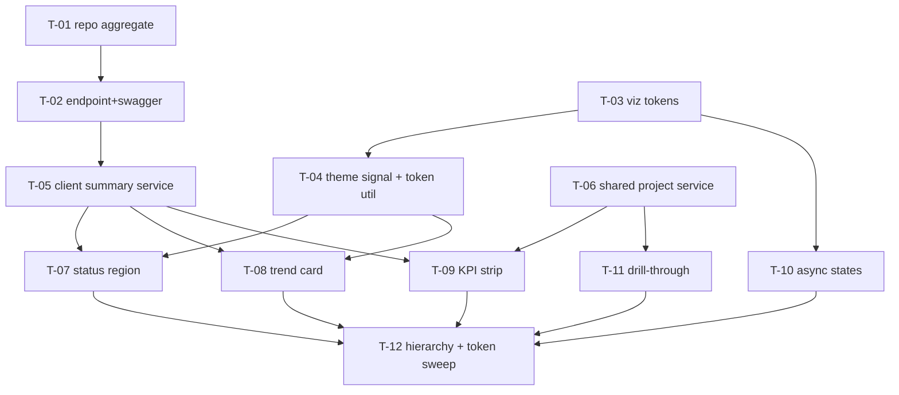

# Tasks — project-detail / Project Dashboard Redesign

- **Module:** project-detail (client) + agresso-contract (server)
- **Spec id:** 2026-08-project-dashboard-redesign
- **Status:** in-progress (T-01..T-06 done)
- **Owner:** j.cadavid@cgiar.org
- **Linked requirements:** ./requirements.md
- **Linked design:** ./design.md (post-judgment corrections; ledger ./judgment.md)
- **Last updated:** 2026-08-21
- **Budget (design §13):** 12 tasks · ~1,350 LOC · 2 review rounds — `/akili-execute` trips against these

Global execution rules (bind every task): suites run **serially, never both packages concurrently** (root guide §4.3); client targeted runs use `--coverage=false` (K-020); client lint gate is `npm run lint -- --quiet`, server lint gate is bare `npx eslint <path>` (K-001); spec-code type gate is `npx tsc -p tsconfig.spec.json --noEmit` judged as **delta vs. the 945-error baseline** (K-002/K-004).

---

## 2. Dependency graph

PR strategy: **PR 1** = T-01+T-02 (server, additive, merges first). **PR 2a** = T-03..T-06 (client foundations). **PR 2b** = T-07..T-12 (client UI). Chained PR descriptions follow `cognitive-doc-design` review-empathy rules (what to review first, out-of-scope, prev/next links).

---

## 3. Task list

### T-01 — Server: results-summary aggregation in the repository

- **Requirements covered:** R-PD-001 (Details, Scenario incl. both `AND IT MUST` clauses and the `BUT` clause, AC.2)
- **Files touched:** `agresso-contract/repositories/agresso-contract.repository.ts` (+ its spec), `agresso-contract/dto/contract-results-summary-report.dto.ts`
- **Description:** `getResultsSummaryReport(contractId)` running three grouped queries over `buildPrimaryContractResultsSubquery()`: by-status (**LEFT JOIN** `result_status`, explicit `null`/"No status" bucket — judgment SU2), by-year (`GROUP BY r.report_year_id`, **no join** — W8; null-year bucket), partner distinct count (`COUNT(DISTINCT ...)` over partner-role `result_institutions`). `total` such that both bucket sums equal it. Primary-only semantics per D-PD-12.
- **Skills:** `nestjs-expert`
- **Acceptance / done check:**
  - [x] Repository spec asserts the **generated SQL text** contains `is_primary = TRUE`, `is_snapshot = FALSE`, `is_active`, `LEFT JOIN`, both `GROUP BY`s, and the bound params — asserting the artifact, not the call sequence (KZ-001). *Red input (K-012): change `LEFT JOIN` to `INNER JOIN` in the SQL — the null-bucket assertion must fail.*
  - [x] Bucket-sum invariant tested with a fixture containing a NULL-status and a NULL-year row. *Disqualifier: a fixture with no NULL rows proves nothing — the test is not evidence unless both NULL rows are present.*
  - [x] `npm test -- --silent` (server, full suite) green.
  - *What this gate cannot prove (KZ-017):* SQL semantic correctness against real MySQL — covered once by the Dev cross-check in T-02's validation note, recorded in `execution.md`.

### T-02 — Server: endpoint, service pass-through, Swagger

- **Requirements covered:** R-PD-001 (AC.1, AC.3, AC.4, 400-on-empty behavior), §6 API delta
- **Files touched:** `agresso-contract.controller.ts`, `agresso-contract.service.ts` (+ both specs)
- **Description:** `@Get('reports/results-summary')` with `@Query('contract-id')` via `ApiContractReportQueries`, seventh sibling of the reports family (D-PD-1). Thin service pass-through.
- **Dependencies:** T-01 · **Skills:** `nestjs-expert`, `api-design-principles`
- **Acceptance / done check:**
  - [x] Controller/service specs: happy path, empty `contract-id` → 400 `contract_id is required`. *Red input: call with `''` and assert the 400 — must fail if the guard is removed.*
  - [ ] Endpoint visible in `/swagger` with the query param documented (manual check, screenshot in `execution.md`). — **deferred to HITL validation**
  - [ ] AC.4 (401 envelope): **no automated gate exists** (unit specs mock the middleware; no e2e in this family — judgment SU4). Substitute: one manual unauthenticated `curl` against local/Dev, output pasted into `execution.md`. *Disqualifier: a 401 from a wrong URL (404-shaped) is not the evidence — the response body must carry the standard envelope.* — **deferred to HITL validation**
  - [ ] Dev cross-check (R-PD-001 scenario): endpoint counts vs. primary-scoped `GET /results` counts for one real contract (A1676), both outputs recorded. *Disqualifier: comparing against the any-link count — the scenario is primary-scoped by D-PD-12.* — **deferred to HITL validation**

### T-03 — Client: `--ac-viz-*` token family + validation + registry mirrors

- **Requirements covered:** R-PD-006 (Details: token registration), NFR-PD-004; design D-PD-13
- **Files touched:** `src/styles/colors.scss`, `client/research-indicators/README.md`, `docs/ux-ui/design.md` §7
- **Description:** Author the chart-token family (approved/submitted/draft/pending/rejected/no-status + `series-1`) with independent light AND dark values; both modes must pass the dataviz validator against the actual card-surface tokens.
- **Skills:** `ui-ux-pro-max`
- **Acceptance / done check:**
  - [ ] Validator run for light and for dark, full output pasted into `execution.md`. Gate already **proven able to fail** (K-004): it FAILED on the legacy rank palette 2026-08-21 (recorded in proposal P12). *Disqualifier: running against `#ffffff`/`#191919` literals instead of the resolved card-surface tokens; or validating only light.* — **DEFERRED: dataviz skill unavailable; substitute WCAG 3:1 check passes; full validation at HITL**
  - [x] Tokens present in both theme blocks of `colors.scss`; README + ux-ui §7 mirror rows added in the same commit (grep the token name in all three files → 3 hits).
  - *Execution context note (judgment SU7):* the validator script ships inside the `dataviz` skill, not the repo — the executing agent must load that skill; if unavailable, escalate rather than skip.

### T-04 — Client: DarkModeService signal + chart-tokens.util

- **Requirements covered:** R-PD-006 (theme scenario, AC.3), design D-PD-5/D-PD-14
- **Files touched:** `shared/services/dark-mode.service.ts` (+spec), `shared/utils/chart-tokens.util.ts` (+spec, NEW)
- **Description:** Private boolean → signal (readonly exposure; `isDarkModeEnabled()` preserved, delegating). Util resolves `--ac-viz-*` via `getComputedStyle` inside a `computed` keyed on the signal; no hex fallback.
- **Dependencies:** T-03 · **Skills:** `angular-developer`
- **Acceptance / done check:**
  - [x] Service spec: signal transitions on `toggleDarkMode`/`loadThemePreference` — arranged as **transitions**, initial state first (KZ-015). *Red input: assert the signal is `true` immediately after construction with a light `localStorage` — must fail.*
  - [x] Util spec asserts the **requested token names** only — jsdom returns `''` for custom properties, so resolved values are structurally unverifiable here (declared per KZ-017; visual correctness is T-12's D6 gate).
  - [x] No `isDarkMode()` branching for colors anywhere in the diff (`grep -rn "isDarkMode" <touched components>` → only the service/util).

### T-05 — Client: summary API method + service

- **Requirements covered:** R-PD-003 (data source), R-PD-004 (data source), R-PD-002 (partner count source)
- **Files touched:** `shared/services/api.service.ts`, `shared/services/get-contract-results-summary.service.ts` (NEW, +spec), `shared/interfaces/contract-results-summary.interface.ts` (NEW)
- **Description:** `GET_ContractResultsSummary(contractId)` + a service with the sibling `list/loading/loadError` signal-triple + `main()/update()` shape.
- **Dependencies:** T-02 (contract shape; may develop against the DTO in parallel) · **Skills:** `angular-developer`
- **Acceptance / done check:**
  - [x] Spec via `HttpTestingController`: envelope handling, error → `loadError` signal, retry via `update()`. *Red input: respond with `successfulRequest: false` and assert `loadError()` is true — must fail if the error branch is dropped.*

### T-06 — Client: shared project-detail service + dedupe (3 components / 4 invocations)

- **Requirements covered:** R-PD-008 (AC.2 + duplicate-fetch REMOVED delta), design D-PD-7/D-PD-10
- **Files touched:** `shared/services/get-project-detail.service.ts` (NEW, +spec), `project-detail.component.ts/html` (+spec), `project-dashboard.component.ts` (+spec), `shared/components/section-header/section-header.component.ts` (+spec)
- **Description:** Per-navigation dedupe keyed **by contract id** with `invalidate(id)`; migrate all four invocations; **delete** the `full_name` mutation (dead — D-PD-7); standardize empty state on `null`; guard the shell template's unguarded dereferences (latent crash).
- **Dependencies:** none (parallel-safe with T-03/04/05) · **Skills:** `angular-developer`, `systematic-debugging`
- **Acceptance / done check:**
  - [x] Test: navigating to `/project-detail/:id` issues **exactly one** `GET_ResultsCount` request (AC.2, asserted via `HttpTestingController` request count). *Red input: re-add the dashboard's own `loadProject` fetch — the count assertion must fail.*
  - [x] Test: two different ids (route id vs. alignments-derived id on a result page) produce two independent cache entries (judgment W6).
  - [x] Pinned-spec realignment: apply the change, run the suite, and **derive the edit list from the failures** (K-018) — expected reds include `project-detail.component.spec.ts:343-380` and `project-dashboard.component.spec.ts:274-281`; the realigned specs must encode the new `null` contract, not resurrect the old fallbacks.
  - [x] Full client suite `npm test -- --silent` green. (6519/6521 — 2 pre-existing `version-selector` failures unrelated, confirmed at HEAD)

### T-07 — Client: status region rework + bulk-fetch removal

- **Requirements covered:** R-PD-003 (all ACs, full Scenario incl. `BUT` no-bulk and `AND IT MUST` render-all), R-PD-007 (status region states), R-PD-009 (status region a11y)
- **Files touched:** `project-dashboard.component.{ts,html}` (+spec)
- **Description:** Composition bar + labeled rows from the aggregate (D-PD-2/D-PD-3, incl. "No status" bucket); **delete** `loadProjectResultsByStatus`, `buildStatusChartItems`, the `Result` import, and the `#1689CA` fallback; skeleton/error+retry/empty distinct; `role="img"` + aria-label + rows-as-data-alternative; drill link per row (wired fully in T-11).
- **Dependencies:** T-03, T-05 · **Skills:** `angular-developer`, `ui-ux-pro-max`
- **Acceptance / done check:**
  - [ ] Test asserts **no** `GET_Results` request is issued from this page (R-PD-003 AC.2/`BUT` clause) — `HttpTestingController.verify()` over the dashboard fixture. *Red input: restore the `limit: 10_000` call — must fail.*
  - [ ] Rendered-DOM assertions (KZ-001): all returned statuses render (feed 7 buckets, count 7 rows — no scroll cap), percentages sum, error copy ≠ empty copy, retry re-invokes `update()`. Fixtures arrange loading→data and loading→error **transitions** (KZ-015).
  - [ ] Old pinned specs (`:244-248, 328-375`) realigned via failing suite (K-018).
  - *Presence caveat:* aria-label presence is asserted in DOM; whether it *reads well* is T-12's HITL check — presence ≠ behavioral proof, declared.

### T-08 — Client: results-trend-card (new component)

- **Requirements covered:** R-PD-004 (all ACs, Scenario incl. `BUT` no-empty-plot), R-PD-009 (trend a11y), NFR-PD-001
- **Files touched:** `project-detail/components/results-trend-card/` (NEW, +spec), `project-dashboard.component.html`
- **Description:** `p-chart` line from `by_year` (D-PD-2); y-min 0; dashed current-year segment; sparse-years (<2 buckets) → single-value stat + caption, canvas not rendered; `aria-label` + visually-hidden data table; colors via `chart-tokens.util`; `prefers-reduced-motion` disables animation.
- **Dependencies:** T-04, T-05 · **Skills:** `angular-developer`, `ui-ux-pro-max`
- **Acceptance / done check:**
  - [ ] Rendered-DOM tests: sparse-year fixture renders the stat+caption and **no** canvas (the `BUT` clause); ≥2-year fixture renders the canvas + hidden table with matching numbers. *Red input: a 1-year fixture rendering the canvas must fail the assertion.*
  - [ ] Bundle gate (NFR-PD-001): `npm run build` on base and branch, initial-chunk sizes compared; **prove the gate can fail first** (K-004): temporarily import chart.js from an eager file, observe the initial-chunk delta/budget error, revert, record both runs. *Disqualifier: comparing gzipped vs. raw sizes across the two runs, or a delta smaller than build noise (±1 kB) claimed as proof either way — record the exact numbers.*

### T-09 — Client: KPI strip

- **Requirements covered:** R-PD-002 (both ACs + no-fabricated-zeros Scenario), R-PD-008 (pending-tile anchor, judgment W7)
- **Files touched:** `project-dashboard.component.{ts,html}` (+spec)
- **Description:** 4 tiles per mockup — totals/indicators from the shared project service, pending from the aggregate, partners from `partner_institutions` (S2); the "across N countries" sub-caption is **omitted** (no source); per-tile skeletons; pending tile scrolls to the table section (reduced-motion-aware).
- **Dependencies:** T-05, T-06 · **Skills:** `angular-developer`
- **Acceptance / done check:**
  - [ ] Rendered-DOM test: while the source is in flight the tile shows a skeleton and **not** `0` (`BUT` clause; transition-arranged per KZ-015). *Red input: render the tile with `0` during loading — must fail.*
  - [ ] Partner tile shows the aggregate's number; a fixture with `partner_institutions: 24` must render 24 (not the top-4 list length — the S2 defect).

### T-10 — Client: unified async states across ranked cards, geo, indicator card

- **Requirements covered:** R-PD-007 (AC.1, AC.2, error≠empty Scenario) for the KPI/ranked/geo/indicator regions, R-PD-005 AC.2 (indicator loading), R-PD-005 Scenario (`BUT` loading-not-empty)
- **Files touched:** `project-dashboard-card.component.{ts,html}` (+spec), `geo-scope-card`, `project-dashboard.component.{ts,html}`
- **Description:** One three-state pattern (States artboard): `p-skeleton` blocks; error names the region + scoped Retry (44px target); empty confirms + next action. Fixes the indicator card's missing loading state. Regions independent (a failed region never blocks siblings). Pending-table region: participates via its **existing** table states — the shared `results-center-table` is behavior-unchanged (declared limit, judgment SU3: its internal states are reused, not redesigned; recorded as the region's accepted mechanism).
- **Dependencies:** T-03 · **Skills:** `angular-developer`, `ui-ux-pro-max`
- **Acceptance / done check:**
  - [ ] Rendered-DOM: for indicator card, loading fixture shows skeleton and **not** "No results were found…" (the R-PD-005 `BUT`). *Red input: the current HEAD behavior (empty copy during load) must fail this test — run it against HEAD once to see the red, record it.*
  - [ ] One region's `loadError` fixture leaves sibling regions rendering data (AC.2).
  - [ ] Distinct copy strings asserted per state (error ≠ empty).

### T-11 — Client: drill-through (generic scoped table + shell queryParamMap)

- **Requirements covered:** R-PD-003 Details (status row navigation), R-PD-005 Details (indicator row navigation), R-PD-008 (dead-end removal, "View all"), design D-PD-4 + §5.2 (judgment S3 rework)
- **Files touched:** `results-center.service.ts` (+spec; NEW `initializeScopedResultsTable`, existing `initializeProjectDashboardResultsTable` delegates), `project-detail.component.ts` (+spec), status/indicator row templates
- **Description:** Shell subscribes to `route.queryParamMap` (fires without re-init — S3); on `statusTab`/`indicatorTab`: activate the results tab, call the generic scoped init (overrides the pending-revision fixed state; **bypasses the `isOnlyPendingRevisionStatusFilter()` reset guard for explicit params**), strip params (`replaceUrl`). Scoped request carries the primary flag (D-PD-12) so table numbers match the chart. "View all" in-card expansion with the server-cap limit **100, disclosed in the UI copy when the list is truncated** (judgment SU5 wording).
- **Dependencies:** T-06 · **Skills:** `angular-developer`, `systematic-debugging`
- **Acceptance / done check:**
  - [ ] Test: simulate the child→parent navigation **without component re-init** (router harness emitting queryParamMap on the live fixture — the S3 failure mode is the test's arrangement). *Red input: the pre-fix design (snapshot read in `ngOnInit`) must fail this test — that is precisely what the judges proved.*
  - [ ] Test: a `statusTab=5` drill survives the reset guard (the S3 discard case) and the applied filter is status-5 + contract + primary flag.
  - [ ] Params stripped after application (`replaceUrl` asserted on the router spy).

### T-12 — Client: hierarchy, AI relocation, full token sweep, final gates

- **Requirements covered:** R-PD-008 (AC.1, Scenario incl. `BUT` no-functional-change + `AND IT MUST` reachability), R-PD-006 (AC.1 zero-grep, AC.2 rendered contrast, theme Scenario incl. `BUT` no-literal-surface + `AND IT MUST` dark distinguishability), R-PD-009 (AC.2 keyboard/focus, AC.3), NFR-PD-002/003/005
- **Files touched:** `project-dashboard.component.{ts,html}` (+spec), `project-detail.component.html`, `section-header.component.html`, `geo-scope-map.component.{ts,scss}`, `project-dashboard-chart-colors.constants.ts` (delete/replace) 
- **Description:** Compact caveat + "Learn more" (full text preserved — D-PD-8); Grounding/Overview relocated below analytics, collapsed via **`[hidden]`, never `@if`** (D-PD-9), inline progress on the collapsed header + auto-expand on Generate; complete the hex→token sweep (shell 34, section-header 8, Mapbox paints via resolved tokens + re-style on theme signal, alert colors, delete the 6-hex map and `GEO_SCOPE_SUMMARY_COLORS`); realign hex-pinning specs via failing suite.
- **Dependencies:** T-07..T-11 · **Skills:** `angular-developer`, `ui-ux-pro-max`
- **Acceptance / done check:**
  - [ ] `grep -nE '#[0-9a-fA-F]{3,8}\b'` over **the full touched-file list** (all six templates + all touched TS) → 0 hits; count the total before filtering (K-014). *Red input: any single surviving literal — e.g. the Mapbox `circle-stroke-color` — must appear in the grep.*
  - [ ] Rendered-DOM tests: admin fixture shows KPI strip + ≥1 chart before any AI block (AC.1); collapsed AI section still contains the file input in the DOM (`[hidden]`, not destroyed — D-PD-9); generation-loading fixture shows the collapsed-header progress. These are the first DOM assertions this component has (judgment: the restructure was previously unguarded).
  - [ ] **D6 gate (no automated substitute — mandatory HITL):** light + dark screenshots of the full route on Dev/local attached to `execution.md`; human verifies contrast, layout, chart legibility per requirements §4.1. *Disqualifier: screenshots of only one theme, or of a viewport that hides regions.*
  - [ ] Full suites green, serially: client `npm test -- --silent`, then server; `npm run build` clean; spec-tsc delta vs. 945 baseline = 0 new errors.

---

## 4. Traceability — scenario/clause closure (not ID-level)

| Requirement clause | Owner |
|---|---|
| R-PD-001 Scenario + both `AND IT MUST` + `BUT` no-snapshot | T-01 (SQL), T-02 (Dev cross-check) |
| R-PD-001 AC.1/AC.3 · AC.4 (manual substitute) · AC.2 null buckets | T-02 · T-02 · T-01 |
| R-PD-002 AC.1/AC.2 + no-fabricated-zeros `BUT` + partner source + anchor | T-09 |
| R-PD-003 AC.1/AC.3 + render-all `AND IT MUST` | T-07 |
| R-PD-003 AC.2 + `BUT` no-bulk-fetch | T-07 |
| R-PD-003 status-row navigation (Details) | T-11 |
| R-PD-004 AC.1/AC.2 + sparse `BUT` clause | T-08 |
| R-PD-005 AC.1 + drill rows | T-07/T-11 |
| R-PD-005 AC.2 + loading-not-empty `BUT` | T-10 |
| R-PD-006 AC.1 zero-grep · AC.2 rendered contrast (HITL) · AC.3 | T-12 · T-12 · T-04 |
| R-PD-006 theme Scenario + `BUT` no-literal-surface + `AND IT MUST` dark marks | T-03 (validated tokens) + T-12 (sweep + HITL) |
| R-PD-007 AC.1 three states ×7 regions · AC.2 isolation · error≠empty Scenario | T-07 (status), T-08 (trend), T-09 (KPI), T-10 (ranked/geo/indicator + pending-table declared mechanism) |
| R-PD-008 AC.1 hierarchy · AC.2 one-fetch · AC.3 view-all · Scenario `BUT`/`AND IT MUST` (AI intact & reachable) | T-12 · T-06 · T-11 · T-12 (D-PD-9 checks) |
| R-PD-009 AC.1 names+tables (all 3 charts) · AC.2 keyboard/no-title-only · AC.3 | T-07/T-08 (+T-12 sweep of `[title]`) · T-12 · T-07/T-10 |
| NFR-PD-001 | T-08 |
| NFR-PD-002 | T-07 (no-bulk assertion) + T-02 (payload size note) |
| NFR-PD-003 (3-run timing + spread disqualifier) | T-02 validation note |
| NFR-PD-004 light+dark | T-03 |
| NFR-PD-005 | every task; final full-suite in T-12 |

Residual info rows from judgment (SU3 pending-table mechanism declared in T-10; SU4 manual 401 substitute in T-02; SU5 cap disclosure in T-11; SU7 validator context in T-03; SU8 region count note: proposal said six regions, requirements enumerate seven — the KPI strip was added at requirements time).

## 7. Risks & blockers log

| # | Date | Risk / Blocker | Mitigation | Owner | Status |
|---|---|---|---|---|---|
| RB-1 | 2026-08-21 | Dark values for `--ac-viz-*` may need several validator iterations | T-03 gates on recorded validator output, not eyeballing | Implementer T-03 | open |
| RB-2 | 2026-08-21 | D-PD-12's primary-only counts change visible numbers vs. today | Declared in requirements + release note at rollout | Leader | open |

## 8. Done definition

- [ ] All T-01…T-12 `done` with evidence in `execution.md` (hook enforces PASS-before-checkbox)
- [ ] All requirement ACs checked; coverage floors green in both packages
- [ ] Swagger documents the new endpoint
- [ ] D6 HITL screenshots (light+dark) attached; open questions resolved or carried forward
- [ ] Rollout note: server PR merges first; no migrations; backout = revert client PR
