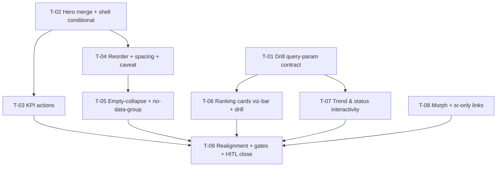

# Tasks — project-detail / Project Dashboard v3 · F1 Hero, Layout & Interactivity

- **Module:** client / project-detail (STAR)
- **Spec id:** 2026-08-project-dashboard-v3-f1
- **Status:** not-started
- **Owner:** JuanCode
- **Linked requirements:** ./requirements.md
- **Linked design:** ./design.md
- **Last updated:** 2026-08-23

> **Gate conventions for every task** (client child guide): app-code gate `npm run build`; spec-code gate `npx tsc -p tsconfig.spec.json --noEmit` **as a delta against the 945-error baseline** (K-002); lint gate `npx eslint <changed paths>` (never `npm run lint` — it is `--fix`, K-001); targeted jest runs MUST pass `--coverage=false` or their exit code is noise (K-020); full-suite runs only when no delegated agent is active (root guide §4.3). Skills per task from the Skill Map: `angular-developer` always; `ui-ux-pro-max` on UI tasks; `systematic-debugging` on any unexpected red.

---

## 2. Dependency graph

---

## 3. Task list

### T-01 — Extend the drill-through query-param contract (`leverTab`, `contractTab`, `yearTab`)

- **Requirements covered:** R-HL-005 (lever/contract navigation targets), R-HL-006 (year target); design D-F1-6.
- **Files touched (intended):** `project-detail.component.ts` (+spec), `results-center/results-center.component.ts` (+spec).
- **Description:** Add the three params beside the existing `statusTab`/`indicatorTab` handling (`project-detail.component.ts:79-122`, `results-center.component.ts:92-118`): validate, apply the matching existing filter (`levers`, `contracts`, `years`) via `ResultsCenterService`, strip from URL after application.
- **Implementation notes:**
  - Mirror the `indicatorTab` pattern exactly, including `skipMain` semantics.
  - `contractTab` is a contract code (string) — validate format, not numeric-only.
- **Acceptance / done check:**
  - [x] Spec: landing with `leverTab=<id>` applies the lever filter then clears the param (assert on `tableFilters` and on `Router` URL-cleanup call). Same for `contractTab`, `yearTab`.
  - [x] Spec: malformed values (`leverTab=abc`, empty) apply nothing and clear the param.
  - [x] `npx jest <both specs> --coverage=false` green; **failing input that must redden it:** reintroduce param-ignoring (return before `applyFilters`) → both landing specs fail. If they stay green under that mutation, the specs assert presence not behavior — disqualified.
- **Dependencies:** none · **Effort:** S · **Status:** done

### T-02 — Unified hero: dashboard KPI+context rows, shell fact rows conditional, context strip retired

- **Requirements covered:** R-HL-001 (whole requirement incl. "no fact dropped" + per-source skeletons), R-HL-009 (hero portion); design D-F1-1, RC-1, RC-4.
- **Files touched (intended):** `project-detail.component.{html,ts}` (+spec), `project-dashboard.component.{html,ts}` (+spec), `components/project-context-strip/*` (deleted), field-inventory checklist from design §5.
- **Description:** Shell hides its `<dl>` fact rows when `lastSegment() === 'project-dashboard'`; dashboard renders the hero KPI row + context chips (budget, center budget, funding type, timeline bar, lever, foundress, division, unit, SDGs, entities) sourcing each field per requirements R-HL-001; context-strip logic (amount formatting, timeline math, SDG/entity mapping) migrates with its unit tests; strip component and its usages deleted.
- **Implementation notes:**
  - Three independent skeleton regions (project detail / contract payload / staff) — never one global skeleton.
  - KZ-001: hero specs use object-shaped SDG/entity fixtures mirroring the live payload.
- **Acceptance / done check:**
  - [x] Spec (dashboard tab): each inventory field asserted rendered **exactly once** (query by label, expect length 1).
  - [x] Spec (RC-4 regression): on `project-results` segment the shell fact rows are present, unchanged.
  - [x] Spec (KZ-015): construct with sources unresolved → skeletons; resolve → facts. Not pre-resolved fixtures.
  - [x] `grep -rn "project-context-strip" client/research-indicators/src` returns zero hits (deletion closure; **failing input:** any lingering import/selector).
  - [x] Presence caveat: "exactly once" DOM queries prove presence/count only — visual placement is T-09 HITL's to prove.
- **Dependencies:** none · **Effort:** L · **Status:** done

### T-03 — KPI tile actions

- **Requirements covered:** R-HL-002 (both scenarios, all clauses); design D-F1-5.
- **Files touched (intended):** `project-dashboard.component.{html,ts}` (+spec).
- **Description:** Total results tile → routerLink to `project-results`; Indicators covered tile → PrimeNG Popover listing only indicators with results (name + count), rows navigate with `indicatorTab`; Partner institutions tile → smooth scroll (reduced-motion → instant) to the rankings section; Pending revision anchor unchanged.
- **Implementation notes:**
  - Tiles become real `<a>`/`<button>` with accessible names naming destination; disabled (non-interactive) while their source is loading.
  - Popover: focus management + Escape verified in spec via PrimeNG API; if a11y review at T-09 fails, fall back to inline disclosure (D-F1-5).
- **Acceptance / done check:**
  - [x] Spec: activating Total results calls `Router.navigate` to `.../project-results` — arranged as transition (KZ-015): initial render, no navigation; click, navigation.
  - [x] Spec: popover lists exactly indicators with `value > 0` (fixture includes a zero-count indicator that must NOT appear — the named failing input).
  - [x] Spec: tile in loading state does not navigate on click.
  - [x] `npx jest <spec> --coverage=false` green; disqualifier: any navigation assertion that passes without the click event.
- **Dependencies:** T-02 · **Effort:** M · **Status:** done

### T-04 — Section reorder, spacing normalization, caveat compression

- **Requirements covered:** R-HL-003 (all clauses), R-HL-008 (both clauses); design §6, D-F1-7.
- **Files touched (intended):** `project-dashboard.component.html`, `geo-scope-card.component.html` (+specs).
- **Description:** Reorder sections per design §6; apply the `gap-5`/`p-5`/`gap-4` scale; geo card `gap-16` → `gap-6`; caveat to single line with existing Learn-more expansion; no DOM for the F3 slot (comment only).
- **Acceptance / done check:**
  - [x] Spec: DOM order assertion — trend & status sections precede the first ranking card; geo section marked full-width class.
  - [x] Spec: no element with a `gap-16` class remains in the two touched templates (**failing input:** leave one).
  - [x] Presence caveat: class assertions prove classes, not geometry — overflow/no-horizontal-scroll at 1280/768px is T-09 HITL's check (declared gap per requirements defect table).
  - [x] `npm run build` green (strictTemplates over reordered template).
- **Dependencies:** T-02 · **Effort:** M · **Status:** done

### T-05 — Empty-collapse rule + `no-data-group` component

- **Requirements covered:** R-HL-004 (scenario + both negative clauses + re-expand clause); design D-F1-3.
- **Files touched (intended):** `components/no-data-group/*` (new, +spec), `project-dashboard.component.{html,ts}` (+spec).
- **Description:** Widgets listed in R-HL-004 render in place for loading/error/data; confirmed-empty feeds `{name, reason}` into the no-data-group after the pending table. Fixed reason strings per widget (copy reviewed at HITL). Trend with exactly one bucket stays in place (existing sparse presentation).
- **Acceptance / done check:**
  - [x] Spec (KZ-015 transitions): loading → widget in place with skeleton; resolve-empty → collapsed row; resolve-data → widget in place. Error → widget in place with retry.
  - [x] Spec: retry after empty that then yields data re-expands the widget (**failing input:** cache the collapsed state → spec must fail).
  - [x] Spec: single-year trend renders in place, not in the group.
  - [x] `npx jest <specs> --coverage=false` green; disqualifier: fixtures that resolve before first `detectChanges()`.
- **Dependencies:** T-04 · **Effort:** M · **Status:** done

### T-06 — Ranking cards on viz-chart with lever/contract drill-through

- **Requirements covered:** R-HL-005 (scenario + partner/contact NOT clause + icon/email survival), R-HL-009 (chart-region portion); design D-F1-4, §6.
- **Files touched (intended):** `project-dashboard-card.component.{html,ts}` (+spec), `project-dashboard.component.{html,ts}` (+spec).
- **Description:** New `viz-bar` layout path in `project-dashboard-card` delegating to `app-viz-chart` (horizontal bars, tableModel, chartClick output); partners/levers/contacts/contributors switch to it; lever click → `leverTab`, contributor click → `contractTab` (via T-01); partner/contact bars have no click handler; HTML tooltips carry full label + count + contact e-mail / lever icon.
- **Acceptance / done check:**
  - [x] Spec: lever chartClick event navigates with `leverTab` = clicked lever id (transition-arranged); contributor → `contractTab`.
  - [x] Spec: partner and contact configurations emit no navigation on chartClick (**named failing input:** wire the shared handler to all four cards indiscriminately → this spec must fail).
  - [x] Spec: every viz-bar instance receives a non-empty `tableModel` (R-HL-009 non-visual path).
  - [x] Old bespoke bar markup for the four cards removed; `npx eslint <files>` green.
  - [x] Presence caveat: tooltip content asserted as options/formatter output, not rendered pixels — hover rendering is T-09 HITL.
- **Dependencies:** T-01 · **Effort:** L · **Status:** done

### T-07 — Trend and status interactivity

- **Requirements covered:** R-HL-006 (scenario + hover/axis NOT clause + accessible-table clause); design §5.3.
- **Files touched (intended):** `results-trend-card.component.{html,ts}` (+spec), `project-dashboard.component.{html,ts}` (+spec).
- **Description:** Trend chart emits chartClick → navigate with `yearTab` (data-point clicks only); status composition segments become interactive twins of the existing row links (`statusTab`).
- **Acceptance / done check:**
  - [x] Spec: clicking a year data point navigates with that year; an axis-label/blank-area click event does NOT navigate (**named failing input:** handler that navigates on any `chartClick` regardless of `componentType` → must fail).
  - [x] Spec: status segment activation navigates with the bucket's `statusTab`; keyboard activation path asserted on the row link twin.
  - [x] Trend `tableModel` still present and correct.
- **Dependencies:** T-01 · **Effort:** M · **Status:** done

### T-08 — Enable native morph + sr-only indicator link list

- **Requirements covered:** R-HL-007 (all clauses), R-HL-009 (keyboard drill clause for the indicator region); design D-F1-2, RC-2.
- **Files touched (intended):** `project-dashboard.component.{html,ts}` (+spec).
- **Description:** Default `useCrossfadeFallback` to `false`; reduced-motion resolves to the crossfade/no-animation path at runtime; add the sr-only list of real per-indicator links (indicatorTab targets) alongside the morphing chart; both views keep chartClick drill.
- **Acceptance / done check:**
  - [ ] Spec: default state uses engine-native path (single viz-chart with `activeIndicatorChartOptions`); with reduced-motion mocked, fallback path renders (KZ-015: toggle the media-query state, not pre-set it).
  - [ ] Spec: sr-only list contains one real link per indicator-with-results with correct `indicatorTab` params (**failing input:** zero-count indicator in fixture must not appear).
  - [ ] Spec: heatmap click drill still navigates after a bars→heatmap toggle.
  - [ ] Presence caveat: specs prove options/DOM presence; the morph **animation itself** is unprovable in jsdom — owned by T-09 HITL (declared in requirements defect table).
- **Dependencies:** none · **Effort:** M · **Status:** todo

### T-09 — Suite realignment, full gates, HITL visual close

- **Requirements covered:** NFR-HL-001, NFR-HL-002, NFR-HL-003; the visual/dark/motion defect class (requirements defect table); KZ-002 co-rendered components; closes every presence-caveat left by T-02/T-04/T-06/T-08.
- **Files touched (intended):** any spec enumerated by the failing run; no production code except review fixes.
- **Description:** Realign remaining suites (site list from the failing run — K-018, never grep); run full gates; perform the HITL visual verification.
- **Acceptance / done check:**
  - [ ] Full `npm test -- --silent` green (run with no delegated agent active — root guide §4.3); `npm run test:coverage` floors green (NFR-HL-003).
  - [ ] `npm run build` green including budgets (NFR-HL-002); `npx tsc -p tsconfig.spec.json --noEmit` delta ≤ 945 baseline; `npx eslint` on all touched paths green.
  - [ ] **HITL (KZ-014 — no `[x]` anywhere in this spec's checklist without this):** screenshots light + dark at desktop and `md:` widths covering: hero (no duplicates), section order, collapsed no-data group, popover open, tooltips, morph transition observed, results-center-table/custom-tag/section-sidebar rendering intact (KZ-002), no horizontal scroll at 1280/768px (T-04 gap).
  - [ ] Network panel during HITL: request count and endpoints identical to the pre-change inventory (NFR-HL-001). **Disqualifier:** a count taken on a cached/partial load or a different project is not evidence — same project, hard reload, both runs.
  - [ ] **Disqualifier (global):** any gate cited that was not observed failing at least once during this spec's work (K-004) — cite the observed-red instance or run the mutation now.
- **Dependencies:** T-03, T-05, T-06, T-07, T-08 · **Effort:** M · **Status:** todo

---

## 4. Coverage closure (scenario/clause → owning task)

| Requirement clause | Owner |
|---|---|
| R-HL-001 scenario + no-fact-dropped + per-source skeletons | T-02 |
| R-HL-002 Total-results scenario (incl. loading NOT-clause) / popover scenario (incl. zero-count NOT-clause, focus/Escape) | T-03 |
| R-HL-003 scenario + no-placeholder NOT-clause + anchor MUST-clause | T-04 (anchor retained asserted in T-03 spec) |
| R-HL-004 scenario + loading/error NOT-clause + re-expand MUST-clause + single-year rule | T-05 |
| R-HL-005 lever scenario + keyboard MUST-clause + partner/contact NOT-clause + icon/email survival | T-06 |
| R-HL-006 scenario + hover/axis NOT-clause + accessible-table MUST-clause | T-07 |
| R-HL-007 scenario + reduced-motion NOT-clause + post-toggle drill MUST-clause | T-08 |
| R-HL-008 geo scenario + no-horizontal-scroll MUST-clause | T-04 (classes) + T-09 (HITL geometry) |
| R-HL-009 hero traversal scenario + title-only NOT-clause + announce MUST-clause | T-02/T-03 (markup) + T-09 (HITL) |
| NFR-HL-001 / 002 / 003 | T-09 |

## 5. Testing expectations

Per child guide. Bug Mode: n/a (Change). K-012 honored: every task names the concrete input that reddens its gate. Full-suite runs are Leader-timed (§4.3 concurrency rule).

## 6. Execution conventions

Branch: `bilateral-visual-improvements` (current). Commits `<type>(project-dashboard): <subject>` per task. **PR strategy:** estimated ~1,100–1,400 LOC → recommend **2 PRs**: PR-1 structure (T-01…T-05), PR-2 interactivity + close (T-06…T-09), PR-2 description linking PR-1 (review-first: hero dedup; out of scope: server).

## 7. Risks & blockers log

| # | Date | Risk / Blocker | Mitigation | Owner | Status |
|---|---|---|---|---|---|
| RB-1 | 2026-08-23 | Popover a11y fails review | D-F1-5 fallback: inline disclosure | JuanCode | open |
| RB-2 | 2026-08-23 | Suite realignment larger than budget | Budget tripwire → escalate per execute protocol | JuanCode | open |

## 8. Done definition

- [ ] All T-01…T-09 done (checkbox flips only with `execution.md` PASS evidence — repo guardrail hook).
- [ ] Coverage-closure table verified against final code.
- [ ] `docs/ux-ui/design.md` §12.2 delta recorded at archive (KZ-013 backward sweep for the deleted strip).
- [ ] Rollout note: normal dev-branch pipeline; rollback = revert.
