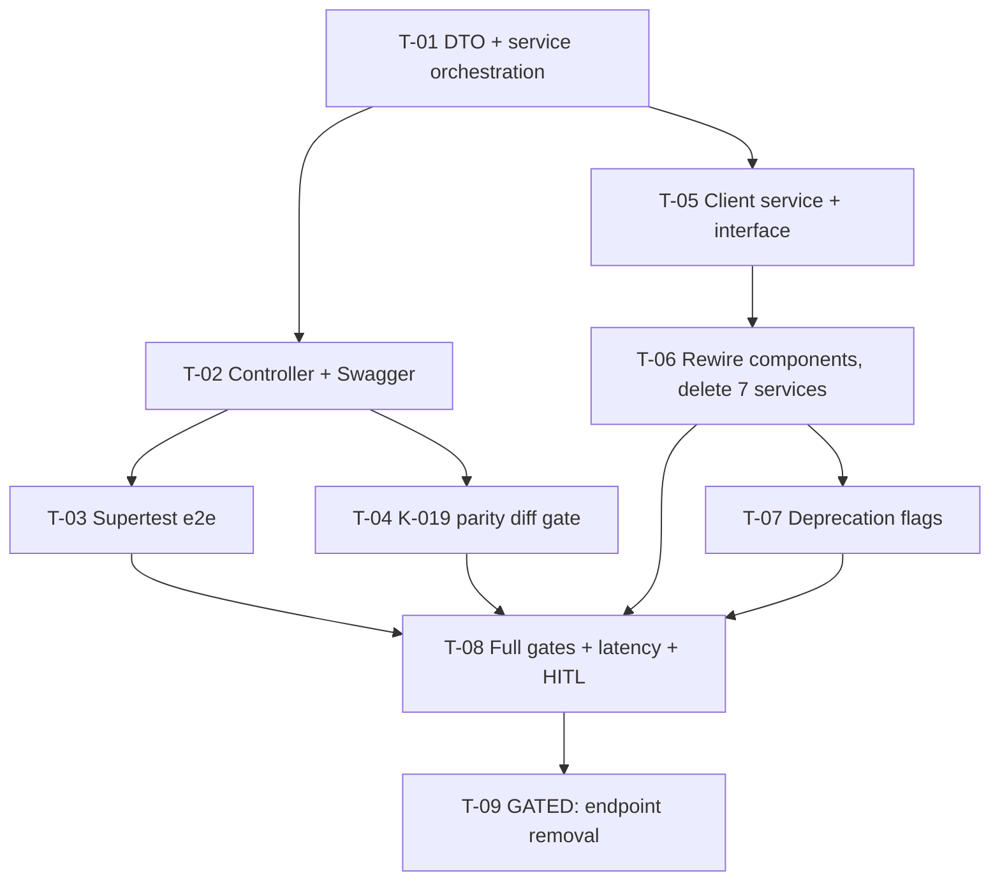

# Tasks — agresso / Project Dashboard v3 · F2 Consolidated Dashboard Endpoint

- **Module:** agresso (server) + client / project-detail (STAR)
- **Spec id:** 2026-08-project-dashboard-v3-f2
- **Status:** not-started
- **Owner:** JuanCode
- **Linked requirements:** ./requirements.md
- **Linked design:** ./design.md
- **Last updated:** 2026-08-23

> **Gate conventions.** Server: tests `npm test -- --silent` / `npm run test:e2e` / `npm run test:cov` from `server/researchindicators`; lint gate `npx eslint <paths>` (never `npm run lint` — `--fix`, K-001). Client: as F1 (`--coverage=false` on targeted runs — K-020; spec-type gate vs 945 baseline — K-002). Never run the two packages' full suites **concurrently** (root guide §4.3 — phantom failures measured twice). Skills: `nestjs-expert` + `api-design-principles` (server tasks), `angular-developer` (client tasks), `error-handling-patterns` (T-01/T-03), `systematic-debugging` on any unexpected red.

---

## 2. Dependency graph

---

## 3. Task list

### T-01 — Aggregate DTO + service orchestration (`Promise.allSettled`)

- **Requirements covered:** R-CD-001 (composition, limit plumbing, no re-sort/re-filter), R-CD-002 (null section + `errors[]` + all-fail throw + `LoggerUtil`); design D-F2-1/2/3/4, §5.
- **Files touched (intended):** `dto/contract-dashboard-report.dto.ts` (NEW), `agresso-contract.service.ts` (+spec).
- **Description:** New orchestration method: validate inputs, normalize `top-limit`(4)/`geo-limit`(5), `Promise.allSettled` over the **7 existing repository methods unmodified**, map fulfilled→verbatim section / rejected→`null` + `{section, message}` error + `LoggerUtil.error`, return `ServiceResponseDto` with `errors` populated only on partial failure; throw InternalServerError when all 7 reject. DTO composes existing section DTOs by reference.
- **Acceptance / done check:**
  - [ ] Specs: all-fulfilled (verbatim sections, `errors` undefined); one-rejected (that section null, one error entry, logger called, others intact); all-rejected (throws); limit plumbing (`top-limit` reaches the 4 top-N calls, `geo-limit` the geo call).
  - [ ] **Failing input:** re-sort a section inside the orchestration (mutate mapper) → the verbatim-section spec must fail; if it stays green it asserted presence, not payload identity — disqualified.
  - [ ] Repository file untouched: `git diff --stat` for `agresso-contract.repository.ts` is empty (**failing input:** any hunk).
  - [ ] `npm test -- --silent` (server) green; `npx eslint <files>` green.
- **Dependencies:** none · **Effort:** M · **Status:** todo

### T-02 — Controller handler + Swagger + validation

- **Requirements covered:** R-CD-001 (route, params, Swagger, 400), design §4.
- **Files touched (intended):** `agresso-contract.controller.ts` (+spec).
- **Description:** `GET reports/dashboard` handler delegating to the T-01 method; `@ApiTags/@ApiBearerAuth/@ApiOperation/@ApiQuery×3`; missing/blank `contract-id` → 400 (same validation pattern as sibling handlers).
- **Acceptance / done check:**
  - [ ] Controller spec: delegation with normalized params; 400 on missing contract-id (**failing input:** call with `contract-id=''` — must produce the 400 path, not a 200 with empty sections).
  - [ ] Swagger decorators asserted present — **presence caveat:** decorator presence ≠ rendered docs; the `/swagger` render check happens at T-08 HITL.
  - [ ] Server suite + eslint green.
- **Dependencies:** T-01 · **Effort:** S · **Status:** todo

### T-03 — Supertest e2e: envelope, partial failure, auth

- **Requirements covered:** R-CD-002 (whole scenario incl. BUT/MUST), R-CD-001 envelope shape; requirements defect table rows 1/4 (KZ-017 owner).
- **Files touched (intended):** `test/agresso-contract-dashboard.e2e-spec.ts` (NEW).
- **Description:** e2e through the real interceptor/exception chain: (a) 200 with all sections + `errors` absent; (b) one section provider forced to throw → 200, that section `null`, `errors` names it, others populated; (c) all thrown → 500 envelope; (d) 400 missing contract-id; (e) 401 without token.
- **Acceptance / done check:**
  - [ ] `npm run test:e2e` green including the 5 cases; **failing input for (b):** make the orchestration rethrow on first rejection — case (b) must fail with a 500.
  - [ ] **Disqualifier:** asserting (b) via unit mocks of the interceptor instead of the e2e path — that evidence is void for this class (KZ-017, declared in requirements).
- **Dependencies:** T-02 · **Effort:** M · **Status:** todo

### T-04 — K-019 parity diff gate (old vs new, fixed contracts)

- **Requirements covered:** NFR-CD-003, R-CD-001 parity AND-clause, R-CD-004 diff evidence.
- **Files touched (intended):** capture script under the spec folder (e.g. `parity-capture.sh`), diff records in `execution.md`. No production code.
- **Description:** Against the dev DB (local server): for 3 named contracts — rich (A511), sparse bilateral, zero-results — capture the 7 standalone payloads and the aggregate **back-to-back per contract**, normalize only the envelope timestamp/path, and diff each section (ordering included).
- **Acceptance / done check:**
  - [ ] Zero divergences, or each divergence quoted + explained + owner-approved in `execution.md`.
  - [ ] **Failing input:** point the diff at a section with a deliberately changed sort — it must report a divergence (run this mutation once to prove the gate can redden — K-004).
  - [ ] **Disqualifier:** captures on different days/environments, or normalizing anything beyond timestamp/path (a normalization that erases ordering differences makes the diff worthless); shared-dev data may mutate mid-capture — if the standalone and aggregate captures of a contract disagree on **counts**, re-capture back-to-back before reading the diff as a defect.
- **Dependencies:** T-02 · **Effort:** M · **Status:** todo

### T-05 — Client: interface + API method + consolidated signal service

- **Requirements covered:** R-CD-003 (service surface), design D-F2-5, §2.2.
- **Files touched (intended):** `contract-dashboard.interface.ts` (NEW), `api.service.ts` (+`GET_ContractDashboard`), `get-contract-dashboard.service.ts` (NEW, +spec).
- **Description:** Signal triple (fetch/loading/loadError) + per-section accessors named after the old services' surface + `sectionFailed(name)` derived from the envelope `errors`.
- **Acceptance / done check:**
  - [ ] Service spec with `HttpTestingController` asserting the `MainResponse<T>` envelope and the exact URL/params (**failing input:** change a param name — URL assertion must fail).
  - [ ] Fixtures use the **live nested aggregate shape** (KZ-001 — object-shaped sections; a primitive fixture disqualifies the evidence).
  - [ ] `npx jest <spec> --coverage=false` green; eslint green.
- **Dependencies:** T-01 (shape) · **Effort:** M · **Status:** todo

### T-06 — Rewire dashboard + geo card; delete the 7 services; realign suites

- **Requirements covered:** R-CD-003 (single request, null→error BUT-clause, untouched non-analytic calls MUST-clause), R-CD-004 (parity + NOT-clause), design RC-2, D-F2-7, §6.
- **Files touched (intended):** `project-dashboard.component.ts` (+spec), `geo-scope-card.component.ts` (+spec), deletion of the 7 services + their specs + 7 `api.service.ts` methods; any spec the failing run enumerates.
- **Description:** Both components inject the consolidated service; per-widget computeds map (aggregate loading → skeletons; section null → error state with shared retry; section empty → empty-collapse). Then delete the 7 services/methods and let the **failing suite run enumerate** remaining references (K-018 — never a grep list).
- **Acceptance / done check:**
  - [ ] Specs (KZ-015 transitions): loading→data renders parity values; loading→section-null renders the widget **error** state with retry — and NOT a no-data row (**named failing input:** wire section-null into the empty computed — this spec must fail).
  - [ ] Spec: exactly one analytic request issued per view (assert via service/Http mock call counts); `results/count`/`contract-staff`/results-table/document-overview calls unchanged.
  - [ ] `grep -rn "GetTopPartnersService\|GetGeoScopeService\|GetContractSpAlignmentService\|GetContractResultsSummaryService\|GetTopPrimaryLeversService\|GetTopMainContactPersonsService\|GetTopContributorsContractsService" client/research-indicators/src` → zero hits (deletion closure; **failing input:** one lingering import).
  - [ ] Full client suite green; F1 expectations unchanged except mock shapes (R-CD-004 — a template/aria/queryParam diff in the F1 components disqualifies parity).
- **Dependencies:** T-05 · **Effort:** L · **Status:** todo

### T-07 — Deprecation flags on the 7 standalone handlers

- **Requirements covered:** R-CD-005 step 1.
- **Files touched (intended):** `agresso-contract.controller.ts` (+spec deltas).
- **Description:** `@ApiOperation({ deprecated: true, ... })` on the 7 handlers; behavior untouched (they keep serving until T-09).
- **Acceptance / done check:**
  - [ ] Controller specs still green (handlers functional); decorator presence asserted — **presence caveat:** rendered Swagger "deprecated" badge verified at T-08 HITL `/swagger` check.
  - [ ] **Failing input:** flag accidentally added to the new dashboard handler → the new handler's spec asserting non-deprecated must fail.
- **Dependencies:** T-06 · **Effort:** S · **Status:** todo

### T-08 — Full gates, latency measurement, HITL close (Release 1)

- **Requirements covered:** NFR-CD-001, NFR-CD-004; requirements defect-table HITL row; F1's carried dark-mode debt.
- **Files touched (intended):** spec docs only (evidence records).
- **Description & checks:**
  - [ ] Server: `npm test -- --silent`, `npm run test:e2e`, `npm run test:cov` (≥60%) — run **sequentially with** the client suite, never concurrently (§4.3).
  - [ ] Client: full suite + `npm run test:coverage` floors + `npm run build` (budgets) + `npx tsc -p tsconfig.spec.json --noEmit` delta ≤ 945.
  - [ ] **Latency (NFR-CD-001):** 3 timed runs of the aggregate on dev/A511-class; p95-proxy ≤ 600 ms. **Disqualifier:** spread >±40% → report the spread as inconclusive, never a pass; a run during another agent's build/tests is void (§4.3 measurement rule).
  - [ ] **HITL (KZ-014 — human-observed):** network panel shows exactly **1** `reports/dashboard` call and zero standalone report calls; all widgets render parity data; drills navigate (route resolution — only provable here); `/swagger` renders the new endpoint + 7 deprecated badges; **light + dark** screenshots (dark owed since F1).
  - [ ] **Global disqualifier (K-004):** no gate cited without having been observed red at least once during this spec (cite the red or run the mutation).
- **Dependencies:** T-03, T-04, T-06, T-07 · **Effort:** M · **Status:** todo

### T-09 — GATED: remove the 7 standalone endpoints (Release 2)

- **Requirements covered:** R-CD-005 steps 2–3 (removal scenario incl. BUT/MUST), KZ-013 sweep.
- **Files touched (intended):** `agresso-contract.controller.ts`, `agresso-contract.service.ts` (pass-throughs), TRD API section citations, any doc the sweep finds.
- **Description:** **Blocked until** the consumer check is recorded in `execution.md`: (a) repo grep of both packages for the 7 routes → STAR-free; (b) `app_secret_host_list` consumers reviewed against the dev access-log source the owner names (OQ-2) over an agreed window. Evidence ambiguous or showing traffic → **escalate to owner, do not remove**. Then remove handlers + pass-throughs (repository methods and DTO classes stay — the aggregate uses them), and sweep docs citing the old routes (KZ-013: forward grep for the 7 paths across `docs/` excluding `archive/`).
- **Acceptance / done check:**
  - [ ] Consumer-check evidence recorded BEFORE any code change (**disqualifier:** evidence written in the same commit as the removal — it must pre-exist and be dated).
  - [ ] e2e: the 7 routes now 404; the aggregate + repository specs still green (**failing input:** deleting a repository method the aggregate composes → T-01 specs must fail).
  - [ ] Docs sweep hits resolved or intentionally kept (each recorded).
- **Dependencies:** T-08 + owner approval + OQ-2 evidence · **Effort:** M · **Status:** blocked (by design — not startable until the gate opens)

---

## 4. Coverage closure (scenario/clause → owning task)

| Requirement clause | Owner |
|---|---|
| R-CD-001 scenario: full payload + limits MUST-clause + no-re-sort BUT-clause | T-01 (unit) + T-03 (envelope) + T-04 (parity proof) |
| R-CD-001 Swagger/params/400 | T-02 (+T-08 rendered `/swagger`) |
| R-CD-002 scenario: null + errors + 200 + no-whole-fail BUT + logging MUST | T-01 (unit) + **T-03 (owning gate, e2e)** |
| R-CD-003 scenario: 1 request + parity AND + null≠no-data BUT + untouched-calls MUST | T-06 (+T-08 HITL network count) |
| R-CD-004 scenario: parity + K-019 MUST + no-contract-change BUT | T-04 (diff) + T-06 (suites) + T-08 (HITL) |
| R-CD-005 step 1 (deprecate) | T-07 |
| R-CD-005 steps 2–3: removal scenario + no-removal-without-evidence BUT + repo-methods-stay MUST | T-09 |
| NFR-CD-001 (latency + disqualifier) | T-08 |
| NFR-CD-002 (no cache — absence check, declared) | Reviewer pass at T-01/T-02 |
| NFR-CD-003 (K-019 gate) | T-04 |
| NFR-CD-004 (coverage both tiers) | T-08 |

## 5. Testing expectations

Per templates. Bug Mode: n/a. K-012: every task names its reddening input. K-019 explicitly gated at T-04. No migrations (K-015 n/a — recorded).

## 6. Execution conventions

Branch: `bilateral-visual-improvements`. Commits `<type>(agresso-contract|project-dashboard): <subject>` per task, `[SPEC:changes/project-dashboard-v3/f2-consolidated-endpoint]` prefix. **PR strategy (~950–1,250 LOC):** **2 PRs** — PR-1 server (T-01…T-04: endpoint + e2e + parity evidence; review first: orchestration error mapping), PR-2 client + deprecation (T-05…T-08; out of scope: removal). **T-09 is its own later PR** after the gate opens. Chained descriptions per `cognitive-doc-design` review-empathy rules.

## 7. Risks & blockers log

| # | Date | Risk / Blocker | Mitigation | Owner | Status |
|---|---|---|---|---|---|
| RB-1 | 2026-08-23 | OQ-2: dev access-log source unnamed | Blocks only T-09; owner names it before Release 2 | JuanCode | open |
| RB-2 | 2026-08-23 | Shared dev data mutates between parity captures | Back-to-back capture per contract + count-mismatch re-capture rule (T-04 disqualifier) | JuanCode | open |

## 8. Done definition

- [ ] T-01…T-08 done with recorded evidence (guardrail hook: `execution.md` PASS before any `[x]`).
- [ ] T-09 done **or** explicitly carried as the gated Release-2 follow-up at archive.
- [ ] Coverage-closure table verified against final code.
- [ ] TRD API-contract delta (new endpoint; deprecated/removed routes) recorded at archive sync.
- [ ] Rollout note: Release 1 dev-branch pipeline; Release 2 gated; rollback = revert per release.
