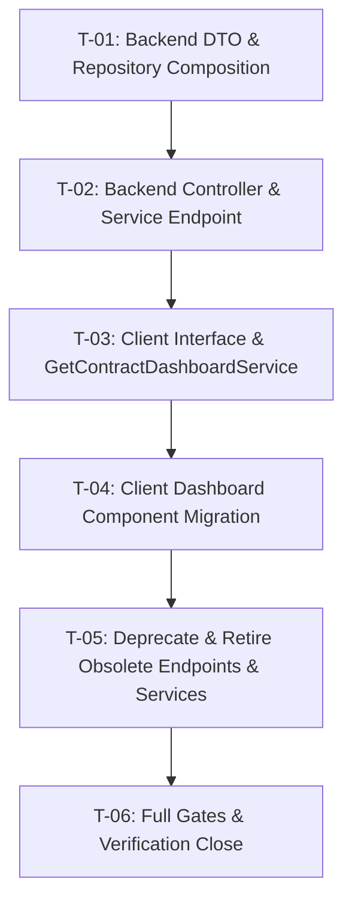

# Tasks — Project Dashboard v3 / F2: Consolidated Dashboard Endpoint

## 1. Document Control

| Field | Value |
|---|---|
| Spec path | `docs/specs/changes/project-dashboard-v3/f2-consolidated-endpoint/` |
| Parent Spec | `changes/project-dashboard-v3` (see `../family.md`) |
| Type | Change |
| Depth | Full |
| Approval Mode | gated |
| Depends on | `f1-hero-layout` (Status: done) |
| Date | 2026-08-23 |
| Author | JuanCode (via AKILI-SPECS) |
| Status | Ready |

---

## 2. Dependency Graph & Task Inventory

---

## 3. Tasks

### T-01 — Backend DTO & Repository Composition

- **Requirements covered:** R-CE-001, R-CE-002, NFR-CE-002; design §5, §7 (DD-1, DD-2).
- **Files touched (intended):**
  - `server/researchindicators/src/domain/entities/agresso-contract/dto/contract-dashboard-report.dto.ts` (new)
  - `server/researchindicators/src/domain/entities/agresso-contract/repositories/agresso-contract.repository.ts` (+spec)
- **Description:** Create `ContractDashboardReportDto` and `ContractDashboardTopsDto`. Implement `getContractDashboard(contractId)` in `AgressoContractRepository` composing the seven subqueries concurrently via `Promise.allSettled` and isolating section errors into nullable fields.
- **Acceptance / done check:**
  - [x] Spec: `getContractDashboard` executes all 7 subqueries in parallel and returns fully-populated composite object for bilateral contracts.
  - [x] Spec: when `geo_scope` subquery throws, `geo_scope` is `null` in data and error is recorded in `errors` array, while sibling sections succeed (**failing input:** fail whole method on one subquery error → spec must fail).
  - [x] Spec: non-bilateral contracts return `sp_alignment: null` without error.
  - [x] `npm test -- agresso-contract.repository.spec.ts` passes.
- **Dependencies:** none · **Effort:** M · **Status:** done

---

### T-02 — Backend Controller & Service Endpoint

- **Requirements covered:** R-CE-001, R-CE-002; design §6, §7.
- **Files touched (intended):**
  - `server/researchindicators/src/domain/entities/agresso-contract/agresso-contract.service.ts` (+spec)
  - `server/researchindicators/src/domain/entities/agresso-contract/agresso-contract.controller.ts` (+spec)
- **Description:** Expose `getContractDashboard` in `AgressoContractService` and route `@Get('reports/dashboard')` in `AgressoContractController` with `@ApiTags`, `@ApiBearerAuth`, `@ApiOperation`, `@ApiQuery({ name: 'contract-id' })`, and response envelope formatting.
- **Acceptance / done check:**
  - [x] Spec: controller endpoint validates `contract-id` query param and returns `ResponseUtils.format({ data, description, errors })`.
  - [x] Spec: missing `contract-id` returns validation error.
  - [x] `npm test -- agresso-contract.controller.spec.ts agresso-contract.service.spec.ts` passes.
- **Dependencies:** T-01 · **Effort:** S · **Status:** done

---

### T-03 — Client Interface & `GetContractDashboardService`

- **Requirements covered:** R-CE-003, NFR-CE-001; design §5, §8.
- **Files touched (intended):**
  - `client/research-indicators/src/app/shared/interfaces/contract-dashboard.interface.ts` (new)
  - `client/research-indicators/src/app/shared/services/api.service.ts` (+spec)
  - `client/research-indicators/src/app/shared/services/get-contract-dashboard.service.ts` (new +spec)
- **Description:** Define client TypeScript interfaces matching the backend composite DTO. Add `GET_ContractDashboard(contractId)` to `ApiService`. Implement `GetContractDashboardService` with signals for `dashboard`, `summary`, `tops`, `geoScope`, `spAlignment`, `loading`, `loadError`, and methods `load()` and `update()`.
- **Acceptance / done check:**
  - [x] Spec: `load(contractId)` sets `loading` to true, fetches composite data, and populates computed signals simultaneously (KZ-015: transition test).
  - [x] Spec: `update()` re-fetches with `force: true`.
  - [x] Spec: network error transitions `loadError` to true and `loading` to false.
  - [x] `npx jest src/app/shared/services/get-contract-dashboard.service.spec.ts src/app/shared/services/api.service.spec.ts --coverage=false` passes.
- **Dependencies:** T-02 · **Effort:** M · **Status:** done

---

### T-04 — Client Dashboard Component Migration

- **Requirements covered:** R-CE-003, R-CE-004; design §8 (DD-3).
- **Files touched (intended):**
  - `client/research-indicators/src/app/pages/platform/pages/project-detail/components/project-dashboard/project-dashboard.component.ts` (+spec)
  - `client/research-indicators/src/app/pages/platform/pages/project-detail/components/project-dashboard/project-dashboard.component.html`
- **Description:** Migrate `ProjectDashboardComponent` to inject `GetContractDashboardService` instead of the 7 separate services. Rewire computed signals (`partnerItems`, `leverItems`, `contributorItems`, `mainContactPersonItems`, `statusBuckets`, `geoScopeEmpty`, `trendEmpty`, `collapsedEmptyWidgets`, `retryDashboard`). Ensure all F1 interactive features, tooltips, drill-through query parameters (`leverTab`, `contractTab`, `yearTab`, `indicatorTab`, `statusTab`), and empty collapse work identically.
- **Acceptance / done check:**
  - [x] Spec: component triggers single dashboard service load on `contractId` signal change.
  - [x] Spec: empty collapse into `no-data-group` continues to work properly for empty sections.
  - [x] Spec: all drill-through clicks (levers, contributors, trend, indicators) navigate with correct query parameters.
  - [x] `npx jest src/app/pages/platform/pages/project-detail/components/project-dashboard/project-dashboard.component.spec.ts --coverage=false` passes.
- **Dependencies:** T-03 · **Effort:** L · **Status:** done

---

### T-05 — Deprecate & Retire Obsolete Endpoints & Services

- **Requirements covered:** R-CE-005; design §9 (DD-3).
- **Files touched (intended):**
  - `server/researchindicators/src/domain/entities/agresso-contract/agresso-contract.controller.ts` (+spec)
  - `client/research-indicators/src/app/shared/services/api.service.ts` (+spec)
  - Delete 7 obsolete client service files (`get-contract-results-summary`, `get-top-partners`, `get-top-primary-levers`, `get-top-main-contact-persons`, `get-top-contributors-contracts`, `get-geo-scope`, `get-contract-sp-alignment` + specs).
- **Description:** Remove legacy report endpoints in `AgressoContractController` and legacy client services, confirming zero remaining references across the codebase.
- **Acceptance / done check:**
  - [x] Grep for obsolete service names across `client/research-indicators/src` returns 0 matches.
  - [x] Server and client builds and test suites pass cleanly.
- **Dependencies:** T-04 · **Effort:** S · **Status:** done

---

### T-06 — Full Gates & End-to-End Verification Close

- **Requirements covered:** NFR-CE-001, NFR-CE-002, NFR-CE-003; design §10.
- **Files touched (intended):** any spec requiring alignment.
- **Description:** Run full backend and frontend test suites, linting, and build gates. Verify single HTTP request in network inspection.
- **Acceptance / done check:**
  - [ ] Backend tests (`npm test` in `server/researchindicators`) green.
  - [ ] Frontend tests (`npm test -- --silent` in `client/research-indicators`) green with coverage thresholds satisfied.
  - [ ] Production build (`npm run build` in both packages) green.
  - [ ] ESLint clean on all touched paths.
- **Dependencies:** T-05 · **Effort:** M · **Status:** todo

---

## 4. Coverage Closure

| Requirement Clause | Owning Task |
|---|---|
| R-CE-001 scenario + non-bilateral clause | T-01, T-02 |
| R-CE-002 scenario + partial failure isolation | T-01, T-02 |
| R-CE-003 scenario + unified retry | T-03, T-04 |
| R-CE-004 scenario + empty-collapse & drill-through parity | T-04 |
| R-CE-005 scenario + legacy retirement | T-05 |
| NFR-CE-001 network efficiency | T-03, T-04, T-06 |
| NFR-CE-002 concurrent execution | T-01, T-02 |
| NFR-CE-003 test coverage | T-06 |
