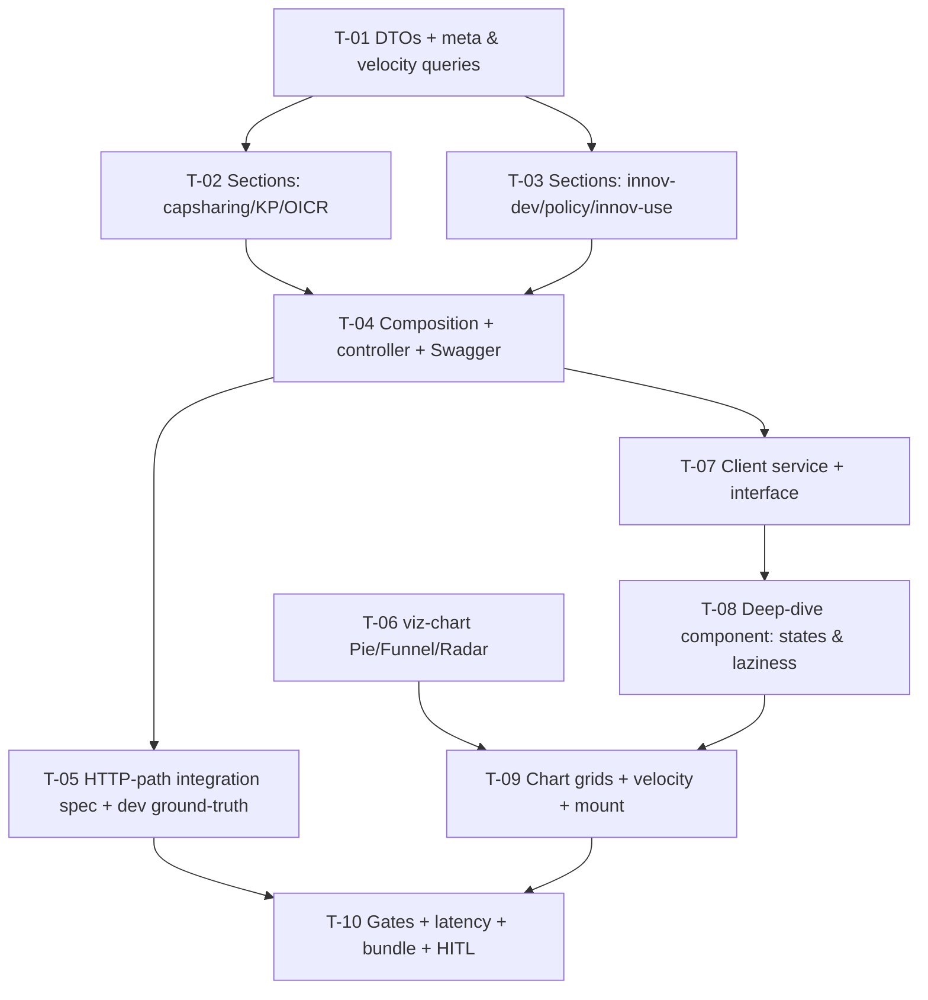

# Tasks — agresso / Project Dashboard v3 · F3 Indicator Deep-Dive

- **Module:** agresso (server) + client / project-detail (STAR)
- **Spec id:** 2026-08-project-dashboard-v3-f3
- **Status:** not-started
- **Owner:** JuanCode
- **Linked requirements:** ./requirements.md
- **Linked design:** ./design.md · **Visual reference:** ./mockup/deep-dive-panel.html
- **Last updated:** 2026-08-23

> **Gate conventions** (as F2 tasks.md): server `npm test -- --silent` / `npm run test:integration` (HTTP-path specs; **never** `npm run test:e2e`, whose only suite boots `AppModule` against remote dev infra) / `test:cov`; client targeted runs with `--coverage=false` (K-020); lint via `npx eslint` only (K-001); spec-type gate = delta vs 945 baseline (K-002); the two packages' full suites never run **concurrently** (§4.3). Skills: `nestjs-expert` (T-01…T-05), `angular-developer` + `ui-ux-pro-max` (T-06…T-09), `error-handling-patterns` (T-04), `systematic-debugging` on any unexpected red.
>
> **Family sequencing gate:** T-07…T-09 (client) MUST NOT start until F2's client tasks are merged (`family.md`: not parallel-safe; both touch `project-dashboard.component` and `api.service.ts`). Server tasks T-01…T-05 may proceed meanwhile.

---

## 2. Dependency graph

---

## 3. Task list

### T-01 — DTOs + section-meta and velocity queries

- **Requirements covered:** R-DD-001 (meta `{total_results, n}` clauses), R-DD-006 (monthly bucketing MUST-clause); design §2.1, D-F3-7.
- **Files:** `dto/contract-indicator-details-report.dto.ts` (NEW), `repositories/agresso-contract.repository.ts` (+spec).
- **Description:** DTO classes (per-section shapes + `SectionMeta` + error entry); repository: per-indicator `total_results` from the seed; `reporting_velocity` (last 24 months, `created_at` month-truncated).
- **Acceptance / done check:**
  - [x] SQL specs: velocity groups by `created_at` month, never `report_year` (**failing input:** switch the bucketing column → spec must fail); meta counts distinct results.
  - [x] `npm test -- --silent` (server) + `npx eslint` green.
- **Deps:** none · **Effort:** M · **Status:** done

### T-02 — Section queries: capacity_sharing, knowledge_product, oicr

- **Requirements covered:** R-DD-002 rows 1/3/5 (+ absent≠0 BUT-clause, sparse scenario `n` semantics); design §2.1.
- **Files:** repository (+spec).
- **Description:** Joined, label-resolved aggregates: trainees totals + gender + length/modality/type mixes; open-access/access-status/type + publications-by-year; maturity distribution + external-use split. Each returns rows only from contributing results (`n`).
- **Acceptance / done check:**
  - [x] SQL specs assert generated SQL + params (KZ-001) with fixtures: multi-row satellite, **result without satellite row** (must not contribute zeros — the named failing input: a LEFT-JOIN-with-COALESCE-0 mutation must redden the sums spec).
  - [x] Label fields resolved (lookup join asserted; **failing input:** drop a join → label NULL → spec fails).
- **Deps:** T-01 · **Effort:** L · **Status:** done

### T-03 — Section queries: innovation_dev, policy_change, innovation_use

- **Requirements covered:** R-DD-002 rows 2/4/6, R-DD-004 radar scenario (`answered_count` clauses); requirements R-1 (funnel order); design D-F3-3.
- **Files:** repository (+spec).
- **Description:** Readiness histogram (ordered by level) + type/nature/users mixes + 7-flag `{true_count, answered_count}`; stage funnel (order per `policy_stage` order column — **resolve R-1 here and record the answer in execution.md**) + type mix + distinct role-4 institutions; actors gender×youth sums (overall + by actor type) + org-type mix + quantifications by unit.
- **Acceptance / done check:**
  - [x] SQL specs: NULL boolean neither true nor answered (**failing input:** count-all-rows instead of count-non-null for `answered_count` → spec fails); funnel ordering asserted against a fixture with out-of-order ids.
  - [x] Actors sums exclude NULL disaggregations (absent ≠ 0).
- **Deps:** T-01 · **Effort:** L · **Status:** done

### T-04 — Composition method + service + controller + Swagger

- **Requirements covered:** R-DD-001 scenario (presence/omission clauses, 400, Swagger MUST), partial-failure semantics; design §2.1, D-F3-1, D-F3-7.
- **Files:** repository composition, `agresso-contract.service.ts`, `agresso-contract.controller.ts` (+specs).
- **Description:** `getIndicatorDetailsReport` composing the seven queries via `Promise.allSettled` (F2 as-built idiom): zero-result indicator → key **omitted**; failure → `null` + envelope error + `LoggerUtil.error`; all-fail → throw. Controller handler + full Swagger + 400 validation.
- **Acceptance / done check:**
  - [x] Unit specs: omission vs null vs populated tri-state (**failing input:** emit `null` for a zero-result indicator → tri-state spec fails); section methods unmodified by composition (diff-scoped).
  - [x] Server suite + eslint green.
- **Deps:** T-02, T-03 · **Effort:** M · **Status:** done

### T-05 — HTTP-path integration spec (in-process, no infra) + dev ground-truth check

> **Amended 2026-08-23 (owner decision, Correction Closure).** The original wording "supertest e2e" was read as the repo's only `*.e2e-spec.ts` example, which boots the full `AppModule` against remote dev infra (MySQL, RabbitMQ, OpenSearch) — a 26-minute connection-retry hang, and a test touching the **shared, non-disposable dev DB**. The class of defect this task owns (KZ-017: envelope composition + partial-failure path through the real interceptor/exception filter) needs the **HTTP layer**, not the infrastructure. Bootstrap scope is now explicit.

- **Requirements covered:** R-DD-001 envelope behavior through the real HTTP path (KZ-017 owner); requirements defect rows 1–3.
- **Files:** `test/agresso-contract-indicator-details.integration-spec.ts` (NEW — runs under `npm run test:integration`, the repo's no-`AppModule` config; follow `test/bilateral-primary-contributing-sp.integration-spec.ts` as the wiring template); evidence in `execution.md`.
- **Description:** `Test.createTestingModule` with **only** `AgressoContractController` + `AgressoContractService`, the global `ResponseInterceptor` and `GlobalExceptions` filter applied to the test app, and `AgressoContractRepository` **replaced via `overrideProvider` with a mock** whose section methods resolve/reject per case. `supertest` against `app.getHttpServer()`. Cases: mixed-indicator contract (sections present/omitted per rule), one-section rejection → 200 + `null` + envelope `errors` entry, all-rejected → 500 envelope, 400 missing `contract-id`. The 401 case is a **unit test on `JwtMiddleware`** (already covered by its own spec — cite it), not a bootstrapped auth stack. Then the **ground-truth check** on dev: endpoint numbers vs hand-run SQL for capacity trainees total and KP open-access split on A511.
- **Implementation notes:**
  - MUST NOT import `AppModule`, open a TypeORM `DataSource`, or reach any network — a spec that does is disqualified for this task regardless of outcome.
  - `test/app.e2e-spec.ts` (full-`AppModule` smoke) is an infrastructure test and is **not** part of this task's gate; do not run `npm run test:e2e` as evidence here.
- **Acceptance / done check:**
  - [x] `npm run test:integration` green incl. the 4 HTTP cases, wall-clock **< 60 s** (**failing input for partial failure:** a rethrow-on-first-rejection mutation must turn the case into a 500 and fail it; **disqualifier:** a run that opens a DB connection or exceeds the timeout — it is testing infrastructure, not the envelope).
  - [x] 401 coverage cited from the `JwtMiddleware` spec (file + test name).
  - [x] Ground-truth: both comparisons recorded with the SQL used and both value sets; **disqualifier:** endpoint call and SQL run not back-to-back (shared dev data mutates), or different contracts compared.
- **Deps:** T-04 · **Effort:** M · **Status:** done

### T-06 — Register Pie/Funnel/Radar in viz-chart

- **Requirements covered:** R-DD-004 (registration + token clauses); NFR-DD-003 partial; design §2.2.
- **Files:** `shared/components/viz-chart/viz-chart.component.ts` (+spec).
- **Description:** Tree-shaken imports + ComposeOption union extension. No API change.
- **Acceptance / done check:**
  - [ ] `npm run tokens:validate` green; existing viz-chart specs green; `npm run build` green.
  - [ ] Presence caveat: registration is not a rendered form — rendering is owned by T-09 specs + T-10 HITL; recorded.
- **Deps:** none · **Effort:** S · **Status:** todo

### T-07 — Client interface + API method + `GetIndicatorDetailsService` 🔒 gate: F2 client landed

- **Requirements covered:** R-DD-003 (single fetch + retry clauses at service level); design §2.2.
- **Files:** `contract-indicator-details.interface.ts` (NEW), `api.service.ts`, `get-indicator-details.service.ts` (NEW, +spec).
- **Description:** Signal service with `load(contractId)` (no auto-load), `update()`, per-section accessors + `sectionFailed`; envelope handling.
- **Acceptance / done check:**
  - [ ] `HttpTestingController` spec: exact URL/params; `load` twice with the same contract → one request (**failing input:** remove the dedupe → fails); `update()` forces a re-fetch.
  - [ ] Fixtures = live nested shapes (KZ-001); targeted jest `--coverage=false` + eslint green.
- **Deps:** T-04 + F2-client-landed gate · **Effort:** M · **Status:** todo

### T-08 — Deep-dive component: tabs, states, laziness 🔒 gate: F2 client landed

- **Requirements covered:** R-DD-003 (both scenarios, all BUT/MUST clauses), R-DD-005 scenario; design D-F3-2/5/7, mockup states.
- **Files:** `components/indicator-deep-dive/*` (NEW, +spec), `project-dashboard.component.html` (mount line, +spec delta).
- **Description:** Tabs from F1 indicator summaries (order = bar order); IntersectionObserver behind an overridable member; states: skeleton (distinct from empty), error + shared retry (section `null`), sparse notice (`0<n<total`), notice-only (`n=0`); keyboard-navigable tablist.
- **Acceptance / done check:**
  - [ ] Specs (KZ-015): below-fold construct → zero fetches; intersect → one; further intersections/tab switches → still one (**failing input:** load in `ngOnInit` → the zero-fetch assertion fails).
  - [ ] Tri-state specs per tab (`n=0` no charts; sparse shows "n of N"; section `null` → error+retry, NOT sparse).
  - [ ] Spec (R-DD-005): indicator-bar click navigation unchanged with the panel mounted.
  - [ ] Declared gap: real intersection is jsdom-unprovable → T-10 HITL.
- **Deps:** T-07 · **Effort:** L · **Status:** todo

### T-09 — Per-tab chart grids + velocity strip

- **Requirements covered:** R-DD-004 (all forms + radar scenario + accessible-table MUST), R-DD-006 rendering (+ trend-untouched BUT); design §6, D-F3-3/6, mockup.
- **Files:** deep-dive component templates/builders (+spec).
- **Description:** Options builders per section (donuts, histogram, radar from `{true_count, answered_count}`, funnel, stacked bars, publications-by-year, velocity line) — each viz-chart with tableModel + accessible name; quantifications as a table; `--ac-viz-*` tokens only.
- **Acceptance / done check:**
  - [ ] Builder specs: radar values derive from `answered_count` (**failing input:** divide by `n` instead → a fixture with unanswered flags fails); funnel data ordered as delivered; every chart instance receives a non-empty tableModel.
  - [ ] `npx eslint` + targeted jest green; hex-literal grep over the new component files returns zero hits.
  - [ ] Presence caveat: options objects are not rendered charts → T-10 HITL owns visuals.
- **Deps:** T-06, T-08 · **Effort:** L · **Status:** todo

### T-10 — Full gates, latency, bundle delta, HITL close

- **Requirements covered:** NFR-DD-001…004; visual defect class (requirements table); KZ-002 co-rendered widgets.
- **Files:** evidence records only.
- **Acceptance / done check:**
  - [ ] Server suites + `test:cov` ≥60%; client full suite + coverage floors + `npm run build` + tsc-spec delta ≤945 — **sequenced, never both packages concurrently** (§4.3).
  - [ ] Bundle: initial size before/after within ±5 kB, echarts additions in the lazy chunk (**disqualifier:** baselines from different branch states).
  - [ ] Latency: 3 timed dev runs, p95-proxy ≤ 800 ms; spread >±40% → reported inconclusive, never a pass.
  - [ ] **HITL (KZ-014, human):** light+dark screenshots of every new chart form; lazy fetch verified with the panel **below the fold** (the in-viewport variant is disqualified per NFR-DD-001); F1 drills + F2 single-aggregate-call behavior intact; `/swagger` renders the endpoint.
  - [ ] Global K-004 disqualifier: every cited gate observed red at least once during this spec.
- **Deps:** T-05, T-09 · **Effort:** M · **Status:** todo

---

## 4. Coverage closure (scenario/clause → owning task)

| Clause | Owner |
|---|---|
| R-DD-001 mixed-indicator scenario + no-zero-section BUT + label MUST + 400/Swagger | T-04 (unit) + T-05 (HTTP-path integration) + T-02/T-03 (labels) |
| R-DD-001 `{total_results, n}` | T-01 (+ per-section T-02/T-03) |
| R-DD-002 table rows + sparse scenario (absent≠0 BUT, small-n MUST) | T-02 (rows 1/3/5), T-03 (rows 2/4/6), T-05 (ground truth) |
| R-DD-003 lazy scenario (zero-before / one-after / no-refetch / skeleton MUST) | T-08 (+T-10 HITL real network) |
| R-DD-003 sparse scenario (n=0 no-charts BUT, not-error MUST) | T-08 |
| R-DD-004 forms + radar scenario (answered basis, not-false BUT, table MUST) | T-06 (registration) + T-09 (builders) + T-10 (rendered, HITL) |
| R-DD-005 no-drill-regression scenario | T-08 |
| R-DD-006 scenario (created_at MUST, trend-untouched BUT) | T-01 (SQL) + T-09 (render) |
| NFR-DD-001 / 002 / 003 / 004 | T-10 (NFR-DD-003 partially at T-06) |

## 5. Testing expectations

Per templates; Bug Mode n/a; K-012 honored (each task names its reddening input); no migrations (K-015 n/a).

## 6. Execution conventions

Branch `bilateral-visual-improvements`; commits `[SPEC:changes/project-dashboard-v3/f3-indicator-deep-dive] <type>(agresso-contract|project-dashboard): …`. **PR strategy (~1,500–1,900 LOC): 2 PRs** — PR-1 server (T-01…T-05; review first: absent≠0 semantics in T-02/T-03 SQL), PR-2 client (T-06…T-10; review first: laziness + tri-state rendering; out of scope: server). Chained descriptions per `cognitive-doc-design`.

## 7. Risks & blockers log

| # | Date | Risk / Blocker | Mitigation | Owner | Status |
|---|---|---|---|---|---|
| RB-1 | 2026-08-23 | F2 client tasks not yet landed | 🔒 gates on T-07/T-08; server tasks proceed | JuanCode | open |
| RB-2 | 2026-08-23 | `policy_stage` may lack an order column (funnel order wrong) | R-1 resolved + recorded at T-03; HITL sees the funnel | JuanCode | open |
| RB-3 | 2026-08-23 | Satellite lookups with NULL display names | T-02/T-03 fixtures include the case; label fallback decided there | JuanCode | open |

## 8. Done definition

- [ ] T-01…T-10 done with evidence (execution.md PASS recorded before any checkbox flips — repo guardrail hook).
- [ ] Coverage-closure table verified against final code.
- [ ] TRD API delta (new endpoint) + mockup reference recorded at archive sync.
- [ ] Rollout note: dev-branch pipeline post-F2; rollback = revert.
