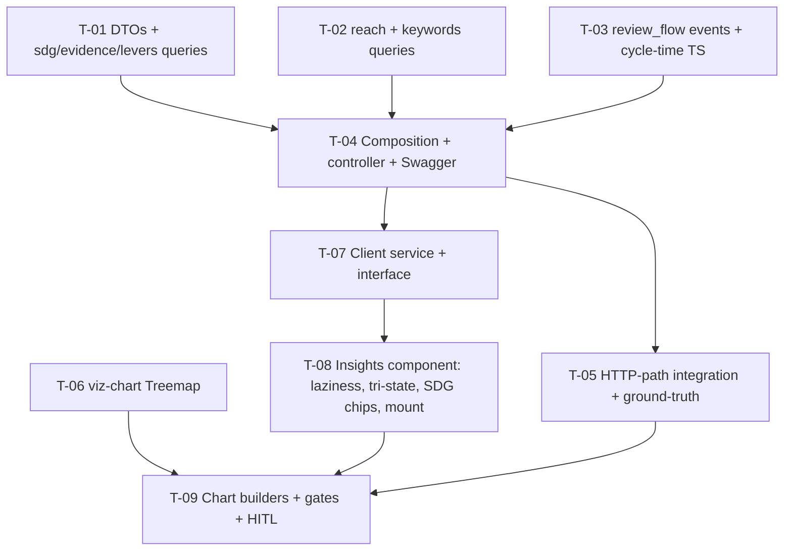

# Tasks — agresso / Project Dashboard v3 · F4 Advanced Cross-Cutting Insights

- **Module:** agresso (server) + client / project-detail (STAR)
- **Spec id:** 2026-08-project-dashboard-v3-f4
- **Status:** not-started
- **Owner:** JuanCode
- **Linked requirements:** ./requirements.md
- **Linked design:** ./design.md
- **Last updated:** 2026-08-23

> **Gate conventions** (as F3 tasks.md, post-K-021): server `npm test -- --silent` / `npm run test:integration` (HTTP-path specs — **never** `npm run test:e2e`) / `test:cov`; client targeted runs with `--coverage=false` (K-020); lint via `npx eslint` only (K-001); spec-type gate = delta vs 945 baseline (K-002); never both packages' full suites concurrently (§4.3). Skills: `nestjs-expert` (T-01…T-05), `error-handling-patterns` (T-03/T-04), `angular-developer` + `ui-ux-pro-max` (T-06…T-09), `systematic-debugging` on any unexpected red.
>
> **Family sequencing gate:** T-07…T-09 (client) MUST NOT start until F3's client tasks are merged (shared `project-dashboard.component`, `api.service.ts`, `viz-chart`). Server tasks T-01…T-05 may proceed meanwhile.

---

## 2. Dependency graph

---

## 3. Task list

### T-01 — DTOs + `sdg_coverage`, `evidence`, `contributing_levers` queries

- **Requirements covered:** R-IN-001 (meta `{total_results, n}`, label MUST), R-IN-002 rows sdg/evidence/levers; design §2.1, D-F4-3.
- **Files:** `dto/contract-insights-report.dto.ts` (NEW, imports F3's `SectionMeta`), `repositories/agresso-contract.repository.ts` (+spec).
- **Acceptance / done check:**
  - [x] SQL specs assert generated SQL + params (KZ-001): distinct-result counts (**failing input:** a fixture with one result carrying the same SDG twice must count 1; remove `DISTINCT` → spec fails); lookup joins resolve labels (drop a join → NULL label → fails); levers filtered `is_primary = FALSE` (flip the predicate → fails).
  - [x] `npm test -- --silent` (server) + `npx eslint` green (full suite 338/2486 by Leader re-measure; K-004 reds observed — see execution.md).
- **Deps:** none · **Effort:** M · **Status:** done

### T-02 — `reach` + `keywords` queries

- **Requirements covered:** R-IN-002 reach row (NULL-excluded sums, per actor type, not-disaggregated count) + keywords row + keyword-normalization scenario (all clauses); design §2.1, D-F4-5.
- **Files:** repository (+spec); decision record in `execution.md` for the normalization path (MySQL `REGEXP_REPLACE` vs TS fallback — verify the dev MySQL version).
- **Acceptance / done check:**
  - [x] Reach specs: NULL disaggregation columns excluded (**failing input:** `COALESCE(...,0)` mutation changes `n`/sums → fails); per-actor-type grouping with custom-name fallback; `not_disaggregated_rows` counted separately, never inside sums.
  - [x] Keywords specs: `"Soil Health"`/`"soil health"`/`" soil  health "` collapse to one entry with count 3; one result repeating a keyword counts once (**failing input:** drop `DISTINCT result_id` → fails); cap 30, order count desc / keyword asc asserted against a 31-item fixture.
  - [x] Normalization path recorded (SQL or TS) with the MySQL version observed (SQL — dev MySQL `8.0.45` probed; see execution.md T-02).
- **Deps:** none · **Effort:** L · **Status:** done

### T-03 — `review_flow`: events query + cycle-time calculator + vocabulary constant

- **Requirements covered:** R-IN-002 review row + messy-history scenario (all clauses); design D-F4-2, D-F4-6 as superseded by D-F4-7 (Pivot 2026-08-24).
- **Files:** repository (events query), a pure TS calculator (`utils/review-cycle-time.util.ts` or module-local) (+specs), **canonical vocabulary constant NEW in the `result-review-history` module** (D-F4-7 — exported, forward-looking source of truth for the future `reviewDecision` writer); calculator asserts against it.
- **Acceptance / done check:**
  - [x] Calculator specs with messy fixtures: insertion-order vs timestamp-order fixtures produce **different** medians (**the named failing input** — if both give the same value the fixture is not messy enough and the evidence is disqualified); anchor-less result excluded and counted; median/p90/sample_size correct on a 5-result fixture with hand-computed expected values.
  - [x] Constant-vs-vocabulary spec: every submission/approval value the calculator uses exists in the canonical `result-review-history` constant (**failing input:** a typo in the calculator's mapping → fails) (AMENDED per D-F4-7/D-F4-8 — satisfied in stronger form: calculator imports the canonical anchors, no local mapping exists to typo; wrong-but-valid anchor caught by specific-value + fixture specs).
  - [x] SQL spec: events fetched per result ordered by `created_at`, never by id.
- **Deps:** none · **Effort:** L · **Status:** done — PASS attempt 2 (Pivot D-F4-7 + addendum D-F4-8; see execution.md)

### T-04 — Composition `getInsightsReport` + service + controller + Swagger

- **Requirements covered:** R-IN-001 scenario (always-present sections, null-on-failure MUST, never-omit BUT, 400, Swagger); design §2.1/§4.
- **Files:** repository composition, `agresso-contract.service.ts`, `agresso-contract.controller.ts` (+specs).
- **Acceptance / done check:**
  - [ ] Unit specs: all six keys present even when a section has `n = 0` (**failing input:** omit an empty section → fails); one-rejected → null + error entry + logger; all-rejected → throw; 400 on missing param.
  - [ ] Server suite + eslint green.
- **Deps:** T-01, T-02, T-03 · **Effort:** M · **Status:** todo

### T-05 — HTTP-path integration spec (in-process, no infra) + dev ground-truth

- **Requirements covered:** R-IN-001 envelope behavior through the real HTTP path (KZ-017 owner); requirements defect rows 1–4.
- **Files:** `test/agresso-contract-insights.integration-spec.ts` (NEW — `npm run test:integration`; template `test/bilateral-primary-contributing-sp.integration-spec.ts`); evidence in `execution.md`.
- **Description:** `TestingModule` with only controller + service + global `ResponseInterceptor`/`GlobalExceptions`, repository `overrideProvider`-mocked, supertest on `app.getHttpServer()`. Cases: all-present, one-null + errors entry, all-fail 500, 400. **MUST NOT** import `AppModule`, open a `DataSource`, or reach the network (K-021). Then ground-truth on dev: `reach` four sums and `keywords` top-3 for A511 vs hand-run SQL, back-to-back.
- **Acceptance / done check:**
  - [ ] `npm run test:integration` green, wall-clock < 60 s (**failing input:** rethrow-on-first-rejection → the one-null case 500s; **disqualifier:** any DB connection opened or timeout exceeded).
  - [ ] Ground-truth recorded with SQL + both value sets; **disqualifier:** captures not back-to-back or different contracts.
- **Deps:** T-04 · **Effort:** M · **Status:** todo

### T-06 — Register `TreemapChart` in viz-chart

- **Requirements covered:** R-IN-003 (treemap registration + token clauses); NFR-IN-003 partial.
- **Files:** `shared/components/viz-chart/viz-chart.component.ts` (+spec).
- **Acceptance / done check:**
  - [x] `npm run tokens:validate` green (treemap label contrast on the sequential ramp); viz-chart specs + `npm run build` green.
  - [x] Presence caveat: registration ≠ rendered treemap → T-09 HITL (recorded in execution.md; VisualMapComponent forward pointer carried).
- **Deps:** none · **Effort:** S · **Status:** done

### T-07 — Client interface + API method + `GetContractInsightsService` 🔒 gate: F3 client landed

- **Requirements covered:** R-IN-003 (single fetch + retry at service level); design §2.2.
- **Files:** `contract-insights.interface.ts` (NEW), `api.service.ts`, `get-contract-insights.service.ts` (NEW, +spec).
- **Acceptance / done check:**
  - [ ] `HttpTestingController` spec: exact URL/params; dedupe on repeated `load` (**failing input:** remove dedupe → fails); `update()` re-fetches; live-shaped fixtures (KZ-001).
  - [ ] Targeted jest `--coverage=false` + eslint green.
- **Deps:** T-04 + gate · **Effort:** M · **Status:** todo

### T-08 — Insights component: laziness, tri-state, SDG chips, mount 🔒 gate: F3 client landed

- **Requirements covered:** R-IN-003 (lazy rules, tri-state, SDG scenario all clauses, reach not-disaggregated BUT), R-IN-004 scenario; design §2.2/§5/§6, D-F4-3/4.
- **Files:** `components/insights-section/*` (NEW, +spec), `project-dashboard.component.html` (mount line + declared-SDGs input, +spec delta).
- **Acceptance / done check:**
  - [ ] Specs (KZ-015): zero fetch before intersection → one after → no re-fetch on further intersections (**failing input:** load in `ngOnInit` → fails).
  - [ ] Per-card tri-state specs (null → error+retry; `n=0` → notice only; sparse → chart + "n of N").
  - [ ] SDG derivation spec: declared {2,13} × reported {2,15} → ∩{2}, declared-only{13}, reported-only{15}; **no** additional HTTP request for SDGs (assert on the Http mock: only the insights call).
  - [ ] R-IN-004 spec: F1 drill navigation + F3 panel request count unchanged with Insights mounted.
- **Deps:** T-07 · **Effort:** L · **Status:** todo

### T-09 — Chart builders + full gates + HITL close

- **Requirements covered:** R-IN-003 chart forms (reach stacked bars with not-disaggregated outside, funnel + cycle tiles, evidence tiles/bars, levers bars, treemap top 30, tableModel MUST); NFR-IN-001…004; visual defect class; KZ-002.
- **Files:** insights-section builders (+spec); evidence records.
- **Acceptance / done check:**
  - [ ] Builder specs: not-disaggregated rows never enter stacked series (**failing input:** add them to a series → fails); treemap data = top 30 with counts; every chart gets a non-empty `tableModel`; hex-literal grep over new files → zero.
  - [ ] Server suites + `test:cov`; client full suite + coverage + `npm run build` + tsc-spec delta ≤ 945 — **sequenced, never concurrent** (§4.3).
  - [ ] Bundle: initial ±5 kB, Treemap in the lazy chunk (**disqualifier:** baselines from different branch states).
  - [ ] Latency: 3 timed dev runs p95-proxy ≤ 800 ms; spread >±40% → inconclusive.
  - [ ] **HITL (KZ-014, human):** light+dark screenshots of the six cards; laziness with the section below the fold; F1/F3 unchanged; `/swagger` renders the endpoint.
  - [ ] K-004 global disqualifier: every cited gate observed red once.
- **Deps:** T-05, T-06, T-08 · **Effort:** L · **Status:** todo

---

## 4. Coverage closure (scenario/clause → owning task)

| Clause | Owner |
|---|---|
| R-IN-001 full-payload scenario + never-omit BUT + null-on-failure MUST + 400/Swagger + labels | T-04 (unit) + T-05 (HTTP path) + T-01/T-02/T-03 (labels) |
| R-IN-002 sdg/evidence/levers rows | T-01 |
| R-IN-002 reach row (NULL-excluded, per type, not-disaggregated) | T-02 (+T-05 ground truth) |
| R-IN-002 keywords row + normalization scenario (collapse, no double count, cap/order) | T-02 (+T-05 ground truth) |
| R-IN-002 review row + messy-history scenario (timestamp order, exclusions, sample_size, no insertion-order duration) | T-03 |
| R-IN-003 lazy rules + tri-state + reach-card scenario (not-disaggregated outside bars, table MUST) | T-08 (states) + T-09 (builders) |
| R-IN-003 SDG scenario (three groups, no re-fetch BUT, count MUST) | T-08 |
| R-IN-003 treemap/registration/token clauses | T-06 + T-09 |
| R-IN-004 no-regression scenario (drills, F3 count, no fetch before intersection) | T-08 (+T-09 HITL) |
| NFR-IN-001…004 | T-09 (NFR-IN-003 partially T-06) |

## 5. Testing expectations

Per templates; Bug Mode n/a; K-012 honored; K-021 honored (T-05 bootstrap scope explicit); no migrations (K-015 n/a).

## 6. Execution conventions

Branch `bilateral-visual-improvements`; commits `[SPEC:changes/project-dashboard-v3/f4-advanced-insights] <type>(agresso-contract|project-dashboard): …`. **PR strategy (~1,300–1,700 LOC): 2 PRs** — PR-1 server (T-01…T-05; review first: cycle-time calculator + NULL semantics), PR-2 client (T-06…T-09; review first: laziness + SDG derivation; out of scope: server). Chained descriptions per `cognitive-doc-design`.

## 7. Risks & blockers log

| # | Date | Risk / Blocker | Mitigation | Owner | Status |
|---|---|---|---|---|---|
| RB-1 | 2026-08-23 | F3 client tasks not yet landed | 🔒 gates on T-07/T-08; server tasks proceed | JuanCode | open |
| RB-2 | 2026-08-23 | Review-history vocabulary sparse for imported results → tiny cycle-time sample | UI shows `sample_size` + excluded count; no silent extrapolation | JuanCode | open |
| RB-3 | 2026-08-23 | Dev MySQL may lack `REGEXP_REPLACE` | T-02 TS fallback, decision recorded | JuanCode | **closed 2026-08-24** — dev MySQL `8.0.45` probed, `REGEXP_REPLACE` confirmed; SQL path shipped (execution.md T-02) |

## 8. Done definition

- [ ] T-01…T-09 done with evidence (execution.md PASS recorded before any checkbox flips — repo guardrail hook).
- [ ] Coverage-closure table verified against final code.
- [ ] TRD API delta (new endpoint) recorded at archive sync; family manifest → complete when all four children are done.
- [ ] Rollout note: dev-branch pipeline post-F3; rollback = revert.
