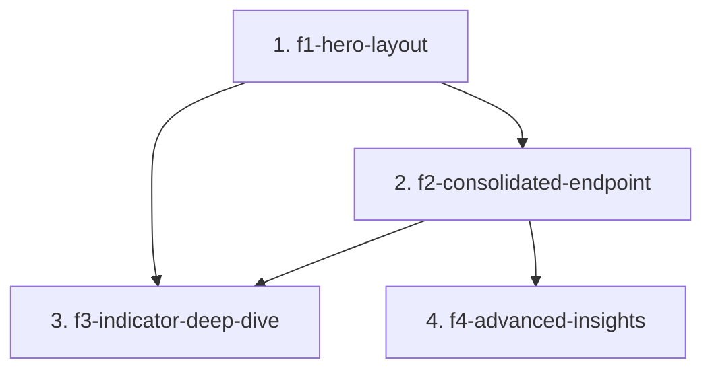

# SDD Spec Family — Project Dashboard v3

## 0. Document Control

- **Family path:** `docs/specs/changes/project-dashboard-v3/`
- **Parent spec / Feature:** `project-detail / Project Dashboard v3 — visual reorganization, endpoint consolidation, interactivity, per-indicator analytics`
- **Date created:** `2026-08-23`
- **Last updated:** `2026-08-23`
- **Spec-family status:** `open`
- **Owner / Squad:** `JuanCode`
- **Linked PRD section:** [`docs/prd.md`](../../../prd.md) (Project Dashboard / STAR analytics)
- **Linked TRD section:** [`docs/trd/trd.md`](../../../trd/trd.md) (agresso-contract reports family, client project-detail feature)
- **Slug:** `project-dashboard-v3` — derived from free-text argument *"Project Dashboard v3 — reorganización visual, consolidación de endpoints e interactividad (F1-F3 según propuesta publicada)"*
- **Approval Mode:** `gated`
- **Analysis source:** published proposal artifact <https://claude.ai/code/artifact/0ff68e48-630a-480f-8693-f5f4e04f271b> (2026-08-23) — audit of the current dashboard (client + server), endpoint inventory, unexploited-metadata map, and phase plan approved by the owner in-session.

---

## 1. Context & Splitting Rationale

The Project Dashboard (built by archived specs `2026-08-22-changes--project-dashboard-redesign` and `--dashboard-advanced-analytics`) has four verified problem classes: duplicated context blocks (header vs Project Context strip), non-interactive KPIs and top-N widgets, empty widgets occupying prime layout positions, and nine analytics GETs per screen while rich per-indicator metadata in `result_*` satellite tables is never aggregated per contract.

The work splits along a clean technical seam: (1) a client-only layout/interactivity pass that changes no API contract; (2) a server+client API consolidation that changes contracts but no visuals; (3) a new per-indicator aggregate endpoint plus its deep-dive panel; (4) exploratory cross-cutting analytics built on the consolidated DTO. Each chunk is independently shippable and reviewable; later chunks extend earlier ones' surfaces (same component, same DTO), so they are sequenced, not parallel.

Build order scored with MoSCoW + RICE: F1 = Must (highest reach/effort ratio, unblocks nothing but conflicts with everything touching the component), F2 = Must (cuts endpoint proliferation at the root), F3 = Should (highest new-information value), F4 = Could (exploratory, largest surface).

## 2. Child Specs Manifest

| # | Spec Path | Title / Scope | Depends on | Parallel-safe | Status | Owner |
|---|---|---|---|---|---|---|
| 1 | `project-dashboard-v3/f1-hero-layout` | Client-only: unified hero (header+KPIs+context, no duplicates), clickable KPIs, chart reorder by decision value, empty-widget collapse rule, spacing normalization, native bars↔heatmap morph, top-N cards migrated to viz-chart with drill-through | `none` | `no` | `done` | JuanCode |
| 2 | `project-dashboard-v3/f2-consolidated-endpoint` | Server+client: `GET reports/dashboard` aggregate (absorbs results-summary + 4 top-N + geo-scope + sp-alignment via parallel queries over the shared seed subquery, named-section DTO); client collapses 7 signal services into one; old endpoints deprecated after migration | `f1-hero-layout` | `no` | `done` | JuanCode |
| 3 | `project-dashboard-v3/f3-indicator-deep-dive` | Server+client: `GET reports/indicator-details` aggregating the 6 per-indicator satellite tables; lazy-loaded tabbed deep-dive panel; register Pie/Funnel/Radar in viz-chart; monthly reporting-velocity metric | `f1-hero-layout`, `f2-consolidated-endpoint` | `no` | `pending` | JuanCode |
| 4 | `project-dashboard-v3/f4-advanced-insights` | Exploratory analytics as new sections of the consolidated DTO: result SDGs, keywords treemap, evidence completeness, review funnel + cycle time, gender×youth reach, ToC target-vs-actual bullet, contributing levers | `f2-consolidated-endpoint` | `no` | `pending` | JuanCode |

### Status Vocabulary
- `pending`: Child spec is proposed, drafted, or awaiting prerequisite child completion.
- `active`: Child spec is currently approved and in active implementation (`/akili-execute`).
- `done`: Child spec implementation and testing (`/akili-test`) are complete and verified.
- `blocked`: Child spec is blocked by external dependencies or prerequisite child blockers.

## 3. Dependency Graph

## 4. Closed-Set Rule (Non-Negotiable)

> [!IMPORTANT]
> **Closed-Set Rule:** The child table in Section 2 is the **exhaustive child set** of this spec family.
> - No AKILI command or agent may create or execute a child spec folder without a prior registered row in this manifest.
> - Adding, removing, or re-ordering child specs requires a Human-In-The-Loop (HITL) approved manifest edit.
> - The spec family is considered `complete` only when all child specs in this manifest have achieved `done` status and have been verified.
