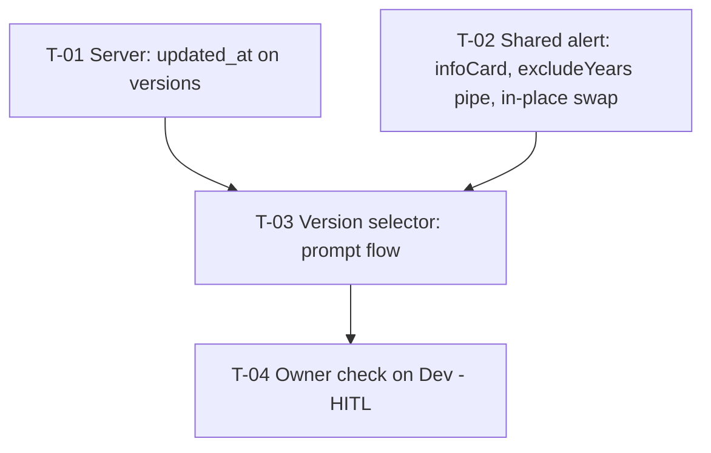

# Tasks — Results / "Update result" asks for the viewed version's year first

- **Module:** results (STAR client version selector + shared global alert; one server field)
- **Spec id:** 2026-10-update-result-year-prompt
- **Status:** approved
- **Owner:** d.casanas@cgiar.org
- **Linked requirements:** ./requirements.md
- **Linked design:** ./design.md (judgment: ./judgment.md, APPROVED)
- **Baseline commit:** `162348264`
- **Gate log:** Phase 3 — approved by owner ("continue"), 2026-10-09
- **Budget (tripwire):** 4 tasks · ~380 LOC · ~5 review rounds (design §0)

---

## 1. Conventions for every task

| Package | Commands |
| --- | --- |
| Server (`server/researchindicators`) | `npm test -- --silent <paths>` · `npx eslint <changed paths>` (never `npm run lint`, K-001) · `npx tsc --noEmit -p tsconfig.json` |
| Client (`client/research-indicators`) | `npx jest <paths> --coverage=false` (a targeted run with coverage exits 1 on green, K-020) · `npm run build` (app + strictTemplates) · `npx tsc -p tsconfig.spec.json --noEmit 2>&1 \| grep -E '<touched spec files>' \| sed -E 's/\([0-9]+,[0-9]+\)//' \| sort` compared before vs. after (no NEW errors) · `npm run lint -- --quiet` |

- **Red runs are observed, not predicted.** Every red run is quoted verbatim in `execution.md` (K-004 / KZ-014).
- **Full-suite re-run.** After each task the Leader re-runs the full suite of the touched package. A client run with failed suites but zero failed tests is the known runner flake: re-run it before investigating.
- **No commit before visual approval.** For T-02 and T-03, the owner must see the UI working at T-04 first.

## 2. Dependency graph

T-01 (server) and T-02 (client) touch different packages. They are safe to edit in parallel, but not to measure in parallel.

## 3. Task list

### T-01 — `findResultVersions` returns `updated_at`

- **Status:** [ ] · **Size:** XS · **Dependencies:** none
- **Requirements:** R-URP-004 (S-9: field added; BUT nothing removed or renamed), NFR-URP-002
- **Design:** §5, §6, D-6, P-4, P-5
- **Scope:** `results.service.ts` `findResultVersions`, adding `updated_at: true` to the shared `select` constant. Nothing else.
- **Tests:** in `results.service.spec.ts` `describe('findResultVersions')`, assert that both `mainRepo.find` calls receive a `select` equal to `{ result_id, result_official_code, report_year_id, result_status_id, updated_at }` (all `true`). An exact `toEqual` on the select object also covers S-9's "BUT nothing removed or renamed".
- **Falsifier:** remove `updated_at` from the select, or drop `report_year_id` → the new assertion goes red (`expected … updated_at: true`).
- **Red run:** the new assertion run against the unmodified service, observed and quoted.
- **Disqualifier:** this is a mocked repository. It proves the select argument, not that MySQL returns the column. That is accepted, because `updated_at` is a mapped column of `AuditableEntity` (P-12). Live proof comes at T-04.
- **Consumers:** `results.controller.spec.ts` (mocks `findResultVersions`), `results.service.spec.ts`; client consumers per P-5 are additive-safe.
- **Review:** `checklist` — one-line additive select change.
- **Done:**
  - [ ] Test green; falsifier observed red, then reverted
  - [ ] `npx eslint` + `tsc` clean on the changed files
  - [ ] Full server suite green
- **Skills:** `nestjs-expert`

### T-02 — Shared global alert: `infoCard`, `excludeYears` pipe, in-place swap

- **Status:** [ ] · **Size:** S · **Dependencies:** none
- **Requirements:**
  - R-URP-001: renders the `infoCard` used by S-1/S-2
  - R-URP-003:
    - S-6: same modal, content switches in place
    - S-6 "BUT must NOT close and re-open"
    - S-6 "must NOT list 2026" (pipe)
    - S-6 picker Cancel/× closes with no request
    - S-7: × never swaps
    - S-8 "AND IT MUST stay unchanged" (opt-in)
  - NFR-URP-001: chip and caption are real text
  - NFR-URP-003
- **Design:** §7.1, §8, D-1, D-2, D-7, D-8, P-7, P-8, P-10, P-11, P-15
- **Scope:**
  - `global-alert.interface.ts`: add `infoCard?: { badge: string; caption: string }`, `selectorExcludeValues?: number[]`, `cancelSwapsTo?: GlobalAlert`.
  - `shared/pipes/exclude-years.pipe.ts` (new): standalone, `pure: true`. It returns the input reference when the exclusion is empty or absent, and the filtered array otherwise.
  - `actions.service.ts`: add `replaceGlobalAlert(index, alert)`. It is a map-replace on `globalAlertsStatus`, with **no** `clearService`.
  - `global-alert.component.ts/.html`:
    - Import the pipe.
    - Bind `[options]="this.service?.list() | excludeYears: alert.selectorExcludeValues"`.
    - Render `infoCard` below the detail. The chip uses `var(--ac-green-500)` with white text; the caption uses muted text; no hex literals.
    - Replace the Cancel handler with `onCancel(alert, $index)`. It runs the event, then:
      - when `cancelSwapsTo` is set: clear that index's timeout, `replaceGlobalAlert`, reset `body` and `showReportedWarning`, and do not close;
      - otherwise: `closeAlert`.
    - The × handler is unchanged.
- **Tests:**
  - **`exclude-years.pipe.spec.ts`:**
    - (p1) An exclusion of `[2026]` over `[2028, 2027, 2026, 2025]` → `[2028, 2027, 2025]`.
    - (p2) An undefined or empty exclusion → the **same reference** (`toBe`).
    - (p3) An undefined list → returns undefined or empty without throwing.
  - **`actions.service.spec.ts`:**
    - (a1) `replaceGlobalAlert(0, b)` on `[a]` → `[b]` (length 1).
    - (a2) It does not call `serviceLocator.clearService`.
  - **`global-alert.component.spec.ts`.** Uses a real `ActionsService` signal, or a mock that adds `replaceGlobalAlert` (JD-12). The transition is arranged per KZ-015: render the prompt first, assert the negative, then click.
    - (g1) Prompt with `infoCard` → chip text "2026 VERSION" and the caption render; no `p-select`.
    - (g2) Click Cancel on a prompt with `cancelSwapsTo` → `cancelCallback.event` called once, the alert list length stays 1, `.alert-overlay` is the **same DOM node** before and after (`toBe`), `p-select` renders, and `hideGlobalAlert` is not called.
    - (g3) After the swap, the rendered options exclude 2026 and include the others.
    - (g4) Cancel on an alert without `cancelSwapsTo` → `closeAlert` path, exactly as today.
    - (g5) × on the prompt → closed, no swap, `cancelCallback.event` not called.
    - (g6) A picker without `selectorExcludeValues` → options are the same reference as `service.list()` (S-8).
    - (g7) After the swap, `showReportedWarning` is false and `body.selectValue` is null.
- **Falsifier:** each must be observed red.
  - (f1) `onCancel` also calls `closeAlert` after the swap → (g2) red (list length 0, or `hideGlobalAlert` called).
  - (f2) The pipe always returns `list.filter(...)` → (p2) and (g6) red (reference differs).
  - (f3) `replaceGlobalAlert` appends instead of replacing → (a1) and (g2) red.
  - (f4) The template still binds `this.service?.list()` without the pipe → (g3) red (2026 listed).
- **Red run:** (f1)–(f4) observed, with each assertion message quoted.
- **Disqualifier:**
  - jsdom cannot show flicker. "Same DOM node" is the proxy: the node is not destroyed. A visible flicker from other causes is checked at T-04.
  - Option assertions must read the rendered `p-select` options or the bound `options` input. Reading `service.list()` is the plumbing, not the artifact.
- **Consumers:**
  - `global-alert.component.spec.ts` and `actions.service.spec.ts`.
  - Every caller of `showGlobalAlert`. The new fields are optional, so they are unaffected; this is covered by the full client suite.
  - `GlobalAlert` interface importers: run `grep -rln "GlobalAlert" client/research-indicators/src/app` at execute time and record the result in `execution.md`.
- **Review:** `full` — a shared component that every alert in the app renders through.
- **Done:**
  - [ ] Tests green; (f1)–(f4) observed red, then reverted
  - [ ] `npm run build` green; spec `tsc` shows no new errors in the touched spec files
  - [ ] Lint clean; full client suite green
- **Skills:** `angular-developer`, `tdd`

### T-03 — Version selector: prompt flow

- **Status:** [ ] · **Size:** S · **Dependencies:** T-01 (`updated_at` typing contract), T-02
- **Requirements:**
  - R-URP-001:
    - S-1: latest copy, chip, caption, buttons; BUT no dropdown
    - S-2: older copy; BUT not "most recent"
    - S-3: fallback; AND IT MUST behave as before
    - S-4: missing, null or invalid date; BUT no "Invalid Date", "null" or 1970
    - S-10: no chip → max year; BUT not API order
    - S-11: one modal; AND IT MUST ignore clicks in flight
  - R-URP-002, S-5: one PATCH with Y; success and failure as today; BUT no picker
  - R-URP-003, S-6: `cancelSwapsTo` is a picker excluding Y; confirming behaves as today
- **Design:** §2, §7.2, D-3, D-4, D-5, D-8, D-9, §9 reversion challenge, P-1, P-13, P-14
- **Scope:**
  - `get-transform-result-code.interface.ts`: add `updated_at?: string | null`.
  - `version-selector.component.ts`:
    - Inject `GetYearsByCodeService`.
    - Add the `updating` signal.
    - Make `updateResult()` async, following design §7.2 steps 1–4.
    - Add `showPrompt`, `pickerAlert(exclude)`, `showPicker(exclude)`, and `submitReportingCycle(year)`. `submitReportingCycle` holds today's confirm body moved verbatim.
    - Copy strings exactly as in design §7.2. The date format is `formatDate(…, 'd MMM y', 'en-US')`.
  - Do **not** change `GetVersions` (P-13), the template, or the button visibility.
- **Tests:** `version-selector.component.spec.ts`. Mock `GetYearsByCodeService` with `main: jest.fn().mockResolvedValue(undefined)` and `list: signal([...])`. Seed the versions in **non-ascending** order, e.g. `[2024, 2026, 2025]`.
  - **Rewrite the 5 existing tests** (`:135`, `:294`, `:312`, `:324`, `:341`) to await `updateResult()`. Move `:294` ("empty string when `data.selected` is undefined") onto the picker path, using either the S-3 fallback or `cancelSwapsTo.confirmCallback`.
  - (v1) S-1: 2026 is selected and is the max → the alert receives the exact detail, `infoCard.badge` "2026 VERSION", a caption starting "Latest reporting version · last updated " followed by the formatted date, cancel label "No, choose another year", confirm label "Yes, update 2026", no `serviceName`, and `buttonColor` `'var(--ac-light-blue-400)'`.
  - (v2) S-2: 2024 is selected → "Do you want to update the 2024 version of this result?", caption "Reporting version…", and the string contains no "most recent".
  - (v3) S-10: `selectedResultId` is null → 2026 is offered, not `versions[0]` (2024).
  - (v4) S-3: the year is not in `list()` (and, as a separate case, `list()` is `[]`, simulating a failed request) → `showGlobalAlert` is called with `serviceName: 'getYearsByCode'` and `selectorExcludeValues: []`.
  - (v5) S-3: no approved versions → picker.
  - (v6) S-4: `updated_at` is undefined, `null`, `''`, or `'not-a-date'` (`it.each`, **without** `fakeAsync`; CLAUDE.md TS7031 note) → the caption equals "Latest reporting version" exactly.
  - (v7) S-5: invoking the prompt's `confirmCallback.event()` → `PATCH_ReportingCycle` is called once with `(id, '2026')`. On success: cache cleared, `metadata.update` called, navigate with `version: null`, and "RESULT UPDATED" shown. On failure: an error toast.
  - (v8) S-6: `cancelSwapsTo` has `serviceName: 'getYearsByCode'` and `selectorExcludeValues: [2026]`, and its confirm with `{ selected: '2025' }` → PATCH with `'2025'`.
  - (v9) S-11: two `updateResult()` calls before `main()` resolves (a deferred promise) → `main` is called once and `showGlobalAlert` is called once.
- **Falsifier:** each must be observed red.
  - (f1) Use `approvedVersions()[0]` as the fallback → (v3) red.
  - (f2) Use `new Date(v).toString() !== 'Invalid Date'` without the non-empty guard → (v6) red on `null` (1970).
  - (f3) Remove the `updating` guard → (v9) red (two alerts).
  - (f4) Make `pickerAlert` ignore its `exclude` → (v8) red.
  - (f5) Always set "most recent" → (v2) red.
- **Red run:** (f1)–(f5) observed and quoted. (v9) must use deferred resolution, because a synchronous mock cannot exercise the race.
- **Disqualifier:** these tests assert the config passed to the alert. They do not assert the rendered modal; rendering is T-02's job (g1–g3), and the visual check is T-04's. A green (v1) with the wrong visual is possible and is caught only at T-04.
- **Consumers:** `version-selector.component.spec.ts` (5 tests rewritten), and `submit-result-content.component.spec.ts` (uses `GET_Versions` and `TransformResultCodeResponse` — re-run it).
- **Review:** `full` — the user-facing flow that sends the update request.
- **Done:**
  - [ ] Tests green; (f1)–(f5) observed red, then reverted
  - [ ] `npm run build` green; spec `tsc` shows no new errors in touched spec files
  - [ ] Lint clean; full client suite green
- **Skills:** `angular-developer`, `tdd`

### T-04 — Owner check on Dev (HITL)

- **Status:** [ ] · **Size:** XS · **Dependencies:** T-03
- **Requirements:**
  - Visual fidelity: the defect class with no automated gate
  - S-1 / S-2 look
  - S-6 "no flicker"
  - D-5 / O-1: the overwrite-warning decision
- **Scope:** The owner runs the client locally, or on Dev after push, against an Approved STAR result that has 2 or more versions. The checklist:
  1. Viewing the latest version → the prompt shows the chip, the date, and both buttons, in a blue that matches the picker.
  2. "Yes" → the result goes to Draft for that year, and Pool Funding is carried over (existing behavior).
  3. "No" → the same modal switches to the dropdown without that year, with no flicker.
  4. Viewing an older version → the "2024 version" copy appears.
  5. × → nothing happens.
  6. Decide O-1: overwrite warning, yes or no.
- **Falsifier / Red run / Disqualifier:** n/a (human check). If the owner reports a mismatch, that is a FAIL routed back to T-02 or T-03.
- **Consumers:** none
- **Review:** `skip-eligible` — human check, no code. Its claim: the owner's verdict is recorded verbatim in `execution.md`.
- **Done:**
  - [ ] Owner verdict recorded; O-1 decided; commit only after the verdict (no-commit-before-visual-approval)
- **Skills:** none

## 4. Coverage closure (scenario / clause → task)

| Clause | Task · test |
| --- | --- |
| S-1 main + "BUT no dropdown" | T-03 v1 (no `serviceName`); T-02 g1 (no `p-select`) |
| S-2 + "BUT not most recent" | T-03 v2 |
| S-3 + "AND IT MUST behave as before" | T-03 v4, v5; T-02 g4 (Cancel closes) |
| S-4 + "BUT no empty / Invalid / null / 1970" | T-03 v6 |
| S-5 + "BUT no picker" | T-03 v7 |
| S-6 in-place switch | T-02 g2 |
| S-6 "BUT not close and re-open" | T-02 g2 (same node, length 1, no hide) |
| S-6 "must NOT list 2026" | T-02 g3, p1; T-03 v8 |
| S-6 confirm/Cancel/× behave as today | T-03 v8; T-02 g4 |
| S-7 | T-02 g5 |
| S-8 + "AND IT MUST stay unchanged" | T-02 g6, p2 |
| S-9 + "BUT nothing removed or renamed" | T-01 |
| S-10 + "BUT not API order" | T-03 v3 |
| S-11 + "AND IT MUST ignore clicks" | T-03 v9 |
| NFR-URP-001 | T-02 g1 (text nodes) + T-04 |
| NFR-URP-002 | T-01 (no migration; additive) |
| NFR-URP-003 | T-02 g4, g6 |
| Visual fidelity | T-04 |

## 5. Risks & blockers log

| Date | Item |
| --- | --- |
| 2026-10-09 | O-1 (overwrite warning on "Yes") is open and decided at T-04 |

## 6. Done definition

- All tasks `[x]`.
- The owner's T-04 verdict is recorded.
- The full server and client suites are green.
- Builds are green.
- Nothing is pushed: the owner pushes.
