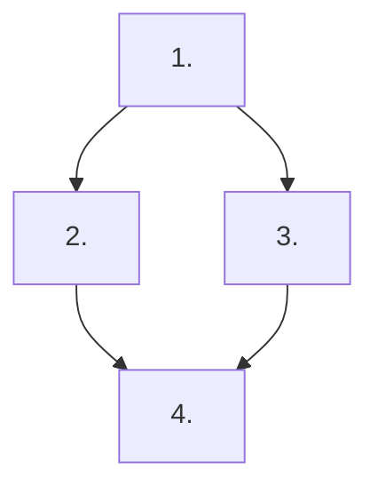

# SDD Spec Family Template — Alliance Research Indicators (ARI)

> **This is a methodology template, not a spec family manifest.** When a large proposal or feature is chunked into multiple child specs under `docs/specs/<module>/<family-slug>/`, a `family.md` manifest MUST be authored at the root of that family folder to track order, dependencies, and execution status.
>
> Flat specs (a single feature spec folder containing `requirements.md`, `design.md`, `task.md`) do NOT require a `family.md`.

---

## 0. Document Control

- **Family path:** `docs/specs/<module>/<family-slug>/`
- **Parent spec / Feature:** `<Module> / <Feature Family Title>`
- **Date created:** `<YYYY-MM-DD>`
- **Last updated:** `<YYYY-MM-DD>`
- **Spec-family status:** `open` | `complete`
- **Owner / Squad:** `<name / squad>`
- **Linked PRD section:** [`docs/prd.md`](../../../prd.md) (section `<X>`)
- **Linked TRD section:** [`docs/trd/trd.md`](../../../trd/trd.md) (section `<Y>`)

---

## 1. Context & Splitting Rationale

A concise summary (≤ 200 words) of why this feature was split into multiple child specs:
- Functional scope boundaries across children.
- Incremental value delivery strategy.
- Technical cut points (e.g. backend core -> frontend screens -> integrations/reporting).

---

## 2. Child Specs Manifest

| # | Spec Path | Title / Scope | Depends on | Parallel-safe | Status | Owner |
|---|---|---|---|---|---|---|
| 1 | `<family-slug>/<child-1>` | `<Short scope description>` | `none` | `yes` | `pending` | `<owner>` |
| 2 | `<family-slug>/<child-2>` | `<Short scope description>` | `<child-1>` | `no` | `pending` | `<owner>` |
| 3 | `<family-slug>/<child-3>` | `<Short scope description>` | `<child-1>` | `yes` | `pending` | `<owner>` |
| 4 | `<family-slug>/<child-4>` | `<Short scope description>` | `<child-2>, <child-3>` | `no` | `pending` | `<owner>` |

### Status Vocabulary
- `pending`: Child spec is proposed, drafted, or awaiting prerequisite child completion.
- `active`: Child spec is currently approved and in active implementation (`/akili-execute`).
- `done`: Child spec implementation and testing (`/akili-test`) are complete and verified.
- `blocked`: Child spec is blocked by external dependencies or prerequisite child blockers.

---

## 3. Dependency Graph

---

## 4. Closed-Set Rule (Non-Negotiable)

> [!IMPORTANT]
> **Closed-Set Rule:** The child table in Section 2 is the **exhaustive child set** of this spec family.
> - No AKILI command or agent may create or execute a child spec folder without a prior registered row in this manifest.
> - Adding, removing, or re-ordering child specs requires a Human-In-The-Loop (HITL) approved manifest edit.
> - The spec family is considered `complete` only when all child specs in this manifest have achieved `done` status and have been verified.
