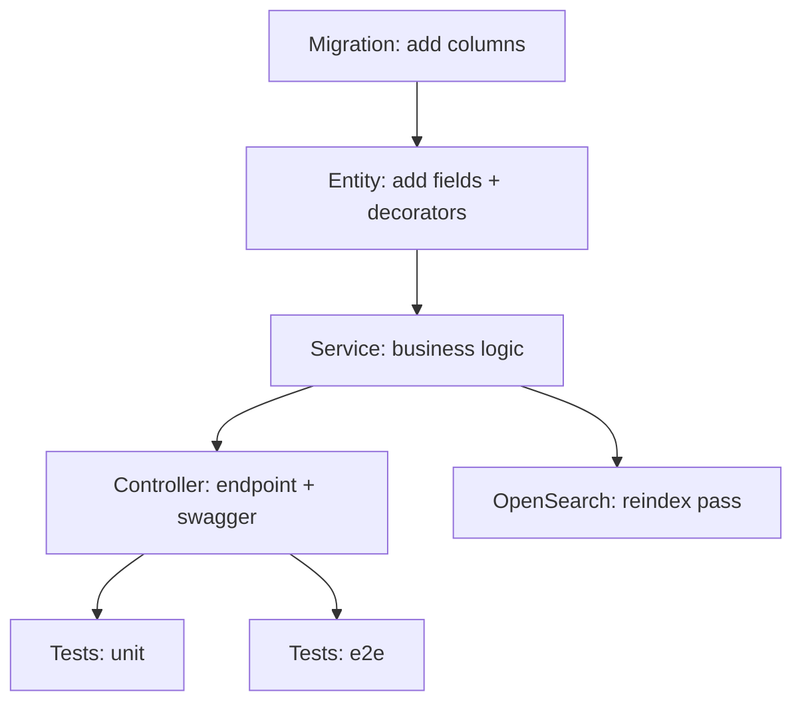

# SDD Task Template — ARI Server

> **This is a methodology template, not a task list for a real feature.** Every module-level spec under `docs/specs/<module>/<feature>/task.md` MUST follow this format. `/sdd-execute` consumes it.

---

## 0. File header

```markdown
# Tasks — <Module> / <Feature>

- **Module:** results | indicators | agresso | clarisa | opensearch | reports | admin-panel | <other>
- **Spec id:** <same as requirements.md / design.md>
- **Status:** not-started | in-progress | blocked | completed
- **Owner:** <name / squad>
- **Linked requirements:** ./requirements.md
- **Linked design:** ./design.md
- **Last updated:** <YYYY-MM-DD>
```

---

## 1. Task numbering

Tasks are numbered `T-<NN>` within the spec. Higher numbers do not imply higher priority — see the dependency graph in §2.

Each task MUST:
- Map to at least one requirement (`R-<MODULE>-<NNN>`).
- Be small enough to land in one PR (≈ ≤ 1 day of focused work).
- Be observable (has a clear "done" check).

---

## 2. Dependency graph

Use a small mermaid block or a textual graph. Example:



If the graph is trivial (≤ 3 tasks), a bullet list is fine.

---

## 3. Task list

Each task uses this structure:

```markdown
### T-<NN> — <one-line action>

- **Requirements covered:** R-<MODULE>-<NNN>, ...
- **Files touched (intended):**
  - <path>
  - <path>
- **Description:** <2–5 sentences>
- **Implementation notes:**
  - <bullet>
  - <bullet>
- **Acceptance / done check:**
  - [ ] <observable check 1>
  - [ ] <observable check 2>
- **Dependencies:** T-<NN>, T-<NN>
- **Estimated effort:** S | M | L (S ≈ ½ day, M ≈ 1 day, L ≈ 2+ days)
- **Owner:** <name>
- **Status:** todo | in-progress | done | blocked
```

---

## 4. Standard task categories

Most ARI features follow this rhythm. Use it as a starting checklist; remove what does not apply.

1. **Schema** — `migration:generate ./src/db/migrations/<name>`. One migration per schema concern.
2. **Entity** — TypeORM columns, relations, indexes, `@OpenSearchProperty` decoration.
3. **DTO** — `class-validator` + `class-transformer` rules; `ApiProperty` annotations for Swagger.
4. **Repository** — only if the query is non-trivial; keep simple finds in the service.
5. **Service** — business logic, audit handling, status-workflow checks, integration calls.
6. **Controller** — HTTP edge, guards, interceptors, Swagger annotations, response envelope.
7. **Route registration** — wire the new module into `domain/routes/main.routes.ts` if it is a new sub-resource.
8. **Guards / pipes / decorators** — only if reusable; otherwise inline.
9. **Integration adjustments** — CLARISA / AGRESSO / TIP / OpenSearch / DynamoDB / RabbitMQ / Socket.IO.
10. **Cron** — `@Cron(...)` job + `sync_process_log` row + `LoggerUtil` lines.
11. **Unit tests** — sibling `*.spec.ts` for every controller / service / guard / interceptor touched.
12. **E2E tests** — `test/*.e2e-spec.ts`.
13. **Admin SSR (if applicable)** — page + route + service + sidebar entry per `src/admin/README-REACT.md`.
14. **Docs** — Swagger annotations on every new handler; update relevant section in `docs/system-design/design.md` or `docs/detailed-design/detailed-design.md` if a baseline decision changed.
15. **Rollout** — feature flag / env var setup; deploy order; comms plan.

---

## 5. Testing expectations

Per task, declare:
- Which `*.spec.ts` files are added or updated.
- Coverage target if differing from the global 60% threshold.
- E2E test cases (happy path + at least one auth failure + at least one role/status denial when applicable).

A task is NOT done until:
- `npm run lint` passes.
- `npm test` passes locally.
- New endpoints appear correctly in `/swagger`.
- Migrations apply cleanly forward and revert cleanly (`npm run migration:revert`).

---

## 6. Execution conventions

- One PR per task when possible; squash on merge.
- PR title format: `<type>(<module>): <subject>` matching the existing commit history style (e.g. `fix(results.service): add 'platform_code' to query parameters`).
- Branch from `staging` (or the current integration branch) — confirm with the engineering lead before specifying.
- Never edit a migration once it is merged to `main`; create a new migration to amend.
- Always include the Swagger annotation in the same PR as the handler.

---

## 7. Risks & blockers log

Append-only table for the lifetime of the spec.

| # | Date | Risk / Blocker | Mitigation | Owner | Status |
| --- | --- | --- | --- | --- | --- |
| RB-1 | <YYYY-MM-DD> | <what> | <how> | <who> | open / closed |

---

## 8. Done definition

The spec is complete when:
- [ ] All `T-<NN>` tasks are `done`.
- [ ] All requirement-level ACs are checked.
- [ ] Coverage thresholds are still green.
- [ ] Swagger documents every new endpoint.
- [ ] Open questions are either resolved (moved into decisions) or carried forward as a new spec.
- [ ] A rollout note is in place (release date, owner, backout plan).
