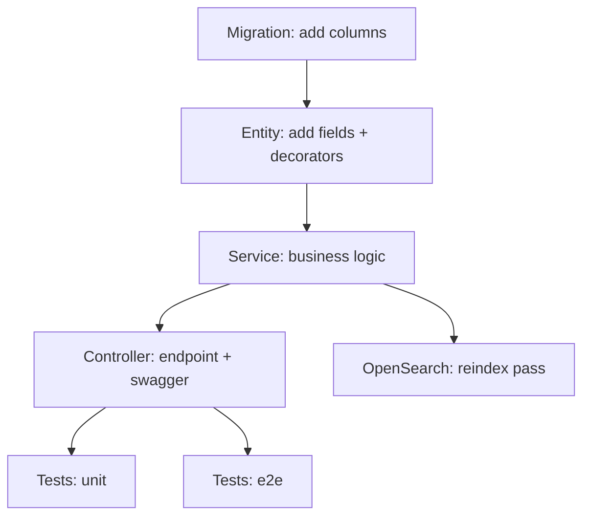

# SDD Task Template — ARI Server

> **This is a methodology template, not a task list for a real feature.** Every module-level spec under `docs/specs/<module>/<feature>/task.md` MUST follow this format. `/sdd-execute` consumes it.

---

## 0. File header

```markdown
# Tasks — <Module> / <Feature>

- **Module:** results | indicators | agresso | clarisa | opensearch | reports | admin-panel | <other>
- **Spec id:** <same as requirements.md / design.md>
- **Status:** not-started | in-progress | blocked | completed
- **Owner:** <name / squad>
- **Linked requirements:** ./requirements.md
- **Linked design:** ./design.md
- **Last updated:** <YYYY-MM-DD>
```

---

## 1. Task numbering

Tasks are numbered `T-<NN>` within the spec. Higher numbers do not imply higher priority — see the dependency graph in §2.

Each task MUST:
- Map to at least one requirement (`R-<MODULE>-<NNN>`).
- Be small enough to land in one PR (≈ ≤ 1 day of focused work).
- Be observable (has a clear "done" check).

---

## 2. Dependency graph

Use a small mermaid block or a textual graph. Example:


```mermaid
graph TD
  T-01[Migration: add columns] --> T-02[Entity: add fields + decorators]
  T-02 --> T-03[Service: business logic]
  T-03 --> T-04[Controller: endpoint + swagger]
  T-04 --> T-05[Tests: unit]
  T-04 --> T-06[Tests: e2e]
  T-03 --> T-07[OpenSearch: reindex pass]
```

If the graph is trivial (≤ 3 tasks), a bullet list is fine.

---

## 3. Task list

Each task uses this structure:

```markdown
### T-<NN> — <one-line action>

- **Requirements covered:** R-<MODULE>-<NNN>, ...
- **Files touched (intended):**
  - <path>
  - <path>
- **Description:** <2–5 sentences>
- **Implementation notes:**
  - <bullet>
  - <bullet>
- **Acceptance / done check:**
  - [ ] <observable check 1>
  - [ ] <observable check 2>
  - [ ] **If the host renders N instances of one component, gate EACH instance's bindings** — not the mechanism once (**KZ-005**).
- **Evidence that does NOT count:** <what looks like proof and is not>. Must name a **falsifiability** check (e.g. mutation-kill: break it, see red, restore) — and **verify that check actually exists in this repo's toolchain** before relying on it (**KZ-004**).
- **Dependencies:** T-<NN>, T-<NN>
- **Estimated effort:** S | M | L (S ≈ ½ day, M ≈ 1 day, L ≈ 2+ days)
- **Owner:** <name>
- **Status:** todo | in-progress | done | blocked
```

**One clause per row (KZ-011).** Never bundle two independently-justified instructions in one table cell or bullet. When execution retires one of them, the siblings inherit the retirement silently and the worker is blamed for the omission — split them, so each can be retired on its own evidence.

---

## 4. Standard task categories

Most ARI features follow this rhythm. Use it as a starting checklist; remove what does not apply.

1. **Schema** — `migration:generate ./src/db/migrations/<name>`. One migration per schema concern.
2. **Entity** — TypeORM columns, relations, indexes, `@OpenSearchProperty` decoration.
3. **DTO** — `class-validator` + `class-transformer` rules; `ApiProperty` annotations for Swagger.
4. **Repository** — only if the query is non-trivial; keep simple finds in the service.
5. **Service** — business logic, audit handling, status-workflow checks, integration calls.
6. **Controller** — HTTP edge, guards, interceptors, Swagger annotations, response envelope.
7. **Route registration** — wire the new module into `domain/routes/main.routes.ts` if it is a new sub-resource.
8. **Guards / pipes / decorators** — only if reusable; otherwise inline.
9. **Integration adjustments** — CLARISA / AGRESSO / TIP / OpenSearch / DynamoDB / RabbitMQ / Socket.IO.
10. **Cron** — `@Cron(...)` job + `sync_process_log` row + `LoggerUtil` lines.
11. **Unit tests** — sibling `*.spec.ts` for every controller / service / guard / interceptor touched.
12. **E2E tests** — `test/*.e2e-spec.ts`.
13. **Admin SSR (if applicable)** — page + route + service + sidebar entry per `src/admin/README-REACT.md`.
14. **Docs** — Swagger annotations on every new handler; update relevant section in `docs/ux-ui/design.md` or `docs/trd/trd.md` if a baseline decision changed.
15. **Rollout** — feature flag / env var setup; deploy order; comms plan.

---

## 5. Testing expectations

Per task, declare:
- Which `*.spec.ts` files are added or updated.
- Coverage target if differing from the global 60% threshold.
- E2E test cases (happy path + at least one auth failure + at least one role/status denial when applicable).
- A **`Disqualifies` clause**: what would make the evidence inconclusive. **A fixture whose N units are built from identical defaults cannot distinguish per-unit scoping from a batch-wide bug — vary at least one discriminating field per unit.** *(Kaizen KZ-004)*

**Bug Mode — where the regression test belongs.** The red-before-green test MUST be owned by the task that **changes the buggy code path**, never by a task that creates new code. A test over a newly-created function is green from the moment it compiles and could never have been red, so assigning the evidence there closes Bug Mode without producing the one artifact Bug Mode exists for. A new unit still owes a gate **proven able to fail** — demonstrate it by mutation — but that is a different claim from reproducing the defect.

**Name the concrete input that makes the gate red, in the task, before the test is written (K-012).** Red-before-green checks falsifiability *after* the test exists; naming the input makes a non-falsifiable assertion obvious *while it is being authored*. Measured on one spec, same methodology throughout: the task whose brief omitted it shipped **3** tests that passed on `HEAD`, the next shipped **1**, the one that named the input verbatim shipped **0**.

**A refactor declared behaviour-preserving needs an explicit old-vs-new comparison over a fixed input set as its pass condition (K-019).** The existing suite was written for the old behaviour's *known* inputs, so it is structurally blind to a change in what the code **accepts** — it can report green while the acceptance set has moved. Name the inputs, run both versions, require zero divergences.

**When a task realigns existing expectations, derive its site list from the failing suite, not from a grep (K-018).** Grep enumerates *mentions* of the value you are changing; only the run enumerates *breakages*. A list built by grep fails in three directions at once — it names sites that are already green for an unrelated reason, misses genuinely red ones, and can skip a whole file. Apply the change, run the suite, and let the failures write the list.

A task is NOT done until:
- **If the task delivers a harness, fixture, or any verification mechanism:** at least one criterion exercises the mechanism **end to end** (KZ-006). Per-piece checks can all pass while the mechanism cannot run at all.
- **If a criterion is discharged by a human observation, quote what the observation actually covered** (KZ-002). A human's answer is the hardest proxy to spot, because it is genuine evidence — of something. Tick the criterion only if the quoted words cover the clause; if they cover an adjacent property, say which and re-class the criterion as blocked on whatever would cover it. Precedent: a criterion asserting a live `200` in a `ServerResponseDto` was ticked because a `/swagger` observation "released" it, and that observation covered the page *rendering*.
- `npm run lint` passes.
- `npm test` passes locally.
- New endpoints appear correctly in `/swagger`.
- Migrations apply cleanly forward and revert cleanly (`npm run migration:revert`).

---

## 6. Execution conventions

- One PR per task when possible; squash on merge.
- PR title format: `<type>(<module>): <subject>` matching the existing commit history style (e.g. `fix(results.service): add 'platform_code' to query parameters`).
- Branch from `staging` (or the current integration branch) — confirm with the engineering lead before specifying.
- Never edit a migration once it is merged to `main`; create a new migration to amend.
- Always include the Swagger annotation in the same PR as the handler.

---

## 7. Risks & blockers log

Append-only table for the lifetime of the spec.

| # | Date | Risk / Blocker | Mitigation | Owner | Status |
| --- | --- | --- | --- | --- | --- |
| RB-1 | <YYYY-MM-DD> | <what> | <how> | <who> | open / closed |

---

## 8. Done definition

The spec is complete when:
- [ ] All `T-<NN>` tasks are `done`.
- [ ] **Someone has exercised the feature in the running product, BEFORE `/akili-validate` issues a verdict — not after.** Automated gates verify the system against the spec's own description of itself; only a human at the screen can falsify that description. Where a manual gate is named as a substitute control for a known coverage gap, it is the first check, not the last. *(Kaizen KZ-007)*
- [ ] All requirement-level ACs are checked.
- [ ] Coverage thresholds are still green.
- [ ] Swagger documents every new endpoint.
- [ ] Open questions are either resolved (moved into decisions) or carried forward as a new spec.
- [ ] A rollout note is in place (release date, owner, backout plan).
