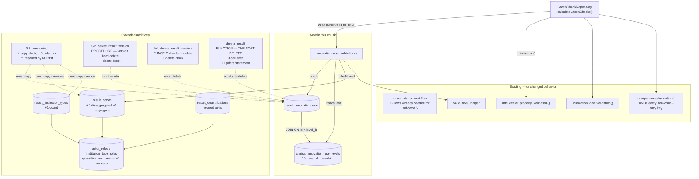

# Design — Results (Innovation Use) / Data Model, Catalog & Green Check

- **Module:** results (`innovation-use`)
- **Spec id:** 2026-08-innovation-use-data-model
- **Status:** draft — revised after Judgment Day rounds 1–3, then re-specified by the 2026-08-14 fresh pass on the SQL-lifecycle layer
- **Owner:** David Felipe Casañas Hernández
- **Linked requirements:** [`./requirements.md`](./requirements.md)
- **Findings ledger:** [`./judgment.md`](./judgment.md)
- **Linked TRD:** [`../../../trd/trd.md`](../../../trd/trd.md) §2.4 (ADR-5, ADR-6), §5.1, §5.2, §7.1, §12
- **Parent spec:** [`../family.md`](../family.md) — chunk 1 of 3
- **Last updated:** 2026-08-18 (§6.5.1 piece 4 corrected, §6.7 and §10 inbound notices filed — by `bugfix/sp-versioning-roles-id` T-03; each correction carries its own dated provenance inline)

---

## Document Control

| Field | Value |
| --- | --- |
| Depth | Full |
| Approval Mode | gated |
| Skills loaded | `software-architect` (Decision Spine, ADR profile) |
| Delegation | Two blind read-only judges (Judgment Day round 1). No design subagent authored content. |
| Judgment Day | Rounds 1–3, all **ESCALATED**; lineage **exhausted** (2 fix rounds, 2 re-judgments). Round 1: 21 findings. Round 2: 17/21 closed, 11 new. Round 3: 12 new, incl. a **fourth** routine and a DEFECTIVE transcript. Rounds 1–2 applied in-lineage; **round 3 applied by the fresh pass** (§15). |
| Fresh pass (2026-08-14) | Scoped to the SQL-lifecycle layer per [`./HANDOFF.md`](./HANDOFF.md) §2. Routine set re-derived **by call site**, all four bodies re-transcribed **by reading**. Non-SQL layers untouched — verified sound across three rounds. |
| Reversion challenge (Step 2.3) | **Not triggered.** No decision removes, disables, or inverts delivered behavior. Every DDL statement is additive; §6.7's routine changes *add* columns, blocks and statements without removing any. **M0 (§5) repairs a non-executable block** — a repair of broken behavior, not a reversion of delivered behavior. |
| Budget (Step 2.4) | **13 tasks · ~2,600 LOC · 4–5 review rounds** (+~2,750 in the extracted [`sp-versioning-roles-id`](../../archive/2026-08-18-bugfix--sp-versioning-roles-id/) spec — *corrected 2026-08-18 from "+~2,110"; that spec's T-02 Pivot grew its own budget after this figure was written; found by the backward sweep in that spec's 2026-08-18 validation-remediation pass*). Revised three times by review — see §12. |
| ⚠️ Escalation | **`SP_versioning` is non-executable today, for all six indicators** (transcript §2.4). Pre-existing, discovered by this pass, and blocking for M6. Ruling **DD-13** puts the repair in **M0**; §12 records the option to extract it into its own bugfix spec instead. **This is a user decision.** |
| Unresolved product ruling | **R-IU-010 / OpenSearch** — resolved here per the design's recommendation (§7). One-line reversal if overruled. |

---

## Executive Summary

The design is deliberately boring where the risk is high and explicit where the risk is invisible.

- **Schema:** two new tables, **six** additive nullable columns across two shared tables, three seeded discriminator rows. Nothing existing is altered.
- **Catalog:** ten rows seeded by migration, `id = level + 1`. Not synced from CLARISA, because CLARISA does not publish the two fields the feature depends on.
- **Validation:** one MySQL stored function mirroring `innovation_dev_validation`, with one deliberate divergence — it filters by role discriminator, where the Innovation Dev original does not.
- **Lifecycle (re-specified by the fresh pass):** **four** routines — `SP_versioning`, `SP_delete_result_version`, and the FUNCTIONs `full_delete_result_version` and **`delete_result`** — enumerate every child table, and on the copy path every column, **by name**. Unamended, an Innovation Use result loses its entire detail record on version/snapshot, is orphaned on both hard-delete paths, and is left as an **active orphan** on soft delete. §6.7 covers this; at ~3,070 LOC it is the single largest piece of work in the chunk.
- **A blocking pre-existing defect (new):** `SP_versioning` **cannot execute today** — two of its blocks reference a column dropped by an earlier migration (transcript §2.4). M6 must reproduce that body, so the repair (**M0**) is a prerequisite, not an optional cleanup. See the §12 escalation.

The dominant risk remains that stored-function and stored-procedure logic has **no automated gate in this repository**. §6.5 defines the fixture harness that substitutes for one, and §6.6 states exactly what a green run does *not* prove. The fresh pass is itself evidence for that risk: **three consecutive review rounds asserted a wrong routine count**, and the layer where the spec's claims were least reliable is exactly the layer with no automated gate.

---

## 1. Goals & Non-Goals

**Goals**

1. Persist Innovation Use detail data with full audit and soft-delete semantics — R-IU-001, NFR-IU-002.
2. Make the 0–9 use scale available and reproducible from migrations alone — R-IU-002, NFR-IU-003.
3. Extend the shared child tables **additively**, with Innovation Dev provably unaffected — R-IU-003 … R-IU-005, R-IU-008.
4. Compute and gate Innovation Use section completeness through the existing green-check pipeline — R-IU-006, R-IU-007.
5. **Preserve Innovation Use data across versioning, snapshot, and delete** — R-IU-011.
6. Leave the SQL-validation architecture documented rather than tacit — D-6, ADR-11; and correct the stale ADR-6 — §7.

**Non-Goals**

- Any endpoint, DTO, controller, or service (chunk 2).
- Any client file (chunk 3).
- Refactoring green checks out of MySQL — inherited, documented, not fixed here (ADR-11).
- A live CLARISA sync for the use-level catalog (DD-2).
- A unit-of-measure catalog (D-2).
- Backfill (A-3).
- **Indexing indicator-specific detail fields in OpenSearch** — decided, not deferred. §7 sets out the evidence and DD-8 records the ruling.

---

## 2. Architecture

This chunk touches one slice: the **Results aggregate's persistence layer**, its **lifecycle stored procedures**, and the **green-check computation path**. It adds no container and no integration. The robust-vs-lite gate is not engaged.



**Legend:** `[( )]` = MySQL table · `" "` = MySQL routine or TypeScript method · solid arrow = reads/calls · dashed arrow = must be amended to cover · subgraph = change class.

### 2.1 Composition

| Path | Responsibility | New / Changed |
| --- | --- | --- |
| `src/domain/entities/result-innovation-use/entities/result-innovation-use.entity.ts` | Innovation Use detail record | **new** |
| `src/domain/tools/clarisa/entities/clarisa-innovation-use-levels/entities/clarisa-innovation-use-level.entity.ts` | Use-level catalog entity | **new** |
| `src/domain/entities/result-actors/entities/result-actor.entity.ts` | +5 count columns, mode invariant documented | changed |
| `src/domain/entities/result-institution-types/entities/result-institution-type.entity.ts` | +1 count column | changed |
| `src/domain/entities/{actor-roles,institution-type-roles,quantification-roles}/enum/*.enum.ts` | `INNOVATION_USE` member each | changed |
| `src/domain/entities/results/entities/result.entity.ts` | inverse relation to the detail entity | changed |
| `src/domain/entities/green-checks/repository/green-checks.repository.ts` | `INNOVATION_USE` case + `ip_rights` inclusion | changed |
| `src/domain/entities/green-checks/dto/find-green-checks.dto.ts` | optional `innovation_use` | changed |
| `src/db/migrations/*` | **seven** append-only migrations — M0 … M6 (§5) | **new** |
| `src/db/config/mysql/orm.test.config.ts` | TEST-bound `DataSource` — hard prerequisite for every SQL gate (§6.5.1) | **new** |
| `test/fixtures/innovation-use/*` | stored-routine truth-table harness (§6.5) | **new** |

**No module, controller, or service is created in this chunk.** No OpenSearch file is touched (§7).

### 2.2 Reuse

Consumed unchanged: `AuditableEntity`, `valid_text()`, `ControlListBaseService` (chunk 2's base), `GreenCheckRepository` (extended), `completenessValidation` (**not touched** — DD-5), `intellectual_property_validation` (**not touched**, but newly reached for indicator 6 — §6.2), `ClarisaActorTypesEnum.OTHER = 5`.

**No refactor is required for reuse.** Every extension point already exists.

---

## 3. Data Model

### 3.1 `result_innovation_use` (new)

Mirrors `result_innovation_dev`: `result_id` is both PK and FK, so a duplicate active row is structurally impossible (R-IU-001's negative constraint is enforced by the schema, not by application code).

| Column | Type | Null | Notes |
| --- | --- | --- | --- |
| `result_id` | `bigint` | no | **PK**, FK → `results.result_id` |
| `innovation_use_level_id` | `bigint` | yes | FK → `clarisa_innovation_use_levels.id`. **Stores `id`, never `level`** |
| `innovation_use_level_explanation` | `text` | yes | Mandatory only when the joined `level >= 6` |
| *(inherited)* | | | `AuditableEntity` columns |

Relations: `@ManyToOne` → `Result`, `@ManyToOne` → catalog. `Result` gains the inverse `@OneToMany`, matching `result_innovation_dev` (`result.entity.ts:316-320`).

### 3.2 `clarisa_innovation_use_levels` (new)

Same column shape as `clarisa_innovation_readiness_levels`, so chunk 2's control-list service can extend `ControlListBaseService` exactly as the readiness service does.

| Column | Type | Null | Notes |
| --- | --- | --- | --- |
| `id` | `bigint` | no | **PK, not auto-increment** |
| `level` | `bigint` | yes | The scale point, 0–9. **The business value** |
| `name` | `text` | yes | **Not unique** — repeats in pairs across adjacent levels |
| `definition` | `text` | yes | Shown in the UI callout |
| *(inherited)* | | | `AuditableEntity` columns |

Seed content fixed verbatim by R-IU-002. No `additional_guidance` column: the source supplies no equivalent, and an always-null column is noise.

> **`id ≠ level` is the most dangerous property of this table.** See DD-3.

### 3.3 `result_actors` (extended additively — 5 columns)

| Column | Type | Null | Mode |
| --- | --- | --- | --- |
| `women_youth_count` | `int` | yes | disaggregated |
| `women_not_youth_count` | `int` | yes | disaggregated |
| `men_youth_count` | `int` | yes | disaggregated |
| `men_not_youth_count` | `int` | yes | disaggregated |
| `actors_count` | `int` | yes | **aggregate only** — the single "How many" (D-4) |

Existing `women_youth` / `women_not_youth` / `men_youth` / `men_not_youth` **booleans stay exactly as they are**.

**The mode invariant** (RB-5), documented on the entity because no constraint enforces it:

| `sex_age_disaggregation_not_apply` | Populated | `NULL` | Total is |
| --- | --- | --- | --- |
| `FALSE` / `NULL` | the four `*_count` columns | `actors_count` | **derived** — the sum |
| `TRUE` | `actors_count` | the four `*_count` columns | **`actors_count`** |

**Where the invariant is enforced** (three layers, per RB-5 — this design does *not* narrow it to documentation alone):

1. **Entity** — documented as a comment on the columns.
2. **Validation function** — §6.4 step 4 tests mode consistency, so an inconsistent row cannot turn the section green.
3. **API edge** — chunk 2 rejects a payload populating both modes.

**Type choice — `int`, not `bigint`.** Person counts never approach 2.1 B. DD-6 records the deliberate divergence from the table's `bigint` FK columns.

### 3.4 `result_institution_types` (extended additively — 1 column)

| Column | Type | Null | Notes |
| --- | --- | --- | --- |
| `organization_count` | `int` | yes | The "How many" per organization row (R-IU-004) |

### 3.5 `result_quantifications` — reused unchanged

"Other quantitative measures" maps onto the existing `unit` (free text, D-2) + `quantification_number`, discriminated by the new `quantification_role_id`. **No schema change.**

### 3.6 Role discriminator rows

| Catalog | Existing | Added |
| --- | --- | --- |
| `actor_roles` | `INNOVATION_DEV = 1` | `INNOVATION_USE = 2` |
| `institution_type_roles` | `INNOVATION_DEV = 1` | `INNOVATION_USE = 2` |
| `quantification_roles` | `ACTUAL_COUNT = 1`, `EXTRAPOLATE_ESTIMATES = 2` | `INNOVATION_USE = 3` |

No existing id is renumbered (R-IU-005 AC.3).

### 3.7 Indexes

**None added.** Review basis, recorded here so it is not re-litigated at the gate: every column the validation function filters on is already a PK or FK-backed index — `result_innovation_use.result_id` (PK), `clarisa_innovation_use_levels.id` (PK), `result_actors.result_id` and `.actor_type_id` (FK indexes created at `1749957832239-createEntitiesForInnovationDev.ts:39,42`). No new access path is introduced. If the §6.5 harness surfaces a slow plan, an `idx_<table>_<purpose>` index becomes a follow-up (NFR-IU-001), not a silent addition.

---

## 4. API Surface

**No API changes in this chunk.** Every endpoint arrives in chunk 2.

One inherited constraint is recorded so chunk 2 does not rediscover it: `ControlListBaseService.findAll()` issues **no `order` clause** and `findByName` is a `LIKE %name%` match (`clarisa-base-service.ts:30-38,50-67`). Because catalog `name` values repeat in pairs, chunk 2's catalog endpoint **must** order explicitly by `level` and must never resolve a level by name. Seeding `id = level + 1` makes default PK ordering *coincidentally* correct — which is exactly why chunk 2 must not rely on it.

---

## 5. Migrations

Seven migrations, one per concern (template §4), append-only (ADR-5), applied in order.

> **Supersedes** `proposal.md`'s "~3 append-only migrations" estimate, which predates the stored-procedure finding.

| # | Migration | Concern | `down()` |
| --- | --- | --- | --- |
| ~~M0~~ | **EXTRACTED** → [`../../archive/2026-08-18-bugfix--sp-versioning-roles-id/`](../../archive/2026-08-18-bugfix--sp-versioning-roles-id/) · `repairSpVersioningObjectiveBlocks` | **Prerequisite repair — not an Innovation Use change.** Rewrites `SP_versioning`'s `result_impact_outcomes` and `result_strategic_objectives` blocks, which reference the dropped `roles_id` column, mismatch column/value counts, and copy an AUTO_INCREMENT PK (transcript §2.4). Without it the procedure raises MySQL 1054 on first call and **no versioning fixture can run** | `DROP` + `CREATE` restoring the prior (broken) body verbatim |
| M1 | `createClarisaInnovationUseLevels` | Catalog table + the ten canonical rows | `DROP TABLE` |
| M2 | `createResultInnovationUse` | Detail table + FKs | `DROP TABLE` (FKs first) |
| M3 | `addInnovationUseCountsToSharedTables` | 5 columns on `result_actors`, 1 on `result_institution_types` | `DROP COLUMN` × 6 — **new columns only** |
| M4 | `insertInnovationUseRoles` | 3 discriminator rows | `DELETE` by id |
| M5 | `createInnovationUseValidation` | The stored function | `DROP FUNCTION innovation_use_validation` |
| **M6** | `updateLifecycleRoutinesForInnovationUse` | **Amends all FOUR lifecycle routines** — six edits (§6.7, transcript §6) | `DROP` + `CREATE` restoring all four prior bodies verbatim |

**Ordering:** **the extracted bugfix first** (it carries the former M0) — M6 reproduces `SP_versioning`'s body, so it must inherit the repaired one, and F13/F16/F18 cannot execute before it. M2 depends on M1 (FK target). M5 depends on M1–M4. **M6 depends on M0, M2 and M3**. M3 and M4 are independent of each other.

**Safety rules** (R-IU-009): no `DROP COLUMN` on a pre-existing column · no `MODIFY COLUMN` · no `NOT NULL` on an existing table · M5 names only `innovation_use_validation` in both `DROP` and `CREATE` · **M0 and M6 reproduce each routine body in full** (the repo's established pattern) and their `down()` restores the exact prior bodies — **including M0's, which restores a body known to be broken**, because a `down()` that "improves" on its `up()` is not a reversal.

> **M0's `down()` deliberately restores a non-executable procedure.** That is correct: `down()` must return the schema to its prior state, defects included. Recorded here so it is not read as an oversight and "fixed" into a partial revert.

**Seeding in-migration is a deliberate break with local precedent.** `clarisa_innovation_readiness_levels` rows were never inserted by any migration — verified: zero `INSERT INTO clarisa_innovation_readiness_levels` anywhere. They entered the shared database out-of-band, which is why that catalog cannot be reconstructed from source. M1 does not repeat that (DD-2).

---

## 6. Workflows & Business Rules

### 6.1 Green-check assembly

`GreenCheckRepository.calculateGreenChecks(result_id)` reads the result's `indicator_id`, then appends indicator-specific SQL to one `SELECT`. Two edits:

1. A `case IndicatorsEnum.INNOVATION_USE:` appending `innovation_use_validation(r.result_id) as innovation_use`.
2. `IndicatorsEnum.INNOVATION_USE` added to the array appending `intellectual_property_validation(...) as ip_rights` — currently `[INNOVATION_DEV, CAPACITY_SHARING_FOR_DEVELOPMENT]` (`green-checks.repository.ts:99-106`).

Both are additive within a `switch` and an `includes`; neither can alter another indicator's key set (R-IU-007 AC.2).

### 6.2 The `ip_rights` inclusion has a real product consequence

Adding indicator 6 to that array makes **every Innovation Use result unsubmittable until IP Rights is filled**. `intellectual_property_validation` (`1753460254629-createFunctions.ts:95-129`) declares `validation BOOLEAN DEFAULT false`; with no active `result_ip_rights` row the `SELECT … INTO` leaves the defaults and returns `FALSE`. `ip_rights` is not in `VISUAL_ONLY_GREEN_CHECKS`, so `completenessValidation` ANDs it.

This follows directly from the product decision to include IP Rights for Innovation Use, and is almost certainly intended. It is recorded because it is a **second SQL-only submit-blocking behavior** entering under the same blind spot §6.6 describes — so it gets its own fixture (F10) rather than being assumed.

The function branches on `IF indicatorId = 2` for the extra Innovation-Dev-only checks; indicator 6 takes the general path, so **no change to `intellectual_property_validation` is needed**.

### 6.3 Submit gating — no change required

`completenessValidation` iterates **every key** from `calculateGreenChecks`, skips `VISUAL_ONLY_GREEN_CHECKS`, and ANDs the rest. Adding the `innovation_use` key gates submission with **zero changes to the gate itself**.

Easy to get wrong in the opposite direction: adding `innovation_use` to `VISUAL_ONLY_GREEN_CHECKS` would make the section silently non-blocking. R-IU-007 AC.3 asserts it is absent.

**The thrown message names no section, and this chunk does not change that.** `function-handler.service.ts:330-332` throws a fixed string — `'There are still sections pending before the results can be submitted.'` R-IU-007's clause *"the message names that sections are still pending"* is satisfied only in the weak sense that the message says sections are pending; it does not enumerate **which**. Naming them would mean changing a method shared by all six indicators (DD-5 declines to touch it), so the granular feedback is delivered where it belongs: the sidebar's per-section green checks (chunk 3) already show the user exactly which sections are incomplete. **Recorded as a deliberate limitation, not an oversight** — round 2 found this clause had been marked resolved while remaining unaddressed.

### 6.4 `innovation_use_validation` — logical structure

Mirrors `innovation_dev_validation`'s shape, with one deliberate divergence, one trap avoided, and one inherited dead branch **not** copied.

1. **Detail scalars.** Join `results` → `result_innovation_use` → `clarisa_innovation_use_levels` (`ON id = innovation_use_level_id`), filtered to `is_active = TRUE`, selecting: whether the level id is non-null, the catalog's `level`, and `valid_text(innovation_use_level_explanation)`.
2. **Conditional explanation.** `IF(level >= 6, <explanation is valid>, TRUE)`.
3. **Actor type resolution.** Over `result_actors` filtered by `result_id`, `is_active = TRUE`, **and `actor_role_id = <INNOVATION_USE>`**: every row must resolve its type. Because `actor_type_id` is `NOT NULL` at the schema level, **the only reachable failure is `actor_type_id = 5` (OTHER) with a null/blank `actor_type_custom_name`**. The rule is therefore `IF(actor_type_id = 5, valid_text(actor_type_custom_name), TRUE)` — **not** `innovation_dev_validation`'s `ELSE actor_type_id IS NOT NULL`, which is unreachable dead code there.
4. **Actor mode consistency** (RB-5 layer 2, backed by R-IU-006 AC.10). For each Innovation-Use actor row: if `sex_age_disaggregation_not_apply = TRUE` then `actors_count IS NOT NULL`, else at least one of the four disaggregated counts is non-null.
5. **Minimum actor count** (DD-11). Steps 3 and 4 are written per-row and are therefore **vacuously true when the result has no actor rows at all**. `innovation_dev_validation` guards this explicitly with `tempActors > 0 AND tempFullActors = tempActors` (`1758125999162:108-111`); `innovation_use_validation` adopts the same guard, so a result with zero actors does **not** turn green.
6. **Return** the conjunction. Absence of a detail row yields the `FALSE` defaults and returns `0`.

**The divergence — role filtering (DD-4).** `innovation_dev_validation` counts *all* active `result_actors` rows with no role filter (verified at `1758125999162:68-84,114`). That is correct today only because a result has one indicator (A-1). `innovation_use_validation` filters anyway, so correctness rests on a stated invariant rather than a coincidence.

**The trap — never compare the FK (DD-3).** The level test must read `clarisa_innovation_use_levels.level` obtained through the join, **never** `innovation_use_level_id`. Because `id = level + 1`, `innovation_use_level_id >= 6` yields `level >= 5` and demands the justification a full level early. `innovation_dev_validation` models the correct pattern (`LEFT JOIN … ON cirl.id = rid.innovation_readiness_id`, then tests `cirl.level`).

### 6.5 The fixture harness (substitute gate for DC-2 / DC-3 / DC-10 / DC-12 / DC-13)

No test in this repository has ever executed a stored routine. The harness lives under `test/fixtures/innovation-use/`, provisions a **scratch schema** (§6.5.1), seeds each fixture, and asserts the result.

| # | Fixture | Expected | Catches |
| --- | --- | --- | --- |
| F1 | No `result_innovation_use` row | `0` | Missing-row default |
| F2 | Detail row, `innovation_use_level_id` NULL | `0` | Null level |
| F3 | **level 5** (id 6), no explanation | **`1`** | **DC-10** — fails if the FK is compared |
| F4 | **level 6** (id 7), no explanation | **`0`** | **DC-10** — discriminating pair with F3 |
| F5 | level 6, whitespace-only explanation | `0` | `valid_text()` wiring |
| F6 | level 6, **empty-string** explanation | `0` | R-IU-006 AC.5's "empty" half |
| F7 | level 6, valid explanation | `1` | Happy path |
| F8 | Actor row, `actor_type_id = 5` (OTHER), null `actor_type_custom_name` | `0` | Actor resolution — **the only reachable failure** |
| F9 | Actor row, aggregate mode, `actors_count` NULL | `0` | Mode consistency (RB-5 layer 2) |
| F10 | Indicator-6 result, no `result_ip_rights` row | `ip_rights` = `0` | §6.2's submit-blocking consequence |
| F11 | Actor rows under the **Innovation Dev** role only | ignored → `1` | DD-4 role filtering |
| F12 | `innovation_dev_validation` over a fixed Innovation Dev fixture, before vs after M1–M6 | identical | R-IU-006 AC.9 — **stored function only; proves nothing about the routines** |
| **F9b** | **Actor row, disaggregated mode (`sex_age_disaggregation_not_apply` FALSE), all four counts NULL** | **`0`** | **R-IU-006 AC.10's disaggregated half** — round 3 (T4) found the AC added without its gate |
| **F13** | **`CALL SP_versioning` on an Innovation Use result with level, explanation, all five actor counts and an organization count** | **every field and count present on the new version** | **DC-12 / R-IU-011 AC.1, AC.2** |
| **F14** | **`CALL SP_delete_result_version` on an Innovation Use version** | **no orphaned `result_innovation_use` row** | **DC-12 / R-IU-011 AC.3** |
| **F15** | **`SELECT full_delete_result_version(?)` on an Innovation Use result** | **no orphaned `result_innovation_use` row** | **DC-12 / R-IU-011 AC.4** — hard delete, missed in round 1 |
| **F16** | **Version *and* run all three delete paths on an **Innovation Dev** result, before vs after M0+M6; compare every copied column and every surviving row** | **identical** | **R-IU-011 AC.6 — the routine regression gate.** Not F12, which is a stored-*function* comparison and executes no routine |
| **F17** | **Innovation Use result with zero actor rows** | **`0`** per DD-11 | The vacuous-truth case (§6.4) |
| **F18** | **`SELECT delete_result(?)` on an Innovation Use result** | **`result_innovation_use.is_active = FALSE` and `deleted_at` set** | **DC-12 / R-IU-011 AC.5 — the soft-delete path, missed in rounds 1–3.** Its absence leaves an **active orphan**, which is worse than a hard orphan: the row is still visible to every `is_active = TRUE` query |
| ~~F19~~ | **EXTRACTED** with M0 → owned by [`../../archive/2026-08-18-bugfix--sp-versioning-roles-id/`](../../archive/2026-08-18-bugfix--sp-versioning-roles-id/) as its red-before-green regression fixture | — | DC-13, now gated externally |

> The previous revision's F7 ("actor row with `actor_type_id` NULL → `0`") was **removed**: `result_actors.actor_type_id` is `bigint NOT NULL` (`1749957832239:18`; entity `nullable: false`), so that row cannot be inserted. It would have raised a constraint violation instead of exercising the function, leaving R-IU-006 AC.7 ungated. F8 replaces it with the branch that can actually fail.

#### 6.5.1 Scratch-schema provisioning — the mechanism, not just the rule

> **Round 2 correction — the previous revision described a mechanism that does not work, and following it would have been dangerous.** It claimed an npm script could be "wired to the `TEST` target". It cannot: `orm.config.ts:71-73` is
>
> ```
> export const dataSource: DataSource = <DataSource>(getDataSource(dataSourceTarget.CORE, true));
> ```
>
> — a **single instance bound to `CORE` at module load**. TypeORM's CLI `-d` imports that file and uses that exact instance; it has no way to re-invoke `getDataSource` with `TEST`. Adding a script that points `-d` at the same file runs the suite against **`ARI_MYSQL_*`, the shared database**, no matter what `ARI_TEST_MYSQL_*` is set to.

**What the harness actually requires — five pieces, none optional:**

1. **A new sibling datasource module**, e.g. `src/db/config/mysql/orm.test.config.ts`, exporting `export const dataSource = getDataSource(dataSourceTarget.TEST, true)`. The existing `dataSourceTarget.TEST` branch (`orm.config.ts:34-39`, driven by `ARI_TEST_MYSQL_*`) is reachable **only** through such a module. Without this file the gate cannot exist.
   > **Trap (round 3, T10):** `orm-connection-test.module.ts` already exists and, despite the name, binds to **`CORE`** (`:10`). It is **not** this piece. An implementer who greps for a test module and assumes piece 1 is done will point the whole harness at the shared database.
2. **A `ARI_TEST_MYSQL_PORT` env var, which does not exist yet** (round 3, T8). `orm.config.ts:46` reads `DB_PORT` for **both** targets, so a Docker MySQL published on any non-default port is unaddressable. Piece 1's module must read a TEST-specific port, and `.env.example` must gain it.
3. **New npm scripts** passing `-d ./src/db/config/mysql/orm.test.config.ts` — never the CORE config.
4. **A disposable MySQL** (Docker) with `ARI_TEST_MYSQL_*` pointed at it. ~~running the **full** migration suite — not just M0–M6~~ → **Corrected 2026-08-18 (T-03 of `bugfix/sp-versioning-roles-id`), same reasoning as §4.1 below: the 303-migration history is not replayable from empty (RB-1d in that spec's `requirements.md`).** The schema is built by loading a committed schema-only **snapshot** (that spec's T-01b, §4.1/DD-5 below) that already carries `results`, `result_actors`, `clarisa_actor_types`, `valid_text()`, and every other pre-existing table/routine as applied; only migrations genuinely new since the snapshot's date — M1–M6 here, plus the two migrations in the external bugfix spec — actually run. The validation function's real dependency on those tables is unchanged; what changes is *how* they arrive in the scratch schema (snapshot, not replay). F12/F16/F19 additionally need `result_innovation_dev`, `result_impact_outcomes`, `result_strategic_objectives`, and `clarisa_innovation_readiness_levels` — all present in the snapshot.
5. **A dedicated Jest config.** The fixtures live under `test/fixtures/innovation-use/`, outside Jest's `rootDir: "src"` with `testRegex: ".*\\.spec\\.ts$"` (`package.json:122-123`), so the default runner will not pick them up.

**Never point any of this at `ARI_MYSQL_*`.** The shared dev DB is not disposable (root `CLAUDE.md` §4.3), and R-IU-009 AC.4 makes any shared-DB migration a human decision. **Piece 1 is a hard prerequisite for every SQL gate in this spec** — until it exists, DC-1, DC-2, DC-3, DC-10, and DC-12 are all ungated.

**Disqualifier:** if the disposable MySQL cannot be provisioned, the result is **inconclusive, not passed**. A run that exits `0` because it skipped every fixture is not evidence. The task's execution note must record the outcome verbatim.

### 6.6 What a green run does not prove

Passing `npm test`, `npm run lint`, and the 60% coverage floor proves **nothing** about §6.4's or §6.7's logic. Jest does not instrument SQL. Only §6.5 speaks to DC-2 / DC-3 / DC-10 / DC-12 / DC-13, and only when it actually connects.

### 6.7 Lifecycle routines — re-specified by the 2026-08-14 fresh pass

The result lifecycle is implemented by **four** MySQL routines that enumerate every child table — and, on the copy path, every column — **by name**. New tables and columns are invisible to them, and the failure is silent: no error, no log, no metric.

> **Ground truth: [`./routine-transcript.md`](./routine-transcript.md) revision 2.** It transcribes all four bodies, their signatures, call sites, semantics, insertion anchors, and column lists. **M6 is written from the transcript, not from this prose** (DD-12).

#### Why this section was wrong three times

| Round | Claim | Reality |
| --- | --- | --- |
| 1 | "Side effects: **None**" | Two routines silently drop the data |
| 2 | "**Two** routines" | Three |
| 3 | "**Three**, not two" | **Four** — and the missed one is the most-called |

Every wrong claim came from enumerating **by name already suspected**. The complete set is obtained in one command by enumerating **call sites** (transcript §0 step 1) — cheap, complete, and unused across all three rounds. The transcript's revision 1 was written to end this failure mode and then reproduced it, by deriving its block list with a single-line `grep` instead of by reading. **The method, not the conclusion, is what this section now depends on.**

#### The complete routine set — enumerated by call site

| Routine | Kind | Latest definition | Call sites | Role |
| --- | --- | --- | --- | --- |
| `SP_versioning` | PROCEDURE | `1783029013035:8-988` | 2 | Snapshot copy |
| `SP_delete_result_version` | PROCEDURE | **`1778510205765:173-334`** — *not* `1783029013035`, which contains **zero** occurrences of this name | 2 | Hard-remove a **version** |
| `full_delete_result_version` | FUNCTION | `1783029013035:993-1163` | 1 | Hard-remove **any** result |
| **`delete_result`** | **FUNCTION** | **`1764275660631:312-511`** | **3 — the most of any routine** | **The soft delete** |

> **The naming trap that hid `delete_result` for three rounds.** `SP_delete_result_version` was mislabeled "soft delete" in rounds 1–3. It is not: it issues `DELETE FROM` on 33 tables. The mislabel filled the soft-delete slot in the taxonomy with the wrong routine, so the real soft delete had no slot left to be missing from. **Name routines by what their body does** (transcript §1.2).

#### Consequences if unamended

| Evidence | Consequence |
| --- | --- |
| `1783029013035:625` — `INSERT INTO result_actors (…)` with an explicit 15-column list (transcript §2.1) | The 4 disaggregated counts and `actors_count` are **not copied** — every count returns `NULL` on the new version |
| `:662` — same explicit-list pattern for `result_institution_types` (transcript §2.2) | `organization_count` **not copied** |
| `:695-770` — `result_innovation_dev` copied by its **own dedicated block**; `SP_versioning` has **29** such blocks (transcript §2) | `result_innovation_use` has no block → **the entire detail record is never copied** |
| `1778510205765:279` and `1783029013035:1106` — both hard-delete paths name each table (transcript §§3–4) | `result_innovation_use` rows are **orphaned** on both hard deletes |
| **`1764275660631:467`** — `delete_result` updates each table by name (transcript §5) | **Soft-deleting leaves `result_innovation_use.is_active = TRUE` — an *active* orphan pointing at a deleted result.** Worse than a hard orphan: it remains visible to every `is_active = TRUE` query |

#### M6's change set — six edits across four routines

Enumerated precisely in **transcript §6**, with insertion anchors:

1. Append the five count columns to `SP_versioning`'s `result_actors` block — column list **and** `SELECT` list.
2. Append `organization_count` to its `result_institution_types` block — both lists.
3. Add a `result_innovation_use` copy block after the `result_innovation_dev` block (ends line 770).
4. Add `DELETE FROM result_innovation_use …` to `SP_delete_result_version` (after 281).
5. Add the same `DELETE` to `full_delete_result_version` (after 1108).
6. **Add `UPDATE result_innovation_use SET is_active = FALSE, deleted_at = deleteDate …` to `delete_result`** (after 471).

Each routine is `DROP` + `CREATE` reproducing the full body, with `down()` restoring all four prior bodies verbatim. **`SP_delete_result_version`'s historical `down()` is a bare `DROP` with no recreation** (`1778510205765:337`), so `down()` must be written deliberately — the copy-a-neighbour model is not safe here (round 3, T11).

#### What M6 must NOT do

| Not this | Why |
| --- | --- |
| Add a `result_quantifications` copy block | **Already copied** (`:297`). Adding one duplicates quantification rows on every version bump, for every indicator (round 3, T2) |
| Add delete/update statements for `result_actors` / `result_institution_types` | Both tables are already removed wholesale by row on all three delete paths. Only the versioning **copy lists** need the new columns |
| Harmonize the two hard-delete routines | Transcript §4.1 records a pre-existing divergence (`result_impact_outcomes`, `result_strategic_objectives`, and `SIGNAL` vs `RETURN FALSE`). **Out of scope** — "fixing" it changes delete behavior for every indicator |
| Close `delete_result`'s six soft-delete gaps | Transcript §5.1. Same reasoning |
| Fold in the M0 repair | M0 ships separately so the repair is reviewable on its own and can land without Innovation Use (§5, DD-13) |

> **Inbound notice — filed 2026-08-18 by `bugfix/sp-versioning-roles-id` T-03. This row is left as written above; it is what M6 must be executed against, and this task does not edit chunk 1's own scope.** That spec's T-02b (`[x]` done, Reviewer PASS 2026-08-14) already closed the table-enumeration half of the divergence in the row above — `SP_delete_result_version` now deletes `result_impact_outcomes` / `result_strategic_objectives`, mirroring `full_delete_result_version` — outside M6, in its own separate migration (`1784250000000`), pending merge of `bugfix/sp-versioning-roles-id`; verify with `SHOW CREATE PROCEDURE SP_delete_result_version` before T-10. Only the `SIGNAL` vs `RETURN FALSE` half of that divergence, and `delete_result`'s six soft-delete gaps, remain pre-existing as of M6's first run. See §10's M6 edit-set assertion row below for the acceptance-criteria consequence, which chunk 1 must restate, not this task.

**This is additive within each routine** — no existing column, block, or statement is removed — so the reversion challenge is still not triggered.

**Blast radius.** All four routines serve **all six** indicators, on append-only migrations. This is the server-side shape of **KZ-002**: enumerate by *what reads the table*, not by where the feature lives. Gates: **F13** versioning · **F14** version hard delete · **F15** full hard delete · **F18** soft delete · **F16** the Innovation Dev regression gate across all four routines. **F12 does not serve that purpose** — it compares a stored *function* and executes no routine (round 2, R7).

### 6.8 Other side effects

Beyond §6.7: none. No Socket.IO event, no RabbitMQ message, no `sync_process_log` row, no DynamoDB write. No transactional boundary is added — chunk 2 owns the save transaction.

---

## 7. Integration Impact — OpenSearch

**Ruling: R-IU-010 is reduced to a recorded non-goal.** Decision **D-5** was taken on a premise this design disproved, and the corrected evidence is below.

### What the previous revision got wrong

It claimed `@OpenSearchProperty` appears *"on no `result_*` detail entity."* **That is false**, and both judges disproved it independently: `result-keywords/entities/result-keyword.entity.ts:23,36,49` carries three decorations, and `result-pool-funding-alignment-sp.entity.ts:38` carries another. That claim is withdrawn.

### The evidence that actually holds

The conclusion survives on a mechanism argument, which both judges independently verified:

| Evidence | Implication |
| --- | --- |
| `base-open-search-api.ts:316-344` — `_getMappingForSchema()` reflects metadata **only** off `this._openSearchEntity` | The mapping comes from whatever class is handed to the base API, not from entities generally |
| `results/result.opensearch.api.ts:25` — passes **`ResultOpensearchDto`**, never an entity | For the results index, entity-level decoration is **inert** — including `result.entity.ts`'s own |
| `results/dto/result.opensearch.dto.ts` — 125 lines, only `ResultStatusOpensearchDto`, `IndicatorOpensearchDto`, `ResultOpensearchDto`; **no indicator-specific detail fields** | Neither policy change, capacity sharing, OICR, nor innovation dev detail fields are indexed |

So decorating `result_innovation_use` would do nothing, and adding detail fields to `ResultOpensearchDto` would make Innovation Use the **only** indicator with searchable detail — an inconsistency and a new cross-indicator capability, not parity.

**Ruling:** Innovation Use joins every other indicator. Its header fields are already indexed through `ResultOpensearchDto` with no change; its detail fields are not indexed, exactly like every sibling. Detail-field search, if wanted, is a cross-indicator feature deserving its own spec.

**Reversal cost if overruled:** restore R-IU-010, add one task decorating `ResultOpensearchDto`, add an index-rebuild gate, and reinstate DC-11.

### TRD ADR-6 is stale — amendment proposed

`trd.md:98` states ADR-6 as *"OpenSearch mapping generated from `@OpenSearchProperty` decorators — Search schema co-located with **the entity**."* The mechanism above shows the results index is generated from a **DTO**, so entity-co-location does not hold there. Root `CLAUDE.md` §5 requires fixing the document rather than letting it drift. §11 records the amendment; without it the next spec re-derives this finding at the same cost — the exact defect ADR-11 exists to prevent.

No other integration is touched: CLARISA (no live sync — DD-2), AGRESSO, TIP, ROAR, RabbitMQ, DynamoDB, Socket.IO all unaffected.

---

## 8. Security & Authorization

No change. This chunk exposes no endpoint, so no `@Roles`, guard, or status-guard decision arises. No new secret, credential, or env var — except `ARI_TEST_MYSQL_*`, which already exists in `orm.config.ts` and points only at a disposable test database. No PII or donor-restricted field: actor counts are aggregate integers with no personal identifiers.

Audit obligations are met structurally — both new tables extend `AuditableEntity` (NFR-IU-002).

---

## 9. Observability

No new log lines, `sync_process_log` types, metrics, or traces.

Two gaps named rather than left implicit:

1. A stored **function** returning a wrong boolean is silent — no error, no log, no metric. There is no runtime signal for DC-2.
2. A stored **procedure** failing to copy a column is equally silent — the new version simply has `NULL` where data used to be. There is no runtime signal for DC-12 either.

Both are the observability half of §6.6's blind spot, and both strengthen ADR-11's revisit trigger.

---

## 10. Testing Strategy

| Layer | Scope | Command |
| --- | --- | --- |
| Unit | `green-checks.repository.spec.ts`: key set per indicator, `ip_rights` inclusion now covering indicator 6, `innovation_use` absent from `VISUAL_ONLY_GREEN_CHECKS` | `npm test -- --silent` |
| Unit | `function-handler.service.spec.ts`: `completenessValidation` throws on false `innovation_use`, passes when all true | same |
| Unit | Entity metadata: column presence, nullability, defaults, `int` vs `bigint` (DC-7) | same |
| Unit | Migration seed spec: the ten catalog rows equal R-IU-002's table **verbatim**; exactly ten rows; no duplicate `level`; **no ids 13–20** (D-7); **`clarisa_innovation_readiness_levels` row count and contents unchanged** (R-IU-002 AC.5) | same |
| Unit | **Role-row assertion** (R-IU-005 AC.2, round 3 T12): each of `actor_roles`, `institution_type_roles`, `quantification_roles` gains exactly one row, with a previously unused id | same |
| Integration | **Detail-row round trip** (R-IU-001 AC.3, round 3 T12): insert a `result_innovation_use` row, read it back, assert both columns and the populated audit columns | §6.5 harness |
| Integration | **M6 edit-set assertion** (R-IU-011 AC.8/AC.9, round 3 T12): the post-M6 routine bodies differ from the pre-M6 bodies in exactly transcript §6's six edits — no `result_quantifications` block added, both divergences intact | §6.5 harness |
| Integration | **§6.5 harness, F1–F18** — the only gate for DC-2 / DC-3 / DC-10 / DC-12 *(DC-13 gated by the extracted bugfix spec)* | dedicated npm script on the `TEST` datasource (§6.5.1) |
| Regression | **Full** suite; Innovation Dev specs unmodified (KZ-003) | `npm test -- --silent` |
| Migration | Apply then revert on the **scratch** schema (DC-1) | **New** npm scripts passing `-d ./src/db/config/mysql/orm.test.config.ts` (§6.5.1 pieces 1–3). **The existing `migration:dev:execute` / `migration:revert` CANNOT be used** — both hardcode `-d ./src/db/config/mysql/orm.config.ts`, whose export is bound to **`CORE`** at module load (`orm.config.ts:71-73`), i.e. the shared database. And **there is no `migration:run` script** (`package.json:28-32`) |

> **Inbound notice on the "M6 edit-set assertion" row above — filed 2026-08-18 by `bugfix/sp-versioning-roles-id` T-03. Not edited here; chunk 1 restates it when T-10 next runs.** That row's "both divergences intact" expectation (R-IU-011 AC.8/AC.9) is **invalidated in part**: T-02b (`[x]` done, Reviewer PASS 2026-08-14) added the two missing `DELETE` statements to `SP_delete_result_version`, closing the hard-delete table-enumeration divergence with `full_delete_result_version` (transcript §4.1) — see the §6.7 notice above. The M6 edit-set assertion must be restated against the **post-T-02b** routine bodies before M6 runs, checking only the divergences that still exist (the `SIGNAL`/`RETURN FALSE` difference and `delete_result`'s soft-delete gaps). Amending R-IU-011 AC.8/AC.9 is chunk 1's own gate; this notice raises it, it does not silently edit it.

Coverage target: repo default ≥ 60%, not regressed (NFR-IU-004). Unit specs keep mocking `DataSource` — appropriate for assembly logic, inadequate for SQL, which is why §6.5 exists.

**Pre-flight (KZ-004):** before the first migration lands, confirm (a) `node_modules` installed in `server/researchindicators`, (b) a disposable MySQL is provisionable **on a port `ARI_TEST_MYSQL_PORT` can address** (§6.5.1 piece 2), (c) the exact npm script names exist, (d) `orm.test.config.ts` exists and resolves to `dataSourceTarget.TEST` — not `orm-connection-test.module.ts`, which binds to `CORE`. Round 1 named `migration:run`, which **does not exist**; round 2 asserted the existing scripts were "pointed at the `TEST` target", which they are **not**. Both are exactly the failure KZ-004 warns about, and both reached an approval gate.

**Inherited drift, acknowledged not fixed:** `FindGreenChecksDto` declares no `ip_rights`, `innovation_dev`, `oicr`, or `link_result` even though `calculateGreenChecks` returns them at runtime. Adding `innovation_use` the same way inherits that drift. Out of scope here; recorded so it is a known gap rather than a new one.

---

## 11. Design Decisions

> **Reversion challenge (Step 2.3): not triggered.** No decision removes, disables, or inverts delivered behavior. DD-2 breaks a *precedent* without removing anything; DD-9's procedure edits are purely additive within the procedure bodies. No challenge reviewer was required.

| # | Date | Decision | Rationale | Rejected |
| --- | --- | --- | --- | --- |
| **DD-1** | 2026-08-14 | Extend the shared child tables additively, discriminated by `*_role_id` | Matches the pattern three indicators already share; one query shape platform-wide; every DDL statement additive | **Dedicated tables** — forks the actor model, forcing every cross-indicator query to union two shapes. **Converting booleans to counts** — destructive DDL on a shared non-disposable DB, and lossy both ways |
| **DD-2** | 2026-08-14 | Seed the catalog in-migration; no live CLARISA sync | CLARISA's endpoint returns only `{id, name}` — it does **not** publish `level` or `definition`, which every rule and the UI depend on. A sync would null them. Not a parallel-taxonomy violation: the vocabulary is CLARISA's, only its transport is local | **Live sync** — erases the needed fields. **Out-of-band insert** (the readiness precedent) — leaves the catalog unreconstructable, the defect NFR-IU-003 prevents |
| **DD-3** | 2026-08-14 | Every rule compares the catalog's **`level`** via join; the FK stores `id` | `id = level + 1`; comparing the FK is off by one and demands the justification a level early. Follows `innovation_dev_validation`'s existing pattern | **Storing `level` as the FK** — breaks the `ControlListBaseService` convention. **Making `id = level`** — diverges from CLARISA's ids, breaking source traceability |
| **DD-4** | 2026-08-14 | `innovation_use_validation` filters child rows by role, though `innovation_dev_validation` does not | Correctness should rest on a stated invariant, not the coincidence that a result has one indicator. Costs one predicate | **Copying the unfiltered original** — inherits a latent assumption the new code would then depend on |
| **DD-5** | 2026-08-14 | Do not modify `completenessValidation` | It already ANDs every non-visual-only key. Touching it would put **all six** indicators in the blast radius to achieve what adding a key achieves for free | **An explicit indicator-6 branch** — needless risk on the most safety-critical method in the lifecycle |
| **DD-6** | 2026-08-14 | Count columns typed `int`, not `bigint` | Counts never approach 2.1 B. Narrower type, clearer intent | **`bigint` for table consistency** — consistency with FK columns is no reason to over-size a count |
| **DD-7** | 2026-08-14 | `actors_count` is not a stored total | In aggregate mode the row has **no parts**, so nothing exists for it to contradict. The modes are mutually exclusive, preserving R-IU-003's no-stored-total rule | **A universal `total` column** — duplicates a derivable value in disaggregated mode, the exact defect the rule forbids |
| **DD-8** | 2026-08-14 *(revised)* | **R-IU-010 reduced to a non-goal** (§7) | Verified mechanism: the results mapping is generated from `ResultOpensearchDto`, never from an entity, so entity decoration is inert; and no indicator's detail fields are indexed. **The previous revision's entity-census evidence was false and is withdrawn** | **Implementing D-5 literally** — ships inert code and makes Innovation Use the only indicator with indexed detail. **Silently dropping it** — hides a scope change the product owner may rule on |
| **DD-9** | 2026-08-14 *(revised — fresh pass)* | **Amend all FOUR lifecycle routines in M6** — `SP_versioning`, `SP_delete_result_version`, `full_delete_result_version`, **`delete_result`** — rather than accepting data loss | All four enumerate tables (and on the copy path columns) by name; unamended, versioning silently drops the entire detail record and every new count, and soft delete leaves an **active orphan** (§6.7). Silent data loss is not an acceptable known bug. **The set was derived by call site, not by name** — the method that made rounds 1–3 wrong three times | **Deferring to a follow-up spec** — ships a feature that loses data on its first version bump. **A generic column-agnostic rewrite** — far larger blast radius across all indicators, out of scope (ADR-11 alt. *b*). **Amending only the routines named in an earlier round** — the failure mode itself |
| **DD-10** | 2026-08-14 *(new)* | The validation function uses `IF(actor_type_id = 5, valid_text(custom_name), TRUE)`, **not** the Innovation Dev original's `ELSE actor_type_id IS NOT NULL` | `actor_type_id` is `NOT NULL` at the schema level, so the original's else-branch is unreachable dead code. Copying it would have produced a fixture that cannot be constructed | **Copying `innovation_dev_validation` verbatim** — inherits dead code and leaves R-IU-006 AC.7 without a working gate |
| **DD-11** | 2026-08-14 *(round 2; precedent qualified by the fresh pass)* | **An Innovation Use result with zero actor rows does not turn green** — the function adopts a `tempActors > 0` guard | §6.4 steps 3–4 are per-row predicates, vacuously true over an empty set. Without the guard a result with no actors would be complete, contradicting the Actors block being required. ⚠️ **Precedent correction (round 3, T9):** `innovation_dev_validation`'s `tempActors > 0` is **conditional**, nested inside `IF(anticipatedUserId = 1 OR …, TRUE, …)` (`1758125999162:108-111`) — it is *not* the unconditional guard round 2 claimed. Innovation Use adopts it **unconditionally**, which is a deliberate divergence, not a copy | **Leaving it implicit** — an unstated vacuous-truth case is a silent false-green. **Enforcing only at the API edge** — the green check would then disagree with the submit gate. **Copying Innovation Dev's conditional form** — its condition has no Innovation Use analogue |
| **DD-12** | 2026-08-14 *(round 2; strengthened by the fresh pass)* | **[`routine-transcript.md`](./routine-transcript.md) is a required spec artifact**; M6 is written from it, not from this document's prose. **The transcript must record the method that produced it** (§0) and be derived by *reading*, never by `grep` | Three consecutive review rounds found factual errors in this spec's routine claims — every one from describing SQL instead of reading it. Revision 1 of the transcript was then itself graded DEFECTIVE for being grep-derived: **an artifact created to prevent a failure mode reproduced it.** Recording the method is what makes the artifact auditable rather than merely authoritative-looking | **Continuing to describe routines in prose** — 0-for-3 in this spec. **A transcript without its method** — indistinguishable from revision 1 at review time |
| **DD-13** | 2026-08-14 *(fresh pass — NEW, escalated)* | **`SP_versioning`'s two broken blocks are repaired in a dedicated migration M0, ahead of M6**, and M0's `down()` restores the broken body verbatim | `SP_versioning` is **non-executable today for all six indicators**: blocks 3–4 reference `roles_id`, dropped by `1783022620616:13,29`, plus a column/value count mismatch and an AUTO_INCREMENT PK collision (transcript §2.4). M6 must reproduce that body, so this is a **prerequisite, not cleanup**: without M0, F13/F16 fail for reasons unrelated to Innovation Use and DC-12 stays ungated no matter how well M6 is written. A separate migration keeps the repair reviewable on its own and lets it ship independently | **Folding the repair into M6** — hides a cross-indicator production fix inside a feature migration and makes the diff unreviewable. **Reproducing the broken body verbatim** — knowingly re-emits a statement that cannot execute, and makes the versioning gate un-runnable. **Ignoring it** — the defect is only invisible because nothing currently tests versioning, which is precisely §4.1's blind spot |

### ADR-11 (proposed) — Section completeness is computed by MySQL stored routines

Fulfils **D-6**. To be added to `docs/trd/trd.md` §2.4 on approval. ADR-11 is the next free number (`trd.md` tops out at ADR-10).

- **Status:** proposed
- **Issue:** Green-check completeness is implemented as MySQL stored functions, and result lifecycle (versioning, snapshot, delete) as MySQL stored procedures that enumerate every child table and column by name. Business logic living outside the application tier is a significant architectural decision **recorded nowhere** in the TRD. Every spec touching it rediscovers it — this one at the cost of a full review round. Relates to NFR-IU-004, RB-1, RB-8, DC-2, DC-12.
- **Decision:** Retain stored routines for this chunk. Document the decision, its consequences, and its revisit triggers rather than changing it.
- **Alternatives:** *(a)* Reimplement completeness in TypeScript — testable by the existing harness, but a cross-indicator refactor touching all indicators' behavior, far outside this spec. *(b)* Make the procedures column-agnostic (`SELECT *`-style copies) — removes the enumeration hazard but changes lifecycle behavior for every indicator at once. *(c)* Leave undocumented — the status quo, which is what let the versioning hazard reach a design review undetected.
- **Argument:** The mechanism works and is consistent across the indicators that have cases; replacing it is a multi-spec undertaking with real regression risk against live reporting. But its cost is now measured: **no test in this repository has ever executed a stored routine**, the existing green-check spec is a presence-assertion, a wrong boolean produces no error/log/metric, and **a procedure that forgets a column loses data silently**. Documenting converts an invisible risk into a known one at near-zero cost.
- **Implications:** Every spec adding a section-completeness rule inherits an untestable-by-default gate and **must** supply its own execution harness (§6.5 is the first). **Every spec adding a table or column under `results` must amend all FOUR lifecycle routines — `SP_versioning`, `SP_delete_result_version`, `full_delete_result_version`, and `delete_result`.** Standing checklist, not tribal knowledge.

  > **The checklist's first instruction is how to build the checklist.** *Enumerate by call site, never by suspected name* — `grep -rnoE "(CALL [A-Za-z_]+|SELECT [a-z_]+\(\?)" --include="*.ts" src | grep -v spec | grep -v migrations`, or `information_schema.ROUTINES`. Three consecutive rounds got this set wrong (2 → 3 → 4) by guessing names, and **each round's wrong count was written into this very checklist** — the artifact designed for inheritance. A wrong checklist is worse than none. Then **transcribe each body by reading it** (DD-12), and **name each routine by what its body does**: `SP_delete_result_version` is *not* the soft delete, and that mislabel is what hid `delete_result` for three rounds.

  The TRD's testing section should state that SQL logic sits outside the coverage figure, so a green 60% is never read as validation coverage. **Revisit triggers:** a completeness or data-loss bug reaching production; a third spec paying the harness cost; any move to a database without stored-routine parity. **DD-13 is a live instance of the trigger** — a lifecycle routine has been non-executable in `main` for an unknown period with no signal.
- **Related:** ADR-5, **ADR-6 (amendment below)**, R-IU-006, R-IU-007, R-IU-011, DC-2, DC-12, RB-1, RB-6, RB-8.

### ADR-6 amendment (proposed) — mapping source is the DTO, not the entity

- **Status:** proposed amendment to accepted ADR-6 (not a supersession — the decorator mechanism stands; only the stated *location* is wrong)
- **Issue:** ADR-6 says the search schema is "co-located with the entity". For the results index it is not: `result.opensearch.api.ts:25` passes `ResultOpensearchDto` and `base-open-search-api.ts:316-344` reflects only off that class, making entity-level decorations inert there.
- **Decision:** Amend ADR-6's wording to state that the mapping is generated from the class handed to the base API — a dedicated OpenSearch DTO for the results index — and that entity decorations are authoritative only where the entity itself is the schema class.
- **Implications:** Prevents the next spec from decorating an entity and expecting it to appear in the index.

---

## 12. Budget (Step 2.4) — revised

Estimated from the finished design; a **tripwire** for `/akili-execute`, not a quality cap.

| Signal | R1 | R2 | R3 | **Fresh pass (final)** | Reason |
| --- | --- | --- | --- | --- | --- |
| **Tasks** | 9 | 11 | 12 | **13** | +1 the `ARI_TEST_MYSQL_PORT` / env piece (§6.5.1 piece 2); **M0 extracted to its own spec** on the user ruling of 2026-08-14 |
| **LOC** | ~750 | ~1,950 | ~3,400 | **~2,600** *(+~2,750 in the extracted bugfix spec — corrected 2026-08-18 from "+~2,110"; that spec's T-02 Pivot grew its own budget after this figure was written; found by the backward sweep in that spec's 2026-08-18 validation-remediation pass)* | **M6 alone is ~3,070** and **M0 a further ~1,960** — measured by reading, not estimated: `SP_versioning` 981, `SP_delete_result_version` 162, `full_delete_result_version` 171, `delete_result` 200, each **doubled** because `down()` reproduces the prior body (transcript §6.1) |
| **Review rounds** | 2–3 | 3–4 | 4–5 | **4–5** | Four routines serving all six indicators, on append-only migrations, plus a cross-indicator production repair |

**Task basis (13):** M1 catalog · M2 detail table · M3 shared columns · M4 roles · M5 validation function · **M6 four lifecycle routines** · entities + enums + `Result` relation · green-check wiring + DTO · **TEST datasource module** · **`ARI_TEST_MYSQL_PORT` + env plumbing** · **Jest config + Docker MySQL scaffolding** · fixtures F1–F18 · full-suite regression + ADR/TRD filing.

**Depth re-check:** matches **Full** depth emphatically. At ~4,700 LOC across both specs — **6× the original estimate** — `tasks.md` must recommend a PR split, with M6 as its own PR given its blast radius (M0 now ships as a separate spec entirely).

**Why the estimate moved this much.** It is not scope creep: **none of the delivered behavior changed between round 1 and now.** The growth is entirely **discovered work that was always required** — the lifecycle routines (round 1), the third routine and the real `down()` cost (round 2), the fourth routine (round 3), the TEST datasource module (round 2), and the M0 repair (fresh pass). This is what a pre-review budget looks like when review is doing its job.

**Tripwire:** the M6 figure assumes the four bodies are copied unchanged apart from transcript §6's six edits. If M6 requires *restructuring* any routine — including "harmonizing" the pre-existing delete divergence (transcript §4.1) or closing `delete_result`'s soft-delete gaps (§5.1) — that exceeds this budget and must **escalate rather than continue**.

### ✅ Resolved escalation — DD-13's routing

`SP_versioning` has been non-executable in `main` for an unknown period, for **all six indicators**. This spec discovered it; it is not caused by Innovation Use. Two defensible routings:

| Option | Effect |
| --- | --- |
| **A — M0 inside this spec** *(specified here, and what `tasks.md` assumes)* | Repair ships with chunk 1. Simple, one review stream. But a cross-indicator production fix waits on an Innovation Use spec, and chunk 1's PR set grows by ~1,960 LOC |
| **B — extract to `docs/specs/archive/2026-08-18-bugfix--sp-versioning-roles-id`** | The production fix ships **now**, independently and faster, with its own regression gate (F19). Chunk 1 then declares a `Depends on` and drops T0 — a ~2-line change to `tasks.md` and `family.md` |

**Ruled 2026-08-14: option B.** The repair now lives at [`../../archive/2026-08-18-bugfix--sp-versioning-roles-id/`](../../archive/2026-08-18-bugfix--sp-versioning-roles-id/) (Lite depth, Bug Mode, **5** tasks *(corrected 2026-08-18 from "3 tasks" — that spec's T-01 and T-02 Pivots each added a task after this note was written; found by the backward sweep in that spec's 2026-08-18 validation-remediation pass)*). This chunk **`Depends on` it** and T-10 must not start until it is merged — verify with `SHOW CREATE PROCEDURE SP_versioning`. R-IU-012, DD-13, and the M0 row above are retained as the record of the discovery and the ruling; the work itself has moved.

---

## 13. Rollout

| Concern | Plan |
| --- | --- |
| **Migration order** | **M0** → M1 → M2 → M3 → M4 → M5 → M6. Schema and routines deploy **together**; nothing reads the new tables until chunk 2 |
| **M0 ordering is not optional** | M6 reproduces `SP_versioning`'s body, so it must inherit the repaired one. If DD-13 is routed as option **B** (§12), M0 ships in its own release **before** this chunk and chunk 1 declares a dependency on it |
| **M6 ordering is not optional** | M6 must land in the **same release** as M2/M3. A window where the tables exist but the routines do not know about them is a window where versioning silently loses data and soft delete leaves active orphans |
| **Feature flag** | **None.** The chunk is inert by construction — no endpoint, no UI. The only observable changes: indicator-6 results gain `innovation_use` and `ip_rights` green checks (neither completable today), and the lifecycle procedures copy additional columns |
| **Backout** | Revert M6 → M0 in reverse order. Every `down()` drops only what its `up()` created; M6's `down()` restores the exact prior bodies of all four routines, and **M0's restores the broken `SP_versioning` body verbatim** (§5) — a faithful reversal, not a partial one. Backout cannot touch pre-existing columns |
| **Shared-DB gate** | R-IU-009 AC.4 — no migration runs against the shared dev database without explicit human approval. All testing on the scratch schema (§6.5.1) |
| **Comms** | STAR client team (chunk 3 depends on this contract); MEL/product owner for the §7 OpenSearch ruling and §6.2's IP-Rights submit consequence; **DevOps for M6**, since it redefines routines used by every indicator |

---

## 14. References

- `docs/trd/trd.md` §2.4 (ADR-5, ADR-6 + proposed amendment), §5.1, §5.2, §7.1, §12
- `docs/prd.md` G6, AC-Results-Lifecycle, AC-Controlled-Lists, AC-Testing
- `docs/specs/kaizen-log.md` — KZ-001, **KZ-002** (§6.7's blast radius), KZ-003, KZ-004
- `./judgment.md` — Judgment Day round 1 findings ledger
- Precedent: `1758050480166` (validation function shape), `1749604157074` (catalog table shape), `1783029013035` (`SP_versioning`), `1778510205765` (`SP_delete_result_version`)
- Jira AC-1679

---

## 15. Revision Log

### Fresh pass — 2026-08-14 — round-3 findings applied, SQL-lifecycle layer re-specified

Judgment Day's lineage was exhausted (2 fix rounds, 2 re-judgments, terminal `ESCALATED`). Per [`./HANDOFF.md`](./HANDOFF.md) this pass re-derived the routine set **by call site** and re-transcribed all four bodies **by reading**, then applied round 3's twelve findings. Non-SQL layers were left untouched — three rounds verified them.

| Finding | Class | Applied |
| --- | --- | --- |
| **T1** | confirmed | **A fourth routine: `delete_result`** — the real soft delete, 3 call sites. Added to §6.7, M6 edit 6, R-IU-011 AC.5, fixture **F18**, the budget, `family.md` D-9, ADR-11's checklist |
| **T2** | confirmed | **`routine-transcript.md` rewritten** (revision 2). `SP_versioning` has **29** copy blocks, not 19; `result_quantifications` **is** already copied; the `result_innovation_dev` block ends at **770**, not ~795 |
| **T3** | confirmed | F16 re-bound to the correct AC (now R-IU-011 **AC.6**); §6.5 and §6.7 agree |
| **T4** | confirmed | **Fixture F9b** added for AC.10's disaggregated half — the AC had been added without its gate |
| T5 | single-judge | `requirements.md` swept: §3.1, §8, RB-8, D-9, R-IU-011 all now say **four** routines |
| T6 | single-judge | **The dangerous "pointed at the `TEST` target" wording removed** from §10 and `requirements.md` DC-1 / RB-9. The existing scripts are hardcoded to the `CORE` export and **cannot** be used |
| T7 | single-judge | Soft-delete mislabel corrected in both specs (transcript §1.2) — **the probable root cause of T1** |
| T8 | single-judge | §6.5.1 gains piece 2: **`ARI_TEST_MYSQL_PORT` does not exist**; `orm.config.ts:46` uses `DB_PORT` for both targets |
| T9 | single-judge | DD-11's precedent claim qualified — `innovation_dev_validation`'s `tempActors > 0` is **conditional**, inside an `IF(anticipatedUserId = 1 OR …)` |
| T10 | single-judge | §6.5.1 piece 1 gains the `orm-connection-test.module.ts` trap — it binds to **`CORE`** despite its name |
| T11 | single-judge | §6.7 records that `SP_delete_result_version`'s `down()` is a **bare `DROP`** — the "down restores the body" pattern is not consistent precedent |
| T12 | single-judge | Ungated ACs closed: R-IU-011 AC.9 (§10 row), R-IU-001 AC.3 (round-trip fixture), R-IU-005 AC.2 (role-row assertion) |
| — | **new** | **DD-13 / M0 / DC-13 / F19** — `SP_versioning` is **non-executable today for all six indicators** (transcript §2.4). Discovered by this pass's transcription; escalated in §12 |

**Root cause of T1–T4, stated once:** rounds 1–3 enumerated routines **by name already suspected**, and round 2's transcript was **grep-derived**. Both are method failures, not knowledge failures — which is why DD-12 now requires the transcript to record its own method, and ADR-11's checklist opens with *how to build the checklist*.

### Round 2 — 11 findings, all applied (fix round 2 of 2, the last available)

| Finding | Class | Applied |
| --- | --- | --- |
| **R1** | confirmed | §6.7 cited the wrong migration for `SP_delete_result_version` (`1783029013035` contains **zero** occurrences). Corrected to `1778510205765:173-334` and anchored to the transcript |
| **R2** | confirmed | **The scratch-schema mechanism did not work and was dangerous.** `orm.config.ts:71-73` exports one `CORE`-bound `DataSource`; no npm script can reach `TEST`. §6.5.1 now specifies four concrete pieces, starting with a **new sibling datasource module** — a hard prerequisite for every SQL gate |
| **R3** | confirmed | U-7 was falsely marked closed. §6.3 now states plainly that the thrown message names no section, and records it as a deliberate limitation delegated to the sidebar |
| **R4** | confirmed | Mode-consistency SQL had no requirement behind it → **R-IU-006 AC.10** added |
| **R5** | confirmed | LOC re-derived from the transcript: **~2,626 for M6**, not ~1,150 |
| **R6** | parent-verified | **A third routine was missed entirely** — `full_delete_result_version`, the hard-delete path. Added to §6.7, M6, R-IU-011 AC.4, fixture **F15**, `family.md` D-9, and ADR-11's standing checklist |
| **R7** | parent-verified | §6.7 claimed "F12 guards Innovation Dev" — F12 is a stored-*function* comparison. **F16** added as the real routine regression gate for R-IU-011 AC.5 |
| **R8** | parent-verified | Orphaned R-IU-010 references swept from `proposal.md:83` and the depth rationale |
| **R9** | parent-verified | **Zero-actor rows would have turned a result green** — per-row predicates are vacuously true over an empty set. **DD-11** + **AC.11** + fixture **F17** |
| **R10** | parent-verified | DC-12 swept into all three unguarded-class enumerations |
| **R11** | parent-verified | The standing checklist itself named only two routines — corrected in both `family.md` D-9 and ADR-11 |
| — | new | **[`routine-transcript.md`](./routine-transcript.md)** created; **DD-12** makes it the authority for M6 |

**Root cause of R1, R2, and R6:** all three came from describing SQL rather than reading it. DD-12 and the transcript exist to close that failure mode, not just its instances.

### Round 1 — 21 findings, all applied

All 21 findings applied. Ledger: [`./judgment.md`](./judgment.md).

| Finding | Class | Applied |
| --- | --- | --- |
| C1 | confirmed | "five additive columns" → **six**, here and in `requirements.md` |
| C2 | confirmed | F7 removed as unconstructable; **F8** covers the only reachable branch; DD-10 records the divergence |
| C3 | confirmed | §1 and §7 reconciled — OpenSearch is a **decided** non-goal; `requirements.md`, `family.md`, `proposal.md` swept |
| C4 | confirmed | False entity-census claim **withdrawn**; §7 rebuilt on the verified mechanism argument |
| C5 | confirmed | §5 marks the proposal's "~3 migrations" superseded |
| C6 | confirmed | R-IU-002 AC.5 now has a gate in §10 |
| P1 | parent-verified | **§6.7 + M6 + DD-9 + R-IU-011 + F13/F14** — the largest change in this revision |
| P2 | parent-verified | `migration:run` (nonexistent) → the real script names; KZ-004 pre-flight extended |
| P3 | parent-verified | Workflow rows **6 → 12**, swept across all four documents |
| P4 | parent-verified | §6.2 added; fixture **F10** |
| P5 | parent-verified | §6.5.1 specifies the scratch-schema mechanism and the `TEST` datasource |
| U-1 | suspect | §6.5.1 — harness runs the **full** suite, not M1–M6 |
| U-2 | suspect | §12 task count reconciled with its basis (11) |
| U-3 | suspect | §3.3 restores all three RB-5 enforcement layers; §6.4 step 4 |
| U-4 | suspect | "five indicators" → **four** with cases / **six** in the gate's blast radius |
| U-5 | suspect | §7 cross-refs qualified by document |
| U-6 | suspect | **ADR-6 amendment** proposed in §11 |
| U-7 | suspect | §6.3 — the generic submit message is noted; naming sections is chunk 2/3's concern |
| U-8 | suspect | Fixture **F6** (empty string) added |
| U-9 | suspect | §3.7 records the index-review basis inline |
| U-10 | suspect | §10 acknowledges the pre-existing `FindGreenChecksDto` drift |
