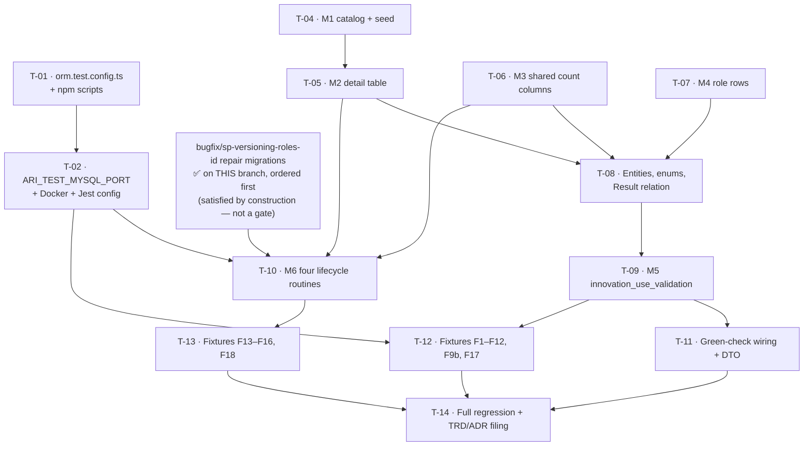

# Tasks — Results (Innovation Use) / Data Model, Catalog & Green Check

- **Module:** results (`innovation-use`)
- **Spec id:** 2026-08-innovation-use-data-model
- **Status:** in-progress — T-01, T-02, T-04 … **T-11** `[x]`; **T-12 `[~]` ESCALATED** and **T-13 `[~]` ESCALATED** (both 2026-08-18) — 11 of 13 done. ⚠️ **Two rulings pending:** T-12 (F12 — fix-the-harness vs fix-the-spec) and T-13 (scope boundary — the cold-run race is unfixable inside T-13's two files). **Review-round budget is spent (5 of 4–5); the next rework round in either task is over budget.** T-14 is blocked on both. FP-23 retired; FP-16, FP-40, FP-42 discharged; FP-39 half-discharged; **FP-31 NOT discharged**
- **Owner:** David Felipe Casañas Hernández
- **Linked requirements:** [`./requirements.md`](./requirements.md)
- **Linked design:** [`./design.md`](./design.md)
- **Routine authority:** [`./routine-transcript.md`](./routine-transcript.md) revision 2 — **M6 is written from it, not from prose** (DD-12)
- **Parent spec:** [`../family.md`](../family.md) — chunk 1 of 3
- **Depends on:** [`../../archive/2026-08-18-bugfix--sp-versioning-roles-id/`](../../archive/2026-08-18-bugfix--sp-versioning-roles-id/) — **satisfied by construction; NOT a task gate.** *(Corrected 2026-08-18 — residual site of correction item 1, missed by that pass's own sweep, KZ-005. This formerly read "ARCHIVED but NOT MERGED … Must be merged before T-10 starts.")* Both repair migrations are committed on **this** branch (`9392c010`, `4dd884f6`) at timestamps ordered **before** every Innovation Use migration, so any migration run applies the repair first and M6 inherits the repaired body automatically. The bugfix cannot merge separately — it is part of this development, on this branch. **What survives is a ROLLOUT check, not a task gate:** `SHOW CREATE PROCEDURE SP_versioning` against the *target* database must show no `roles_id` before M6 runs there (its DevOps hand-off is unsent and its §7 sign-off open). Declared here 2026-08-18 by that spec's T-03 (`design.md` §6 "Coupling"); carried in `../family.md`'s children table, which is already corrected
- **Last updated:** 2026-08-18 — T-01 and T-02 closed `[x]` as verified no-ops by `/akili-execute` (Reviewer PASS; evidence in [`./execution.md`](./execution.md)). Prior same-day edit: T-01/T-02/T-10 superseded/corrected/notified, dependency declared — see notes inline; by `bugfix/sp-versioning-roles-id` T-03

---

## 0. Read this before starting

| Rule | Why |
| --- | --- |
| **Nothing SQL runs until T-01 and T-02 land.** | The repo has **no** working scratch-schema mechanism. `migration:dev:execute` / `migration:revert` hardcode the `orm.config.ts` export, which is bound to **`CORE`** — the shared, non-disposable database. Running them "to check" is the disaster RB-2 / RB-9 / FR-3 exist to prevent. |
| **`SP_versioning` is broken in `main` — but repaired on THIS branch.** | The repair ships as two migrations from the **external** [`bugfix/sp-versioning-roles-id`](../../archive/2026-08-18-bugfix--sp-versioning-roles-id/) spec, both **already committed on this branch** and ordered before every Innovation Use migration. *(Corrected 2026-08-18 — residual site of correction item 1, KZ-005; this formerly read "which **must merge before T-10**", a gate that never existed.)* So on this branch `CALL SP_versioning` is executable and versioning fixtures assert rather than error. **Against `main`, or any database the repair has not yet reached, it still raises MySQL 1054 for every indicator** — which is why the rollout pre-flight below is a real check. **T-10 must transcribe the REPAIRED body** (`1784300000000`), never `main`'s. |
| **Never claim a routine set from memory.** | Re-run transcript §0 step 1 (call-site grep) at implementation time. Three review rounds got this wrong by naming routines instead of finding them. |
| **Line numbers drift.** | The transcript's absolute lines were true on 2026-08-14. Re-verify before editing; the stable anchors are *"after the `result_innovation_dev` block"*, not the numbers. |
| **Migrations are append-only** (ADR-5). | Never edit a merged migration. `git status` after every `npm run lint` — the script carries `--fix` and mutates files. |

**Budget tripwire** (`design.md` §12): **13 tasks · ~2,600 LOC · 4–5 review rounds** *(revised after M0 was extracted to [`../../archive/2026-08-18-bugfix--sp-versioning-roles-id/`](../../archive/2026-08-18-bugfix--sp-versioning-roles-id/) — that spec carries the remaining ~2,750 LOC *(corrected 2026-08-18 — that spec's T-02 Pivot added a mandatory second migration after this figure was written, growing its own budget from ~2,050 to ~2,750; found by the backward sweep in that spec's 2026-08-18 validation-remediation pass)*).* If actuals exceed this — especially if any routine needs *restructuring* rather than the six transcript §6 edits — **stop and escalate**; do not continue.

---

## 1. Dependency graph

**No cycles.** T-04, T-06, T-07 are mutually independent and may run in parallel *within the server package only* (root guide §4.3 forbids two concurrent tasks in one package — treat this as ordering freedom, not a fan-out licence).

---

## 2. Task list

### T-01 — Create the TEST-bound datasource module and its npm scripts

- **Requirements covered:** R-IU-009 (AC.4), and the precondition for DC-1/DC-2/DC-3/DC-10/DC-12
- **Design references:** §6.5.1 pieces 1 and 3; RB-9
- **Size:** S · **Dependencies:** none · **Status:** ~~todo~~ → ~~superseded — verify only~~ → **`[x]` DONE 2026-08-18** — verified as a no-op, zero diff, Reviewer PASS. Evidence: [`./execution.md`](./execution.md) → *T-01*
- **Skills:** `nestjs-expert`

> **Superseded, 2026-08-18.** `bugfix/sp-versioning-roles-id`'s own T-01 (`src/db/config/mysql/orm.test.config.ts`, the `TEST`-bound npm scripts) is `[x]` **done** — Reviewer PASS 2026-08-14, falsifying sentinel demonstrated. Per T-03 below's own rule ("shared with `innovation-use/data-model-and-catalog` T-01/T-02 … whichever lands first builds them"), the external spec landed first. **Do not build a second TEST datasource module.** Verify the existing one resolves to `dataSourceTarget.TEST` and close this task as a no-op.

**Scope**
- New `src/db/config/mysql/orm.test.config.ts` exporting a `DataSource` built from `getDataSource(dataSourceTarget.TEST, true)`.
- New npm scripts (e.g. `migration:test:execute`, `migration:test:revert`) passing `-d ./src/db/config/mysql/orm.test.config.ts`.

**Implementation notes**
- `orm.config.ts:71-73` exports **one** instance bound to `CORE` at module load. TypeORM's `-d` imports that exact instance and cannot re-invoke `getDataSource` with `TEST`. A sibling module is the only route.
- ⚠️ **`orm-connection-test.module.ts` is a decoy** — despite the name it binds to `CORE` (`:10`). Do not treat it as this piece.
- Do not modify `orm.config.ts`'s existing export; other code depends on it.

**Verification**
- `npx ts-node -e "import('./src/db/config/mysql/orm.test.config').then(m => console.log(m.dataSource.options))"` prints host/database resolved from `ARI_TEST_MYSQL_*`.
- **Falsifying input:** point `ARI_TEST_MYSQL_HOST` at a sentinel value; if the printed options show the `ARI_MYSQL_*` host instead, the module is still `CORE`-bound and the task **fails**.
- **Disqualifier:** a module that merely *compiles* proves nothing. If the options cannot be printed and read, the check is **inconclusive, not passed**.

**Done**
- [x] `orm.test.config.ts` resolves to `dataSourceTarget.TEST`, demonstrated by the sentinel above
- [x] New scripts exist and reference only the test config
- [x] `orm.config.ts` and `orm-connection-test.module.ts` are unmodified

---

### T-02 — Provision the disposable MySQL, the TEST port var, and the fixture Jest config

- **Requirements covered:** R-IU-009 (AC.1, AC.4); A-4
- **Design references:** §6.5.1 pieces 2, 4, 5
- **Size:** M · **Dependencies:** T-01 · **Status:** ~~todo~~ → ~~superseded — verify only~~ → **`[x]` DONE 2026-08-18** — verified as a no-op, zero diff, Reviewer PASS; M1–M6 clause delegated to T-04 … T-10. Evidence: [`./execution.md`](./execution.md) → *T-02*
- **Skills:** `nestjs-expert`

> **Superseded, 2026-08-18.** `bugfix/sp-versioning-roles-id`'s own T-01 (`ARI_TEST_MYSQL_PORT`, Docker MySQL, the dedicated Jest config for the fixture directory) is `[x]` **done**, and its T-01b (the baseline snapshot this task's original scope below did not anticipate — see the corrected bullet immediately below) is also `[x]` **done**, both Reviewer PASS 2026-08-14. The external spec landed first — do not provision a second Docker/Jest harness. Verify the existing one and close this task as a no-op.

**Scope**
- Add `ARI_TEST_MYSQL_PORT` (read by T-01's module) and document it in `.env.example`.
- Docker MySQL (utf8mb4 / `utf8mb4_unicode_520_ci`) for the scratch schema.
- Dedicated Jest config covering `test/fixtures/innovation-use/`.
- ~~Run the **full** migration suite against the scratch schema and record the outcome.~~ → **Corrected 2026-08-18 (T-03 of `bugfix/sp-versioning-roles-id`).** The "run the full migration suite from empty" premise is false: RB-1d (that spec's `requirements.md`) proved the 303-migration history is **not replayable from empty** — two independent blockers surface in the first 139 of 303. The scratch schema is built instead by loading a committed **schema-only snapshot** (`bugfix/sp-versioning-roles-id` T-01b, `design.md` §4.1/DD-5) that already records all 303 migrations as applied; only migrations genuinely new since the snapshot's date — this chunk's own M1–M6 — actually run, and that is what this step verifies and records.

**Implementation notes**
- `orm.config.ts:46` uses `DB_PORT` for **both** targets — there is currently no way to address a MySQL on a non-default port (round 3, T8).
- Fixtures sit outside Jest's `rootDir: "src"` / `testRegex` (`package.json:122-123`), so the default runner will not collect them.
- ~~The suite must be the **full** one~~ → **Corrected 2026-08-18 (T-03 of `bugfix/sp-versioning-roles-id`), same reasoning as the scope bullet above: the full-migration-suite premise is false (RB-1d).** These objects are real, unchanged dependencies, but they arrive via the T-01b snapshot, not a from-empty replay: `innovation_use_validation` depends on `results`, `result_actors`, `clarisa_actor_types`, `valid_text()`; F12/F16 additionally need `result_innovation_dev`, `result_impact_outcomes`, `result_strategic_objectives`, `clarisa_innovation_readiness_levels`.

**Verification**
- The new Jest config collects a trivial smoke fixture that opens a connection and runs `SELECT 1`.
- **Falsifying input:** stop the Docker container and re-run — the smoke fixture must **fail loudly**, not skip. A config that reports success with no database reachable is the KZ-001 failure mode.
- **Disqualifier:** if the container cannot be provisioned, record **inconclusive** in the execution note and escalate. Do **not** proceed to any SQL task; every downstream gate is unrunnable.

**Done**
- [x] `ARI_TEST_MYSQL_PORT` is read by T-01's module and documented
- [x] ~~Full migration suite applies **and reverts** cleanly on the scratch schema~~ → **Corrected 2026-08-18 (T-03 of `bugfix/sp-versioning-roles-id`), same reasoning as the scope bullet above: unachievable as written** — restate as *the snapshot loads, `migration:test:execute` reports zero pending migrations, and only this chunk's own M1–M6 apply and revert cleanly on top of it* (`bugfix/sp-versioning-roles-id` `design.md` §4.1/DD-5; that spec's own T-01 retired the identical criterion as never-achievable, RB-1d) **· Closed 2026-08-18 for the verifiable half only** (snapshot loads; `migration:test:execute` reports `No migrations are pending`). The **M1–M6 apply-and-revert clause is delegated to T-04 … T-10**, whose own scratch-schema gates and R-IU-009 AC.1 discharge it — M1–M6 do not exist at T-02 time, and holding this `[~]` would deadlock `T-02 → T-10 → M-migrations → T-02`. Ruling + Reviewer concurrence: `execution.md` → *Decision: T-02's M1–M6 clause is delegated downstream*.
- [x] The smoke fixture passes with the container up and **fails** with it down
- [x] Execution note records the outcome verbatim, including any inconclusive result

---

### T-03 — ~~M0: repair `SP_versioning`~~ · **EXTRACTED — now an external dependency**

> **Removed from this spec on the user's ruling of 2026-08-14.** The `SP_versioning` repair is a pre-existing, cross-indicator production defect that this chunk merely discovered, so it ships on its own schedule rather than waiting on an Innovation Use feature spec.
>
> **It now lives at [`../../archive/2026-08-18-bugfix--sp-versioning-roles-id/`](../../archive/2026-08-18-bugfix--sp-versioning-roles-id/)** — **5** tasks, ~2,750 LOC *(corrected 2026-08-18 from "3 tasks, ~2,050 LOC" — that spec grew by two tasks and ~700 LOC across its T-01 and T-02 Pivots after this note was written; found by the backward sweep in that spec's 2026-08-18 validation-remediation pass)*, red-before-green regression fixture (formerly F19).
>
> **This chunk `Depends on` it.** T-10 (M6) reproduces `SP_versioning`'s body and **must inherit the repaired one**; T-13's fixtures need the repaired procedure present in the schema they run against.
>
> **Before starting T-10 — CORRECTED 2026-08-18.** The former instruction read *"verify the bugfix is merged"*. **That gate was mis-worded and is now satisfied by construction.** Both repair migrations are committed on this branch (`9392c010`, `4dd884f6`) at timestamps `1784250000000` / `1784300000000` — **ordered before every Innovation Use migration** — so any migration run applies the repair first and M6 inherits the repaired body automatically. The bugfix spec cannot be "merged" separately: it is part of this development, on this branch, and lands with it.
>
> **What survives, and is not about merging:** (a) T-10 must reproduce the **repaired** body — read `SP_versioning` from `1784300000000`, never from the older `1783029013035`; (b) at rollout, `SHOW CREATE PROCEDURE SP_versioning` against the target database must contain no `roles_id` — a DevOps verification that the database is where we believe, not a task gate.
>
> `requirements.md` R-IU-012 and `design.md` DD-13 / M0 are retained as the **record of the discovery and the routing decision**; the work itself is no longer this spec's.
>
> The harness tasks **T-01 and T-02 are shared** with that spec. Whichever lands first builds them; the other verifies and moves on.

> **Recorded 2026-08-18 by `bugfix/sp-versioning-roles-id` T-03.** Both migrations that carry the former M0's work are `[x]` done on branch and Reviewer-passed: `repairSpVersioningObjectiveBlocks` (that spec's T-02) and its required companion `repairSpDeleteResultVersionObjectiveTables` (T-02b, R-SPV-002/RB-5). The harness tasks landed there too (T-01, T-01b) — see T-01/T-02 above, now marked superseded-verify-only. **This closes the routing/extraction record.** The migrations exist on branch `AC-1679-Create-the-innovation-use-section` and have not yet run against the shared dev DB — which is a **rollout** fact, not a blocker: see the corrected note two paragraphs above.

---

### T-04 — M1: catalog table `clarisa_innovation_use_levels` + the ten canonical rows

- **Requirements covered:** R-IU-002 (AC.1–AC.5); NFR-IU-003; D-1, D-7
- **Design references:** §3.2, §5 (M1), DD-2
- **Size:** S · **Dependencies:** none · **Status:** ~~todo~~ → **`[x]` DONE 2026-08-18** — PASS on attempt 1; 3 parallel lens Reviewers all PASS. Evidence: [`./execution.md`](./execution.md) → *T-04*
- **Skills:** `nestjs-expert` + **`tdd`** (Leader addition — forces spec-before-migration so the seed gate cannot be tautological)

**Scope** — table mirroring `clarisa_innovation_readiness_levels` (`id` PK **not** auto-increment, `level`, `name`, `definition`, `AuditableEntity` columns), seeded in-migration with R-IU-002's ten rows. Plus a seed spec.

**Implementation notes**
- **`id = level + 1`.** Seed both columns explicitly; never let `id` imply the scale point.
- `name` repeats in pairs — do **not** add a unique constraint.
- No `additional_guidance` column (always-null noise).
- Seeding in-migration deliberately breaks local precedent (DD-2): the readiness catalog's rows were never migration-inserted, which is why it is unreconstructable today.

**Verification** — `npm test -- --silent` for the seed spec; migration applied on the scratch schema.
- **Falsifying input:** alter one seeded `definition` by a character — the verbatim-comparison spec must fail. If it still passes, the spec is comparing something weaker than the text and does not gate DC-8.
- **Disqualifier:** a row-count-only assertion is a presence-assertion; it cannot prove content (R-IU-002 AC.2).

**Done**
- [x] Exactly ten rows, ids 1–10, levels 0–9, no duplicate `level`, **no ids 13–20**
- [x] Every `name` and `definition` matches R-IU-002 verbatim
- [x] `clarisa_innovation_readiness_levels` row count and contents unchanged (AC.5)
- [x] ~~Re-running the suite **from empty**~~ → **verified under the adjudicated reading, 2026-08-18:** *fresh scratch container → `baseline:test:load` → `migration:test:execute` → identical ten rows* (verified twice). The literal "from empty" premise is **false and known false** — TRD **ADR-12** / RB-1d: the migration history is not replayable from an empty database. Same premise already corrected in T-02, `design.md` §6.5.1 piece 4 and `requirements.md` §4.3; it survived here in a different phrasing (**KZ-005**). **R-IU-002 AC.4 and its Scenario carry the same false premise and still need the two-direction correction sweep — raised for a user ruling in [`./execution.md`](./execution.md), deliberately not absorbed into T-04.**

---

### T-05 — M2: detail table `result_innovation_use`

- **Requirements covered:** R-IU-001 (AC.1, AC.4); NFR-IU-002
- **Design references:** §3.1, §5 (M2)
- **Size:** S · **Dependencies:** T-04 (FK target) · **Status:** ~~todo~~ → **`[x]` DONE 2026-08-18** — PASS attempt 1; 2 parallel lens Reviewers both PASS. Evidence: [`./execution.md`](./execution.md) → *T-05*
- **Skills:** `nestjs-expert` + **`tdd`** (Leader addition)

**Scope** — table with `result_id` as **both PK and FK** to `results`, `innovation_use_level_id` (bigint, nullable, FK to the catalog), `innovation_use_level_explanation` (text, nullable), `AuditableEntity` columns.

**Implementation notes** — `result_id` as PK is what makes R-IU-001's "no two active rows" constraint structural rather than application-enforced. Mirror `result_innovation_dev`. `down()` drops FKs before the table.

**Verification** — migration applies and reverts on the scratch schema.
- **Falsifying input:** attempt a second insert for the same `result_id` — it must raise a duplicate-key error. If it succeeds, the PK is wrong and R-IU-001's negative clause is unenforced.
- **Disqualifier:** verifying only that the table exists proves nothing about the constraint.

**Done**
- [x] Table exists with `result_id` as PK; both FKs resolvable
- [x] Duplicate active row is **structurally impossible** (demonstrated)
- [x] `is_active` defaults to `1`, `deleted_at` to `NULL`
- [x] `down()` reverts cleanly

---

### T-06 — M3: six additive count columns on the two shared tables

- **Requirements covered:** R-IU-003 (AC.1, AC.2), R-IU-004 (AC.1, AC.2), R-IU-009 (AC.2)
- **Design references:** §3.3, §3.4, §5 (M3), DD-6, DD-7
- **Size:** S · **Dependencies:** none · **Status:** done
- **Skills:** `nestjs-expert`

**Scope** — `result_actors`: `women_youth_count`, `women_not_youth_count`, `men_youth_count`, `men_not_youth_count`, `actors_count`. `result_institution_types`: `organization_count`. All `int`, **nullable**.

**Implementation notes**
- `int`, not `bigint` — counts never approach 2.1 B (DD-6).
- The four existing **booleans stay untouched**; Innovation Dev keeps reading and writing them.
- `down()` drops the six **new** columns only — never a pre-existing one.
- No `NOT NULL`, no `MODIFY COLUMN`, no default other than `NULL`.

**Verification** — apply + revert on the scratch schema with pre-existing `result_actors` rows present.
- **Falsifying input:** seed a row before the migration; after it, that row's booleans must be identical and the six new columns `NULL`. Any change means the migration is not additive.
- **Disqualifier:** running against an empty table cannot detect a destructive migration — the check requires pre-existing rows to be meaningful.

**Done**
- [x] Six columns exist, nullable, accepting `0`
- [x] Pre-existing rows unchanged: same count, same boolean values, new columns `NULL`
- [x] `down()` drops only the six new columns
- [x] No total column added for disaggregated mode (R-IU-003 AC.4)

---

### T-07 — M4: three role-discriminator rows

- **Requirements covered:** R-IU-005 (**AC.2, and the row half of AC.3**)
  > *Corrected 2026-08-18: formerly claimed the whole **AC.1–AC.3** range. AC.1 is enum-level ("each **enum** gains exactly one member") and no migration can satisfy it — **T-08** owns it, and did so. T-07 seeds the catalog rows (AC.2) and satisfies AC.3's row half, supplied by the Scenario's "must NOT renumber or reuse any existing role **id**". Confirmed independently by both T-07 review lenses; T-07 shipped without touching an enum.*
- **Design references:** §3.6, §5 (M4)
- **Size:** S · **Dependencies:** none · **Status:** done
- **Skills:** `nestjs-expert`

**Scope** — one `INNOVATION_USE` row each in `actor_roles`, `institution_type_roles`, `quantification_roles`, each taking the next free id. Plus the role-row assertion spec (`design.md` §10).

**Implementation notes** — `quantification_roles` already holds `ACTUAL_COUNT = 1`, `EXTRAPOLATE_ESTIMATES = 2`; the other two hold only `INNOVATION_DEV = 1`. **Renumbering an existing id is forbidden** — existing rows reference them by value. `down()` deletes by id.

**Verification** — `npm test -- --silent` for the assertion spec.
- **Falsifying input:** change a seeded id to collide with an existing role — the spec must fail on the "previously unused id" assertion.
- **Disqualifier:** asserting only that three rows were added does not prove no existing id moved (AC.3).

**Done**
- [x] Each catalog gains exactly one active row, with a previously unused id
- [x] No existing role id renumbered or reused
- [x] Spec asserts the added rows **and** the stability of existing ones

---

### T-08 — Entities, enums, and the `Result` inverse relation

- **Requirements covered:** R-IU-001 (**AC.2 only**), R-IU-003 (AC.1, mode invariant), R-IU-004, R-IU-005 (AC.1); NFR-IU-002; DC-7
  > *Corrected 2026-08-18: formerly claimed **AC.3** as well. AC.3 is the detail-row round trip — `design.md` §10 places it in the **Integration** layer on the §6.5 harness, the traceability matrix routes it to **T-12**, and a unit metadata spec cannot populate audit columns from an acting user. Confirmed independently by both T-08 review lenses.*
- **Design references:** §2.1, §3.1–§3.4, §3.3's mode-invariant table
- **Size:** M · **Dependencies:** T-05, T-06, T-07 · **Status:** done
- **Skills:** `nestjs-expert`

**Scope**
- New `ResultInnovationUse` and `ClarisaInnovationUseLevel` entities.
- `+5` / `+1` count columns on the two shared entities; `INNOVATION_USE` members in the three role enums.
- `Result` gains the inverse `@OneToMany`, matching `result_innovation_dev` (`result.entity.ts:316-320`).
- Entity-metadata spec (column presence, nullability, defaults, `int` vs `bigint`).

**Implementation notes**
- **Document the mode invariant as a comment on the count columns** (RB-5 layer 1) — no DB constraint enforces it; layer 2 is T-09's function, layer 3 is chunk 2's API edge.
- **No `@OpenSearchProperty` decoration** — DD-8 makes detail-field indexing a non-goal, and entity decoration is inert for the results index anyway (§7).

**Verification** — `npx tsc --noEmit` and `npm test -- --silent`.
- **Falsifying input:** declare `actors_count` as `bigint` in the entity — the metadata spec must fail (DC-7). If it passes, the spec is not reading types.
- **Disqualifier:** `tsc` clean proves compilation, not that entity metadata matches the migration.

**Done**
- [x] Both new entities registered in the datasource; `tsc` clean
- [x] Metadata spec asserts type, nullability, and default for all six count columns
- [x] Mode invariant documented on the columns
- [x] Three enums each gain exactly one member; no existing value changed
- [x] No OpenSearch decoration added

---

### T-09 — M5: the `innovation_use_validation` stored function

- **Requirements covered:** R-IU-006 (AC.1–AC.11), R-IU-003 (mode invariant, layer 2), R-IU-009 (AC.3); NFR-IU-001; DC-2, DC-3, DC-10
- **Design references:** §6.4 (six steps), DD-3, DD-4, DD-10, DD-11
- **Size:** L · **Dependencies:** T-08 · **Status:** done
- **Skills:** `nestjs-expert`, `systematic-debugging`

**Scope** — `innovation_use_validation(result_code BIGINT) RETURNS tinyint(1)`, `READS SQL DATA`, per `design.md` §6.4's six steps.

**Implementation notes — four traps, all previously paid for**
1. **Never compare the FK.** Join `clarisa_innovation_use_levels ON id = innovation_use_level_id` and test `level >= 6`. `innovation_use_level_id >= 6` is off by one (id 6 is level 5) — DC-10, DD-3.
2. **Filter by role** (`actor_role_id = INNOVATION_USE`) even though `innovation_dev_validation` does not — DD-4.
3. **Do not copy the dead branch.** `actor_type_id` is `NOT NULL`, so `ELSE actor_type_id IS NOT NULL` is unreachable. Use `IF(actor_type_id = 5, valid_text(actor_type_custom_name), TRUE)` — DD-10.
4. **Guard the empty set unconditionally.** Steps 3–4 are per-row and vacuously true over zero rows. Innovation Dev's `tempActors > 0` is **conditional** (nested in `IF(anticipatedUserId = 1 OR …)`); Innovation Use adopts it **unconditionally** — a deliberate divergence, DD-11.

`DROP`/`CREATE` names **only** `innovation_use_validation` (R-IU-009 AC.3). Reuse `valid_text()`; add no new helper.

**Verification** — the function compiles and is callable on the scratch schema; behavioral proof is T-12.
- **Falsifying input:** the level-5/level-6 pair (F3/F4). If both return the same value, the join-vs-FK trap has been hit.
- **Disqualifier:** a `toContain('innovation_use_validation')` assertion is a **presence-assertion** and proves nothing about the returned boolean (§4.1, KZ-001). It may not be offered as evidence for any AC here.

**Done**
- [x] Function exists and is callable after migration
- [x] The level test reads the catalog's `level` through a join, never the FK
- [x] Role filter present; dead branch not copied; zero-actor guard unconditional
- [x] No other `*_validation` function touched
- [x] Behavioral ACs explicitly deferred to T-12 — **not** claimed here

---

### T-10 — M6: amend all four lifecycle routines

- **Requirements covered:** **R-IU-011 (AC.1–AC.9)**; R-IU-009 (AC.1); DC-12
- **Design references:** §6.7; **transcript §6** (the authoritative edit set); DD-9, DD-12
- **Size:** L · **Dependencies:** **the two `sp-versioning-roles-id` repair migrations present and ordered before M6 — SATISFIED BY CONSTRUCTION** (same branch; verified 2026-08-18), T-05, T-06 · **Status:** ~~todo~~ → **`[x]` DONE 2026-08-18** — PASS on attempt 1; **3 parallel lens Reviewers all PASS**; zero rework rounds. Apply→revert→re-apply verified twice (Implementer + independent Leader run) against a live scratch MySQL. Evidence: [`./execution.md`](./execution.md) → *T-10*
- **Skills:** `nestjs-expert`, `systematic-debugging`

> **The single highest-risk task in the chunk.** Four routines, all six indicators, on an append-only migration. **Ships as its own PR.**

**Scope** — one migration performing `DROP` + `CREATE` on `SP_versioning`, `SP_delete_result_version`, `full_delete_result_version`, and `delete_result`, applying **exactly** transcript §6's six edits.

**Implementation notes**
- **Re-derive the routine set first** (transcript §0 step 1) and confirm it is still four. **Re-verify every line number** — they drift with any migration added above.
- **Inherit the repaired body, not `main`'s:** transcribe `SP_versioning` from `1784300000000-RepairSpVersioningObjectiveBlocks.ts`, **never** from the older `1783029013035`. `main`'s body still names `roles_id` and is non-executable; this branch's is repaired. (The former wording asked to "confirm the bugfix spec is merged" — corrected 2026-08-18, see the note under T-03.)
- **`down()` must be written, not copied.** `SP_delete_result_version`'s historical `down()` is a bare `DROP` with no recreation (`1778510205765:337`) — following that pattern would leave the routine missing.
- **Forbidden** (each already cost a review round):
  - a `result_quantifications` copy block — it is **already copied** (`:297`); adding one duplicates rows on every version bump for every indicator;
  - delete/update statements for `result_actors` / `result_institution_types` — already removed wholesale by row;
  - harmonizing the two hard-delete routines (transcript §4.1) or closing `delete_result`'s six gaps (§5.1).

**Verification** — apply + revert on the scratch schema; behavioral proof is T-13.
- **Falsifying input:** diff each post-M6 body against its pre-M6 body. Anything beyond the six edits — including a stray whitespace-only reformat of another block — **fails** AC.8.
- **Disqualifier:** "the migration ran without error" proves the SQL parses, not that data survives. A routine can be syntactically perfect and silently drop a column; that is the entire DC-12 class. Do not report this task green on a clean apply alone.

**Done**
- [x] Routine set re-derived by call site and confirmed as four — 8 non-spec call sites, four routines; re-derived independently by the Implementer **and** by Lens A
- [x] Exactly six edits applied; body diffs reviewed statement by statement — deltas +37/+4/+4/+6 lines reconcile exactly against 5+5+1+1+25 / 4 / 4 / 6, leaving no room for an unshown hunk; all four "removed" lines are comma-gains, verified individually
- [x] No `result_quantifications` block added; **the divergences that remain pre-M6** intact — `SIGNAL` vs `RETURN FALSE` (§4.1) and `delete_result`'s six soft-delete gaps (§5.1) (AC.8, AC.9) *(amended 2026-08-18: the §4.1 table-enumeration divergence was closed by the bugfix's T-02b and must NOT be restored)*
- [x] `down()` restores all four prior bodies exactly (AC.7) — byte-identical to source including trailing-whitespace quirks; **and confirmed live: the post-revert query returned FOUR rows, not three**, so `SP_delete_result_version`'s historical bare-`DROP` pattern was not copied
- [x] Applies and reverts cleanly on the scratch schema — **adjudicated DISCHARGED by Lens A** (the Leader did not self-certify): `has_riu` 1→0→1 across apply/revert/re-apply is a closed three-state cycle only M6 can produce, since `baseline.sql` contains zero occurrences of `result_innovation_use`. **Closes FP-2 / R-IU-009 AC.1 for M6 — the last of M1–M6**
- [x] Behavioral ACs deferred to T-13 — **not** claimed here. **DC-12 is discharged structurally only; F16 remains the sole gate on a positional swap** (FP-31)

> **✅ RESOLVED 2026-08-18 — actioned by the spec-correction pass; AC.8/AC.9 and the row above are now restated. Original notice retained as the record.**
>
> **Inbound notice — filed 2026-08-18 by `bugfix/sp-versioning-roles-id` T-03. Not edited here; chunk 1 restates its own AC when it next runs T-10.** That spec's T-02b (`[x]` done, Reviewer PASS 2026-08-14) added two `DELETE` statements to `SP_delete_result_version` for `result_impact_outcomes` / `result_strategic_objectives`, closing the transcript §4.1 hard-delete table-enumeration divergence with `full_delete_result_version`. **One of the "two pre-existing divergences" this Done item and R-IU-011 AC.8 require to survive intact no longer exists pre-M6** — only the `SIGNAL` vs `RETURN FALSE` divergence (transcript §4.1) and `delete_result`'s six soft-delete gaps (transcript §5.1) remain. Amending AC.8/AC.9 against the post-T-02b routine bodies is chunk 1's own gate, to be done before this task runs — this notice raises it, it does not silently edit it.

---

### T-11 — Green-check assembly, `ip_rights` inclusion, and the DTO

- **Requirements covered:** R-IU-007 (AC.1–AC.4); DC-5, DC-6, DC-9; RB-10
- **Design references:** §6.1, §6.2, §6.3, DD-5
- **Size:** S · **Dependencies:** T-09 · **Status:** ~~todo~~ → **`[x]` DONE 2026-08-18** — PASS on attempt 1; single Reviewer, full 4R sweep; zero rework rounds. Evidence: [`./execution.md`](./execution.md) → *T-11*
- **Skills:** `nestjs-expert`, `api-design-principles`

**Scope** — `case IndicatorsEnum.INNOVATION_USE` in `calculateGreenChecks`; add `INNOVATION_USE` to the `ip_rights` inclusion array; optional `innovation_use?: boolean` on `FindGreenChecksDto`; unit specs.

**Implementation notes**
- **Do not modify `completenessValidation`** (DD-5). It already ANDs every non-visual-only key; adding the key gates submission for free, and touching it puts all six indicators in the blast radius.
- **Do not add `innovation_use` to `VISUAL_ONLY_GREEN_CHECKS`** — that would silently make the section non-blocking (R-IU-007 AC.3).
- **Known consequence (RB-10):** including `ip_rights` makes every Innovation Use result unsubmittable until IP Rights is filled. Intended, product-confirmed, fixtured as F10 — **do not "fix" it**.
- The submit message names no section; that is a recorded limitation delegated to the sidebar (§6.3), not a defect to solve here.

**Verification** — `npm test -- --silent`.
- **Falsifying input:** remove the `INNOVATION_USE` case — the per-indicator key-set spec must fail for indicator 6 while indicators 1/2/4/5 still pass. If nothing fails, the spec is not asserting the key set.
- **Disqualifier:** a spec that mocks `DataSource.query` proves assembly only. It cannot speak to whether the function returns the right boolean — that is T-12's job, and this task may not claim it.

**Done**
- [x] Indicator-6 key set = six common keys + `innovation_use` + `ip_rights` — asserted by a **two-sided exact-set** spec (sorted `toEqual`), which fails on a dropped fragment *and* on an unintended extra one
- [x] Indicators 1, 2, 4, 5 key sets **unchanged** — proven **structurally**, not assumed: the new `case` sits between `INNOVATION_DEV`'s `break` and `case OICR`, and every pre-existing case terminates with `break`, so no fall-through path was created. Falsifying input confirmed it: with the case deleted, only indicator 6 went red
- [x] `innovation_use` absent from `VISUAL_ONLY_GREEN_CHECKS` — Set literal has **zero diff**; proven twice (direct read + repo-wide grep). Gated by a **new** spec that uses **no test double at all**, so it is structurally immune to KZ-001
- [x] `completenessValidation` throws when `innovation_use` is false, passes when all true — with the method itself unmodified. Unmodified proven twice: absent from `git diff --name-only`, **and** zero `innovation_use` hits in `function-handler.service.ts` (a DD-5-violating key-specific branch would necessarily have produced one)

---

### T-12 — Validation-function fixtures F1–F12, F9b, F17

- **Requirements covered:** R-IU-006 (AC.2–AC.11), R-IU-001 (AC.3), R-IU-003 (mode exclusivity), R-IU-007 (via F10); DC-2, DC-3, DC-10
- **Design references:** §6.5 fixture table, §6.6
- **Size:** L · **Dependencies:** T-09, T-02 · **Status:** ~~todo~~ → **`[~]` IN PROGRESS / ESCALATED 2026-08-18** — attempt 1: **Lens B PASS, Lens C PASS, Lens A FAIL** on F12 only (body-text assertion where AC.9 specifies a behavioral comparison). **14 of 15 fixtures accepted.** Rework NOT spawned: this FAIL is the pre-declared budget escalation (review rounds at the 4–5 ceiling). **Awaiting a user ruling on path (a) fix-the-harness vs (b) fix-the-spec** — see [`./execution.md`](./execution.md) → *T-12*
- **Skills:** `nestjs-expert`, `tdd`

**Scope** — the fixtures under `test/fixtures/innovation-use/` that exercise `innovation_use_validation` on real MySQL: F1–F8, **F9, F9b**, F10, F11, F12, F17, plus the R-IU-001 detail-row round trip.

**Implementation notes**
- **F3/F4 are the discriminating pair for DC-10** — level 5 → `1`, level 6 → `0`. Neither alone catches the off-by-one.
- **F9b is mandatory** (round 3, T4): AC.10's *disaggregated* half was previously added as a criterion with no gate. F9 covers aggregate mode only.
- **F7 from the previous revision is deleted** — `actor_type_id` is `NOT NULL`, so an actor row with a null type cannot be seeded. F8 (`actor_type_id = 5` with blank custom name) is the only reachable failure branch.
- F12 compares `innovation_dev_validation` before/after M1–M5. It is a **stored-function** comparison and **does not** cover the routines — that is F16, in T-13.

**Verification** — the dedicated fixture script from T-02.
- **Falsifying input:** for each fixture, mutate the function to the defect it targets and confirm the fixture goes red. A fixture never observed failing has not been shown to discriminate.
- **Disqualifier:** if the disposable MySQL is unavailable, report **inconclusive** and escalate. A run that exits `0` having skipped every fixture is **not** a pass, and DC-2/DC-3/DC-10 remain unguarded (A-4).

**Done**
- [ ] All listed fixtures pass, each observed red against its target defect
- [ ] F3 → `1` and F4 → `0` (the off-by-one pair)
- [ ] F9 **and** F9b both present, covering AC.10's two halves
- [ ] Zero-actor result returns `0` (F17, AC.11)
- [ ] Execution note records the environment outcome verbatim

---

### T-13 — Lifecycle fixtures F13–F16, F18

- **Requirements covered:** **R-IU-011 (AC.1–AC.6)**; DC-12
- **Design references:** §6.5 fixture table, §6.7's blast-radius note
- **Size:** L · **Dependencies:** T-10 (and its external bugfix dependency) · **Status:** ~~todo~~ → ~~`[~]` ESCALATED~~ → **`[x]` DONE 2026-08-18** — PASS on attempt 3 of 3 (2 rework rounds; review rounds 6-8). All five Done items met. **FP-31 DISCHARGED** — F16 now detects positional swaps, proven by 3 live SELECT-list transpositions including `women_youth ↔ men_youth`. 12 mutations observed red in total. Cold-run race closed structurally by `globalSetup`. ⚠️ **FP-47 is a trap for T-12** — see [`./execution.md`](./execution.md) → *T-13*
- **Skills:** `nestjs-expert`, `tdd`

**Scope** — fixtures that **execute** the routines: F13 versioning · F14 `SP_delete_result_version` · F15 `full_delete_result_version` · **F18 `delete_result`** · F16 the Innovation Dev regression gate across all four.

**Implementation notes**
- **F18 asserts deactivation, not deletion** — `is_active = FALSE` with `deleted_at` set. A hard-delete assertion here would pass for the wrong reason and hide the active-orphan class.
- **F16 is the only routine regression gate.** F12 does not serve this purpose (round 2, R7). Compare every copied column and every surviving row, before vs after the `sp-versioning-roles-id` fix + M6.
- F13 must assert **all six** new columns plus level id and explanation — a fixture checking only the detail row would miss the count-column half of AC.2.

**Verification** — the dedicated fixture script from T-02.
- **Falsifying input:** remove one of transcript §6's six edits and re-run. The corresponding fixture must go red. If every fixture still passes with an edit missing, the fixtures do not gate DC-12 and the task is not done.
- **Disqualifier:** these fixtures require the repair migrations **applied** to the schema under test — without them `CALL SP_versioning` raises MySQL 1054. On the scratch schema this is automatic (they are ordered first in the migration sequence); confirm it rather than assume it. An error is **not** a failure verdict on M6; distinguish the two in the execution note or the result is uninterpretable.

**Done**
- [ ] F13 asserts level id, explanation, four disaggregated counts, `actors_count`, `organization_count` on the new version
- [ ] F14, F15 leave no orphan; **F18 leaves the row inactive with `deleted_at` set**
- [ ] F16 shows Innovation Dev byte-identical across all four routines
- [ ] Each fixture observed red with its corresponding edit removed
- [ ] Execution note distinguishes *errored* from *failed*

---

### T-14 — Full-suite regression, coverage, and TRD/ADR filing

- **Requirements covered:** R-IU-008 (AC.1–AC.4), R-IU-009 (AC.4); NFR-IU-001, NFR-IU-004; D-6, RB-6
- **Design references:** §10, §11 (ADR-11 + ADR-6 amendment), §13
- **Size:** M · **Dependencies:** T-11, T-12, T-13 · **Status:** todo
- **Skills:** `nestjs-expert`, `cognitive-doc-design`

**Scope**
- Full server suite + coverage.
- File **ADR-11** (green checks as stored routines, with the four-routine standing checklist **and its call-site method**) and the **ADR-6 amendment** (mapping source is the DTO, not the entity) into `docs/trd/trd.md` §2.4.
- Update `family.md` chunk 1 `Status`; record the rollout note.

**Implementation notes**
- **The suite must be FULL, never targeted** (KZ-003) — shared tables changed, so a targeted run is not evidence.
- ADR-11's checklist must open with **how to build the checklist** (enumerate by call site). Every previous revision of that checklist carried a wrong routine count, and it is the artifact chunks 2 and 3 inherit.
- Re-check `git status` after `npm run lint -- --quiet` — the script carries `--fix` and mutates files.

**Verification** — `npm test -- --silent`, `npm run test:cov`, `npm run lint -- --quiet`.
- **Falsifying input:** revert one Innovation Dev spec's expectation — the full suite must fail. A suite that passes regardless is not gating R-IU-008.
- **Disqualifier:** a timing taken for NFR-IU-001 **while any delegated agent is running is not a measurement** (root guide §4.3) — measure in a quiet window or report inconclusive. And no AC may be closed by editing an existing Innovation Dev spec's expectations (R-IU-008 AC.2).

**Done**
- [ ] Full suite green; every Innovation Dev spec passes **unmodified**
- [ ] Coverage ≥ 60%, not regressed
- [ ] `npm run lint -- --quiet` clean and `git status` re-checked
- [ ] ADR-11 and the ADR-6 amendment filed in the TRD
- [ ] `family.md` chunk 1 status updated; rollout note recorded

---

## 3. Requirement → task coverage

**Closure is at scenario and clause granularity, not requirement ID.** Every `BUT it must NOT` and `AND IT MUST` clause below is owned by a named task.

| Requirement | ACs | Scenarios & negative clauses | Tasks |
| --- | --- | --- | --- |
| R-IU-001 | AC.1–AC.4 | *detail record persists* · BUT NOT two active rows → **T-05** (PK) · AND IT MUST reject an off-catalog level id → **T-05** (FK) · AC.3 round trip → **T-12** | T-05, T-08, T-12 |
| R-IU-002 | AC.1–AC.5 | *reproducible and exact* · BUT NOT ids 13–20 · AND IT MUST NOT be inserted outside a migration · AND IT MUST NOT modify readiness levels | T-04 |
| R-IU-003 | AC.1–AC.4 | *counts coexist* · BUT NOT alter/drop/repurpose → **T-06** · AND IT MUST NOT add a disaggregated total → **T-06** · *modes exclusive* · BUT NOT populate both modes → **T-09** (F9/F9b) · AND IT MUST allow mode switching without schema change → **T-06** (all nullable) | T-06, T-08, T-09, T-12 |
| R-IU-004 | AC.1–AC.3 | *additive only* · BUT NOT `NOT NULL` | T-06, T-08 |
| R-IU-005 | AC.1–AC.3 | *discriminators are additive* · BUT NOT renumber or reuse an id | T-07, T-08 |
| R-IU-006 | AC.1–AC.11 | *conditional explanation* · BUT NOT require at level ≤ 5 → **F3** · AND IT MUST NOT use `level_id >= 6` → **F3/F4** · AND IT MUST treat whitespace as empty → **F5/F6** · *role isolation* · BUT NOT change Innovation Dev counting → **F11/F12** | T-09, T-12 |
| R-IU-007 | AC.1–AC.4 | *submission blocked* · BUT NOT change other indicators' gating → **T-11** · AND IT MUST NOT enter `VISUAL_ONLY_GREEN_CHECKS` → **T-11** · "message names sections pending" → recorded limitation, `design.md` §6.3 | T-11, T-12 (F10) |
| R-IU-008 | AC.1–AC.4 | *blast radius stays clean* · BUT NOT a targeted suite · AND IT MUST NOT be made green by editing Innovation Dev specs | T-14 |
| R-IU-009 | AC.1–AC.4 | *bad deploy recoverable* · BUT NOT drop/alter another function → **T-09** · AND IT MUST NOT run against the shared DB → **T-01, T-02** | T-01…T-07, T-09, T-10, T-14 |
| **R-IU-011** | AC.1–AC.9 | *versioned result keeps data* · BUT NOT alter existing copies → **F16** · AND IT MUST NOT add a quantifications block → **T-10** (AC.8) · AND IT MUST be proven by execution → **F13** · *delete leaves nothing* · BUT NOT touch other versions → **F14/F15** · *soft delete deactivates* · BUT NOT leave the row active → **F18** · AND IT MUST NOT hard-delete → **F18** | T-10, T-13 |
| ~~R-IU-012~~ | — | **Extracted** — owned by [`../../archive/2026-08-18-bugfix--sp-versioning-roles-id/`](../../archive/2026-08-18-bugfix--sp-versioning-roles-id/) as R-SPV-001, including the red-before-green regression test | *external* |
| NFR-IU-001 | — | latency; disqualifier: no measurement while an agent runs | T-09, T-14 |
| NFR-IU-002 | — | auditability | T-05, T-08 |
| NFR-IU-003 | — | reproducible vocabulary | T-04 |
| NFR-IU-004 | — | coverage floor; known limit: says nothing about DC-2/3/10/12/13 | T-14 |

*(R-IU-010 withdrawn — DD-8. No task.)*

---

## 4. LOC estimate and PR strategy

| PR | Tasks | ~LOC | Why it is its own PR |
| --- | --- | --- | --- |
| — | *(was PR 0: M0 + F19)* | — | **Extracted** to [`../../archive/2026-08-18-bugfix--sp-versioning-roles-id/`](../../archive/2026-08-18-bugfix--sp-versioning-roles-id/) — ships first, on its own schedule |
| **PR 1** | T-01, T-02 | ~130 | Infrastructure. Nothing else can be verified until it merges |
| **PR 2** | T-04 … T-08 | ~430 | Additive schema + entities. One review pass over four small migrations |
| **PR 3** | T-09, T-11, T-12 | ~740 | The validation function and its behavioral gate, together — the function is unreviewable without its fixtures |
| **PR 4** | T-10, T-13 | **~3,250** | **M6. Four routines, six indicators, append-only.** Never combine with anything else |
| **PR 5** | T-14 | ~50 | Regression evidence + TRD filing |

**Total ≈ 2,600 LOC** — for this chunk, plus ~2,750 in the extracted bugfix spec *(corrected 2026-08-18 from "~2,110"; that spec's T-02 Pivot grew its own budget after this figure was written; found by the backward sweep in that spec's 2026-08-18 validation-remediation pass)*. PR 4 (M6) is ~3,250 of the combined figure — almost entirely `DROP`/`CREATE` body text, over half existing only because `down()` reproduces prior bodies.

PR descriptions follow `cognitive-doc-design` review-empathy rules: state what to review first (for PR 4: the **body diffs**, not the file), what is out of scope (both pre-existing divergences), and link previous/next PR.

---

## 5. Risks & blockers log

| # | Date | Risk / Blocker | Mitigation | Owner | Status |
| --- | --- | --- | --- | --- | --- |
| RB-A | 2026-08-14 | **`SP_versioning` non-executable in `main`** — blocks every versioning gate | **Extracted** to `bugfix/sp-versioning-roles-id` per the user ruling of 2026-08-14. This chunk `Depends on` it. *(Corrected 2026-08-18 — residual site of correction item 1, KZ-005; formerly "verify merged before T-10".)* **Satisfied by construction** — both repair migrations are on this branch, ordered first; T-10 transcribes the repaired body. Residual risk is **rollout only**: `SHOW CREATE PROCEDURE SP_versioning` on the target DB | — | routed — tracked in that spec; task gate retired |
| RB-B | 2026-08-14 | No scratch-schema mechanism exists; two prior revisions asserted one that did not work | T-01 + T-02, verified by sentinel and by a smoke fixture that must fail when the DB is down. **Corrected 2026-08-18 (T-03 of `bugfix/sp-versioning-roles-id`): this mitigation covers only the datasource/port/Docker/Jest-config piece.** It does not close the gap RB-B2 records | — | mitigated (datasource/harness piece only — see RB-B2) |
| **RB-B2** | 2026-08-18 | **The scratch schema still could not be *built*, even with T-01/T-02 fully done** — the migration history is not replayable from empty (RB-1d in `bugfix/sp-versioning-roles-id/requirements.md`): an empty container fails at migration #139 of 303. RB-B's own mitigation column never named this gap. Filed by `bugfix/sp-versioning-roles-id` T-03, whose own T-01 pivoted mid-execution to add a T-01b for exactly this reason | Closed **externally** by `bugfix/sp-versioning-roles-id` T-01b (`[x]` done, Reviewer PASS 2026-08-14) — a committed schema-only **snapshot** (`design.md` §4.1/DD-5), not a replay. This chunk inherits it as-is; no task here builds a second baseline artifact | — | closed (external) |
| RB-C | 2026-08-14 | Routine set was wrong in three consecutive review rounds | Call-site enumeration re-run at T-10; transcript §0 records the method | — | mitigated |
| RB-D | 2026-08-14 | If no disposable MySQL is reachable, DC-2/3/10/12/13 are all ungated | Report **inconclusive**, never pass; recorded as accepted blind spot (A-4) | — | open |

---

## 6. Done definition

- [ ] All T-01 … T-14 are `done` (T-03 extracted — verify instead that both `sp-versioning-roles-id` repair migrations are present and ordered before M6)
- [ ] Every AC in R-IU-001 … R-IU-009 and **R-IU-011** is checked (**R-IU-012 is closed by the extracted bugfix spec**), and every scenario clause in §3 is owned and satisfied
- [ ] Coverage ≥ 60%; full suite green with Innovation Dev specs unmodified
- [ ] No endpoint added (chunk 1 exposes none) — Swagger unchanged **by design**
- [ ] ADR-11 + ADR-6 amendment filed in the TRD
- [ ] `family.md` chunk 1 marked `done`; chunk 2 unblocked
- [ ] Rollout note recorded: **bugfix merged first**, then migration order M1 → M6, backout order reversed, DevOps informed
