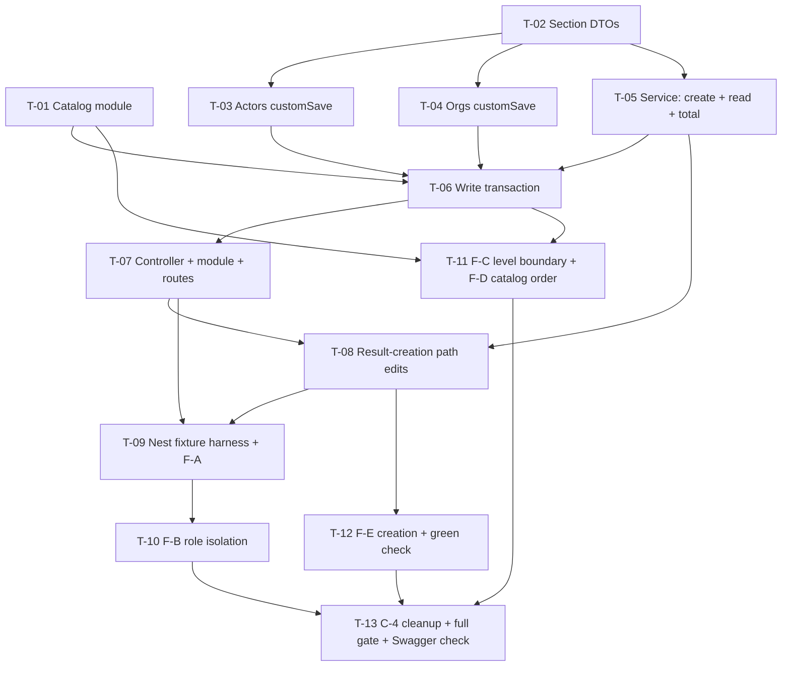

# Tasks — Results (Innovation Use) / Details API

- **Module:** results (`innovation-use`)
- **Spec id:** 2026-08-innovation-use-details-api
- **Status:** not-started
- **Owner:** David Felipe Casañas Hernández
- **Linked requirements:** [`./requirements.md`](./requirements.md)
- **Linked design:** [`./design.md`](./design.md)
- **Parent spec:** [`../family.md`](../family.md) — chunk 2 of 3
- **Last updated:** 2026-08-19

---

## 0. Read this first

**Three traps will silently produce a green run over broken work.** They are restated per task, but a worker who internalises them here will not hit them:

| # | Trap | Consequence if missed |
| --- | --- | --- |
| 1 | **No global `ValidationPipe`.** It is applied per handler. The reference `result-innovation-dev` controller applies none | Every `@IsInt()` / `@Min(0)` on the DTO is inert. Validation "works" in review and does nothing in production (DD-8) |
| 2 | **`id ≠ level`.** `clarisa_innovation_use_levels.id = level + 1` | Any rule written `innovation_use_level_id >= 6` demands the justification a full level early, and passes a naive test (family D-1) |
| 3 | **A fixture named `*.spec.ts` under `test/fixtures/` is collected by nothing.** `test/jest-fixtures.json` matches only `*.fixture-spec.ts`; `npm test`'s `rootDir` is `src` | A zero-test run that reports success (server guide §9) |

**Global disqualifiers — an outcome that trips any of these is *inconclusive*, never a pass:**

- A `test:fixtures` run reporting **0 collected tests**.
- A fixture run against an unbootstrapped or half-migrated scratch schema. `migration:test:bootstrap` is **not idempotent** (FP-49); recovery is `compose:test:down` → `compose:test:up` → `migration:test:bootstrap`.
- `npm run lint` reported as read-only. The script carries `--fix` and **mutates files** — re-check `git status` after.
- Any claim of "unchanged" backed by a hand-enumerated column list rather than a whole-row `SELECT *` diff (ADR-11).

**Budget tripwire** (`design.md` §12): **13 tasks · ~2,400 LOC · 6–8 review rounds.** Exceeding any one is an escalation to the user, not a reason to keep going.

---

## 1. Dependency graph

**No cycles.** T-01 and T-02 are the only two with no predecessor and may run in parallel. Everything else is serial by data dependency.

---

## 2. Task list

### T-01 — Innovation Use level catalog module

- **Requirements covered:** R-IUA-010 (all ACs + its scenario), R-IUA-013 AC.1, AC.5
- **Depends on:** none
- **Size:** S (~120 LOC) · **Effort:** `medium`
- **Skills:** `nestjs-expert`, `api-design-principles`

**Files touched**

- `src/domain/tools/clarisa/entities/clarisa-innovation-use-levels/clarisa-innovation-use-levels.service.ts` *(new)*
- `…/clarisa-innovation-use-levels.controller.ts` *(new)*
- `…/clarisa-innovation-use-levels.module.ts` *(new)*
- `…/clarisa-innovation-use-levels.service.spec.ts`, `….controller.spec.ts` *(new)*
- `src/domain/tools/clarisa/routes/clarisa.routes.ts` *(modified)*

**Scope**

Mirror `clarisa-innovation-readiness-levels/` exactly — `ControlListBaseService` subclass, `BaseController` subclass, three-line module — with **one override**: `findAll()` adds `order: { level: 'ASC' }` (DD-6). Register at `innovation-use-levels` in `clarisaRoutes`. The entity already exists (chunk 1).

**Implementation notes**

- Expose **no** name-based lookup. `findByName` on the base is a `LIKE %name%` match and catalog names repeat in pairs across adjacent levels.
- `BaseController`'s handlers are inherited, so `@ApiOperation` goes on the subclass, not on an override.

**Done criteria**

- [ ] `GET /api/v1/tools/clarisa/innovation-use-levels` returns ten rows in a `ServerResponseDto`, each carrying `id`, `level`, `name`, `definition` *(R-IUA-010 AC.1, AC.2)*
- [ ] Rows come back with `level` ascending `0 … 9` *(AC.3)*
- [ ] The service's `findAll()` passes an explicit `order` clause — asserted in the unit spec against the mocked repository's received options object *(AC.4, and the scenario's `AND IT MUST carry an explicit order clause a code reader can point at`)*
- [ ] The endpoint renders under the `Clarisa` Swagger tag with the bearer lock *(AC.5)*
- [ ] `grep` over the two new source files returns **zero** `findByName` / `findByNames` call sites *(AC.6, and the scenario's `BUT it must NOT resolve a level by name`)*
- [ ] `npm test -- --silent` green

**Verification & its limits**

`npm test -- --silent`. **Falsifying input:** delete the `order` override → the unit spec asserting the options object fails.

> **Declared insufficient (scenario clause `BUT it must NOT achieve that order by inheriting default primary-key ordering`):** an end-to-end assertion that the returned sequence is `0…9` **cannot** falsify a missing order clause, because `id = level + 1` makes PK order coincidentally correct on the current seed. That is why the gate is the unit spec on the clause, and why this task must **record in its report** that the ordering guarantee rests on a code-level assertion, not a behavioral one. See T-11's F-D.

---

### T-02 — Section DTOs

- **Requirements covered:** R-IUA-004 AC.1, AC.2, AC.3, AC.4, AC.6, AC.7 · R-IUA-007 AC.2 · R-IUA-008 AC.5 · R-IUA-013 AC.3 (partial)
- **Depends on:** none
- **Size:** M (~180 LOC) · **Effort:** `medium`
- **Skills:** `nestjs-expert`, `api-design-principles`, `error-handling-patterns`

**Files touched**

- `src/domain/entities/result-innovation-use/dto/create-result-innovation-use.dto.ts` *(new)*
- `…/dto/update-result-innovation-use.dto.ts` *(new — `PartialType`, mirroring the reference)*

**Scope**

`CreateResultInnovationUseDto` with nested `InnovationUseActorDto`, `InnovationUseOrganizationDto`, `InnovationUseQuantificationDto`. `class-validator` + `@ApiProperty` on every field. A custom class-validator constraint enforcing **actor mode exclusivity** per row.

**Implementation notes**

- Counts: `@IsInt()` + `@Min(0)` + `@IsOptional()`. `@IsInt` is what rejects a fractional value — `@IsNumber()` would accept `2.5`.
- Nested arrays need `@ValidateNested({ each: true })` + `@Type(() => …)`, or the nested rules never run.
- **`total` is not declared on the DTO at all.** `whitelist: true` then strips a client-sent one (R-IUA-004 AC.5).
- Mode exclusivity is a **per-row cross-field** rule with no DB dependency → a custom constraint here, so class-validator emits the nested index path and the offending row is identifiable.
- `actor_type_id` is `@IsNotEmpty()` — required (AC.6).
- `actor_type_id === 5` (OTHER) with blank `actor_type_custom_name` → rejected (AC.7). Use `@ValidateIf`.
- Do **not** add a whole-array duplicate rule here — that is T-06's, because it must run before any write and needs the same identity rule the service uses.

**Done criteria**

- [ ] Negative and fractional values in any of the five count fields and in `organization_count` and `quantification_number` are rejected *(R-IUA-004 AC.1/AC.2, R-IUA-007 AC.2, R-IUA-008 AC.5)*
- [ ] `sex_age_disaggregation_not_apply = true` **plus** any of the four disaggregated counts → rejected *(R-IUA-004 AC.3)*
- [ ] `sex_age_disaggregation_not_apply` false/absent **plus** `actors_count` → rejected *(AC.4)*
- [ ] A row missing `actor_type_id` → rejected *(AC.6)*
- [ ] `actor_type_id = 5` with a whitespace-only custom name → rejected *(AC.7)*
- [ ] A row in disaggregated mode with all four counts absent is **accepted** *(AC.8 — draft-save)*
- [ ] `organization_count` absent is **accepted** *(R-IUA-007 AC.5)*
- [ ] Every field carries `@ApiProperty` *(feeds R-IUA-013 AC.3)*

**Verification & its limits**

Exercised by T-07's behavioral pipe spec, not by this task alone.

> **This task's output is unverifiable in isolation, and that is stated rather than hidden.** A DTO's decorators do nothing until a handler runs a pipe over them, and this repo has **no global `ValidationPipe`**. Do not write a spec here asserting that `@Min(0)` is present on a property — that is a presence-assertion that proves the decorator exists and **nothing about whether any rule ever executes**. The behavioral gate is T-07.

---

### T-03 — `ResultActorsService.customSaveInnovationUse`

- **Requirements covered:** R-IUA-009 AC.1, AC.4 (actors) · R-IUA-003 AC.3, AC.6 (actors) · R-IUA-004 write-side normalisation
- **Depends on:** T-02
- **Size:** M (~200 LOC incl. spec) · **Effort:** `xhigh` — this is one of the three deactivate predicates
- **Skills:** `nestjs-expert`, `tdd`

**Files touched**

- `src/domain/entities/result-actors/result-actors.service.ts` *(modified — additive method)*
- `src/domain/entities/result-actors/result-actors.service.spec.ts` *(extended)*

**Scope**

Add `customSaveInnovationUse(resultId, data, manager)`, modelled on `customSaveInnovationDev` (`result-actors.service.ts:88-152`) with role `ActorRolesEnum.INNOVATION_USE` and the five `int` count columns instead of the four booleans.

**Implementation notes**

- **`actor_role_id: INNOVATION_USE` must appear in the `find` where-clause, the saved row, and — above all — the deactivating `update` predicate.** Dropping it from the third is the spec's highest-severity defect.
- **Mode normalisation:** write the non-selected side as explicit `NULL`. A user switching a saved row from disaggregated to aggregate must not leave four stale counts for `innovation_use_validation` to read.
- Reuse the reference's `OTHER` rule verbatim: `actor_type_custom_name` kept only when `actor_type_id == ClarisaActorTypesEnum.OTHER`, else `null`.
- Reuse its `constructWhereClause` shape, role-swapped.
- The four legacy booleans are **never written**. Innovation Dev owns them.
- Do not touch `customSaveInnovationDev`, `saveInnovationDev`, or `formatData`.

**Done criteria**

- [ ] The deactivate `update` predicate contains `actor_role_id: ActorRolesEnum.INNOVATION_USE` — asserted against the mock's received arguments *(R-IUA-009 AC.4)*
- [ ] Rows are soft-deleted (`is_active: false`), never removed *(R-IUA-003 scenario: `AND IT MUST NOT hard-delete B`)*
- [ ] Aggregate mode writes `actors_count` and `NULL`s the four disaggregated columns; disaggregated mode does the inverse
- [ ] Audit fields come from `CurrentUserUtil` on both insert and update paths *(R-IUA-003 AC.6)*
- [ ] `customSaveInnovationDev` and `saveInnovationDev` are byte-identical to `HEAD` — `git diff` on the file shows additions only
- [ ] `npm test -- --silent` green, including the pre-existing Innovation Dev cases

**Verification & its limits**

`npm test -- --silent`. **Falsifying input:** remove `actor_role_id` from the deactivate predicate → the argument assertion fails.

> **Declared insufficient:** the repository is mocked, so this proves the *predicate object is constructed*, not that MySQL leaves Innovation Dev rows alone. The behavioral proof is **T-10 (F-B)**, and R-IUA-009's scenario says so explicitly: `AND IT MUST be proven by a fixture that seeds both roles on one result, not by a unit spec over a mocked repository`.

---

### T-04 — `ResultInstitutionTypesService.customSaveInnovationUse`

- **Requirements covered:** R-IUA-007 AC.1, AC.3, AC.4, AC.5 · R-IUA-009 AC.2, AC.4 (organizations)
- **Depends on:** T-02
- **Size:** M (~180 LOC incl. spec) · **Effort:** `xhigh`
- **Skills:** `nestjs-expert`, `tdd`

**Files touched**

- `src/domain/entities/result-institution-types/result-institution-types.service.ts` *(modified — additive)*
- `…/result-institution-types.service.spec.ts` *(extended)*

**Scope**

Add `customSaveInnovationUse(resultId, data, manager)` modelled on `customSaveInnovationDev` (`:115-135`) and its five private helpers, role `InstitutionTypeRoleEnum.INNOVATION_USE`, carrying `organization_count` through `buildUpdateData` and `buildDataTemplate`.

**Implementation notes**

- Same three-place role rule as T-03: find, save, and the deactivating `update`.
- Reuse `removeDuplicates`' key strategy (`other_` / `sub_` / `type_` / `institution_`) unchanged — it is role-agnostic.
- The private helpers currently hardcode `INNOVATION_DEV`. Parameterise the role rather than duplicating five methods, **and re-run the Innovation Dev specs** — parameterising a shared private helper is where an "additive" change stops being additive.

**Done criteria**

- [ ] An organization row saves with `organization_count` and reads back identically *(R-IUA-007 AC.1)*
- [ ] Removing a row soft-deletes exactly that row *(AC.3)*
- [ ] The deactivate predicate names `institution_type_role_id: INNOVATION_USE` *(R-IUA-009 AC.2, AC.4)*
- [ ] A row without `organization_count` saves *(AC.5)*
- [ ] Every pre-existing Innovation Dev spec in this file still passes **unmodified** — if any assertion had to change, that is a behavior change and an escalation, not a fix *(R-IUA-007 AC.4)*
- [ ] `npm test -- --silent` green

**Verification & its limits**

As T-03 — mocked repositories. Behavioral proof is T-10.

---

### T-05 — `ResultInnovationUseService`: `create`, read assembly, total derivation

- **Requirements covered:** R-IUA-002 (all ACs + scenario) · R-IUA-004 AC.5 · R-IUA-001 (the `create` helper) · R-IUA-008 AC.1, AC.3, AC.4 (read side)
- **Depends on:** T-02
- **Size:** M (~330 LOC incl. spec) · **Effort:** `medium`
- **Skills:** `nestjs-expert`, `tdd`

**Files touched**

- `src/domain/entities/result-innovation-use/result-innovation-use.service.ts` *(new — read half)*
- `…/result-innovation-use.service.spec.ts` *(new)*

**Scope**

`create(resultId, manager?)` mirroring the reference's. `findOne(resultId)` assembling the section: detail row + catalog join + the three role-filtered collections + per-row derived `total`.

**Implementation notes**

- `create` = `selectManager(...).save({ result_id, audit(NEW) })`. Nothing else.
- Read the three collections through the existing `BaseServiceSimple.find(resultId, <role>)` and `ResultQuantificationsService.findByResultIdAndRoles(resultId, [INNOVATION_USE])`.
- Join the catalog to expose `innovation_use_level` (the scalar `level`), per DD-9. Do **not** return the whole catalog object.
- **Total derivation** (`design.md` §5.5): aggregate mode → `actors_count`; disaggregated → sum of the four, treating `NULL` as absent; **all four `NULL` → `null`, not `0`**. Zero would claim the user entered a total of nought.
- Collections are `[]` when empty, never `null`.

**Done criteria**

- [ ] Response is a `ServerResponseDto` with the section under `data` *(R-IUA-002 AC.1)*
- [ ] Each collection is filtered by its role discriminator — asserted against the arguments each child service received *(AC.2, AC.3, AC.4, R-IUA-008 AC.3, and the scenario's `BUT it must NOT return any … row belonging to another role discriminator`)*
- [ ] Each actor row carries a server-computed `total` *(AC.5)*
- [ ] A result with a detail row and no children returns `[]` for all three collections and does not throw *(AC.6, and the scenario's `AND IT MUST return [] rather than null`)*
- [ ] `total` is recomputed on every read; no column stores it *(R-IUA-004 AC.5 and its scenario's `AND IT MUST recompute total on every read rather than caching it`)*
- [ ] Derivation covered in **three** cases: aggregate, disaggregated with some counts, disaggregated with all four `NULL` → `null`
- [ ] `unit` is returned verbatim with no catalog lookup *(R-IUA-008 AC.4)*
- [ ] `npm test -- --silent` green

**Verification**

`npm test -- --silent`. **Falsifying input:** make the all-`NULL` case return `0` → the third derivation case fails. **Falsifying input:** drop the role argument on any child `find` → the argument assertion fails.

*(R-IUA-002 AC.7 — `401` on an unauthenticated read — is owned by T-07, where the handler exists.)*

---

### T-06 — `ResultInnovationUseService`: write transaction + cross-field validation

- **Requirements covered:** R-IUA-003 (all ACs + both scenarios) · R-IUA-005 (all ACs + scenario) · R-IUA-006 (all ACs + scenario) · R-IUA-008 AC.1, AC.2, AC.5 · R-IUA-012 AC.2
- **Depends on:** T-01, T-03, T-04, T-05
- **Size:** L (~350 LOC incl. spec) · **Effort:** `xhigh` — transactional, ordering-sensitive, carries the off-by-one trap
- **Skills:** `nestjs-expert`, `error-handling-patterns`, `tdd`, `systematic-debugging`

**Files touched**

- `src/domain/entities/result-innovation-use/result-innovation-use.service.ts` *(extended — write half)*
- `…/result-innovation-use.service.spec.ts` *(extended)*

**Scope**

`update(resultId, dto)` implementing `design.md` §5.1 steps 2–12 exactly.

**Implementation notes**

- **Validation runs entirely before `BEGIN`.** That is what makes "a failure persists nothing" a property of ordering rather than of rollback.
- **Level resolution (trap 2):** join `clarisa_innovation_use_levels ON id = innovation_use_level_id`, read `level`, test `level >= 6`. Never compare the FK. Never resolve by name.
- No level supplied → the explanation rule does not fire (draft-save).
- **Duplicate identity:** `actor_type_id`, except for `OTHER` where identity is `(OTHER, actor_type_custom_name)`. Two `OTHER` rows with different custom names are distinct.
- Errors are `BadRequestException` with an `errors` array naming the field — never a raw `Error`.
- Pass `manager` to all three child calls, `upsertByCompositeKeys` included (DD-10).
- `UpdateDataUtil.updateLastUpdatedDate(resultId, manager)` **inside** the transaction.
- Re-read through T-05's `findOne` after commit; the response is post-save state, not the request body.
- **Add no call into `GreenChecksRepository`** (DD-7).

**Done criteria**

- [ ] A full save persists all five parts; the re-read equals what was written *(R-IUA-003 AC.1)*
- [ ] Validation failure on **any** nested row throws before `BEGIN`; no child service is invoked — asserted by the mocks recording zero calls *(AC.2, and the scenario's `BUT it must NOT leave the first actor row persisted while rejecting the second`)*
- [ ] Duplicate-actor rejection happens before any write *(R-IUA-005 AC.4, and its scenario's `BUT it must NOT deactivate the result's existing actor rows before failing`)*
- [ ] Response `data` is the post-commit re-read *(R-IUA-003 AC.4)*
- [ ] `updateLastUpdatedDate` is called with the transaction's `manager` *(AC.7)*
- [ ] Missing detail row → `NotFoundException` (`404`)
- [ ] Two non-OTHER rows sharing a type → `400` naming `actor_type_id` *(R-IUA-005 AC.1)*
- [ ] Two `OTHER` rows, **different** custom names → **accepted** *(AC.2, and the scenario's `AND IT MUST treat two OTHER rows with distinct custom names as distinct`)*
- [ ] Two `OTHER` rows, same custom name → `400` *(AC.3)*
- [ ] A saved row of type X re-sent once is not a self-duplicate *(AC.5)*
- [ ] **Level 5 (catalog `id 6`) without explanation → accepted; level 6 (catalog `id 7`) without explanation → `400`** — both cases in the same spec *(R-IUA-006 AC.1, AC.2, and the scenario's `AND IT MUST fail the pair discriminatingly`)*
- [ ] Whitespace-only and empty-string explanations at level ≥ 6 → `400` *(AC.3, AC.4)*
- [ ] No level at all → accepted *(AC.5)*
- [ ] The level is obtained through the catalog join, and `grep` over the file shows **no** comparison against `innovation_use_level_id` and **no** name-based lookup *(AC.6, and the scenario's `BUT it must NOT resolve the level by name`)*
- [ ] Every thrown error is a Nest HTTP exception *(R-IUA-003 scenario's `AND IT MUST report the rejection through GlobalExceptions … never as a raw Error`)*
- [ ] `grep` over the file returns **zero** references to `GreenChecksRepository` / `calculateGreenChecks` *(R-IUA-012 AC.2)*
- [ ] `npm test -- --silent` green

**Verification & its limits**

`npm test -- --silent`. **Falsifying input:** write the level rule as `innovation_use_level_id >= 6` → the discriminating pair inverts, both cases fail. **Falsifying input:** move validation inside the transaction → the "zero child-service calls on failure" assertion fails.

> **Declared insufficient:** with mocked repositories this proves the *call sequence*, not that MySQL rolled back. R-IUA-003 AC.3's soft-delete behavior and the level rule against real seeded catalog rows are proven by **T-09 (F-A)** and **T-11 (F-C)**.

---

### T-07 — Controller, module, route registration, `ValidationPipe`, Swagger

- **Requirements covered:** R-IUA-013 (all ACs) · R-IUA-002 AC.7 · R-IUA-003 AC.5 · R-IUA-004 AC.1–AC.8 behaviorally
- **Depends on:** T-06
- **Size:** M (~210 LOC incl. spec) · **Effort:** `medium`
- **Skills:** `nestjs-expert`, `api-design-principles`

**Files touched**

- `src/domain/entities/result-innovation-use/result-innovation-use.controller.ts` *(new)*
- `…/result-innovation-use.module.ts` *(new)*
- `…/result-innovation-use.controller.spec.ts` *(new)*
- `src/domain/routes/main.routes.ts` *(modified — one node in `ResultsChildren`)*

**Scope**

`@Get(RESULT_CODE)` / `@Patch(RESULT_CODE)` mirroring the reference controller, plus the pipe and the Swagger decorators the reference omits.

**Implementation notes**

- `@ApiTags('Results Innovation Use')`, `@ApiBearerAuth()`, `@UseInterceptors(SetUpInterceptor)` on the class; `@ApiOperation` on both handlers; `@ApiBody({ type: CreateResultInnovationUseDto })` on the PATCH.
- `@GetResultVersion()` on both. `@UseGuards(ResultStatusGuard)` on the PATCH only.
- **`@UsePipes(new ValidationPipe({ whitelist: true, transform: true }))` — and NOT `forbidNonWhitelisted`.** The three other controllers in this repo that use the pipe all pass `forbidNonWhitelisted: true`; copying them would make a body carrying `total` return `400`, contradicting R-IUA-004 AC.5, which requires it be **ignored**. `whitelist` alone strips it.
- **No `@Roles(...)`** (DD-5).
- Return `ResponseUtils.format({ description, data, status })`.
- Route node: `{ path: 'innovation-use', module: ResultInnovationUseModule }` in `ResultsChildren`.

**Done criteria**

- [ ] Both handlers return the envelope via `ResponseUtils.format` *(R-IUA-013 AC.1)*
- [ ] PATCH carries `ResultStatusGuard`; the spec covers **one allowed and one denied** result status. The denied case asserts **`400`**, the guard's actual `BadRequestException` — not `403` *(R-IUA-003 AC.5)*
- [ ] Both handlers carry `@GetResultVersion()` *(R-IUA-013 AC.4)*
- [ ] The module is registered under `results` as `innovation-use` *(AC.5)*
- [ ] **Behavioral pipe spec:** construct `new ValidationPipe({ whitelist: true, transform: true })` and call `.transform(payload, { type: 'body', metatype: CreateResultInnovationUseDto })` over every T-02 case — negative, fractional, both-modes, missing `actor_type_id`, blank OTHER name, and the two accept cases *(R-IUA-004 AC.1–AC.4, AC.6–AC.8)*
- [ ] The same pipe spec proves a payload carrying `total` is **accepted** and `total` is **absent** from the transformed object *(R-IUA-004 AC.5, and its scenario's `BUT it must NOT reject the request merely because total was present`)*
- [ ] The both-modes rejection message identifies the offending row by index *(R-IUA-004 scenario 2's `AND IT MUST apply the check per row … the message identifies the offending row`)*
- [ ] `grep` over the controller returns **zero** `@Roles` occurrences *(DD-5)*
- [ ] No `console.*` introduced *(AC.6)*
- [ ] `npm test -- --silent` green

**Verification & its limits**

`npm test -- --silent`. **Falsifying input:** remove `@UsePipes` → the behavioral pipe spec still passes (it constructs its own pipe), but the **handler-decorator assertion** fails. Both are required, and the task must state why: the pipe spec proves the *rules* work; only the decorator assertion proves the *handler runs them*.

> **No automated gate for Swagger completeness.** ESLint has no such rule and `/swagger` renders an undecorated handler without error. Deferred to **T-13**'s human check.

---

### T-08 — Result-creation path: detail row + IP Rights row

- **Requirements covered:** R-IUA-001 (all ACs + scenario) · R-IUA-011 (all ACs + scenario) · R-IUA-012 AC.3, AC.4
- **Depends on:** T-05, T-07
- **Size:** S (~90 LOC incl. spec) · **Effort:** `max` — two lines that change a method shared by all six indicators
- **Skills:** `nestjs-expert`, `tdd`

**Files touched**

- `src/domain/entities/results/results.service.ts` *(modified — one `switch` case, one array member)*
- `src/domain/entities/results/results.module.ts` *(modified — import `ResultInnovationUseModule`)*
- `src/domain/entities/results/results.service.spec.ts` *(extended)*

**Scope**

Add `case IndicatorsEnum.INNOVATION_USE: await this._resultInnovationUseService.create(resultId, manager); break;` to `createResultType`, and `IndicatorsEnum.INNOVATION_USE` to `ipAvailables`.

**Implementation notes**

- Both edits are additive. Touch no existing case and no existing array member.
- `ResultsModule` already imports `ResultInnovationDevModule`, so the import shape and circular-dependency profile are known. If a circular import appears, **escalate** — do not break it with `forwardRef` without a decision.
- **Do not** add `innovation_use` or `ip_rights` to `VISUAL_ONLY_GREEN_CHECKS`. That would make the section silently non-blocking — the exact inversion R-IUA-011's scenario forbids.

**Done criteria**

- [ ] Creating with `indicator_id = 6` calls `ResultInnovationUseService.create` exactly once with the transaction's `manager` *(R-IUA-001 AC.1)*
- [ ] Creating with `indicator_id` 1–5 calls it **zero** times *(AC.3, and the scenario's `BUT it must NOT create a row for any other indicator`)*
- [ ] The five pre-existing indicator branches invoke exactly the same services with exactly the same arguments as at `HEAD` *(AC.4)*
- [ ] Creating with `indicator_id = 6` calls `ResultIpRightsService.create` once *(R-IUA-011 AC.1)*
- [ ] Indicators 3, 4, 5 → zero IP Rights calls; indicators 1, 2 → exactly one, unchanged *(AC.2, AC.3)*
- [ ] Audit fields on the detail row come from `CurrentUserUtil`, not a hardcoded id *(R-IUA-001 AC.2, and the scenario's `AND IT MUST populate the audit columns from request.user`)*
- [ ] `grep` over `VISUAL_ONLY_GREEN_CHECKS` shows neither `innovation_use` nor `ip_rights` added *(R-IUA-012 AC.4, R-IUA-011 scenario's `BUT it must NOT make ip_rights non-blocking`)*
- [ ] `git diff src/domain/entities/results/results.service.ts` shows **exactly two** added logical lines
- [ ] Full server suite `npm test -- --silent` green — **not a targeted run** (KZ-003: this method serves every indicator)

**Verification & its limits**

Full `npm test -- --silent`. **Falsifying input:** omit the `ipAvailables` member → the IP Rights assertion for indicator 6 fails.

> **Declared insufficient:** mocked services prove the *calls are made*. That the rows actually land, and that `completness` becomes reachable, is **T-12 (F-E)**. R-IUA-001 AC.1's wording ("exactly one row exists") and R-IUA-011 AC.4/AC.5 are **not** discharged here.

---

### T-09 — Nest fixture harness + **F-A** section round trip

- **Requirements covered:** R-IUA-002 scenario (behavioral) · R-IUA-003 AC.1, AC.3, AC.6, AC.7 + scenario 2 · R-IUA-007 AC.1, AC.3 · R-IUA-008 AC.1, AC.2 · NFR-IUA-002
- **Depends on:** T-07, T-08
- **Size:** L (~370 LOC) · **Effort:** `xhigh` — a mechanism no fixture in this repo has ever built
- **Skills:** `nestjs-expert`, `systematic-debugging`

**Files touched**

- `test/fixtures/innovation-use/nest-harness.ts` *(new)*
- `test/fixtures/innovation-use/innovation-use-section-round-trip.fixture-spec.ts` *(new)*

**Scope**

A shared helper that boots a Nest `TestingModule` against the **TEST** datasource and resolves the real `ResultInnovationUseService`, plus F-A driving a real save/read cycle through it.

**Implementation notes**

- `Test.createTestingModule({ imports: [TypeOrmModule.forRoot(testDataSourceOptions), ResultInnovationUseModule] })` with `.overrideProvider(CurrentUserUtil)` and `.overrideProvider(ResultsUtil)`. `CurrentUserUtil` is `Scope.REQUEST`; `overrideProvider` is the standard answer, and `setSystemUser()` is a second escape hatch.
- **Band:** `900_000`–`900_600` are taken. **Read every sibling `*.fixture-spec.ts` header and take the next unused band** (FP-45) — do not copy a list from this document.
- **Seeding discipline:** this is a *copy* fixture → **maximally distinct sentinel values** on every column, so a positional transposition is visible (FP-48).
- Never create or tear down the four rows `global-setup.ts` owns (`STAR`, `result_status` 8, `actor_roles` 1, `institution_type_roles` 1).
- Filename **must** end `.fixture-spec.ts` (trap 3).

**Done criteria**

- [ ] **End-to-end criterion (KZ-006):** the harness boots, resolves the real `ResultInnovationUseService`, and completes **one real save against the scratch MySQL**. Per-piece checks do not satisfy this
- [ ] Save → read equality across level, explanation, two actors (one per mode), one organization with a count, one quantification *(R-IUA-003 AC.1, R-IUA-007 AC.1, R-IUA-008 AC.1)*
- [ ] **Edit** an actor row and re-save; the row's id is preserved and values change
- [ ] **Remove** actor B from a saved set A/B/C: B is `is_active = FALSE`, A and C stay active with ids intact, **B's row still exists** *(R-IUA-003 AC.3 + scenario 2's `AND IT MUST NOT hard-delete B`; R-IUA-007 AC.3; R-IUA-008 AC.2)*
- [ ] `created_by` / `updated_by` on written rows equal the stubbed acting user *(R-IUA-003 AC.6)*
- [ ] `results.last_updated_date` advances across the save *(AC.7)*
- [ ] Derived `total` on the read matches the seeded parts in both modes *(R-IUA-002 scenario)*
- [ ] `npm run test:fixtures` reports a **non-zero** collected-test count and passes from a freshly bootstrapped container *(NFR-IUA-002)*
- [ ] The report states the container state and the collected count

**Verification & its limits**

`npm run compose:test:up` → `npm run migration:test:bootstrap` (**once**) → `npm run test:fixtures`.
**Falsifying input:** drop the deactivate step in T-03 → the "removed row is inactive" assertion fails.
**Disqualifiers:** 0 collected tests; `ER_TABLE_EXISTS_ERROR` during bootstrap; a `beforeAll` that found no tables. Any of these → report **inconclusive**, not pass.

> **Escalation clause — read before improvising.** If the module graph will not boot against the TEST datasource, **stop and escalate**. Do **not** fall back to raw-SQL fixtures: that would leave DC-2 and DC-3 ungated while the suite reports green, which is the precise failure this whole verification strategy exists to prevent. T-11 and T-12 do not depend on the harness, so a harness failure does not block them.

---

### T-10 — **F-B** role isolation

- **Requirements covered:** R-IUA-009 (all ACs + scenario) · R-IUA-007 AC.4 · R-IUA-008 AC.3
- **Depends on:** T-09
- **Size:** M (~200 LOC) · **Effort:** `xhigh` — this is the spec's highest-severity risk
- **Skills:** `nestjs-expert`, `systematic-debugging`

**Files touched**

- `test/fixtures/innovation-use/innovation-use-role-isolation.fixture-spec.ts` *(new)*

**Scope**

Seed **one** result carrying both Innovation Dev and Innovation Use rows in all three shared tables, plus a **second** result with Innovation Use rows. Save the section on result 1 with empty arrays. Assert every Innovation Dev row and every result-2 row is untouched.

**Implementation notes**

- **Whole-row comparison:** `SELECT *` before and after, delete the identity column(s) from both sides, deep-compare. **Never a hand-enumerated column list** — that re-creates the exact enumerate-by-name failure ADR-11 exists to name. Reference: `innovation-dev-lifecycle-routines-unchanged.fixture-spec.ts`'s `fetchFullRow`.
- Its own band (FP-45), read from the sibling headers.
- Copy-fixture seeding discipline: maximally distinct sentinels (FP-48).

**Done criteria**

- [ ] Every Innovation Use actor row is `is_active = FALSE` after the empty-array save
- [ ] Every Innovation Dev row in `result_actors` is byte-identical, `is_active` included *(R-IUA-009 AC.1, and the scenario's assertion)*
- [ ] Same for `result_institution_types` *(AC.2, R-IUA-007 AC.4)* and `result_quantifications` roles 1 and 2 *(AC.2, R-IUA-008 AC.3)*
- [ ] No row belonging to result 2 changed *(AC.3)*
- [ ] The comparison uses a whole-row `SELECT *` diff — asserted by reading the helper, and **stated in the report**
- [ ] **Zero-finding line:** the report names all three tables *including any with no differences*, rather than reporting only where something was found (KZ-007)
- [ ] `npm run test:fixtures` non-zero collected count, green

**Verification**

As T-09. **Falsifying input:** remove `actor_role_id` from T-03's deactivate predicate → the Innovation Dev rows flip to inactive and this fixture fails. *This is the single most important falsifying input in the spec.*

> R-IUA-009's scenario clause `BUT it must NOT rely on "a result has one indicator" as the reason it is safe` is discharged **here**: the fixture seeds a state that assumption forbids, and the code must still be correct.

---

### T-11 — **F-C** level boundary + **F-D** catalog order

- **Requirements covered:** R-IUA-006 AC.1, AC.2, AC.3, AC.4 + scenario (behavioral) · R-IUA-010 AC.3
- **Depends on:** T-01, T-06
- **Size:** M (~260 LOC) · **Effort:** `xhigh` — the family's signature trap
- **Skills:** `nestjs-expert`, `systematic-debugging`

**Files touched**

- `test/fixtures/innovation-use/innovation-use-level-boundary.fixture-spec.ts` *(new)*
- `test/fixtures/innovation-use/innovation-use-catalog-order.fixture-spec.ts` *(new)*

**Scope**

F-C: the discriminating pair against the **real seeded catalog** — catalog `id 6` (level 5) without explanation must **accept**; `id 7` (level 6) without explanation must **reject**. Plus whitespace-only and empty-string at level ≥ 6.

F-D: the catalog service returns `level` `0…9` in order.

**Implementation notes**

- **Validation-fixture seeding discipline (FP-48):** use **literal domain values**, not sentinels. Several predicates compare against `TRUE` (i.e. `1`); a sentinel of `2`–`6` silently takes the false branch and the fixture passes for the wrong reason.
- F-C asserts the **pair together in one test body** so an inversion cannot be read as two unrelated failures.
- Own bands, read from sibling headers.

**Done criteria**

- [ ] `id 6` / level 5, no explanation → **accepted** *(R-IUA-006 AC.2)*
- [ ] `id 7` / level 6, no explanation → **rejected `400`** *(AC.1)*
- [ ] Both assertions live in one test body, and the test name states that inverting them is the defect being caught *(scenario's `AND IT MUST fail the pair discriminatingly`)*
- [ ] Whitespace-only and empty-string explanations at level 6 → rejected *(AC.3, AC.4)*
- [ ] F-D: the service returns `level` `0…9` ascending *(R-IUA-010 AC.3)*
- [ ] `npm run test:fixtures` non-zero collected count, green

**Verification & its limits**

As T-09. **F-C falsifying input:** compare the FK instead of `level` → the pair inverts and both assertions fail.

> **F-D is declared weak, and the task must say so in its report.** Because `id = level + 1`, default PK ordering is coincidentally correct on the current seed — **F-D would pass with T-01's `findAll()` override deleted.** No input available today makes it fail. It is kept because it would catch a future re-seed that breaks the coincidence; the real gate for R-IUA-010 AC.4 is T-01's unit spec on the `order` clause, which is itself only a presence-assertion. **Report both facts; do not present F-D green as evidence that ordering is guaranteed.**

---

### T-12 — **F-E** result creation + green-check reachability

- **Requirements covered:** R-IUA-001 AC.1, AC.2 (behavioral) · R-IUA-011 AC.1, AC.4, AC.5 + scenario · R-IUA-012 AC.1, AC.3
- **Depends on:** T-08
- **Size:** M (~200 LOC) · **Effort:** `xhigh`
- **Skills:** `nestjs-expert`, `systematic-debugging`

**Files touched**

- `test/fixtures/innovation-use/innovation-use-result-creation.fixture-spec.ts` *(new)*

**Scope**

Create an indicator-6 result; assert both child rows land. Then drive `calculateGreenChecks` and assert the `innovation_use` key is present and `completness` is reachable.

**Implementation notes**

- Does **not** need T-09's harness — it may drive `ResultsService` or assert the two rows directly after an equivalent insert path. State which was used and why.
- Assert `completness` **both ways**: `false` with IP Rights incomplete, `true` with everything complete. A one-sided assertion cannot distinguish "the gate works" from "the gate is gone".
- Own band (FP-45).

**Done criteria**

- [ ] Exactly one active `result_innovation_use` row exists after creating an indicator-6 result *(R-IUA-001 AC.1)*
- [ ] Its `created_by` matches the acting user *(AC.2)*
- [ ] Exactly one active `result_ip_rights` row exists *(R-IUA-011 AC.1)*
- [ ] Green checks for that result expose an `innovation_use` key *(R-IUA-012 AC.3)*
- [ ] The key set for an indicator-2 control result is **unchanged** *(R-IUA-011 scenario's `AND IT MUST leave the green-check key set for every other indicator identical`; R-IUA-012 AC.3's "and for no other indicator")*
- [ ] Complete everything **except** IP Rights → `completness: false` *(R-IUA-011 AC.5)*
- [ ] Complete everything **including** IP Rights → `completness: true` *(AC.4, and the scenario)*
- [ ] A green-check read issued after a section save reflects the saved data *(R-IUA-012 AC.1)*
- [ ] `npm run test:fixtures` non-zero collected count, green

**Verification**

As T-09. **Falsifying input:** omit the `ipAvailables` edit → no IP Rights row and `completness` never reaches `true`; both assertions fail.

---

### T-13 — C-4 cleanup, full gate, human Swagger check

- **Requirements covered:** R-IUA-013 AC.3, AC.7 · NFR-IUA-001 · NFR-IUA-003 · resolves **OQ-IUA-2**
- **Depends on:** T-10, T-11, T-12
- **Size:** M (~140 LOC incl. the NFR-001 fixture) · **Effort:** `high`
- **Skills:** `systematic-debugging`, `nestjs-expert`

**Files touched**

- Selected `test/fixtures/**/*.fixture-spec.ts` *(narrowly modified — see below)*
- One fixture extended for NFR-IUA-001

**Scope**

Three separate closures.

**(a) C-4 cleanup — scoped, not blanket.** The chunk-1 Kaizen logged `platformSeeded` / `innovationDevRoleSeeded` as *"structurally always false"*. **That is true of only some sites** (`design.md` §11.1). A site is dead **only** if the row it guards is one `global-setup.ts` seeds (`STAR`, `result_status` 8, `actor_roles` 1, `institution_type_roles` 1). Sites guarding a **private** platform code (`T12IUV`, `T12RT1`, `T12F10`, …) are **live** — they gate the `afterAll` `DELETE`, and removing one orphans a `reporting_platforms` row that the next run's plain `INSERT` (these are not `INSERT IGNORE`) collides with. **The cleanup would turn a green suite red on its second run.**

Method, per KZ-002 / KZ-005 / KZ-007:
1. `grep` every `*.fixture-spec.ts` for both identifiers — **the whole `test/fixtures/` tree**, not the list in `design.md` §11.1.
2. For each occurrence, **name the row it guards**.
3. Remove only those whose row `global-setup.ts` seeds, **quoting the guarded row** in the commit message — never citing "C-4" as the reason.
4. Report **one line per file, including files with zero removals**.

**(b) NFR-IUA-001.** Extend one fixture: seed 50 Innovation Use actor rows, read the section, assert the read issues no per-row query. Count queries via a TypeORM logger or `afterQuery` subscriber.

**(c) Human Swagger check** — the only gate for R-IUA-013 AC.3.

**Done criteria**

- [ ] Every occurrence of both identifiers across the whole `test/fixtures/` tree is classified dead or live, with the guarded row named *(KZ-002)*
- [ ] Only dead sites removed; each removal's commit message quotes the guarded row *(KZ-005)*
- [ ] A per-file report line exists **for every fixture file, including those with zero removals** *(KZ-007)*
- [ ] `npm run test:fixtures` run **twice in a row on the same container** — both green. A single run cannot detect the orphaned-platform regression this cleanup risks
- [ ] The section read issues ≤ 5 queries with 50 actor rows and no per-row pattern *(NFR-IUA-001)*
- [ ] **Human check, recorded verbatim in the report:** `/swagger` shows all three new handlers, each with tag, `@ApiOperation` summary, bearer lock, and — for the PATCH — the `@ApiBody` schema *(R-IUA-013 AC.3)*
- [ ] Every new entity write populates `AuditableEntity` fields from `request.user` — confirmed by the F-A and F-E assertions, restated here as the spec-level closure *(AC.7)*
- [ ] Full `npm test -- --silent` green; `npm run test:cov` ≥ **60%** on all four axes *(NFR-IUA-003)*
- [ ] `npm run lint -- --quiet` clean, **and `git status` re-checked** — the script carries `--fix`
- [ ] `git status` clean of unintended changes

**Verification & its limits**

**Falsifying input for (a):** remove a *live* `platformSeeded` guard → the second consecutive `test:fixtures` run fails on a duplicate `reporting_platforms` key. This is why the double run is mandatory.

> **R-IUA-013 AC.3 has no automated gate — this is an accepted, substituted blind spot.** ESLint has no Swagger rule, and `/swagger` renders an undecorated handler without complaint. The reference `result-innovation-dev` controller itself carries neither `@ApiOperation` nor `@ApiBody`, so "matches the neighbours" is not evidence either. The substitute is the human check above, and **it must be reported as a human observation, never as a command result.**
>
> **`npm run test:cov` ≥ 60% is not evidence for DC-2, DC-3, DC-5 or DC-7.** SQL sits outside the coverage figure (ADR-11) and the fixture suite is not counted in it. Report the number as what it is.

---

## 3. Clause-level coverage matrix

Closure is at **scenario and clause** granularity, not requirement id. Every `BUT it must NOT` and `AND IT MUST` below is owned by a named task.

| Requirement | ACs | Scenario(s) | `BUT NOT` / `AND IT MUST` clauses | Owning tasks |
| --- | --- | --- | --- | --- |
| R-IUA-001 | AC.1 T-08+T-12 · AC.2 T-08+T-12 · AC.3 T-08 · AC.4 T-08 | T-08, T-12 | `BUT NOT create for other indicator` → T-08 · `AND IT MUST populate audit from request.user` → T-08, T-12 | T-05, T-08, T-12 |
| R-IUA-002 | AC.1–AC.6 T-05 · AC.7 T-07 | T-05 + T-09 | `BUT NOT return other-role rows` → T-05 · `AND IT MUST return [] not null` → T-05 | T-05, T-07, T-09 |
| R-IUA-003 | AC.1 T-06+T-09 · AC.2 T-06 · AC.3 T-09 · AC.4 T-06 · AC.5 T-07 · AC.6 T-03/T-09 · AC.7 T-06/T-09 | S1 T-06 · S2 T-09 | `BUT NOT leave first row persisted` → T-06 · `AND IT MUST report via GlobalExceptions` → T-06 · `BUT NOT deactivate non-IU rows` → T-10 · `AND IT MUST NOT hard-delete B` → T-03, T-09 | T-03, T-06, T-07, T-09, T-10 |
| R-IUA-004 | AC.1–AC.4 T-02/T-07 · AC.5 T-05/T-07 · AC.6–AC.8 T-02/T-07 | S1 T-07 · S2 T-07 | `BUT NOT reject because total present` → T-07 · `AND IT MUST recompute on every read` → T-05 · `BUT NOT silently null one side` → T-02 · `AND IT MUST identify the offending row` → T-07 | T-02, T-03, T-05, T-07 |
| R-IUA-005 | AC.1–AC.5 T-06 | T-06 | `BUT NOT deactivate before failing` → T-06 · `AND IT MUST treat distinct OTHER names as distinct` → T-06 | T-06 |
| R-IUA-006 | AC.1–AC.6 T-06 · AC.1–AC.4 behavioral T-11 | T-11 | `BUT NOT resolve by name` → T-06 · `AND IT MUST fail the pair discriminatingly` → T-11 | T-06, T-11 |
| R-IUA-007 | AC.1 T-04/T-09 · AC.2 T-02 · AC.3 T-04/T-09 · AC.4 T-10 · AC.5 T-02/T-04 | — | — | T-02, T-04, T-09, T-10 |
| R-IUA-008 | AC.1 T-05/T-09 · AC.2 T-09 · AC.3 T-05/T-10 · AC.4 T-05 · AC.5 T-02 | — | — | T-02, T-05, T-09, T-10 |
| R-IUA-009 | AC.1–AC.3 T-10 · AC.4 T-03/T-04 | T-10 | `BUT NOT rely on one-indicator assumption` → T-10 · `AND IT MUST be proven by a fixture, not a unit spec` → T-10 | T-03, T-04, T-10 |
| R-IUA-010 | AC.1, AC.2 T-01 · AC.3 T-01/T-11 · AC.4 T-01 · AC.5 T-01/T-13 · AC.6 T-01/T-06 | T-01 + T-11 | `BUT NOT inherit default PK ordering` → T-01 (+ T-11 gap statement) · `AND IT MUST carry an explicit order clause` → T-01 | T-01, T-06, T-11, T-13 |
| R-IUA-011 | AC.1 T-08/T-12 · AC.2, AC.3 T-08 · AC.4, AC.5 T-12 | T-12 | `BUT NOT add to VISUAL_ONLY_GREEN_CHECKS` → T-08 · `AND IT MUST leave other key sets identical` → T-12 | T-08, T-12 |
| R-IUA-012 | AC.1 T-12 · AC.2 T-06 · AC.3 T-12 · AC.4 T-08 | — | — | T-06, T-08, T-12 |
| R-IUA-013 | AC.1 T-01/T-07 · AC.2 T-06 · **AC.3 T-13 (human)** · AC.4 T-07 · AC.5 T-01/T-07 · AC.6 T-07 · AC.7 T-13 | — | — | T-01, T-06, T-07, T-13 |
| NFR-IUA-001 | — | — | — | T-13 |
| NFR-IUA-002 | — | — | — | T-09 …T-12 |
| NFR-IUA-003 | — | — | — | T-13 |

**Closure statement:** 13 functional + 3 non-functional requirements · 11 scenarios · 22 `BUT`/`AND IT MUST` clauses — **all owned**. No clause is discharged by citing a different requirement. Two ACs are discharged by a **human** check (R-IUA-013 AC.3) or carry a **declared-weak** gate (R-IUA-010 AC.3 via F-D); both are named as such above and in their tasks, not counted as ordinary passes.

---

## 4. Testing expectations

| Suite | Command | When |
| --- | --- | --- |
| Unit | `npm test -- --silent` | Every task T-01…T-08, and full at T-13 |
| Fixtures | `npm run test:fixtures` | T-09…T-13, after `compose:test:up` + `migration:test:bootstrap` (**once per fresh container**) |
| Coverage | `npm run test:cov` | T-13 only |
| Lint | `npm run lint -- --quiet` | T-13 (**mutates files** — re-check `git status`) |
| E2E | — | **Not used.** `test/app.e2e-spec.ts` boots the full `AppModule` against a live DB and asserts one unauthenticated route; no authenticated e2e path exists in this repo. Specifying one would specify a gate that has never run |

A task is **not** done until: its verification command ran and is reported with its **actual output**; any harness it delivers has **one end-to-end criterion** exercised (KZ-006); and any inconclusive outcome is reported as inconclusive rather than collapsed into a pass because the process exited `0`.

---

## 5. Execution conventions

- One PR per group (`design.md` §12): **PR 1** = T-01 · **PR 2** = T-02, T-03, T-04 · **PR 3** = T-05, T-06, T-07, T-08 · **PR 4** = T-09…T-13.
- PR title: `<type>(<module>): <subject>` — e.g. `feat(result-innovation-use): add section read endpoint`.
- **PR 3's description must open with the two `results.service.ts` lines.** They are the only change in the chunk that touches a code path serving indicators other than 6, and a reviewer needs to check that claim rather than take it.
- PR descriptions follow `cognitive-doc-design` review-empathy: what to read first, what is out of scope, links to previous/next PR.
- Branch: `AC-1679-Create-the-innovation-use-section` (already in flight).
- **Never** `--no-verify`.
- **Concurrency:** one AKILI session per checkout. Never run a fixture suite while a delegated agent is active — it competes for the scratch container and the result is *wrong*, not merely slow.

---

## 6. Risks & blockers log

| # | Date | Risk / Blocker | Mitigation | Status |
| --- | --- | --- | --- | --- |
| RB-1 | 2026-08-19 | Reconciliation crosses a role discriminator | T-03/T-04 predicates + **T-10** | open |
| RB-2 | 2026-08-19 | Level rule written against the FK | T-06 grep criterion + **T-11** discriminating pair | open |
| RB-3 | 2026-08-19 | `results.service.ts` edits affect all six indicators | T-08 additive-only + full-suite run + **T-12** | open |
| RB-4 | 2026-08-19 | Nest-in-fixture harness is unprecedented here | T-09 escalation clause; T-11/T-12 independent of it | open |
| RB-5 | 2026-08-19 | Swagger has no automated gate | T-13 human check, reported as a human observation | open |
| RB-6 | 2026-08-19 | Fixture naming trap / 0 collected tests | Global disqualifier §0; per-task collected-count criterion | open |
| RB-7 | 2026-08-19 | `result_official_code` band collision | FP-45 — read sibling headers, never copy a list | open |
| RB-8 | 2026-08-19 | C-4 cleanup breaks live teardown guards | `design.md` §11.1; T-13 scoped method + **double fixture run** | open |
| RB-9 | 2026-08-19 | Existing indicator-6 results predating the deploy stay unsubmittable | `design.md` §13 — backfill is a follow-up spec, not a silent migration | open |

---

## 7. Done definition

- [ ] All 13 tasks `done`
- [ ] Every AC in `requirements.md` §14 checked — **verified by grepping the unflipped-checkbox count to zero, not inferred from "the tasks are done"** (KZ-002)
- [ ] Every scenario clause in §3 owned and discharged
- [ ] `npm test -- --silent` green · `npm run test:cov` ≥ 60% · `npm run test:fixtures` green **twice consecutively**
- [ ] `npm run lint -- --quiet` clean, `git status` re-checked after
- [ ] `/swagger` human check recorded verbatim
- [ ] No migration was added (DD-4) — `git diff --stat src/db/migrations/` is empty
- [ ] OQ-IUA-2 resolved by T-13; OQ-IUA-1 already resolved by DD-9
- [ ] Budget variance recorded against **13 tasks / ~2,400 LOC / 6–8 rounds**, and any overrun escalated rather than absorbed
