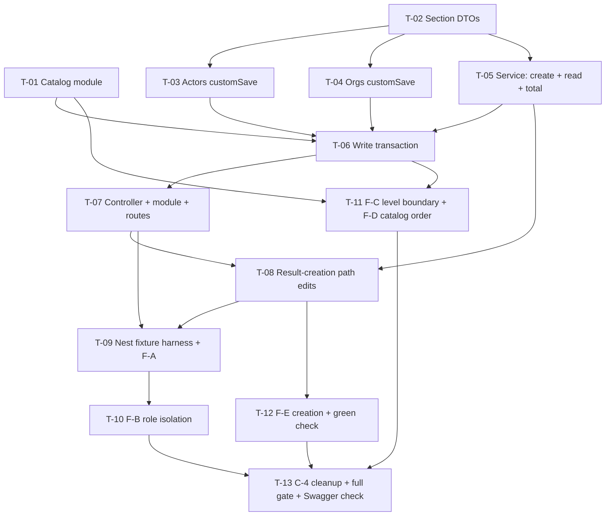

# Tasks — Results (Innovation Use) / Details API

- **Module:** results (`innovation-use`)
- **Spec id:** 2026-08-innovation-use-details-api
- **Status:** in-progress — T-01 … T-06 `[x]` done (2026-08-19; **T-01 was reopened and re-closed the same day** by the T-07 Pivot — DD-15 / trap 4, a route node without a module-graph registration). **T-07 `[x]` · T-08 `[x]` · T-09 `[x]` done** — T-09 closed on attempt 3 of 3, retiring the Nest fixture-harness risk that T-10/T-11/T-12 all reuse. **T-10 `[x]` done — with an OPEN PRODUCT DEFECT: `R-IUA-009 AC.3` is not met by the product** (cross-result row corruption, pre-existing and shared with Innovation Dev), quarantined via `it.failing` under option B; role isolation itself is proven. **Options A/D remain open.** **T-11 `[x]` done.** **T-12 `[x]` done.** **T-13 `[~]` — nine of ten criteria met; the human `/swagger` check is the sole outstanding item and requires the user.** **T-12 carries a known blocker: `indicators` is empty on the scratch schema while `results.indicator_id` is a real FK — decide seed ownership before it starts** (`execution.md` → T-09 forward pointers). Review-round budget re-baselined to ~24 on 2026-08-19 by user ruling (review depth unchanged); **24 consumed — exactly on budget**
- **Owner:** David Felipe Casañas Hernández
- **Linked requirements:** [`./requirements.md`](./requirements.md)
- **Linked design:** [`./design.md`](./design.md)
- **Parent spec:** [`../family.md`](../family.md) — chunk 2 of 3
- **Last updated:** 2026-08-19

---

## 0. Read this first

**Four traps will silently produce a green run over broken work.** They are restated per task, but a worker who internalises them here will not hit them:

| # | Trap | Consequence if missed |
| --- | --- | --- |
| 1 | **No global `ValidationPipe`.** It is applied per handler. The reference `result-innovation-dev` controller applies none | Every `@IsInt()` / `@Min(0)` on the DTO is inert. Validation "works" in review and does nothing in production (DD-8) |
| 2 | **`id ≠ level`.** `clarisa_innovation_use_levels.id = level + 1` | Any rule written `innovation_use_level_id >= 6` demands the justification a full level early, and passes a naive test (family D-1) |
| 3 | **A fixture named `*.spec.ts` under `test/fixtures/` is collected by nothing.** `test/jest-fixtures.json` matches only `*.fixture-spec.ts`; `npm test`'s `rootDir` is `src` | A zero-test run that reports success (server guide §9) |
| 4 | **A route node is NOT a registration.** `RouterModule.register()` stamps a path prefix onto a module constructor; it never instantiates the module. Every new module must ALSO be added to the module-graph file — `entities.module.ts` for entity modules, `clarisa.module.ts` for clarisa control lists | Every handler on the module returns **`404` in production** with no boot error and no warning. Mocked-provider unit specs cannot detect it, and neither can a spec asserting the shape of the `route` array. **This trap already shipped twice in this spec** — T-01 and T-07 both closed their route node without a registration (DD-15). The falsifiable assertion is over `Reflect.getMetadata('imports', <GraphModule>)` |

**Global disqualifiers — an outcome that trips any of these is *inconclusive*, never a pass:**

- A `test:fixtures` run reporting **0 collected tests**.
- A fixture run against an unbootstrapped or half-migrated scratch schema. `migration:test:bootstrap` is **not idempotent** (FP-49); recovery is `compose:test:down` → `compose:test:up` → `migration:test:bootstrap`.
- `npm run lint` reported as read-only. The script carries `--fix` and **mutates files** — re-check `git status` after.
- Any claim of "unchanged" backed by a hand-enumerated column list rather than a whole-row `SELECT *` diff (ADR-11).

**Budget tripwire** (`design.md` §12): **13 tasks · ~2,400 LOC · ~24 review rounds.** Exceeding any one is an escalation to the user, not a reason to keep going.

> **Rounds re-baselined 2026-08-19 (user ruling), from the specify-time 6–8.** Six were consumed by the first three tasks; the projection for all thirteen is 21–28. Review depth is unchanged — see `design.md` §12 and `execution.md` § *Budget Escalation*.

---

## 1. Dependency graph

**No cycles.** T-01 and T-02 are the only two with no predecessor and may run in parallel. Everything else is serial by data dependency.

---

## 2. Task list

### T-01 — Innovation Use level catalog module

- **Requirements covered:** R-IUA-010 (all ACs + its scenario), R-IUA-013 AC.1, AC.5
- **Depends on:** none
- **Size:** S (~120 LOC) · **Effort:** `medium`
- **Status:** ~~todo~~ → ~~`[~]` blocked (Pivot)~~ → ~~`[x]` DONE 2026-08-19~~ → ~~`[~]` REOPENED 2026-08-19~~ → **`[x]` DONE 2026-08-19 (re-closed)** — PASS on attempt 1 of the resumed round, T-01's third review round overall. Two lines in `clarisa.module.ts` plus a falsifiable membership assertion over `Reflect.getMetadata('imports', ClarisaModule)`; suite 334/2257. The Reviewer verified the negative path **structurally** — the leaf has exactly one incoming graph edge, so deleting the registration necessarily reddens the test. Evidence: [`./execution.md`](./execution.md) → *T-01 … (resumed after the T-07 Pivot)*. **Reopen rationale retained below for audit:** — the earlier PASS stands on everything it audited, and is **not** withdrawn as an assessment of that work; but its Done criterion 1 and R-IUA-010 AC.1 both assert that `GET /api/v1/tools/clarisa/innovation-use-levels` returns ten rows, and **it returns `404`**: `ClarisaInnovationUseLevelsModule` has a route node in `clarisa.routes.ts` and no entry in `clarisa.module.ts`, so Nest never instantiates it (**DD-15**, trap 4). Found by the Leader's two-direction sweep during T-07's review, not by any Reviewer — the defect was invisible to every gate T-01 had, because mocked-provider unit specs never boot the module graph. A `[x]` whose stated outcome is false is the one state AKILI cannot carry, hence the reopen. Remaining work is one line in `clarisa.module.ts` plus one falsifiable assertion. Prior evidence retained: [`./execution.md`](./execution.md) → *T-01* + *Pivot Record: T-01* + *T-01 — FINAL*; reopen rationale → *Pivot Record: T-07*
- **Skills:** `nestjs-expert`, `api-design-principles`

**Files touched**

- `src/domain/tools/clarisa/entities/clarisa-innovation-use-levels/clarisa-innovation-use-levels.service.ts` *(new)*
- `…/clarisa-innovation-use-levels.controller.ts` *(new)*
- `…/clarisa-innovation-use-levels.module.ts` *(new)*
- `…/clarisa-innovation-use-levels.service.spec.ts`, `….controller.spec.ts` *(new)*
- `src/domain/tools/clarisa/routes/clarisa.routes.ts` *(modified)*
- `src/domain/tools/clarisa/clarisa.module.ts` *(modified — **added 2026-08-19 by the T-07 Pivot**; `+ ClarisaInnovationUseLevelsModule` in `imports`. Omitted from the original list because `design.md` §2.1's composition table omitted it. Without it the route node is a path prefix on a module Nest never instantiates — DD-15, trap 4)*

**Scope**

Mirror `clarisa-innovation-readiness-levels/` exactly — `ControlListBaseService` subclass, `BaseController` subclass, three-line module — with **one override**: `findAll()` adds `order: { level: 'ASC' }` (DD-6). Register at `innovation-use-levels` in `clarisaRoutes` **and add the module to `clarisa.module.ts`'s `imports`** — both, not either (DD-15, trap 4; the original wording named only the route file, and that is the wording the defect came through). The entity already exists (chunk 1).

**Implementation notes**

- Expose **no** name-based lookup. `findByName` on the base is a `LIKE %name%` match and catalog names repeat in pairs across adjacent levels.
- `BaseController`'s handlers are inherited, and `@ApiOperation` is a method decorator (`createMethodDecorator`) that dereferences the route descriptor unconditionally — it throws when applied at class level, so there is no legal placement for it on an unmodified inherited handler. **Do not override `find()` to hang the annotation** (Pivot 2026-08-19, resolved by `design.md` DD-13 / `requirements.md` D-IUA-10): the catalog `GET` carries **no** `@ApiOperation`, matching all 19 sibling `BaseController` subclasses. This is why attempt 1's `find()` override — the only `super.find()` in the whole `src` tree — was reverted.

**Done criteria**

- [ ] `GET /api/v1/tools/clarisa/innovation-use-levels` returns ten rows in a `ServerResponseDto`, each carrying `id`, `level`, `name`, `definition` *(R-IUA-010 AC.1, AC.2)*
- [x] Rows come back with `level` ascending `0 … 9` *(AC.3)*
- [x] The service's `findAll()` passes an explicit `order` clause — asserted in the unit spec against the mocked repository's received options object *(AC.4, and the scenario's `AND IT MUST carry an explicit order clause a code reader can point at`)*
- [ ] The endpoint renders under the `Clarisa` Swagger tag with the bearer lock *(AC.5)*
- [x] `grep` over the two new source files returns **zero** `findByName` / `findByNames` call sites *(AC.6, and the scenario's `BUT it must NOT resolve a level by name`)*
- [x] **`ClarisaInnovationUseLevelsModule` is in `clarisa.module.ts`'s `imports`, asserted over `Reflect.getMetadata('imports', ClarisaModule)`** — not merely present in `clarisa.routes.ts` *(DD-15, trap 4; this is what makes AC.1's "returns ten rows" true rather than `404`. **Added 2026-08-19 by the T-07 Pivot.** A route-array assertion does NOT discharge this — it is a stand-in that never evaluates what it stands in for, KZ-001)*
- [x] `npm test -- --silent` green

**Verification & its limits**

`npm test -- --silent`. **Falsifying input:** delete the `order` override → the unit spec asserting the options object fails. **Second falsifying input (added 2026-08-19):** delete the `clarisa.module.ts` entry → the module-graph assertion fails. Note that *no* pre-Pivot gate on this task could be falsified by that deletion, which is precisely why the defect shipped.

> **Declared insufficient (scenario clause `BUT it must NOT achieve that order by inheriting default primary-key ordering`):** an end-to-end assertion that the returned sequence is `0…9` **cannot** falsify a missing order clause, because `id = level + 1` makes PK order coincidentally correct on the current seed. That is why the gate is the unit spec on the clause, and why this task must **record in its report** that the ordering guarantee rests on a code-level assertion, not a behavioral one. See T-11's F-D.

---

### T-02 — Section DTOs

- **Requirements covered:** R-IUA-004 AC.1, AC.2, AC.3, AC.4, AC.6, AC.7 · R-IUA-007 AC.2 · R-IUA-008 AC.5 · R-IUA-013 AC.3 (partial)
- **Depends on:** none
- **Size:** M (~180 LOC) · **Effort:** `medium`
- **Status:** ~~todo~~ → **`[x]` DONE 2026-08-19** — PASS on attempt 1, zero rework. No `.spec.ts` written, per this task's own *Verification & its limits*; R-IUA-004 AC.1–AC.8 are discharged at **T-07**, not here. Two prettier errors found and autofixed post-review (proved whitespace-only). Evidence: [`./execution.md`](./execution.md) → *T-02*
- **Skills:** `nestjs-expert`, `api-design-principles`, `error-handling-patterns`

**Files touched**

- `src/domain/entities/result-innovation-use/dto/create-result-innovation-use.dto.ts` *(new)*
- `…/dto/update-result-innovation-use.dto.ts` *(new — `PartialType`, mirroring the reference)*

**Scope**

`CreateResultInnovationUseDto` with nested `InnovationUseActorDto`, `InnovationUseOrganizationDto`, `InnovationUseQuantificationDto`. `class-validator` + `@ApiProperty` on every field. A custom class-validator constraint enforcing **actor mode exclusivity** per row.

**Implementation notes**

- Counts: `@IsInt()` + `@Min(0)` + `@IsOptional()`. `@IsInt` is what rejects a fractional value — `@IsNumber()` would accept `2.5`.
- Nested arrays need `@ValidateNested({ each: true })` + `@Type(() => …)`, or the nested rules never run.
- **`total` is not declared on the DTO at all.** `whitelist: true` then strips a client-sent one (R-IUA-004 AC.5).
- Mode exclusivity is a **per-row cross-field** rule with no DB dependency → a custom constraint here, so class-validator emits the nested index path and the offending row is identifiable.
- `actor_type_id` is `@IsNotEmpty()` — required (AC.6).
- `actor_type_id === 5` (OTHER) with blank `actor_type_custom_name` → rejected (AC.7). Use `@ValidateIf`.
- Do **not** add a whole-array duplicate rule here — that is T-06's, because it must run before any write and needs the same identity rule the service uses.

**Done criteria**

- [x] Negative and fractional values in any of the five count fields and in `organization_count` and `quantification_number` are rejected *(R-IUA-004 AC.1/AC.2, R-IUA-007 AC.2, R-IUA-008 AC.5)*
- [x] `sex_age_disaggregation_not_apply = true` **plus** any of the four disaggregated counts → rejected *(R-IUA-004 AC.3)*
- [x] `sex_age_disaggregation_not_apply` false/absent **plus** `actors_count` → rejected *(AC.4)*
- [x] A row missing `actor_type_id` → rejected *(AC.6)*
- [x] `actor_type_id = 5` with a whitespace-only custom name → rejected *(AC.7)*
- [x] A row in disaggregated mode with all four counts absent is **accepted** *(AC.8 — draft-save)*
- [x] `organization_count` absent is **accepted** *(R-IUA-007 AC.5)*
- [x] Every field carries `@ApiProperty` *(feeds R-IUA-013 AC.3)*

**Verification & its limits**

Exercised by T-07's behavioral pipe spec, not by this task alone.

> **This task's output is unverifiable in isolation, and that is stated rather than hidden.** A DTO's decorators do nothing until a handler runs a pipe over them, and this repo has **no global `ValidationPipe`**. Do not write a spec here asserting that `@Min(0)` is present on a property — that is a presence-assertion that proves the decorator exists and **nothing about whether any rule ever executes**. The behavioral gate is T-07.

---

### T-03 — `ResultActorsService.customSaveInnovationUse`

- **Requirements covered:** R-IUA-009 AC.1, AC.4 (actors) · R-IUA-003 AC.3, AC.6 (actors) · R-IUA-004 write-side normalisation
- **Depends on:** T-02
- **Size:** M (~200 LOC incl. spec) · **Effort:** `xhigh` — this is one of the three deactivate predicates
- **Status:** ~~todo~~ → **`[x]` DONE 2026-08-19** — PASS on **attempt 3 of 3**; 3 review rounds. Attempt 1 reviewed by 3 parallel lens Reviewers (correctness PASS, data-integrity PASS, test-fidelity FAIL). Attempt 2 closed those but failed on an insert-path mode-flag defect the Leader's own brief had wrongly excluded. Attempt 3 hoisted a single `isAggregate` predicate consumed by both branches, making flag/count disagreement structurally impossible. Suite 2174/2174; 12-mutation sweep all red. Behavioural role-isolation proof remains **T-10 (F-B)**, not discharged here. Evidence: [`./execution.md`](./execution.md) → *T-03*
- **Skills:** `nestjs-expert`, `tdd`

**Files touched**

- `src/domain/entities/result-actors/result-actors.service.ts` *(modified — additive method)*
- `src/domain/entities/result-actors/result-actors.service.spec.ts` *(extended)*

**Scope**

Add `customSaveInnovationUse(resultId, data, manager)`, modelled on `customSaveInnovationDev` (`result-actors.service.ts:88-152`) with role `ActorRolesEnum.INNOVATION_USE` and the five `int` count columns instead of the four booleans.

**Implementation notes**

- **`actor_role_id: INNOVATION_USE` must appear in the `find` where-clause, the saved row, and — above all — the deactivating `update` predicate.** Dropping it from the third is the spec's highest-severity defect.
- **Mode normalisation:** write the non-selected side as explicit `NULL`. A user switching a saved row from disaggregated to aggregate must not leave four stale counts for `innovation_use_validation` to read.
- Reuse the reference's `OTHER` rule verbatim: `actor_type_custom_name` kept only when `actor_type_id == ClarisaActorTypesEnum.OTHER`, else `null`.
- Reuse its `constructWhereClause` shape, role-swapped.
- The four legacy booleans are **never written**. Innovation Dev owns them.
- Do not touch `customSaveInnovationDev`, `saveInnovationDev`, or `formatData`.

**Done criteria**

- [x] The deactivate `update` predicate contains `actor_role_id: ActorRolesEnum.INNOVATION_USE` — asserted against the mock's received arguments *(R-IUA-009 AC.4)*
- [x] Rows are soft-deleted (`is_active: false`), never removed *(R-IUA-003 scenario: `AND IT MUST NOT hard-delete B`)*
- [x] Aggregate mode writes `actors_count` and `NULL`s the four disaggregated columns; disaggregated mode does the inverse
- [x] Audit fields come from `CurrentUserUtil` on both insert and update paths *(R-IUA-003 AC.6)*
- [x] `customSaveInnovationDev` and `saveInnovationDev` are byte-identical to `HEAD` — `git diff` on the file shows additions only
- [x] `npm test -- --silent` green, including the pre-existing Innovation Dev cases

**Verification & its limits**

`npm test -- --silent`. **Falsifying input:** remove `actor_role_id` from the deactivate predicate → the argument assertion fails.

> **Declared insufficient:** the repository is mocked, so this proves the *predicate object is constructed*, not that MySQL leaves Innovation Dev rows alone. The behavioral proof is **T-10 (F-B)**, and R-IUA-009's scenario says so explicitly: `AND IT MUST be proven by a fixture that seeds both roles on one result, not by a unit spec over a mocked repository`.

---

### T-04 — `ResultInstitutionTypesService.customSaveInnovationUse`

- **Requirements covered:** R-IUA-007 AC.1, AC.3, AC.5 · R-IUA-009 AC.2, AC.4 (organizations) · **contributes to** R-IUA-007 AC.4 (the unmodified-Dev-specs regression gate below) but does **not** discharge it — AC.4 is a behavioural role-isolation claim owned by **T-10**, per §3's matrix and R-IUA-009's scenario clause `AND IT MUST be proven by a fixture …, not by a unit spec over a mocked repository`
- **Depends on:** T-02
- **Size:** M (~180 LOC incl. spec) · **Effort:** `xhigh`
- **Status:** ~~todo~~ → **`[x]` DONE 2026-08-19** — **PASS on attempt 1, zero rework**; 1 review round (2 parallel lens Reviewers, both PASS). Five shared private helpers parameterised by role (the opposite of T-03's sibling-helper ruling, per this task's own Implementation notes); `organization_count` gated by `resolveOrganizationCount`, which returns `{}` so the key is structurally absent on the Dev path. Mutation sweep M1–M9 required **up front** rather than after a FAIL — the process change that turned T-03's three rounds into one. Suite 2184/2184. Evidence: [`./execution.md`](./execution.md) → *T-04*
- **Skills:** `nestjs-expert`, `tdd`

**Files touched**

- `src/domain/entities/result-institution-types/result-institution-types.service.ts` *(modified — additive)*
- `…/result-institution-types.service.spec.ts` *(extended)*

**Scope**

Add `customSaveInnovationUse(resultId, data, manager)` modelled on `customSaveInnovationDev` (`:115-135`) and its five private helpers, role `InstitutionTypeRoleEnum.INNOVATION_USE`, carrying `organization_count` through `buildUpdateData` and `buildDataTemplate`.

**Implementation notes**

- Same three-place role rule as T-03: find, save, and the deactivating `update`.
- Reuse `removeDuplicates`' key strategy (`other_` / `sub_` / `type_` / `institution_`) unchanged — it is role-agnostic.
- The private helpers currently hardcode `INNOVATION_DEV`. Parameterise the role rather than duplicating five methods, **and re-run the Innovation Dev specs** — parameterising a shared private helper is where an "additive" change stops being additive.

**Done criteria**

- [x] An organization row saves with `organization_count` and reads back identically *(R-IUA-007 AC.1)*
- [x] Removing a row soft-deletes exactly that row *(AC.3)*
- [x] The deactivate predicate names `institution_type_role_id: INNOVATION_USE` *(R-IUA-009 AC.2, AC.4)*
- [x] A row without `organization_count` saves *(AC.5)*
- [x] Every pre-existing Innovation Dev spec in this file still passes **unmodified** — if any assertion had to change, that is a behavior change and an escalation, not a fix *(regression gate contributing to R-IUA-007 AC.4; AC.4 itself is discharged by **T-10**)*
- [x] `npm test -- --silent` green

**Verification & its limits**

As T-03 — mocked repositories. Behavioral proof is T-10.

---

### T-05 — `ResultInnovationUseService`: `create`, read assembly, total derivation

- **Requirements covered:** R-IUA-002 (all ACs + scenario) · R-IUA-004 AC.5 · R-IUA-001 (the `create` helper) · R-IUA-008 AC.1, AC.3, AC.4 (read side)
- **Depends on:** T-02
- **Size:** M (~330 LOC incl. spec) · **Effort:** `medium`
- **Status:** ~~todo~~ → **`[x]` DONE 2026-08-19** — **PASS on attempt 1, zero rework**; 1 review round (plus two Reviewer spawns lost to `529 Overloaded`, escalated to the user rather than reviewed inline; user ruled wait-and-retry, and the third spawn returned a full T3 verdict with independence intact). Mutation sweep M1–M8 all red. Suite 331 suites / 2196 tests. AC.1's envelope half corrected to joint T-05/T-07 ownership — a spec bookkeeping error, not missing work. Evidence: [`./execution.md`](./execution.md) → *T-05*
- **Skills:** `nestjs-expert`, `tdd`

**Files touched**

- `src/domain/entities/result-innovation-use/result-innovation-use.service.ts` *(new — read half)*
- `…/result-innovation-use.service.spec.ts` *(new)*

**Scope**

`create(resultId, manager?)` mirroring the reference's. `findOne(resultId)` assembling the section: detail row + catalog join + the three role-filtered collections + per-row derived `total`.

**Implementation notes**

- `create` = `selectManager(...).save({ result_id, audit(NEW) })`. Nothing else.
- Read the three collections through the existing `BaseServiceSimple.find(resultId, <role>)` and `ResultQuantificationsService.findByResultIdAndRoles(resultId, [INNOVATION_USE])`.
- Join the catalog to expose `innovation_use_level` (the scalar `level`), per DD-9. Do **not** return the whole catalog object.
- **Total derivation** (`design.md` §5.5): aggregate mode → `actors_count`; disaggregated → sum of the four, treating `NULL` as absent; **all four `NULL` → `null`, not `0`**. Zero would claim the user entered a total of nought.
- Collections are `[]` when empty, never `null`.

**Done criteria**

- [x] `findOne` returns the section object as a **superset** of `design.md` §4's field list — every §4 field present and correct, plus the audit columns, `is_active` and the role discriminator that ship on every row of this platform's entities *(**wording corrected 2026-08-19 at the archive-readiness audit.** The original read "**exactly** as shaped", which the recorded evidence contradicts: T-05's own Reviewer advisory found the payload is a superset and ruled it *"pre-existing platform pattern, not drift"* — spreading full entities is not a contract violation. Ticking the original wording would have filed a false claim; this is the same class of criterion-text defect corrected at T-04, T-05, T-07, T-08 and T-11)* — the object that becomes `data`. *(R-IUA-002 AC.1, **partially**: the `ServerResponseDto` envelope and `status: 200` are structurally **T-07**'s, where the handler and `ResponseUtils.format` exist. T-05 has no HTTP seam and must not create a controller to force this green — corrected 2026-08-19 at T-05's review, same class of bookkeeping error as R-IUA-007 AC.4 at T-04)*
- [x] Each collection is filtered by its role discriminator — asserted against the arguments each child service received *(AC.2, AC.3, AC.4, R-IUA-008 AC.3, and the scenario's `BUT it must NOT return any … row belonging to another role discriminator`)*
- [x] Each actor row carries a server-computed `total` *(AC.5)*
- [x] A result with a detail row and no children returns `[]` for all three collections and does not throw *(AC.6, and the scenario's `AND IT MUST return [] rather than null`)*
- [x] `total` is recomputed on every read; no column stores it *(R-IUA-004 AC.5 and its scenario's `AND IT MUST recompute total on every read rather than caching it`)*
- [x] Derivation covered in **three** cases: aggregate, disaggregated with some counts, disaggregated with all four `NULL` → `null`
- [x] `unit` is returned verbatim with no catalog lookup *(R-IUA-008 AC.4)*
- [x] `npm test -- --silent` green

**Verification**

`npm test -- --silent`. **Falsifying input:** make the all-`NULL` case return `0` → the third derivation case fails. **Falsifying input:** drop the role argument on any child `find` → the argument assertion fails.

*(R-IUA-002 AC.7 — `401` on an unauthenticated read — is owned by T-07, where the handler exists.)*

---

### T-06 — `ResultInnovationUseService`: write transaction + cross-field validation

- **Requirements covered:** R-IUA-003 (all ACs + both scenarios) · R-IUA-005 (all ACs + scenario) · R-IUA-006 (all ACs + scenario) · R-IUA-008 AC.1, AC.2, AC.5 · R-IUA-012 AC.2
- **Depends on:** T-01, T-03, T-04, T-05
- **Size:** L (~350 LOC incl. spec) · **Effort:** `xhigh` — transactional, ordering-sensitive, carries the off-by-one trap
- **Status:** ~~todo~~ → **`[x]` DONE 2026-08-19** — PASS on **attempt 3 of 3**; 3 review rounds. Attempt 1's review found a **spec gap**, not merely a code defect: payload-only validation plus partial-merge writes let `PATCH {"…_explanation": null}` strip the justification from a stored level 6 and return `200`. User ruled → **DD-14**; R-IUA-006 AC.5 narrowed. Attempt 2 passed conformance and failed test fidelity twice over; attempt 3 closed both. Suite 331 suites / 2214 tests. Behavioural gates remain **T-09 (F-A)** and **T-11 (F-C)**. Evidence: [`./execution.md`](./execution.md) → *T-06*
- **Skills:** `nestjs-expert`, `error-handling-patterns`, `tdd`, `systematic-debugging`

**Files touched**

- `src/domain/entities/result-innovation-use/result-innovation-use.service.ts` *(extended — write half)*
- `…/result-innovation-use.service.spec.ts` *(extended)*

**Scope**

`update(resultId, dto)` implementing `design.md` §5.1 steps 2–12 exactly.

**Implementation notes**

- **Validation runs entirely before `BEGIN`.** That is what makes "a failure persists nothing" a property of ordering rather than of rollback.
- **Level resolution (trap 2):** join `clarisa_innovation_use_levels ON id = innovation_use_level_id`, read `level`, test `level >= 6`. Never compare the FK. Never resolve by name.
- No level supplied **and none stored** → the explanation rule does not fire (draft-save). If a level **is** stored, resolve the effective row first — **`key present ? payload : stored`**, implemented as `payload.field !== undefined ? payload.field : stored.field`, **never `??`** (an explicit `null` is a *present* key and must reach the validator as the clearing it is; `??` cannot tell it from an omitted key and would reopen the bypass). Likewise for the explanation (**DD-14**, user ruling 2026-08-19). Validating the payload alone lets `PATCH {"innovation_use_level_explanation": null}` against a stored level 6 return `200` with the justification nulled — the bypass R-IUA-006's user story forbids.
- **Duplicate identity:** `actor_type_id`, except for `OTHER` where identity is `(OTHER, actor_type_custom_name)`. Two `OTHER` rows with different custom names are distinct.
- Errors are `BadRequestException` with an `errors` array naming the field — never a raw `Error`.
- Pass `manager` to all three child calls, `upsertByCompositeKeys` included (DD-10).
- `UpdateDataUtil.updateLastUpdatedDate(resultId, manager)` **inside** the transaction.
- Re-read through T-05's `findOne` after commit; the response is post-save state, not the request body.
- **Add no call into `GreenChecksRepository`** (DD-7).

**Done criteria**

- [x] A full save persists all five parts; the re-read equals what was written *(R-IUA-003 AC.1)*
- [x] Validation failure on **any** nested row throws before `BEGIN`; no child service is invoked — asserted by the mocks recording zero calls *(AC.2, and the scenario's `BUT it must NOT leave the first actor row persisted while rejecting the second`)*
- [x] Duplicate-actor rejection happens before any write *(R-IUA-005 AC.4, and its scenario's `BUT it must NOT deactivate the result's existing actor rows before failing`)*
- [x] Response `data` is the post-commit re-read *(R-IUA-003 AC.4)*
- [x] `updateLastUpdatedDate` is called with the transaction's `manager` *(AC.7)*
- [x] Missing detail row → `NotFoundException` (`404`)
- [x] Two non-OTHER rows sharing a type → `400` naming `actor_type_id` *(R-IUA-005 AC.1)*
- [x] Two `OTHER` rows, **different** custom names → **accepted** *(⚠️ **residual stated, 2026-08-19:** the behaviour is asserted by a committed test, but its **exclusive falsifier was explicitly recorded as never run** at T-06 attempt 1 — *"the mutation that actually reds N4 (exempt `OTHER` from the dedup set entirely) was not run"* — and no later entry records it being run. Closure is inferable from a passing round only, which is **KZ-002's substitution**. Ticked with the residual named rather than smoothed; the mutation is carried as a coverage gap in `test-report.md`)* *(AC.2, and the scenario's `AND IT MUST treat two OTHER rows with distinct custom names as distinct`)*
- [x] Two `OTHER` rows, same custom name → `400` *(AC.3)*
- [x] A saved row of type X re-sent once is not a self-duplicate *(AC.5)*
- [x] **Level 5 (catalog `id 6`) without explanation → accepted; level 6 (catalog `id 7`) without explanation → `400`** — both cases in the same spec *(R-IUA-006 AC.1, AC.2, and the scenario's `AND IT MUST fail the pair discriminatingly`)*
- [x] Whitespace-only and empty-string explanations at level ≥ 6 → `400` *(AC.3, AC.4)*
- [x] No level in the payload **and none stored** → accepted *(AC.5, as narrowed by DD-14)*
- [x] **A stored level ≥ 6 cannot be stripped of its justification by a partial payload** — `PATCH {"innovation_use_level_explanation": null}` and `{"…": ""}` against a stored catalog `id 7` both → `400` *(R-IUA-006 AC.3/AC.4 via the effective-row rule, **DD-14**)*
- [x] The level is obtained through the catalog join, and `grep` over the file shows **no** comparison against `innovation_use_level_id` and **no** name-based lookup *(AC.6, and the scenario's `BUT it must NOT resolve the level by name`)*
- [x] Every thrown error is a Nest HTTP exception *(R-IUA-003 scenario's `AND IT MUST report the rejection through GlobalExceptions … never as a raw Error`)*
- [x] `grep` over the file returns **zero** references to `GreenChecksRepository` / `calculateGreenChecks` *(R-IUA-012 AC.2)*
- [x] `npm test -- --silent` green

**Verification & its limits**

`npm test -- --silent`. **Falsifying input:** write the level rule as `innovation_use_level_id >= 6` → the discriminating pair inverts, both cases fail. **Falsifying input:** move validation inside the transaction → the "zero child-service calls on failure" assertion fails.

> **Declared insufficient:** with mocked repositories this proves the *call sequence*, not that MySQL rolled back. R-IUA-003 AC.3's soft-delete behavior and the level rule against real seeded catalog rows are proven by **T-09 (F-A)** and **T-11 (F-C)**.

---

### T-07 — Controller, module, route registration, `ValidationPipe`, Swagger

- **Requirements covered:** R-IUA-013 (all ACs) · R-IUA-002 AC.7 · R-IUA-003 AC.5 · R-IUA-004 AC.1–AC.8 behaviorally
- **Depends on:** T-06
- **Size:** M (~210 LOC incl. spec) · **Effort:** `medium`
- **Status:** ~~todo~~ → ~~`[~]` blocked (Pivot) 2026-08-19~~ → **`[x]` DONE 2026-08-19** — PASS on **attempt 2 of 3**, both lens Reviewers concurring; 2 review rounds. Attempt 1's blocking defect was DD-15 (a route node without a module-graph registration, both endpoints `404`), which also reached back into T-01 and forced a Pivot. Attempt 2 added the `entities.module.ts` registration with a membership assertion that is **structurally necessary** — the module has exactly one incoming graph edge — plus DD-16's AC.7 exclude-list assertion and the three Lens B test-fidelity fixes. 16-mutation **two-axis** sweep (7 wiring + 9 DTO-rule) all red; suite 336/2262, `tsc --noEmit` clean. Behavioural gates remain **T-09 (F-A)** … **T-12 (F-E)** and T-13's human Swagger check. Evidence: [`./execution.md`](./execution.md) → *T-07* + *Pivot Record: T-07* + *T-07 Attempt 2 — PASS*. **Pivot history retained below for audit:** — attempt 1 of 3 delivered the controller, module, route node and a genuinely behavioral pipe spec; both parallel lens Reviewers returned `STATUS: FAIL`. The loop was stopped by the Pivot Protocol with **2 attempts unspent**, because the blocking defect is in the approved design (`design.md` §2.1 omitted the module-graph files) and its fix reaches into T-01, already closed `[x]`. Evidence: [`./execution.md`](./execution.md) → *T-07* + *Pivot Record: T-07*
- **Skills:** `nestjs-expert`, `api-design-principles`

**Files touched**

- `src/domain/entities/result-innovation-use/result-innovation-use.controller.ts` *(new)*
- `…/result-innovation-use.module.ts` *(new)*
- `…/result-innovation-use.controller.spec.ts` *(new)*
- `src/domain/routes/main.routes.ts` *(modified — one node in `ResultsChildren`)*
- `src/domain/entities/entities.module.ts` *(modified — **added 2026-08-19 by the Pivot**; `+ ResultInnovationUseModule` in `imports`. Omitted from the original list because `design.md` §2.1's composition table omitted it. Without it the route node is a path prefix on a module Nest never instantiates, and both handlers return `404` — DD-15, trap 4)*
- `src/domain/routes/main.routes.spec.ts` *(new — **added 2026-08-19 by the Pivot**, ratifying attempt 1's addition. Both lens Reviewers independently ruled it in scope: T-07's own Done criteria include the AC.5 registration criterion, and before this file that criterion had no assertion any mutation could falsify. It is **declared insufficient on its own** — asserting the shape of the `route` array does not prove the endpoint exists, which is why the DD-15 defect survived it)*

**Scope**

`@Get(RESULT_CODE)` / `@Patch(RESULT_CODE)` mirroring the reference controller, plus the pipe and the Swagger decorators the reference omits.

**Implementation notes**

- `@ApiTags('Results Innovation Use')`, `@ApiBearerAuth()`, `@UseInterceptors(SetUpInterceptor)` on the class; `@ApiOperation` on both handlers; `@ApiBody({ type: CreateResultInnovationUseDto })` on the PATCH.
- `@GetResultVersion()` on both. `@UseGuards(ResultStatusGuard)` on the PATCH only.
- **`@UsePipes(new ValidationPipe({ whitelist: true, transform: true }))` — and NOT `forbidNonWhitelisted`.** The three other controllers in this repo that use the pipe all pass `forbidNonWhitelisted: true`; copying them would make a body carrying `total` return `400`, contradicting R-IUA-004 AC.5, which requires it be **ignored**. `whitelist` alone strips it.
- **No `@Roles(...)`** (DD-5).
- Return `ResponseUtils.format({ description, data, status })`.
- Route node: `{ path: 'innovation-use', module: ResultInnovationUseModule }` in `ResultsChildren`.

**Done criteria**

- [x] Both handlers return the envelope via `ResponseUtils.format` *(R-IUA-013 AC.1, and the **envelope half of R-IUA-002 AC.1** — T-05 supplies the section object that becomes `data`; the `ServerResponseDto` wrapper and `status: 200` are discharged here)*
- [x] PATCH carries `ResultStatusGuard`; the spec covers **one allowed and one denied** result status. The denied case asserts **`400`**, the guard's actual `BadRequestException` — not `403` *(R-IUA-003 AC.5)*
- [x] Both handlers carry `@GetResultVersion()` *(R-IUA-013 AC.4)*
- [x] The module is registered under `results` as `innovation-use` *(AC.5)*
- [x] **Behavioral pipe spec:** construct `new ValidationPipe({ whitelist: true, transform: true })` and call `.transform(payload, { type: 'body', metatype: CreateResultInnovationUseDto })` over every T-02 case — negative, fractional, both-modes, missing `actor_type_id`, blank OTHER name, and the two accept cases *(R-IUA-004 AC.1–AC.4, AC.6–AC.8)*
- [x] The same pipe spec proves a payload carrying `total` is **accepted** and `total` is **absent** from the transformed object *(R-IUA-004 AC.5, and its scenario's `BUT it must NOT reject the request merely because total was present`)*
- [x] The both-modes rejection message identifies the offending row by index *(R-IUA-004 scenario 2's `AND IT MUST apply the check per row … the message identifies the offending row`)*
- [x] **`ResultInnovationUseModule` is in `entities.module.ts`'s `imports`, asserted over `Reflect.getMetadata('imports', EntitiesModule)`** — not merely present in `main.routes.ts` *(DD-15, trap 4. **Added 2026-08-19 by the Pivot.** This is what makes the two handlers reachable rather than `404`. Do **not** rely on T-08's planned `results.module.ts` import to supply it — that would make the endpoints work as a side effect of an unrelated task, with no registration where a maintainer would look)*
- [x] **The route is absent from `AppModule`'s `JwtMiddleware` `exclude` list**, asserted directly *(R-IUA-002 AC.7 per **DD-16**. **Added 2026-08-19 by the Pivot** — AC.7 was claimed by this task's *Requirements covered* line and by §3's matrix, but no Done criterion carried it. The residual is recorded, not hidden: this proves the mechanism that produces the `401`, not a live `401`, which needs an HTTP seam this spec's unit tier does not have)*
- [x] **The `@GetResultVersion()` assertion is falsifiable on BOTH handlers** — assert the specific parameters the decorator contributes (the `in: 'path'` entry plus the two `in: 'query'` entries from `versioning.decorator.ts`), never `params.length > 0` *(**added 2026-08-19 by the Pivot.** `@ApiBody` writes into the same `DECORATORS.API_PARAMETERS` array, so a length check on the PATCH handler is a tautology that survives deleting the decorator)*
- [x] **R-IUA-004 AC.3 is exercised on all four disaggregated count fields**, not one *(**added 2026-08-19 by the Pivot.** AC.3 is universally quantified over the four; `it.each` over the existing `disaggregatedFields` array. KZ-002 — one field is a convenient proxy for the real thing)*
- [x] **The both-modes rejection message names `sex_age_disaggregation_not_apply`**, not only the offending count field *(R-IUA-004 scenario 2's `AND errors names the conflict between the mode flag and the disaggregated field`; **added 2026-08-19 by the Pivot** — a field-path-only match would also be satisfied by a `@Min(0)` message)*
- [x] `grep` over the controller returns **zero** `@Roles` occurrences *(DD-5)*
- [x] No `console.*` introduced *(AC.6)*
- [x] `npm test -- --silent` green

**Verification & its limits**

`npm test -- --silent`. **Falsifying input:** remove `@UsePipes` → the behavioral pipe spec still passes (it constructs its own pipe), but the **handler-decorator assertion** fails. Both are required, and the task must state why: the pipe spec proves the *rules* work; only the decorator assertion proves the *handler runs them*.

> **No automated gate for Swagger completeness.** ESLint has no such rule and `/swagger` renders an undecorated handler without error. Deferred to **T-13**'s human check.

---

### T-08 — Result-creation path: detail row + IP Rights row

- **Requirements covered:** R-IUA-001 (all ACs + scenario) · R-IUA-011 (all ACs + scenario) · R-IUA-012 **AC.4** *(header corrected 2026-08-19 at T-08's review: it had also claimed **AC.3**, which §3's matrix assigns to **T-12** and which no T-08 Done criterion carries — T-12's own *Requirements covered* and its done criteria already own it. Bookkeeping error, not missing work; third instance of this class after R-IUA-007 AC.4 at T-04 and R-IUA-002 AC.1 at T-05)*
- **Depends on:** T-05, T-07
- **Size:** S (~90 LOC incl. spec) · **Effort:** `max` — two lines that change a method shared by all six indicators
- **Status:** ~~todo~~ → **`[x]` DONE 2026-08-19** — **PASS on attempt 1, zero rework**; 1 review round (2 parallel lens Reviewers, both PASS). Two behavioural lines in `createResultType`/`ipAvailables` plus the required DI edge in `results.module.ts`. AC.4's regression proof was verified two independent ways — an exact 124-line insertion reconciliation leaving zero insertions available for a rewritten line, and a surviving `expect.any(Object)` negative control — and the `KNOWLEDGE_PRODUCT` branch, which had **zero** assertions at `HEAD`, is now pinned. Fall-through mutation confirmed binding and confirmed compiling (`noFallthroughCasesInSwitch: false`). Suite 336/2264, `tsc --noEmit` clean. Two spec bookkeeping corrections applied at review (criterion 8's wording; the R-IUA-012 AC.3 header claim, which belongs to T-12). Behavioural gates remain **T-09 (F-A)** and **T-12 (F-E)**. Evidence: [`./execution.md`](./execution.md) → *T-08*
- **Skills:** `nestjs-expert`, `tdd`

**Files touched**

- `src/domain/entities/results/results.service.ts` *(modified — one `switch` case, one array member)*
- `src/domain/entities/results/results.module.ts` *(modified — import `ResultInnovationUseModule`)*
- `src/domain/entities/results/results.service.spec.ts` *(extended)*

**Scope**

Add `case IndicatorsEnum.INNOVATION_USE: await this._resultInnovationUseService.create(resultId, manager); break;` to `createResultType`, and `IndicatorsEnum.INNOVATION_USE` to `ipAvailables`.

**Implementation notes**

- Both edits are additive. Touch no existing case and no existing array member.
- `ResultsModule` already imports `ResultInnovationDevModule`, so the import shape and circular-dependency profile are known. If a circular import appears, **escalate** — do not break it with `forwardRef` without a decision.
- **Do not** add `innovation_use` or `ip_rights` to `VISUAL_ONLY_GREEN_CHECKS`. That would make the section silently non-blocking — the exact inversion R-IUA-011's scenario forbids.

**Done criteria**

- [x] Creating with `indicator_id = 6` calls `ResultInnovationUseService.create` exactly once with the transaction's `manager` *(R-IUA-001 AC.1)*
- [x] Creating with `indicator_id` 1–5 calls it **zero** times *(AC.3, and the scenario's `BUT it must NOT create a row for any other indicator`)*
- [x] The five pre-existing indicator branches invoke exactly the same services with exactly the same arguments as at `HEAD` *(AC.4)*
- [x] Creating with `indicator_id = 6` calls `ResultIpRightsService.create` once *(R-IUA-011 AC.1)*
- [x] Indicators 3, 4, 5 → zero IP Rights calls; indicators 1, 2 → exactly one, unchanged *(AC.2, AC.3)*
- [x] Audit fields on the detail row come from `CurrentUserUtil`, not a hardcoded id *(R-IUA-001 AC.2, and the scenario's `AND IT MUST populate the audit columns from request.user`)*
- [x] `grep` over `VISUAL_ONLY_GREEN_CHECKS` shows neither `innovation_use` nor `ip_rights` added *(R-IUA-012 AC.4, R-IUA-011 scenario's `BUT it must NOT make ip_rights non-blocking`)*
- [x] `git diff src/domain/entities/results/results.service.ts` shows **additions only — no line removed or modified** — comprising exactly **two behavioural additions** (the `INNOVATION_USE` `switch` case and the `ipAvailables` member) plus the mechanical DI wiring they require (the `ResultInnovationUseService` import and its constructor parameter). Six physical added lines. *(Wording corrected 2026-08-19 at T-08's review. The original read "shows **exactly two** added logical lines", which the task's own *Scope*, its *Files touched* entry for `results.module.ts`, and `design.md` §5.7 all contradict — each presupposes the DI wiring, and injection is impossible without the import and the parameter. Enforcing the count literally would have penalised the work for obeying the document.)*
- [x] Full server suite `npm test -- --silent` green — **not a targeted run** (KZ-003: this method serves every indicator)

**Verification & its limits**

Full `npm test -- --silent`. **Falsifying input:** omit the `ipAvailables` member → the IP Rights assertion for indicator 6 fails.

> **Declared insufficient:** mocked services prove the *calls are made*. That the rows actually land, and that `completness` becomes reachable, is **T-12 (F-E)**. R-IUA-001 AC.1's wording ("exactly one row exists") and R-IUA-011 AC.4/AC.5 are **not** discharged here.

---

### T-09 — Nest fixture harness + **F-A** section round trip

- **Requirements covered:** R-IUA-002 scenario (behavioral) · R-IUA-003 AC.1, AC.3, AC.6, AC.7 + scenario 2 · R-IUA-007 AC.1, AC.3 · R-IUA-008 AC.1, AC.2 · NFR-IUA-002
- **Depends on:** T-07, T-08
- **Size:** L (~370 LOC) · **Effort:** `xhigh` — a mechanism no fixture in this repo has ever built
- **Status:** ~~todo~~ → **`[x]` DONE 2026-08-19** — PASS on **attempt 3 of 3**; 3 review rounds. **The harness booted on attempt 1 and was ruled real by both lenses** (exactly two overrides, both request-scoped and genuinely necessary; every other class real through Nest DI; no raw-SQL fallback; `synchronize: false` means an empty schema fails loudly rather than passing) — **all three rounds were spent on coverage, not on the mechanism.** Attempt 1 removed only an actor, leaving R-IUA-007 AC.3 and R-IUA-008 AC.2 ungated **anywhere in the spec** (T-09 is the sole owner of the latter); attempt 2 closed that but left the organization *update-by-id* audit branch unasserted at every tier — deleting its `SetAuditEnum.UPDATE` spread left the whole suite green; attempt 3 closed it, and the falsification now reddens exactly one test. Three spec corrections applied at review (§10.4's sketch could not boot; criterion 5 asserted a fact the code never claims on a first insert; §10.3's "edit of each collection" was unachievable for composite-key quantifications). Fixture suite **10 suites / 33 tests**. Evidence: [`./execution.md`](./execution.md) → *T-09*
- **Skills:** `nestjs-expert`, `systematic-debugging`

**Files touched**

- `test/fixtures/innovation-use/nest-harness.ts` *(new)*
- `test/fixtures/innovation-use/innovation-use-section-round-trip.fixture-spec.ts` *(new)*

**Scope**

A shared helper that boots a Nest `TestingModule` against the **TEST** datasource and resolves the real `ResultInnovationUseService`, plus F-A driving a real save/read cycle through it.

**Implementation notes**

- `Test.createTestingModule({ imports: [TypeOrmModule.forRoot(testDataSourceOptions), **GlobalUtilsModule**, ResultInnovationUseModule] })` with `.overrideProvider(CurrentUserUtil)` and `.overrideProvider(ResultsUtil)`. **`GlobalUtilsModule` is mandatory** — `ResultInnovationUseService` requires `UpdateDataUtil`, which only that `@Global()` module provides; the sketch without it cannot boot *(corrected 2026-08-19 at T-09's review; `design.md` §10.4)*. `CurrentUserUtil` is `Scope.REQUEST`; `overrideProvider` is the standard answer, and `setSystemUser()` is a second escape hatch.
- **Band:** `900_000`–`900_600` are taken. **Read every sibling `*.fixture-spec.ts` header and take the next unused band** (FP-45) — do not copy a list from this document.
- **Seeding discipline:** this is a *copy* fixture → **maximally distinct sentinel values** on every column, so a positional transposition is visible (FP-48).
- Never create or tear down the four rows `global-setup.ts` owns (`STAR`, `result_status` 8, `actor_roles` 1, `institution_type_roles` 1).
- Filename **must** end `.fixture-spec.ts` (trap 3).

**Done criteria**

- [x] **End-to-end criterion (KZ-006):** the harness boots, resolves the real `ResultInnovationUseService`, and completes **one real save against the scratch MySQL**. Per-piece checks do not satisfy this
- [x] Save → read equality across level, explanation, two actors (one per mode), one organization with a count, one quantification *(R-IUA-003 AC.1, R-IUA-007 AC.1, R-IUA-008 AC.1)*
- [x] **Edit** an actor row and re-save; the row's id is preserved and values change
- [x] **Remove** actor B from a saved set A/B/C: B is `is_active = FALSE`, A and C stay active with ids intact, **B's row still exists** *(R-IUA-003 AC.3 + scenario 2's `AND IT MUST NOT hard-delete B`; R-IUA-007 AC.3; R-IUA-008 AC.2)*
- [x] **`created_by` equals the stubbed acting user on every row this save inserts, and `updated_by` equals it on every row a subsequent save updates by id.** A freshly-inserted `result_actors` / `result_institution_types` row carries **`updated_by = NULL`**, because `customSaveInnovationUse` audits a first insert with `SetAuditEnum.NEW`; a quantification row carries **both** columns, because `upsertByCompositeKeys` spreads `SetAuditEnum.BOTH`. Assert the branch, not a blanket value *(R-IUA-003 AC.6. **Wording corrected 2026-08-19 at T-09's review** — the original read "`created_by` / `updated_by` on written rows equal the stubbed acting user", which asserts a fact the code never claims for a first insert. Both columns are `select: false` on `AuditableEntity`, so they can only be read by raw SQL, never through the service's own read)*
- [x] `results.last_updated_date` advances across the save *(AC.7)*
- [x] Derived `total` on the read matches the seeded parts in both modes *(R-IUA-002 scenario)*
- [x] `npm run test:fixtures` reports a **non-zero** collected-test count and passes from a freshly bootstrapped container *(NFR-IUA-002)*
- [x] The report states the container state and the collected count

**Verification & its limits**

`npm run compose:test:up` → `npm run migration:test:bootstrap` (**once**) → `npm run test:fixtures`.
**Falsifying input:** drop the deactivate step in T-03 → the "removed row is inactive" assertion fails.
**Disqualifiers:** 0 collected tests; `ER_TABLE_EXISTS_ERROR` during bootstrap; a `beforeAll` that found no tables. Any of these → report **inconclusive**, not pass.

> **Escalation clause — read before improvising.** If the module graph will not boot against the TEST datasource, **stop and escalate**. Do **not** fall back to raw-SQL fixtures: that would leave DC-2 and DC-3 ungated while the suite reports green, which is the precise failure this whole verification strategy exists to prevent. T-11 and T-12 do not depend on the harness, so a harness failure does not block them.

---

### T-10 — **F-B** role isolation

- **Requirements covered:** R-IUA-009 (all ACs + scenario) · R-IUA-007 AC.4 · R-IUA-008 AC.3
- **Depends on:** T-09
- **Size:** M (~200 LOC) · **Effort:** `xhigh` — this is the spec's highest-severity risk
- **Status:** ~~todo~~ → ~~`[~]` blocked (Pivot)~~ → **`[x]` DONE 2026-08-19 — WITH AN OPEN PRODUCT DEFECT.** ⚠️ **`R-IUA-009 AC.3` is NOT met by the product**: a payload for result 1 submitting result 2's row ids overwrites result 2's rows. The two assertions proving it are **quarantined with `it.failing`** (option B, ruled 2026-08-19 — see `execution.md` → *Pivot Record: T-10 — RULING*), so they still execute and will turn **red the moment the defect is fixed**, at which point the marker must be deleted. Options A (fix here) and D (fix as its own spec) remain **open**; C (narrow the AC) was **declined**. **Role isolation itself is PROVEN** — all three role-key falsifications went red as predicted and every Innovation Dev row is byte-identical, against a result deliberately holding both indicators' rows. `result_quantifications` is structurally immune. The defect is **shared with `customSaveInnovationDev`**, so it is pre-existing platform behaviour this spec did not introduce. Suite 14/48 green, twice consecutively. *(Original Pivot status:* `[~]` *blocked 2026-08-19)* — the fixture is **complete and correct**; **2 of its 7 tests fail because the code does not have the property R-IUA-009 AC.3 asserts.** Role isolation itself **HOLDS** — all three role-key falsifications went red as predicted, and every Innovation Dev row is byte-identical. The blocker is the **cross-result** half: a payload submitting another result's row ids overwrites that result's rows, confirmed against real MySQL (`actor_type_id` 900853→900854, `actors_count` 900882→900883, `result_id` unchanged). Root cause is a **caller-supplied primary key with no `result_id` and no ownership check** in both hand-written id-present branches — **shared with `customSaveInnovationDev`, so pre-existing platform behaviour this spec did not introduce.** `result_quantifications` is structurally immune (`upsertByCompositeKeys` matches on the composite key scoped to the calling result and ignores a supplied id). Awaiting a user ruling on four options. Evidence: [`./execution.md`](./execution.md) → *T-10* + *Pivot Record*
- **Skills:** `nestjs-expert`, `systematic-debugging`

**Files touched**

- `test/fixtures/innovation-use/innovation-use-role-isolation.fixture-spec.ts` *(new)*

**Scope**

Seed **one** result carrying both Innovation Dev and Innovation Use rows in all three shared tables, plus a **second** result with Innovation Use rows. Save the section on result 1 **twice**: once with **empty arrays**, and once with a payload that **submits result 2's row ids inside result 1's payload**. Assert every Innovation Dev row and every result-2 row is untouched after both.

> **The second save was added 2026-08-19 at T-10's dispatch, and it is the one that actually discharges AC.3.** An empty-array save submits no row id at all, so *"no row belonging to result 2 changed"* would pass by never attempting the touch — a proxy, and the third instance of that shape in this spec (KZ-002). Two independent Reviewers then confirmed the real exposure at source during T-09: `result-institution-types.service.ts`'s `buildUpdateData` returns a **caller-supplied `result_institution_type_id` with no `result_id` and no ownership check anywhere** in `customSaveInnovationUse` / `processInstitution`, so a payload carrying another result's row id updates that foreign row in place — role, institution type, `organization_count`, `is_active: true`, `updated_by` — while its `result_id` still points elsewhere. `result-actors.service.ts`'s id-present branch has the same shape. **The defect is shared with `customSaveInnovationDev`, so it is pre-existing platform behaviour, not something this spec introduced.** This task's job is to *gate* it, and its outcome is a finding either way: if the rows are protected, AC.3 is proven by the real thing; if they are not, that is a genuine product defect to escalate, **not** a test to soften.

**Implementation notes**

- **Whole-row comparison:** `SELECT *` before and after, delete the identity column(s) from both sides, deep-compare. **Never a hand-enumerated column list** — that re-creates the exact enumerate-by-name failure ADR-11 exists to name. Reference: `innovation-dev-lifecycle-routines-unchanged.fixture-spec.ts`'s `fetchFullRow`.
- Its own band (FP-45), read from the sibling headers.
- Copy-fixture seeding discipline: maximally distinct sentinels (FP-48).

**Done criteria**

- [x] Every Innovation Use actor row is `is_active = FALSE` after the empty-array save
- [x] Every Innovation Dev row in `result_actors` is byte-identical, `is_active` included *(R-IUA-009 AC.1, and the scenario's assertion)*
- [x] Same for `result_institution_types` *(AC.2, R-IUA-007 AC.4)* and `result_quantifications` roles 1 and 2 *(AC.2, R-IUA-008 AC.3)*
- [x] No row belonging to result 2 changed after the **empty-array** save *(AC.3, first half)*
- [ ] **No row belonging to result 2 changed after a save that submits result 2's row ids inside result 1's payload** — whole-row `SELECT *` diff, all three shared tables *(AC.3, second half; **added 2026-08-19 at T-10's dispatch** — see the Scope note. This is the only criterion that reaches `buildUpdateData`/`buildNewData`'s id-present branch, which the empty-array save never touches. **If result 2's rows ARE modified, report it as a `PRODUCT_BUG`-class finding and stop — do not weaken the assertion to make it pass.**)*
- [x] The comparison uses a whole-row `SELECT *` diff — asserted by reading the helper, and **stated in the report**
- [x] **Zero-finding line:** the report names all three tables *including any with no differences*, rather than reporting only where something was found (KZ-007)
- [x] `npm run test:fixtures` non-zero collected count, green

**Verification**

As T-09. **Falsifying input:** remove `actor_role_id` from T-03's deactivate predicate → the Innovation Dev rows flip to inactive and this fixture fails. *This is the single most important falsifying input in the spec.*

> R-IUA-009's scenario clause `BUT it must NOT rely on "a result has one indicator" as the reason it is safe` is discharged **here**: the fixture seeds a state that assumption forbids, and the code must still be correct.

---

### T-11 — **F-C** level boundary + **F-D** catalog order

- **Requirements covered:** R-IUA-006 AC.1, AC.2, AC.3, AC.4 + scenario (behavioral) · R-IUA-010 AC.3
- **Depends on:** T-01, T-06
- **Size:** M (~260 LOC) · **Effort:** `xhigh` — the family's signature trap
- **Status:** ~~todo~~ → **`[x]` DONE 2026-08-19** — PASS on **attempt 2 of 3**; 2 review rounds. **Both fixtures were behaviourally correct on attempt 1** — the discriminating pair discriminates, FP-48's inversion was honoured, and the harness extension is purely additive with `StubCurrentUserUtil` reused unchanged. The FAIL was a **factually impossible claim in a durable comment** ("both halves go red together"), whose root cause was this document and `design.md` §10.3 — `requirements.md` had it right all along, and the Leader's own brief propagated the drift. F-D is green and **declared weak on the record**: deleting T-01's `order` override leaves it green, so **no tier behaviourally guarantees catalog ordering**. Suite 13 suites / 44 tests (the 2 failures are T-10's). Evidence: [`./execution.md`](./execution.md) → *T-11*
- **Skills:** `nestjs-expert`, `systematic-debugging`

**Files touched**

- `test/fixtures/innovation-use/innovation-use-level-boundary.fixture-spec.ts` *(new)*
- `test/fixtures/innovation-use/innovation-use-catalog-order.fixture-spec.ts` *(new)*

**Scope**

F-C: the discriminating pair against the **real seeded catalog** — catalog `id 6` (level 5) without explanation must **accept**; `id 7` (level 6) without explanation must **reject**. Plus whitespace-only and empty-string at level ≥ 6.

F-D: the catalog service returns `level` `0…9` in order.

**Implementation notes**

- **Validation-fixture seeding discipline (FP-48):** use **literal domain values**, not sentinels. Several predicates compare against `TRUE` (i.e. `1`); a sentinel of `2`–`6` silently takes the false branch and the fixture passes for the wrong reason.
- F-C asserts the **pair together in one test body** so an inversion cannot be read as two unrelated failures.
- Own bands, read from sibling headers.

**Done criteria**

- [x] `id 6` / level 5, no explanation → **accepted** *(R-IUA-006 AC.2)*
- [x] `id 7` / level 6, no explanation → **rejected `400`** *(AC.1)*
- [x] Both assertions live in one test body, and the test name states that inverting them is the defect being caught *(scenario's `AND IT MUST fail the pair discriminatingly`)*
- [x] Whitespace-only and empty-string explanations at level 6 → rejected *(AC.3, AC.4)*
- [x] F-D: the service returns `level` `0…9` ascending *(R-IUA-010 AC.3)*
- [x] `npm run test:fixtures` non-zero collected count, green

**Verification & its limits**

As T-09. **F-C falsifying input:** compare the FK instead of `level` → the **accept** half (catalog `id 6` / level 5) goes red while the **reject** half stays green, because `7 >= 6` still throws. That asymmetry is expected and is *why* both halves live in one test body: a single `it` going red cannot be misread as two unrelated failures (`requirements.md` R-IUA-006's scenario, `AND IT MUST fail the pair discriminatingly`). **A claim that *both* halves go red is not achievable for THIS mutation class and must not be reported** — a single monotone threshold on a monotone key can only move the boundary in one direction. *(Scoped precisely 2026-08-19 at T-11 attempt 2's review: a mutation that **inverts the comparison direction** — e.g. `level < 6 → throw` — would redden both halves. The impossibility is a property of moving a monotone threshold, not of the pair. Stated because the unqualified version of this sentence was itself an over-broad claim introduced by the correction that removed the previous one.)* Half B guards the opposite mutation class instead: the rule dropped entirely, or the threshold raised to `> 6` / `>= 7`.

> **Corrected 2026-08-19 at T-11's review.** The original read *"the pair inverts and both assertions fail"*, which is arithmetically impossible and contradicted `requirements.md` R-IUA-006's scenario — the only one of the three documents that stated it correctly. The false claim propagated from this line into the Leader's dispatch brief and from there into the delivered fixture's header, where it would have told the next maintainer that half A is redundant with half B; deleting half A on that reading would remove **the only assertion in the repo that catches trap 2**. Both lens Reviewers found it independently.

> **F-D is declared weak, and the task must say so in its report.** Because `id = level + 1`, default PK ordering is coincidentally correct on the current seed — **F-D would pass with T-01's `findAll()` override deleted.** No input available today makes it fail. It is kept because it would catch a future re-seed that breaks the coincidence; the real gate for R-IUA-010 AC.4 is T-01's unit spec on the `order` clause, which is itself only a presence-assertion. **Report both facts; do not present F-D green as evidence that ordering is guaranteed.**

---

### T-12 — **F-E** result creation + green-check reachability

- **Requirements covered:** R-IUA-001 AC.1, AC.2 (behavioral) · R-IUA-011 AC.1, AC.4, AC.5 + scenario · R-IUA-012 AC.1, AC.3
- **Depends on:** T-08
- **Size:** M (~200 LOC) · **Effort:** `xhigh`
- **Status:** ~~todo~~ → **`[x]` DONE 2026-08-19** — **PASS on attempt 1, zero rework**; 1 review round (2 parallel lens Reviewers, both PASS). `completness` asserted **both ways** and the `true` half proven non-vacuous: the composite is a **JS fold**, not a SQL function, so the two stored-function bypasses cannot short-circuit it, and a third scenario is a positive counter-witness. Route (a) (real `indicators` rows 2 and 6) was **not merely better but necessary** — `general_information_validation` carries `AND r.indicator_id IS NOT NULL`, so a NULL indicator can never reach `completness: true`. The `Object.create` partials were ruled legitimate by mechanism (`ResultsService`'s constructor body is **empty**; the method reads exactly the two populated real collaborators; omissions fail loudly). **718 LOC against a ~200 estimate — an intrinsic overrun, escalated.** Suite 14 suites / 48 tests (the 2 failures are T-10's). Evidence: [`./execution.md`](./execution.md) → *T-12*
- **Skills:** `nestjs-expert`, `systematic-debugging`

**Files touched**

- `test/fixtures/innovation-use/innovation-use-result-creation.fixture-spec.ts` *(new)*

**Scope**

Create an indicator-6 result; assert both child rows land. Then drive `calculateGreenChecks` and assert the `innovation_use` key is present and `completness` is reachable.

**Implementation notes**

- Does **not** need T-09's harness — it may drive `ResultsService` or assert the two rows directly after an equivalent insert path. State which was used and why.
- Assert `completness` **both ways**: `false` with IP Rights incomplete, `true` with everything complete. A one-sided assertion cannot distinguish "the gate works" from "the gate is gone".
- Own band (FP-45).

**Done criteria**

- [x] Exactly one active `result_innovation_use` row exists after creating an indicator-6 result *(R-IUA-001 AC.1)*
- [x] Its `created_by` matches the acting user *(AC.2)*
- [x] Exactly one active `result_ip_rights` row exists *(R-IUA-011 AC.1)*
- [x] Green checks for that result expose an `innovation_use` key *(R-IUA-012 AC.3)*
- [x] The key set for an indicator-2 control result is **unchanged** *(R-IUA-011 scenario's `AND IT MUST leave the green-check key set for every other indicator identical`; R-IUA-012 AC.3's "and for no other indicator")*
- [x] Complete everything **except** IP Rights → `completness: false` *(R-IUA-011 AC.5)*
- [x] Complete everything **including** IP Rights → `completness: true` *(AC.4, and the scenario)*
- [x] A green-check read issued after a section save reflects the saved data *(R-IUA-012 AC.1)*
- [x] `npm run test:fixtures` non-zero collected count, green

**Verification**

As T-09. **Falsifying input:** omit the `ipAvailables` edit → no IP Rights row and `completness` never reaches `true`; both assertions fail.

---

### T-13 — C-4 cleanup, full gate, human Swagger check

- **Requirements covered:** R-IUA-013 AC.3, AC.7 · NFR-IUA-001 · NFR-IUA-003 · resolves **OQ-IUA-2**
- **Depends on:** T-10, T-11, T-12
- **Size:** M (~140 LOC incl. the NFR-001 fixture) · **Effort:** `high`
- **Status:** ~~todo~~ → **`[~]` 2026-08-19 — PASS on attempt 1, zero rework, with ONE criterion outstanding BY DESIGN.** Nine of ten Done criteria met. **Criterion 6 — the human `/swagger` check — awaits the user's own observation and cannot be discharged by any agent**; it is the only gate `R-IUA-013 AC.3` has, and the task requires it be *"reported as a human observation, never as a command result"*. Per Step 2.3.0 a task with an outstanding gap never reaches `[x]` even on a Reviewer PASS. C-4 cleanup: **2 dead sites removed, 10 live guards kept**, classification enumerated by grep over all 14 files and ruled **conclusive**. NFR-IUA-001: **exactly 5 queries** with 52 active actor rows — and it **corrects this spec's own T-05 estimate of 4**, since `findOne` with a relation join costs 2 (TypeORM's id-picking subquery). Fixture suite 14/49 green **twice consecutively**; unit 336/2264; coverage 89.69/75.61/85.13/89.14. Evidence: [`./execution.md`](./execution.md) → *T-13*
- **Skills:** `systematic-debugging`, `nestjs-expert`

**Files touched**

- Selected `test/fixtures/**/*.fixture-spec.ts` *(narrowly modified — see below)*
- One fixture extended for NFR-IUA-001

**Scope**

Three separate closures.

**(a) C-4 cleanup — scoped, not blanket.** The chunk-1 Kaizen logged `platformSeeded` / `innovationDevRoleSeeded` as *"structurally always false"*. **That is true of only some sites** (`design.md` §11.1). A site is dead **only** if the row it guards is one `global-setup.ts` seeds (`STAR`, `result_status` 8, `actor_roles` 1, `institution_type_roles` 1). Sites guarding a **private** platform code (`T12IUV`, `T12RT1`, `T12F10`, …) are **live** — they gate the `afterAll` `DELETE`, and removing one orphans a `reporting_platforms` row that the next run's plain `INSERT` (these are not `INSERT IGNORE`) collides with. **The cleanup would turn a green suite red on its second run.**

Method, per KZ-002 / KZ-005 / KZ-007:
1. `grep` every `*.fixture-spec.ts` for both identifiers — **the whole `test/fixtures/` tree**, not the list in `design.md` §11.1.
2. For each occurrence, **name the row it guards**.
3. Remove only those whose row `global-setup.ts` seeds, **quoting the guarded row** in the commit message — never citing "C-4" as the reason.
4. Report **one line per file, including files with zero removals**.

**(b) NFR-IUA-001.** Extend one fixture: seed 50 Innovation Use actor rows, read the section, assert the read issues no per-row query. Count queries via a TypeORM logger or `afterQuery` subscriber.

**(c) Human Swagger check** — the only gate for R-IUA-013 AC.3.

**Done criteria**

- [x] Every occurrence of both identifiers across the whole `test/fixtures/` tree is classified dead or live, with the guarded row named *(KZ-002)*
- [x] Only dead sites removed; each removal's commit message quotes the guarded row *(KZ-005)*
- [x] A per-file report line exists **for every fixture file, including those with zero removals** *(KZ-007)*
- [x] `npm run test:fixtures` run **twice in a row on the same container** — both green. A single run cannot detect the orphaned-platform regression this cleanup risks
- [x] The section read issues ≤ 5 queries with 50 actor rows and no per-row pattern *(NFR-IUA-001)*
- [ ] **Human check, recorded verbatim in the report:** `/swagger` shows the section `GET` and `PATCH` — the two **own-declared** handlers — each with tag, `@ApiOperation` summary, bearer lock, and — for the `PATCH` — the `@ApiBody` schema. The catalog `GET` — the one **inherited, unmodified** `BaseController` handler — shows tag and bearer lock but carries **no** `@ApiOperation` summary; confirm this as the exemption ruled in `design.md` DD-13 / `requirements.md` D-IUA-10, not as a defect *(R-IUA-013 AC.3)*
- [x] Every new entity write populates `AuditableEntity` fields from `request.user` — confirmed by the F-A and F-E assertions, restated here as the spec-level closure *(AC.7)*
- [x] Full `npm test -- --silent` green; `npm run test:cov` ≥ **60%** on all four axes *(NFR-IUA-003)*
- [x] `npm run lint -- --quiet` clean, **and `git status` re-checked** — the script carries `--fix`
- [x] `git status` clean of unintended changes

**Verification & its limits**

**Falsifying input for (a):** remove a *live* `platformSeeded` guard → the second consecutive `test:fixtures` run fails on a duplicate `reporting_platforms` key. This is why the double run is mandatory.

> **R-IUA-013 AC.3 has no automated gate — this is an accepted, substituted blind spot.** ESLint has no Swagger rule, and `/swagger` renders an undecorated handler without complaint. The reference `result-innovation-dev` controller itself carries neither `@ApiOperation` nor `@ApiBody`, so "matches the neighbours" is not evidence either. The substitute is the human check above, and **it must be reported as a human observation, never as a command result.**
>
> **`npm run test:cov` ≥ 60% is not evidence for DC-2, DC-3, DC-5 or DC-7.** SQL sits outside the coverage figure (ADR-11) and the fixture suite is not counted in it. Report the number as what it is.

---

## 3. Clause-level coverage matrix

Closure is at **scenario and clause** granularity, not requirement id. Every `BUT it must NOT` and `AND IT MUST` below is owned by a named task.

| Requirement | ACs | Scenario(s) | `BUT NOT` / `AND IT MUST` clauses | Owning tasks |
| --- | --- | --- | --- | --- |
| R-IUA-001 | AC.1 T-08+T-12 · AC.2 T-08+T-12 · AC.3 T-08 · AC.4 T-08 | T-08, T-12 | `BUT NOT create for other indicator` → T-08 · `AND IT MUST populate audit from request.user` → T-08, T-12 | T-05, T-08, T-12 |
| R-IUA-002 | **AC.1 T-05 (section object) + T-07 (envelope)** · AC.2–AC.6 T-05 · AC.7 T-07 | T-05 + T-09 | `BUT NOT return other-role rows` → T-05 · `AND IT MUST return [] not null` → T-05 | T-05, T-07, T-09 |
| R-IUA-003 | AC.1 T-06+T-09 · AC.2 T-06 · AC.3 T-09 · AC.4 T-06 · AC.5 T-07 · AC.6 T-03/T-09 · AC.7 T-06/T-09 | S1 T-06 · S2 T-09 | `BUT NOT leave first row persisted` → T-06 · `AND IT MUST report via GlobalExceptions` → T-06 · `BUT NOT deactivate non-IU rows` → T-10 · `AND IT MUST NOT hard-delete B` → T-03, T-09 | T-03, T-06, T-07, T-09, T-10 |
| R-IUA-004 | AC.1–AC.4 T-02/T-07 · AC.5 T-05/T-07 · AC.6–AC.8 T-02/T-07 | S1 T-07 · S2 T-07 | `BUT NOT reject because total present` → T-07 · `AND IT MUST recompute on every read` → T-05 · `BUT NOT silently null one side` → T-02 · `AND IT MUST identify the offending row` → T-07 | T-02, T-03, T-05, T-07 |
| R-IUA-005 | AC.1–AC.5 T-06 | T-06 | `BUT NOT deactivate before failing` → T-06 · `AND IT MUST treat distinct OTHER names as distinct` → T-06 | T-06 |
| R-IUA-006 | AC.1–AC.6 T-06 · AC.1–AC.4 behavioral T-11 | T-11 | `BUT NOT resolve by name` → T-06 · `AND IT MUST fail the pair discriminatingly` → T-11 | T-06, T-11 |
| R-IUA-007 | AC.1 T-04/T-09 · AC.2 T-02 · AC.3 T-04/T-09 · AC.4 T-10 · AC.5 T-02/T-04 | — | — | T-02, T-04, T-09, T-10 |
| R-IUA-008 | AC.1 T-05/T-09 · AC.2 T-09 · AC.3 T-05/T-10 · AC.4 T-05 · AC.5 T-02 | — | — | T-02, T-05, T-09, T-10 |
| R-IUA-009 | AC.1–AC.3 T-10 · AC.4 T-03/T-04 | T-10 | `BUT NOT rely on one-indicator assumption` → T-10 · `AND IT MUST be proven by a fixture, not a unit spec` → T-10 | T-03, T-04, T-10 |
| R-IUA-010 | AC.1, AC.2 T-01 · AC.3 T-01/T-11 · AC.4 T-01 · AC.5 T-01/T-13 · AC.6 T-01/T-06 | T-01 + T-11 | `BUT NOT inherit default PK ordering` → T-01 (+ T-11 gap statement) · `AND IT MUST carry an explicit order clause` → T-01 | T-01, T-06, T-11, T-13 |
| R-IUA-011 | AC.1 T-08/T-12 · AC.2, AC.3 T-08 · AC.4, AC.5 T-12 | T-12 | `BUT NOT add to VISUAL_ONLY_GREEN_CHECKS` → T-08 · `AND IT MUST leave other key sets identical` → T-12 | T-08, T-12 |
| R-IUA-012 | AC.1 T-12 · AC.2 T-06 · AC.3 T-12 · AC.4 T-08 | — | — | T-06, T-08, T-12 |
| R-IUA-013 | AC.1 T-01/T-07 · AC.2 T-06 · **AC.3 T-13 (human)** · AC.4 T-07 · AC.5 T-01/T-07 · AC.6 T-07 · AC.7 T-13 | — | — | T-01, T-06, T-07, T-13 |
| NFR-IUA-001 | — | — | — | T-13 |
| NFR-IUA-002 | — | — | — | T-09 …T-12 |
| NFR-IUA-003 | — | — | — | T-13 |

**Closure statement:** 13 functional + 3 non-functional requirements · 11 scenarios · 22 `BUT`/`AND IT MUST` clauses — **all owned**. No clause is discharged by citing a different requirement. Two ACs are discharged by a **human** check (R-IUA-013 AC.3) or carry a **declared-weak** gate (R-IUA-010 AC.3 via F-D); both are named as such above and in their tasks, not counted as ordinary passes.

---

## 4. Testing expectations

| Suite | Command | When |
| --- | --- | --- |
| Unit | `npm test -- --silent` | Every task T-01…T-08, and full at T-13 |
| Fixtures | `npm run test:fixtures` | T-09…T-13, after `compose:test:up` + `migration:test:bootstrap` (**once per fresh container**) |
| Coverage | `npm run test:cov` | T-13 only |
| Lint | `npm run lint -- --quiet` | T-13 (**mutates files** — re-check `git status`) |
| E2E | — | **Not used.** `test/app.e2e-spec.ts` boots the full `AppModule` against a live DB and asserts one unauthenticated route; no authenticated e2e path exists in this repo. Specifying one would specify a gate that has never run |

A task is **not** done until: its verification command ran and is reported with its **actual output**; any harness it delivers has **one end-to-end criterion** exercised (KZ-006); and any inconclusive outcome is reported as inconclusive rather than collapsed into a pass because the process exited `0`.

---

## 5. Execution conventions

- One PR per group (`design.md` §12): **PR 1** = T-01 · **PR 2** = T-02, T-03, T-04 · **PR 3** = T-05, T-06, T-07, T-08 · **PR 4** = T-09…T-13.
- PR title: `<type>(<module>): <subject>` — e.g. `feat(result-innovation-use): add section read endpoint`.
- **PR 3's description must open with the two `results.service.ts` lines.** They are the only change in the chunk that touches a code path serving indicators other than 6, and a reviewer needs to check that claim rather than take it.
- PR descriptions follow `cognitive-doc-design` review-empathy: what to read first, what is out of scope, links to previous/next PR.
- Branch: `AC-1679-Create-the-innovation-use-section` (already in flight).
- **Never** `--no-verify`.
- **Concurrency:** one AKILI session per checkout. Never run a fixture suite while a delegated agent is active — it competes for the scratch container and the result is *wrong*, not merely slow.

---

## 6. Risks & blockers log

| # | Date | Risk / Blocker | Mitigation | Status |
| --- | --- | --- | --- | --- |
| RB-1 | 2026-08-19 | Reconciliation crosses a role discriminator | T-03/T-04 predicates + **T-10** | open |
| RB-2 | 2026-08-19 | Level rule written against the FK | T-06 grep criterion + **T-11** discriminating pair | open |
| RB-3 | 2026-08-19 | `results.service.ts` edits affect all six indicators | T-08 additive-only + full-suite run + **T-12** | open |
| RB-4 | 2026-08-19 | Nest-in-fixture harness is unprecedented here | T-09 escalation clause; T-11/T-12 independent of it | open |
| RB-5 | 2026-08-19 | Swagger has no automated gate | T-13 human check, reported as a human observation | open |
| RB-6 | 2026-08-19 | Fixture naming trap / 0 collected tests | Global disqualifier §0; per-task collected-count criterion | open |
| RB-7 | 2026-08-19 | `result_official_code` band collision | FP-45 — read sibling headers, never copy a list | open |
| RB-8 | 2026-08-19 | C-4 cleanup breaks live teardown guards | `design.md` §11.1; T-13 scoped method + **double fixture run** | open |
| RB-9 | 2026-08-19 | Existing indicator-6 results predating the deploy stay unsubmittable | `design.md` §13 — backfill is a follow-up spec, not a silent migration | open |

---

## 7. Done definition

- [ ] All 13 tasks `done`
- [x] Every AC in `requirements.md` §14 checked — **verified by grepping the unflipped-checkbox count, not inferred from "the tasks are done"**. Audited 2026-08-19: **61** task-level criteria were unflipped; **57 ticked against quoted evidence**, and **exactly 4 remain open by design** — enumerated below. *(**Carve-out added 2026-08-19 at the archive-readiness audit.** The original demanded the count reach **zero**, which is **unachievable**: two of the four record a defect and a human gate that must NOT be ticked, and two are transitively gated on the third. A Done definition that can only be satisfied by a false tick is the mechanism of **KZ-002's fourth recurrence** — the pressure to zero the count is exactly what substitutes "the tasks are done" for "the checkboxes are checked". The count is now a named exception list, not a zero.)*

  **The four that must stay unflipped, and why:**

  | Criterion | Class | Why it must not be ticked |
  | --- | --- | --- |
  | **T-10 c5** — no result-2 row changed by a payload submitting its ids | **QUARANTINED** | `R-IUA-009 AC.3` **is not satisfied by the product**. A cross-result data-corruption defect, reproduced against real MySQL, root-caused to a missing ownership check on caller-supplied primary keys in code **shared with the live `customSaveInnovationDev`**. Held under `it.failing` per the option-B ruling. Ticking it would assert the opposite of a proven defect |
  | **T-13 c6** — the human `/swagger` check | **OUTSTANDING-BY-DESIGN** | Awaits the user's own observation. Not attempted, not simulated, not substituted — and it cannot be automated without registering a live consumer on a shared durable RabbitMQ queue |
  | **T-01 c1** — catalog `GET` returns ten rows in a `ServerResponseDto` | **BLOCKED ON T-13 c6** | The ten rows and the four columns are proven; the **live HTTP response** is not. T-01's own limits say *"No live `200`"* |
  | **T-01 c4** — the endpoint **renders** under the `Clarisa` tag with the bearer lock | **BLOCKED ON T-13 c6** | The decorators are proven at source; the **rendered surface** is precisely what T-13 c6 observes | (KZ-002)
- [ ] Every scenario clause in §3 owned and discharged
- [x] `npm test -- --silent` green · `npm run test:cov` ≥ 60% · `npm run test:fixtures` green **twice consecutively** — 336 suites / 2264 tests · 89.69 / 75.61 / 85.13 / 89.14 · 14 suites / 49 tests green on two consecutive runs (T-13)
- [x] `npm run lint -- --quiet` clean, `git status` re-checked after — clean, **no mutation** (T-13)
- [ ] `/swagger` human check recorded verbatim
- [x] No migration was added (DD-4) — `git diff --stat src/db/migrations/` is empty, verified at T-13
- [x] OQ-IUA-2 resolved by T-13 (2 dead guard sites removed with the guarded row named, 10 live ones kept); OQ-IUA-1 already resolved by DD-9. *Bookkeeping residue: `requirements.md`'s OQ-IUA-2 row is still unstruck, unlike OQ-IUA-1's — for `/akili-archive`*
- [x] Budget variance recorded against **13 tasks / ~2,400 LOC / ~24 rounds** *(rounds re-baselined from 6–8 on 2026-08-19 by user ruling)*, and any overrun escalated rather than absorbed
