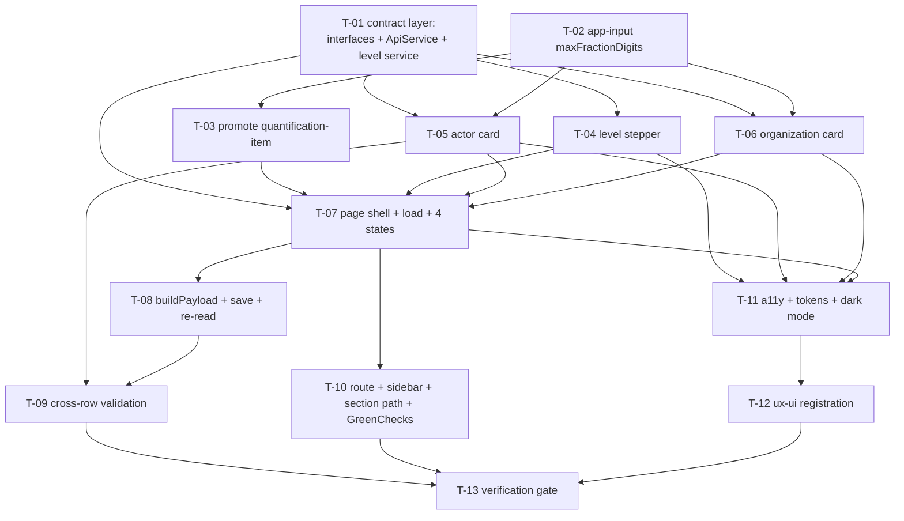

# Tasks — Results (Innovation Use) / Details Page (STAR)

- **Module:** results (`innovation-use`) — **client tier** (`client/research-indicators`)
- **Spec id:** 2026-08-innovation-use-details-page
- **Status:** in-progress
- **Owner:** David Felipe Casañas Hernández
- **Linked requirements:** [`./requirements.md`](./requirements.md)
- **Linked design:** [`./design.md`](./design.md)
- **Judgment ledger:** [`./judgment.md`](./judgment.md) — `JUDGMENT: APPROVED`, six findings open by explicit user decision
- **Parent spec:** [`../family.md`](../family.md) — chunk 3 of 3
- **Depth:** Full
- **Last updated:** 2026-08-20

---

## Document Control

| Field | Value |
| --- | --- |
| Type | Change |
| Approval Mode | gated |
| Task count | **13** — matches `design.md` §12's budget line, whose derivation is §13's decomposition preview |
| Server files modified | **zero**. No migration, no endpoint, no entity |
| Budget authority | **[`design.md`](./design.md) §12 is the single home for the budget figures** (KZ-005). §6 below records a per-task LOC split as *derivation*, and reports where the split disagrees with §12 rather than silently reconciling |
| Coverage closure | §5 — every one of the **39** `BUT it must NOT` / `AND IT MUST` clauses and all **85** ACs are owned by a named task. Requirement-ID presence is **not** accepted as closure |
| Judgment findings closed here | **`S-3`** (R-IUP-011 AC.6 had no named check) → `T-08` c8. **`I-4`** (hex-saturated file promoted to `shared/`) → `T-03` c6, recorded as a bounded accepted risk. **`I-6`** (R-IUP-016 AC.5 vacuous) → `T-10` c7, recorded as *no client work* rather than left unowned |
| Judgment findings still open | `I-2`, `I-3`, `I-5` — documentation-hygiene rows in `design.md`, carried to `/akili-validate` or the archive sweep per the user's Phase-2 scope decision |
| Blocking open question | **`OQ-IUP-4`** gates one criterion of `T-11` (`c4`). Default assumption stated there; needs the engineering lead's word before `T-11` closes |
| Concurrency | **One task at a time in this checkout.** Two tasks in the same package are not parallel-safe (root `CLAUDE.md` §4.3), and no measurement command may run while a delegated agent is active |

---

## 1. Execution rules that bind every task

Read these once; they are not repeated per task.

| Rule | Consequence if ignored |
| --- | --- |
| **The budget is a tripwire, not a cap** (`design.md` §12: 13 tasks · ~3,200 LOC · ~28 review rounds) | `/akili-execute` **stops and escalates** on a breach. Exceeding it is information; passing it silently is the failure |
| **Full suite only for R-IUP-019** (KZ-003) | A targeted `npm test -- <pattern>` run is **inconclusive**, never a pass, for any Innovation Dev non-regression claim |
| **`npm run lint` mutates files** — the script carries `--fix` | It is not a read-only check. Re-inspect `git status` after every run |
| **No measurement while a worker is active** (root `CLAUDE.md` §4.3) | A build or budget number taken during delegated work is a **wrong** number, not a slow one. Report *inconclusive* and re-measure in a quiet window |
| **A human tick must quote what was observed** (KZ-002 recurrence 6) | "The page renders" does not discharge "contrast ≥ 4.5:1 in dark mode". Quote the words, or re-class the criterion as blocked |
| **A verification mechanism needs one end-to-end criterion** (KZ-006) | Every per-piece check can pass while the mechanism cannot run at all. `T-13` carries the end-to-end criterion for this spec's gate |
| **Citations use symbols and anchors, not line numbers** (DD-12 / D-IUP-8) | Chunk 2's line citations rotted from its own edits to the same files |
| **The server stays authoritative** (PRD **AC-Role-Correctness**) | Every client check in this spec *mirrors* a server rule. None replaces one |

### Commands

| Purpose | Command (from `client/research-indicators/`) |
| --- | --- |
| Unit suite (full) | `npm test -- --silent` |
| Coverage | `npm run test:coverage` — floors: statements 40 / branches 20 / lines 45 / functions 30 |
| Build + bundle budgets | `npm run build` |
| Lint | `npm run lint -- --quiet` ⚠️ **mutates** |

---

## 2. Dependency graph

**No cycles.** One hard sequence: contract layer → shared additive edits → child components → page → wiring → verification.

**Parallel-safe in principle, not in practice.** `T-01`/`T-02` touch disjoint files, as do `T-04`/`T-05`/`T-06`. Root `CLAUDE.md` §4.3 still forbids two concurrent tasks in one package, so run them sequentially in one worktree.

---

## 3. Task list

### T-01 — Contract layer: view interfaces, `ApiService` methods, level catalog service

- **Status:** done · **Size:** M · **Dependencies:** none
- **Requirements covered:** R-IUP-004 (AC.4), R-IUP-005 (catalog source), R-IUP-016 (AC.1/AC.2 mechanism), NFR-IUP-005, NFR-IUP-006
- **Design references:** §2.1 *New — the contract layer*, §4.1, §4.2, §6.1 step 5
- **Skills:** `angular-developer`

**Scope**

| File | Change |
| --- | --- |
| `shared/interfaces/get-innovation-use-details.interface.ts` | **new** — `GetInnovationUseDetails`, `InnovationUseActor`, `InnovationUseOrganization`, `InnovationUseQuantification` as classes with defaulted fields, so `new X()` seeds a blank card (the `GetInnovationDetails` convention) |
| `shared/interfaces/get-innovation-use-levels.interface.ts` | **new** — `InnovationUseLevel`: `id`, `level`, `name`, `definition`. **No `additional_guidance`** |
| `shared/services/api.service.ts` | **+3 methods** per §4.1 |
| `shared/services/control-list/get-innovation-use-levels.service.ts` | **new** — root-provided, `constructor → main()`, mirroring `GetInnovationReadinessLevelsService` |
| `shared/services/api.service.spec.ts` | *(updated — file exists)* |
| `…/get-innovation-use-levels.service.spec.ts` | **new** |

**Implementation notes**

- `loadingTrigger: true` on `GET_InnovationUseDetails` is **load-bearing**: it is the only mechanism by which `ToPromiseService.updateGreenChecks()` fires in `finalize`. Omitting it silently breaks R-IUP-016.
- The PATCH **omits** `loadingTrigger`, matching every sibling; the page re-reads via the GET after a successful save.
- `GET_InnovationUseLevels()` takes the **default** config — a catalog is not result-scoped.
- Do **not** alias `GetInnovationDetails.Actor` / `.InstitutionType`. They carry four legacy booleans and no counts; aliasing them makes the type system agree with a payload the server rejects (§4.2).
- No `service-locator` registration — the stepper consumes its service by injection, not by `[serviceName]` (§7).

**Done criteria**

- [x] c1 — All three `ApiService` methods hit the exact verb + path of §4.1, asserted through `HttpTestingController` on the `MainResponse<T>` envelope.
- [x] c2 — The GET's config carries `loadingTrigger: true` **and** `useResultInterceptor: true`; the PATCH carries `useResultInterceptor: true` and **no** `loadingTrigger`; the catalog GET carries neither. Asserted per-method, not once.
- [x] c3 — `InnovationUseLevel` has **no** `additional_guidance` member (a compile-level fact; assert by the absence of the key in a constructed instance).
- [x] c4 — The level service loads once and exposes a signal; a second consumer does not re-issue the request.
- [x] c5 — `npm test -- --silent` green; `npm run lint -- --quiet` clean and `git status` re-inspected after.

**Falsifying input** — drop `loadingTrigger` from the GET config → **c2 must FAIL**. If it still passes, c2 is asserting the object's existence rather than its contents and is not evidence.

**Disqualifier** — a spec that asserts the method *was called* on a mocked `ApiService` proves nothing about the URL or the config (KZ-001). The assertion must go through `HttpTestingController`.

---

### T-02 — `app-input` gains an optional `maxFractionDigits` passthrough

- **Status:** done · **Size:** S · **Dependencies:** none
- **Requirements covered:** R-IUP-008 (AC.2, AC.4), R-IUP-019 (AC.1, AC.3)
- **Design references:** §2.3 row 1, §5.7, §6.3, §7, **DD-4**
- **Skills:** `angular-developer`

**Scope**

| File | Change |
| --- | --- |
| `shared/components/custom-fields/input/input.component.ts` | `+ @Input() maxFractionDigits?: number` |
| `shared/components/custom-fields/input/input.component.html` | forward to `p-inputNumber` |
| `…/input/input.component.spec.ts` | *(updated — file exists)* |

**Implementation notes**

- **Additive and optional.** `undefined` must reproduce today's `Intl` resolution *exactly* for all **16** consumer templates enumerated in §2.3. Give the input **no** default value — a default of `0` would silently change 7 existing `type="number"` call sites.
- §6.3 is the verified mechanism, read from `primeng@19.0.6`, not inferred. Do not re-derive it; do not "improve" the typed-`.` behavior — that quirk is platform-wide and explicitly out of scope.
- **Accepted behavior, not a bug:** with `maxFractionDigits = 0`, a pasted `2.5` **rounds to `3`** (`Intl` `roundingMode: 'halfExpand'`), it is not rejected. R-IUP-008 AC.4 requires no fractional value in the body; rounding satisfies it (§6.3).

**Done criteria**

- [x] c1 — Passing `maxFractionDigits="0"` forwards `0` to the rendered `p-inputNumber`.
- [x] c2 — **Omitting it leaves the rendered `p-inputNumber` binding unchanged** from before this task — asserted on the rendered binding, not on the component property.
- [x] c3 — `[min]="0"` continues to block a typed and a pasted minus sign (§6.3 rows 1–2), unchanged.
- [x] c4 — **Full** `npm test -- --silent` green, covering all 16 consumer templates' existing specs.

**Falsifying input** — give `maxFractionDigits` a non-`undefined` default → **c2 must FAIL** (`design.md` §10.3).

**Disqualifier** — a **targeted** run of `input.component.spec.ts` alone is *inconclusive* for c4, not a pass. This component is rendered by 16 templates; KZ-003 applies.

---

### T-03 — Promote `QuantificationItemComponent` to `shared/` with two default-preserving inputs

- **Status:** done · **Size:** M · **Dependencies:** T-02
- **Requirements covered:** R-IUP-008 (AC.2/AC.4 for `quantification_number`), R-IUP-012 (AC.1, AC.3, AC.4), R-IUP-019 (AC.1, AC.2, AC.3)
- **Design references:** §2.1 *Promoted*, §2.3 row 2, §5.6, §7, **DD-3**, `judgment.md` → `S-1`, `S-2`, `I-4`
- **Skills:** `angular-developer`

**Scope**

| File | Change |
| --- | --- |
| `shared/components/quantification-item/` | **moved** from `pages/…/oicr-details/components/quantification-item/` |
| `…/quantification-item.component.ts` | `+ @Input() fieldsRequired = true`, `+ @Input() maxFractionDigits?: number` |
| `…/quantification-item.component.html` | branch on `fieldsRequired`; forward `maxFractionDigits` to the Number field's `app-input` |
| `pages/…/oicr-details/oicr-details.component.ts` | **import path only** |
| `…/quantification-item.component.spec.ts` | *(updated — file exists; move + new assertions)* |

**Implementation notes**

- `oicr-details.component.html` is **not touched.** The selector `app-quantification-item` is unchanged by the move and OICR passes neither new input, so both defaults preserve its behavior (`judgment.md` → `C-1`, which corrected an earlier claim that two OICR files change).
- **`fieldsRequired = true` must reproduce OICR's *field-asymmetric* rendering** (`judgment.md` → `S-1`): Number and Unit carry `[isRequired]="true"` **and** `[validateEmpty]="true"`; **Comments** is an `app-textarea` carrying `[isRequired]="true"` and **no `[validateEmpty]`**. Applying both attributes to all three would change OICR's rendered validation at both of §2.3's call sites.
- `maxFractionDigits` defaults to `undefined`; the new page passes `0`. Without it, `quantification_number` was the one count field in the section with no fraction guard while the server DTO enforces `@IsInt() @Min(0)` (`judgment.md` → `S-2`).
- **`QuantificationItemData` (`{number, unit, comments}`) is not changed.** The new page adapts at its own boundary — `{id, quantification_number, unit, description}` ↔ `{number, unit, comments}`, merged by array index so `id` round-trips without the shared component knowing it exists (§5.6).

**Done criteria**

- [x] c1 — `fieldsRequired` defaults to `true` and reproduces the current rendering **including the Number/Unit vs Comments `validateEmpty` asymmetry**, asserted field-by-field.
- [x] c2 — `fieldsRequired="false"` drops the asterisks and the required validation on all three fields.
- [x] c3 — `maxFractionDigits` is forwarded to the Number field; **omitting it leaves that field's rendered binding unchanged**.
- [x] c4 — `oicr-details.component.html` is **byte-identical** to its pre-task state (`git diff --exit-code` on that path).
- [x] c5 — **Full** `npm test -- --silent` green; OICR's existing specs pass with no assertion changed (import-path edits excepted, per R-IUP-019 AC.2).
- [x] c6 — **Recorded accepted risk, not remediated:** the promoted template is hex-saturated (`bg-[#F4F7F9]`, `border-[#E8EBED]`, `text-[#8D9299]`, `text-[#CF0808]`) and moving it carries those literals into `shared/`. DD-7's "zero hex in **new files**" does not reach it, and detokenizing it here would change another page's rendering inside a move task. State this in the PR description and add it to §7's blocker log as owed follow-up. *(Closes `judgment.md` → `I-4` at task level: the hole is named and bounded rather than left implicit.)*

**Falsifying input** — flip the `fieldsRequired` default to `false` → **c1 must FAIL**. Note explicitly: OICR's *existing* spec **cannot** detect this. It asserts input defaults, disabled state, `ngOnInit`/`ngOnChanges` sync and emit behavior, and **nothing** about `isRequired` / `validateEmpty` / asterisks. Falsifiability here is **created by writing the new assertion, not inherited** (`design.md` §10.3; verified by Judge A's inventory of the spec's `describe`/`it` blocks).

**Disqualifier** — c4 discharged by eye is not evidence; it must be a `git diff --exit-code` on the path. A targeted suite is inconclusive for c5.

---

### T-04 — Innovation use level stepper (0–9) + definition callout

- **Status:** done · **Size:** M · **Dependencies:** T-01
- **Requirements covered:** R-IUP-005 (all 6 ACs), R-IUP-018 (AC.2 for the stepper's accessible names)
- **Design references:** §5.2, §5.3, §6.1 step 5, **DD-5**, **DD-6**, family **D-1**
- **Skills:** `angular-developer`

**Scope** — `pages/platform/pages/result/pages/innovation-use-details/components/innovation-use-level-stepper/innovation-use-level-stepper.component.{ts,html}` + `.spec.ts` (new).

**Contract:** inputs `levels: InnovationUseLevel[]`, `selectedLevelId?: number`, `disabled: boolean`; output `levelSelected: EventEmitter<number>` emitting the catalog **`id`**.

**Implementation notes — this task is where the family's trap fires**

- **`id ≠ level`.** Button label is the row's **`level`**; the emitted value is the row's **`id`**. Selection state is `levels.find(l => l.id === selectedLevelId)?.level === thisLevel`. Any comparison written against `innovation_use_level_id` as though it were a scale point is off by one.
- **Never resolve a level from `name`** — five names each cover two adjacent levels (family **D-1**), so name lookup is ambiguous.
- **No client-side sort.** Chunk 2's service already orders `level ASC` (**DD-6**); re-sorting here would hide a server regression. Render in the order received and assert *that* order.
- The callout renders `{level} - {name}` then `definition`. **`additional_guidance` is not rendered** — the column does not exist on this catalog and would print `undefined` (the reference stepper renders it; do not copy that line).
- Accessible name is **English**: `Innovation use level {level}`. The reference page's `aria-label` is Spanish (`'Seleccionar nivel ' + n`) and must not be copied.
- Empty catalog renders **no buttons** plus the required message — not ten dead buttons.

**Done criteria**

- [x] c1 — Ten buttons render labelled `0`…`9` in ascending `level` order, in the order the input array supplies.
- [x] c2 — **Selecting the button labelled `6` emits `7`.**
- [x] c3 — **`selectedLevelId = 7` highlights the button labelled `6`** and shows the level-6 callout.
- [x] c4 — The callout renders `level`, `name`, `definition` and asserts the **absence** of `additional_guidance`.
- [x] c5 — An empty `levels` array renders zero buttons and the required message.
- [x] c6 — Every button exposes an English `aria-label`; no Spanish string appears in the file.
- [x] c7 — `disabled` makes every button non-interactive.
- [x] c8 — No code path in the file references `name` for resolution (grep the file for a `name`-keyed `find`/comparison and show zero hits).

**Falsifying inputs** — bind `level` instead of `id` on emit → **c2 must FAIL**. Render `additional_guidance` → **c4 must FAIL** (`design.md` §10.3).

**Disqualifier** — c1 asserted only on the count of buttons is a presence assertion. It must assert the **rendered labels in order**, because a stepper that renders ten buttons labelled `1`…`10` passes a count check.

---

### T-05 — Innovation Use actor card: type, OTHER name, mode switch, counts, derived total

- **Status:** done · **Size:** L · **Dependencies:** T-01, T-02
- **Requirements covered:** R-IUP-007 (all), R-IUP-008 (AC.1–AC.5 for the five actor counts), R-IUP-010 (AC.1–AC.3), R-IUP-011 (AC.1–AC.4), R-IUP-014 (AC.4)
- **Design references:** §5.2, §5.4, §6.2, §6.3, **DD-2**, **DD-5**, family **D-4**
- **Skills:** `angular-developer`

**Scope** — `…/components/innovation-use-actor-item/innovation-use-actor-item.component.{ts,html}` + `.spec.ts` (new).

**Contract:** inputs `actor: InnovationUseActor`, `actorNumber: number`, `disabled: boolean`, `duplicateType: boolean`; outputs `update: EventEmitter<InnovationUseActor>`, `remove: EventEmitter<void>`.

**Implementation notes**

- **`@Input` + `@Output` only.** Never take a `WritableSignal` of the parent's body, never write through a parent array key (**DD-5**). This is what makes R-IUP-019 AC.4 achievable and what removes the id-synthesis paths behind two of chunk 2's `400`s.
- **The card never sets, copies, or clears `result_actors_id`.** The parent owns identity (§5.2).
- **`5` is a client-side literal, not an import.** `ClarisaActorTypesEnum.OTHER = 5` exists **only in the server tree**; a grep of `client/research-indicators/src` returns zero matches. Use the literal with a comment naming the server enum as its source, or introduce a client constant — but **do not attempt the import** (`judgment.md` → `C-2`; requirements **A4**).
- **Derived total, transcribed from chunk 2 §5.5 (§6.2):** aggregate mode → `actors_count`; disaggregated → sum of the four counts with `null`/`undefined` treated as absent, **and `null` when all four are absent, not `0`**. `0` would tell the user they reported a count of zero when they reported nothing.
- Total is read-only text, **not an input**.
- All five count inputs pass `[min]="0"` **and** `[maxFractionDigits]="0"`.
- Toggling the mode clears the fields of the mode being left.
- **Do not build this from `actor-item`.** DD-2 declines that reuse; `actor-item` stays byte-identical.

**Done criteria**

- [x] c1 — Unchecked renders the four disaggregated inputs and **no** `actors_count` input; checked renders one `How many` and **none** of the four. Exactly one mode is ever in the DOM.
- [x] c2 — Switching modes clears the departing mode's fields in the emitted row.
- [x] c3 — Entering `3` and `2` in two disaggregated fields renders a live total of `5`.
- [x] c4 — **All four disaggregated fields empty renders an empty total, not `0`.**
- [x] c5 — Aggregate mode's total equals `actors_count`; a saved aggregate row of `12` renders `12`.
- [x] c6 — The total control cannot receive a typed value (assert it is not an `input`/`p-inputNumber`).
- [x] c7 — Actor type `5` reveals a mandatory `Specify other`; changing away from `5` clears `actor_type_custom_name` in the emitted row.
- [x] c8 — A row with no actor type shows the inline required message and the error border.
- [x] c9 — `duplicateType = true` renders the duplicate message **instead of** the generic required message.
- [x] c10 — `0` is accepted in every count field and is distinguishable from absent.
- [x] c11 — Pasting `-1` and pasting `2.5` into each of the five count fields yields no negative and no fractional value in the emitted row.
- [x] c12 — `disabled` hides the remove icon and makes every control non-interactive.
- [x] c13 — No `import` in the file resolves to a server path or to `actor-item`; the file contains no reference to `ClarisaActorTypesEnum`.

**Falsifying input** — return `0` instead of `null` for the all-absent case → **c4 must FAIL** (`design.md` §10.3).

**Disqualifier** — asserting the total by reading the component's `computed` rather than the **rendered** text is a green-suite-over-broken-page risk (KZ-001 / RK-2). c3–c5 must assert rendered output.

---

### T-06 — Innovation Use organization card: known/unknown paths, type + sub-type, OTHER name, count

- **Status:** done · **Size:** L · **Dependencies:** T-01, T-02
- **Requirements covered:** R-IUP-008 (AC.1–AC.5 for `organization_count`), R-IUP-012 (AC.1, AC.2, AC.3, AC.5), NFR-IUP-005
- **Design references:** §5.2, §5.5, **DD-2**, **DD-5**, requirements **A5**
- **Skills:** `angular-developer`

**Scope** — `…/components/innovation-use-organization-item/innovation-use-organization-item.component.{ts,html}` + `.spec.ts` (new).

**Contract:** inputs `organization: InnovationUseOrganization`, `organizationNumber: number`, `disabled: boolean`; outputs `update`, `remove`.

**Implementation notes**

- Two identity paths (§5.5): `is_organization_known === true` → filterable virtual-scrolled `p-select` over `GetInstitutionsService.list()` (`html_full_name`), `app-partner-selected-item` preview, and the `request to add an institution` link into `AllModalsService.openModal('requestPartner')`. Falsy → `p-select` over `GetInstitutionTypesService.list()`, a sub-type `p-select` **only when** `GetClarisaInstitutionsSubTypesService.getSubTypes(2, typeId)` returns rows, and a `Specify other` input when `institution_type_id === 78` (**A5**).
- `organization_count` renders on **both** paths, `[min]="0"`, `[maxFractionDigits]="0"`, **optional**.
- **Every field here is optional** — no asterisks, no required messages. This is a deliberate divergence from the reference card (§5.5).
- The **one** message that renders is R-IUP-012 AC.5's *this row does not identify an organization yet*, shown when the row is touched but satisfies neither identity path. It exists to prevent the `400` whose root cause chunk 2 documented as a **silent data-destruction path**.
- All vocabularies come from the existing CLARISA control-list services. No parallel taxonomy (NFR-IUP-005).
- The card never sets, copies, or clears `result_institution_type_id`.

**Done criteria**

- [x] c1 — Each identity path renders its own field set, and only its own.
- [x] c2 — The sub-type select appears **only** when the service returns rows for the chosen type; an empty result renders no sub-type control.
- [x] c3 — `institution_type_id === 78` reveals the `Specify other` input.
- [x] c4 — **No asterisk renders on any field of this card** (assert zero `text-red-500` asterisk nodes).
- [x] c5 — A touched row satisfying neither identity path renders the not-yet-identified message; an untouched row does not.
- [x] c6 — Pasting `-1` and `2.5` into `organization_count` yields no negative and no fractional value in the emitted row; `0` is accepted and distinct from absent.
- [x] c7 — Every vocabulary is read from its CLARISA control-list service, asserted on the service source rather than on a hardcoded array.
- [x] c8 — `disabled` hides add/remove affordances and makes every control non-interactive.
- [x] c9 — A saved-and-reloaded row restores `institution_id` / `institution_type_id` / `sub_institution_type_id` / `institution_type_custom_name` / `organization_count`.

**Falsifying input** — add an asterisk to any field → **c4 must FAIL**. Return an empty sub-type list and assert the control is absent; render it unconditionally → **c2 must FAIL**.

**Disqualifier** — c7 satisfied by asserting a mocked service was *called* proves the wiring, not the source. Assert the rendered options came from the service's list (KZ-001).

---

### T-07 — Page shell: layout, four cards, load, the four UI states, conditional justification

- **Status:** done · **Size:** L · **Dependencies:** T-01, T-03, T-04, T-05, T-06
- **Requirements covered:** R-IUP-004 (all), R-IUP-006 (AC.1–AC.4), R-IUP-010 (AC.4, AC.5), R-IUP-012 (AC.1, AC.3, AC.4), R-IUP-015 (AC.1, AC.2), R-IUP-002 (AC.3 — version preservation on Back/Next)
- **Design references:** §5.1, §6.1, §6.4, §6.7 step 6, **DD-1**, **DD-8**, **DD-10**, **DD-11**
- **Skills:** `angular-developer`

**Scope** — `…/innovation-use-details/innovation-use-details.component.{ts,html}` + `.spec.ts` (new).

**Implementation notes**

- **Page shape follows `capacity-sharing`, not `innovation-details`** (**DD-1**): `app-page-wrapper` → `app-form-header` → four titled cards → `app-navigation-buttons`. **No accordion.**
- Cards 3 and 4 carry **no** asterisk and **no** required messaging (R-IUP-012 AC.3 — contract §6.1 does not reference them). Card 2 states that at least one actor is required.
- **Load (§6.1):** `ngOnInit` + `VersionWatcherService.onVersionChange` → the GET. On `successfulRequest === false`, hand to `ActionsService` and set a **distinct `loadFailed` signal** — **never** seed `body` with an empty shape (**DD-11**). Otherwise a failed GET is indistinguishable from an empty section and the user's next save wipes the record.
- **Empty state (DD-10):** push **one** blank actor card. Leave `organizations` and `quantifications` empty — a blank organization card *is* the identity-less row whose `400` chunk 2 added to stop a silent data-destruction path.
- **Conditional justification (§6.4):** visibility and requiredness are evaluated on the **resolved `level`** — `levels.find(l => l.id === body().innovation_use_level_id)?.level` — never on the id. Lowering the level **hides** the control; the value stays in `body()`.
- **`Add` does not auto-save** (**DD-8**). The reference page calls `saveCurrentSection()` from `addActor()`; here that PATCHes a row with no `actor_type_id` — a guaranteed `400` on the user's first click of `Add other actor`.
- Adapt the quantification shape at this boundary: `{id, quantification_number, unit, description}` ↔ `{number, unit, comments}`, merged by array index. Pass `fieldsRequired="false"` and `maxFractionDigits="0"`.
- Nav: Back → `alliance-alignment`, Next → `partners`, **preserving `?version=N`**.
- Every control and affordance is gated on `SubmissionService.isEditableStatus()`; `isExternalResult()` already forces it false, so a federated record renders read-only with no extra code.

**Done criteria**

- [x] c1 — Loading state renders the shared skeleton treatment via `CacheService.currentResultIsLoading`.
- [x] c2 — A `200` with all nulls / empty arrays renders the empty state including **exactly one** blank Actor card and **zero** organization and quantification cards.
- [x] c3 — A `200` carrying data renders every scalar and every row.
- [x] c4 — **`successfulRequest: false` reaches `ActionsService`, sets `loadFailed`, and does not render as a clean empty form.** Assert that no blank actor card is offered in the error state.
- [x] c5 — The error state does **not** overwrite cached green checks with an all-false set derived from the failure.
- [x] c6 — The textarea is absent below level 6 and present with an asterisk + inline required message at level ≥ 6.
- [x] c7 — **Type at level 7 → select level 3 → select level 7 again: the original text renders unchanged.**
- [x] c8 — The conditional is evaluated on the resolved `level`; loading `innovation_use_level_id = 7` (level 6) shows the textarea, and `id = 6` (level 5) does not.
- [x] c9 — Level 3 with a blank justification does not block completion.
- [x] c10 — Cards 3 and 4 render **no** asterisk; card 2 renders the at-least-one-actor message when `actors` is empty.
- [x] c11 — `Add other actor` appends a row and **issues no HTTP request** (assert zero requests on `HttpTestingController`).
- [x] c12 — `unit` renders as a free-text input, not a dropdown.
- [x] c13 — With `isEditableStatus() === false`: every input, every stepper button, and every add/remove control is non-interactive or absent, while all stored values still render.
- [x] c14 — Back navigates to `alliance-alignment` and Next to `partners`, **each preserving `?version=N`**.

**Falsifying inputs** — seed `body` with an empty shape on failure → **c4 must FAIL**. Clear `innovation_use_level_explanation` on the level toggle → **c7 must FAIL**. Call `saveCurrentSection()` from `addActor()` → **c11 must FAIL**.

**Disqualifier** — c2's "exactly one" must be asserted as a **count of rendered cards**, not as the length of a signal; and c13 discharged by checking the `disabled` property rather than the rendered control is a presence assertion.

---

### T-08 — `buildPayload()` + save + re-read

- **Status:** done · **Size:** L · **Dependencies:** T-07
- **Requirements covered:** R-IUP-013 (all 6), R-IUP-014 (all 4), R-IUP-011 (AC.5, AC.6), R-IUP-007 (AC.3, AC.4), R-IUP-006 (the "no explicit `null`" half), R-IUP-015 (AC.3, AC.4), R-IUP-016 (AC.1, AC.2)
- **Design references:** §4.3, §6.5, §6.7, §6.2
- **Skills:** `angular-developer`, `tdd`, `error-handling-patterns`

**Scope** — `…/innovation-use-details.component.ts` (payload + save), spec extended.

**Implementation notes**

- **`buildPayload()` is a pure function over `body()`**, unit-testable without rendering. Each of its five steps maps to one chunk 2 rejection (§4.3 / §6.5):
  1. Copy the three scalars; **omit `innovation_use_level`** (server-derived).
  2. `actors`: drop rows with no `actor_type_id`; per surviving row keep the active mode's fields and set the other mode's to `null`; **omit `total`**.
  3. `organizations`: drop rows satisfying neither identity path.
  4. `quantifications`: drop rows where number, unit and description are all absent.
  5. Ids pass through **only** where the row already carried one from the GET. A row created by `Add` has none and must not be given one.
- **The two id-related `400`s are unreachable by construction, not by validation.** Ids only ever enter `body()` from a GET for this result, and no path copies an id between rows. The spec must assert the **absence of a synthesis path**, not just a happy-path body.
- **Never send an explicit `null` for `innovation_use_level_explanation` on a level toggle** (§6.4). Chunk 2 resolves it as *key-present ? payload : stored*; an explicit `null` is a present key and **clears the stored column**. "Clear on toggle" is data loss on the next save, not a UI reset.
- **Save (§6.7):** if `!isEditableStatus()` → issue nothing, handle navigation only. On success → toast → `await getData()`; that GET's `loadingTrigger: true` is what turns the sidebar tick. On failure → `ActionsService`, rendering `errorDetail.errors[]` inline against the named field where the message carries one. Note the `ResultStatusGuard` returns **`400`**, not `403`.

**Done criteria**

- [x] c1 — A blank actor card added but not filled is **absent** from the request body; the one complete row is present.
- [x] c2 — A blank organization card added but not filled is absent from the body.
- [x] c3 — A quantification row with number, unit and description all absent is absent from the body.
- [x] c4 — Switching a saved row to aggregate mode sends `sex_age_disaggregation_not_apply: true` + `actors_count`, and **none** of the four `*_count` values; switching back does the inverse. No body the UI can produce carries a value in both modes on one row.
- [x] c5 — **No actor row in any body carries a `total` key**; no body carries `innovation_use_level`.
- [x] c6 — Every id in the body was present in the preceding GET for the same result, and **no id appears twice across a block's rows**. Additionally assert that no code path assigns an id to a row that arrived without one.
- [x] c7 — A level toggle from 7 to 3 sends the stored explanation, **not** an explicit `null`.
- [x] c8 — **After a successful save the client-displayed total equals the `total` the server returned for the same row** (R-IUP-011 AC.6). *(Closes `judgment.md` → `S-3`, which found this AC had no named check anywhere in the strategy.)*
- [x] c9 — On success a toast confirms and the section re-reads through the GET carrying `loadingTrigger: true`.
- [x] c10 — **No PATCH is issued while `isEditableStatus()` is false** (assert zero requests), and a `400` from `ResultStatusGuard` surfaces through `ActionsService` rather than being swallowed.
- [x] c11 — Round trip: level 8 + one aggregate `OTHER` actor named `"local cooperatives"` with `actors_count: 12` + one organization + one quantification reload exactly as entered, with the derived total rendering `12`.
- [x] c12 — Rows the user deleted before saving are **not** resurrected by the re-read.
- [x] c13 — A save issued while the section is unchanged does not deactivate existing rows.
- [x] c14 — A partially filled section (level only) saves without error.

**Falsifying input** — remove the `actor_type_id` guard from step 2 → **c1 must FAIL** and the body must show two rows (`design.md` §10.3).

**Disqualifier** — c6's second half is the hard one. A happy-path body assertion **cannot** prove the absence of a synthesis path; it must be discharged by inspecting every write to an id field in the page and card files and showing that each originates from a GET response, and by a spec that adds a row and asserts the emitted row's id is `undefined`. If that inspection is not performed, c6 is **inconclusive**, not passed.

---

### T-09 — Cross-row validation: duplicate actor type, level-6 justification gate, save blocking

- **Status:** done · **Size:** M · **Dependencies:** T-05, T-08
- **Requirements covered:** R-IUP-009 (all 3), R-IUP-010 (AC.5), R-IUP-006 (AC.2), R-IUP-014 (AC.3)
- **Design references:** §6.6, §5.4 (`duplicateType`)
- **Skills:** `angular-developer`

**Scope** — `…/innovation-use-details.component.ts` (`duplicateActorTypeIndexes` computed + save guards), spec extended.

**Implementation notes**

- `duplicateActorTypeIndexes` is a `computed` over `body().actors`, keyed on `actor_type_id` — or, for type `5`, on `actor_type_id` + **trimmed lowercase** `actor_type_custom_name`. Flagged rows receive `duplicateType: true`; save is blocked while any row is flagged.
- Justification required at resolved `level >= 6` → ~~save blocked~~ **(superseded 2026-08-21 by `bugfix/innovation-use-draft-save` — save is no longer blocked; see `execution.md` → *Pivot Record: R-IUP-006 / T-09*)**, inline required message on the textarea. Completeness is enforced only at submit.
- **Zero actor rows: save is allowed.** A draft with no actors is legal (R-IUP-014); the green check simply stays false and card 2 says at least one actor is required. Do **not** block the save here.
- Every rule mirrors a server rule; the server stays authoritative (PRD **AC-Role-Correctness**).

**Done criteria**

- [x] c1 — Choosing type `X` on row 2 when row 1 already holds `X` renders an inline message naming the field, or the option is not offerable.
- [x] c2 — Two rows of type `5` with the same trimmed lowercase custom name are flagged as duplicates; with different names they are not.
- [x] c3 — **No PATCH is issued while any row is flagged** (assert zero requests).
- [x] c4 — Removing row 1 clears the flag and re-offers type `X` on row 2.
- [x] c5 — **Hardened 2026-08-21 by the `bugfix/innovation-use-draft-save` Pivot** (`execution.md` → *Pivot Record: R-IUP-006 / T-09*). At resolved level ≥ 6 with a blank justification, ~~save is blocked~~ **the save proceeds** and the inline required message renders. *(Superseded wording: "save is blocked and the inline required message renders" — the block was deleted by that spec's T-01/T-02; the message half is unchanged and re-asserted there by T-02.)*
- [x] c6 — **Zero actor rows: the save proceeds** and the section renders as incomplete rather than as an error.

**Falsifying input** — key the computed on `actor_type_id` alone → **c2's differing-custom-name half must FAIL** (two distinct `OTHER` rows would be wrongly flagged). Block the save on zero rows → **c6 must FAIL**.

**Disqualifier** — c1 discharged by asserting the computed's contents is a presence assertion; it must assert the **rendered** message, since `duplicateType` reaching the card is what R-IUP-009 AC.1 is about.

---

### T-10 — Reachability wiring: route, sidebar rows, section path, `GreenChecks`

- **Status:** done · **Pivot resolved 2026-08-21** (branch A: c4 amended, zero code change) · **Size:** M · **Dependencies:** T-07
- **Requirements covered:** R-IUP-001 (all 4), R-IUP-002 (AC.1, AC.2), R-IUP-003 (all 4), R-IUP-016 (AC.3, AC.4, AC.5)
- **Design references:** §2.1 *Modified*, §2.3 rows 3–5, §7, **DD-9**, **D-IUP-3**, **D-IUP-5**
- **Skills:** `angular-developer`

**Scope**

| File | Change |
| --- | --- |
| `app.routes.ts` | one `innovation-use-details` child route, `loadComponent`, `data: createResultData()` |
| `shared/components/result-sidebar/result-sidebar.component.ts` | two `allOptions` rows |
| `shared/services/cache/cache.service.ts` | `case 6` in `currentResultIndicatorSectionPath` |
| `shared/interfaces/get-green-checks.interface.ts` | `+ innovation_use?: number`, `+ ip_rights?: number` |
| `result-sidebar.component.spec.ts`, `cache.service.spec.ts` | *(updated — both exist)* |
| `alliance-alignment` + `partners` specs | *(updated)* — call-site navigation assertions |

**Implementation notes**

- Sidebar gains exactly two rows: `Innovation use details` (`path: 'innovation-use-details'`, `indicator_id: 6`, `greenCheckKey: 'innovation_use'`) and `IP rights` (`indicator_id: 6`, `greenCheckKey: 'ip_rights'`). The detail row sits after `Alliance alignment`, before `Results partners`.
- **`ip-rights.component.ts` is not touched** (**D-IUP-3**) — the component branches on no indicator, and the row plus the green check already exist server-side.
- **`Pool funding alignment` is left exactly as it is** (**D-IUP-5**) — its row carries no `indicator_id`, so it already renders for indicator 6 when eligible, and `optional: true` keeps it out of the counter and out of submit gating. It is **not** one of the seven.
- **Add both `innovation_use` and `ip_rights` to `GreenChecks`** (**DD-9**). The sidebar's existing indicator-1/2 IP-rights rows read `ip_rights`, which the interface never declared — the lookup compiles only through an `as keyof GreenChecks` cast. **Corrected 2026-08-21:** declaring the keys does **not** close that cast — it is applied to `greenCheckKey`, typed `string`, so it is required regardless of how many keys exist. **Declaring the two keys is the whole of this task's authorized change.** Closing the cast is a separate, larger change tracked as **RB-8**.
- `case 6` is added **before** `default`; existing cases untouched.

**Done criteria**

- [x] c1 — With `indicator_id = 6`, `allOptionsWithGreenChecks()` yields exactly these seven paths **in this order**: `general-information`, `alliance-alignment`, `innovation-use-details`, `partners`, `geographic-scope`, `evidence`, `ip-rights`.
- [x] c2 — `getTotalCount()` returns `7` for indicator 6.
- [x] c3 — For indicators 1, 2, 4 and 5 the yielded path list is **byte-identical** to the pre-change list, and indicator 6 yields **none** of `Innovation details`, `CapSharing details`, `Policy Change details`, `OICR Details`, `Links to result`.
- [x] c4 — **Amended 2026-08-21 (Pivot, user-approved branch A).** Both keys are **declared on `GreenChecks`** and **drive the rendered `greenCheck`** for their rows, asserted on rendered output. *Superseded wording: "Both keys resolve **without** an `as keyof GreenChecks` cast."* That was **unsatisfiable by the change this task authorizes** — the cast bridges `greenCheckKey`'s declared `string` type to the interface, so declaring keys cannot remove it, however many are declared. **DD-9 conflated declaring a key with removing the cast, and this criterion asserted the latter as if the former achieved it** — it elevated a *rationale* into an assertion. Closing the cast is tracked as **RB-8**.
- [x] c5 — `/result/<id>/innovation-use-details` renders the page; the route is declared with **`loadComponent`**, not `component`.
- [x] c6 — `currentResultIndicatorSectionPath()` returns `'innovation-use-details'` for 6, the four existing values for 1/2/4/5, and `''` for anything else. **And** — asserted at each consumer's own call site — `alliance-alignment`'s **Next** and `partners`' **Back** each navigate to `['result', <id>, 'innovation-use-details']` and never to `['result', <id>, '']`.
- [x] c7 — With `innovation_use` false, `canSubmitResult()` is false and the Submit affordance is blocked with the standard tooltip. **R-IUP-016 AC.5 requires no client work and is recorded as such:** `VISUAL_ONLY_GREEN_CHECKS` exists only server-side, the client has no equivalent, and the client gate ANDs every emitted key unconditionally — so `innovation_use` counts and gates by default. *(Closes `judgment.md` → `I-6` by owning it explicitly rather than leaving it unaddressed.)*

**Falsifying input** — delete `case 6` → **c6's call-site half must FAIL**, not only the `cache.service` assertion. The `cache.service` assertion alone is a presence assertion: it proves the map returns a string, not that any screen uses it (`design.md` §10.3, R-IUP-003's own note).

**Disqualifier** — c3's "byte-identical" discharged by spot-checking two indicators is not evidence. Assert the full path list for each of 1, 2, 4, 5.

---

### T-11 — Accessibility, design tokens, dark-mode pass

- **Status:** done · **Size:** M · **Dependencies:** T-04, T-05, T-06, T-07
- **Requirements covered:** R-IUP-017 (AC.1, AC.2, AC.3), R-IUP-018 (AC.1, AC.2, AC.3, AC.5), NFR-IUP-001, NFR-IUP-002
- **Design references:** §5.7, **DD-7**, **OQ-IUP-4**, requirements §9 rows D7/D8, **AR-2**
- **Skills:** `angular-developer`, `ui-ux-pro-max`

> **Skill note.** `design.md` **DD-13** declined `ui-ux-pro-max` at design time because style, palette and font pairing were already fixed by `docs/ux-ui/design.md` §7.1. That rationale does not extend to this task: its subject is accessibility and token conformance review, where the skill's value is not style selection. Loaded here deliberately, and recorded because it is a departure from DD-13's scope, not a contradiction of it.

**Scope** — the four new component template/style pairs; `src/styles/colors.scss` **only if** `OQ-IUP-4` resolves to *add the token here*.

**Implementation notes**

- **Zero hex literals in new files** (**DD-7**). The reference `innovation-details` page is saturated with them (`#1689CA`, `#E8EBED`, `#F4F7F9`, `#E69F00`, `#CF0808`); it is a *layout and interaction* reference, and its color practice is a documented violation of §7.1. Matching an existing violation is not consistency.
- Element → class mapping is binding (§5.7): `.label`, `.description`, `.option-label`, `.section-title`, `*`, `.abc-*` / `.atc-*` / `var(--ac-*)`, `.rs-*` / `.fs-*` with `.md:` variants.
- **Dark mode requires no branch.** Tokens flip under `:root[data-theme="dark"]` and the `.dark-mode` body class. **Never** branch on `isDarkMode()` for a color.
- **Reconciling R-IUP-017's scenario with DD-7 — read this before adding a token.** The scenario forbids introducing "a token or a hex literal **to make dark mode work**"; DD-7 permits adding a token for a *missing color*. These are not in conflict: a new token must be **theme-aware by construction** — defined in both palettes and registered in §7.1 — never a dark-mode-only patch. If a color needs a dark-mode-specific value that the token system cannot express, that is the forbidden case; stop and escalate.
- Errors are conveyed by **icon + text**, never by color alone.
- Icon-only controls (add, remove) carry **English** accessible names.

**Done criteria**

- [x] c1 — `grep -nE '#[0-9a-fA-F]{3,8}' <the added file set>` returns **zero** hits. Name the file set explicitly in the evidence; a grep over a folder that misses a file is not a clean result (KZ-005: bound the search space on the file-set axis).
- [x] c2 — Every input has a `<label>` or `aria-label`; every icon-only control has an English accessible name. Assert per control, and report the per-control tally **including controls with zero findings** (KZ-007).
- [x] c3 — Required-field and duplicate errors render an icon **and** text.
- [x] c4 — **Gated on `OQ-IUP-4`.** If a reference color has no existing `--ac-*` token, the token is added to `colors.scss` **and** registered in `docs/ux-ui/design.md` §7.1 in this same change. Default assumption pending the engineering lead: *add it here*. If the answer is *separate design-system change*, this criterion becomes **blocked**, not passed, and the color is deferred rather than inlined.
- [x] c5 — No file in the added set references `isDarkMode()` for a color decision (grep, zero hits).
- [x] c6 — **`c7`…`c9` below are the human-gated half and cannot be discharged here** — they belong to `T-13`'s gate. This criterion records that split explicitly so the task is not read as covering them.

**What this task's automated criteria cannot prove — stated, not implied**

`c1`–`c5` are **presence and grep assertions.** They prove tokenization and accessible-name *presence*. They prove **nothing** about focus order, visible focus ring, rendered contrast, or layout at any viewport: jsdom computes no layout, and `axe` cannot evaluate contrast over an unrendered tree — a checker returning *incomplete* has evaluated nothing. Those properties are defect classes **D7** and **D8**, have **no automated gate**, and are routed to `T-13`'s human + T6-Multimodal review as **AR-2**.

**Falsifying input** — introduce one hex literal into any new file → **c1 must FAIL**. If the grep still returns zero, the file set was mis-bounded and c1 is not evidence.

---

### T-12 — Register the new component patterns in `docs/ux-ui/design.md`

- **Status:** done · **Size:** S · **Dependencies:** T-11
- **Requirements covered:** R-IUP-017 (AC.4)
- **Design references:** §13 *Follow-up owed* (row corrected at Judgment Day round 1 — `judgment.md` → `C-3`)
- **Skills:** `cognitive-doc-design`

**Scope** — `docs/ux-ui/design.md` §8.1 (component inventory) and §12 (decisions log); `src/styles/colors.scss` token registration in §7.1 if `T-11 c4` added one.

**Implementation notes**

- **This is in-spec work, not post-rollout debt.** R-IUP-017 AC.4 requires the registration "**in the same change**". `judgment.md` → `C-3` records that `design.md` §13 previously listed it as owed follow-up, so a reader of that table alone would have shipped in breach of AC.4. The §13 row now states affirmatively that `T-12` owns it.
- Register the level stepper, the actor card, and the organization card as patterns; note the quantification card's promotion to `shared/`.
- Apply the **Correction Closure** sweep: after editing, grep forward for any superseded claim and backward for documents that cite the sections you changed.

**Done criteria**

- [x] c1 — §8.1 lists the level stepper, the actor card, and the organization card, and records `quantification-item`'s new `shared/` home.
- [x] c2 — §12's decisions log carries this spec's user-visible decisions (DD-1 page shape, DD-10 empty-state affordance, DD-8 no auto-save on Add).
- [x] c3 — Any token added by `T-11 c4` is registered in §7.1.
- [x] c4 — Forward sweep: grep the added names across `docs/ux-ui/design.md` and this spec folder; every hit is consistent. Backward sweep: grep for references *to* the edited sections and confirm none now asserts a falsehood.

**Falsifying input** — this task's output is documentation, so its check is a grep, and a grep over the wrong file set cannot fail. **Name the file set in the evidence.** If c4 is discharged without stating which paths were swept, it is inconclusive (KZ-005, whose escalation is *fewer sites, not better sweeps*).

**Disqualifier** — a registration that describes a pattern the implementation does not match is worse than no registration. c1 must cite the component file each entry describes.

---

### T-13 — Verification gate: full suite, coverage, build, budget, human visual + a11y review

- **Status:** `[~]` **7 of 11 discharged — c1/c7/c8/c9 owed to the human gate** (see `execution.md`) · **Size:** M · **Dependencies:** T-09, T-10, T-12
- **Requirements covered:** R-IUP-019 (all 4), R-IUP-017 (AC.3), R-IUP-018 (AC.1, AC.3, AC.4, AC.5), NFR-IUP-001, NFR-IUP-002, NFR-IUP-003, NFR-IUP-004, NFR-IUP-006
- **Design references:** §10.1, §10.4, §10.5, §12, requirements §9 (D5, D7, D8, D9), **AR-1**, **AR-2**
- **Skills:** `systematic-debugging` (on any failure)

**Implementation notes**

- This task delivers the spec's **verification mechanism**, so per **KZ-006** it carries an **end-to-end criterion** (`c1`): every per-piece check can pass while the gate as a whole cannot run.
- The human review is **not a formality.** It is the *only* gate for defect classes **D7** and **D8**, which are the classes this spec most often produces (§10.1).

**Done criteria**

- [ ] c1 — **End-to-end (KZ-006):** starting from a clean checkout, an indicator-6 result is opened from the sidebar, the section is filled, saved, re-read, and the sidebar tick turns true — exercising route + sidebar + page + payload + green-check refresh in one pass. A criterion satisfied by the sub-checks below without this pass is **not** satisfied.
- [x] c2 — **Full** `npm test -- --silent` green. A run that skips, filters, or targets files is reported as **inconclusive**, never as a pass (KZ-003, R-IUP-019 AC.3).
- [x] c3 — `innovation-details.component.spec.ts`, `actor-item.component.spec.ts` and `organization-item.component.spec.ts` pass **unmodified** — `git diff --exit-code` on those three paths returns clean, except for an import-path edit if a component moved (R-IUP-019 AC.2). **DD-2's `1,665` lines across those three files is the reason this is achievable; re-derive it with `wc -l` rather than restating it** (`design.md` DD-2 is that figure's single home).
- [x] c4 — `npm run test:coverage` holds the floors: statements 40 / branches 20 / lines 45 / functions 30.
- [x] c5 — `npm run build` clean, within `angular.json` budgets: initial ≤ 2 MB warning / 3 MB error, component styles ≤ 4 kB warning / 8 kB error. The new route is lazy, so the initial bundle must not grow materially.
- [x] c6 — `npm run lint -- --quiet` clean, **and `git status` re-inspected afterwards** because the script carries `--fix` and mutates files.
- [ ] c7 — **Human visual check, LIGHT THEME ONLY, at 1440 px and at the `md:` breakpoint** (landscape, height ≤ 768 px): every label, callout, count field and card border legible; the repeatable cards stack rather than overflow horizontally; no unreadable contrast. **Quote what was observed** (KZ-002 recurrence 6) — "the page renders" does not discharge "contrast ≥ 4.5:1". **Light-mode AA is still fully gated here** (PRD **C-4**); only the dark half is lifted.
  > **Amended 2026-08-21 by user ruling — dark mode dropped from this criterion.** Originally *"both themes"*, and the dark half was known to fail (1.29:1 and 1.887:1 against 4.5:1, produced by following `design.md` §5.7 exactly). **Verified reachability before accepting the reduction:** `DarkModeService` is imported and injected at `alliance-navbar.component.ts:22,52` but appears **nowhere in `alliance-navbar.component.html`** — a dead injection. No control anywhere exposes the toggle, so dark mode is **not reachable by any user**. An unreachable state is not a defect worth spending on; this is **KZ-008's reachability discipline applied in the negative direction**, not a waiver of it. If dark mode is ever wired up, this criterion and the §5.7 contrast defect both reopen — see `execution.md` → *Dark-mode deferral*.
- [ ] c8 — **T6-Multimodal screenshot review** of the section, **light theme only, at both viewports — two screenshots, not four** (amended 2026-08-21 with c7, same user ruling and same reachability evidence). Per the model registry's *Cross-host dispatch*, the strongest column for T6 may not be this session's host; if no T6-capable reviewer is reachable, record the criterion as **blocked**, not passed.
- [ ] c9 — **Keyboard pass:** Tab through the whole page — every control receives focus in document order with a visible ring, **no focus trap inside a repeatable card**, and every icon-only control announces an English name. Human-observed; quote what was observed.
- [x] c10 — **Budget reconciliation against `design.md` §12** (13 tasks · ~3,200 LOC · ~28 review rounds). Report actuals. A breach **stops execution and escalates to the user** — it is not absorbed silently.
- [x] c11 — **Accepted risks re-stated as still open, not closed:** **AR-1** — no client-tier test reaches a live API, so server acceptance rests on chunk 2's archived fixture tier plus §4.3's transcription. **AR-2** — visual and a11y correctness rest on human observation. **Family FR-7 / AC-1718** is **not** discharged by this spec (§8).

**Disqualifiers — when a green run here is not evidence**

| Signal | Disqualifier |
| --- | --- |
| `npm test` | A **targeted** suite is not evidence for R-IUP-019. Only a full run counts; a filtered run is inconclusive |
| `npm run build` / budget | A build run while **any** delegated agent is active is a **wrong** number, not a slow one (root `CLAUDE.md` §4.3). If concurrency cannot be ruled out, report *inconclusive* and re-run in a quiet window |
| `npm run lint` | Not a read-only check — it mutates. Evidence must include the post-run `git status` |
| Coverage | A number above the floor reached by adding assertions that mock away the rendering is **not** evidence (KZ-001) |
| Human check | A tick that does not quote the observation is not a tick (KZ-002) |
| T6 review | A reviewer that cannot see images has not performed a visual review. Record **blocked** rather than passed |

**Falsifying input** — run `npm test -- innovation-use` (a targeted run) and confirm the gate **rejects it as inconclusive** rather than accepting it as c2. If a targeted run can satisfy c2, the gate is blind to defect class **D5**, which is the one it exists to catch.

---

## 4. Requirement → task coverage (AC level)

| Requirement | ACs | Owning tasks |
| --- | --- | --- |
| R-IUP-001 | AC.1–AC.4 | **T-10** (c1–c4) |
| R-IUP-002 | AC.1, AC.2 | **T-10** (c5) · AC.3 → **T-07** (c14) |
| R-IUP-003 | AC.1–AC.4 | **T-10** (c6) |
| R-IUP-004 | AC.1–AC.3 | **T-07** (c1–c5) · AC.4 → **T-01** (c2) |
| R-IUP-005 | AC.1–AC.6 | **T-04** (c1–c8) |
| R-IUP-006 | AC.1–AC.4 | **T-07** (c6–c9) · AC.2 (presence/asterisk/message) → **T-09** (c5, hardened 2026-08-21 — no longer a save-block; see *Pivot Record: R-IUP-006 / T-09*) · payload half → **T-08** (c7) |
| R-IUP-007 | AC.1, AC.2 | **T-05** (c1, c2) · AC.3, AC.4 → **T-08** (c4) |
| R-IUP-008 | AC.1–AC.5 | **T-02** (c1–c3) · **T-05** (c10, c11) · **T-06** (c6) · **T-03** (c3) |
| R-IUP-009 | AC.1–AC.3 | **T-09** (c1–c4) |
| R-IUP-010 | AC.1–AC.3 | **T-05** (c7–c9) · AC.4 → **T-07** (c11, c13) · AC.5 → **T-07** (c10) + **T-09** (c6) |
| R-IUP-011 | AC.1–AC.4 | **T-05** (c3–c6) · AC.5 → **T-08** (c5) · **AC.6 → T-08 (c8)** |
| R-IUP-012 | AC.1, AC.2 | **T-06** (c8, c9) · AC.3 → **T-06** (c4) + **T-07** (c10) + **T-03** (c2) · AC.4 → **T-07** (c12) · AC.5 → **T-06** (c5) |
| R-IUP-013 | AC.1–AC.6 | **T-08** (c1–c3, c6, c9, c13) |
| R-IUP-014 | AC.1, AC.2 | **T-08** (c14, c11) · AC.3 → **T-09** (c6) · AC.4 → **T-05** (c5) + **T-08** (c11) |
| R-IUP-015 | AC.1, AC.2 | **T-07** (c13) · AC.3, AC.4 → **T-08** (c10) |
| R-IUP-016 | AC.1, AC.2 | **T-08** (c9) + **T-13** (c1) · AC.3–AC.5 → **T-10** (c7) · AC.4 → **T-10** (c4) |
| R-IUP-017 | AC.1–AC.3 | **T-11** (c1–c3, c5) · AC.3 rendered → **T-13** (c7, c8) · AC.4 → **T-12** (c1–c3) |
| R-IUP-018 | AC.2 | **T-11** (c2) + **T-04** (c6) · AC.1, AC.3, AC.5 → **T-13** (c7, c9) · AC.4 → **T-13** (c5) |
| R-IUP-019 | AC.1 | `design.md` §2.3 (delivered) · AC.2–AC.4 → **T-13** (c2, c3) + **T-02** (c4) + **T-03** (c5) |
| NFR-IUP-001 | — | **T-11**, **T-13** (c7–c9) |
| NFR-IUP-002 | — | **T-11** (c1, c5), **T-13** (c7, c8) |
| NFR-IUP-003 | — | **T-13** (c5) |
| NFR-IUP-004 | — | **T-13** (c4) |
| NFR-IUP-005 | — | **T-06** (c7), **T-01** |
| NFR-IUP-006 | — | **T-01**, **T-07**, **T-13** (c6) |

---

## 5. Clause-level closure — all 39 `BUT` / `AND IT MUST` clauses

**Requirement-ID presence is not closure.** Each row quotes the clause it claims to cover; no gap may be discharged by citing a different requirement.

> **Why 39 clauses from 38 clause lines.** `requirements.md` carries 19 `BUT it must NOT` lines and 19 `AND IT MUST` lines (verified by grep). R-IUP-006's `BUT` line conjoins **two independent prohibitions** — *"must NOT clear the value on the toggle, and must NOT send an explicit `null` for it"* — whose owners are different tasks (`T-07` renders, `T-08` serializes). Splitting it is the point: had it stayed one row, one of the two halves would have been discharged by the other's evidence. Rows 11 and 12 below are that split.

| # | Req | Clause (quoted) | Owner |
| --- | --- | --- | --- |
| 1 | 001 | BUT NOT "show `Innovation details`, `CapSharing details`, `Policy Change details`, `OICR Details`, or `Links to result`" | **T-10** c3 |
| 2 | 001 | MUST "leave the section list of every other indicator unchanged" | **T-10** c3 |
| 3 | 002 | BUT NOT "be eagerly bundled into the initial chunk" | **T-10** c5 (`loadComponent`) + **T-13** c5 (bundle) |
| 4 | 002 | MUST "keep the `version` query parameter on every Back/Next navigation out of the page" | **T-07** c14 |
| 5 | 003 | BUT NOT "navigate to `['result', <id>, '']`" | **T-10** c6 |
| 6 | 003 | MUST "behave symmetrically from Results partners' Back button" | **T-10** c6 |
| 7 | 004 | BUT NOT "render as a clean empty form with all fields blank" | **T-07** c4 |
| 8 | 004 | MUST NOT "overwrite the cached green checks with an all-false set derived from the failure" | **T-07** c5 |
| 9 | 005 | BUT NOT "render `additional_guidance`" | **T-04** c4 |
| 10 | 005 | MUST NOT "identify the level by `name`" | **T-04** c8 |
| 11 | 006 | BUT NOT "clear the value on the toggle" | **T-07** c7 |
| 12 | 006 | …and must NOT "send an explicit `null` for it" | **T-08** c7 |
| 13 | 006 | MUST NOT "block completion at level 3 on account of a justification the level does not require" | **T-07** c9 |
| 14 | 007 | BUT NOT "carry any of the four `*_count` values" | **T-08** c4 |
| 15 | 007 | MUST NOT "be possible, through any UI interaction, to submit a row populating both modes" | **T-05** c1 (one mode rendered) + **T-08** c4 |
| 16 | 008 | BUT NOT "rely on the server's `@Min(0)` as the only line of defence — the field must refuse it locally" | **T-02** c1/c3 · **T-05** c11 · **T-06** c6 · **T-03** c3 |
| 17 | 008 | MUST "treat `0` as valid input, not as empty" | **T-05** c10 · **T-06** c6 |
| 18 | 009 | BUT NOT "allow the PATCH to be issued with two rows of the same actor identity" | **T-09** c3 |
| 19 | 009 | MUST "re-offer `Farmers` once the first row is removed" | **T-09** c4 |
| 20 | 010 | BUT NOT "show the section as complete on the strength of the level alone" | **T-10** c7 (server-computed check) + **T-07** c10 |
| 21 | 010 | MUST "tell the user that at least one actor is required" | **T-07** c10 |
| 22 | 011 | BUT NOT "send `total` in the request body" | **T-08** c5 |
| 23 | 011 | MUST "show an empty total, not zero, when no count has been entered" | **T-05** c4 |
| 24 | 012 | BUT NOT "present either block as required" | **T-06** c4 · **T-07** c10 · **T-03** c2 |
| 25 | 012 | MUST "still allow both blocks to be filled without changing that outcome" | **T-06** c9 · **T-08** c11 |
| 26 | 013 | BUT NOT "send a row without `actor_type_id`" | **T-08** c1 |
| 27 | 013 | MUST "leave the existing saved row intact after the round trip" | **T-08** c13 |
| 28 | 014 | BUT NOT "resurrect rows the user deleted before saving" | **T-08** c12 |
| 29 | 014 | MUST "show the derived total as `12`" | **T-08** c11 · **T-05** c5 |
| 30 | 015 | BUT NOT "expose an enabled control, an `Add` button, or a remove icon" | **T-07** c13 |
| 31 | 015 | MUST NOT "issue a PATCH on any interaction" | **T-08** c10 |
| 32 | 016 | BUT NOT "require a page reload to reflect the change" | **T-08** c9 · **T-13** c1 |
| 33 | 016 | MUST "block Submit while the check is false" | **T-10** c7 |
| 34 | 017 | BUT NOT "branch on `isDarkMode()` for any color decision" | **T-11** c5 |
| 35 | 017 | MUST NOT "introduce a token or a hex literal to make dark mode work" | **T-11** c1 + c4's theme-aware-by-construction rule |
| 36 | 018 | BUT NOT "trap focus inside a repeatable card" | **T-13** c9 *(human — no automated gate, D8/AR-2)* |
| 37 | 018 | MUST "expose an English accessible name for every icon-only control" | **T-11** c2 (presence) + **T-13** c9 (announced) |
| 38 | 019 | BUT NOT "be verified by a targeted suite" | **T-13** c2 + its falsifying input |
| 39 | 019 | MUST NOT "require any change to Innovation Dev's existing assertions" | **T-13** c3 |

**Closure verdict: 39 / 39 owned.** Four clauses (**36**, and the rendered halves of **34/35/37**) are owned by a **human-gated** criterion because no automated gate exists for defect classes **D7**/**D8** — recorded as **AR-2**, not as coverage.

---

## 6. LOC derivation

> **`design.md` §12 is the budget's single home** (KZ-005). The split below is a *derivation* for sequencing, not a second budget. Re-derive rather than restate.

| Task | Impl | Spec | Total |
| --- | --- | --- | --- |
| T-01 | 120 | 90 | 210 |
| T-02 | 12 | 60 | 72 |
| T-03 | 40 | 130 | 170 |
| T-04 | 150 | 150 | 300 |
| T-05 | 350 | 260 | 610 |
| T-06 | 380 | 220 | 600 |
| T-07 | 400 | 280 | 680 |
| T-08 | 180 | 220 | 400 |
| T-09 | 70 | 90 | 160 |
| T-10 | 50 | 140 | 190 |
| T-11 | 60 | 20 | 80 |
| T-12 | 40 (docs) | — | 40 |
| T-13 | 0 (evidence only) | — | 0 |
| **Sum** | **1,852** | **1,660** | **~3,510** |

**Disagreement with §12, reported rather than reconciled.** §12's implementation line (~1,700) matches this split's page/card/stepper/contract figures exactly; its **spec** line (~1,500) is ~160 lines below this split's 1,660, putting the total ~5–10% above §12's ~3,200. That is inside estimate noise and does **not** change §12's sizing verdict (`Full` depth, no split indicated). It is recorded here so `T-13 c10`'s reconciliation compares against a known starting delta instead of discovering one.

---

## 7. PR strategy

**Three PRs, chained.** ~3,200–3,500 LOC exceeds the ~400-LOC single-PR threshold by an order of magnitude, and the task graph has natural seams.

| PR | Tasks | LOC | Why this boundary |
| --- | --- | --- | --- |
| **PR 1 — shared foundation** | T-01, T-02, T-03 | ~450 | Every additive shared edit and the file move, behind default-preserving defaults. **Reviewed on one question: does anything outside Innovation Use change?** Independently shippable and independently revertable |
| **PR 2 — the section** | T-04 … T-09 | ~2,750 | The page and its four components. Large but cohesive; splitting it would land cards without a page that renders them |
| **PR 3 — reachability + gate** | T-10, T-11, T-12, T-13 | ~310 | Wiring, tokens/a11y, docs, and the verification gate. **This is the PR that makes the section reachable** |

**Do not ship PR 3 without PR 2**, and note in each description (per `cognitive-doc-design` review-empathy rules): what to review first, what is explicitly out of scope, and links to the previous/next PR.

**Deploy order:** the **server must be deployed first** — this client consumes endpoints that shipped with chunk 2, and a client ahead of its server renders a section whose GET `404`s (§13).

---

## 8. Risks & blockers log

Append-only.

| # | Date | Risk / Blocker | Mitigation | Owner | Status |
| --- | --- | --- | --- | --- | --- |
| RB-1 | 2026-08-20 | **`OQ-IUP-4`** — is adding a token to `colors.scss` acceptable in this spec, or a separate design-system change? | Gates **T-11 c4** only. Default assumption: add it here and register in §7.1 in the same change | Engineering lead | **open** |
| RB-2 | 2026-08-20 · **resolved 2026-08-21** | **`OQ-IUP-2` / family `FR-5`** — ~~is indicator 6 `is_active` in the deployed environment?~~ **The real blocker was `indicators.service.ts:34`: a hardcoded client allowlist `[1, 2, 4, 5]` that drops indicator 6 from the create-result dropdown** | ⛔ **The mitigation column was wrong: this did not "block nothing" — it blocked `T-13` c1, c7, c8 and c9, i.e. the spec's entire human gate.** No indicator-6 result could be created, so there was no page to review visually, with a keyboard, or to screenshot. Resolved at the T-13 Pivot by a user-authorized one-line allowlist correction (one consumer: `create-result-form.component.html:49`), recorded in `execution.md` → `## Pivot Record: T-13` on the `RB-9` precedent rather than as a numbered task | Product owner / DevOps → **Engineering (resolved)** | ✅ **resolved** |
| RB-3 | 2026-08-20 | **`AR-1`** — no client-tier test reaches a live API; server acceptance is inherited from chunk 2's fixture tier | Accepted risk. `T-13 c11` re-states it as open rather than closing it | Engineering lead | **accepted** |
| RB-4 | 2026-08-20 | **`AR-2`** — visual (**D7**) and a11y (**D8**) correctness have no automated gate | Human check in both themes at two viewports + T6-Multimodal review, at the Phase-3 HITL pause **and again before archive**. Ticks must quote the observation | Engineering lead | **accepted** |
| RB-5 | 2026-08-20 | **`T-03 c6`** — the promoted `quantification-item` template carries four hex literals into `shared/`; DD-7's "new files" wording does not reach it | Bounded and named rather than remediated inside a move task. Owed follow-up: detokenize it on its own schedule with OICR in the blast radius. *(Closes `judgment.md` → `I-4`)* | Engineering lead | **open — follow-up** |
| RB-6 | 2026-08-20 | Family **FR-7 / AC-1718** is **not** this spec's and is **not** closed by it | §8: this spec writes Innovation Use rows only through chunk 2's guarded endpoint. Do not read completion here as closing that row | owner of AC-1718 | **open elsewhere** |
| RB-9 | 2026-08-21 | ⛔ **BLOCKING — the `.rs-*` / `.fs-[n]` utility families do not exist in this application, and T-13 c7 cannot pass while that holds.** `responsive-size.scss` **never existed in git history**; `angular.json` builds five local stylesheets, none of them it; nothing in `src/` defines the families; the one remote stylesheet is 1074 bytes and cannot physically contain them; `fs`/`rs` are not Tailwind namespaces. **Four constitutional documents mandate them** — `docs/ux-ui/design.md` §7.1, root `CLAUDE.md` §4.2, the client `README.md`, and `src/CLAUDE.md` (which additionally **routes token edits to that nonexistent path**). **No worker erred:** §5.7 makes them binding and T-04…T-07 and T-11 all followed it. **Measured blast radius:** 60 of the 64 app-wide usages are this spec's four new files, and **all 4 pre-existing usages are `fs-[n]` font-size only — there is no prior caller of the spacing half anywhere in the app.** Rendered result: four card wrappers whose **only** padding and margin are inert, three containers whose **only** inter-card gap is inert, three full-width `border-2` Add buttons collapsed to text height. The stepper is the one file that survives (font-size only; its layout classes are real Tailwind). | Two options, neither an Implementer's to choose: **(a)** create `src/styles/responsive-size.scss` + register in `angular.json` — global, largest R-IUP-019 blast radius, but makes four documents true; **(b)** amend §5.7 row 7 + §7.1 + root `CLAUDE.md` §4.2 + `src/CLAUDE.md` + `README.md` and migrate the 58 usages to Tailwind. The Reviewer recommends a **numbered open question in `requirements.md` §14 with a named owner**, not a log line | Engineering lead / design-system owner | ✅ **RESOLVED 2026-08-21 — option (a), user-authorized.** `src/styles/responsive-size.scss` created (~4,089 selectors) and registered last in `angular.json`. Reviewer PASS. Initial bundle 1.16 MB → **1.32 MB**, **+8.69 kB transfer**, no budget warning. Escaping corroborated arithmetically (4,089 selectors from source vs the build's ~4,088). **Residuals, non-blocking:** the spacing range is tight at both ends (`rs-p-[30]` is on the ceiling with four usages; `rs-p-[0]` emits nothing) and needs a human blessing or a widened range in `README.md` **and** `design.md` together; `.fs-[n]` cannot override `.label` (specificity (0,1,1) vs (0,1,0), regardless of load order); and two incompatible `md:` semantics now coexist. **T-13 c7 must check an unrelated result tab** — `form-header` renders on 13 result pages plus the platform shell, so this change's widest effect is outside this spec's section |
| RB-8 | 2026-08-21 | **Three findings from T-10's Pivot, none in T-10's scope.** (a) **The `as keyof GreenChecks` cast is still open.** Closing it costs ~10 lines *inside the two files T-10 already owns* — declare `cap_sharing?: number` (the only undeclared key of the 13 rows; the backend really emits it), type `greenCheckKey: keyof GreenChecks`, drop the cast, re-key 7 synthetic literals in `result-sidebar.component.spec.ts`. **All three blockers previously on record against this were wrong** (see the Pivot Record). Undecided design consequence: it makes `greenCheckKey` a **closed union**, so every future sidebar row must declare its key first. (b) **Live bug — indicator 1's Home-card progress.** `my-latest-results.component.ts:103` casts both `cap_sharing` (real, undeclared) and `cap_sharing_ip` (declared, **never emitted**), so one of 8 steps can never be truthy: a complete result shows **75%** where the truth is **86%**, and the path cannot exceed 88%. Two tests lock the wrong key in. (a) would have caught it at compile time. (c) **Live bug — `D-IUP-5`'s claim is true on the server and false on the client.** `submission.service.ts:37` ANDs **every** emitted key including `pool_funding_alignment`; `optional: true` only affects `getTotalCount()`. An eligible result with that section unanswered shows **"7/7 sections completed" beside a disabled Submit**. | (a) design decision + ~10 lines; (b) and (c) product-defect tickets, plus doc corrections to `design.md` D-IUP-5 and `requirements.md` R-IUP-001's note | Engineering lead | **open — follow-up** |
| RB-7 | 2026-08-20 | `judgment.md` findings **`I-2`**, **`I-3`**, **`I-5`** remain open in `design.md` by explicit user scope decision | Carry to `/akili-validate` or the archive sweep | Engineering lead | **open — deferred** |

---

## 9. Done definition

The spec is complete when:

- [ ] All 13 `T-NN` tasks are `done`.
- [ ] **All 85 ACs are individually checked** — and all **39** clauses in §5 are checked at their owning criterion. A spec-wide "every AC is checked" tick over unflipped boxes is the exact KZ-002 recurrence-5 failure; do not write one.
- [ ] Full `npm test -- --silent` green; coverage floors held.
- [ ] `npm run build` within budgets, measured in a quiet window.
- [ ] `npm run lint -- --quiet` clean, with `git status` re-inspected after.
- [ ] Innovation Dev's three specs pass **unmodified** (`git diff --exit-code`).
- [ ] The **human visual + a11y check** is signed off in both themes at 1440 px and the `md:` breakpoint, **quoting what was observed**.
- [ ] `docs/ux-ui/design.md` §8.1 / §12 registration landed **in this change**.
- [ ] Budget reconciled against `design.md` §12; any breach escalated, not absorbed.
- [ ] Open questions resolved into decisions or carried forward: `OQ-IUP-4` (RB-1), ~~`OQ-IUP-2` (RB-2)~~ → ✅ **`OQ-IUP-2` / `RB-2` resolved 2026-08-21 at the T-13 Pivot** — it was the wrong question, answerable from the repo, and it blocked the whole human gate; and `judgment.md`'s `I-2`/`I-3`/`I-5` (RB-7).
- [ ] A rollout note is in place per §13 — **server deployed first**, no feature flag, backout by client revert.
