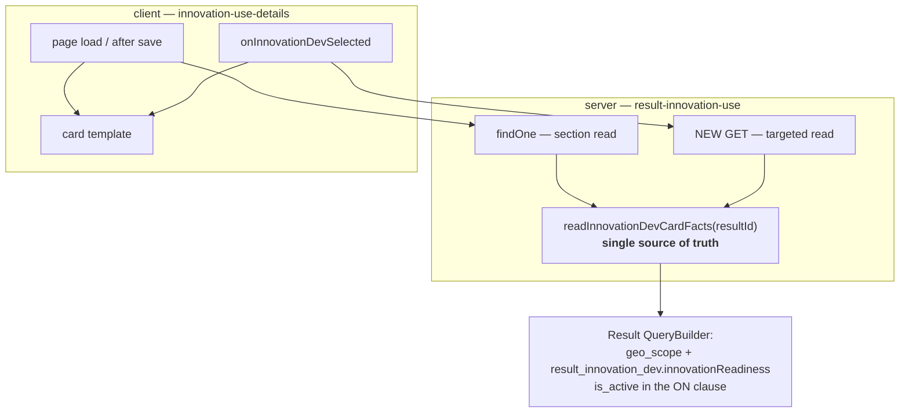

# Design — Innovation Use / Innovation Dev card details

- **Module:** results (`result-innovation-use`) + STAR client (`innovation-use-details`)
- **Spec id:** `docs/specs/innovation-use/dev-card-details`
- **Status:** draft — **revision 3**, post Judgment Day round 2 (terminal: ESCALATED, remediated under the ordinary Adjust loop)
- **Owner:** ARI squad
- **Linked requirements:** [`./requirements.md`](./requirements.md)
- **Judgment ledger:** [`./judgment.md`](./judgment.md)
- **Linked detailed design:** `../../../trd/trd.md` §2.4 (ADRs), §API contracts
- **Last updated:** 2026-09-10

> **The answer first:** one read method shared by two entry points — the existing section read and a
> **new targeted endpoint** the client calls when a reporter picks an innovation. Plus a template
> restructure. **One new file** (the new endpoint's response DTO); no migration, no new controller.
>
> **Citations are by symbol name, not line number**, per this repo's `FP-50` convention: revision 1
> carried four drifted line ranges and the drift was itself a finding (`judgment.md` G2).

---

## 0. Revision history

| Rev | Date | Why |
| --- | --- | --- |
| 1 | 2026-09-10 | First draft |
| **2** | **2026-09-10** | **Judgment Day round 1 — 7 SEVERE, 7 WARNING, 4 SUGGESTION, all confirmed and applied.** Two of them changed the design rather than its prose: `S3` (the prescribed query would have dropped the parent row) and `S4` (the card is populated client-side from the picker option, so the section read alone cannot satisfy the request). `S4` reopened a user ruling — resolved 2026-09-10 in favour of a targeted read. Two more (`S1`, `S7`) were false factual claims that had propagated into `requirements.md` and were swept from both documents. Ledger: [`judgment.md`](./judgment.md) |
| **3** | **2026-09-10** | **Judgment Day round 2 — 5 new SEVERE + 4 carried partials, all applied.** Round 2's findings were overwhelmingly **consequences of round 1's own fixes**: `N-1` the new endpoint widened read access and `R-IUC-008` could not detect it; `N-2` the security-review waiver stood on a ground the same file contradicted; `N-3` `S3` was fixed in mechanism but left ungated, with `NFR-IUC-001`'s disqualifier self-cancelling; `N-4` no guard against out-of-order enrichment (**the only new finding both judges reached independently**); `N-5` the URL paths and the `/v1` prefix were wrong in every document, and `DD-2` rested on a prefix that does not exist. The judgment lineage is **exhausted at ESCALATED** — this revision is an ordinary Adjust round, authorized by the user, **not** a third judgment round. Ledger: [`judgment.md`](./judgment.md) |

---

## 1. Goals & non-goals

**Goals**

1. Return three read-only facts about the linked result on the section read — `R-IUC-001`, `R-IUC-002`.
2. Make the card show those facts **at selection time**, identical to the saved state — `R-IUC-007`.
3. Render the card as prose rather than a property list — `R-IUC-003`.
4. Keep the shared link read and the existing contract byte-identical — `R-IUC-005`, `R-IUC-006`.
5. Hold WCAG AA in both themes for **every** new text element, labels and description alike — `NFR-IUC-002`.

**Non-goals**

- Any change to `LinkResultsService.findAndDetails` — three callers (`R-IUC-005`).
- Any change to the **picker's option list** query or its payload.
- Any write path, input DTO field, validation rule, or green-check condition.
- Retrofitting a Swagger response DTO for the **section** read's whole payload (`OQ-4`).
- Repointing `GetGeoFocusService` at CLARISA (`OQ-5`) — a shared service, a separate spec.
- Changing how the app delivers its utility stylesheet (§12 DD-11).
- Any migration, index, or OpenSearch field.

---

## 2. Architecture

Two entry points, **one** read method. That sharing is deliberate: it makes the section read and the
targeted read structurally incapable of disagreeing, which is what `R-IUC-007` AC.2 demands and what
`DC-10` gates.



`shared/` is untouched: no new interceptor, guard, pipe or filter. Envelope, versioning and audit
behavior are inherited unchanged.

### 2.1 Composition

| Path | Change | New? |
| --- | --- | --- |
| `result-innovation-use.service.ts` | `readInnovationDevCardFacts` (shared read) + three sub-keys in `findOne`'s return | edit |
| `result-innovation-use.controller.ts` | One `@Get` route for the targeted read, with `@ApiOperation` + `@ApiOkResponse` | edit |
| `result-innovation-use/dto/innovation-dev-card-facts.dto.ts` | Response shape for the **new** endpoint, `@ApiProperty`-decorated | **NEW FILE** |
| `get-innovation-use-details.interface.ts` | Widen `linked_innovation_dev` — the three new keys **optional** | edit |
| `innovation-use-details.component.ts` | Enrichment call in `onInnovationDevSelected`; one readiness formatter | edit |
| `innovation-use-details.component.html` | Card restructure (§8) | edit |

Co-located `*.spec.ts` on both sides are edited, not created.

> **Revision 1 claimed "No new files" and listed a response DTO as an *edit*. Both were wrong.**
> `ls .../result-innovation-use/dto/` holds only `create-…`, `create-….spec` and `update-…`; the
> section read's handler returns a bare object literal and declares no `@ApiOkResponse`, so **nothing
> in the payload is documented in Swagger today** — not even the four pre-existing
> `linked_innovation_dev` sub-keys. There was no `@ApiProperty` block to extend "in place"
> (`judgment.md` S1). The new endpoint gets a real DTO because the server convention requires every
> **new** endpoint to declare its shape; the section read's undocumented payload is left as-is and
> recorded as `OQ-4`.

### 2.2 Reuse

| Reused | Anchor |
| --- | --- |
| `Result.geo_scope` (`ManyToOne` → `ClarisaGeoScope`) | `result.entity.ts` — property `geo_scope` |
| `ResultInnovationDev.innovationReadiness` (`ManyToOne`) | `result-innovation-dev.entity.ts` — property `innovationReadiness` |
| `Result.result_innovation_dev` (`OneToMany`) | `result.entity.ts` — property `result_innovation_dev` |
| `contrastRatio` helper + both-theme AA pattern | `innovation-use-details.component.spec.ts` — the `NFR-IUL-003` test |
| `data-testid` as an established seam | already used in this component's spec |
| `formatInnovationDevLabel` / `formatInnovationDevUrl` | `innovation-use-details.component.ts` — untouched |

No new entity relation. No new module import.

---

## 3. Data model

**No schema change.** Read-only over five existing columns (file-level anchors in `requirements.md` §5).

### 3.1 The `OneToMany` that cannot fan out

`Result.result_innovation_dev` is `@OneToMany` (typed as an array), but
**`ResultInnovationDev.result_id` is the `@PrimaryColumn`**, so the table holds at most one row per
result. The join is 1:0-or-1 and adds no rows; the read takes `[0]`, never a scalar.

This is a **schema** fact, which is why `NFR-IUC-001`'s bound is sound — but it is *not* a substitute
for asserting the emitted SQL. See DD-3 and §11.

### 3.2 `is_active` on the detail row — and why it must go in the `ON` clause

`result_innovation_dev` extends `AuditableEntity`, so it carries `is_active` (default `TRUE`). The
read filters it — but **not with a nested `where`**.

> **This was the sharpest finding of round 1 (`judgment.md` S3), and revision 1 got it wrong.**
> Expressing the filter the way `relations` allows — `where: { result_id, result_innovation_dev: { is_active: true } }` —
> puts the predicate in the **`WHERE`** clause against a `LEFT JOIN`. A target with **no** detail row,
> or an inactive one, then yields `child.is_active IS NULL` and **the parent `Result` row is excluded
> entirely**. The read returns `null`, and `description` and `geo_scope` — which do not depend on that
> row at all — are lost with it. That directly contradicted §5.1's own rules table, and since
> `innovation_readiness_id` is nullable **and** the detail row is optional, it is the common path, not
> an edge.

**Corrected mechanism:** a `QueryBuilder` with the predicate in the **`ON`** clause:

- `leftJoinAndSelect` the detail relation with the `is_active` condition attached to the join, not the
  `WHERE`.
- `leftJoinAndSelect` the `geo_scope` relation unconditionally.
- `where` constrains only the parent's own id.

The parent row therefore always comes back when it exists, and the detail is simply absent when
missing or inactive. **The emitted SQL is asserted** — see DD-3 and §11 limit 3.

---

## 4. API surface

### 4.1 `GET /api/results/innovation-use/:resultCode` — changed

- **Authorization, stated correctly.** The `@Get` handler carries **only** `@GetResultVersion()` and
  `@ApiOperation`. There is **no `@Roles(...)`** and **no `ResultStatusGuard`** on it — the
  controller's own header says so verbatim (*"No `@Roles(...)` (DD-5): section access is JWT +
  `ResultStatusGuard` only"*), and `ResultStatusGuard` sits on the `@Patch` only. Read access is
  gated by `JwtMiddleware` + `@GetResultVersion()`.
  *(Revision 1 asserted this endpoint "inherits the endpoint's existing `@Roles(...)` and result-status
  guard". Both halves were false — `judgment.md` S2.)*
- **Envelope:** `ServerResponseDto`, unchanged `status` and `description`.
- **Data delta** — `data.linked_innovation_dev` grows from 4 sub-keys to 7:

| Sub-key | Type | Status |
| --- | --- | --- |
| `result_id` | `number` | existing, unchanged |
| `result_official_code` | `number` | existing, unchanged |
| `title` | `string \| null` | existing, unchanged (`?? null` coerced) |
| `platform_code` | `string \| null` | existing, unchanged (`?? null` coerced) |
| `innovation_readiness` | `{ id, level, name } \| null` — **`level` and `name` are each independently nullable** | **new** |
| `description` | `string \| null` | **new** |
| `geo_scope` | `{ code, name } \| null` | **new** |

`linked_innovation_dev` itself stays `null` — not an object of nulls — when there is no link.

- **Versioning: there is no `/v1` on this route, and revisions 1–2 said there was.**
  `main.ts` calls `setGlobalPrefix('api')` and `enableVersioning({ type: VersioningType.URI })` with
  **no `defaultVersion`**; `ResultInnovationUseController` declares **no `@Version`**. `main.routes.ts`
  nests `path: 'innovation-use'` under parent `path: 'results'`. The **already-shipped client** is the
  decisive evidence: `api.service.ts` builds `` `results/innovation-use/${resultCode}` ``. So the route
  is `api/results/innovation-use/:resultCode` — wrong on three counts in both prior revisions
  (`judgment.md` N-5). Nothing here needs a version bump: the delta is additive and non-breaking.
- **Swagger:** unchanged, and **undocumented** — there is no response DTO for this handler and this
  spec does not add one (`OQ-4`). The three new sub-keys inherit the same undocumented status as the
  four existing ones.

### 4.2 A new targeted read — added

Required by `R-IUC-007`. On the **existing** `result-innovation-use` controller, which already carries
`@ApiTags('Results Innovation Use')` and `@ApiBearerAuth()`.

**Route — decided here, which revision 2 failed to do.** `requirements.md` §6 delegated the path *to
this document* (*"Exact path is a design decision"*) and revision 2 left it unstated (`judgment.md`
N-5 / N-B2). It is:

```
GET /api/results/innovation-use/innovation-dev-card/:resultCode(\d+)
```

The **literal segment comes first**, deliberately. The controller's only existing `@Get` is the bare
`RESULT_CODE = ':resultCode(\d+)'` at the controller root, and two bare digit-only patterns on one
controller resolve by declaration order — a collision waiting to happen. A leading literal cannot
collide with a bare parameter segment regardless of order.

- **Input:** one Innovation Development result id. Nothing else — no filter, no free text, no paging.
- **Output:** the three facts plus the id, and **only** those (`R-IUC-008` AC.3).
- **Authorization:** `JwtMiddleware` (not added to any exclusion list). No `@Roles`, no
  `ResultStatusGuard` — matching §4.1's real posture.
- **Target set — bounded, and this is the correction that matters most (`judgment.md` N-1).**
  See DD-13. Revision 2 claimed this endpoint was *"guarded no more loosely than the section read"*.
  That was **false**: the section read's target is pinned by `SetUpInterceptor` → `ResultsUtil.setup()`,
  which hard-filters `platform_code`, `is_active = true` and `is_snapshot = false`, and it reaches a
  foreign result only through an existing link row. An unbounded id reader would make soft-deleted and
  snapshot results' free text readable — **which no existing endpoint permits**. The three predicates
  are now mandatory (`R-IUC-008` AC.6–AC.9).
- **Swagger:** `@ApiOperation` + `@ApiOkResponse({ type: … })` against the new DTO — mandatory, it is
  a new endpoint.
- **Side effects:** none. No write, no audit row, no status transition.

### 4.3 Untouched

`PATCH` on the same path; `GET /api/link-results/details/:resultCode`; and
`GET /api/results?indicator-codes=2` (the picker's source).

---

## 5. Workflows & business rules

### 5.1 `readInnovationDevCardFacts(resultId)` — the shared read

One `QueryBuilder` (§3.2), projecting each value `?? null`. Called by both entry points, so neither
can drift from the other.

| Case | Result |
| --- | --- |
| Target has an active detail row with a readiness | `innovation_readiness: { id, level, name }`, each part as stored |
| Target has **no** detail row | `innovation_readiness: null`. `description` and `geo_scope` **still returned** (§3.2) |
| Detail row exists but `is_active = FALSE` | Same as no row (DD-4) |
| `innovation_readiness_id` is NULL | `innovation_readiness: null` |
| Readiness row exists but `level` and/or `name` is NULL | The object is returned with the null part(s) as `null`. **The client guards each part** (DD-9) |
| `description` / `geo_scope_id` NULL | That key `null`. Never `''`, never `0` |
| `geo_scope_id = 50` (*yet to be determined*) | Returned like any other — a real CLARISA row, not a sentinel |
| Target result row does not exist | All three `null`. **Never throws** |

### 5.2 Section read (`findOne`)

Unchanged through `innovationDevLink = innovationDevLinks?.[0] ?? null`, then: when the link is
non-null, call §5.1 with `innovationDevLink.other_result_id` and spread the three sub-keys. When it is
null, §5.1 is **not** called — zero extra queries.

> **On the "target row not found" case.** Revision 1 listed it as a rule and justified it with
> `R-IUC-001` AC.3, which is about a *different* case (no link at all). It is also **unreachable on
> this path as the code stands**: `findAndDetails` loads `other_result` as a relation and the existing
> return dereferences `innovationDevLink.other_result.result_id` unguarded, so a missing target would
> already throw upstream. Kept in §5.1's table because the **targeted read** (§4.2) *can* be called
> with an unknown id, where it is reachable and must not throw. `judgment.md` G4.

### 5.3 Selection-time enrichment (client)

`onInnovationDevSelected` today builds `linked_innovation_dev` from the picker option with exactly
four keys (`result_id`, `result_official_code`, `title`, `platform_code`). It gains: after setting
those four, call §4.2 for the chosen id and merge the three facts into the same signal.

| Rule | Behavior |
| --- | --- |
| In flight | Card shows title + anchor. **No** placeholder, no skeleton for the three fields |
| Resolves | The three fields appear; content identical to what the section read would give |
| Rejects / times out | Card stays at title + anchor. **No** blocking error, **no** invalid state, and the link stays savable — enrichment is never a gate on reporting (`R-IUC-007` AC.5) |
| Selection changes | The three fields are **cleared first** by the existing synchronous rebuild, then re-resolved (`DC-12`) |
| **A superseded response settles late** | **Discarded, not merged.** Before writing, the handler compares the resolved id against the *currently selected* id and drops the response if they differ (`DC-15`) |
| Same id re-selected **after a success** | Existing early-return (`current.linked_innovation_dev?.result_id !== resultId`) short-circuits; no refetch |
| Same id re-selected **after a failure** | **Must re-attempt.** The early return alone would make one failure a dead end for the session (`DC-16`… see DD-14) |

### 5.4 Every explicit clause, mapped

> **Twice-corrected, and the second time the correction itself was the defect.** Revision 1 claimed to
> cover "each" clause and covered 12 of 14, one omission being a **reachable forbidden render**
> (`judgment.md` S5). Revision 2 fixed the render but asserted *"all 14"* when
> `grep -c "BUT it must NOT"` + `grep -c "AND IT MUST"` gave **21** — and its footnote explained what
> the wrong number counted, which actively removes a re-checker's reason to recount. That is the S5
> class reproduced by its own fix.
>
> **Revision 3 states no total.** The count is a moving target — this revision added seven more clauses
> — and a stale number is worse than none. The instruction instead: **run those two greps and check
> every hit has a row.** A count in prose cannot be trusted; a command can be re-run.

| # | Requirement + clause | Mechanism |
| --- | --- | --- |
| 1 | `R-IUC-001` — must NOT read the Use result's own readiness | §5.2 keys off `other_result_id`; §4.2 off its path param. `DC-1` falsifies |
| 2 | `R-IUC-001` — MUST return present-and-`null` | §5.1's `?? null` on every projection |
| 3 | `R-IUC-002` — must NOT truncate on the server | §5.1 projects `description` verbatim; clamp is CSS only (DD-6) |
| 4 | `R-IUC-002` — must NOT substitute `''` for NULL | `?? null`, never `?? ''` |
| 5 | `R-IUC-003` — must NOT render a `Description:` label | §8.1 has no label element for it; `DC-6` falsifies |
| 6 | `R-IUC-003` — MUST keep the anchor href format | §8.1 leaves the `<a>` and `formatInnovationDevUrl` untouched |
| 7 | `R-IUC-003` — must NOT render `null` / `Level null` / a bare `Readiness level:` | **DD-9's per-part guards.** Was the S5 gap |
| 8 | `R-IUC-003` — MUST leave the row valid with one field absent; remaining field not centred/stretched/re-flowed | DD-7: `flex` + `gap` + `flex-wrap`, no `justify-between` |
| 9 | `R-IUC-004` — must NOT truncate in the DOM | DD-6: CSS `line-clamp`; full text stays in the DOM |
| 10 | `R-IUC-004` — must NOT clamp by character count | DD-6 rejects a JS/pipe truncation explicitly |
| 11 | `R-IUC-005` — must NOT gain `innovation_readiness` / `description` / `geo_scope` on its linked results | §1 and §2.1: `findAndDetails` is not in the edit list. DD-1 |
| 11b | `R-IUC-005` — must NOT gain new relations, new queries or new latency | Same fact, stated separately because revision 2 merged the two into one row while giving every other multi-clause scenario a row each (`judgment.md` N-8) |
| 12 | `R-IUC-006` — must NOT encounter a renamed/retyped/removed key | §4.1's table marks all four unchanged; `DC-3` asserts the full shape |
| 13 | `R-IUC-006` — must NOT be an object when there is no link | §4.1's closing sentence; §5.2 leaves the null branch untouched |
| 14 | `R-IUC-007` — must NOT block/disable/delay the save while in flight | §5.3: enrichment writes only the three keys; the save path never reads them |
| 15 | `R-IUC-007` — must NOT leave a previous selection's values visible | §5.3: clear-then-resolve. `DC-12` falsifies |
| 16 | `R-IUC-007` — must NOT resolve the scope name from any client-side list | §4.2 returns the CLARISA name. DD-10 records why the client list is unusable |
| 17 | `R-IUC-007` (failure) — must NOT surface a blocking error or mark the section invalid | §5.3's reject row. `DC-11` falsifies |
| 18 | `R-IUC-007` (failure) — MUST leave the link savable | §5.3's reject row |
| 19 | `R-IUC-008` — must NOT be added to a middleware exclusion list | §4.2's authorization bullet |
| 20 | `R-IUC-008` — must NOT return partial data on an auth failure | `JwtMiddleware` rejects before the handler runs; nothing to partially return |
| 21 | `R-IUC-007` — must NOT render A's values under B's title and anchor | **DD-14's id comparison before the merge.** `DC-15` falsifies; `DC-12` structurally could not |
| 22 | `R-IUC-007` — MUST hold whichever order the responses settle in | Same guard — it is order-independent by construction, not by timing luck |
| 23 | `R-IUC-007` — MUST stay recoverable: re-selecting re-attempts | **DD-14's second rule** — the early return is conditioned on the prior attempt succeeding |
| 24 | `R-IUC-008` — must NOT return an out-of-bounds target's free text | **DD-13's three predicates** via `filterResultByIndicators` + `is_snapshot` |
| 25 | `R-IUC-008` — must NOT distinguish out-of-bounds from unknown by status, message, field or timing | DD-13's identical-response rule — no existence oracle |
| 26 | `NFR-IUC-002` — the real background pair | DD-5 measures against `--ac-grey-100`, and §8.3 covers **the description too** |

*(Numbered 1–21 because six requirement clauses were added in revision 2; the "14" in the heading is
the count of `BUT`/`AND IT MUST` clauses, several of which carry more than one obligation.)*

---

## 6. Frontend (Admin SSR panel) impact

**None.** The `/admin` React panel does not render Innovation Use.

---

## 7. Integration impact

| System | Impact |
| --- | --- |
| CLARISA | Read-only, through two already-imported catalogs — `clarisa_innovation_readiness_levels` and **`clarisa_geo_scope`** (singular; revision 1 pluralized it in both documents — `judgment.md` G1). No new sync or import. Both names come from CLARISA on the **server**, never restated client-side |
| OpenSearch / Socket.IO / RabbitMQ / DynamoDB / AGRESSO / TIP / ROAR | None |
| STAR client | In scope for this spec (monorepo spec, as children #3 and #4 were). §8 |

---

## 8. Frontend / UX component architecture (STAR)

### 8.1 Markup

Today the card is a **single flex row** — `div.flex.items-center.justify-between` holding the title
span and the anchor. It becomes an **outer block** wrapping that same row:

```
div  (block; padding / border / bg classes unchanged)
├── div.flex.items-center.justify-between        ← title span | anchor   [CLASS LIST UNCHANGED]
├── p     [data-testid]  text-[var(--ac-grey-800)]  line-clamp-3          ← description, NO label
└── div.flex.flex-wrap  (gap)                                            ← the two labelled fields
    ├── span   "Readiness level:" (font-medium) + value
    └── span   "Geographic scope:" (font-medium) + value
```

Each of the last two children is wrapped in its own `@if`, so a null field contributes **no element**.
The readiness value's parts are guarded **individually** — DD-9.

### 8.2 Reversion challenge (Step 2.3)

**Trigger:** the outer container loses `flex items-center justify-between`, behavior child #4 ships.

**Question:** *what does removing this break?*

**Answer — a real breakage.** `items-center` vertically centres the anchor against a title that can
wrap to two lines; `justify-between` pushes it to the right edge. Both are load-bearing.

**Design response:** the outer becomes a block and the **title + anchor keep their own inner row with
the identical class list**. The existing row is *nested*, not replaced.

> **What holds this — corrected.** Revision 1 said `R-IUC-003` AC.6 was "the assertion that holds
> this". It is not: AC.6 covers *text, href format and accessible name* and would stay green whether
> the fix is present or not (`judgment.md` W5). The class-list preservation is assertable in the DOM
> (and should be), but the **alignment itself is layout**, which §11 lists as structurally
> unreachable. It is held by the **human visual check** and by nothing else. Saying otherwise removes
> the reason to look.

### 8.3 Token plan

The card's fill is `--ac-grey-100` (`#f4f7f9` light / `#2b2b2b` dark). Contrast of each candidate
against **that** fill, per WCAG 2.1 relative luminance:

| Token | Light on `#f4f7f9` | Dark on `#2b2b2b` | Verdict |
| --- | --- | --- | --- |
| `--ac-grey-600` `#8d9299` / `#949494` | **2.91:1** ❌ | **4.67:1** ⚠️ | Fails AA in light; clears it in dark by only 3.7% |
| `--ac-grey-700` `#777c83` / `#acacac` | **3.91:1** ❌ | **6.24:1** ✓ | Fails AA in light for normal text |
| `--ac-grey-800` `#4c5158` / `#c2c2c2` | **7.44:1** ✓ | **7.95:1** ✓ | **Chosen** — AAA both themes |

> Revision 1 put `6.2:1` in the grey-600 **dark** cell — that is grey-700's value, copied one row up.
> Both judges independently recomputed **4.67**, as did the orchestrator (`judgment.md` W1). DD-5's
> conclusion is unaffected; the false figure is not.

**All three new text elements use `--ac-grey-800`** — the two labels **and the description**. The label
recedes by `font-medium` weight, not by lower contrast. No new token.

> **The description was the S6 gap.** `NFR-IUC-002` covers *"labels **and the description text**"*.
> Revision 1's §8.1 gave the `<p>` no color class, and nothing in the card or its ancestors sets one —
> it would have inherited the UA default black, ≈ **1.45:1** on the dark-theme fill. Half of the one
> NFR the document flagged as carrying real risk was undischarged. It is now explicit, and §11's AA
> assertion covers all three elements.

> ⚠️ These figures are **computed in a document, not measured in a browser**. They must be re-derived
> inside the gating test from `colors.scss`, and the test must name the background token it used.

### 8.4 States

| State | Card |
| --- | --- |
| No link | No card (unchanged) |
| Just selected, enrichment in flight | Title + anchor only. No placeholder, no skeleton |
| Just selected, enrichment resolved | Identical to the saved state for the same result (`R-IUC-007` AC.2) |
| Just selected, enrichment failed | Title + anchor. Link still savable. No error dialog |
| Loaded / after save | Title + anchor / description / labelled row |
| Some fields null | Only the present pieces; no placeholder, no reserved space |
| Responsive | The labelled row is `flex-wrap` — the two fields stack at narrow widths |
| Picker load error | Unchanged — child #4's existing banner above the card |

---

## 9. Security & authorization

No authorization is added or removed. Both reads sit behind `JwtMiddleware`; neither carries `@Roles`
(§4.1 states the real posture, which revision 1 got wrong).

**The one property worth stating:** all three values belong to a **different** result than the one
being viewed, returned without re-checking the caller's permission on that other result. This is
**not a new class of exposure** — the section read already returns that foreign result's `title` and
`result_official_code` on the same basis, because child #4's `R-IUL-002` makes **any active**
Innovation Dev result linkable by anyone, with no ownership, contract or center filter. The link is
the authorization.

`R-IUC-008` is the requirement that keeps the new endpoint from becoming a *broader* read than that:
one id in, four fields out, nothing else.

Nothing here is a secret, a credential, or personal data.

---

## 10. Observability

No new log call on the success path — status-based logging is already wired in `ResponseInterceptor`.
A missing target row is a normal outcome (§5.1), not a warnable condition.

The **new** endpoint's failures flow through `GlobalExceptions` like every other. Note for the
implementer: a thrown `BadRequestException` never reaches `ResponseInterceptor` — that interceptor
runs only inside `next.handle().pipe(map(...))` and has no `catchError`; `GlobalExceptions` handles it.
That correction is recorded in this module's own service header and is repeated here so it is not
rediscovered.

---

## 11. Testing strategy

| Lane | Harness | Covers | Structurally cannot reach |
| --- | --- | --- | --- |
| Server unit | **Jest**, `rootDir: src` | DC-1, DC-2, DC-3, DC-4, DC-13, DC-16 | `test/` and the other jest configs; **a mocked repo's emitted SQL** |
| **Server fixtures** | **`npm run test:fixtures`** (`test/jest-fixtures.json`) | **DC-14** — the `getQuery()` / `ON`-clause assertion, and the behavioural read against a target with no detail row | Client rendering |
| Client unit | **Jest + jsdom** | DC-5, DC-6, DC-7, DC-10, DC-11, DC-12, **DC-15** | **Layout of any kind**, and the utility stylesheet itself |
| Human visual | A person, at the HITL pause | **DC-8**, §8.2's alignment | — |
| *(none — by decision)* | — | **DC-9** — the CDN stylesheet dependency | Accepted pre-existing risk (`R-5`, DD-11); listed so the class appears in a lane table rather than nowhere (`judgment.md` N-7) |

> **`DC-14` needed its own lane, and revision 2 gave the assertion no home at all.** It prescribed
> *"assert `getQuery()`"* two rows below a table that declared *"a mocked repo's emitted SQL"*
> structurally unreachable in the only lane that existed — so the gate for round 1's sharpest finding
> lived in prose and in no harness. `test:fixtures` is a real, already-configured tier
> (`package.json` → `"test:fixtures": "jest --config ./test/jest-fixtures.json"`) and it is where an
> emitted-SQL assertion belongs. `judgment.md` N-3.

> Revision 1 called the client harness **"Karma + jsdom"**. It is `jest --config jest.config.ts`; there
> is no `karma.conf.*` in the package (`judgment.md` W3). This is not cosmetic — **Karma is a
> real-browser runner and does lay out**, so had the name been right, §11 limit 1 and
> `NFR-IUC-003`'s entire "no automated gate for layout" premise would collapse. Only the reasoning
> matched reality. `requirements.md` carried the same error and was swept.

**Four named limits, stated rather than discovered:**

1. **jsdom does not lay out.** It cannot confirm the two labelled fields share a row, that the clamp
   clamps, or that a null field left no visible gap.
2. **The utility classes do not exist under the test harness at all.** There is no Tailwind in this
   build — no dependency, no config — the utilities come from a **runtime CDN script**
   (`src/index.html` → `unpkg.com/@tailwindcss/browser@4.1.6`). Under jsdom that script never runs, so
   `line-clamp-3`, `flex-wrap` and `gap` are inert strings. A class-presence assertion therefore
   proves presence, not effect — and here it *cannot* be otherwise, because there is no stylesheet to
   have an effect. **This is the structural reason limit 1 bites**, and revision 1 attributed it to
   jsdom's layout gap alone (`judgment.md` W7). DD-11.
3. **The emitted SQL must be asserted, not the call count — unconditionally.** This limit has now
   been wrong twice in opposite ways. Revision 1 prescribed a `relations` load and cleared
   `NFR-IUC-001`'s disqualifier by citing §3.1's prose, so the gate could not fail for the defect it
   was named against (`W4`). Revision 2 switched to a `QueryBuilder` — and thereby made the
   disqualifier **stop firing**, because it was worded *"if the implementation uses `relations`
   rather than an explicit join"*: a `QueryBuilder` **is** an explicit join, so the governing
   verification silently reverted to the mocked-repo call-count assertion the disqualifier existed to
   forbid (`judgment.md` N-3). `NFR-IUC-001` has been rewritten to hold **whatever query API is
   chosen**, and the assertion is routed to the `test:fixtures` lane above. Falsifier: move the
   `is_active` predicate from `ON` to `WHERE` → `DC-14` reddens, which is `S3` verbatim.
4. **`npm test` on the server has `rootDir: "src"`** and never runs `test:e2e` or `test:integration`
   (`KZ-017`). If a fixture tier covers this contract, `tasks.md` names it explicitly.

**Cross-cutting rules for every gate:**

- `K-004` / `KZ-014` — no gate counts as evidence until it has been **observed red** for the reason it
  exists. `requirements.md` §8 names the falsifying input for each defect class.
- `KZ-001` — assert on the **rendered DOM**, never a component-instance getter.
- `KZ-015` — fixtures arrange the **transition**. And note that revision 1's `KZ-015` instruction
  described a transition **the product does not perform**: it said to seed `linked_innovation_dev` and
  `detectChanges()`, but the product builds that object *from the picker option* in
  `onInnovationDevSelected`. A fixture seeding a full 7-key object would have stayed green while the
  real path rendered nothing (`judgment.md` S4). **Fixtures for `R-IUC-007` must drive
  `onInnovationDevSelected` and the enrichment call, not the signal directly.**

---

## 12. Design decisions log

### DD-1 — The shared read lives on `ResultInnovationUseService`, not on `findAndDetails` or `ResultsService`

`LinkResultsService.findAndDetails` has three callers: `result-policy-change.service.ts`,
`link-results.controller.ts`, and this module. Widening it would change two responses nobody asked to
change. Child #4 declared the same function out of scope for the same reason.

> **Correction:** revision 1 called `link-results.controller.ts` a "**public endpoint**". It carries
> `@ApiBearerAuth()` and is **not** in `JwtMiddleware`'s exclusion list — it is *authenticated and
> generic*, not anonymous (`judgment.md` G3). The rejection stands on the three-caller blast radius
> alone; the "public" framing overstated it and is withdrawn.

A new method on `ResultsService` was also rejected: it publishes a shared surface for one card in one
module, which is how the next module ends up coupled to it.

### DD-2 — Additive-only on the section contract; no `/v2`

The four existing sub-keys keep names, types and `?? null` coercion. Additive object properties are
non-breaking, so `/v1` stays and no coordinated release is needed. `R-IUC-006`.

### DD-3 — `QueryBuilder` with the `is_active` predicate in the `ON` clause, and assert the SQL

Two decisions in one, both forced by round 1. The mechanism is `ON`-clause, not nested `where` (§3.2,
`judgment.md` S3). And the gate is an assertion on `getQuery()`, not a call count (§11 limit 3,
`judgment.md` W4). `[0] ?? null` on the relation array, justified from the primary key (§3.1).

### DD-4 — Filter `is_active` on the detail row; do **not** filter it on the linked result

| Row | Filtered? | Why |
| --- | --- | --- |
| `result_innovation_dev` | **Yes**, in the `ON` clause | `ResultInnovationDevService.update` reads its own row as `{ result_id, is_active: true }` and throws `NotFoundException` when absent — the owning module already treats an inactive detail row as **not there** |
| `results` (the link target) | **No** | Child #4 chose this deliberately so an invalid link stays **visible** rather than silently blank. Do not "fix" it here |

**Not verified:** whether anything actually sets `result_innovation_dev.is_active = FALSE`. The rule is
defined for correctness either way; reachability is unmeasured and not claimed.

### DD-5 — All three new text elements use `--ac-grey-800`; differentiate by weight

`--ac-grey-600` (2.91:1) and `--ac-grey-700` (3.91:1) both fail AA in light theme on the card's fill.
`--ac-grey-800` holds 7.44:1 light / 7.95:1 dark. Labels get `font-medium`; the description and the
values get normal weight. **The description is included** — it was revision 1's S6 gap (§8.3).

### DD-6 — CSS `line-clamp-3`, never a JS or pipe truncation

A character-count truncation cuts mid-word, varies with font metrics, and **removes text from the
DOM**, breaking `R-IUC-004` AC.2 and contradicting `R-IUC-002` AC.1. `line-clamp` is visual only.

> **Revision 1 justified this limit with a false precedent** — *"this repo has already certified a
> clamp whose classes were all present and whose effect was a no-op."* That sentence is real, but it
> comes from an unrelated bilateral fixture spec where **"clamp" means "a bound the test only checked
> by presence"**; the actual case was a boolean data-fidelity field proved by 140-vs-170 arithmetic,
> with no CSS and no layout. No recorded incident of a CSS `line-clamp` shipping non-functional exists
> in this repo. It had propagated into `requirements.md` too and was swept from both
> (`judgment.md` S7 — the `KZ-007` artifact class). The limit still holds, on §11 limits 1 and 2.

### DD-7 — The labelled row is `flex` + `gap` + `flex-wrap`, not `justify-between`

**Chosen for the wrap behavior**: at narrow widths the two fields stack instead of overflowing, and a
lone surviving field stays left-aligned in place.

> **Revision 1's stated reason was wrong.** It claimed a lone item under `justify-between` "would
> stretch to the row's full width". It would not: `space-between` places a single item at main-start,
> and a `<span>` has `flex-grow: 0` (`judgment.md` W6). The alternative was never unsafe for that
> reason. The decision survives on wrap behavior; the recorded trade-off is corrected so a future
> reader does not carry away a false CSS rule.

### DD-8 — A `data-testid` on the description

The description has **no label** by design, so no test can find it by label text, and finding it by
DOM position would break on any reordering. `data-testid` is an established seam in this very
component's spec. The assertion stays on the **rendered** element (`KZ-001`); the hook only locates it.

### DD-9 — Render the readiness by **per-part** guards

`clarisa_innovation_readiness_levels.level` **and** `.name` are each `nullable: true`. An object-level
`@if` alone therefore renders `Level null - <name>`, or a bare `Readiness level:` when both are null —
two strings `R-IUC-003` forbids **by name**, and reachable from the schema this design reads
(`judgment.md` S5).

Rules: both present → `Level <n> - <name>`. `name` only → the name alone. `level` only → `Level <n>`.
Neither → render **nothing**, not even the label. Implemented in a small pure function beside
`formatInnovationDevLabel`, unit-testable without the component.

**`OQ-1` can still overrule the joined format** — it is one function.

### DD-10 — The scope **name** is resolved on the server, never on the client

The client already has `geo_scope_id` in the picker option, so resolving the name locally looks free.
It is not: **`GetGeoFocusService` is a hardcoded client-side list that omits code `3`
(`MULTI_NATIONAL`)**, so such a result would render no scope at all — and it is a parallel taxonomy,
which the client convention forbids (*controlled vocabularies come from CLARISA*). The server resolves
both names from CLARISA for both entry points. Fixing that service is `OQ-5`, a separate spec.

### DD-11 — The utility stylesheet is a runtime CDN dependency; this spec accepts it and does not change it

Verified: no `tailwindcss` dependency, no `tailwind.config.*`; `src/index.html` loads
`unpkg.com/@tailwindcss/browser@4.1.6` under SRI. Every layout class this spec adds is generated in
the browser by a third party. A CDN outage or SRI mismatch silently removes the clamp, the flex row
and the wrap — `DC-8`'s failure shape with an external trigger, recorded as `DC-9` / `R-5`.

**Accepted, not fixed.** It is pre-existing and platform-wide; changing the app's styling delivery is
not this spec's business. Recorded so no reviewer is told *"the clamp is just a CSS class"* without
knowing where that CSS comes from (`judgment.md` W7).

### DD-13 — The targeted read's target set is bounded by three predicates, using the mechanism this repo already has

`R-IUC-008` AC.6–AC.9. The read resolves its target through a set bounded by
**`indicator_id = 2`**, **`is_active = TRUE`** and **`is_snapshot = FALSE`**, and an out-of-bounds id
is **indistinguishable from an unknown one**.

**Why all three, and why indistinguishable:**

| Predicate | What it prevents |
| --- | --- |
| `indicator_id = 2` | Reading any other result category's free text through an Innovation-Use endpoint |
| `is_active = TRUE` | Reading a **soft-deleted** result's description — which no existing endpoint permits |
| `is_snapshot = FALSE` | Reading a **snapshot** row's description — likewise |
| Identical response for all out-of-bounds cases | An endpoint that separates *"does not exist"* from *"exists but is out of bounds"* is an **existence oracle** over the results table |

**Mechanism — already in the codebase, and the design should have reached for it in revision 2:**
`ResultsService.filterResultByIndicators` filters `indicator_id: In(indicators)` **and**
`is_active: true`, and `LinkResultsService.saveLinkResults` already uses it to bound the linkable set.
`is_snapshot = FALSE` is added alongside, matching `ResultsUtil.setup()` and the
`GET /api/results` list query, both of which hard-filter it.

> **This is the correction round 2 existed to force (`judgment.md` N-1).** Revision 2 asserted the
> endpoint was *"guarded no more loosely than the section read"* and cited child #4's `R-IUL-002` —
> but that requirement bounds its universe by `is_active = TRUE` **and** `indicator_id = 2`, and the
> endpoint honoured neither. Worse, `R-IUC-008`'s five original acceptance criteria constrained the
> response shape, input arity, method, middleware and Swagger and **nothing constrained the target
> set**, so the requirement written to prevent widening was structurally blind to it. An implementer
> following revision 2 literally would have shipped an arbitrary-result reader with every AC green.

### DD-14 — A superseded enrichment response is discarded; a failed one is retryable

Two rules the async path needs and revision 2 did not state:

**Discard, don't merge.** Before writing, compare the resolved id against the **currently selected**
id; drop the response if they differ. Without it: select A → select B → A settles late → A's readiness,
description and scope render **under B's title and anchor**. `switchMap` has **no precedent** in this
client for a picker selection (it appears in three non-spec files, none of them one), so the id
comparison is the idiom to prescribe rather than a cancellation operator. `DC-15`.

**Retry after failure.** The existing early return fires whenever the picked id equals the stored one,
so after a failed enrichment for A, re-picking A cannot re-trigger the read and the card stays bare
until a save + section re-read. The early return must be conditioned on the previous attempt having
**succeeded**. `R-IUC-007` AC.8.

> `judgment.md` N-4 (**the only round-2 finding both judges reached independently**) and N-6. Note
> `DC-12`'s original falsifier — *"select A, select B, assert"* — **passes green whenever the stub
> resolves promptly**, which is the `KZ-015` vacuous-fixture shape §11 warns about. `DC-15` exists
> because `DC-12` could not see this.

### DD-12 — Enrichment is never a gate on saving

A failed targeted read leaves the card at title + anchor and the link fully savable. The alternative —
blocking or invalidating on a failed *enrichment* read — would let a convenience feature break
reporting. `R-IUC-007` AC.5, `DC-11`.

---

## 13. Budget (Step 2.4 — `/akili-execute` trips against this)

| Metric | Rev 1 | Rev 2 | **Rev 3** |
| --- | --- | --- | --- |
| **Tasks** | 6 | 8 | **10** |
| **LOC** | ~400 | ~620 | **~820** (≈ 260 production, ≈ 560 test) |
| **Review rounds** | ~10 | ~12 | **~14** |

**Why it grew again:** `DD-13`'s bounded target set (three predicates + the indistinguishability rule)
and `DD-14`'s two async rules are each independently testable, and they bring four more defect classes
(`DC-14`…`DC-16` plus `DC-9`'s bookkeeping). `DC-14` also needs a **fixtures-tier** task, a lane the
earlier budgets did not include at all.

**Depth re-check:** **Standard still holds, but it is now at the top of its range.** Ten tasks across
two packages and four lanes is close to the 13–14-task Full-tier specs of children #2 and #3. If
`tasks.md` decomposition lands above 12, the honest move is to **split the spec** — server contract +
endpoint as one child, client card + enrichment as another — rather than to relabel the depth.

> **Provenance, corrected twice.** Revision 1 wrote that *"children #3 and #4 budgeted 23–31 rounds
> and ran 23–30 — for 13–14 tasks"*. Child #4 actually budgeted **~20** at depth **Standard**, not
> Full (`judgment.md` W2, both judges). Revision 2 then derived ~12 from two ratios it called *"real"*
> — but one is a **measured outcome** (child #3: 23 rounds ran) and the other an **estimate**
> (child #4: ~20 budgeted; **no final tally is recorded anywhere in its archive**), so averaging them
> mixes units (`judgment.md` N-9). Stated plainly now: the only **measured** ratio available is child
> #3's **1.64 rounds/task**, which for ten tasks gives ≈ **16**. `~14` is set below that on the
> grounds that this spec has no migration, no green-check change and no write path — **a judgement,
> not a derivation.** Labelling it as one is the point.

Exceeding any of the three is an **escalation to the user**, not a signal to push on.

---

## 14. Open questions

| ID | Question | Owner | State |
| --- | --- | --- | --- |
| `OQ-1` | Readiness as `Level 7 - <name>`, ordinal only, or name only? | Product owner | Open. **DD-9** provisionally; one function to change |
| `OQ-2` | ~~Test hook for the unlabelled description~~ | — | **RESOLVED → DD-8** |
| `OQ-3` | Confirm the geographic scope ships here (it was *"potentially"* in the comment) | Product owner | Open. If dropped: one relation, one sub-key, and DD-10 all fall away |
| `OQ-4` | The section read documents **no** response shape in Swagger — retrofit one for the whole payload? | Engineering lead | Open, **out of scope here**. Surfaced by `judgment.md` S1 |
| `OQ-5` | `GetGeoFocusService` hardcodes the geo-scope catalog and omits code `3` — repoint at CLARISA? | Engineering lead | Open, **out of scope here**. Surfaced while verifying `judgment.md` S4 |

---

## 15. References

- [`requirements.md`](./requirements.md) · [`proposal.md`](./proposal.md) · [`judgment.md`](./judgment.md)
- Family manifest: [`../family.md`](../family.md) — child row #5
- Child #4 (extends its `R-IUL-007`): [`../../archive/2026-09-09-innovation-use--link-innovation-dev/`](../../archive/2026-09-09-innovation-use--link-innovation-dev/)
- Child #3 (the AA precedent in DD-5): [`../../archive/2026-08-26-innovation-use--details-page/`](../../archive/2026-08-26-innovation-use--details-page/)
- Kaizen lessons applied (`staging` lineage): `KZ-001`, `KZ-007`, `KZ-014`, `KZ-015`, `KZ-016`, `KZ-017`, `K-004`
