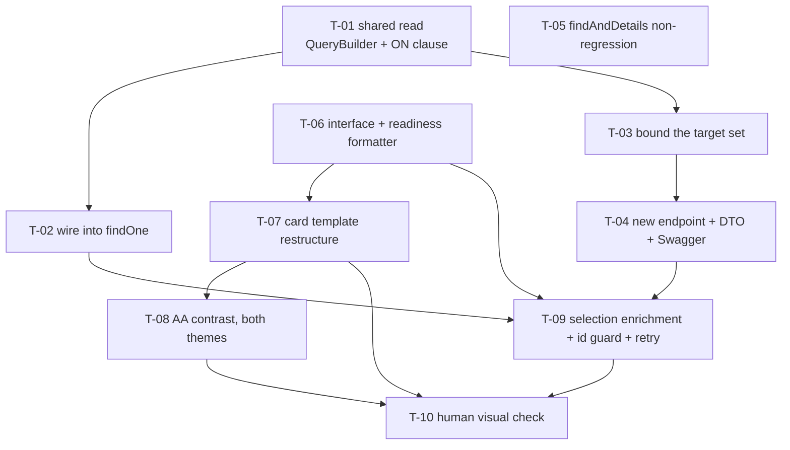

# Tasks — Innovation Use / Innovation Dev card details

- **Module:** results (`result-innovation-use`) + STAR client (`innovation-use-details`)
- **Spec id:** `docs/specs/innovation-use/dev-card-details`
- **Status:** not-started
- **Owner:** ARI squad
- **Linked requirements:** [`./requirements.md`](./requirements.md)
- **Linked design:** [`./design.md`](./design.md) (revision 3)
- **Judgment ledger:** [`./judgment.md`](./judgment.md)
- **Last updated:** 2026-09-10

> **Budget from `design.md` §13 — `/akili-execute` trips against this:** **10 tasks · ~820 LOC ·
> ~14 review rounds.** ⚠️ **Re-baselined 2026-09-10 to ~1,450–1,600 LOC** after T-01 measured **838** on its own — the test-LOC figure never costed the fixtures tier it mandates. See `design.md` §13's re-baseline block; **review rounds, not LOC, are now the figure to watch** (T-01 spent 3 of ~14). This decomposition lands **exactly at 10**. §13's own escalation rule stands:
> if execution needs to add tasks and the count passes **12**, the honest move is to **split the spec**
> (server contract + endpoint as one child, client card + enrichment as another) — not to relabel the
> depth.

---

## 1. Task numbering and lanes

`T-<NN>` within the spec. Numbers do not imply priority — see §2.

**Execution lane is part of each task** (user ruling 2026-09-10): server tasks are worked directly in
the main session; client tasks are delegated to **Antigravity** via the `orchestration` skill.

| Lane | Tasks | Who |
| --- | --- | --- |
| **server** | T-01 … T-05 | Main session, directly |
| **client** | T-06 … T-09 | Delegated to Antigravity |
| **human** | T-10 | A person, at the HITL pause — no agent can do it |

> **Delegation hazards, recorded so they are not rediscovered.** `worker-start --agent gemini` is
> disabled on this install — launch via `terminal create --command "agy …"` then
> `orchestration dispatch --inject`, which preserves Run/Task/Dispatch provenance. **Re-probe
> `agy models` before choosing a slug** (the list has drifted twice, in both directions), and note
> `gemini-3.1-pro` has **no `-medium`**. And the one that matters most: **a silent worker is a runtime
> failure, not a clean result.** Record non-delivery as a failure and re-dispatch; never read absence
> of signal as "found nothing". Release every worker when its task closes.

---

## 2. Dependency graph

**No cycles.** `T-05` is independent of everything — it is a guard that the rest of the spec did *not*
touch a shared reader, so it can run at any point (and should run **last** on the server lane, when
there is a diff to guard).

**Cross-package overlap is safe for editing:** the server lane (T-01…T-05) and the client lane's
first three (T-06…T-08) may proceed concurrently. **T-09 cannot start until T-04 lands**, because it
calls that endpoint. Per the repo concurrency rule, **the Leader re-measures the full suite after each
worker reports — never while one is active**, and never two full-suite runs at once.

---

## 3. Task list

### T-01 — The shared read: `readInnovationDevCardFacts`, with `is_active` in the `ON` clause

- **Lane:** server
- **Requirements covered:** `R-IUC-001`, `R-IUC-002`, `NFR-IUC-001`
- **Design references:** §3.1, §3.2, §5.1, `DD-3`, `DD-4`
- **Defect classes gated:** `DC-14`, `DC-2`
- **Files touched (intended):**
  - `server/researchindicators/src/domain/entities/result-innovation-use/result-innovation-use.service.ts`
  - `server/researchindicators/src/domain/entities/result-innovation-use/result-innovation-use.service.spec.ts`
  - `server/researchindicators/test/` — one fixtures-tier spec for the emitted SQL
- **Description:** Add a private method that, given a result id, returns `{ innovation_readiness, description, geo_scope }` for that result. It is the single source of truth for both entry points (T-02's section read and T-04's endpoint), which is what makes them structurally unable to disagree.
- **Implementation notes:**
  - Use a **`QueryBuilder`**, not `relations`. `leftJoinAndSelect` the detail relation **with the `is_active` condition attached to the join**; `leftJoinAndSelect` `geo_scope` unconditionally; `where` constrains only the parent id.
  - Take `[0] ?? null` of the `result_innovation_dev` array. It is `@OneToMany` but `result_id` is the child's `@PrimaryColumn`, so it holds at most one row (§3.1).
  - Project every value `?? null`. Never `?? ''` and never `?? 0`.
  - `innovation_readiness` returns `{ id, level, name }` with **each part as stored** — `level` and `name` are independently nullable. Do **not** collapse a partially-null readiness to `null` here; the client guards the parts (T-06).
- **Acceptance / done check:**
  - [x] With a target holding an active detail row and a readiness, all three facts return
  - [x] With a target holding **no** detail row, `innovation_readiness` is `null` **and `description` and `geo_scope` still return**
  - [x] With a target whose detail row is `is_active = FALSE`, same as no row
  - [x] With `innovation_readiness_id` NULL, `innovation_readiness` is `null`
  - [x] With `level` NULL and `name` present, the object returns with `level: null` — not collapsed to `null`
  - [x] With `description` NULL, the key is `null` — not `''`
  - [x] With `geo_scope_id = 50`, that scope's CLARISA name returns like any other
  - [x] With a non-existent id, all three are `null` and **nothing throws**
  - [x] **The emitted SQL** (`getQuery()`) carries the `is_active` predicate in the `ON` clause and **not** in `WHERE`
- **Verification:** `npm test -- --silent` (unit) **and** `npm run test:fixtures` (the SQL assertion — the unit lane structurally cannot see emitted SQL).
- **Falsifying input, named before the test is written (K-012):** move the `is_active` predicate from the join condition into `.where(...)`, then read a target that has **no** `result_innovation_dev` row → the parent row is excluded, the read returns `null`, and **both** the "description still returns" criterion and the `getQuery()` assertion go red. This is round 1's `S3` verbatim.
- **What disqualifies the evidence:** a green run over a **mocked** repository proves the call count, not the SQL. `NFR-IUC-001`'s disqualifier now holds unconditionally, whatever query API is used — if the SQL assertion did not run in the fixtures tier, this task is **not** verified, regardless of the unit lane's colour.
- **Skills:** `nestjs-expert`, `error-handling-patterns`
- **Dependencies:** none
- **Estimated effort:** M
- **Status:** **done** (Reviewer PASS 2026-09-10, 3 attempts — see [`./execution.md`](./execution.md))

---

### T-02 — Wire the three facts into the section read

- **Lane:** server
- **Requirements covered:** `R-IUC-001`, `R-IUC-002`, `R-IUC-006`
- **Design references:** §4.1, §5.2
- **Defect classes gated:** `DC-1`, `DC-3`
- **Files touched (intended):**
  - `result-innovation-use.service.ts` (the `findOne` return)
  - `result-innovation-use.service.spec.ts`
- **Description:** In `findOne`, when `innovationDevLink` is non-null, call T-01 with `innovationDevLink.other_result_id` and spread the three sub-keys into `linked_innovation_dev`. When it is null, do not call it at all.
- **Implementation notes:**
  - Key off **`other_result_id`**, never the section's own `resultId`.
  - The four existing sub-keys are constructed **exactly** as before, including the `?? null` coercion on `title` and `platform_code`. Do not touch them.
  - `linked_innovation_dev` stays `null` — not an object of nulls — when there is no link.
- **Acceptance / done check:**
  - [x] The three facts belong to the **linked** result, not the Innovation Use result being viewed
  - [x] The four pre-existing sub-keys are unchanged in name, type and null semantics
  - [x] With no link, `linked_innovation_dev` is `null` and T-01 is **not** invoked
  - [x] With a link, T-01 is invoked **at most once** per read
  - [x] The envelope's `status` and `description` are unchanged from the current read
- **Verification:** `npm test -- --silent`
- **Falsifying input, named before the test is written (K-012):** build a fixture with **two** results whose readiness, description and scope all differ — the Innovation Use result at level 3 and the linked Innovation Dev result at level 7. Point the call at the section's own `resultId` → the level-7 assertion reads 3 and goes red. A single-result fixture **cannot** falsify this (`DC-1`).
- **What disqualifies the evidence:** a fixture in which both results carry the same values. It passes whichever id the code uses, and certifies nothing.
- **Skills:** `nestjs-expert`
- **Dependencies:** T-01
- **Estimated effort:** S
- **Status:** **done** (Reviewer PASS 2026-09-10, 1 attempt — see [`./execution.md`](./execution.md))

---

### T-03 — Bound the target set: three predicates, and no existence oracle

- **Lane:** server
- **Requirements covered:** `R-IUC-008` (AC.6, AC.7, AC.8, AC.9)
- **Design references:** `DD-13`
- **Defect classes gated:** `DC-16`
- **Files touched (intended):**
  - `result-innovation-use.service.ts`
  - `result-innovation-use.service.spec.ts`
- **Description:** The targeted read (T-04) must resolve its target through a set bounded by `indicator_id = 2`, `is_active = TRUE` and `is_snapshot = FALSE`. An out-of-bounds id must be **indistinguishable** from an unknown one. This task exists separately from T-04 because it is the security property, and it is what the revoked security review signs off on.
- **Implementation notes:**
  - Reuse **`ResultsService.filterResultByIndicators`**, which already filters `indicator_id: In(indicators)` **and** `is_active: true`, and which `LinkResultsService.saveLinkResults` already uses for the same purpose. Do not hand-roll the predicate.
  - Add `is_snapshot = FALSE` alongside — `ResultsUtil.setup()` and the `GET /api/results` list query both hard-filter it.
  - The **section read** (T-02) is unaffected: its target arrives through an existing link row and is already pinned by `SetUpInterceptor`. Do **not** add these predicates to T-02's path.
- **Acceptance / done check:**
  - [x] A target with `indicator_id ≠ 2` returns the unknown-id response
  - [x] A target with `is_active = FALSE` returns the unknown-id response
  - [x] A target with `is_snapshot = TRUE` returns the unknown-id response
  - [x] All four out-of-bounds cases and the unknown-id case return **byte-identical** responses
  - [x] No status code, message, field presence or field ordering separates *"does not exist"* from *"out of bounds"*
  - [x] The bounding uses `filterResultByIndicators`, not a hand-written `where`
- **Verification:** `npm test -- --silent`
- **Falsifying input, named before the test is written (K-012):** seed a soft-deleted (`is_active = FALSE`) indicator-2 result carrying a distinctive description string, then read it by id. Before the fix that string appears in the response; with any one of the three predicates removed, the corresponding assertion goes red. For AC.9 specifically: make the out-of-bounds branch return `404` while unknown returns `200` with nulls → the byte-identity assertion reddens.
- **What disqualifies the evidence:** asserting only that the *readiness* is absent. `description` is the field with the disclosure risk, and a check that omits it leaves the actual exposure ungated. Also: a test that compares only status codes cannot see a differing body.
- **Skills:** `nestjs-expert`, `api-design-principles`
- **Dependencies:** T-01
- **Estimated effort:** M
- **Status:** **done** (both lens Reviewers PASS 2026-09-10, 2 attempts — see [`./execution.md`](./execution.md))

---

### T-04 — The targeted endpoint: route, response DTO, Swagger

- **Lane:** server
- **Requirements covered:** `R-IUC-007` (the server half), `R-IUC-008` (AC.1 … AC.5)
- **Design references:** §4.2, §2.1
- **Defect classes gated:** `DC-13`
- **Files touched (intended):**
  - `result-innovation-use.controller.ts`
  - `result-innovation-use/dto/innovation-dev-card-facts.dto.ts` — **NEW FILE**
  - `result-innovation-use.controller.spec.ts`
- **Description:** Add one `GET` handler on the existing controller returning T-01's three facts (bounded by T-03) for one result id, with a real `@ApiProperty`-decorated response DTO.
- **Implementation notes:**
  - **Route:** `GET /api/results/innovation-use/innovation-dev-card/:resultCode(\d+)`. The **literal segment comes first** — the controller's only other `@Get` is the bare `RESULT_CODE = ':resultCode(\d+)'` at the controller root, and two bare digit-only patterns resolve by declaration order.
  - There is **no `/v1`** on this module. Versioning is enabled without a `defaultVersion` and this controller declares no `@Version`; the module sits under parent `path: 'results'` + `path: 'innovation-use'`.
  - The controller already carries `@ApiTags('Results Innovation Use')` and `@ApiBearerAuth()` — inherit them. Add `@ApiOperation` and `@ApiOkResponse({ type: … })`.
  - **No `@Roles`, no `ResultStatusGuard`** — matching the section read's real posture (the `@Get` has neither; `ResultStatusGuard` is on the `@Patch` only).
  - Do **not** add the route to any `JwtMiddleware.exclude()` entry.
  - Return **only** the three facts plus the id. No audit fields, no user ids, no other section data.
- **Acceptance / done check:**
  - [x] The route resolves and does **not** shadow, nor get shadowed by, the existing bare `:resultCode` `@Get`
  - [ ] An unauthenticated request is rejected by `JwtMiddleware` before the handler runs — **OWED to `npm run test:e2e`** (with `ARI_LOCAL_AUTH_BYPASS` off, or the test measures the bypass). ⚠️ **This criterion is stricter than the requirement it implements:** `requirements.md` AC.1 claims only *"it is not added to the exclusion list"*, a code-state fact which **is** verified — middleware bound `.forRoutes('*')`, 7 exclude entries, none matching, file untouched. Deliberately **not** reworded to fit the evidence
  - [ ] The route appears in `/swagger` with a documented response shape — **OWED to a human.** Only decorator *presence* is asserted; presence is not render (`KZ-002`). `execution.md` carries the exact wording the observation must cover
  - [x] The response contains exactly four keys: the id plus the three facts
  - [x] It is a `GET` with no write, no audit row and no status transition
  - [x] The response for a valid in-bounds target matches T-02's `linked_innovation_dev` sub-keys **field for field** for the same result
- **Verification:** `npm test -- --silent`; plus `/swagger` observed by a human for the documented-shape criterion.
- **Falsifying input, named before the test is written (K-012):** declare the new route as a bare `':id(\d+)'` **after** the existing `@Get` → a request to it is captured by the existing handler and the route-resolution assertion goes red. And: add an `audit` field to the DTO → the exact-key-set assertion reddens.
- **What disqualifies the evidence:** the `/swagger` criterion is discharged by a **human observation**, so per KZ-002 it may only be ticked by quoting words that cover *this route's response shape* — an observation that the Swagger page merely *rendered* covers the page, not the shape.
- **Skills:** `nestjs-expert`, `api-design-principles`
- **Dependencies:** T-03
- **Estimated effort:** M
- **Status:** **`[~]` implementation complete, both lens Reviewers PASS 2026-09-10 — but 2 of 6 criteria are owed** (live 401 → `test:e2e`; `/swagger` shape → a human). See [`./execution.md`](./execution.md). **Leader ruling: T-09 may proceed** — the endpoint's contract is frozen and twice-reviewed, and both owed items are verification-tier gaps, not contract gaps

---

### T-05 — Guard that the shared link reader was not touched

- **Lane:** server
- **Requirements covered:** `R-IUC-005`
- **Design references:** §1 (non-goals), `DD-1`
- **Defect classes gated:** `DC-4`
- **Files touched (intended):**
  - `link-results.service.spec.ts` (assertion added; the service itself is **not** edited)
- **Description:** Assert that `LinkResultsService.findAndDetails` still loads exactly `{ indicator, result_status }` on `other_result`, and that the Policy Change and `link-results` consumers return what they returned before. This is a **non-regression guard**, not a feature.
- **Implementation notes:**
  - `findAndDetails` has three callers: `ResultPolicyChangeService.findOne`, `LinkResultsController`, and this module. It is a **non-goal** to modify it.
  - Run the existing Policy Change suite as part of this task's evidence — it is the behavioural half of the guard.
- **Acceptance / done check:**
  - [ ] `findAndDetails`'s relation set is asserted and unchanged
  - [ ] The existing Policy Change suite is green
  - [ ] The `link-results` controller's response shape is unchanged
  - [ ] `git diff` shows **no** change to `link-results.service.ts`
- **Verification:** `npm test -- --silent`, plus `git diff --stat -- '*link-results.service.ts'` returning empty.
- **Falsifying input, named before the test is written (K-012):** add `geo_scope: true` to `findAndDetails`'s `relations` → the relation-set assertion goes red. If it does not, the assertion is comparing something other than the relation set and is not evidence.
- **What disqualifies the evidence:** an assertion written against a mock of `findAndDetails` rather than the real options object. It would pass with any relation set.
- **Skills:** `nestjs-expert`
- **Dependencies:** none — but run it **last** on the server lane, when there is a diff to guard
- **Estimated effort:** S
- **Status:** todo

---

### T-06 — Widen the client interface and add the per-part readiness formatter

- **Lane:** **client — delegate to Antigravity**
- **Requirements covered:** `R-IUC-003` (AC.7), `R-IUC-006` (AC.3)
- **Design references:** `DD-9`, §2.1
- **Defect classes gated:** `DC-5`
- **Files touched (intended):**
  - `client/research-indicators/src/app/shared/interfaces/get-innovation-use-details.interface.ts`
  - `client/.../innovation-use-details/innovation-use-details.component.ts`
  - `client/.../innovation-use-details/innovation-use-details.component.spec.ts`
- **Description:** Widen `linked_innovation_dev` with the three new keys **optional**, and add a small pure formatter for the readiness string that guards `level` and `name` **individually**.
- **Implementation notes:**
  - The three keys **must be optional.** `onInnovationDevSelected` constructs this object with four keys; non-optional additions break that literal and fail the build.
  - Formatter rules: both present → `Level <n> - <name>`; `name` only → the name alone; `level` only → `Level <n>`; neither → **empty string**, and the template renders no label at all.
  - Place it beside the existing `formatInnovationDevLabel` so it is unit-testable without the component.
  - `OQ-1` may still overrule the joined format — keep it to one function.
- **Acceptance / done check:**
  - [ ] `{ id: 7, level: 7, name: 'X' }` → `Level 7 - X`
  - [ ] `{ id: 7, level: null, name: 'X' }` → `X` — **never** `Level null - X`
  - [ ] `{ id: 7, level: 7, name: null }` → `Level 7`
  - [ ] `{ id: 7, level: null, name: null }` → empty string
  - [ ] `null` / `undefined` → empty string
  - [ ] `npm run build` exits 0, and the existing `onInnovationDevSelected` literal still compiles
- **Verification:** `npm test -- --silent` from `client/research-indicators/`, plus **`npm run build`**.
- **Why `npm run build` and not a bare `tsc -p tsconfig.json`** (checked 2026-09-10, and the first draft of this task got it wrong): `client/research-indicators/tsconfig.json` declares **no `include`, no `files` and no `references`**, so it defaults to every `.ts` under the package — specs included — and is *not* the app's compilation unit. It would drown a real regression in pre-existing noise. `tsconfig.app.json` is the app's unit (`files: ["src/main.ts"]`), and `npm run build` is what actually type-checks **templates** under `strictTemplates`, which is where a widened interface bites. If a bare type-check is wanted, it is `npx tsc -p tsconfig.app.json --noEmit`, and its **pre-existing error count must be recorded as a baseline first** — this repo has been burned by a client type-check that reported 3 errors while hiding 945.
- **Falsifying input, named before the test is written (K-012):** `{ id: 7, level: null, name: 'X' }`. A formatter that interpolates without guarding emits the literal string `Level null - X`, which `R-IUC-003` forbids **by name**. This exact input is what round 1's `S5` was about.
- **What disqualifies the evidence:** testing only the all-present and all-null cases. The forbidden renders live in the **partial** combinations, and a two-case test cannot reach them.
- **Skills:** `angular-developer`
- **Dependencies:** none
- **Estimated effort:** S
- **Status:** todo

---

### T-07 — Restructure the card: prose, not a property list

- **Lane:** **client — delegate to Antigravity**
- **Requirements covered:** `R-IUC-003`, `R-IUC-004`
- **Design references:** §8.1, §8.2, `DD-6`, `DD-7`, `DD-8`
- **Defect classes gated:** `DC-6`
- **Files touched (intended):**
  - `client/.../innovation-use-details/innovation-use-details.component.html`
  - `client/.../innovation-use-details/innovation-use-details.component.spec.ts`
- **Description:** Turn the card's single flex row into an outer block containing that same row plus an unlabelled description paragraph and one row carrying the two labelled fields.
- **Implementation notes:**
  - **Nest, do not replace.** The title + anchor keep their **own inner row with the identical class list** — `items-center` is what vertically centres the anchor against a title that can wrap, and `justify-between` is what pushes it right. Both are load-bearing.
  - The description carries **no label element**. It gets a `data-testid` (its only stable seam, since no label text can locate it) and `text-[var(--ac-grey-800)]` and `line-clamp-3`.
  - The clamp is **CSS only**. Never truncate by character count — that cuts mid-word and, decisively, removes the text from the DOM.
  - The labelled row is `flex` + `gap` + `flex-wrap`. **Not** `justify-between`.
  - Each of the two labelled fields gets its own `@if`, so a null field contributes **no element**.
  - Labels are `font-medium`; values are normal weight. The distinction is **weight, never contrast**.
- **Acceptance / done check:**
  - [ ] No element in the card names the description — no `Description:` label, no `aria-label` naming it
  - [ ] The full, unclamped description text is present in the DOM
  - [ ] The title + anchor row's class list is byte-identical to before
  - [ ] The anchor's `href`, text and accessible name are unchanged
  - [ ] With readiness null, no `Readiness level:` label element exists
  - [ ] With scope null, no `Geographic scope:` label element exists
  - [ ] With all three null, the card's DOM equals today's card plus no extra containers
  - [ ] The labelled row's class list contains `flex-wrap` and no `justify-between`
- **Verification:** `npm test -- --silent`; `npm run lint -- --quiet`.
- **Falsifying input, named before the test is written (K-012):** set `description` to a non-empty string and add a `Description:` beside it → the "no element names the description" assertion goes red. And: set all three to `null` → any assertion that still finds a label element reddens.
- **What disqualifies the evidence, stated plainly:** every criterion above is a **DOM-presence** assertion. **None of them proves layout.** jsdom does not lay out, and the utility classes are not even loaded under it (§11 limit 2 — there is no Tailwind in the build; the utilities come from a runtime CDN script). So a green `line-clamp-3` class assertion proves the class is in the attribute and **nothing about whether it clamps**. That property belongs to T-10, and this task must not be reported as covering it.
- **Skills:** `angular-developer`, `ui-ux-pro-max`
- **Dependencies:** T-06
- **Estimated effort:** M
- **Status:** todo

---

### T-08 — WCAG AA on all three new text elements, in both themes

- **Lane:** **client — delegate to Antigravity**
- **Requirements covered:** `NFR-IUC-002`
- **Design references:** §8.3, `DD-5`
- **Defect classes gated:** `DC-7`
- **Files touched (intended):**
  - `client/.../innovation-use-details/innovation-use-details.component.spec.ts`
- **Description:** Assert that the two labels **and the description** clear 4.5:1 against the card's actual background, in light **and** dark, re-deriving the ratios from `colors.scss` rather than from the design document.
- **Implementation notes:**
  - Reuse the existing `contrastRatio` helper and the both-theme pattern already established by `NFR-IUL-003` in this same spec file.
  - The background is the **card's own fill**, `--ac-grey-100` (`#f4f7f9` light / `#2b2b2b` dark) — **not** `--ac-white-1`. Naming the wrong background is how a green reading of the wrong pair happens.
  - Expected: `--ac-grey-800` gives ≈ 7.44:1 light and ≈ 7.95:1 dark.
  - Also assert the **rendered class** is on each element, not just the arithmetic — a ratio computed from hardcoded tuples verifies maths, not the render.
- **Acceptance / done check:**
  - [ ] The `Readiness level:` label clears 4.5:1 in light and in dark
  - [ ] The `Geographic scope:` label clears 4.5:1 in light and in dark
  - [ ] The **description** clears 4.5:1 in light and in dark
  - [ ] Each of the three elements is asserted to carry `text-[var(--ac-grey-800)]` in the rendered DOM
  - [ ] The background token used in the computation is named in a comment, and it is `--ac-grey-100`
- **Verification:** `npm test -- --silent`
- **Falsifying input, named before the test is written (K-012):** change one element's class to `text-[var(--ac-grey-600)]` and recompute → **2.91:1** light, which fails 4.5 and reddens. That pair is ≈ the one child #3 shipped as a live AA defect (**2.9115:1**), which is why this NFR is stated rather than inherited.
- **What disqualifies the evidence:** computing against `--ac-white-1` when the element sits on `--ac-grey-100`. It yields a comfortable number for a pair that does not exist on screen. Also: a ratio assertion with **no** class assertion stays green after someone changes the element's colour — it would be verifying arithmetic, not the component.
- **Skills:** `angular-developer`, `ui-ux-pro-max`
- **Dependencies:** T-07
- **Estimated effort:** S
- **Status:** todo

---

### T-09 — Selection-time enrichment: the fetch, the id guard, the retry

- **Lane:** **client — delegate to Antigravity**
- **Requirements covered:** `R-IUC-007`
- **Design references:** §5.3, `DD-14`, `DD-12`, `DD-10`
- **Defect classes gated:** `DC-10`, `DC-11`, `DC-12`, `DC-15`
- **Files touched (intended):**
  - `client/.../innovation-use-details/innovation-use-details.component.ts`
  - `client/research-indicators/src/app/shared/services/api.service.ts` (one method for T-04's route)
  - `client/.../innovation-use-details/innovation-use-details.component.spec.ts`
- **Description:** After `onInnovationDevSelected` sets the four keys from the picker option, call T-04's endpoint for the chosen id and merge the three facts into the same signal — with a guard against superseded responses and a retry after failure.
- **Implementation notes:**
  - Go through **`ApiService`**, never `HttpClient` directly, and handle the `MainResponse<T>` envelope.
  - **Discard, don't merge:** before writing, compare the resolved id against the **currently selected** id and drop the response if they differ. `switchMap` has no precedent in this client for a picker selection (three non-spec files use it, none of them one), so prescribe the id comparison rather than a cancellation operator.
  - **Retry after failure:** condition the existing same-id early return on the previous attempt having **succeeded**. Left as-is, one failure is a dead end for the rest of the session.
  - A failure leaves the card at title + anchor, with **no** blocking error, **no** invalid state, and the link fully savable. Enrichment is never a gate on reporting.
  - **Never** resolve the geo scope name client-side. `GetGeoFocusService` is a hardcoded list **missing code 3 (`MULTI_NATIONAL`)** and is a parallel taxonomy the client convention forbids. The name comes from the server.
- **Acceptance / done check:**
  - [ ] Selecting an option renders the three fields with no page reload and no save
  - [ ] The rendered content is identical at selection and after a save + section re-read, for the same result
  - [ ] While the read is in flight, the card shows title + anchor and no placeholder values
  - [ ] On failure the card shows title + anchor, no error dialog, no invalid state
  - [ ] On failure the link is still savable — the save path never reads the three keys
  - [ ] Re-selecting the same result **after a failure** re-attempts the read
  - [ ] Re-selecting the same result **after a success** does not refetch
  - [ ] Selecting A then B clears A's three fields synchronously
  - [ ] **A's response settling after B is selected does not render A's values under B's title**
  - [ ] The holds above are order-independent — they hold for B-then-A as well as A-then-B
  - [ ] The scope name comes from the server response, never from `GetGeoFocusService`
- **Verification:** `npm test -- --silent`; **`npm run build`** (see T-06 for why this, not a bare `tsc -p tsconfig.json`).
- **Falsifying input, named before the test is written (K-012):** a stub whose response for A resolves **after** B has been selected — e.g. A deferred and B immediate. Without the id guard, A's description renders under B's title and the assertion reddens. **A stub that resolves in order cannot falsify this**, which is exactly why `DC-12`'s original falsifier was insufficient and `DC-15` exists. Second input: make the read reject, then re-select the same id → without the retry fix, no second call is made and that criterion reddens.
- **What disqualifies the evidence:** any fixture that sets `linked_innovation_dev` on the signal directly. The product builds that object **inside `onInnovationDevSelected`** from the picker option, so a directly-seeded 7-key object tests a state the product never reaches and stays green while the real path renders nothing (`KZ-015` — and this is the trap a previous revision of the design walked into). **Drive `onInnovationDevSelected`.**
- **Skills:** `angular-developer`, `systematic-debugging`
- **Dependencies:** T-04, T-06, T-02
- **Estimated effort:** L
- **Status:** todo

---

### T-10 — Human visual check: the properties no harness in this repo can reach

- **Lane:** **human** — no agent can discharge this
- **Requirements covered:** `NFR-IUC-003`
- **Design references:** §8.2, §8.4, §11 limits 1–2, `DD-11`
- **Defect classes gated:** `DC-8`, and §8.2's alignment
- **Files touched:** none — this is an observation, recorded in `execution.md`
- **Description:** A person opens the card in a real browser, in **both** themes, and confirms the properties jsdom cannot evaluate.
- **Why this task exists and cannot be automated:** two independent reasons, both verified. (1) The client suite runs in **jsdom**, which does not lay out. (2) **The utility classes do not exist under the test harness at all** — there is no Tailwind in this build (no dependency, no config); the utilities come from a runtime CDN script (`src/index.html` → `unpkg.com/@tailwindcss/browser@4.1.6`). Under jsdom that script never runs, so `line-clamp-3`, `flex-wrap` and `gap` are inert strings in a `class` attribute. A class-presence assertion therefore proves presence and **cannot** prove effect.
- **Checklist (each item needs a quoted human observation, per KZ-002):**
  - [ ] `Readiness level:` and `Geographic scope:` render on the **same row** at desktop width
  - [ ] They **stack** rather than overflow at narrow width
  - [ ] The description **visibly clamps** at three lines with a 400-character value
  - [ ] The anchor is **vertically centred** against a title long enough to wrap to two lines
  - [ ] The anchor still sits at the **right edge**
  - [ ] With readiness null, **no visible gap** is left where it would have been
  - [ ] With all three null, the card looks exactly as it does today
  - [ ] The card reads as **prose**, not as a list of `Label: value` rows — the user's stated intent
  - [ ] All of the above confirmed in **light** theme
  - [ ] All of the above confirmed in **dark** theme
- **Verification:** screenshots attached to `execution.md`, one per theme, plus the quoted observation per checklist item.
- **What disqualifies the evidence:** a quoted observation that covers an **adjacent** property. Ticking "the description clamps" because a reviewer said "the card looks good" discharges nothing — that observation covers the card's general appearance. If the quoted words do not cover the clause, re-class the item as **blocked** on whatever would cover it. Precedent in this repo: a criterion asserting a live `200` was ticked on an observation that covered a page merely *rendering*.
- **Skills:** none — human observation
- **Dependencies:** T-07, T-08, T-09
- **Estimated effort:** S
- **Status:** todo

---

## 4. Requirement → task coverage

Closed at **scenario and clause** granularity, not requirement ID. A requirement "appearing in a task"
is the weakest possible claim.

| Requirement | Scenarios | Clauses | Owning tasks |
| --- | --- | --- | --- |
| `R-IUC-001` | Readiness present | 2 | T-01, T-02 |
| `R-IUC-002` | Description and scope present | 2 | T-01, T-02 |
| `R-IUC-003` | All three present · Partially null | 6 | T-06, T-07, **T-10** |
| `R-IUC-004` | Maximum-length description | 2 | T-07, **T-10** |
| `R-IUC-005` | Shared reader untouched | 2 | T-05 |
| `R-IUC-006` | Old reader, new server | 2 | T-02, T-06 |
| `R-IUC-007` | Select then save · Read fails · Out of order | 6 | T-04, T-09 |
| `R-IUC-008` | Unauthenticated · Out-of-bounds target | 4 | T-03, T-04 |
| `NFR-IUC-001` | — | disqualifier | T-01 (fixtures tier) |
| `NFR-IUC-002` | — | 3 elements × 2 themes | T-08 |
| `NFR-IUC-003` | — | layout | **T-10 only** |

**Verify this table rather than trusting it** (`design.md` §5.4's rule, and the reason it states no
total): run `grep -c "BUT it must NOT" requirements.md` and `grep -c "AND IT MUST" requirements.md`,
and confirm every hit has an owning task above. At the time of writing that is **12 + 14 = 26**, and
`design.md` §5.4's clause rows matched it exactly.

**No clause is discharged by citing a different requirement.** Where a clause is owned by T-10 it is
owned by T-10 *only* — the automated lanes structurally cannot reach it, and saying otherwise would
remove the reason to look.

---

## 5. Testing expectations

| Lane | Command | Floor |
| --- | --- | --- |
| Server unit | `npm test -- --silent` | 60% global |
| **Server fixtures** | **`npm run test:fixtures`** | the `getQuery()` assertion for `DC-14` lives **only** here |
| Client unit | `npm test -- --silent` | statements 40 / branches 20 / lines 45 / functions 30 |
| Client types | **`npm run build`** | exit 0. ⚠️ **Not** `tsc -p tsconfig.json` — that config has no `include`/`files`/`references`, so it is not the app's compilation unit and pulls in specs. `tsconfig.app.json` is (`files: ["src/main.ts"]`), and only `ng build` type-checks templates under `strictTemplates`. Any bare type-check needs its pre-existing error count baselined first (this repo has seen one report 3 errors while hiding 945) |
| Lint (server) | `npx eslint <path>` | **never** `npm run lint` — it carries `--fix` and mutates |
| Lint (client) | `npm run lint -- --quiet` | — |
| **Human** | eyes, both themes | T-10 |

**Two structural limits, declared rather than discovered:**

1. `npm test` on the server has `rootDir: "src"` and **never** runs `test:e2e`, `test:integration` or
   `test:fixtures`. A green `npm test` says nothing about `DC-14`.
2. The client harness is **Jest + jsdom** — not Karma. Karma is a real-browser runner and *does* lay
   out; jsdom does not, and the utility stylesheet is absent under it entirely. Every layout property
   is T-10's.

**No gate counts as evidence until it has been observed red** for the reason it exists (`K-004`,
`KZ-014`). Each task above names the concrete falsifying input before its test is written (`K-012`),
and each names what **disqualifies** its own evidence — an inconclusive verification is a legitimate
outcome and must be reportable as one, never collapsed into a pass because a command exited `0`.

---

## 6. Estimated LOC and PR strategy

| Lane | Production | Test | Total |
| --- | --- | --- | --- |
| Server (T-01…T-05) | ~150 | ~330 | **~480** |
| Client (T-06…T-09) | ~110 | ~230 | **~340** |
| **Total** | **~260** | **~560** | **~820** |

**~820 LOC is well past the ~400 single-PR threshold. Split into two chained PRs:**

| PR | Tasks | Review first | Out of scope for this PR |
| --- | --- | --- | --- |
| **PR 1 — server** | T-01 … T-05 | **T-03**, the bounded target set — it is the security property, and it is what the revoked security review signs off on. Then T-01's `ON`-clause SQL assertion | Anything client-side; the card renders nothing new until PR 2 |
| **PR 2 — client** | T-06 … T-09, then T-10 | **T-09**'s out-of-order guard — the one defect both judges found independently, and the one whose obvious test cannot see it | The server contract, frozen by PR 1 |

PR 2 **must not merge before PR 1**: T-09 calls PR 1's endpoint. Each PR description should say what
to review first and what is deliberately absent, and link its sibling.

---

## 7. Release gates that are not tasks

These are human sign-offs. No agent discharges them, and they are listed separately so they are not
mistaken for work items or lost.

| Gate | Why it is owed | Blocks |
| --- | --- | --- |
| **Security review — REQUIRED** | `judgment.md` **N-2**: revisions 1–2 waived it on the ground *"no new endpoint"* while §6 of the same file read *"One new endpoint"*. The waiver is revoked. The reviewer signs off specifically on `R-IUC-008` AC.6–AC.9 — the bounded target set and the no-existence-oracle rule | Merge of **PR 1** |
| ~~**`OQ-3` — does geographic scope ship?**~~ **CLOSED 2026-09-10 — YES, it ships** (user, at the `/akili-execute` gate). Nothing leaves T-01/T-02/T-07/T-08; `DD-10` holds | Was blocking the start of **T-01** | ✅ discharged |
| ~~**`OQ-1` — readiness format**~~ **CLOSED 2026-09-10 — `Level 7 - <name>`** (user, at the `/akili-execute` gate). `DD-9` is now settled, not provisional; T-06's acceptance table stands unchanged | Was blocking the start of **T-06** | ✅ discharged |
| **`test:e2e` — live 401 on the new route** | T-04's criterion is worded behaviourally (*"an unauthenticated request is **rejected**"*) and is stricter than `requirements.md` AC.1, which claims only the code-state fact. The code-state half is verified; the live 401 is not, at any tier this spec runs. **Must run with `ARI_LOCAL_AUTH_BYPASS` off** — `jwr.middleware.ts:38` short-circuits the middleware entirely when it is on, so the test would otherwise measure the bypass | Spec `done` |
| **`/swagger` response shape — human observation** | T-04 criterion 3. Decorator *presence* is asserted; presence is not render (`KZ-002`). `execution.md` carries the exact wording the observation must cover — four properties, their nullability, no fifth property, at the **fully-prefixed** path (the supertest harness registers no global prefix, so composition is proven by nothing automated) | Spec `done` |
| **`platform_code` — one query settles an open exposure question** | The section read hard-filters **four** predicates; `DD-13` bounds three, so the targeted read is wider on the platform dimension. `SELECT COUNT(*) FROM results WHERE indicator_id = 2 AND is_active = 1 AND is_snapshot = 0 AND platform_code <> 'STAR';` — zero closes it permanently; non-zero is a question for the RB-2 signatory, **not** a rework | Merge of **PR 1** |
| **`requirements.md`'s "byte-identical" wording** | With `timestamp` and `path` in the envelope, literal byte-identity between two different requests is **unsatisfiable**. The satisfiable reading — and what T-03 measured — is *invariance to DB state for a fixed request*. **A signatory reading it literally will reject correct code.** Surfaced, deliberately not edited: the signatory's call | Merge of **PR 1** |
| **T-10's visual check** | It is a task above, but it is discharged by a person and gates the spec's completion | Spec `done` |

Not owed: DevOps (no migration, no infra, no environment change).

---

## 8. Risks & blockers log

Append-only.

| # | Date | Risk / Blocker | Mitigation | Owner | Status |
| --- | --- | --- | --- | --- | --- |
| RB-1 | 2026-09-10 | `OQ-3` unresolved — the geo scope may not be in scope at all | Asked before T-01, as mitigated. **Answer: it ships.** | Product owner | **closed 2026-09-10** |
| RB-2 | 2026-09-10 | The security review that `N-2` un-waived has no named reviewer | Name one before PR 1 opens. **Partial progress 2026-09-10:** T-03 now carries a structured **security sign-off record** in `execution.md` (AC.6–AC.9, each with its observed red and its declared scope limit), produced by a dedicated RISK/SECURITY lens Reviewer across two rounds. That is the *material* a human reviewer signs; it does **not** substitute for the named human | Engineering lead | **open — material prepared, signatory still unnamed** |
| RB-3 | 2026-09-10 | `DC-14`'s gate lives in `test:fixtures`, a tier this spec's authors have not run | Pre-flighted by the Leader before T-01 was dispatched. The premise was **wrong in this spec's favour**: the tier holds **18** `*.fixture-spec.ts` files, 14 of them under `test/fixtures/innovation-use/`. `npm run test:fixtures -- smoke.fixture-spec` ran **PASS 1/1**, and that spec asserts a real `SELECT 1` over the initialized TEST datasource, so the tier reaches a live scratch schema rather than compiling and exiting | Server lane | **closed 2026-09-10 — tier observed executing** |
| RB-4 | 2026-09-10 | Antigravity delegation: `worker-start --agent gemini` is disabled here; the model list has drifted twice | Use `terminal create` + `orchestration dispatch --inject`; re-probe `agy models` before each dispatch; treat a silent worker as a **runtime failure** and re-dispatch | Leader | open |
| RB-6 | 2026-09-10 | **`test:fixtures` is red before this spec changed anything.** 5 pre-existing files fail with `Nest cannot create the ResultPolicyChangeModule instance ... imports array is undefined` — a circular import (`ResultPolicyChangeModule.imports[0]` = `LinkResultsModule`; `LinkResultsModule` imports `forwardRef(() => ResultsModule)`; `results.module.ts:58` imports `ResultPolicyChangeModule` back **without** a `forwardRef`) that manifests only under ts-jest require order, not the app's normal bootstrap. Baselined under `git stash` on clean HEAD by the Implementer and independently corroborated by the Reviewer, which confirmed exactly 5 committed callers of `createInnovationUseHarness`. **Consequence for this spec: §9's *"`test:fixtures` green"* checkbox cannot be honestly ticked by any task here** | Do **not** absorb it — T-01's fixture bypasses the broken harness and instantiates the service directly against the real TEST `DataSource`, which the Reviewer accepted as valid `DC-14` evidence (SQL text is a pure function of builder calls + entity metadata, and both datasource targets build the same `entities` glob). Needs its own spec. §9's wording needs amending to *"`test:fixtures`: this spec's own specs green, with the 5-file pre-existing baseline recorded"* | Engineering lead | **open — raised at the T-01 gate** |
| RB-5 | 2026-09-10 | `OQ-4` / `OQ-5` are real defects this spec deliberately does not fix — the section read documents **no** Swagger response shape, and `GetGeoFocusService` omits geo-scope code `3` | Both need their own spec. Do **not** absorb them here; `DD-10` routes around the second | Engineering lead | open (carried) |

---

## 9. Done definition

- [ ] All ten `T-<NN>` are `done`
- [ ] Every scenario and every `BUT` / `AND IT MUST` clause has an owning task, verified by the two `grep -c` commands in §4 — not by trusting §4's table
- [ ] Server unit green; **`test:fixtures`: every fixture spec belonging to this spec green, with the 5-file pre-existing failure baseline recorded verbatim in `execution.md`** *(amended 2026-09-10, user-approved — the original read "`test:fixtures` green", which `RB-6` makes unachievable by any task in this spec: 5 files were already red on clean `HEAD` from a circular import none of this spec's tasks caused. Ticking the original wording would have required either absorbing a cross-module fix nobody approved or lying)*; client unit green; coverage floors held
- [ ] `npm run build` exits 0 (see §5 for why this is the type gate)
- [ ] `npx eslint` clean on touched server paths; `npm run lint -- --quiet` clean on the client
- [ ] The new route appears in `/swagger` with a documented response shape, confirmed by a quoted human observation of **that route's shape**
- [ ] Every gate named in each task has been **observed red** for the reason it exists
- [ ] **T-10's checklist discharged with quoted observations and screenshots in both themes**
- [ ] **Security review signed off** (§7)
- [ ] `OQ-1` and `OQ-3` resolved into decisions, or the spec records why they were carried
- [ ] `family.md` row #5 updated to reflect reality — **and not to a word it has not earned**
