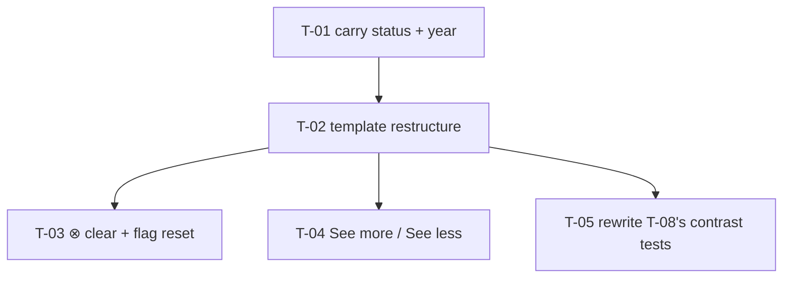

# Tasks — Innovation Dev card in the OICR selected-card style

- **Spec:** `docs/specs/innovation-use/dev-card-oicr-style` · Depth **Lite**
- **Budget (`design.md` §7):** **5 tasks · ~260 LOC · ~7 review rounds**
- **Lane:** client only. All five delegable to Antigravity.
- **Last updated:** 2026-09-10

---

## 1. Dependency graph

**No cycles.** T-03, T-04 and T-05 are independent of each other once T-02 lands, but all four touch the same spec file — **run them sequentially**, not in parallel (`CLAUDE.md` §4.3: two tasks in the same package are not safe concurrently).

---

## 2. Tasks

### T-01 — Carry `result_status` and `year` into the card's object

- **Requirements:** `R-OICR-001`, `R-OICR-002` · **Design:** §4
- **Files:** `get-innovation-use-details.interface.ts` · `innovation-use-details.component.ts`
- **Scope:** widen `linked_innovation_dev` with `result_status?: ResultStatus` and `year?: string`, both **optional**, and populate them from `option` inside `onInnovationDevSelected`.
- **Done:**
  - [x] Both keys are **optional** — `npm run build` exits 0 with the existing literal still compiling
  - [x] Selecting a result populates both from the picker option
  - [x] The three enrichment keys T-09 merges are untouched
- **Verification:** `npm test -- --silent` · `npm run build`
- **Falsifying input:** make either key non-optional → the four-key literal stops compiling and `ng build` fails. If it still compiles, the keys were added somewhere the literal does not construct.
- **Disqualifier:** a test that seeds `linked_innovation_dev` directly. The product builds it **inside `onInnovationDevSelected`** — **drive that method** (inherited `KZ-015`; this exact trap cost the parent spec a round).
- **Skills:** `angular-developer` · **Size:** S

---

### T-02 — Restructure the template to the OICR pattern

- **Requirements:** `R-OICR-001`, `NFR-OICR-001`, `NFR-OICR-002` · **Design:** §3, `DD-1`, `DD-2`, `DD-5`
- **Files:** `innovation-use-details.component.html` · its `.spec.ts`
- **Scope:** eyebrow → title → description → metadata row. Badge via **`<app-custom-tag>`** (mimic `links-to-result.component.html:63-71`). Each `Label → value` pair behind its own `@if`. Every colour a token from `DD-5`'s table.
- **Done:**
  - [x] Order is eyebrow, title, **description**, metadata row
  - [x] Row reads `[status] · Innovation Dev level → n · Reporting year → y · Geographic scope → s`
  - [x] A null field contributes **no element and no stranded separator**
  - [x] The badge renders a **non-published** fixture's own status name (`DC-2`)
  - [x] The outer wrapper's chrome classes are unchanged from today
  - [x] **Zero hex literals**
  - [x] 🔴 **The `View innovation detail ↗` anchor survives as the row's FOURTH pair** — `Innovation detail → <link>` — with href, text and accessible name unchanged (`R-IUC-003` AC.6, still binding). *Added 2026-09-10 after an attempt deleted it: the target design was silent, so the decomposition was too*
  - [x] 🔴 **Zero tests are disabled.** `grep -c 'it\.skip\|describe\.skip\|xit(' <spec>` → **0**. Assertions about the *old* layout that this task invalidates are **rewritten here** — the task that changed the structure owns them. Only the pure-contrast ones belong to T-05
- **Verification:** `npm test -- --silent` · `npm run lint -- --quiet` · `npm run build` · `grep -c '#[0-9a-fA-F]\{6\}' <template>` → **0**
- **Falsifying input:** set `geo_scope: null` and assert no `Geographic scope` text and no trailing `|`; hardcode `Published` in the badge → the non-published fixture's assertion reddens.
- **Disqualifier — read this one:** **every criterion here is a DOM-presence assertion and none proves layout.** jsdom does not lay out, and this build has **no Tailwind** (runtime CDN script, never executed under the harness), so a green class assertion proves the string is in the attribute and **nothing about how it looks**. Do not report this task as covering appearance — that is `DC-6`, owned by T-10.
- **Skills:** `angular-developer`, `ui-ux-pro-max` · **Size:** M

---

### T-03 — ⊗ clears the selection, and resets T-09's enrichment flag

- **Requirements:** `R-OICR-003` · **Design:** `DD-3`
- **Files:** `innovation-use-details.component.{html,ts}` · its `.spec.ts`
- **Scope:** an ⊗ control that sets `linked_innovation_dev = null` **and** `enrichmentSuccessForId = null`.
- **Done:**
  - [ ] ⊗ clears the card; the section returns to its no-link state
  - [ ] 🔴 **Re-selecting the SAME result after clearing renders a full card** — not a bare one
  - [ ] The picker still accepts any new selection
  - [ ] Still single-select; no confirmation step
  - [ ] The save payload no longer carries the cleared link
- **Verification:** `npm test -- --silent` · `npm run build`
- **Falsifying input — ⚠️ CORRECTED 2026-09-10, the original was wrong and is recorded as such:** omit the `enrichmentSuccessForId` reset, then run the **four-step** sequence — select 42 (enrichment succeeds) → ⊗ clear → **`getData()` rehydrates `linked_innovation_dev` BARE** (only `result_id`/`code`/`title`/`platform_code`; the three enrichment keys are optional and only `GET_InnovationDevCard` writes them) → re-select 42. **Only now** are `sameId` and `wasSuccessful` both true, the early return fires, and the card renders **title + anchor only**. The **DOM** assertions must redden.
  - **What the original said, and why it was false:** it claimed clear-then-repick alone suffices. It does not — after a clear `linked_innovation_dev` is `null`, so `sameId` is `undefined === 42`, **structurally false whatever the flag holds**. **Measured:** with the reset deleted and the white-box flag assertion removed, the test **passes**. The rehydration in step 3 is what makes `sameId` true again.
  - A test that clears and picks a **different** result cannot see this defect either — `sameId` is false on a different id.
- **Disqualifier:** asserting only that `linked_innovation_dev` became `null`. That is the easy half; the re-selection is the half that breaks.
- **Skills:** `angular-developer`, `systematic-debugging` · **Size:** S

---

### T-04 — See more / See less

- **Requirements:** `R-OICR-004` · **Design:** `DD-4`
- **Files:** `innovation-use-details.component.{html,ts}` · its `.spec.ts`
- **Scope:** one `descriptionExpanded` signal toggling `line-clamp-3`; the affordance shows **See more** when clamped, **See less** when expanded.
- **Done:**
  - [ ] A 400-character description renders clamped with **See more**
  - [ ] Activating it expands and offers **See less**; activating that re-collapses
  - [ ] 🔴 **The complete text is in the DOM in BOTH states**
  - [ ] The affordance is absent when the description is short enough not to clamp *(or always present — state which and why)*
- **Verification:** `npm test -- --silent` · `npm run build`
- **Falsifying input:** replace the clamp with `description.slice(0, 200)` → the full-text assertion reddens in the collapsed state. **A short fixture cannot catch this** — use 400 characters, as `R-IUC-004`'s scenario does.
- **Disqualifier:** asserting only the class toggle. Class presence proves the string is in the attribute; it proves **nothing about whether the text clamps or is readable**. The visible effect is `DC-6` → T-10.
- **Skills:** `angular-developer` · **Size:** S

---

### T-05 — Rewrite `dev-card-details`' contrast tests to the adopted pairs

- **Requirements:** `NFR-OICR-002` · **Design:** `DD-5`
- **Files:** `innovation-use-details.component.spec.ts` (the T-08 block)
- **Scope:** T-08's assertions target `Readiness level:` / `Geographic scope:` label spans that **this spec deletes**. Rewrite them to assert the **adopted** roles and their measured ratios, re-derived from `colors.scss`.
- **Done:**
  - [ ] Every new text role is asserted to carry its `DD-5` token in the rendered DOM
  - [ ] The recorded ratios match `NFR-OICR-002`'s table, **re-derived** — not copied from this document
  - [ ] The background named in the computation is the card's own `--ac-grey-100`
  - [ ] The block states that the pattern's colours were **adopted by decision**, citing the user ruling and its date
  - [ ] The old T-08 assertions are **rewritten, not deleted** — the record says what the card *is*
- **Verification:** `npm test -- --silent`
- **Falsifying input:** point a computation at `--ac-white-1` instead of `--ac-grey-100` → the recorded ratio changes and the assertion reddens. *(Both backgrounds yield a passing number for `--ac-grey-800`, which is exactly why the token must be named in a comment.)*
- **Disqualifier:** asserting arithmetic with **no** class assertion — it stays green after someone changes an element's colour, verifying maths rather than the component. And **do not assert AA thresholds these roles no longer target** — that is the superseded requirement.
- **Skills:** `angular-developer`, `ui-ux-pro-max` · **Size:** S

---

## 3. Coverage

| Requirement | Scenario / clause | Owning task |
| --- | --- | --- |
| `R-OICR-001` | Fully populated · absent field · description between title and row | T-02 (+ T-01 for the data) |
| `R-OICR-002` | Non-published result · no hardcoded status or colour | T-02 (+ T-01) |
| `R-OICR-003` | Clear · **re-select the same result** · still single-select · payload cleared | T-03 |
| `R-OICR-004` | 400-char clamp · expand · re-collapse · **full text in both states** | T-04 |
| `NFR-OICR-001` | Zero hex literals | T-02 |
| `NFR-OICR-002` | Adopted pairs + recorded ratios | T-05 |
| **`DC-6`** | **Appearance, spacing, wrapping, the clamp's visible effect** | **`dev-card-details` T-10 — no automated gate exists** |

---

## 4. Testing

| Gate | Command |
| --- | --- |
| Client unit | `npm test -- --silent` (coverage is computed automatically; floors 40/20/45/30) |
| Types + templates | `npm run build` — the real gate; only `ng build` checks templates under `strictTemplates` |
| Lint | `npm run lint -- --quiet` — ⚠️ **does not cover `*.spec.ts`** (`K-002`) |
| Spec types | `npx tsc -p tsconfig.spec.json --noEmit \| grep -c "error TS"` → **934** baseline, **0** in this file |
| **Appearance** | **Human, both themes — `dev-card-details` T-10** |

**Baselines to hold:** client suite **317 suites / 6951 tests**; spec type-check **934 / 0**.

---

## 5. PR strategy

**~260 LOC — one PR.** Below the ~400 threshold, one component, one reviewer pass.

Review first: **T-03**, because the `enrichmentSuccessForId` reset is the one non-obvious behaviour and the one whose absence produces a silently bare card.

Out of scope for the PR, state it explicitly: appearance (T-10, deferred and now unblocked), extracting a shared card component (`DD-1`'s rejected Option B), and the OICR card's own 11 hex literals.

---

## 6. Done definition

- [ ] All five tasks `done`
- [ ] Client suite green at ≥ 6951 tests; `npm run build` exits 0; spec type-check 934 / 0
- [ ] Zero hex literals in the touched template
- [ ] Every falsifier above **observed red** for its own reason before being trusted (`K-004`)
- [ ] **`dev-card-details` T-10 run against this final design, in both themes** — it was deferred for exactly this moment
- [ ] `dev-card-details`' `DD-6` / `DD-7` / `NFR-IUC-002` marked superseded, pointing here
