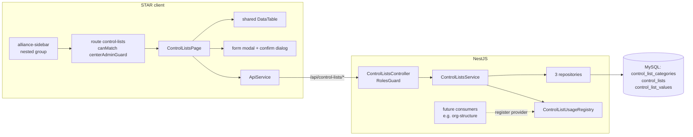

# Design — Institutional Performance / Control Lists

- **Module:** institutional-performance (new) — server `domain/entities/control-lists/` + client Center admin page
- **Spec id:** 2026-09-control-lists
- **Status:** draft
- **Owner:** Hector F. Tobón (requester)
- **Linked requirements:** [`./requirements.md`](requirements.md)
- **Linked TRD:** [`docs/trd/trd.md`](../../../trd/trd.md) — backend module layout, response envelope, auth
- **Parent spec:** [`../family.md`](../family.md) (F-1 … F-9)
- **Visual reference:** artboard *1 · Control Lists* — https://claude.ai/artifact/EPtLbFVhaEQb3Vgq7kuyRP · [`../mockup/ControlledLists.dc.html`](../mockup/ControlledLists.dc.html)
- **Exploration:** delegated to one Explore scout (citations as run, folded into §13 Premise Ledger)
- **Last updated:** 2026-09-26 (judgment-day round 1 fixes J-1, J-2; user-approved suspects J-3, J-4)

---

## 1. Goals & non-goals

**Goals**
1. Portfolio-scoped categories → lists → values with admin CRUD (R-CTL-001…004).
2. In-use protection that the first consumer plugs into without editing this module (R-CTL-005).
3. A consumer read by `(portfolio, key)` (R-CTL-006).
4. The nested *Portfolio Management* menu group and a reusable data-table pattern (R-CTL-008, R-CTL-009).
5. Seeded Portfolio 2 data (R-CTL-010).

**Non-goals** — global lists; copying lists between portfolios; retrofitting existing tables; any change to existing Center admin items or pages; the organizational-structure consumer itself (child 2).

---

## 2. Architecture

### 2.1 Composition

**Server** — `server/researchindicators/src/domain/entities/control-lists/`

| Path | Responsibility |
| --- | --- |
| `control-lists.module.ts` | Declares controller, service, repositories, registry; **exports** the service and the registry for consumers |
| `control-lists.controller.ts` | HTTP edge for all endpoints in §4; class-level `RolesGuard` |
| `control-lists.service.ts` | Validation and business rules (§5) |
| `control-list-usage.registry.ts` | Singleton holding the in-use providers registered by consumers |
| `entities/control-list-category.entity.ts`, `entities/control-list.entity.ts`, `entities/control-list-value.entity.ts` | TypeORM entities (§3) |
| `repositories/*.repository.ts` | One repository per entity, same pattern as `PortfoliosRepository` |
| `dto/*.dto.ts` | Create/update DTOs for category, list, value; query DTOs for `portfolioId`, `activeOnly` |
| sibling `*.spec.ts` for controller, service, registry, repositories | Unit tests |
| `src/db/migrations/<epochMs>-createControlListsTables.ts` | Tables, indexes, FKs, seed for Portfolio 2 |
| `src/domain/routes/main.routes.ts`, `src/domain/entities/entities.module.ts` | Register the module (path `control-lists`) |

**Client** — `client/research-indicators/src/app/`

| Path | Responsibility |
| --- | --- |
| `shared/components/data-table/data-table.component.{ts,html,scss,spec.ts}` | Reusable table (F-7): column config, natural sort, resizable columns, page size, search, export, row-action slot, empty/loading slots |
| `shared/utils/natural-compare.util.ts` (+spec) | Natural, case-insensitive comparator (`UOM-2` < `UOM-10`) |
| `shared/utils/xlsx-export.util.ts` (+spec) | Builds a workbook from `{columns, rows}` and triggers the download; **loads `exceljs` lazily** |
| `shared/interfaces/administration-nav.interface.ts` | Adds optional `children` to `AdministrationNavChild` |
| `shared/components/alliance-sidebar/*` | Renders one nested level under a child (expanded and collapsed flyout) |
| `shared/interfaces/control-lists.interface.ts` | Client types for category, list, value |
| `shared/services/api.service.ts` | New `GET_/POST_/PATCH_/DELETE_` methods for §4 |
| `shared/types/modal.types.ts`, `shared/services/cache/all-modals.service.ts` | Register modal name `controlListForm` |
| `pages/platform/pages/administration/center-admin/control-lists/control-lists.component.{ts,html,scss,spec.ts}` | The page: portfolio selector, category/list navigator, list header, values table, modal, confirm |
| `app.routes.ts` | Lazy route `administration/center-admin/control-lists`, `canMatch: [centerAdminGuard]` |

### 2.2 Reuse

Server: `AuditableEntity`, `ResponseUtils.format`, `RolesGuard` + `@Roles`, `SetUpInterceptor`, `CurrentUserUtil.audit(...)`, `GlobalExceptions`, Nest `ConflictException` / `NotFoundException` / `BadRequestException`, `PortfoliosRepository` (existence check).
Client: `ApiService` + `MainResponse<T>`, `app-modal`, `app-input` / `app-textarea`, `app-custom-progress-bar`, `ActionsService.showToast` and `showGlobalAlert`, PrimeNG `p-table`, `centerAdminGuard`, token utility classes.

---

## 3. Data model

All three tables extend `AuditableEntity` (created/updated by and at, `is_active`, `deleted_at`). Charset `utf8mb4`, collation **`utf8mb4_unicode_ci`** declared explicitly, so unique indexes are case-insensitive (P-4).

| Table | Columns (beyond audit) | Indexes / constraints |
| --- | --- | --- |
| `control_list_categories` | `id` bigint PK · `portfolio_id` bigint FK → `portfolios.id` · `name` varchar(150) · `description` varchar(500) null · `display_order` int default 0 | `uq_control_list_categories_portfolio_name (portfolio_id, name)` · `idx_control_list_categories_portfolio` |
| `control_lists` | `id` · `portfolio_id` FK · `category_id` FK → categories (RESTRICT) · `list_key` varchar(100) · `name` varchar(150) · `description` varchar(500) null · `code_prefix` varchar(10) · `is_system` tinyint default 0 | `uq_control_lists_portfolio_key (portfolio_id, list_key)` · `idx_control_lists_category` |
| `control_list_values` | `id` · `list_id` FK → lists (RESTRICT) · `code` varchar(30) · `value` varchar(150) · `description` varchar(500) null · `display_order` int default 0 | `uq_control_list_values_list_code (list_id, code)` · `uq_control_list_values_list_value (list_id, value)` · `idx_control_list_values_list_order (list_id, display_order)` |

- **Active flag** — the value's *Active* is the inherited `is_active` (D-CTL-4).
- **Deletes are physical** (D-CTL-5), so unique indexes never collide with deleted rows.
- `portfolio_id` on `control_lists` is denormalized from the category for the `(portfolio, key)` read and index; the service keeps them equal (§5).
- **Seed** (in the same migration): resolves Portfolio 2 by `start_year = 2026 AND end_year = 2030` (not by literal id — P-6), then inserts 2 categories, 6 system lists and 23 values from R-CTL-010 with `INSERT … SELECT … WHERE NOT EXISTS` so a re-run adds nothing. `down` drops the three tables.
- No OpenSearch fields. No backfill.

---

## 4. API surface

Base path `/api/control-lists` (unversioned — root `CLAUDE.md` §4.1). Class-level `@UseGuards(RolesGuard)`, `@UseInterceptors(SetUpInterceptor)`, `@ApiTags('Control Lists')`, `@ApiBearerAuth()`; every handler has `@ApiOperation` and per-param `@ApiQuery`/`@ApiParam`/`@ApiBody`. Writes use `ValidationPipe({ whitelist, forbidNonWhitelisted, transform })`.

| # | Method + path | Roles | Input | Response `data` | Errors |
| --- | --- | --- | --- | --- | --- |
| A1 | `GET /categories?portfolioId=` | CENTER_ADMIN, SYSTEM_ADMIN | `portfolioId` required | `Category[]`, each with `lists: ListSummary[]` (id, key, name, value count, is_system, `usedBy: string[]` — consumer names from the registry, empty = *Not linked to a form yet*) | 400 missing id · 404 portfolio |
| A2 | `GET /portfolios/summary` | CENTER_ADMIN, SYSTEM_ADMIN | — | `{ portfolioId, categories: number }[]` — drives *not configured* | — |
| A3 | `POST /categories` | CENTER_ADMIN, SYSTEM_ADMIN | `{portfolioId, name, description?}` | `Category` (201) | 400 · 404 portfolio · 409 duplicate name |
| A4 | `PATCH /categories/:id` | same | `{name?, description?}` | `Category` | 404 · 409 duplicate |
| A5 | `DELETE /categories/:id` | same | — | `{ id }` | 404 · 409 has lists (description names them) |
| A6 | `POST /lists` | same | `{categoryId, listKey, name, description?, codePrefix?}` | `List` (201, `is_system=false`) | 400 key pattern · 404 category · 409 duplicate key in portfolio |
| A7 | `PATCH /lists/:id` | same | `{name?, description?, categoryId?}` — **`listKey` not whitelisted** | `List` | 400 if `listKey` sent (forbidNonWhitelisted) · 400 category of another portfolio (R-CTL-001) · 404 |
| A8 | `DELETE /lists/:id` | same | — | `{ id }` | 404 · 409 system list · 409 has values |
| A9 | `GET /lists/:id/values` | same | — | `Value[]` incl. inactive, each with `inUse: number` | 404 |
| A10 | `POST /lists/:id/values` | same | `{code?, value, description?, displayOrder?, isActive?}` — `code` defaults to the proposed `<prefix>-<nn>` | `Value` (201) | 404 · 409 duplicate code/value |
| A11 | `PATCH /values/:id` | same | `{code?, value?, description?, displayOrder?, isActive?}` | `Value` | 404 · 409 duplicate |
| A12 | `DELETE /values/:id` | same | — | `{ id }` | 404 · 409 in use (description: count + "deactivate instead") |
| A13 | `GET /by-key/:listKey/values?portfolioId=&activeOnly=true` | any authenticated user (no `@Roles`) | `portfolioId` required, `activeOnly` default true | `Value[]` ordered by display order, then natural code | 400 · 404 unknown key |

Response shapes are wrapped by `ResponseInterceptor` (`ServerResponseDto`). Machine tokens are not granted any role here, so writes are unreachable by them (NFR-CTL-002).

---

## 5. Workflows & business rules

1. **Portfolio integrity** — A3 checks the portfolio exists (404). A6 copies `portfolio_id` from the category. A7 with `categoryId` rejects a category of another portfolio with **400**, as R-CTL-001 requires for a cross-portfolio write (judgment J-4). Values inherit the portfolio through their list.
2. **Uniqueness** — the service checks first, to return a field-named 409. The DB unique index is the backstop for a concurrent insert: the service **catches a `QueryFailedError` with errno 1062 around every insert/update of the three tables and rethrows `ConflictException`**, naming the field. It must **not** rely on `sql-errors.const.ts` (it maps 1062 to 400 and is not wired into `GlobalExceptions`, which would return 500 for a raw `QueryFailedError` — P-14).
3. **Immutable key** — `listKey` exists only in the create DTO. The update DTO omits it, so `forbidNonWhitelisted` returns 400.
4. **Code proposal** — when `code` is empty on A10, the service uses `<code_prefix>-<nn>`, zero-padded to 2 digits, with `nn` = 1 + the highest numeric suffix already in the list. For `org.level` (prefix `L`, no dash) it uses `L<n>`. The admin can edit it.
5. **In-use and *Used by*** — `ControlListUsageRegistry` holds providers registered by consumer modules. Each provider declares a **consumer name** (e.g. *Organizational Structure › Level*), the list keys it reads and a count function over value ids. A1 derives each list's `usedBy` from the providers that declare its key — nothing is stored (judgment J-3). A9 attaches the summed counts; A12 refuses when the sum is > 0. Consumers also add a DB FK to `control_list_values.id` with `ON DELETE RESTRICT` (child 2 owns that migration). **The registry has no request-scoped dependency** (P-10).
6. **Delete rules** — category: only with no lists. List: never if `is_system`, else only with no values. Value: only if in-use = 0.
7. **Audit** — creates set `created_by`, updates set `updated_by`, via `CurrentUserUtil.audit`.
8. **Transactions** — each write touches one row, so no multi-row transaction is needed. The seed runs inside the migration's own transaction.
9. **Side effects** — none (no OpenSearch, sockets, queues).

---

## 6. Frontend — STAR client

### 6.1 Navigation (R-CTL-008)

- `AdministrationNavChild` gains an optional `children: AdministrationNavChild[]`. The *Portfolio Management* child gets one nested child, **Control Lists** → `/administration/center-admin/control-lists`. Organizational Structure and Strategy Framework are added by their own specs.
- Expanded sidebar: nested children render right after their parent, indented one level (token spacing + left rule, as drawn in the mockup). Collapsed flyout: nested children render under the parent row, indented.
- Existing children keep their order, labels and links. The parent's `routerLinkActive` stays `exact: true`, so Portfolio Management is not highlighted while Control Lists is active.

### 6.2 Page layout (from the mockup)

| Region | Content | Notes |
| --- | --- | --- |
| Header | Title *Control lists*, description, **Portfolio** selector, **+ New category** | Selector options come from `GET_Portfolios` + A2. **Every portfolio stays selectable.** A portfolio with 0 categories carries the label *(not configured)*, and selecting it shows an empty state with **+ New category**, so its first category can be created from the page. The default is the portfolio whose years contain the current year |
| Left navigator (≈300 px) | Categories (collapsible) with their lists and value counts; per category: edit and *add list* icon buttons with `aria-label` | Selecting a list loads A9 |
| List header | Category caps label, list name, description, **Reference `P<id> · <key>`**, *Used by*, **Edit list**, **Delete list** (custom lists only) | Qualified reference computed on the client (R-CTL-003) |
| Values table | `DataTable` with columns Code · Value · Description · Order · In use · Active · Actions (edit, delete) | See 6.3 |
| Modal `controlListForm` | One modal with three modes: category / list / value. Only **Cancel** and **Save** | Field errors shown inline from 400/409 `errors` payloads |
| Confirm | `showGlobalAlert` pattern (as Portfolio Management) | A blocked delete shows the server's 409 description and a single *Close* |

UI states: loading = `app-custom-progress-bar`; empty = per region (no categories / no lists / no values) with its call to action; error = inline message; success = `showToast`.

### 6.3 `DataTable` shared component (R-CTL-009)

- **Inputs:** a column config (field, header, width, sortable, type text|code|badge|number), rows, loading, an export file name, the search fields, and an actions template.
- **Behavior:**
  - PrimeNG `p-table` with resizable columns (`expand` mode), paginator with 10 / 25 / 50 / 100 rows, and custom sort through the natural comparator, defaulting to the first `code` column ascending.
  - A search box filters locally over the configured fields.
  - **Export** passes the filtered and sorted row set (all pages) to `xlsx-export.util`.
- **Resize persistence:** column widths persist for the session in component state, and page size and sort survive paging.
- **Export util:** dynamic `import('exceljs')`, so the library stays out of the initial bundle. It writes a header row plus data rows and saves via object URL (the same download technique as Results Center).

### 6.4 Design tokens (from the mockup, mapped to existing tokens — no hex literals)

| Use | Token |
| --- | --- |
| Title / primary text | `--ac-primary-blue-600` (#112F5C) |
| Links, active nav text, code chips | `--ac-light-blue-400` (#035BA9) |
| Nav selected / hover background | `--ac-grey-100` |
| Borders | `--ac-grey-200` / `--ac-grey-400` |
| Muted text | `--ac-grey-700` |
| Active badge | `--ac-green-100` bg / `--ac-green-700` text |
| Destructive | `--ac-red-1` |
| Type | Barlow (app default); section eyebrow in Space Grotesk as in the sidebar |

---

## 7. Integration impact

None: no CLARISA, AGRESSO, OpenSearch, DynamoDB, RabbitMQ or Socket.IO. No new env vars or crons.

## 8. Security & authorization

- Writes and admin reads (A1–A12): `@Roles(CENTER_ADMIN, SYSTEM_ADMIN)`. `SYSTEM_ADMIN` bypasses in `RolesGuard`. `TECHNICAL_SUPPORT` is **not** granted (F-1; D-CTL-7).
- Consumer read (A13): any authenticated user, because it serves forms.
- Client: route `canMatch: [centerAdminGuard]`; the menu item sits inside the group already gated by `canAccessCenterAdmin()`.
- No PII (names only, in audit fields).

## 9. Observability

Info-level logs through `LoggerUtil` on create, update and delete (entity, id, portfolio, user id). Warn-level logs on a blocked delete (entity, id, reason). No new metrics.

## 10. Testing strategy

| Layer | Tests |
| --- | --- |
| Server unit | Service: every rule in §5, including duplicate checks (pre-check **and** a simulated `QueryFailedError` errno 1062 → `ConflictException`), immutable key, system-list delete, in-use block with a **test provider registered in the registry**, code proposal (`UOM-07`, `L5`). Controller: each handler returns the envelope; the roles metadata equals `[CENTER_ADMIN, SYSTEM_ADMIN]` on A1–A12 and is absent on A13. Registry: sums across two providers |
| Server e2e/integration | `test:integration` on the disposable TEST schema: migration up, row counts 2 / 6 / 23, re-run adds 0; cross-portfolio isolation; duplicate insert → 409 |
| Client unit | Natural comparator; export row builder (filtered + sorted input → rows); `DataTable` (page size keeps sort and search; default sort); sidebar (nested child renders; existing children unchanged); page (default portfolio; an unconfigured portfolio is selectable and shows the empty state with + New category; qualified reference; blocked-delete message) |
| Build | `npm run build` (server), `ng build` (client) — the compile gate |
| Manual (HITL) | Real browser: resize a column, page, sort — the width holds; visual check against the mockup |

## 11. Rollout

- Migration merges with the code. On Dev it is applied by the pipeline on deploy (root `CLAUDE.md` §4.3). For Prod, confirm the pipeline behaves the same before assuming parity.
- No feature flag: the page is visible only to admins, and it is additive.
- Backout: revert the code, then run the migration `down` (drops the three tables — safe while no consumer exists).

## 12. Design decisions log

| # | Date | Decision | Rationale | Rejected |
| --- | --- | --- | --- | --- |
| D-CTL-1 | 2026-09-26 | Generic model category → list(key) → value in 3 tables | One module for every current and future list; admins can add lists (proposal Option A) | One table per list |
| D-CTL-2 | 2026-09-26 | `list_key` carries no portfolio segment; uniqueness `(portfolio_id, list_key)`; UI shows `P<id> · <key>` | Portfolio years are editable data (P-7); a portfolio in an immutable key would go stale and force code changes | `p25-30.org.level` style keys |
| D-CTL-3 | 2026-09-26 | In-use via a registry of consumer providers + DB FK RESTRICT on consumer side | The first consumer plugs in without editing this module; the FK is the backstop if a provider is forgotten | Scanning all tables by convention; a usage counter column (drifts) |
| D-CTL-4 | 2026-09-26 | Value *Active* = inherited `is_active` | Existing audit column already means "active"; no duplicate flag | New `active` column |
| D-CTL-5 | 2026-09-26 | Physical delete for all three tables | Delete is only allowed when nothing references the row; soft-deleted rows would collide with unique indexes | Soft delete via `deleted_at` |
| D-CTL-6 | 2026-09-26 | Export built on the client with a lazily loaded `exceljs` (already a client dependency, unused — P-3) | Exports exactly the filtered + sorted rows the user sees; one reusable util for every future table; no bundle cost until clicked | A server xlsx endpoint per table (Results Center pattern) |
| D-CTL-7 | 2026-09-26 | `TECHNICAL_SUPPORT` not granted | F-1 names Center Admin + System Admin; portfolios' broader set is not inherited | Mirror `portfolios.controller` roles |
| D-CTL-8 | 2026-09-26 | Seed resolves Portfolio 2 by years, not by literal id | An id can differ per environment (P-6) | `portfolio_id = 2` literal |
| D-CTL-9 | 2026-09-26 | Sidebar nesting as one optional `children` level on a child | Smallest change to a shared component; existing children untouched (P-8) | A new group type; a second sidebar section |
| D-CTL-10 | 2026-09-26 | Unconfigured portfolios stay selectable; *(not configured)* is a label + empty state (judgment J-2) | Otherwise Portfolio 1 could never receive its first category, and R-CTL-003 “Same key in two portfolios” would be unreachable | Disabling unconfigured portfolios |
| D-CTL-11 | 2026-09-26 | The service maps errno 1062 to `ConflictException` itself (judgment J-1) | Existing helper yields 400 and is not global; raw errors surface as 500 (P-14) | Reusing `sqlErrorsHelper` |
| D-CTL-12 | 2026-09-26 | *Used by* is derived at read time from the registry; no `used_by` column (judgment J-3) | A stored label has no writer and would drift from the consumers actually registered | A `used_by` column set by migrations |
| D-CTL-13 | 2026-09-26 | Moving a list to another portfolio's category → 400 (judgment J-4) | R-CTL-001 pins every cross-portfolio write at 400 | 409 |

**Reversion challenge (Step 2.3):** not triggered — no decision removes, disables or inverts shipped behavior. Every change is additive; the sidebar change only adds an optional field.

## 13. Premise Ledger

**Count:** 14 premises — 13 verified, 1 `UNVERIFIED` (Impact: 0 High, 1 Low). Verified at `63e4a107`.
**Blast-radius triggers:** `live-path` (the design names a user action: open Control Lists from the sidebar); `shared-state` (it changes the shared sidebar component and its nav interface); `consumer` (it changes the exported `AdministrationNavChild` interface and the `ModalName` union).

| # | Claim | Class | Citation (as run) | Verified at | If false | Settled by |
| --- | --- | --- | --- | --- | --- | --- |
| P-1 | No admin-managed, portfolio-scoped list-of-values table exists | existence | `find src/domain/entities -name "*.entity.ts" \| grep -iE "lookup\|catalog\|control\|vocab\|option\|dropdown\|setting\|config"` (scope `server/researchindicators`) → 5 hits (`user-settings`, `setting-keys`, `app-config`, `announcement-settings`, `ip-rights-application-options`); `grep -rln portfolio_id` over those dirs → 0; `grep -rlE "control_list\|controlled_vocab\|list_of_values\|lookup_" src` → 0 | 63e4a107 | D-CTL-1 would reuse the existing table — High | — |
| P-2 | Center admin routes are flat children using `canMatch: [centerAdminGuard]` and `@platform` lazy imports | location | `client/…/app.routes.ts:270-318`; `tsconfig.json:16` (`@platform/*`) | 63e4a107 | Route task changes shape — Low | — |
| P-3 | `exceljs` is a client dependency and unused in client code | data-env | `client/…/package.json:43` (`"exceljs": "^4.4.0"`); `grep -rn "from 'exceljs'\|import('exceljs')" src` (scope client) → 0 hits | 63e4a107 | D-CTL-6 needs a new dependency — Low | — |
| P-4 | Migrations create tables with case-insensitive collations | data-env | `grep -ho "COLLATE[= ]*[a-z0-9_]*" src/db/migrations/*.ts \| sort \| uniq -c` → `utf8mb4_unicode_520_ci` ×10, `utf8mb4_unicode_ci` ×13; baseline `COLLATE utf8mb4_unicode_ci` ×63 | 63e4a107 | Case-insensitive uniqueness (R-CTL-002/004) needs a normalized column — Low. Mitigated anyway by the explicit collation in §3 | — |
| P-5 | `RolesGuard` lets `SYSTEM_ADMIN` through regardless of `@Roles` | location | `server/…/shared/guards/roles.guard.ts:29-31` | 63e4a107 | A12/A3 tests for System Admin would fail — Low | — |
| P-6 | Portfolio 2 is the row with `start_year=2026, end_year=2030`; its id may differ per environment | data-env | seed `1782328490591-CreatePlatformsTable.ts:14` inserts it second (id 2 only if the table was empty); `portfolios.service.ts:78-94` resolves by years | 63e4a107 | D-CTL-8 unnecessary — Low | — |
| P-7 | Portfolio years are edited in data after creation | data-env | `1783024745006-UpdatePortfolio1Years.ts:6` (`UPDATE portfolios SET start_year = 2010 WHERE id = 1`) | 63e4a107 | D-CTL-2's rationale weakens (the decision still stands on the code-change argument) — Low | — |
| P-8 | **Live path:** sidebar link → route → page | live-path | `alliance-sidebar.component.ts:52` (group gated by `canAccessCenterAdmin()`) → child `link` (:57-75) → `app.routes.ts` path under `administration/center-admin/*` with `canMatch: [centerAdminGuard]` (:270-318) → `loadComponent` | 63e4a107 | Menu item unreachable — High (caught by the page spec + HITL) | — |
| P-9 | **Shared state:** every reader of the nav interface / children list | shared-state | `grep -rn "AdministrationNavChild\|AdministrationNavGroup" src` (client) → `alliance-sidebar.component.ts:21,50,51,203`; `alliance-sidebar.component.spec.ts:6,157`; `administration-nav.interface.ts:1,10,16`. Template loops at `alliance-sidebar.component.html:69` (expanded) and `:115` (collapsed flyout) — both read `visibleAdministrationChildren` (`.ts:203-204`) | 63e4a107 | A reader missing nested rendering → the child is invisible in one sidebar mode — High (both loops in scope of T-5) | — |
| P-10 | `CurrentUserUtil` is request-scoped, so a singleton must not inject it | other | `server/…/shared/utils/current-user.util.ts:7,11` (`Scope.REQUEST`, `@Inject(REQUEST)`) | 63e4a107 | Registry would cascade to request scope — High → §5.5 keeps the registry free of it | — |
| P-11 | **Consumers:** readers of the `ModalName` union and modal config map | consumer | `grep -n "portfolioManagement" src/app/shared/services/cache/all-modals.service.ts` → :155, :303; `ModalName` defined `src/app/shared/types/modal.types.ts:1-18`. A new name must be added to the union **and** both config sites | 63e4a107 | Modal never opens / TS error — Low (compile gate) | — |
| P-12 | No existing test pins the order of the Center admin children | consumer | `alliance-sidebar.component.spec.ts:61-72` (exact `toEqual` by link for Bilateral), `:167-168` (`toHaveLength(1)` in the hide test), `:175-186` (`arrayContaining` for Portfolio Management) — no order assertion. E2E: `ls cypress e2e` (client root) → none | 63e4a107 | An existing spec breaks on the new nested child — Low | — |
| P-13 | The Dev pipeline applies migrations on deploy; Prod parity not re-measured | other | root `CLAUDE.md` §4.3 (2026-08-27 correction) | — | Rollout step changes — Low | `UNVERIFIED — confirm at source before relying on it` · settled by the HITL pause before merge to `main` (owner: requester) |
| P-14 | A DB duplicate (errno 1062) is **not** turned into 409 by existing code: `sqlErrorsHelper` maps it to 400 and has one caller; `GlobalExceptions` reads only `exception.status`, so a raw `QueryFailedError` returns 500 | location | `server/…/shared/const/sql-errors.const.ts:15-21` (`status: HttpStatus.BAD_REQUEST`); `grep -rn "sqlErrorsHelper" src` (scope server, excl. specs) → definition `:3` + 2 calls `lever-sdg-targets.service.ts:65,87`; `shared/error-management/global.exception.ts:22` (`exception?.status ?? HttpStatus.INTERNAL_SERVER_ERROR`) | 63e4a107 | §5.2 would rely on the helper and return 400/500 instead of 409 — High → §5.2 catches errno 1062 itself | — |

## 14. Budget (tripwire for `/akili-execute`)

| Measure | Estimate |
| --- | --- |
| Tasks | 9 (4 server, 5 client — including one manual HITL check) |
| LOC (incl. tests) | ~2,100 (server ~950, client ~1,150) |
| Review rounds | ≤ 2 per task; ≤ 14 in total |

The estimate matches the **Standard** depth, and the spec should not be split: the three pieces (model, API, page) are one user-visible feature. It does exceed ~400 LOC, so it is delivered in **2 PRs**: server first, then client.

## 15. Open questions

None blocking.

## 16. References

- `../family.md` §4 (F-1…F-9), `../proposal.md`
- Mockup artboard 1
- Jira PARI-258
