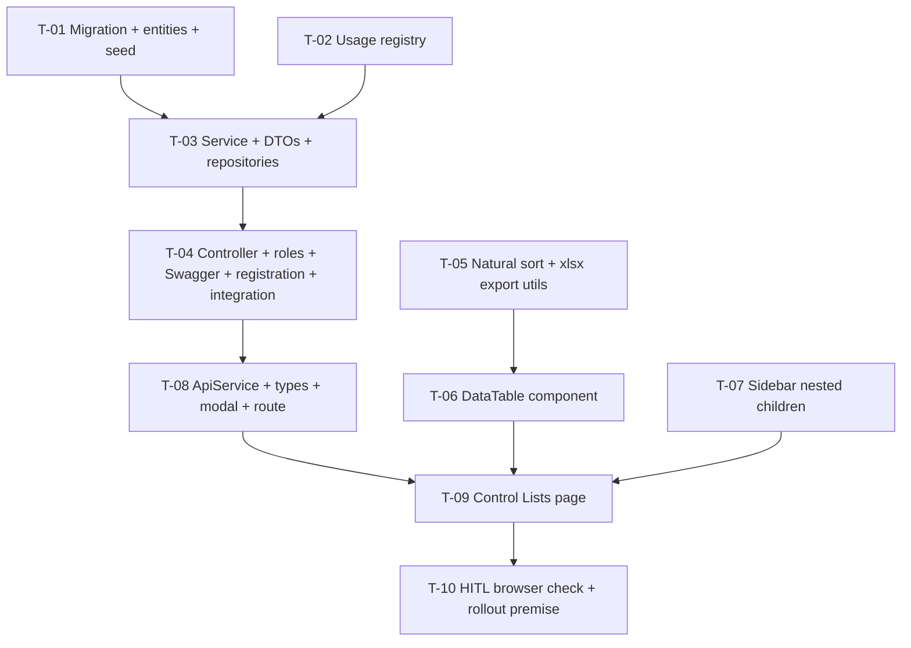

# Tasks — Institutional Performance / Control Lists

- **Module:** institutional-performance (new) — server + client
- **Spec id:** 2026-09-control-lists
- **Status:** not-started
- **Owner:** Hector F. Tobón (requester); implementers assigned by `/akili-execute`
- **Linked requirements:** [`./requirements.md`](requirements.md)
- **Linked design:** [`./design.md`](design.md) (judgment: [`./judgment.md`](judgment.md) — APPROVED)
- **Branch:** `institutional-kpis`
- **Last updated:** 2026-09-27

> **Legend for verification fields.** *Falsifier* = the concrete input or mutation that must turn the gate red. *Red run* = what must be observed failing, and on which assertion. *Disqualifier* = what makes a green reading worthless. *Consumers* = existing files that pin a symbol this task changes (from the Premise Ledger + a test-file grep). An absent value reads `n/a` or `none`, never blank.

---

## 1. Dependency graph and PR plan

| PR | Tasks | Content |
| --- | --- | --- |
| **PR 1 — server** | T-01, T-02, T-03, T-04 | Tables, seed, API, tests. Reviewable alone; nothing user-visible |
| **PR 2 — client** | T-05, T-06, T-07, T-08, T-09, T-10 | Shared utils and table, sidebar, page. Depends on PR 1 being deployed to Dev for T-10 |

T-02 ∥ T-01 and T-05 ∥ T-07 are independent; T-05/T-06/T-07 can start before PR 1 merges (no server dependency).

---

## 2. Task list

### T-01 — Migration: create the three tables and seed Portfolio 2

- **Status:** todo · **Size:** M · **Dependencies:** none
- **Requirements covered:** R-CTL-010 (all ACs + *Seed is idempotent*), R-CTL-002/003/004 uniqueness at DB level, NFR-CTL-003
- **Design refs:** §3 Data model, D-CTL-5, D-CTL-8, P-4, P-6
- **Scope (files):**
  - `server/researchindicators/src/db/migrations/<epochMs>-createControlListsTables.ts`
  - `server/researchindicators/src/domain/entities/control-lists/entities/control-list-category.entity.ts`
  - `…/entities/control-list.entity.ts`
  - `…/entities/control-list-value.entity.ts`
- **Description:** create `control_list_categories`, `control_lists`, `control_list_values` extending `AuditableEntity`, with the unique indexes of §3, FKs with RESTRICT, and explicit `utf8mb4_unicode_ci`. Seed Portfolio 2 — resolved by `start_year = 2026 AND end_year = 2030` — with 2 categories, 6 system lists (`is_system = 1`, `code_prefix` UOM/DIR/FRQ/KLV/KTY/L) and 23 values, using `INSERT … SELECT … WHERE NOT EXISTS`. `down` drops the tables in reverse FK order. No `used_by` column (D-CTL-12).
- **Tests:** run on the disposable TEST schema only: `npm run migration:test:bootstrap`, then `npm run migration:test:execute`; count rows; run the seed statements a second time; `npm run migration:test:revert`; `npm run migration:test:execute` again.
- **Falsifier:** (1) replace the portfolio lookup by a year range that matches nothing → the seed inserts 0 rows and the count check must read 0 / 0 / 0. (2) Remove the `WHERE NOT EXISTS` guard → the second run must fail on the unique index or double the counts.
- **Red run:** the row-count assertion (2 / 6 / 23) observed failing under falsifier (1); the idempotency assertion observed failing under falsifier (2).
- **Disqualifier:** a run against the shared **Dev** database is not evidence and is forbidden (root `CLAUDE.md` §4.3). A count read from a failed migration output is a confident zero (K-014): check the raw output for errors first.
- **Consumers:** none (new tables). `src/domain/entities/entities.module.spec.ts` is touched only in T-04.
- **Review:** `full` — schema and seed are correctness-critical and append-only once merged.
- **Done criteria:**
  - [ ] Forward migration applies cleanly on TEST; counts are 2 categories / 6 lists / 23 values for Portfolio 2 and 0 rows for Portfolio 1.
  - [ ] A second seed run adds 0 rows.
  - [ ] Revert and re-apply both succeed.
  - [ ] `SHOW CREATE TABLE` shows the three unique indexes, the RESTRICT FKs and `utf8mb4_unicode_ci`.
  - [ ] Inserting `dir-01` into `kpi.direction` (which already holds `DIR-01`) fails on the unique index (case-insensitive — P-4).
  - [ ] `npm run build` (server) passes.
- **Skills:** `nestjs-expert`

### T-02 — Usage registry (in-use counts and *Used by*)

- **Status:** todo · **Size:** S · **Dependencies:** none
- **Requirements covered:** R-CTL-005 (mechanism, AC.3), R-CTL-003 *Used by*
- **Design refs:** §5.5, D-CTL-3, D-CTL-12, P-10
- **Scope:** `server/…/domain/entities/control-lists/control-list-usage.registry.ts` (+ `.spec.ts`)
- **Description:** a singleton where consumer modules register a provider made of a consumer name, the list keys it reads, and an async count function over value ids. It exposes the summed count per value id and the consumer names per list key. It has **no request-scoped dependency**.
- **Tests:** unit — two fake providers on the same key sum their counts; a provider for another key contributes nothing; the consumer names come back per key, and an unknown key returns an empty list.
- **Falsifier:** make the sum return only the first provider's count → the two-provider test (fixture: provider A returns 2 and provider B returns 3 for the same value id; expected 5) must fail. The two providers' counts must differ, so first-only and summed readings diverge.
- **Red run:** the `expected 5` assertion observed failing under the falsifier.
- **Disqualifier:** a fixture where both providers return the same number cannot tell first-only from summed (KZ-004 inert fixture).
- **Consumers:** none (new symbol).
- **Review:** `checklist` — small, isolated, fully unit-testable.
- **Done criteria:**
  - [ ] Registry spec green; falsifier observed red and reverted.
  - [ ] The registry's constructor injects nothing request-scoped (checked against `current-user.util.ts:7`).
- **Skills:** `nestjs-expert`

### T-03 — Service, DTOs and repositories: all business rules

- **Status:** todo · **Size:** L · **Dependencies:** T-01, T-02
- **Requirements covered:** R-CTL-001 (isolation, cross-portfolio write → 400), R-CTL-002, R-CTL-003 (immutable key, system list, same key in two portfolios, custom list lifecycle, `usedBy`), R-CTL-004 (uniqueness, code proposal, deactivate), R-CTL-005 (block when in use), R-CTL-006 (ordered read, `activeOnly`, unknown key)
- **Design refs:** §5 rules 1–8, D-CTL-4, D-CTL-5, D-CTL-11, D-CTL-13, P-14
- **Scope:**
  - `…/control-lists/control-lists.service.ts` (+ `.spec.ts`)
  - `…/control-lists/dto/*.dto.ts` — create/update for category, list, value; query DTOs
  - `…/control-lists/repositories/*.repository.ts` (+ specs), same pattern as `PortfoliosRepository`
- **Description:** implement every rule in design §5, including:
  - `portfolio_id` copied from the category;
  - the update DTO for lists has no `listKey`;
  - code proposal `<prefix>-<nn>` / `L<n>`;
  - the error map — duplicate → 409, cross-portfolio move → 400, system-list delete → 409, non-empty delete → 409, in-use delete → 409, unknown portfolio/key → 404;
  - a `QueryFailedError` errno 1062 caught around each insert/update and rethrown as `ConflictException` naming the field — never through `sqlErrorsHelper`;
  - audit through `CurrentUserUtil.audit`.
- **Tests (unit, mocked repositories):**
  - one test per scenario of R-CTL-001…006;
  - a simulated 1062 → 409;
  - code proposal returns `UOM-08` after `UOM-07`, and `L5` after `L4`;
  - `activeOnly` omits inactive values;
  - the ordered read puts `UOM-2` before `UOM-10` when display orders are equal.
- **Falsifier:** (1) route the 1062 catch through `sqlErrorsHelper` → the test must fail on status 400 ≠ 409. (2) Accept `listKey` in the list update DTO → the immutable-key test must fail. (3) Drop the in-use check → the delete test (a fake provider returning 3) must fail on `ConflictException`. (4) Move a list to another portfolio's category and return 409 → the J-4 test must fail on 400.
- **Red run:** each falsifier observed red on its **status/exception assertion**, not on setup.
- **Disqualifier:**
  - A uniqueness test whose duplicate differs only in id, not in letter case, cannot prove case-insensitivity. The fixture must use `dir-01` against `DIR-01`.
  - A portfolio-isolation test with one portfolio proves nothing. The fixture needs two portfolios holding the same key.
- **Consumers:** none (new symbols).
- **Review:** `full` — carries every business rule and the J-1/J-4 fixes.
- **Done criteria:**
  - [ ] Service spec green; falsifiers 1–4 each observed red, then reverted.
  - [ ] Every `AND IT MUST` / `BUT it must NOT` clause of R-CTL-001…006 maps to a named test (see §3 coverage).
  - [ ] `npm run build` (server) passes.
- **Skills:** `nestjs-expert`, `error-handling-patterns`, `api-design-principles`

### T-04 — Controller, roles, Swagger, module registration and integration test

- **Status:** todo · **Size:** M · **Dependencies:** T-03
- **Requirements covered:** R-CTL-007 (server: denied and allowed roles), R-CTL-001 AC.1–2 (end to end), R-CTL-006 (open to authenticated users), R-CTL-010 AC.1 (through the API), NFR-CTL-002, NFR-CTL-005
- **Design refs:** §4 (A1–A13), §8, D-CTL-7, P-5
- **Scope:**
  - `…/control-lists/control-lists.controller.ts` (+ `.spec.ts`)
  - `…/control-lists/control-lists.module.ts`
  - `server/researchindicators/src/domain/routes/main.routes.ts` (path `control-lists`)
  - `server/researchindicators/src/domain/entities/entities.module.ts`
  - integration test under the server's `test:integration` config
- **Description:**
  - 13 handlers per §4, wrapped with `ResponseUtils.format`.
  - Class-level `RolesGuard` and `SetUpInterceptor`.
  - `@Roles(CENTER_ADMIN, SYSTEM_ADMIN)` on A1–A12; none on A13.
  - `ValidationPipe({ whitelist, forbidNonWhitelisted, transform })` on writes.
  - Full Swagger annotations.
  - Register the module in the two sites above.
- **Tests:**
  - Controller unit: the roles metadata of each handler equals `[CENTER_ADMIN, SYSTEM_ADMIN]` on A1–A12 and is absent on A13; each handler returns the envelope with the documented status.
  - Integration on the TEST schema: a Contributor gets 403 on a write; Center Admin and System Admin get 201; a cross-portfolio read returns nothing; a duplicate returns 409; `PATCH /lists/:id` with `listKey` returns 400.
- **Falsifier:**
  - (1) Add `TECHNICAL_SUPPORT` to one write handler → the roles-metadata test must fail.
  - (2) Remove `@Roles` from A12 → the Contributor-403 integration case must fail.
  - (3) Drop `forbidNonWhitelisted` → the `listKey` case must return 200 and fail.
- **Red run:** observed on the status assertion of each case.
- **Disqualifier:**
  - A roles test that inspects only one handler cannot cover 12; iterate every write handler.
  - An integration run on Dev is not allowed.
  - A 403 produced by a missing token, rather than by the role, is the wrong red: the Contributor must hold a valid token.
- **Consumers:** `src/domain/entities/entities.module.spec.ts` (registration; re-run it); `src/domain/routes/main.routes.ts` (route table).
- **Review:** `full` — authorization surface.
- **Done criteria:**
  - [ ] Controller spec and integration test green; falsifiers observed red.
  - [ ] All 13 endpoints appear in `/swagger` with tags, operation and params (checked on a local boot; quote what was seen).
  - [ ] `npm test -- --silent`, `npx eslint src/domain/entities/control-lists` and `npm run build` pass (server).
- **Skills:** `nestjs-expert`, `api-design-principles`

### T-05 — Client utils: natural comparator and xlsx export

- **Status:** todo · **Size:** S · **Dependencies:** none
- **Requirements covered:** R-CTL-009 *Natural sort*, *Export respects filter and sort*
- **Design refs:** §6.3, D-CTL-6, P-3; judgment J-5 (CommonJS)
- **Scope:**
  - `client/research-indicators/src/app/shared/utils/natural-compare.util.ts` (+ spec)
  - `…/shared/utils/xlsx-export.util.ts` (+ spec)
  - `client/research-indicators/angular.json` (`allowedCommonJsDependencies: ["exceljs"]`, only if `ng build` warns)
- **Description:**
  - A comparator that is natural and case-insensitive, sorts nulls last and is stable.
  - An export util that takes `{columns, rows, fileName}`, builds a header row plus data rows in the given order with `exceljs` loaded through a dynamic `import()`, and downloads through an object URL.
  - Its row-building step is a pure function, so it can be tested without the library.
- **Tests:**
  - Comparator with the fixture `['UOM-10','UOM-2','uom-1', null]`, expecting `['uom-1','UOM-2','UOM-10', null]`.
  - Export row builder: given 5 rows and a column subset, it returns exactly those cells in that order.
- **Falsifier:**
  - Swap the comparator for `localeCompare` without `numeric` → `UOM-10` sorts before `UOM-2` and the test must fail.
  - Make the builder ignore the given order and sort by id → the fixture must use rows whose given order differs from id order, so the test fails.
- **Red run:** both observed on the equality assertion.
- **Disqualifier:** a comparator fixture without a two-digit number cannot tell natural from lexical order.
- **Consumers:** none (new symbols). `angular.json` has no test consumers.
- **Review:** `checklist` — pure functions.
- **Done criteria:**
  - [ ] Specs green; both falsifiers observed red.
  - [ ] `ng build` succeeds. `exceljs` appears only in a lazy chunk, not in `main` (read the build stats). The initial bundle stays under the budgets in `angular.json`.
- **Skills:** `angular-developer`

### T-06 — Shared `DataTable` component (table standard F-7)

- **Status:** todo · **Size:** M · **Dependencies:** T-05
- **Requirements covered:** R-CTL-009 (all ACs), NFR-CTL-004 (`aria-sort`), R-CTL-008 empty/loading states for tables
- **Design refs:** §6.3, §6.4 tokens, judgment J-7
- **Scope:** `client/research-indicators/src/app/shared/components/data-table/data-table.component.{ts,html,scss,spec.ts}`
- **Description:**
  - A standalone component that wraps PrimeNG `p-table`, driven by a column config.
  - Features: resizable columns in `expand` mode; a paginator with 10 / 25 / 50 / 100 rows, defaulting to 10; custom sort through the natural comparator, defaulting to the first `code` column ascending; `aria-sort` on headers; local search over the configured fields; export of the filtered and sorted rows across all pages; slots for row actions, loading and empty.
  - Column widths, page size and sort persist within the session.
  - Styled with token classes only, no hex literals.
- **Tests (component):**
  - The default order is natural by code.
  - Changing the page size keeps the sort and the search.
  - The export receives the filtered and sorted rows from all pages.
  - Headers expose `aria-sort`.
- **Falsifier:**
  - Make export pass only the current page's rows → with 12 rows, page size 10 and a search matching 11, the export must receive 11 rows, so the test fails.
  - Reset the sort on a page-size change → the sort-persistence test must fail.
- **Red run:** observed on the row-count and order assertions.
- **Disqualifier:**
  - jsdom cannot measure column widths, so a resize test in jsdom proves only that the input is bound, not the behavior. **Resize behavior is covered by T-10** (real browser), and this task must not claim it.
  - A test with fewer rows than one page cannot tell "all pages" from "current page".
- **Consumers:** none (new component; no existing table is migrated — `../family.md` §5).
- **Review:** `full` — shared pattern that siblings will reuse.
- **Done criteria:**
  - [ ] Component spec green; falsifiers observed red.
  - [ ] The spec states in a comment that resize behavior is verified in T-10, not here.
  - [ ] `npm run lint -- --quiet` and `ng build` pass.
- **Skills:** `angular-developer`, `ui-ux-pro-max`

### T-07 — Sidebar: one nested level under a Center admin child

- **Status:** todo · **Size:** S · **Dependencies:** none
- **Requirements covered:** R-CTL-008 *Menu placement* (incl. **BUT it must NOT** change existing items), AC.1 (expanded and collapsed)
- **Design refs:** §6.1, D-CTL-9, P-8, P-9, P-12; judgment J-6
- **Scope:**
  - `client/research-indicators/src/app/shared/interfaces/administration-nav.interface.ts` (optional `children`)
  - `client/research-indicators/src/app/shared/components/alliance-sidebar/alliance-sidebar.component.{ts,html,scss}`
  - `…/alliance-sidebar.component.spec.ts`
- **Description:**
  - Give `AdministrationNavChild` an optional `children`.
  - Add **Control Lists** as the only nested child of *Portfolio Management*, linking to `/administration/center-admin/control-lists`.
  - Render nested children indented in **both** template loops: the expanded one (`.html:69`) and the collapsed flyout (`.html:115`).
  - Nested links use the same `routerLinkActive` / `exact: true` treatment as today's child links. The parent group stays a non-navigational `<button>`.
- **Tests:**
  - A nested child renders under Portfolio Management in the expanded mode and in the flyout.
  - The existing four children keep their order, labels and links: assert the exact array.
  - The hide filter still works.
- **Falsifier:**
  - Render nested children only in the expanded loop → the flyout test must fail.
  - Reorder or relabel an existing child → the exact-array test must fail. Today no test pins the order (P-12), so this test is new and must be seen red first.
- **Red run:** the flyout assertion and the exact-array assertion observed failing under their falsifiers.
- **Disqualifier:** checking only that `Control Lists` exists (`arrayContaining`) cannot catch a moved or renamed existing item.
- **Consumers:**
  - `alliance-sidebar.component.spec.ts:61-72` (exact `toEqual` for Bilateral), `:157-168` (hide test builds an `AdministrationNavGroup`) and `:175-186` (Portfolio Management `arrayContaining`) — re-run them all.
  - `administration-nav.interface.ts` readers: `alliance-sidebar.component.ts:21,50,51,203` (P-9).
- **Review:** `full` — shared shell rendered on every admin route.
- **Done criteria:**
  - [ ] Sidebar spec green, including the existing assertions; falsifiers observed red.
  - [ ] Existing Center admin items are visually unchanged. Quote what T-10 saw.
  - [ ] `npm run lint -- --quiet` passes.
- **Skills:** `angular-developer`

### T-08 — Client plumbing: ApiService methods, types, modal registration, route

- **Status:** todo · **Size:** S · **Dependencies:** T-04
- **Requirements covered:** R-CTL-007 client (`canMatch: [centerAdminGuard]`), R-CTL-008 (route), data contracts for R-CTL-001…006
- **Design refs:** §2.1 client table, §4, P-2, P-11
- **Scope:**
  - `client/research-indicators/src/app/shared/services/api.service.ts`
  - `…/shared/interfaces/control-lists.interface.ts`
  - `…/shared/types/modal.types.ts` (`controlListForm`)
  - `…/shared/services/cache/all-modals.service.ts` (config at both sites, like `portfolioManagement` `:155` and `:303`)
  - `client/research-indicators/src/app/app.routes.ts` (lazy route `administration/center-admin/control-lists`, `canMatch: [centerAdminGuard]`, `data: {title: 'Control Lists', isLoggedIn: true}`)
- **Description:**
  - Typed `GET_`, `POST_`, `PATCH_` and `DELETE_` methods for A1–A13, all returning `MainResponse<T>`.
  - The modal name registered in the union and at both config sites.
  - The route pointing to the page component from T-09. Until T-09 exists, the task creates a minimal page stub; T-09 replaces it.
- **Tests:**
  - An ApiService spec (existing file, if present) checks each new method's URL and verb.
  - `ng build` is the compile gate for the modal union and the config sites.
- **Falsifier:**
  - Omit `controlListForm` from the `all-modals` config → `ng build` must fail, or the modal-open test in T-09 must fail. State which one before writing the code.
  - Point a method at a wrong path → the URL test must fail.
- **Red run:** a build error or the URL assertion.
- **Disqualifier:** a green `npm test` alone does not prove the union compiles (K-004: the runner may erase types), so `ng build` is required.
- **Consumers:** `all-modals.service.ts:155,303`; `modal.types.ts:1-18`. Run `grep -rln "ModalName" src` before editing and list every hit here.
- **Review:** `checklist` — mechanical plumbing guarded by the compiler.
- **Done criteria:**
  - [ ] `ng build` passes; the URL tests are green.
  - [ ] The route is reachable only through `centerAdminGuard` (route config reviewed).
- **Skills:** `angular-developer`

### T-09 — Control Lists page

- **Status:** todo · **Size:** L · **Dependencies:** T-06, T-07, T-08
- **Requirements covered:** R-CTL-001 client (default portfolio; every portfolio selectable, *not configured* label and empty state — J-2), R-CTL-002/003/004 UI flows, R-CTL-003 qualified reference `P<id> · <key>` and *Used by*, R-CTL-005 blocked-delete message, R-CTL-008 layout and four UI states, NFR-CTL-004 (modal focus, `aria-label`)
- **Design refs:** §6.2, §6.4, D-CTL-2, D-CTL-10, D-CTL-12; mockup `../mockup/ControlledLists.dc.html`
- **Scope:** `client/research-indicators/src/app/pages/platform/pages/administration/center-admin/control-lists/control-lists.component.{ts,html,scss,spec.ts}`
- **Description:** a standalone page with the following regions and behavior:
  - **Header:** a portfolio selector (default = current-year portfolio; all selectable) and **+ New category**.
  - **Left navigator:** categories and their lists, with the edit and add-list icon buttons.
  - **List header:** the caps category label, name, description, **Reference `P<id> · <key>`**, *Used by* (or *Not linked to a form yet*), **Edit list**, and **Delete list** for custom lists only.
  - **Values table:** the `DataTable` with Code · Value · Description · Order · In use · Active · Actions.
  - **Modal:** one `controlListForm` modal in category, list or value mode, with **Cancel** and **Save**; in list-edit mode the system key is disabled.
  - **Deletes:** confirmed through `showGlobalAlert`. A server 409 is shown as-is, with *Close*.
  - **States:** loading, empty per region, error and success toasts.
  - **Styling:** tokens only, signals for state, HTTP through `ApiService`.
- **Tests (component, `ApiService` mocked):**
  - The default portfolio is chosen.
  - A portfolio with 0 categories is selectable and shows the empty state with **+ New category**.
  - The reference reads `P2 · kpi.direction`.
  - *Delete list* is hidden for system lists.
  - A 409 on a value delete shows the server description.
  - The system-key input is disabled in list-edit mode.
  - Each empty state renders.
- **Falsifier:**
  - Disable 0-category portfolios in the selector (the pre-J-2 behavior) → the selectable test must fail.
  - Build the reference from the portfolio name instead of the id → it must fail on `P2 · …`.
  - Show *Delete list* for every list → the system-list test must fail.
- **Red run:** each observed on its DOM assertion.
- **Disqualifier:**
  - A fixture where every portfolio has categories cannot exercise the *not configured* path.
  - The mock must return real `MainResponse` shapes; a mock of the wrong shape makes every test pass vacuously.
  - Layout and visual fidelity are not provable in jsdom; T-10 covers them.
- **Consumers:** none (new page).
- **Review:** `full` — main user surface.
- **Done criteria:**
  - [ ] Page spec green; falsifiers observed red.
  - [ ] No hex literals in the component files (`grep -n "#[0-9a-fA-F]\{3,6\}" …/control-lists/*` returns 0).
  - [ ] `npm test -- --silent`, `npm run lint -- --quiet` and `ng build` pass (client).
- **Skills:** `angular-developer`, `ui-ux-pro-max`

### T-10 — HITL: real-browser check and rollout premise

- **Status:** todo · **Size:** S · **Dependencies:** T-09, PR 1 deployed to Dev
- **Requirements covered:** R-CTL-009 AC.2 (resize persistence — the substitute gate from requirements §10), R-CTL-008 visual fidelity and *Menu placement* in a real browser, the P-13 rollout premise
- **Design refs:** §10 Manual row, §11 Rollout, P-13, judgment J-7
- **Scope:** no code. Update `execution.md` with the observations.
- **Description:** the requester, or a person they name, runs a checklist on Dev with an Admin account:
  1. open *Center admin › Portfolio Management › Control Lists*;
  2. drag a column edge, change the page, sort — the width holds;
  3. export with a search active — the file holds only the matching rows;
  4. delete an in-use value — the value is blocked. `L1 Division` is in use only after child 2 exists, so until then this step is a known gap; use a value with count 0 to check the confirm flow;
  5. compare the page with artboard 1 of the mockup;
  6. collapse the sidebar and use the flyout;
  7. confirm whether the Prod pipeline applies migrations like Dev.
- **Tests:** manual, recorded verbatim.
- **Falsifier:** step 2 fails if the widths reset after sorting; step 1 fails if the item is missing in the flyout.
- **Red run:** n/a — human observation. Record what was actually seen (KZ-002).
- **Disqualifier:** an observation that covers rendering only ("the page loads") does not discharge steps 2–4. Quote the observed words and tick only the clauses they cover.
- **Consumers:** n/a.
- **Review:** `checklist` — records a human check.
- **Done criteria:**
  - [ ] Steps 1–6 observed and quoted in `execution.md`.
  - [ ] P-13 settled: Prod behavior recorded, or carried as an open rollout item with the owner named.
- **Skills:** n/a

---

## 3. Scenario and clause coverage

| Requirement › scenario / clause | Owning task(s) |
| --- | --- |
| R-CTL-001 *Lists are isolated per portfolio* — THEN 3 values | T-03, T-04 (integration) |
| R-CTL-001 — **BUT it must NOT** return other portfolios' rows | T-03 (two-portfolio fixture), T-04 |
| R-CTL-001 — **AND IT MUST** reject a cross-portfolio write (400) | T-03 (falsifier 4), T-04 |
| R-CTL-001 *Default portfolio* — P2 selected | T-09 |
| R-CTL-001 — **AND IT MUST** keep P1 selectable with the empty state | T-09 (J-2 falsifier) |
| R-CTL-002 *Delete a non-empty category* → 409 · **BUT** nothing deleted | T-03 |
| R-CTL-002 *Duplicate name* (case variant) → 409 | T-03 (case fixture), T-01 (DB index), T-04 |
| R-CTL-003 *System key is fixed* → 400 · **AND IT MUST** keep the key | T-03 (falsifier 2), T-04 (falsifier 3) |
| R-CTL-003 *Same key in two portfolios* → 201 · shows `P1 · …`/`P2 · …` · **BUT** second in same portfolio → 409 | T-03, T-09 (reference) |
| R-CTL-003 *System list cannot be deleted* → 409 · **BUT** nothing removed | T-03, T-09 (button hidden) |
| R-CTL-003 *Custom list lifecycle* → 200 | T-03 |
| R-CTL-003 *Used by* label | T-02, T-03, T-09 |
| R-CTL-004 *Duplicate code or value* → 409 · **BUT** not created | T-03, T-01 |
| R-CTL-004 *Deactivate* — omitted with `activeOnly` · **AND IT MUST** stay in admin read | T-03 |
| R-CTL-005 *Value in use* → 409 · **BUT** not deleted | T-02, T-03 (falsifier 3), T-09 (message), T-10 (step 4, gap noted) |
| R-CTL-005 *Value not in use* → 200 | T-03 |
| R-CTL-005 AC.3 test consumer | T-02, T-03 |
| R-CTL-006 *Ordered read* | T-03 |
| R-CTL-007 *Denied role* → 403 · **BUT** no data changed | T-04 |
| R-CTL-007 *Allowed roles* → 201 | T-04 |
| R-CTL-007 AC.2 menu/route hidden without access | T-07 (group gated), T-08 (`canMatch`) |
| R-CTL-008 *Menu placement* · **BUT** existing items unchanged | T-07, T-10 |
| R-CTL-008 *Empty list* + four UI states | T-09 |
| R-CTL-009 *Natural sort* | T-05, T-06 |
| R-CTL-009 *Export respects filter and sort* · **BUT** no hidden rows | T-05, T-06 |
| R-CTL-009 AC.1 page size keeps sort/search | T-06 |
| R-CTL-009 AC.2 resize persists | T-10 (real browser; jsdom gap recorded in T-06) |
| R-CTL-010 seed counts + *Seed is idempotent* | T-01, T-04 |
| NFR-CTL-001 performance | T-10 (timing on Dev, 3 runs; report spread if > effect) |
| NFR-CTL-002 security | T-04 |
| NFR-CTL-003 DB uniqueness | T-01 |
| NFR-CTL-004 a11y | T-06, T-09, T-10 (keyboard pass) |
| NFR-CTL-005 Swagger | T-04 |

## 4. Risks & blockers log

| # | Date | Risk / Blocker | Mitigation | Owner | Status |
| --- | --- | --- | --- | --- | --- |
| RB-1 | 2026-09-27 | T-10 step 4 cannot show a real in-use value until `organizational-structure` registers its consumer | Unit falsifier in T-03 covers the rule; re-check in child 2's HITL | Requester | open |
| RB-2 | 2026-09-27 | Prod pipeline may not apply migrations (P-13) | Settle in T-10 before merging to `main` | Requester | open |

## 5. Done definition

- [ ] T-01 … T-10 `done`, each with its Reviewer PASS recorded in `execution.md`.
- [ ] T-10 human check done **before** `/akili-validate`.
- [ ] Every row of §3 covered.
- [ ] Swagger lists the 13 endpoints.
- [ ] Rollout note (P-13 outcome, backout = revert + migration `down`) recorded.
