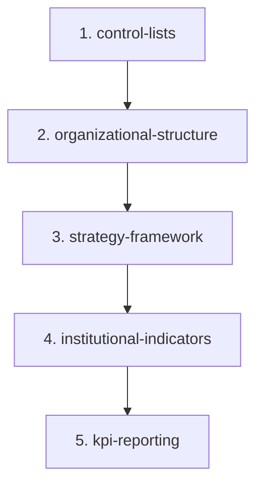

# Spec Family — Institutional Performance (STAR)

## 0. Document Control

- **Family path:** `docs/specs/institutional-performance/`
- **Parent spec / Feature:** Institutional Performance / Alliance Strategy 2026–2030 configuration, KPI planning and KPI reporting in STAR
- **Date created:** 2026-09-25
- **Last updated:** 2026-09-26 — manifest edit approved by the requester: former child 1 split into three (Control Lists, Organizational Structure, Strategy Framework)
- **Spec-family status:** `open`
- **Owner / Squad:** Hector F. Tobón (requester, on behalf of PISA4 / Strategy Refresh)
- **Source ideas:** `STAR Module ideas/00_README_Institutional-Performance-Ideas.md` and `Idea-1/2/3_*.md` (OneDrive · Strategy Refresh · KPI Validation, 2026-09-25)
- **Linked PRD section:** [`docs/prd.md`](../../prd.md) — Center Admin tools (portfolio management)
- **Linked TRD section:** [`docs/trd/trd.md`](../../trd/trd.md) — backend/frontend architecture
- **JPD idea:** [PARI-258](https://cgiarmel.atlassian.net/browse/PARI-258) — *Institutional Performance - Systematization of the Alliance Strategy and Organizational Structure* (Q3 2026; covers children 1–3). Earlier overlapping ideas PARI-224, PARI-230, PARI-219 are left for the BA to reconcile
- **Shared mockup:** https://claude.ai/artifact/EPtLbFVhaEQb3Vgq7kuyRP (private) · local copy [`mockup/`](mockup/)

---

## 1. Context & Splitting Rationale

Idea 1 (reference data) was split into three children because each one is useful on its own and each depends on the one before it:

- **Control Lists** holds the vocabularies that the other two read, including the organizational levels.
- **Organizational Structure** holds the versioned org units that own dimensions, objectives and, later, KPIs and mapped records.
- **Strategy Framework** holds the strategy and monitoring hierarchies plus the annual Institutional Objectives. It uses owner units from the structure.

Ideas 2 (KPI planning) and 3 (KPI reporting) follow. A mapping module (results and other records → indicators and org units) is expected after this family's reference data; it is not yet a row here.

---

## 2. Child Specs Manifest

| # | Spec Path | Title / Scope | Depends on | Parallel-safe | Status | Owner |
|---|---|---|---|---|---|---|
| 1 | `institutional-performance/control-lists` | Portfolio-scoped control lists: categories, lists and values, with in-use protection | `none` | `no` (shared nav + table pattern introduced here) | `pending` | Hector F. Tobón |
| 2 | `institutional-performance/organizational-structure` | Versioned 4-level org structure (L1 Division › L2 Department › L3 Office › L4 Unit): permanent IDs, effective-dated changes, as-of views, close/successor | `control-lists` | `no` | `pending` | Hector F. Tobón |
| 3 | `institutional-performance/strategy-framework` | IO → SO, EN; PA → DIM → IND; annual Institutional Objectives. Extends `impact_outcomes` / `strategic_objectives` | `organizational-structure` | `no` | `pending` | Hector F. Tobón |
| 4 | `institutional-performance/institutional-indicators` | Idea 2 — KPI definition, planning cycles, published view, edit mode for directors and delegates | `strategy-framework` | `no` | `pending` | Hector F. Tobón |
| 5 | `institutional-performance/kpi-reporting` | Idea 3 — achievement capture per period, evidence, review workflow, assisted extraction | `institutional-indicators` | `no` | `pending` | Hector F. Tobón |

Children 1–3 have a folder with a `proposal.md`. Children 4 and 5 get their folder when they are proposed.

### Status Vocabulary
- `pending`: Child spec is proposed, drafted, or awaiting prerequisite child completion.
- `active`: Child spec is currently approved and in active implementation (`/akili-execute`).
- `done`: Child spec implementation and testing (`/akili-test`) are complete and verified.
- `blocked`: Child spec is blocked by external dependencies or prerequisite child blockers.

---

## 3. Dependency Graph

---

## 4. Shared Rules (bind every child)

Decided by the requester on 2026-09-25 and 2026-09-26. Children cite these IDs instead of restating them.

| ID | Rule |
| --- | --- |
| **F-1 Access** | Center Admin and System Admin can read and write everything. Client: `centerAdminGuard` (`canAccessCenterAdmin` already admits role 1 Admin and role 9 Center Admin — `client/…/shared/services/cache/roles.service.ts:9-10,34`). Server: `@Roles(...)` for the same roles; `SYSTEM_ADMIN` bypasses. No new roles |
| **F-2 Portfolio scope** | Every list, structure and framework element belongs to a portfolio. Only **Portfolio 2 (2026–2030)** is configured now; Portfolio 1 appears in the selector as "not configured". Global control lists are a later decision |
| **F-3 Navigation** | Under *Center admin*, the three new pages are **nested under Portfolio Management** in the left menu, in this order: *Control Lists → Organizational Structure → Strategy Framework*. Each page has a portfolio selector, defaulting to the portfolio whose dates contain today. Existing Center admin items and the Portfolio Management page are **not changed** |
| **F-4 CRUD** | Admins add, edit and delete; the only form actions are **Save**, **Cancel** and **Delete**. No lifecycle statuses, no per-element source, no workbook import |
| **F-5 Delete protection** | Nothing with children or associated information can be deleted. The dialog names the blocker and offers the alternative (deactivate a value, close an org entry) |
| **F-6 Codes** | Codes are proposed automatically, editable, and unique within their scope |
| **F-7 Table standard** | Every **new** table: rows per page (10 / 25 / 50 / 100), resizable columns, click-to-sort headers with an indicator, **default sort by code or ID ascending** in natural numeric order, search, **Export .xlsx** of the filtered and sorted rows. Existing tables are out of scope (see §5) |
| **F-8 Data** | Seeded with example data for review by a colleague; each module also works when empty. Framework: `Alliance-Strategy-2026-2030_20260902.xlsx`. Master Monitoring Framework: organizational structure only |
| **F-9 Stable links** | Any record linked to an org unit or a framework element links to its **permanent ID**, never to its name, code or parent |

---

## 5. Deferred Work (not a child; tracked here so it is not lost)

| Item | Why deferred |
| --- | --- |
| Apply F-7 to the 10 existing tables — `results-table`, `project-results-table`, `results-center-table`, `my-projects`, `select-linked-results-modal`, `authors-contact-persons-table`, `portfolio-management`, `bilateral-mapping`, `prompt-manager`, `variable-configuration` | Today 5 have a paginator, all sort on some columns, none have resizable columns, and export exists only in the results center and my-projects. Retrofitting touches live screens and their specs; do it as its own change (`/akili-propose changes/table-standard-retrofit`), ideally by first extracting the shared table pattern built in child 1 |
| Configure Portfolio 1 (2010–2025) from what STAR already holds | Results are already mapped to P1 levers (CLARISA levers are linked to a portfolio), IO/SO, SDGs and OICRs. Whether those become a P1 structure is a separate decision |

---

## 6. Closed-Set Rule (Non-Negotiable)

> [!IMPORTANT]
> **Closed-Set Rule:** The child table in Section 2 is the **exhaustive child set** of this spec family.
> - No AKILI command or agent may create or execute a child spec folder without a prior registered row in this manifest.
> - Adding, removing, or re-ordering child specs requires a Human-In-The-Loop (HITL) approved manifest edit.
> - The spec family is considered `complete` only when all child specs in this manifest have achieved `done` status and have been verified.
