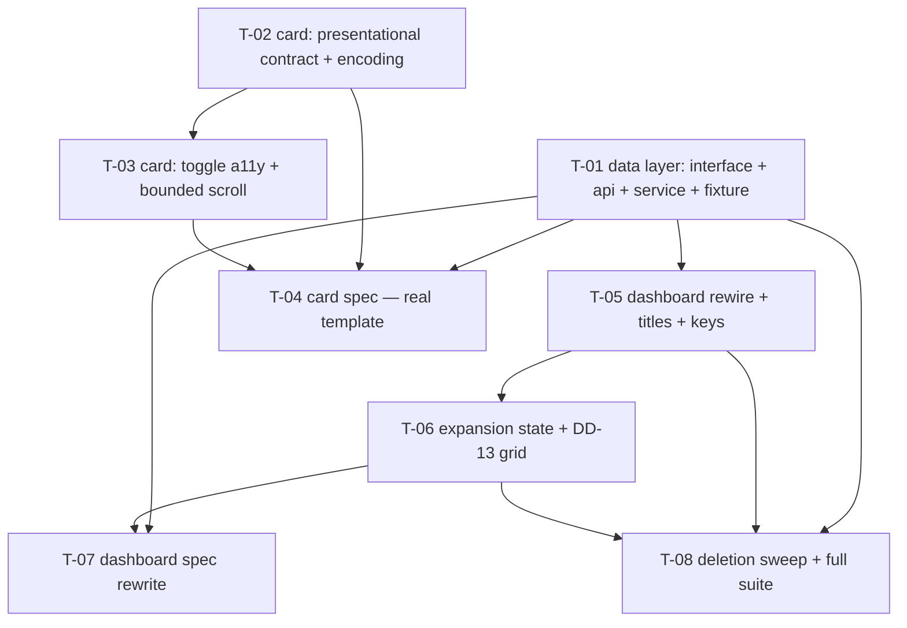

# Tasks — Project Dashboard / Full-payload migration + Show-more + title alignment

- **Module:** project-dashboard (STAR client)
- **Spec id:** 2026-07-full-payload-show-more
- **Status:** not-started
- **Owner:** d.casanas@cgiar.org
- **Linked requirements:** [`./requirements.md`](./requirements.md)
- **Linked design:** [`./design.md`](./design.md)
- **Linked judgment:** [`./judgment.md`](./judgment.md) — 3 rounds, terminal receipt `ESCALATED ⚠️`
- **Visual reference:** [`./mockup/index.html`](./mockup/index.html) — GATE-2, three containment modes
- **Gates:** GATE-1 ✅ closed by measurement · GATE-2 ✅ closed
- **Budget (tripwire):** 8 tasks · ≈1,600 changed LOC · 2 review rounds
- **Last updated:** 2026-07-29

**Client-only.** No migration, no entity, no DTO, no server change, no Swagger, no env var — so the template's schema/entity/e2e/rollout categories do not apply and are omitted rather than filled with "N/A".

---

## 1. Task numbering

`T-01` … `T-08`. Higher numbers do not imply higher priority — see §2.

Two ordering constraints are **not negotiable**:

- **Deletion is last (T-08).** Adding the new path and switching consumers before removing the old one keeps every intermediate commit bisectable (RSK-3).
- **The card's spec (T-04) lands with the card's behaviour (T-02/T-03), not later.** Everything in R-PDB-002/003/004 renders *inside* the card, and the dashboard spec stubs it — deferring T-04 leaves that behaviour with no gate at all (**KZ-001**, recurrence 4).

## 2. Dependency graph

**Parallelisable:** T-01 and T-02 have no dependency on each other — the data layer and the card contract can be built simultaneously.

---

## 3. Task list

### T-01 — Client data layer: interface, api method, service, shared fixture

- **Requirements covered:** R-PDB-001, NFR-PDB-001
- **Files touched (intended):**
  - `src/app/shared/interfaces/contract-full-reports.interface.ts` *(new)*
  - `src/app/shared/services/get-full-contract-reports.service.ts` *(new)*
  - `src/app/shared/services/get-full-contract-reports.service.spec.ts` *(new)*
  - `src/app/testing/contract-full-reports.mock.ts` *(new)*
  - `src/app/shared/services/api.service.ts`, `api.service.spec.ts`
- **Description:** Mirror `ContractFullReportsDto` client-side, add `GET_FullContractReports`, and expose the payload through a signal service. Per **DD-2r** the service holds a **`payload` signal** with per-section `computed` accessors — not independent imperative signals — because that is what makes the section shape one source of truth. `loadError` clears `payload`.
- **Implementation notes:**
  - Mirror all seven sections including `geo_scope`, which this spec does not consume — the geographic spec needs it and a second interface would drift.
  - `ProjectDashboardRankedItem` gains `user_id` (confirmed present in `reports-main-contact-persons.dto.ts`).
  - `contract-id` through `encodeURIComponent`, matching the four methods it replaces.
  - No `useResultInterceptor` — this is a contract-scoped, not result-scoped, call.
  - Fixture must carry: >5 partners, a **duplicate-display-name contact pair**, a deliberately **out-of-order** section, one section of exactly 5 and one of 3.
- **Acceptance / done check:**
  - [x] `get-full-contract-reports.service.spec.ts` asserts the URL **and** that a contract code containing a space and a `/` encodes correctly (R-PDB-001 AC.3), using `HttpTestingController`.
  - [x] `loadError` path asserted to set the flag **and clear `payload`**.
  - [x] `api.service.spec.ts` covers the new method.
  - [x] `npm run lint` clean.
- **Evidence that does NOT count:** asserting the URL against a hand-built string while the service is mocked. The point of this task's gate is that a real request was shaped correctly — if `HttpTestingController` is not the mechanism, the assertion is decorative. Likewise a fixture that omits the homonym pair or the out-of-order section silently disarms T-04 and T-07.
- **Dependencies:** none
- **Effort:** M · **Skills:** `angular-developer`
- **Status:** **done** — Reviewer PASS attempt 1, 2026-07-29. See [`execution.md`](./execution.md) § T-01.
- **Consumed by later tasks:** service accessors are `topPartners` / `topPrimaryLevers` / `topMainContactPersons` / `topContributors` / `staff` / `geoScope`; fixture entry point is `mockContractFullReports(overrides?)` in `src/app/testing/contract-full-reports.mock.ts`.

---

### T-02 — Card: presentational contract + encoding pinned to the full list

- **Requirements covered:** R-PDB-002 (AC.1, AC.3, AC.5), R-PDB-003 (AC.1), R-PDB-004 (all)
- **Files touched:** `…/project-dashboard-card/project-dashboard-card.component.ts`, `.html`
- **Description:** Turn the card presentational: `visibleLimit` input (**default `null`**, DD-12), `expandToggled` output, `visibleItems` computed, `canExpand` computed, `COLLAPSED_ITEM_LIMIT = 5` **exported**. Templates iterate `visibleItems()`; **every encoding member keeps reading `items()`** — that single asymmetry is what delivers R-PDB-004.
- **Implementation notes:**
  - **Do not** touch `barColor`, `maxCount`, `totalCount`, `partnerBarWidthPercent`, `fillPercent` — they must continue reading `items()`. The bug this prevents: `projectDashboardBarColor(index, total)` paints `last` at `index === total - 1`, so a window-scoped total recolours row 5 the moment row 6 appears.
  - **Structural bindings are not encoding.** `[class.justify-center]="items().length <= 3"` and both `grid-template-columns` expressions (`:49-54`, `columns` branch) **must** switch to `visibleItems().length`, or a 40-item section collapsed to 5 renders 40 grid tracks holding 5 bars. `columns` is unused today but is the `layout` input's **default**.
  - `visibleLimit` defaulting to `null` is load-bearing: it is what leaves the geographic card's three `variant="list"` consumers byte-identical (R-PDB-002 AC.5) and keeps the A2 split clean.
- **Acceptance / done check:**
  - [ ] With `visibleLimit=null` the card renders every item — verified against a >5 fixture.
  - [ ] With `visibleLimit=5` and 37 items, rows 1-5 render with the **same colour and width** as when all 37 render (R-PDB-004 AC.1/AC.2).
  - [ ] In the `columns` layout, rendered grid track count equals rendered cells in **both** states.
  - [ ] `npm run lint` clean; `strictTemplates` passes.
- **Evidence that does NOT count:** asserting colours by re-calling `projectDashboardBarColor` in the test. Read the **rendered** style off the element — otherwise the test proves the helper is pure, not that the template passes it the right total, which is the actual defect.
- **Dependencies:** none
- **Effort:** M · **Skills:** `angular-developer`, `ui-ux-pro-max`
- **Status:** **done** — Reviewer PASS attempt 1, 2026-07-29. See [`execution.md`](./execution.md) § T-02.
- **Note for T-04:** the four acceptance boxes above are statically true of the shipped code but are **not yet asserted anywhere** — T-04 owns them. When asserting rank-5 invariance, assert **bar colour and bar width specifically**, not "row 5 renders identically": `rows-stacked-lever` carries `last:border-b-0 last:pb-0`, so row 5's divider legitimately differs between states (advisory A-02.1).

---

### T-03 — Card: toggle, accessibility, bounded scroll container

- **Requirements covered:** R-PDB-002 (AC.2), R-PDB-003 (AC.3, AC.4, AC.5), NFR-PDB-003, NFR-PDB-004 (condition 1)
- **Files touched:** `…/project-dashboard-card.component.html`, `.ts`
- **Description:** Render the "Show more" / "Show less" toggle **once in the `variant="card"` shell**, and wrap the card outlet in a scroll container bounded only while expanded.
- **Implementation notes:**
  - **Position is pinned (DD-3):** inside the `@if (items().length)` arm (`:32-35`), *not* after the outer state-chain `
`. With one shared service, any card's **Try again** sets `loading` for all four while section signals may still hold data, so a toggle outside the arm renders beneath the spinner.
  - Rendered only when `canExpand() && variant() === 'card'`. `variant="list"` gets no toggle — by construction and by design contract.
  - Real `<button>`, `aria-expanded`, accessible name **including `title()`** so four "Show more" buttons are distinguishable, visible `:focus-visible`, `Enter`/`Space`.
  - Bound is viewport-relative (**OQ-3**, settled by the GATE-2 mockup at `max-height:46vh`), applied **only when `visibleLimit() === null`**. The `variant="list"` outlet is **left alone** — A2-8 owns it.
  - Respect `prefers-reduced-motion` on the caret/height transitions.
- **Acceptance / done check:**
  - [ ] A section of ≤ 5 renders **no** toggle (R-PDB-002 AC.2); >5 renders one.
  - [ ] `aria-expanded` tracks state; accessible name contains the chart title; keyboard activation works.
  - [ ] The bounded container is present **and conditioned** on `visibleLimit() === null`.
  - [ ] Toggling emits `expandToggled` and changes no other card.
- **Evidence that does NOT count:** a passing spec is **not** evidence the layout holds. jsdom computes no box model — `overflow`, height propagation and grid stretching are invisible to it. The spec may only assert the container exists and is conditioned; the rendered outcome is the human check in `requirements.md` §7. Do not report NFR-PDB-004 as verified on the strength of `npm test`.
- **Dependencies:** T-02
- **Effort:** M · **Skills:** `angular-developer`, `ui-ux-pro-max`
- **Status:** **done** — Reviewer PASS on **attempt 2**, 2026-07-29. See [`execution.md`](./execution.md) § T-03. **First rework round of the spec; 1 of 2 remaining.**
- **OQ-3 closed:** bound is viewport-relative, `max-h-[46vh]`, taken verbatim from the GATE-2 mockup.
- **Trap discovered — applies to every later task (E-03.2):** an Angular class binding whose class name contains a `.` **silently emits the wrong class**. `[class.pr-1.5]` compiles clean and applies `pr-1`. Arbitrary values in square brackets (`max-h-[46vh]`, `pr-[6px]`) are safe — they contain no `.`. Never assume a green build means the class applied.
- **NFR-PDB-004 condition 1 is implemented but UNVERIFIED** — jsdom computes no box model. T-06 carries the human check.

---

### T-04 — Card spec: the real template, no stub

- **Requirements covered:** R-PDB-002, R-PDB-003, R-PDB-004, NFR-PDB-003, NFR-PDB-005 · **Defect classes:** DC-3, DC-4, DC-6, DC-7, DC-11 (card side)
- **Files touched:** `…/project-dashboard-card.component.spec.ts` (114 → ~340 lines)
- **Description:** The gate for everything T-02 and T-03 build. **This spec must instantiate the real component and assert on rendered DOM.** `project-dashboard.component.spec.ts` replaces the card with `ProjectDashboardCardStubComponent` (`:205-226`), so any expansion assertion made there is vacuous — **KZ-001**, the highest-recurrence active lesson.
- **Implementation notes:** cover slicing at `visibleLimit` and `null`; toggle presence/absence and **position inside the state-chain arm**; `expandToggled` emission; **colour + width invariance across a limit change**; rank continuity past 5; `columns` track count in both states; `aria-expanded`; accessible name; keyboard; bounded container conditioned. Use the T-01 fixture — do not hand-roll per-test data (client guide: never reinvent fixtures).
- **Acceptance / done check:**
  - [ ] No stub, mock or `NO_ERRORS_SCHEMA` stands in for the component under test.
  - [ ] Colour/width invariance asserted from **rendered styles**, before and after.
  - [ ] Coverage on the card component does not fall.
- **Evidence that does NOT count:** any assertion that passes with the template replaced by a stub. Before declaring done, sanity-check the suite's fidelity: temporarily break one thing T-04 claims to cover (e.g. point an encoding member at `visibleItems()`) and confirm the suite **fails**. A green suite that cannot fail is the exact defect KZ-001 records.
- **Dependencies:** T-01, T-02, T-03
- **Effort:** L · **Skills:** `angular-developer`
- **Status:** **done** — Reviewer PASS attempt 1, 2026-07-29. See [`execution.md`](./execution.md) § T-04.
- **Fidelity proven, not asserted:** 8 mutations run against the component, **7 killed**, the 8th proven a semantically equivalent mutant. Four of the eight were invented by the Reviewer and unanticipated by the author. Card coverage rose 97/86/85/100 → **100/100/100/100**.
- **Landed at 534 lines vs the ~340 estimate (+194).** Adjudicated load-bearing, not padded — see the budget note in `execution.md`.

---

### T-05 — Dashboard: rewire to the single service, titles, keys, sort

- **Requirements covered:** R-PDB-001, R-PDB-004 (AC.4), R-PDB-005, R-PDB-007
- **Files touched:** `…/project-dashboard/project-dashboard.component.ts`, `.html`
- **Description:** Replace four injected services with one, re-source every derived value, harden identity keys, add the missing sorts and rename four titles.
- **Implementation notes:**
  - **DD-9:** provide `GetFullContractReportsService` at the **component** level (as the four it replaces are, `:49-55`), not `providedIn: 'root'` — root scope would retain the previous contract's payload across navigation.
  - Re-source **both** the four item computeds **and** the four `*Empty()` computeds (`:153,169,184,198`), plus the 16 `[loading]`/`[error]`/`[empty]`/`(retry)` bindings. Keep each `*Empty()`'s `!loadError()` guard — it is what makes the error state win over empty when `payload` is cleared.
  - Existing label formatters (`formatPartnerLabel`, `formatLeverDisplayLabel`, `formatContributorLabel`, `formatMainContactPersonName`) are **unchanged**, so label rendering cannot regress.
  - `id` from payload identity: contacts key on `user_id`, not the formatted name.
  - **Add explicit descending sort to all four** — `partnerItems()` has none today (`:176-182`) and `maxCount()` now scales the whole list, so an out-of-order payload could push a bar past 100 %.
  - Titles per **DD-5**: Results Partners · Primary Levers · Main contact person · Contributing projects. `contractId` keeps its `snapshot` derivation (**DD-10r**) — do **not** make it reactive.
- **Acceptance / done check:**
  - [ ] Exactly one `reports/full` request per contract; **zero** to any `reports/top-*`.
  - [ ] Two contacts sharing a display name both render, no `@for` track collision.
  - [ ] An out-of-order fixture section renders descending with no bar over 100 %.
  - [ ] The four titles match `requirements.md` R-PDB-007 exactly (exact-string assertions).
- **Evidence that does NOT count:** request assertions written in this spec against `{ provide: ApiService, useValue: apiMock }` — that harness has no mock backend, so it cannot observe requests. Request/URL evidence lives in T-01; here assert at **spy level** (one `main()` call, zero calls to retired services).
- **Dependencies:** T-01
- **Effort:** M · **Skills:** `angular-developer`
- **Status:** **done** — Reviewer PASS attempt 1, 2026-07-29. See [`execution.md`](./execution.md) § T-05.
- **Known and accepted:** T-05 un-injects the four services that `project-dashboard.component.spec.ts` mocks, so that 848-line suite is **red between T-05 and T-07 by design** — the spec and its stub must change together, which is why T-07 is separate. PR 3 groups T-05+T-06+T-07, so the redness never escapes the PR. Full-suite run confirms **exactly 4 failures, all in that file** (308 suites / 6,250 tests).
- **⚠️ T-05 must NOT ship as a standalone commit to a deployable branch.** Until T-06 binds `visibleLimit`, the cards render the **full** list — up to ~137 partner rows (GATE-1 worst case) with no bound and no toggle.
- **T-07's work order — the four failing cases:** `should load project dashboard data for the parent contract` · `should build and sort ranked service items` · `should handle status response without result rows and lever labels with empty prefixes` · `should compute empty states from loading, error, and list signals`.

---

### T-06 — Dashboard: expansion state + DD-13 independent height

- **Requirements covered:** R-PDB-003 (AC.4, AC.6, AC.7), NFR-PDB-004 (condition 2)
- **Files touched:** `…/project-dashboard.component.ts`, `.html`
- **Description:** Host-owned expansion state, and the grid behaviour that stops an expanded card from dragging its neighbour.
- **Implementation notes:**
  - `ChartKey` = exported string-literal union of exactly four members (`'partners' | 'levers' | 'contacts' | 'contributors'`), so a typo is a compile error rather than a silently dead toggle.
  - `signal<ReadonlySet<ChartKey>>`. On `expandToggled`, **emit a new `Set`** — a `Set` mutated in place and re-`set()` fails Angular's `Object.is` check and silently never re-renders, producing a toggle that looks wired and does nothing.
  - `visibleLimit` per card = `expanded().has(key) ? null : COLLAPSED_ITEM_LIMIT` (import the exported constant; do not hardcode `5`).
  - **A plain `signal` is the mechanism, not an omission (AC.6/AC.7).** Its lifetime is the component's, so a contract change collapses everything for free — every navigation that changes `:id` destroys this component (D-AC5, verified across all seven call sites). Nothing keyed to `payload()`: that would also fire on **Try again**, collapsing a list the user deliberately opened, which AC.7 forbids.
  - **DD-13:** the ranked grid carries `align-items: start` **only while `expanded().size > 0`**; collapsed it keeps `lg:items-stretch`. Without this, `items-stretch` drags the row-mate to the expanded card's height and strands its five rows above a tall empty gap with its "Show more" below a void. **Do not** fill that gap with extra rows — that would contradict R-PDB-002 and show data nobody asked for.
- **Acceptance / done check:**
  - [ ] Expanding one card leaves the other three collapsed (AC.4).
  - [ ] A `loadError` → `update()` retry cycle **preserves** each card's state (AC.7).
  - [ ] A fresh component instance starts fully collapsed (AC.6).
  - [ ] The grid class is applied when the set is non-empty and **absent when empty**.
  - [ ] **Human check** — `requirements.md` §7, all five steps, against the GATE-2 mockup as reference: page does not grow · row-mate keeps its height **and shows no empty gap** · right-hand column does not stretch · collapsed cards are equal height again.
- **Evidence that does NOT count:** the class assertion is **not** evidence the layout is correct — it proves a class is present, nothing about rendered geometry. Three rounds of blind review passed on a design whose containment was incomplete precisely because no automated gate can see this; it was caught by operating the mockup. If the human check is skipped, report NFR-PDB-004 as **unverified**, not as passed.
- **Dependencies:** T-05
- **Effort:** M · **Skills:** `angular-developer`, `ui-ux-pro-max`
- **Status:** todo

---

### T-07 — Dashboard spec: rewrite the stub and provider block

- **Requirements covered:** R-PDB-001, R-PDB-003, R-PDB-005, R-PDB-007 · **Defect classes:** DC-1, DC-2 (spy level), DC-5, DC-11 (host side)
- **Files touched:** `…/project-dashboard.component.spec.ts` (848 lines)
- **Description:** The existing provider/override block mocks all four deleted services and the stub component predates the new card contract. Both must change together.
- **Implementation notes:**
  - `ProjectDashboardCardStubComponent` (`:21-38`) declares its `@Input()`s explicitly — it **must** gain `visibleLimit` and `expandToggled` or `strictTemplates` fails the build.
  - Replace the four service mocks with one for `GetFullContractReportsService`.
  - The stub is **legitimate here**: passing correct inputs and reacting to outputs *is* the dashboard's job. It is not legitimate for anything that renders inside the card — that is T-04.
  - **Seam, host side (DC-11):** emitting `expandToggled` from the stub must flip host state and push a new `visibleLimit` down, and the emitted value must be a **new `Set`**.
- **Acceptance / done check:**
  - [ ] Correct `title` / `items` / `layout` / `visibleLimit` reach each of the four cards.
  - [ ] Seam round-trip asserted; new-`Set` identity asserted.
  - [ ] Retry preserves expansion (AC.7); fresh instance collapsed (AC.6).
  - [ ] Homonym fixture renders two rows.
  - [ ] The whole 848-line suite still passes — not only the new cases.
- **Evidence that does NOT count:** cases that pass because the stub silently swallows an unknown binding. After wiring, confirm `strictTemplates` would reject a misspelled input — if the stub accepts anything, the input assertions prove nothing.
- **Dependencies:** T-05, T-06
- **Effort:** L · **Skills:** `angular-developer`
- **Status:** todo

---

### T-08 — Deletion sweep and full-suite verification

- **Requirements covered:** R-PDB-008, NFR-PDB-005 · **Defect class:** DC-10
- **Files touched:**
  - **Delete:** `get-top-contributors-contracts.service.ts`, `get-top-main-contact-persons.service.ts`, `get-top-partners.service.ts`, `get-top-primary-levers.service.ts` + their four specs (**468 LOC measured**)
  - `api.service.ts` — remove four `GET_Top*` methods; `api.service.spec.ts` — remove their cases
- **Description:** Remove the superseded client path once nothing consumes it. **Last task by design** (RSK-3).
- **Implementation notes:**
  - **`GetGeoScopeService` and `GET_GeoScope` must survive** — they retire with the geographic spec (R-PDB-008 AC.4). Deleting them here breaks the geographic card and silently pulls A2's scope into this PR.
  - Server endpoints are untouched (umbrella OQ-8).
  - Re-confirm by grep that nothing outside `project-detail` injected the four services before deleting (ASM-4).
- **Acceptance / done check:**
  - [ ] Four service files + four specs gone; no dangling import anywhere.
  - [ ] `GetGeoScopeService` / `GET_GeoScope` still present; the geographic card still renders its three lists **with the same row counts as before this spec** (DD-12 regression check).
  - [ ] **Full** `npm test` from `client/research-indicators/` passes — coverage floors held (statements 40 / branches 20 / lines 45 / functions 30).
  - [ ] `npm run lint` and `npm run s-lint` clean.
- **Evidence that does NOT count:** a **targeted** suite run. **KZ-003** (active lesson): a targeted run confirms the brief was followed, not that the blast radius is clean, and this task's entire risk *is* blast radius. If the full suite was not run, the task is not done. Equally: a green suite with a skipped or `.only` spec is not a pass — check for both before reporting.
- **Coverage-flag rule, established during T-04 (`execution.md` § T-04):** `jest.config.ts:7` sets `collectCoverage: true`, so a **path-scoped** run fails all four global thresholds by construction (measured: 9.15 / 6.43 / 5.61 / 8.79). Earlier tasks passed `--coverage=false` to suppress that noise. **T-08's coverage gate must therefore be a full-suite run WITHOUT `--coverage=false`,** and no path-scoped run may be cited as coverage evidence.
- **`npm run s-lint` cannot be "clean" — the acceptance box above is unachievable as written.** Baseline on this branch is **352 pre-existing SCSS errors** in unrelated files (measured during T-03, confirmed byte-identical via `git stash`). Neither the card nor the dashboard component has a `.scss` file. **Awaiting an owner decision** on whether to reinterpret this as "introduces no *new* s-lint errors" (the reading this run assumes) or to drop the criterion.
- **Dependencies:** T-01, T-05, T-06
- **Effort:** M · **Skills:** `angular-developer`, `systematic-debugging` (if the sweep surfaces failures)
- **Status:** todo

---

## 4. Testing expectations

| Spec | Owner task | Doubles policy |
| --- | --- | --- |
| `project-dashboard-card.component.spec.ts` | T-04 | **No stub. Real template.** The only place R-PDB-002/003/004 can be gated |
| `get-full-contract-reports.service.spec.ts` | T-01 | `HttpTestingController` — the only place request/URL evidence is expressible |
| `api.service.spec.ts` | T-01, T-08 | existing pattern |
| `project-dashboard.component.spec.ts` | T-07 | Card stub legitimate for input/output assertions only |
| Full suite | T-08 | — |

No e2e tests: client-only change, no new route, no new endpoint. No server tests: the server is untouched.

## 5. Execution conventions

- One PR per group in §6; squash on merge (repo convention).
- PR title format `<type>(<module>): <subject>` — e.g. `feat(project-dashboard): consume reports/full for the four ranked charts`.
- Branch: `AC-1672-Add-New-Dashboard-Charts-Based-on-Project-Indicator` (current).
- Never `--no-verify`; do not bypass husky.
- Commit bodies should name the requirement ids they close.

## 6. PR strategy

≈1,600 changed LOC is far past the ~400 single-PR guideline, so **four chained PRs**. The split is chosen so that **nothing a user sees changes until PR 3** — PRs 1 and 2 are pure additions.

| PR | Tasks | ~LOC | User-visible change | Why this boundary |
| --- | --- | --- | --- | --- |
| **1** | T-01 | ~340 | **none** | New files plus one api method. Nothing consumes them yet, so it is reviewable in isolation and revertable without touching the dashboard |
| **2** | T-02, T-03, T-04 | ~530 | **none** | The card gains an input that defaults to `null` = today's behaviour (DD-12). Every existing call site, including the geographic card, renders identically. Ships with its own spec — deferring T-04 would leave the behaviour ungated (KZ-001) |
| **3** | T-05, T-06, T-07 | ~560 | **yes** — 4 → 5 rows, four renamed titles, the DD-4 colour ramp, the new toggle | The first PR a user notices. Carries the human check and the product-owner sign-off |
| **4** | T-08 | ~170 | none | Deletion, once nothing consumes the old path. Isolated so a revert never drags the feature back out |

Each PR description should follow `cognitive-doc-design` review-empathy rules: what to review first, what is deliberately out of scope, links to the previous and next PR in the chain. **PR 3 must carry the human-check result explicitly** — it is the only gate for NFR-PDB-004.

## 7. Risks & blockers log

| # | Date | Risk / blocker | Mitigation | Status |
| --- | --- | --- | --- | --- |
| RB-1 | 2026-07-29 | **The round-4 fix pass has no independent review.** The judgment-day fix ceiling was reached; the final delta (AC.6/AC.7 narrowing, DD-13, budget, the geographic split) was applied under explicit user authorisation and never re-judged | Treat the first Reviewer pass in `/akili-execute` as the missing audit, especially on T-06 (AC.6/AC.7 + DD-13) | open |
| RB-2 | 2026-07-29 | **NFR-PDB-004 has no automated gate.** Three rounds of blind review passed on an incomplete containment design; the gap was found only by operating the mockup | The five-step human check on T-06; the mockup as reference. Report unverified rather than passed if skipped | open |
| RB-3 | 2026-07-29 | `project-detail.component.ts` route staleness — **a split-brain page already reachable in production today** (`requirements.md` D-AC5). Out of scope here | File separately. Do **not** partially fix it from this spec — a reactive child plus a snapshot parent is worse than the current state | open |
| RB-4 | 2026-07-29 | T-08 may surface consumers of the four services that grep missed | Full-suite run is the gate; `systematic-debugging` if it fails | open |

## 8. Done definition

- [ ] T-01 … T-08 all `done`.
- [ ] Every AC in `requirements.md` checked, including **AC.7** (retry preserves expansion) and **R-PDB-002 AC.5** (the geographic card unchanged).
- [ ] The **five-step human check** (`requirements.md` §7) performed and its result recorded in PR 3 — or NFR-PDB-004 explicitly reported unverified.
- [ ] Full `npm test` + `npm run lint` + `npm run s-lint` pass; coverage floors held.
- [ ] Budget actuals compared against §Budget (8 / ~1,600 / 2). Exceeding it **escalates to the user** rather than continuing silently.
- [ ] `docs/ux-ui/design.md` records the expanded-card pattern, DD-13 and the four renamed titles; `docs/trd/trd.md` records `reports/full` as the dashboard's analytics contract.
- [ ] Product owner has acknowledged the **four** visible changes (`design.md` §11).
- [ ] `../geo-scope-expansion/` is unblocked — the card contract and the service it depends on exist.
