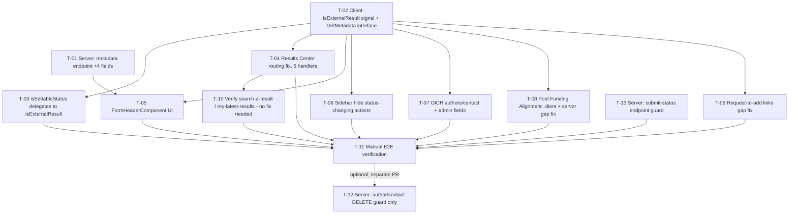

# Tasks — Results Center / External Results Readonly View

- **Module:** results-center (client feature)
- **Spec id:** 2026-07-external-results-readonly-view
- **Status:** not-started
- **Owner:** David Felipe Casañas Hernández
- **Linked requirements:** ./requirements.md
- **Linked design:** ./design.md
- **Reviewed:** Judgment Day round 1 (`./judgment.md`) — task list corrected below: T-04/T-06 fixes simplified and re-scoped (F-5, F-6), T-08 expanded with a server-side companion (F-1), new T-13 added and no longer optional (F-2), T-10 narrowed to verification-only (F-3), T-12 narrowed to one endpoint only (F-1, F-2).
- **Last updated:** 2026-07-27

---

## 1. Task Numbering

Tasks are `T-<NN>` within this spec. **T-12 is the only explicitly optional task** (a flagged fast-follow, not required for this ticket's acceptance criteria — see design.md D-2, revised). T-13 was added during Judgment Day round 1 and is **required**, not optional (it protects this spec's own sync-date feature — see F-2). Higher numbers do not imply higher priority; see the dependency graph below.

---

## 2. Dependency Graph

---

## 3. Task List

### T-01 — Extend `findMetadataResult()` + `MetadataResultDto` with 4 fields

- **Requirements covered:** R-RC-011
- **Files touched (intended):**
  - `server/researchindicators/src/domain/entities/results/results.service.ts`
  - `server/researchindicators/src/domain/entities/results/dto/metadata-result.dto.ts`
  - `server/researchindicators/src/domain/entities/results/results.service.spec.ts`
- **Description:** Widen the existing `select` clause in `findMetadataResult()` (lines ~766-791) and the return object (~810-833) to include `platform_code`, `public_link`, `external_link`, `updated_at`. Add matching optional `@ApiProperty()` fields to `MetadataResultDto`. No schema/migration change — all four already exist on `Result`.
- **Implementation notes:**
  - Confirm how `AuditableEntity`'s `updated_at` is selected elsewhere in this service (mirror the existing pattern rather than inventing a new selector path).
  - Keep all four fields optional in the DTO so no existing consumer breaks.
- **Acceptance / done check:**
  - [ ] `GET /results/:id/metadata` response includes the 4 new fields for a STAR and a non-STAR fixture result.
  - [ ] Swagger schema shows the new optional fields.
  - [ ] `results.service.spec.ts` covers the new fields in the returned shape.
- **Dependencies:** none
- **Estimated effort:** S
- **Owner:** TBD
- **Status:** done
- **Skills:** `nestjs-expert`, `api-design-principles`

---

### T-02 — `isExternalResult` signal + `GetMetadata` interface fields

- **Requirements covered:** R-RC-002, R-RC-011 (client side)
- **Files touched (intended):**
  - `client/research-indicators/src/app/shared/services/cache/cache.service.ts`
  - `client/research-indicators/src/app/shared/services/cache/cache.service.spec.ts`
  - `client/research-indicators/src/app/shared/interfaces/get-metadata.interface.ts`
- **Description:** Add `isExternalResult = computed(...)` to `CacheService`, derived from the existing `getCurrentPlatformCode()`. Add `platform_code?`, `public_link?`, `external_link?`, `updated_at?` to the `GetMetadata` interface, mirroring T-01's DTO additions.
- **Implementation notes:**
  - Keep this a pure, dependency-free computed — no new imports beyond what `CacheService` already has.
- **Acceptance / done check:**
  - [ ] Truth table test: `isExternalResult()` is `false` for `'STAR'` and `''`, `true` for `'TIP'`/`'PRMS'`/`'AICCRA'`.
  - [ ] Interface compiles with the 4 new optional fields; no existing usage breaks (`strict` TS).
- **Dependencies:** none (can run parallel to T-01)
- **Estimated effort:** S
- **Owner:** TBD
- **Status:** done
- **Skills:** `angular-developer`

---

### T-03 — `isEditableStatus()` delegates to `isExternalResult`

- **Requirements covered:** R-RC-002
- **Files touched (intended):**
  - `client/research-indicators/src/app/shared/services/submission.service.ts`
  - `client/research-indicators/src/app/shared/services/submission.service.spec.ts`
- **Description:** Replace the inline `isStarPlatform`/`hasNoPlatformCode` check at `submission.service.ts:64-69` with a call to `cache.isExternalResult()` (negated as needed) — behavior-preserving refactor.
- **Implementation notes:**
  - This MUST NOT change any existing test's expected output — it's a pure internal refactor.
- **Acceptance / done check:**
  - [x] All existing `submission.service.spec.ts` cases pass unchanged.
  - [x] New test: `isEditableStatus()` returns `false` for a TIP/PRMS/AICCRA result regardless of status_id/role (regression-proofing the delegation) — implemented as `it.each` over 15 cases (attempt 2, after attempt 1's version was found vacuous due to `computed()` caching).
- **Dependencies:** T-02
- **Estimated effort:** S
- **Owner:** TBD
- **Status:** done
- **Skills:** `angular-developer`

---

### T-04 — Results Center entry points navigate instead of opening the modal

- **Requirements covered:** R-RC-001
- **Files touched (intended):**
  - `client/research-indicators/src/app/pages/platform/pages/results-center/components/results-center-table/results-center-table.component.ts`
  - `.../results-center-table.component.spec.ts`
- **Description:** In `openResult()`, `onResultLinkClick()`, `handleRowClickResult()`, `getResultRouteArray()`, `getResultHref()`, **and `openResultByYear()` (added — Judgment Day round 1, F-6: confirmed a sixth handler at `:303-312` that today does a bare `return`, i.e. a dead click, for external platforms)**, replace the "open `resultInformation` modal" branch / dead-return (for `platform_code ∈ {PRMS, TIP, AICCRA}`) with the same `router.navigate`/URL-tree logic already used for STAR results, including the "approved snapshot → latest year" special case.
- **Implementation notes:**
  - Do not remove the modal-opening calls elsewhere in `AllModalsService` — only these 6 call sites change (design.md D-4).
  - Preserve `resultEntryQueryParamsForNavigation()` usage exactly as STAR results get it; `openResultByYear()` additionally must preserve the `{ version: year }` query param it already builds.
- **Acceptance / done check:**
  - [x] Clicking/opening a TIP/PRMS/AICCRA row, or a specific year-badge link on that row, navigates to `/result/:code` (URL assertion in spec).
  - [x] `resultInformation` modal is never opened from any of the 6 entry points for external results.
  - [x] STAR-result navigation (including the snapshot/latest-year branch) is unchanged — existing tests for that path still pass.
  - [x] Popover panel (opened via "+N more") must not be a navigation trap on external rows — fixed with a single `data-version-link` attribute on the versions-cell wrapper `
` (not the individual leaves), verified as the correct common ancestor of badges/toggle/panel by reading PrimeNG 19.0.6's `appendContainer()`/`toElement()` source directly.
- **Dependencies:** T-02
- **Estimated effort:** M
- **Owner:** TBD
- **Status:** done
- **Skills:** `angular-developer`

---

### T-05 — `FormHeaderComponent`: synced date, public link, deep link

- **Requirements covered:** R-RC-008, R-RC-009, R-RC-010
- **Files touched (intended):**
  - `client/research-indicators/src/app/shared/components/form-header/form-header.component.ts`
  - `.../form-header.component.html`
  - `.../form-header.component.spec.ts`
- **Description:** Add, gated on `cache.isExternalResult()`: a synced-date element sourced from `cache.currentMetadata().updated_at`; an "Open public link" action sourced from `public_link`; an "Open result in {platform}" deep-link action sourced from `external_link` + `platform_code`, reusing the copy/behavior from `ResultInformationModalComponent`'s `openDocumentLink()`/`openExternalLink()`.
- **Implementation notes:**
  - Use the existing `format-date` pipe for the synced date; degrade gracefully (render nothing) if `updated_at` is absent.
  - Platform-specific button copy: TIP → "Open link to result", AICCRA → "Open result in MARLO", PRMS → "Open result in PRMS".
  - No new hex literals — reuse existing token classes/`ButtonModule` styling.
- **Acceptance / done check:**
  - [ ] External result with both links present shows all 3 new elements; STAR result shows none of them.
  - [ ] Missing `public_link`/`external_link` individually hides just that action (no dead button).
  - [ ] Missing `updated_at` hides the synced-date element without rendering "Invalid Date".
  - [ ] WCAG 2.1 AA: accessible names on the new interactive elements (NFR-RC-003).
- **Dependencies:** T-01, T-02
- **Estimated effort:** M
- **Owner:** TBD
- **Status:** done
- **Skills:** `angular-developer`, `ui-ux-pro-max`

---

### T-06 — `ResultSidebarComponent`: hide status-changing actions externally

- **Requirements covered:** R-RC-007
- **Files touched (intended):**
  - `client/research-indicators/src/app/shared/components/result-sidebar/result-sidebar.component.ts`
  - `.../result-sidebar.component.html`
  - `.../result-sidebar.component.spec.ts`
- **Description — corrected during Judgment Day round 1 (F-5):** the four buttons are not four independent conditions. `:74-76` is a single shared outer `@if` wrapper (`indicator_id !== 5 && status_id not in [6,7,8]`) around Review (`:77-88`), Submit/Unsubmit (`:89-105`), and Approve (`:106-120`) together. Append `&& !cache.isExternalResult()` **once, to the shared wrapper at `:74-76`** — this closes all three simultaneously. Separately, append the same check to `showOicrStatusDropdown()` (`:96-99`). Leave the "X/Y sections completed" counter unguarded (design.md D-5).
- **Acceptance / done check:**
  - [x] For an external result (any role incl. System Admin), none of Submit/Unsubmit/Review/Approve/status-dropdown render.
  - [x] For a STAR result, all four behave exactly as before (no regression in existing sidebar spec cases).
- **Dependencies:** T-02
- **Estimated effort:** S
- **Owner:** TBD
- **Status:** done
- **Skills:** `angular-developer`

---

### T-07 — OICR: Authors/Contact table + admin-only fields respect external readonly

- **Requirements covered:** R-RC-003, R-RC-004
- **Files touched (intended):**
  - `client/research-indicators/src/app/pages/platform/pages/result/pages/oicr-details/components/authors-contact-persons-table/authors-contact-persons-table.component.ts`
  - `.../authors-contact-persons-table.component.html`
  - `.../oicr-details.component.ts`
  - `.../oicr-details.component.html`
  - `.../oicr-details.component.spec.ts`, `.../authors-contact-persons-table.component.spec.ts`
- **Description:** Add a `disabled` `@Input()` to `AuthorsContactPersonsTableComponent`; gate its Add button and delete icon on it. Call site (`oicr-details.component.html:115-116`) passes `cache.isExternalResult() || !submission.isEditableStatus()`. Guard `onDeleteContactPerson()` (`oicr-details.component.ts:111-119`) to no-op when external. Change MEL Regional Expert (`:30`) and SharePoint Folder Link (`:37`) `[disabled]` bindings from `!isAdmin` to `!isAdmin || cache.isExternalResult()`.
- **Acceptance / done check:**
  - [ ] External OICR result: Add/Delete on the authors/contact table are inert; `onDeleteContactPerson()` does not call `DELETE_AutorContact`.
  - [ ] External OICR result, admin viewer: MEL Regional Expert + SharePoint fields render disabled.
  - [ ] STAR OICR result in an editable status: both areas behave exactly as before.
  - [ ] STAR OICR result in a non-editable status: the Add button MAY now also render disabled at the table level — **accepted scope widening** (Judgment Day round 1, F-7; see requirements.md R-RC-003's scope clarification), not a defect to work around.
- **Dependencies:** T-02
- **Estimated effort:** M
- **Owner:** TBD
- **Status:** done
- **Skills:** `angular-developer`

---

### T-08 — Pool Funding Alignment: client `BilateralService.editable` + server TIP/AICCRA gate

- **Requirements covered:** R-RC-005
- **Files touched (intended):**
  - `client/research-indicators/src/app/shared/services/bilateral.service.ts` (+ `.spec.ts`)
  - `server/researchindicators/src/domain/entities/bilateral/bilateral.service.ts` (+ `.spec.ts`) — **added scope, Judgment Day round 1, F-1**
  - `server/researchindicators/src/domain/entities/bilateral/bilateral.controller.ts` (Swagger doc update only)
- **Description:** Client — add a leading `if (this.cache.isExternalResult()) return false;` to the `editable` computed (`bilateral.service.ts:73-79`), before the existing `is_read_only`/ownership/admin checks; also add the missing `CacheService` injection (this class currently injects only `ApiService`, `RolesService`, `CurrentResultService`). Server — **corrected scope after Judgment Day round 1:** `updateAlignment()` already has a server-side gate for PRMS (`assertPrmsSourceWritable()`/`isPrmsSourced()`, ~lines 1329-1342) — add a **separate** gate for TIP/AICCRA with its own distinct rejection description. Do NOT reuse or alter the existing `'Result is PRMS-sourced; bilateral alignment is read-only in STAR'` string — it is a locked contract the client pattern-matches on exactly at `pool-funding-alignment.component.ts:110`.
- **Implementation notes:**
  - New server check should be a separate private method (e.g. `assertNonPrmsExternalSourceWritable()`), not a modification of `isPrmsSourced()`/`assertPrmsSourceWritable()`.
  - Run the existing `bilateral.service.sourceReadOnlyGate.spec.ts` suite unchanged as a regression check — the PRMS gate and its exact message must not move.
- **Acceptance / done check:**
  - [ ] Client: external result (any `is_read_only` value, any role incl. Center Admin/owner): `editable()` is `false`; tab renders fully disabled.
  - [ ] Client: STAR result: `editable()` behavior unchanged.
  - [ ] Server: `updateAlignment()` rejects the mutation for TIP/AICCRA-sourced results with a distinct, accurate description.
  - [ ] Server: existing PRMS-sourced rejection and its exact 409 description are unchanged — `bilateral.service.sourceReadOnlyGate.spec.ts` still passes as-is.
- **Dependencies:** T-02
- **Estimated effort:** M
- **Owner:** TBD
- **Status:** done
- **Skills:** `angular-developer`, `nestjs-expert`

---

### T-09 — "Request to add" CLARISA-record links gated externally

- **Requirements covered:** R-RC-006
- **Files touched (intended):**
  - `client/research-indicators/src/app/pages/platform/pages/result/pages/capacity-sharing/capacity-sharing.component.ts` (and `.html`)
  - `.../partners/partners.component.ts` (and `.html`)
  - `.../innovation-details/components/organization-item/organization-item.component.ts` (and `.html`)
  - matching `.spec.ts` files
- **Description:** Gate `setSectionAndOpenModal(...)` calls/`@if` wrappers on `!cache.isExternalResult()` in all three locations. **DI note (Judgment Day round 1, F-4):** `organization-item.component.ts` currently injects only `SubmissionService` — add the missing `CacheService` injection there.
- **Acceptance / done check:**
  - [ ] For an external result, none of the three "request to add" links open their modal.
  - [ ] For a STAR result, unchanged.
- **Dependencies:** T-02
- **Estimated effort:** S
- **Owner:** TBD
- **Status:** done
- **Skills:** `angular-developer`

---

### T-10 — Confirm `search-a-result` / `my-latest-results` need no routing fix (verification only)

- **Requirements covered:** R-RC-001 (verification note); no code change expected
- **Files touched:** none expected — this is a verification task, **re-scoped from "fix if needed" to "confirm, then add to T-11" during Judgment Day round 1 (F-3)**
- **Description:** Both entry points were investigated directly during spec review:
  - `search-a-result.component.ts`'s `openResult()` (`:42-45`) already navigates unconditionally to `/result/{code}/general-information` for every `platform_code` — **confirmed, no modal branch exists, no routing fix needed.** Because the read-only enforcement this spec adds lives in the destination components (tabs, sidebar, services — T-02/T-03/T-06/T-07/T-08/T-09), this entry point inherits full read-only behavior automatically once those ship.
  - `my-latest-results.component.ts` already gates external results via `opensResultInformationModal()` — **confirmed correctly gated, no change needed.**
  - This task's job at implementation time is a final re-confirmation (nothing may have changed since spec review) and to ensure `search-a-result` is included in T-11's manual verification matrix, not to write a fix.
- **Acceptance / done check:**
  - [x] Re-confirm at implementation time that neither file's relevant code has changed since this spec was written. **Both confirmed unchanged and exactly as described** (Leader-verified 2026-07-28): `search-a-result.component.ts:42-45` navigates unconditionally with zero modal references anywhere in the file; `my-latest-results.component.ts:130-132` still gates PRMS/TIP/AICCRA into the modal via `opensResultInformationModal()`.
  - [x] `search-a-result` is added to T-11's manual verification pass.
  - [ ] ⚠️ **SCOPE GAP SURFACED — see `## Scope Gap: T-10` in `execution.md`.** The verification confirmed the *facts* the spec asserted, but revealed that decision D-3 answered the wrong question: `my-latest-results` is "correctly gated" only in the sense that it has no dead-click bug — it still opens the **old modal** for external results, so the home page now behaves inconsistently with Results Center and search-a-result, and contradicts the Jira AC ("when entering a result from an external system, the full metadata must be shown in the same STAR forms"). Awaiting a product decision before extending scope.
- **Dependencies:** T-04
- **Estimated effort:** S
- **Owner:** TBD
- **Status:** done (verification complete; a scope-gap decision is pending, tracked separately)
- **Skills:** `angular-developer`

---

### T-14 — Home "My Latest Results": route external results into the section shell

**Added 2026-07-28 by product decision** to close the scope gap T-10's verification surfaced (see `execution.md` → `## Scope Gap: T-10`, and design.md D-9 superseding D-3 for this component).

- **Requirements covered:** R-RC-013
- **Files touched (intended):**
  - `client/research-indicators/src/app/pages/platform/pages/home/components/my-latest-results/my-latest-results.component.ts`
  - `.../my-latest-results.component.html`
  - `.../my-latest-results.component.spec.ts`
- **Description:** Remove the `opensResultInformationModal()` special-casing so TIP/PRMS/AICCRA cards use the same `getStarResultRouterLink()` / `getStarResultQueryParams()` navigation STAR cards already use. Both helpers are already platform-agnostic and already handle the approved-snapshot → `general-information` + `version` case, so **no new navigation logic is added** — only the modal branch is removed.
- **Implementation notes:**
  - Preserve the `RESULT_ENTRY_SOURCE_VALUE_HOME` query param for external results (it comes free via `getStarResultQueryParams()`).
  - **Preserve the `.more-vert` overflow-menu click guard** in `onResultCardClick()` — unrelated concern, must keep working for all platforms.
  - Unlike T-04, there is no document-level capture-phase listener in this component — it's an ordinary `[routerLink]` + `(click)`, so T-04's cascading-interception difficulty does not apply here.
  - Once the modal branch is gone, `openResultInformationModal()` / `closeResultInformationModalIfOpen()` / `opensResultInformationModal()` may become dead — remove only what is provably unreferenced (grep first); do not touch `AllModalsService` itself (design.md D-4).
- **Acceptance / done check:**
  - [ ] Clicking a TIP/PRMS/AICCRA card navigates to `/result/:code` with the home-entry query param; the `resultInformation` modal does not open.
  - [ ] Approved-snapshot external result resolves to `general-information` + `version`.
  - [ ] STAR-card behavior unchanged (existing tests pass unmodified).
  - [ ] `.more-vert` menu click still does not navigate, any platform.
- **Dependencies:** T-04 (same behavioral contract), T-02
- **Estimated effort:** S
- **Owner:** TBD
- **Status:** in-progress
- **Skills:** `angular-developer`

---

### T-11 — Manual end-to-end verification across TIP / PRMS / AICCRA

- **Requirements covered:** all of R-RC-001 through R-RC-012 (verification, not new code)
- **Files touched:** none (manual QA pass)
- **Description:** In the running app (or test environment), open one TIP, one PRMS, and one AICCRA result end-to-end **via Results Center AND via `search-a-result`** (added — Judgment Day round 1, F-3: the latter already routes there unconditionally today and must show identical read-only behavior once T-02/T-03/T-06/T-07/T-08/T-09 ship). Walk all 12 tabs confirming zero interactive control remains editable/clickable in a way that would mutate data. Confirm synced-date, public-link, and deep-link render correctly (and degrade correctly when a field is absent). Click a year-badge link on a multi-snapshot external result (`openResultByYear`, F-6) and confirm it navigates rather than dead-clicking. Confirm one STAR result is visually and behaviorally unchanged from before this spec.
- **Acceptance / done check:**
  - [ ] Zero editable controls found across all 12 tabs for all 3 external platforms, reached via both Results Center and `search-a-result`.
  - [ ] Header elements render/degrade correctly per R-RC-008/009/010 AC.3/AC.2.
  - [ ] Year-badge link on an external multi-snapshot result navigates correctly (not a dead click).
  - [ ] STAR result baseline unaffected.
- **Dependencies:** T-03, T-04, T-05, T-06, T-07, T-08, T-09, T-10, T-13
- **Estimated effort:** S
- **Owner:** TBD
- **Status:** todo
- **Skills:** `angular-developer`, `systematic-debugging` (if any gap is found during the walk, debug before closing)

---

### T-13 — Server: submit-status endpoint rejects transitions for external results

- **Requirements covered:** R-RC-012 (added during Judgment Day round 1, F-2 — required, not optional)
- **Files touched (intended):**
  - `server/researchindicators/src/domain/entities/result-status-workflow/result-status-workflow.service.ts`
  - matching controller (Swagger doc update)
  - `.../result-status-workflow.service.spec.ts`
- **Description:** `changeStatus()` (`:216-290`) has zero `platform_code` check today and its transactional `manager.getRepository(Result).update(resultId, { result_status_id, ...audit })` call (`:283-286`) auto-bumps `Result.updated_at` (TypeORM `@UpdateDateColumn`) regardless of which fields were set — confirmed directly against code during spec review. Add an early rejection when the target result's `platform_code !== 'STAR'`, before the transaction begins. **This task is required, not optional** — deferring it (as originally proposed) would ship R-RC-008's "last synced" feature with a confirmed, reachable way to silently corrupt it.
- **Acceptance / done check:**
  - [ ] Calling the endpoint against a TIP/PRMS/AICCRA result is rejected before `Result.update()` executes.
  - [ ] Calling it against a STAR result is unaffected — all existing status-transition tests still pass.
  - [ ] The rejection's error description does not collide with the locked PRMS bilateral-alignment 409 string from T-08.
- **Dependencies:** none (independent of the client-side tasks; can run in parallel with T-02 onward)
- **Estimated effort:** S
- **Owner:** TBD
- **Status:** done
- **Skills:** `nestjs-expert`, `error-handling-patterns`

---

### T-12 — (OPTIONAL, separate PR/spec) Server-side guard on OICR author/contact DELETE

- **Requirements covered:** NFR-RC-001 (flagged, not blocking this spec) — **narrowed during Judgment Day round 1 (F-1, F-2):** this task no longer covers the pool-funding-alignment PATCH (now T-08, required) or the submit-status PATCH (now T-13, required). Only the author/contact DELETE remains genuinely deferred.
- **Files touched (intended):**
  - `server/researchindicators/src/domain/entities/result-users/result-users.controller.ts` / `.service.ts` (`deleteAuthorContactByResultIdAndKey`)
- **Description:** Add a server-side `platform_code !== 'STAR'` rejection on this one endpoint. **This task remains explicitly optional** — unlike the pool-funding and submit-status endpoints, this one touches only the child `result_user` table (confirmed — it does not call `.update()` on `Result` itself), so it cannot corrupt the R-RC-008 sync-date feature. It is a real but lower-severity, standalone gap (requirements.md OQ-2, narrowed).
- **Acceptance / done check:**
  - [ ] The endpoint rejects the mutation for a non-STAR `platform_code` with an appropriate error via `ServerResponseDto`.
  - [ ] Existing STAR-result mutation tests unaffected.
- **Dependencies:** T-11 (do not start until the product owner has decided, per OQ-2, whether this is in-scope now or a separate spec)
- **Estimated effort:** S
- **Owner:** TBD — pending OQ-2 decision
- **Status:** blocked (pending product decision)
- **Skills:** `nestjs-expert`, `error-handling-patterns`

---

## 4. Standard Task Categories Applied

From the general template — only what applies to this spec:

- **DTO** (T-01) — optional-field additions, Swagger annotations.
- **Service** (T-01, T-02, T-03, T-08) — business-logic/computed changes, no new persistence.
- **Frontend component work** (T-04, T-05, T-06, T-07, T-09, T-10) — routing, template, and component-input changes.
- **Unit tests** (every task) — sibling `*.spec.ts` per touched file.
- **Docs** (T-01) — Swagger annotation update on the metadata endpoint.

Not applicable here: schema/migration, repository layer (query is already simple), route registration (no new sub-resource), cron, admin SSR, feature flag/rollout plan (see design.md §11 — none needed).

---

## 5. Testing Expectations

- Every task above declares its own spec-file additions/updates (see each task's "Files touched").
- No coverage-floor exemption needed — the changes are small and additive per file; keep changed-file coverage at or above the project floors (client: 40/20/45/30; server: 60% global).
- A task is not done until: `npm run lint` passes, `npm test` passes locally (client from `client/research-indicators/`, server from `server/researchindicators/`), and — for T-01 — the new fields appear correctly in `/swagger`.

---

## 6. PR Strategy Recommendation

**Updated during Judgment Day round 1:** T-04 grew from 4 to 6 handlers, T-08 grew to include a server-side companion, and T-13 (new, required) was added while T-12 narrowed to a single endpoint. **Estimated total LOC (T-01 through T-11 + T-13, excluding optional T-12): ~730-780 lines** (code + tests) across 2 packages and ~22 files. This exceeds the ~400 LOC single-PR guideline — **split into 5 PRs**, in this order:

1. **PR 1 — Server changes** (T-01, T-08's server half, T-13). All three server-side, independent of client work; can merge first and unblocks T-05. _Review focus:_ DTO/select correctness and Swagger (T-01); the new TIP/AICCRA bilateral gate does NOT touch the existing locked PRMS 409 string (T-08 — verify against `bilateral.service.sourceReadOnlyGate.spec.ts`); the submit-status gate doesn't regress existing STAR transitions (T-13). _Out of scope:_ anything client-side.
2. **PR 2 — Client foundation: routing + signal** (T-02, T-03, T-04). The core behavior change — external results now open the shell instead of the modal, across all 6 entry-point handlers. _Review focus:_ `isEditableStatus()` regression safety, the added `openResultByYear()` handler. _Out of scope:_ new header UI (PR 3), remaining gap-fixes (PR 4).
3. **PR 3 — New header UI** (T-05, T-06). The new visible affordances (synced date, public link, deep link) and the corrected single-wrapper sidebar guard. _Review focus:_ graceful degradation when fields are absent, a11y, the corrected `result-sidebar.component.html:74-76` shared-wrapper fix. Depends on PR 1 + PR 2.
4. **PR 4 — Remaining readonly gap-fixes + verification** (T-07, T-08's client half, T-09, T-10, T-11). Closes the OICR/pool-funding-client/request-link gaps and runs the manual E2E pass (now including the `search-a-result` path and the `openResultByYear` check). _Review focus:_ each gap-fix is small and independent; review them as a checklist against the requirements table; confirm the two new `CacheService` injections (`BilateralService`, `organization-item.component.ts`). Depends on PR 1 (T-08 server half) + PR 2.

**PR 5 (separate, optional, pending OQ-2 — narrowed scope):** T-12, server guard on the OICR author/contact DELETE only — filed as its own spec/PR only if the product owner opts in; not part of this ticket's completion.

Each PR description should state what's out of scope (the other PRs) and link to the previous/next PR per `cognitive-doc-design` review-empathy conventions.

---

## 7. Execution Conventions

- One PR per numbered group above; squash on merge.
- PR title format: `<type>(<module>): <subject>` — e.g. `fix(results-center): route external results into section shell instead of info modal`.
- Branch from the current integration branch (`AC-1672-Add-New-Dashboard-Charts-Based-on-Project-Indicator` is the active branch per git status — confirm with engineering lead whether this spec branches from there or from `staging`/`main` before starting T-01).
- Never edit a merged migration — N/A here, no migration in this spec.

---

## 8. Risks & Blockers Log

| #    | Date       | Risk / Blocker                                                                                                                                                                                                                                                                                                   | Mitigation                                                                                                                                                                                       | Owner         | Status          |
| ---- | ---------- | ---------------------------------------------------------------------------------------------------------------------------------------------------------------------------------------------------------------------------------------------------------------------------------------------------------------- | ------------------------------------------------------------------------------------------------------------------------------------------------------------------------------------------------ | ------------- | --------------- |
| RB-1 | 2026-07-27 | `updated_at` may not accurately represent "last synced" (design.md D-1 assumption)                                                                                                                                                                                                                               | Spot-check production data during T-01/T-05 implementation; the one confirmed corruption path (submit-status) is now mitigated by T-13 — residual risk is only _other_, undiscovered write paths | Backend lead  | open (narrowed) |
| RB-2 | 2026-07-27 | ~~Server-side mutation gaps (NFR-RC-001) remain open if T-12 is deferred~~ Only the author/contact DELETE (T-12) remains genuinely deferred; the bilateral PATCH (T-08) and submit-status PATCH (T-13) gaps are now required tasks in this spec, corrected during Judgment Day round 1 (F-1, F-2)                | Explicit product decision only needed for T-12's scheduling now (OQ-2, narrowed)                                                                                                                 | Product owner | open (narrowed) |
| RB-3 | 2026-07-27 | ~~`search-a-result`/`my-latest-results` may hide additional entry points into the same modal pattern~~ Both confirmed directly during Judgment Day round 1 (F-3): `search-a-result` has no gating (needs no fix — inherits destination-side fixes automatically), `my-latest-results` is already correctly gated | T-10 re-confirms at implementation time; both added to T-11's manual verification matrix                                                                                                         | TBD           | resolved        |
| RB-4 | 2026-07-27 | `openResultByYear()` (F-6) was a single-judge finding, independently re-verified by the orchestrator directly against `results-center-table.component.ts:303-312` before being folded into T-04                                                                                                                  | Already confirmed and in scope — no further mitigation needed                                                                                                                                    | —             | closed          |

---

## 9. Done Definition

The spec is complete when:

- [ ] T-01 through T-11 and T-13 are `done` (T-12 excluded — optional, separate decision).
- [ ] All requirement-level ACs in `requirements.md` §6 are checked, including the new R-RC-012.
- [ ] Coverage thresholds are still green in both packages.
- [ ] Swagger documents the 4 new metadata fields, the new bilateral TIP/AICCRA rejection case, and the new submit-status rejection case.
- [ ] OQ-1 (residual sync-date accuracy) and OQ-2 (T-12 scheduling decision, narrowed to one endpoint) are either resolved or explicitly carried forward as a new spec.
- [ ] A rollout note is in place (no migration/flag needed, but PR merge order per §6 is followed).
