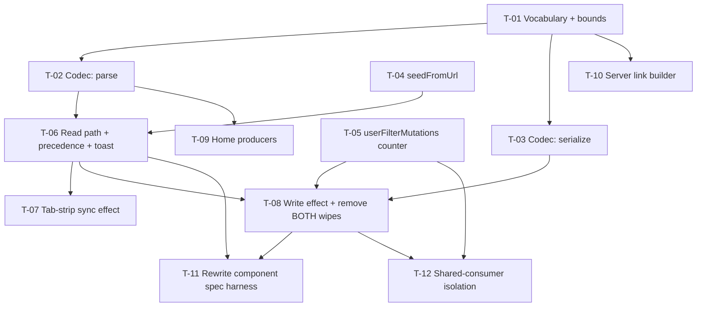

# Tasks — results-center / url-filters

- **Module:** results-center (client) + results (server, link producer only)
- **Spec id:** 2026-08-url-filters
- **Status:** in progress — T-01, T-02, T-10 done (`/akili-execute`, 2026-08-12); see `execution.md`
- **Owner:** d.casanas@cgiar.org
- **Linked requirements:** ./requirements.md
- **Linked design:** ./design.md
- **Linked judgment:** ./judgment.md — **read §Round 3 before starting.** Four findings (R3-1 … R3-4) are open and are folded into T-01, T-03, T-05 and T-08 below
- **Budget (design §13):** 12 tasks · **~3200 LOC** · 3 review rounds — *re-baselined 2026-08-12 during execution; the pre-execution ~1000 never carried §10.2's own ~1,000-line spec rewrite (see `design.md` §13 → Re-baseline record)*
- **Last updated:** 2026-08-12

---

## 0. Carried findings — read first

Judgment Day round 3 raised four findings, **each confirmed by both judges independently**. All four have been corrected in `design.md` — but the correction itself was never reviewed (the lineage is exhausted), so **each survives here as a regression guard with its own disqualifying condition.** Treat them as live hazards, not as history: an Implementer who skims past them will re-introduce a defect two rounds of review already found.

| Finding | What is wrong | Owning task |
| --- | --- | --- |
| **R3-1** | The my/all tab and the pin toggle bypass the mutation counter — they bind to the **component's** `onActiveItemChange` (`results-center.component.html:14`), not the service's | **T-05** |
| **R3-2** | Nulls are scoped to canonical keys, so `indicatorTab`/`statusTab`/`statusLabel` persist in the URL forever and resurrect on reload | **T-03** |
| **R3-3** | Lower-case key folding does not match the camelCase legacy parameter names unless the recognized list is stored folded too | **T-01** |
| **R3-4** | "Inactive" is undefined for `tab`, which always resolves to `my` or `all` | **T-03** |

---

## 1. Dependency graph

**Hard ordering constraint (design §12, reversion challenge):** T-08 removes both query-parameter wipes. It MUST NOT land before the write path exists, and the wipe removal MUST NOT be split into an earlier standalone task. T-08 carries both halves together.

---

## 2. Task list

### T-01 [x] — Frozen vocabulary, bounds, and the folded recognized-key list

- **Requirements covered:** R-RCU-001 (all ACs), R-RCU-005 AC.4, NFR-RCU-002 (layer 1)
- **Files touched:** `…/results-center/url/results-center-url.vocabulary.ts` (new), `…/results-center-url.vocabulary.spec.ts` (new)
- **Description:** The single source of truth for every token this feature understands: `indicator` (6 slugs, byte-identical to the server's `QueryIndicatorsEnum`), `status` (25 slugs, design §5.2), `source` (4 slugs from `SOURCE_FILTER_OPTIONS`), the bounds constants, and the recognized-parameter name list.
- **Implementation notes:**
  - **R3-3 — the recognized-key list MUST be stored lower-case-folded**, and lookups fold the incoming key before comparison. The legacy names are camelCase (`indicatorTab`, `statusTab`, `statusLabel`); stored raw, folded lookups match none of them and every already-delivered CapDev email silently stops working.
  - Slugs are **frozen strings**, never derived at runtime from a display name (D-URL-2).
  - Do **not** add a `lever` entry (D-URL-6) and do **not** introduce a fourth indicator spelling — `cap_sharing` stays a PDF-report key (R-RCU-001 AC.5).
- **Acceptance / done check:**
  - [ ] All 25 status slugs and all 6 indicator slugs are unique; bidirectional mapping holds both ways.
  - [ ] `capacity-sharing-for-development` is byte-identical to `QueryIndicatorsEnum.CAPACITY_SHARING_FOR_DEVELOPMENT`.
  - [ ] A folded lookup of `indicatortab` / `statustab` / `statuslabel` resolves to the legacy parameters — **this is the R3-3 regression guard.**
  - [ ] Bounds exported: 50 values per list parameter, 64 chars per token.
- **Disqualifies:** a uniqueness test over a hand-typed subset of the 25 statuses proves nothing about the other rows — iterate the exported map, not a literal list. A parity test over a fixture **cannot** detect a value added server-side; that limit is accepted in NFR-RCU-002 and must not be claimed as coverage.
- **Dependencies:** none · **Effort:** M · **Skills:** `angular-developer`

---

### T-02 [x] — Codec: `parse`

- **Requirements covered:** R-RCU-001 AC.3, R-RCU-002 (both scenarios), R-RCU-005 (both scenarios + all ACs), R-RCU-006 (both scenarios + AC.1/AC.2/AC.3)
- **Files touched:** `…/url/results-center-url.codec.ts` (new), `…/url/results-center-url.codec.spec.ts` (new)
- **Description:** Pure `parse(paramMap) → { filters, scope, dropped, hadRecognizedParam }`. No DI, no router, no signals — it *returns* what it dropped and never logs or toasts (D-URL-1).
- **Implementation notes:**
  - Fold every incoming key to lower case **before** lookup (R2-6); read values with `getAll()` and flatten, so a repeated key combines rather than silently losing all but the first (R-RCU-005 AC.4).
  - `indicator` is **single-value**: a comma is an invalid token, rejected — never truncated to the first value (D-URL-12).
  - `contract` is upper-cased; `status`/`source`/`indicator`/`tab` are lower-case-folded; `year` is numeric (design §5.4).
  - `contract` is **not** validated against the contracts control list (D-URL-7).
  - A legacy parameter is consulted **only** when its canonical counterpart is absent — resolved by key presence, never by parameter order.
  - Order of values within a list parameter is **preserved** (R-RCU-002 multi-value scenario, `AND IT MUST`).
- **Acceptance / done check:**
  - [ ] Each of the six canonical parameters, alone, produces the right filter (R-RCU-002 AC.1).
  - [ ] `?CONTRACT=a100` ≡ `?contract=A100` (R-RCU-001 AC.3) — asserted with that literal.
  - [ ] `?indicator=oicr,policy-change` is rejected, not truncated.
  - [ ] `?indicator=not-a-real-indicator&contract=A100` returns the contract filter **and** a non-empty `dropped` (R-RCU-005 AC.1).
  - [ ] A list of 51 values is dropped whole; a 65-char token is dropped; `?contract=A100&contract=S192` yields both.
  - [ ] `?indicatorTab=1&indicator=policy-change` resolves to `policy-change` deterministically (R-RCU-006 AC.2).
  - [ ] `statusLabel`'s value never appears in the returned object (R-RCU-006 AC.3).
  - [ ] Multi-value order is preserved — asserted with values whose sorted order differs from their input order.
- **Disqualifies:** an order test whose input is already sorted cannot fail. A `dropped` assertion on length alone does not prove the *right* token was dropped.
- **Dependencies:** T-01 · **Effort:** L · **Skills:** `angular-developer`, `error-handling-patterns`

---

### T-03 [x] — Codec: `serialize` (carries R3-2 and R3-4)

- **Requirements covered:** R-RCU-003 (both scenarios + AC.1/AC.2), R-RCU-004 AC.3, NFR-RCU-003
- **Files touched:** `…/url/results-center-url.codec.ts`, `…/url/results-center-url.codec.spec.ts`
- **Description:** Pure `serialize(state) → params`. The output is consumed by a `queryParamsHandling: 'merge'` navigation, which strips only **null-valued** keys and preserves omitted ones — so what this function omits is what stays in the URL forever.
- **Implementation notes:**
  - **R3-2 — the null set MUST include the three legacy keys** (`indicatorTab`, `statusTab`, `statusLabel`), not only the canonical ones. The design's earlier wording ("never nulls a key it does not own") is superseded: the codec *parses* these keys, therefore it owns clearing them. Without this, arriving from a delivered email at `?indicatorTab=1` and switching to "All Indicators" leaves the URL unchanged and a reload resurrects Capacity Sharing.
  - Keys the codec does **not** parse (`utm_source`, anything unrecognized) are still never nulled — that is what R-RCU-004 AC.3 protects.
  - **R3-4 — `tab` is emitted only when the scope is `my`; `all` serializes to `null`.** `tab` always resolves to a value, so "inactive" is otherwise undefined for it: emitting `all` would leave `/results-center?tab=all` after clearing filters, contradicting R-RCU-003's clear scenario.
  - Never serialize a user identifier (NFR-RCU-003).
- **Acceptance / done check:**
  - [ ] Every inactive canonical key **and** every one of the three legacy keys is present as `null` in the output — **R3-2 regression guard.**
  - [ ] An unrecognized key present in the current URL is neither emitted nor nulled.
  - [ ] Scope `all` → `tab: null`; scope `my` → `tab: 'my'` — **R3-4 regression guard.**
  - [ ] Round-trip: `parse(serialize(state))` reproduces `state` for a fixture exercising all six parameters (R-RCU-003 AC.2).
  - [ ] No output value equals the cached `sec_user_id` for any scope.
- **Disqualifies:** a round-trip test over a state with a single filter cannot detect the null-emission defect at all — the fixture must include at least one filter that is **cleared** relative to a prior URL. Testing `serialize` in isolation without a merge simulation proves nothing about R3-2; assert the merged result.
- **Dependencies:** T-01 · **Effort:** M · **Skills:** `angular-developer`

---

### T-04 [x] — `seedFromUrl()` on `ResultsCenterService`

- **Requirements covered:** R-RCU-002 AC.3/AC.5/AC.6/AC.7, R-RCU-006 AC.3
- **Files touched:** `…/results-center/results-center.service.ts`, `…/results-center.service.spec.ts`, **`…/results-center/class/table.filters.class.ts`** *(third file authorized by the user 2026-08-12 during execution — see below)*
- **Why the third file is required.** D-URL-10 mandates seeding **only** the option-value key (`{ result_status_id }`, no `name`), because `MultiselectComponent` backfills labels only for items *missing* the label key. But `TableFilters` declares `statusCodes: { result_status_id: number; name: string }[]` with `name` **required**, and `years`/`sources` as full `GetYear[]` / `PlatformSourceFilter[]`. **The design's mandated shape is therefore unrepresentable in the current types** — attempt 1 produced three real `TS2322` errors at `results-center.service.ts:817/818/820`. The fix widens the seed targets so the "seeded but not yet backfilled" state is legal (`name?: string`, `Array<{ report_year: number } & Partial<GetYear>>`, `Array<{ platform_code: string } & Partial<PlatformSourceFilter>>`) — **not** a cast, which would re-hide the very drift D-URL-10 depends on. Blast radius is small and already defensive: `applyFilters` reads only the value keys, and `getActiveFilters` already renders `s.name ?? ''` / `c.display_label || c.agreement_id` behind casts that can then be dropped.
- **Description:** One method that writes all seeded state atomically, replacing the hand-duplicated multi-signal writes that make state desync (D3) the recurring defect class here.
- **Implementation notes:**
  - **Call `invalidateResultsFetchDedupe()` first.** `lastSuccessfulResultsFetchKey` survives across component instances on the root singleton; without this, `main()` early-returns and the user sees "filter applied, table unchanged" (JD-21).
  - **Seed the option-value key only — never the label key** (D-URL-10). `{ result_status_id }`, `{ platform_code }`, `{ agreement_id }`, `{ report_year }`. Seeding `name` freezes the chip label permanently, because `MultiselectComponent` backfills only items *missing* the label key.
  - **Do not seed `tableFilters.indicators`.** `indicator` goes to `indicator-codes-tabs` only (T-07); seeding it renders no chip while inflating the filter badge (design §7.2).
  - Write the my/all scope (`myResultsFilterItem` + `create-user-codes`) from the resolved scope.
  - Fold `applyStatusFilterFromHomeLink` into this method rather than duplicating it.
  - **This method MUST NOT increment `userFilterMutations`** (T-05).
- **Acceptance / done check:**
  - [ ] `tableFilters`, `resultsFilter`, `appliedFilters` and the scope are all consistent after one call.
  - [ ] No seeded object carries its control's `optionLabel` key.
  - [ ] `invalidateResultsFetchDedupe` is called before any signal write.
  - [ ] `tableFilters.indicators` is untouched when `indicator` is seeded.
- **Disqualifies:** asserting the signals hold the right ids is a **presence assertion** — it cannot prove the chip renders. Rendered proof belongs to T-11 and must be taken **after** the control lists resolve; asserting before would pin the documented transient (design §7.2) as the expected value.
- **Dependencies:** none · **Effort:** M · **Skills:** `angular-developer`

---

### T-05 [x] — `userFilterMutations` counter (carries R3-1)

- **Requirements covered:** R-RCU-003 (write trigger), R-RCU-004 AC.2, NFR-RCU-005
- **Files touched:** `…/results-center/results-center.service.ts`, `…/results-center/results-center.component.ts`, `…/results-center.service.spec.ts`
- **Description:** A monotonic counter expressing **user intent**, which is what R-RCU-003's "changed through the UI" always meant. It is the write effect's only tracked dependency (D-URL-15), and it is what keeps the URL from being rewritten during load, during restore, or from another route.
- **Implementation notes:**
  - **R3-1 — the increment for the my/all tab and the pin toggle MUST live in the component's event handlers**, not in the service. `results-center.component.html:14` binds to the **component's** `onActiveItemChange` (`:190`), and line 17's pin button reaches `togglePin` (`:254`); both call the component-local `loadMyResults()` / `loadAllResults()`, which never touch a service mutator. The service's own `onActiveItemChange` (`:626`) appears to have no production caller — **verify before relying on it.**
  - **Do NOT increment inside `loadMyResults` / `loadAllResults`.** They are also reached from the read path, and incrementing there re-opens R2-5 (a parameter-less visit with a pinned `my` tab would write `?tab=my`, which then suppresses session restore on the next load).

  | MUST increment | MUST NOT increment |
  | --- | --- |
  | `applyFilters` (sidebar Apply) | `seedFromUrl` |
  | `removeFilter` (chip dismissal) | `restorePersistedState` |
  | `clearAllFilters` | `main()` |
  | `onSelectFilterTab` | `initializeProjectDashboardResultsTable` |
  | component `onActiveItemChange` handler *(R3-1)* | `clearAllFiltersWithPreserve` |
  | component `togglePin` handler *(R3-1)* | `loadMyResults` / `loadAllResults` |

- **Acceptance / done check:**
  - [ ] Every row in the left column advances the counter exactly once per invocation.
  - [ ] Every row in the right column leaves it unchanged.
  - [ ] Clicking the My/All tab advances it — **R3-1 regression guard, asserted through the template binding, not by calling the service method directly.**
  - [ ] Toggling the pin advances it.
- **Disqualifies:** calling `ResultsCenterService.onActiveItemChange` directly in a test **passes on dead code** and is the exact blind spot R3-1 names. The assertion must go through the component's handler. A counter test that never exercises the "must not" column proves half the contract.
- **Dependencies:** none · **Effort:** M · **Skills:** `angular-developer`

---

### T-06 [x] — Read path: parse, precedence, scope, toast

- **Requirements covered:** R-RCU-002 (both scenarios + AC.2/AC.4/AC.6/AC.7), R-RCU-004 (scenario + all ACs), R-RCU-005 AC.2/AC.3, R-RCU-006 (both scenarios), **NFR-RCU-002 (layer 2)** *(assigned 2026-08-12 during execution)*
- **Files touched:** `…/results-center/results-center.component.ts`
- **Description:** Wire the codec into `initializeState()` per design §6.1. Init-only, from `route.snapshot` — **never a `queryParamMap` subscription** (D-URL-5); that is the structural reason a write cannot re-enter a read.
- **Implementation notes:**
  - Resolve the my/all scope **explicitly**: `tab` when present, otherwise `loadPinnedTabPreference()`. Never leave it at whatever the root singleton held from a previous route (R-RCU-002 AC.6).
  - Any recognized filter parameter suppresses `restorePersistedState` entirely; an unrecognized parameter alone (`?utm_source`) does not (R-RCU-004 AC.3).
  - A wholly invalid link still counts as explicit navigation — it does **not** fall through to restore (R-RCU-005, second scenario).
  - Exactly one `main()` for the initial load, **after** seeding — never fetch unfiltered and re-fetch.
  - Toast once per navigation, naming counts not values (D-URL-4).
  - **Do not remove the wipes here** — that is T-08's, together with the write path.
- **Acceptance / done check:**
  - [ ] Exactly one results request on initial load (R-RCU-002 AC.4).
  - [ ] The filter is applied *before* that request.
  - [ ] A recognized parameter suppresses restore; `?utm_source=email` alone does not.
  - [ ] An all-invalid link renders the unfiltered page with the toast and does **not** restore.
  - [ ] The toast fires once per navigation regardless of how many tokens were dropped.
  - [ ] A token containing markup cannot alter the toast's rendering.
  - [ ] **NFR-RCU-002 layer 2 — when the control list resolves, any id with no slug emits a console warning naming that id** *(assigned here 2026-08-12; previously owned by no task)*.
- **NFR-RCU-002 layer 2 — added during execution.** Requirements §NFR-RCU-002 specifies verification in **two** layers and says layer 1 cannot see a server-side addition: *"This is the layer that actually sees a server-side addition, and it fires in every dev and QA session."* Design §10.1 listed it as a "Runtime | dev/QA console" row with **no owning task**, and §3's coverage table mapped NFR-RCU-002 to T-01 — whose line reads "layer 1" only. It lands here because this is where the control lists resolve. It is also the named mitigation for the write-side gap in `execution.md` §5.2 (`serialize` silently drops an id absent from the frozen map). Scope: a `console.warn` in dev/QA naming the unmapped id(s) — **not** a toast, not a blocking error, and **no change to `serialize`'s signature**.
- **Toast safety — carried from the T-02 review.** `DroppedUrlToken.value` holds the **raw, unescaped** token. Design §7.4's guarantee is *non-interpolation*, so the toast MUST read only `dropped.length` (and per-parameter counts) — **never `dropped[i].value`**. That is what makes "a token containing markup cannot alter the toast's rendering" structural rather than a matter of escaping correctly.
- **Disqualifies:** a hand-rolled `ActivatedRoute` returning a canned snapshot tests the assertion, **not the parsing** *(KZ-001)* — the harness from T-11 is required for these checks to count.
- **Dependencies:** T-02, T-04 · **Effort:** L · **Skills:** `angular-developer`

---

### T-07 [x] — Tab-strip sync effect

- **Requirements covered:** R-RCU-002 (CapDev scenario, "the Capacity Sharing tab is the active tab"), R-RCU-002 AC.3
- **Files touched:** `…/results-center/results-center.component.ts` · `…/results-center/results-center.service.ts` (visibility only) · `…/results-center/results-center.component.spec.ts` — *the last two authorized by the Leader 2026-08-13; see `execution.md` T-07. `syncIndicatorTabSelection` must become public so the component effect can call it, because duplicating its `list.update` mapping into the component is the D3 state-desync defect class this spec exists to close; the spec file is required by this task's own done-checks.*
- **Description:** A component-scoped effect that sets the visual `active` flag on the indicator tab strip, re-armed on every visit.
- **Implementation notes:**
  - Track **both** `indicatorTabs.lazy().isLoading()` **and** `resultsFilter()['indicator-codes-tabs']` (D-URL-14). Keying on the loading signal alone reproduces JD-7: on a repeat visit the list is already cached with `isLoading()` permanently `false`, so the effect's single creation-run lands before `seedFromUrl()` and never re-runs.
  - **Both reads go above the `isLoading` guard, not below it.** Angular re-collects dependencies per run, so an early `return` placed before the `resultsFilter()` read leaves a creation-run-while-loading tracking `isLoading` alone — the very state D-URL-14 forbids.
  - **Do not pass `allowSignalWrites`** *(corrected 2026-08-13)*. An earlier version of this note called it required; on Angular 19.1.6 it is a deprecated no-op and passing it emits a dev-mode warning. Follow T-06's two effects in the same file, which omit it. See design §7.3.
  - **Never read `list()` in the effect body** — it writes that signal via `list.update()` (an untracked read); reading it would create a cycle that never settles.
  - Do **not** repair or depend on the singleton's self-destructing `onChangeList`; it is out of scope. Locate it by content — search `results-center.service.ts` for `onChangeList = effect(` — never by line number (a `:405-430` citation here had already drifted 13 lines).
- **Acceptance / done check:**
  - [x] A deep link activates the right tab on a **first** visit.
  - [x] A deep link activates the right tab on a **second visit within the same session** — the JD-7 / R2-7 regression guard. Both mounts share one endpoint instance inside a single `it()`; proved able to fail via an `untracked()` probe on the filter dependency.
  - [x] The filter value is correct even if the strip has not yet synced.
- **Disqualifies:** a single-visit test cannot detect this defect class at all; the second-visit case is the test. Mounting a fresh `TestBed` per case simulates a fresh session and therefore does **not** reproduce it — the two visits must share one endpoint instance.
- **Dependencies:** T-06 · **Effort:** S · **Skills:** `angular-developer`

---

### T-08 [ ] — Write effect + remove **both** wipes

- **Requirements covered:** R-RCU-003 (both scenarios + all ACs), NFR-RCU-001, NFR-RCU-004
- **Files touched:** `…/results-center/results-center.component.ts`
- **Description:** The component-scoped write effect (D-URL-9/D-URL-15) **and** the removal of both query-parameter wipes, landed together.
- **Implementation notes:**
  - The effect's **only** tracked dependency is `userFilterMutations()`; filter state is read via `untracked()`.
  - Guard: on the mandatory first run (counter still at its entry value), **return**.
  - Compare the **merged** result (`{...current, ...next}` with nulls stripped) against the current query string — comparing raw serializations navigates on every run whenever an unrecognized parameter is present.
  - `router.navigate([], { relativeTo, queryParams, queryParamsHandling: 'merge', replaceUrl: true })`.
  - **Remove the wipe — locate it by CONTENT, never by line number** *(corrected 2026-08-13)*. **T-06 merged the two wipes into a single call.** Find the one `await this.router.navigate([], …)` at the end of `initializeState()` whose `queryParams` is exactly `{ indicatorTab: null, statusTab: null, statusLabel: null, tab: null }`, together with its preceding comment block (which opens "T-08 removes both pre-existing query-parameter wipes…"). Deleting that single statement discharges **both** D-URL-8 halves.
  - > ⚠️ **DO NOT use the line ranges `112-121` / `133-138`.** They were correct before T-06 and are now **actively dangerous**: in the current tree they point at the bodies of `indicatorVocabularyCompletenessCheck` and `statusVocabularyCompletenessCheck` — the **NFR-RCU-002 layer-2 mitigation T-06 added**. Deleting by line number would destroy that mitigation *and* leave the wipe in place: the exact inverse of D-URL-8. This spec has now been bitten by stale line numbers twice (JD-9, then this), which is why the pointer above is content-based.
  - **Replace the "two ranges" check with two content checks.** After the change: `router.navigate` must appear in `results-center.component.ts` **only** inside the new write effect, and a grep for `indicatorTab|statusTab|statusLabel` in that file must return **zero** hits (the codec owns those keys per R3-2).
  - **`results-center.component.spec.ts` is authorized for this task** *(added 2026-08-13)*. T-06 added two assertions that the wipe *happens*; removing it turns them red, and the tempting "fix" is to re-add the wipe. T-11 rewrites this spec but runs **after** T-08, so T-08 must update those two cases itself.
  - **Write the R2-2 guard against the post-deletion file.** T-06's intermediate state fires one `router.navigate` on every seeded init (all four nulls are no-ops on a canonical-only link). "Zero `router.navigate` during init" is only true once this wipe is gone — assert it after your own deletion, not against the tree you inherit.
- **Acceptance / done check:**
  - [ ] Applying, changing and clearing each sidebar filter (plus `tab`) updates the URL correspondingly (R-RCU-003 AC.1).
  - [ ] **Clearing a filter removes its key from the address bar** — the R2-1 guard; assert the resulting URL string, not the serializer output.
  - [ ] Zero `router.navigate` during init when arriving with stale singleton state from `/project-detail/:id` (R2-2 guard).
  - [ ] Zero `router.navigate` on a parameter-less visit that restores persisted state, and restore still honoured on the **next** load (R2-5 guard).
  - [ ] A filter change produces zero additional results requests (R-RCU-003 AC.3).
  - [ ] Browser history depth after N filter changes is unchanged (R-RCU-003 AC.4).
  - [ ] `?utm_source=email` survives the first filter change.
  - [ ] `?tab=my` no longer self-destructs (JD-9 guard).
  - [ ] **NFR-RCU-003 — the written URL never contains the cached `sec_user_id`, asserted on the resulting URL string for both scopes** *(assigned here 2026-08-12; see below)*.
- **NFR-RCU-003 lands here too — added during execution.** §3's coverage table mapped NFR-RCU-003 to **T-03 alone**, but the requirement's own *How verified* reads: *"asserted by a test that **the written URL** never contains the cached user id."* A written URL is a component-level artifact that the pure codec cannot produce — T-03's codec-level test is a structural argument only (`serialize` never receives a user id, so its assertion cannot fail), which its own comment states honestly. T-08 is the first task that actually calls `router.navigate`, so the real assertion belongs here.
- **The counter's ordering contract — carried from the T-05 review, read before writing the effect.** `noteUserFilterMutation()` must be called **only after the state it publishes has been written.** T-05's `togglePin` failed review for bumping before an `await`: the effect flushed at the await boundary, serialized *pre-mutation* state, no-opped on the loop guard, and never fired again because its only tracked dependency did not move a second time — silently losing the write. `onActiveItemChange` and `applyFilters` still bump *before* their mutations and are safe **only** because both are wholly synchronous; if this task makes either path async ahead of its `.set()` calls, that defect returns.
- **Type hazard at the boundary — carried from the T-03 review.** `serialize` now calls `.toUpperCase()` on every `filters.contract` element. `results-center.service.ts:315` casts `tableFilters().contracts`, and both `get-contracts-by-user.interface.ts:2` and `find-contracts.interface.ts:12` declare `agreement_id?: string` — so a runtime `undefined` would throw a `TypeError` inside this effect. Narrow the type at the boundary here, or accept that the codec needs `String(code).toUpperCase()`.
- **Disqualifies:** asserting on the object passed to `router.navigate` is a presence assertion about the *call*, not the resulting URL — R2-1 lives in the merge, so at least the clearing checks must assert the router's resulting URL. A history-depth check that never navigates twice cannot fail.
- **Dependencies:** T-03, T-05, T-06 · **Effort:** L · **Skills:** `angular-developer`

---

### T-09 [x] — Home link producers

- **Requirements covered:** R-RCU-007 AC.1, **AC.1b**, AC.3
- **Files touched:** `…/home/components/data-overview/data-overview.component.html` + `.ts` + `.spec.ts`, `…/home/components/main-actions/main-actions.component.html`
- **Description:** Switch the three Home producers to canonical parameters.
- **Implementation notes:**
  - **Both `data-overview` cards must emit `tab=my`** alongside their filter (R-RCU-007 AC.1b). They are headed "My results by status" / "My results by indicator"; their My-scope currently comes from the unconditional `loadMyResults(true)` that T-06 removes, and without `tab=my` they would resolve to the pinned preference — which defaults to `all`.
  - `data-overview.component.spec.ts:153-163` currently asserts `{ statusTab: 7, statusLabel: 'Submitted' }` and must be updated.
  - `statusLabel` disappears from the emitted set entirely.
- **Acceptance / done check:**
  - [ ] Both cards emit `tab=my` plus their canonical filter parameter.
  - [ ] Clicking "My results by indicator" lands on a **My-Results** view — the R2-4 / JD-5 regression guard.
  - [ ] A repository-wide search finds no producer of `indicatorTab` / `statusTab` / `statusLabel` (R-RCU-007 AC.3).
- **Disqualifies:** asserting the emitted `queryParams` object is not evidence that the resulting view is My-scoped; the scope assertion belongs with T-06's read path and must be exercised end to end.
- **Dependencies:** T-02 · **Effort:** S · **Skills:** `angular-developer`

---

### T-10 [x] — Server: CapDev email link

- **Requirements covered:** R-RCU-007 AC.2, defect class D6
- **Files touched:** `server/…/notifications/capdev-bulk-notification.service.ts` + `.spec.ts`
- **Description:** `buildStarLink(input.agreementId)` called from `buildTemplateData` — `input.agreementId` is already present on `CapdevGroupSendInput`, so no plumbing through `dispatch` is needed (JD-20).
- **Implementation notes:**
  - Keep using `COMPLETE_CLIENT_HOST` — never concatenate the host (R-RCU-007).
  - Remove `CAPDEV_INDICATOR_TAB_QUERY`.
  - The spec must assert the **exact literal** `/results-center?indicator=capacity-sharing-for-development&contract=A100` — this literal is half of the cross-package contract (design §8); its twin lives in T-02's codec spec.
- **Acceptance / done check:**
  - [ ] The built link carries the notified group's `agreement_id`, not a batch-wide or hard-coded value.
  - [ ] No `indicatorTab` is emitted.
  - [ ] The literal assertion is present and matches the client-side literal byte for byte.
- **Disqualifies:** a test asserting the link merely *contains* `results-center` cannot detect a spelling drift on either side — the whole point of the literal. **No automated gate crosses the package boundary** (requirements §8, D6); a manual paste-into-a-running-client check is required at the HITL pause and is not optional.
- **Dependencies:** T-01 · **Effort:** S · **Skills:** `nestjs-expert`

---

### T-11 [ ] — Rewrite the Results Center component spec harness

- **Requirements covered:** enables the rendered assertions for R-RCU-002 AC.3 and every T-06/T-08 check
- **Files touched:** `…/results-center/results-center.component.spec.ts`
- **Description:** The existing spec does **both** things design §10.3 disqualifies at once — a canned-snapshot `ActivatedRoute` (lines 101-108) **and** `template: '

'` (112-117), over a fabricated service mock with no real signals. Nothing renders and no real state exists, so it cannot test this feature.
- **Implementation notes:**
  - Drop the template override; use the real `ResultsCenterService`; provide real control-list services for the child multiselects; use a real router/param-map harness.
  - Rendered chip assertions must be taken **after** the control lists resolve (design §7.2's documented transient).
  - This is a rewrite of a ~1,000-line spec — it is the single largest item in the budget and is scoped as its own task deliberately.
- **Acceptance / done check:**
  - [ ] The suite drives a real param map; no canned snapshot remains.
  - [ ] The component renders; chips and the tab strip are assertable from the DOM.
  - [ ] All pre-existing behavioral cases still pass under the new harness.
  - [ ] **A rendered click on the My/All tab strip advances `userFilterMutations`** — the template-binding half of T-05's R3-1 guard *(assigned here 2026-08-12; see below)*.
- **T-05's R3-1 guard is completed here — added during execution.** T-05's done-check requires the my/all increment be "asserted through the template binding, not by calling the service method directly." The pre-rewrite harness overrides the template with `

`, so a DOM click was structurally impossible; the Leader authorized asserting through the component's handler instead (`component.onActiveItemChange(...)` with a mocked service), which the Reviewer accepted as satisfying the Disqualifies clause's operative requirement. **This rewrite is what makes the rendered assertion possible, so it must carry it** — otherwise the template-binding half of a dual-judge-confirmed regression guard disappears with the old harness and nothing records that it was ever owed.
- **Disqualifies:** porting the old assertions onto the new harness without removing the fabricated service mock leaves the same blindness with more ceremony *(KZ-001)*. **Also disqualifying:** dropping T-05's counter assertions (`component.spec.ts` `describe('onActiveItemChange')` / `describe('togglePin')` / the two `not.toHaveBeenCalled()` cases in `describe('loadMyResults')` and `describe('loadAllResults')`) rather than carrying them onto the new harness — they are the R3-1 and R2-5 guards.
- **Dependencies:** T-06, T-08 · **Effort:** L · **Skills:** `angular-developer`

---

### T-12 [ ] — Shared-consumer isolation

- **Requirements covered:** NFR-RCU-005
- **Files touched:** `…/project-dashboard/project-dashboard.component.spec.ts`, `…/project-detail/project-detail.component.spec.ts`, `…/select-linked-results-modal/…spec.ts`, `…/links-to-result/…spec.ts`
- **Description:** Prove the lifecycle guarantee. `ResultsCenterService` is a root singleton mutated from five surfaces on four routes; the component-scoped effect means none of them can write the URL — this task verifies that rather than assuming it.
- **Implementation notes:**
  - `initializeProjectDashboardResultsTable` is called **only** from `project-dashboard.component.ts:215`; `project-detail.component.ts` never references it (JD-8). The existing dashboard spec mocks the service wholesale and must be extended with a real-service case.
  - Assert **zero** `router.navigate` from service-level filter mutations on each of those routes.
  - **Assert the right guarantee: the component is destroyed, NOT that the counter is frozen** *(added 2026-08-12 — see the correction note in `design.md` §6.2)*. `resetState()` → `clearAllFilters()` **does** advance `userFilterMutations` from `/project-detail`, so "the counter does not move off-route" is false and a test written against it would be asserting a non-guarantee. The real guarantee is D-URL-9's lifecycle one: the effect lives in `ResultsCenterComponent`'s injector and is destroyed with the component, so zero `router.navigate` is the correct observable — which is what the checks below already assert.
- **Acceptance / done check:**
  - [ ] Each of the four surfaces mutates filters with zero `router.navigate`.
  - [ ] The project dashboard's fixed table is behaviorally unchanged.
  - [ ] Full client suite green: `npm test -- --silent`.
- **Disqualifies:** a targeted `--testPathPattern=results-center` run is **not** evidence for this task regardless of exit code *(KZ-003)* — the shared singleton means only a full-suite run bounds the blast radius. A spec that mocks `ResultsCenterService` cannot observe URL leakage and does not satisfy the check.
- **Dependencies:** T-05, T-08 · **Effort:** M · **Skills:** `angular-developer`

---

## 3. Requirement → task coverage

Closure is at **scenario and clause** granularity, not requirement ID.

| Requirement / clause | Task(s) |
| --- | --- |
| R-RCU-001 AC.1–AC.5 | T-01, T-02 |
| R-RCU-001 case policy (names folded, `contract` upper) | T-01, T-02 |
| R-RCU-001 `indicator` single-value | T-02 |
| R-RCU-002 CapDev scenario (+ both clauses) | T-06, T-07 |
| R-RCU-002 multi-value scenario (+ order clause) | T-02 |
| R-RCU-002 AC.1–AC.7 | T-02, T-04, T-06, T-07 |
| R-RCU-003 add scenario (+ history + no-reentry clauses) | T-08 |
| R-RCU-003 clear scenario (+ no-orphan clause) | T-03, T-08 |
| R-RCU-003 AC.1–AC.4 | T-03, T-08 |
| R-RCU-004 scenario (+ no-merge clause) | T-06 |
| R-RCU-004 AC.1–AC.3 | T-06 |
| R-RCU-005 bad-token scenario (+ both clauses) | T-02, T-06 |
| R-RCU-005 unusable-link scenario (+ no-restore clause) | T-06 |
| R-RCU-005 AC.1–AC.4 | T-02, T-06 |
| R-RCU-006 delivered-email scenario | T-01, T-02 |
| R-RCU-006 mixed scenario (+ determinism clause) | T-02 |
| R-RCU-006 AC.1–AC.4 | T-01, T-02, T-09 |
| R-RCU-007 scenario (+ both clauses) | T-10 |
| R-RCU-007 AC.1, AC.1b, AC.2, AC.3 | T-09, T-10 |
| NFR-RCU-001 | T-08 |
| NFR-RCU-002 layer 1 (fixture parity) | T-01 |
| **NFR-RCU-002 layer 2 (runtime completeness warning)** | **T-06** *(assigned 2026-08-12 during execution — previously owned by no task)* |
| NFR-RCU-003 (structural: codec never receives an id) | T-03 |
| **NFR-RCU-003 (written-URL assertion — the requirement's own prescribed verification)** | **T-08** *(assigned 2026-08-12 during execution — previously owned by no task)* |
| NFR-RCU-004 | T-08 |
| NFR-RCU-005 | T-05, T-12 |

**Coverage corrections made during execution (2026-08-12).** Three verifications the spec prescribes were owned by no task; each is now assigned to the task that can actually perform it, and no new task was created. Full reasoning in `execution.md` §5. NFR-RCU-002 is split by layer because §NFR-RCU-002 is explicit that layer 1 *cannot* detect a server-side addition — recording them as one row let the unimplemented half hide behind the implemented one. The R3-1 template-binding assertion was likewise added to **T-11**, which is the task whose harness rewrite makes it possible.

**Carried findings:** R3-1 → T-05 · R3-2 → T-03 · R3-3 → T-01 · R3-4 → T-03.

---

## 4. Risks & blockers log

| # | Date | Risk / Blocker | Mitigation | Status |
| --- | --- | --- | --- | --- |
| RB-1 | 2026-08-12 | Four Judgment Day findings ship into execution unverified; the review lineage is exhausted | Each is a named done-check with a regression guard in its owning task; the `/akili-execute` Reviewer is the next independent reading | open |
| RB-2 | 2026-08-12 | Round 3 had **one judge**, not two — judge B stalled twice on infrastructure | Findings were parent-verified against code; recorded in `judgment.md` §Round 3 as a corroboration gap | open |
| RB-3 | 2026-08-12 | D6 (cross-package link) has **no automated gate** | Twin literals in both packages' specs (T-02, T-10) + a mandatory manual check | open |
| RB-4 | 2026-08-12 | `result_status` names diverge between the database and `ResultStatusNameEnum` (22 vs 25 ids, 8 name mismatches) | Slugs are frozen strings, immune to either source; divergence is out of scope (requirements §9 R5) | open |

---

## 5. PR strategy

**~3200 LOC** across two packages (re-baselined — see `design.md` §13) — **split into three PRs**:

> ⚠️ **Execution note, 2026-08-12.** All work is landing on a single branch (`AC-1607-…`, user decision recorded in `execution.md` Document Control), so this three-way split is **not** being enforced by the commit history — commits from this spec interleave with the archived CapDev spec's. T-10 (PR 3) has already landed *before* T-03 (PR 1). If the split is still wanted, it has to be cut deliberately from the commit range rather than falling out of the branch structure. **Design §11's client-before-server deployment order is now a deploy-time obligation only.**

| PR | Tasks | Rationale |
| --- | --- | --- |
| **PR 1 — codec + vocabulary** | T-01, T-02, T-03 | Pure, fully unit-tested, zero behavior change on its own. Reviewable in isolation and the highest-value review target |
| **PR 2 — wiring** | T-04, T-05, T-06, T-07, T-08, T-11 | The behavior change. T-08's ordering constraint (write path before wipe removal) is satisfied inside a single PR |
| **PR 3 — producers + isolation** | T-09, T-10, T-12 | Client and server link producers plus the isolation proofs |

PR descriptions follow `cognitive-doc-design` review-empathy rules: what to review first, what is out of scope, and links to the previous/next PR.

---

## 6. Done definition

- [ ] All T-01 … T-12 are `done`.
- [ ] Every requirement AC **and every scenario clause** in §3 is checked.
- [ ] R3-1 … R3-4 regression guards are green.
- [ ] Client coverage floors hold (statements 40 / branches 20 / lines 45 / functions 30).
- [ ] Full client suite green — not a targeted run.
- [ ] The manual cross-package check (D6) has been performed and recorded.
- [ ] `docs/ux-ui/design.md` decisions log records the URL vocabulary as a durable contract.
