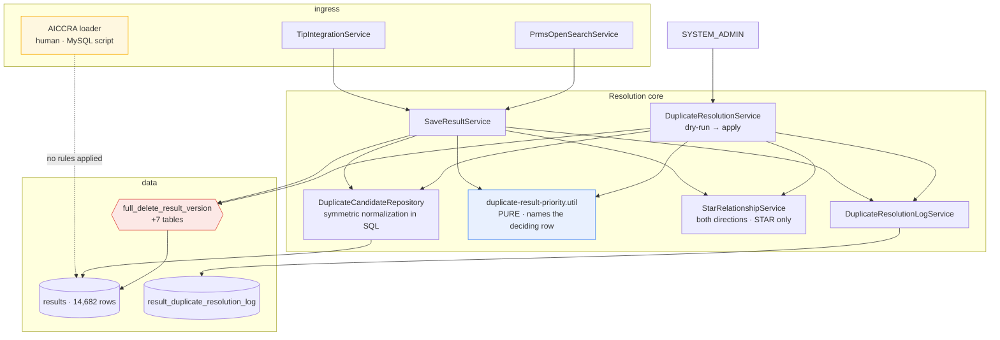

# Design — results / cross-platform-duplicate-resolution

- **Module:** results
- **Spec id:** 2026-08-cross-platform-duplicate-resolution
- **Status:** draft (**re-derived** after Judgment Day round 1 — see [`judgment.md`](./judgment.md))
- **Owner:** ARI server squad (David Casañas)
- **Linked requirements:** [`./requirements.md`](./requirements.md)
- **Linked TRD:** [`../../../trd/trd.md`](../../../trd/trd.md)
- **Last updated:** 2026-08-04
- **Supersedes:** design.md rev 1 (2026-08-04), escalated by dual review with 8 severe findings

---

## 0. Measured baseline

Rev 1 of this design derived its facts from TypeORM entities and a `grep` over migrations, and got most of them wrong. This revision derives them from **`information_schema` and the live dev database**, read-only. Everything in this section is a measurement, not an inference.

### 0.1 The actual duplicate landscape

| Measurement | Value |
| --- | --- |
| Live rows in dedup scope (`is_active`, `is_snapshot = false`, PRMS/TIP/AICCRA, non-empty `public_link`) | TIP 8,476 · PRMS 4,357 · AICCRA 605 |
| STAR rows carrying a `public_link` | **0** — STAR can never be a duplicate participant |
| `results` rows total | 14,682 |
| **Cross-platform duplicate groups today** | **116** |
| Platforms involved | **TIP ↔ AICCRA only. Zero groups involve PRMS.** |
| Rows involved | 118 TIP + 116 AICCRA = 234 |
| Decided by Rule 1 (TIP prevails) | **86 groups** |
| Decided by Rule 3 (AICCRA CS over PRMS/TIP KP) | **30 groups** |
| Groups with >1 row of the same platform | 1 (three rows) |
| Groups spanning 2 report years | 11 (105 single-year) |
| `is_snapshot IS NULL` / `is_active IS NULL` anywhere | **0** — the nullable-column hazard does not exist in data |
| AICCRA rows already soft-deleted by the current buggy path (`is_active = 0`, status 8) | 21 |

Two consequences reshape the whole spec:

**The problem is TIP↔AICCRA, not PRMS.** PRMS participates in zero duplicate groups. The sync path that matters is TIP's; the platform that needs a rules path is AICCRA's, exactly as the user reported. PRMS handling is inherited correctness, not the target.

**OQ-1 governs 26% of the real cases.** The owner's narrow reading of Rule 3 (Knowledge Product only) decides 30 of the 116 groups in AICCRA's favour. Had the reading gone the other way the count would differ — this was a consequential decision, not a formality.

### 0.2 Normalization buys nothing — measured

Six cumulative normalization levels were run against live data:

| Normalization | Groups found |
| --- | --- |
| `TRIM` only (today's behavior) | 116 |
| + lowercase | 116 |
| + strip scheme | 116 |
| + strip `www.` | 116 |
| + strip trailing `/` | 116 |
| + unify `dx.doi.org` → `doi.org` | **116** |

Exactly **one** normalized key has more than one raw variant. Cross-platform URL variance is **not** why duplicates are being missed.

This retires the largest and riskiest part of rev 1. The persisted `normalized_public_link` column, its index, its backfill, and two of the three migrations bought **zero additional detection** — while carrying RK-1 (a normalizer that destroys a distinct publication) as an explicitly unautomatable risk. Dropping them removes three tasks, two migrations, and the spec's only accepted-blind-spot in one move. It also dissolves the rev-1 severe finding that the index could not be created at all (`public_link` is `TEXT` → MySQL error 1170): there is no index.

Matching is therefore a **conservative normalization computed symmetrically in the query** — applied to the stored side and the incoming side alike, which is the one thing rev 1's `normalizePublicLink` genuinely got wrong (it trimmed only the incoming value and compared against raw storage). Over 14,682 rows a scan is free; rev 1's 30-second NFR was sized for a table 100× larger than this one.

### 0.3 The delete path — measured, not inferred

| Claim | Measured reality |
| --- | --- |
| FKs referencing `results(result_id)` | **38** — 37 `NO ACTION`, **1 `CASCADE`** (`project_indicators_results`) |
| Live `full_delete_result_version` | 35 DELETE targets, body 7,325 bytes — **byte-identical in coverage to migration `1783029013035`**, which is the true latest. No live drift. |
| `link_results` handling in the live function | `WHERE result_id = temp_result_id OR other_result_id = temp_result_id` — **already both directions** |
| `delete_result` (the soft path in use today) | 0 DELETE statements — pure `UPDATE`. Confirms the reported bug: the row survives with its `public_link`. |
| FK-holding tables **not** covered by the function | **7**: `result_cap_sharing_ip`, `bulk_upload_results`, `result_review_history`, `result_pool_funding_alignment`, `result_pool_funding_indicator_mapping`, `result_pool_funding_toc_alignment`, `temp_result_ai` |
| Rows in those 7 tables that would block a dedup-scope delete **today** | **0 in all seven** |
| Cross-result reference shapes (FK into another result's sub-row) | 5, of which 4 belong to `result_pool_funding_indicator_mapping` — **table is empty** |
| Live families spanning >1 report year | **0** |

So the errno-1451 hazard rev 1 built its narrative on is **real in the schema and unreachable in today's data**. That is a materially different risk statement, and it is the honest one: these are correctness gaps that become live the moment bilateral/pool-funding data lands, not present-day breakage. They are fixed here because a destructive path must be correct for the schema it runs against, not for one snapshot of its contents.

**Two hazards are active, not latent:**

1. **19 dedup-scope rows are referenced by a STAR result** via `link_results.other_result_id`, plus **7 inactive STAR link rows**. The protection rule has real work to do on real rows — and the live function clears `link_results` with no `is_active` predicate, so a hard delete destroys the recoverable inactive links too.
2. **The machine-token control asserted in rev 1 §8 does not exist, and the exposure is live.** All 4 `app_secrets` rows have **zero** `app_secret_host_list` entries, and `AppSecretsService.validation` skips the origin check entirely when the list is empty. `app_secret_id 8` resolves to user 32, who holds **`System Admin`**. A machine token that satisfies `@Roles(SYSTEM_ADMIN)` from any origin exists today. Rev 1 claimed this as one of three gates on an irreversible delete.

### 0.4 The bug, restated from source

Unchanged from rev 1 and confirmed by both judges — this part was always right:

- `deleteDuplicateResults` calls `deleteLogicalResultById` → `delete_result()` → `UPDATE is_active = FALSE`. The row and its `public_link` remain. Operators querying `results` still see the duplicate. **This is the reported failure.**
- `deleted_at` is a plain `@Column`, not `@DeleteDateColumn`, so TypeORM does not exclude soft-deleted rows → an inactive higher-priority row keeps `shouldOmit` true forever.
- Deletion runs **inside** the winner's `try`, whose `catch` calls `deleteFullResultById(createNewResult.result_id)`. Switching to a hard delete inside that block would let a cleanup failure destroy the winner.
- `duplicateResultValidation` checks `link_results.other_result_id` only, and does not require the counterpart to be STAR.
- `resolveResultDeleteTargetIds` expands a family by `{official_code, platform_code}` with **no `report_year_id`** and no `is_snapshot` predicate.
- Rule 3 currently applies to any PRMS/TIP indicator, not just Knowledge Product.
- `CounterResultsEnum` has no omission counter, and the `shouldOmit` early return skips the counter line entirely.

---

## 1. Goals & non-goals

**Goals**
1. Make the loser genuinely absent, safely and auditably — R-RES-003, R-RES-004, R-RES-009.
2. Give AICCRA a rules path that needs no sync pipeline — R-RES-008. **116 groups are waiting for it.**
3. Make winner selection a group-level decision that names *which row* satisfied each rule — R-RES-002.
4. Stop soft-deleted and snapshot rows from poisoning the candidate set — R-RES-001.
5. Close the two active hazards: incomplete STAR protection, and the non-existent machine-token gate.

**Non-goals**
- A persisted normalized link column, its index, or a backfill (§0.2: zero measured benefit).
- Performance engineering for a 14,682-row table.
- An AICCRA ingestion pipeline, or changes to the loader's MySQL script.
- A cron-scheduled sweep (OQ-2 closed: manual only).
- Hard-deleting the 21 AICCRA rows the current bug already soft-deleted (OQ-4).
- Any change to `client/`, the STAR authoring lifecycle, or `result_status_workflow`.

---

## 2. Architecture

One pure resolution core, three callers: the TIP sync path, the PRMS sync path (inherited correctness), and a new admin sweep that is the AICCRA answer.

### 2.1 Composition

**New**

| Path | Responsibility |
| --- | --- |
| `entities/results/repositories/duplicate-candidate.repository.ts` | All duplicate SQL. Owns the symmetric normalization expression, the `is_active`/`is_snapshot`/platform filters, and the group scan. One place, both callers. |
| `entities/results/duplicate-resolution.service.ts` | The sweep: scan → resolve → classify → plan → apply. Owns the run lock and plan confirmation. |
| `entities/results/duplicate-resolution.controller.ts` | Two admin endpoints (§4). |
| `entities/results/dto/duplicate-resolution.dto.ts` | Query/body DTOs + plan shape. |
| `entities/results/entities/result-duplicate-resolution-log.entity.ts` | Audit record, extends `AuditableEntity`. |
| `entities/results/result-duplicate-resolution-log.service.ts` | Sole writer of that table. |
| `shared/services/star-relationship.service.ts` | R-RES-004: both `link_results` directions, counterpart must be STAR, evaluated per `result_id` including expanded family members. |

**Reworked**

| Path | Change |
| --- | --- |
| `shared/utils/duplicate-result-priority.util.ts` | Pairwise → group resolver returning the winner **and the row that satisfied the rule**. Rule 3 narrowed to Knowledge Product. |
| `shared/services/save-all-sections.service.ts` | Candidate filters; symmetric normalization; incoming loser's own family deleted; deletion moved out of the winner's `try`; per-row error boundary; omission counter. |
| `shared/utils/query.service.ts` | `findResultFamilyIds` gains `report_year_id`; `deleteFullResultById` gains an ordered, wrapped execution path (§5.4). |
| `tools/tip-integration/tip-integration.service.ts` | `findOptions` keyed on raw `public_link` — reconciled with the matching change (JD-W-03). |
| `entities/sync-process-log/**` | A durable sink for the omission counter (JD-W-05). |
| `tools/tip-integration/dto/response-year-tip.dto.ts` | `CounterResults` + enum gain `OMITTED_DUPLICATE`. |
| `entities/results/results.module.ts` | Register the new pieces. Controller path resolves via its own `@Controller` — **no `main.routes.ts` change** (JD-W-12 resolved). |
| `db/migrations/<ts>-completeFullDeleteResultVersion.ts` | Redefine the function: +7 tables (§3.2). **The only migration in this spec.** |
| `db/migrations/<ts>-createDuplicateResolutionLog.ts` | Audit table. |

### 2.2 Reuse — and what is explicitly *not* trusted

Reused as-is: `LoggerUtil`/`CgiarLogger`, `ResponseUtils.format`, `RolesGuard` + `@Roles`, `SyncProcessLog`, `CurrentUserUtil`, `AuditableEntity`, the OpenSearch results service.

Rev 1 certified three components as safe that are not. This revision **re-verifies rather than inherits**:

| Component | Rev 1 said | Measured | This revision |
| --- | --- | --- | --- |
| `resolveResultDeleteTargetIds` | "family scoping is already correct" | No `report_year_id`, no `is_snapshot` | **Modified** (§5.4) |
| errno-1451 as a loud backstop | "why the current code works" | `link_results` already both directions → failure is **silent** | Guard is the only protection; treated as such |
| Machine-token gate | "not granted access" | Zero host rows ⇒ check skipped; one secret is `System Admin` | **New requirement** (§8) |

---

## 3. Data model

### 3.1 `results`

**No change.** Rev 1's normalized column, index, and backfill are dropped (§0.2).

Matching uses a normalization expression applied symmetrically to both sides inside `DuplicateCandidateRepository`: `TRIM` → lowercase the scheme+host → strip scheme → strip `www.` → strip one trailing `/` → unify `dx.doi.org`→`doi.org` → strip an empty query/fragment. Conservative by construction: **no path-case folding** (handles are case-sensitive) and **no query-parameter stripping**. Measured to find the same 116 groups as a bare `TRIM`, so it is a hedge against future variance, not a detection mechanism — and it is cheap enough over 14,682 rows to need no index.

**The comparison MUST be explicitly binary-collated.** `results.public_link` is `utf8mb3_general_ci` (measured; the datasource default is `utf8mb4_unicode_520_ci`), and both collations fold **case and accents** — verified live: `'abc'='ABC'` → 1, `'jose'='josé'` → 1. A SQL `=` or `GROUP BY` on that column therefore folds path case no matter what the normalization expression does, which makes **R-RES-001 AC.2 unsatisfiable** and points the failure at **over-matching → hard delete of a distinct publication** (DC-5). Every comparison and grouping in the repository must carry an explicit `COLLATE utf8mb4_bin` (or `BINARY`) on the normalized expression.

This defect was introduced by dropping the persisted column: rev 1's TypeScript normalizer compared with JS `===` and satisfied AC.2 for free. Moving the comparison into SQL moved it into an engine with implicit folding. Measured mitigation: `distinct_binary = distinct_ci = 12,849`, so **no case-only variants exist today** — the 116-group conclusion holds, but the guarantee must be written into the predicate rather than inherited from the data.

### 3.2 `full_delete_result_version` — complete the coverage

A new migration redefines the function (`DROP FUNCTION IF EXISTS` + `CREATE FUNCTION`, the pattern the five prior delete-function migrations already use; no merged migration is edited). Baseline is the **live definition**, dumped first, confirmed identical to `1783029013035`.

Additions, in FK-dependency order before the `results` row:

`result_cap_sharing_ip` (keyed on `result_cap_sharing_ip_id`), `bulk_upload_results`, `result_review_history`, `result_pool_funding_alignment`, `result_pool_funding_indicator_mapping`, `result_pool_funding_toc_alignment`, `temp_result_ai`, plus `TEMP_result_external_oicrs` (no FK; hygiene).

**`project_indicators_results` — the one `CASCADE` — needs a guard, not nothing.** Rev 2 dismissed it because CASCADE means no errno 1451. That answers the FK-error question and not the data question: CASCADE means the hard delete **silently destroys** `project_indicators_results` rows that belong to a *project indicator*, which today's soft delete preserves. That is the identical class as the 7 inactive STAR links this spec already promoted to blocking OQ-7 — a reference that survives soft delete and dies under hard delete — so it gets the same treatment: the STAR guard counts a `project_indicators_results` reference as a protecting relationship, and any cascaded row is enumerated in the audit record before deletion. The table appears in **no migration**, so its FK exists only in the live schema; the `information_schema` re-derivation is what surfaces it and must not be skipped.

**Method obligation.** The table list must be re-derived from `information_schema` at implementation time, not from this list and **never from a TypeORM entity walk** — `result_cap_sharing_ip` has no entity, which is exactly why rev 1 missed it. The query is in `docs/specs/results/cross-platform-duplicate-resolution/` task notes. Verification is an e2e hard delete of a fully-populated seeded result on the `TEST` datasource.

**Amended during T-02 — the cross-result columns are deliberately NOT cleared.** This section originally required clearing `result_pool_funding_indicator_mapping`'s `result_capacity_sharing_id` / `result_knowledge_product_id` / `result_policy_change_id` / `result_innovation_dev_id` alongside its owning `result_id`. Implementation showed that to be the wrong call: those rows belong to a **different, surviving** result, all four columns are nullable, and nulling them would silently strip that result's indicator link — the row's entire purpose. T-05 treats a cross-result reference as **protecting**, so the state should never be reached; and if the guard ever has a gap, the untouched FK raises errno 1451 and fails **loudly**. On an irreversible path a loud failure beats silent mutation of someone else's data. Only the owning direction is deleted.

**Ordering discovered in T-02, and it is load-bearing:**

- `result_pool_funding_indicator_mapping` (owning direction) must be deleted **before** the sub-table deletes, because it holds FKs into `result_capacity_sharing`, `result_knowledge_products`, `result_policy_change` and `result_innovation_dev` — all of which the function deletes early. Placing it late would make those earlier statements raise errno 1451.
- **`result_pool_funding_alignment_sp` must be deleted before its parent `result_pool_funding_alignment`.** It is a **transitive** dependency (75 rows, `ON DELETE NO ACTION`) that does **not** reference `results`, so T-01's one-level inventory correctly does not name it, and it was absent from the live function. **Method refinement: completing the delete function needs the transitive closure of the FK graph, not one level of it.** T-11's seed must cover the transitive set, not just T-01's table list.

### 3.3 `result_duplicate_resolution_log`

One row per resolved group per run. Extends `AuditableEntity`. Carries: run id, source (`SYNC_TIP`/`SYNC_PRMS`/`SWEEP`), mode, group key, participants as JSON (each with `result_id`, `result_official_code`, `platform_code`, `indicator_id`, `report_year_id`, raw + normalized link), winner, **the deciding rule and the `result_id` that satisfied it**, classification, per-row outcome (`DELETED`/`PROTECTED`/`FAILED` + reason), and the confirmation digest.

Written **before** deletion — under a hard delete this is the only surviving trace, and it is what makes R-RES-003 AC.3 satisfiable.

### 3.4 OpenSearch

Hard-deleted results are removed from the results index after the DB delete succeeds. A removal failure is recorded `FAILED` and logged, but does not roll back the DB delete: the DB is the system of record, a stale index is repaired by reindex.

---

## 4. API surface

### GET `/api/v1/results/duplicate-resolution/plan`
- **Controller:** `entities/results/duplicate-resolution.controller.ts` · **Roles:** `@Roles(SecRolesEnum.SYSTEM_ADMIN)` · **Guards:** `RolesGuard`
- **Query:** `report-year`, `platform`, `indicator`, `limit` — all optional.
- **`data`:** run id, confirmation digest, counts per classification, and the group list (`groupKey`, `participants[]`, `winner`, `rule`, `decidedBy`, `toDelete[]` *fully expanded*, `protected[]` with the blocking relationship, `classification`).
- **Writes:** the audit run row only. Zero writes to `results` or any child table.
- **Errors:** `400` invalid filter · `401` · `403` non-admin · `409` sweep already running.

### POST `/api/v1/results/duplicate-resolution/apply`
- Same controller, roles, guards. **Body:** run id + confirmation digest.
- Re-derives the plan, recomputes the digest, and refuses on mismatch (`409`) — the data moved since the operator reviewed it.
- The digest covers the **fully expanded** deletion set, not loser seed ids (JD-W-01: rev 1's digest under-reported what would actually be deleted).
- Digest is valid for a bounded window (`app_config` TTL, default 30 min) — R-RES-008 asked for "reviewed recently" and rev 1 silently replaced it with a hash that never expires.
- **Errors:** `400` malformed / unknown run · `403` · `409` digest mismatch, expired, or concurrent run.

Both endpoints declare `@ApiTags`, `@ApiBearerAuth`, `@ApiOperation`, `@ApiQuery`/`@ApiBody`. Additive → `/v1`. Registered via `ResultsModule` + the controller's own path; no route-tree change.

**Mode parameter.** R-RES-008 specified one endpoint with `mode=dry-run|apply`; this design ships two endpoints. `requirements.md` R-RES-008 is amended to match rather than left contradictory (JD-W-08).

---

## 5. Workflows & business rules

### 5.1 Group resolution — pure, and it names the deciding row

Rev 1's rank conditions were written over *group membership* but applied to *individual rows*, so a condition satisfied by one row could crown a different one. Concretely: `{AICCRA CS, TIP KP, TIP INNOVATION_DEV}` — Rank 1 fired because a TIP KP existed, AICCRA CS won, and the TIP INNOVATION_DEV row became a loser, which R-RES-002 AC.6 and R-RES-005 AC.1 both forbid. Zero such groups exist today, but one group already holds three same-platform rows, so the shape is reachable.

The corrected resolver evaluates **pairwise over the group and requires a rule to name both rows it applies to**:

1. Build participants: `is_active = true`, `is_snapshot = false`, `platform_code ∈ {PRMS, TIP, AICCRA}`, non-empty normalized link.
2. All one platform → `SAME_SYSTEM_IGNORED`. No winner, no deletion, no omission (R-RES-005).
3. For every **cross-platform pair** in the group, apply in order:
   | Rule | Applies to the pair | Winner |
   | --- | --- | --- |
   | `RULE_3_AICCRA_CS_OVER_KP` | one side AICCRA + Capacity Sharing, other side PRMS/TIP + **Knowledge Product** | the AICCRA row |
   | `RULE_1_TIP` | one side TIP, other side not TIP | the TIP row |
   | `RULE_2_AICCRA` | one side AICCRA, other side PRMS | the AICCRA row |
   | `NONE` | same platform | neither — pair not comparable |
4. **Consistency check — run before anything is marked for deletion.** If **any** participant both **wins at least one pair and loses at least one pair**, the approved rules contradict each other for this composition. The group is classified `UNRESOLVED_CONFLICT`: reported in full, **nothing deleted, no omission, no winner recorded**.

   This is the correct handling, not a fallback, because the contradiction is in the acceptance criteria themselves. R-RES-002 AC.5 gives `AICCRA CS` > `TIP KP`; AC.2 gives `TIP` > `AICCRA`. In `{AICCRA CS, TIP KP, TIP INNOVATION_DEV}` both hold and they disagree — `AICCRA CS` wins its Rule-3 pair and loses its Rule-1 pair. No resolver can pick a winner here without inventing a precedence nobody approved, so it refuses and asks a human. See **OQ-9**.

   Two compositions this branch catches, both of which earlier revisions hard-deleted a protected row in:
   | Group | Contradiction | Earlier behavior | Now |
   | --- | --- | --- | --- |
   | `{AICCRA CS, TIP KP, TIP INNOVATION_DEV}` | `AICCRA CS` wins vs KP, loses vs non-KP | deleted **both** `AICCRA CS` and `TIP KP` | nothing deleted |
   | `{AICCRA CS, AICCRA non-CS, TIP KP}` | `TIP KP` loses vs CS, wins vs non-CS | deleted `AICCRA non-CS` | nothing deleted |

   **Measured cost: zero.** Over the 116 live cross-platform groups, **0 would be classified `UNRESOLVED_CONFLICT` and all 116 still resolve** — 115 hold at most one row per platform, and no group today mixes a Rule-3 pair with a Rule-1/2 pair. The branch is a safety net for a shape that is reachable (one group already holds three same-platform rows) but not yet present.

5. If the group is consistent, every participant is **loses-only** or **never-loses**. Losers are exactly the loses-only rows. The winner is a never-loses row that won at least one pair.
6. Several never-loses rows can survive together. If they are **same-platform**, that is same-system ambiguity: those rows are left untouched, **but cross-platform losers the group unambiguously produced are still deleted** — a row that lost to every survivor lost regardless of which survivor prevails, so its deletion is authorized (rev 1 froze the whole group and left genuine duplicates stored — JD-03/F-3). If never-loses rows span **platforms**, the rule set failed to decide a cross-platform pair: `UNRESOLVED_CONFLICT`, nothing deleted. The current rules decide every cross-platform pair, so this cannot fire today; it exists so a future rule change surfaces as a report rather than as arbitrary deletion.

   **Every row's fate must be asserted in tests, not only the row a prior revision got wrong.** Both defects above survived because the test and the narrative checked one row and left the others untraced (see §10).
7. Groups spanning >1 `report_year_id` in the sweep → `CROSS_YEAR_REVIEW`, reported, never auto-deleted (11 groups today).

Resolution reads only `(platform, indicator)` per participant — never "who is incoming" — so R-RES-002 AC.7 order-independence holds by construction.

### 5.2 Sync path

1. Normalize the incoming link; empty → skip.
2. Load candidates via the repository (symmetric normalization, same `report_year_id`, live non-snapshot rows). **`findResult` is not excluded** — rev 1's `excludeResultId` filter is what hid the loser's own row.
3. Build the participant set. **The incoming payload and `findResult` are ONE participant, never two.** When `findResult` exists, the incoming payload *is* that row being updated: the participant carries `findResult`'s `result_id` and the **incoming** payload's `platform_code`/`indicator_id`, because the incoming data is the newer truth. When `findResult` is null, the participant is prospective and has no `result_id` yet.

   Counting them separately put two same-platform participants in the group for one physical row, which fired the same-platform ambiguity branch on **every routine re-sync of an already-stored row** — the shape of all 116 measured groups. The path then had no defined outcome for the incoming row: one reading no-ops forever (the reported bug), the other deletes the stored row on every sync (JD2-03).
4. **Resolve, then act on that single participant's verdict:**

   | Verdict | Action |
   | --- | --- |
   | **Loser** | Do not create or update. Count `OMITTED_DUPLICATE`. If `findResult` exists, its family enters the **same step-7 loser loop** as any other loser — STAR guard, audit, delete. Never a separate direct delete call. |
   | **Winner** | Create/update and write all sections as today (step 5). |
   | **Never-loses but not the winner** (same-platform ambiguity, or `UNRESOLVED_CONFLICT`) | Create/update normally, and delete **nothing**. Not an omission. |

   The verdict is the *participant's*, not "incoming is not the winner". Rev 2 keyed step 4 on the latter and then deleted `findResult`'s family unconditionally — but `findResult` is a distinct row that can itself be the winner. TIP made this reachable because `findOptions` is keyed on raw `public_link`, not on indicator: a stored TIP `INNOVATION_DEV` row reclassified upstream to `KNOWLEDGE_PRODUCT` would arrive as an incoming loser to `AICCRA CS`, and step 4 would delete the group's actual winner, then step 7 would delete the remaining loser, **leaving nothing** (JD2-02). Routing every deletion through step 7 also removes the double-delete that duplicated audit rows and guard checks for one physical deletion.
5. **Winner** → create/update and write all sections as today.
6. **Commit boundary** — the winner is durably stored before any deletion is attempted.
7. Per loser, **outside the winner's `try`**, each in its own error boundary: STAR check → audit write → delete → OpenSearch removal. Any failure records `FAILED` and continues. **Never rethrown into the winner's rollback.**

### 5.3 Sweep

1. Acquire the run lock — a row in `app_config` (or the log table) with a holder id and timestamp, **not** an in-process flag, which would pass the unit test and fail across replicas (JD-W-04). Already held → `409`.
2. Scan for groups spanning >1 platform, in batches.
3. Resolve, classify, run the STAR check per planned loser **and per expanded family member**.
4. Persist the run with `mode = DRY_RUN`; compute the digest over the ordered fully-expanded deletion set.
5. Zero groups → `INCONCLUSIVE` with the filter echoed. A run that found nothing has not proved nothing is there.
6. On `apply`: re-derive, compare digest, check TTL, then execute §5.2 step 7 per loser. Release the lock in `finally`.

### 5.4 Deletion scope and ordering

Three defects in the reused path, fixed here:

- **Year scope.** `findResultFamilyIds` matches `{official_code, platform_code}` only, one data shape away from a same-year resolution destroying another year's live row — which would defeat R-RES-006, the spec's headline conservatism control, from the deletion side while the matching side stayed correct. `report_year_id` is added to the predicate **for live rows only**. See §5.4.1: applying it to snapshots as well was a defect, corrected after measurement.
- **Guard coverage.** The STAR check ran on the seed `result_id`, then expansion deleted siblings nobody checked. The guard now runs on **every** id in the resolved target set, and the audit row records the set.
- **Ordering and atomicity.** `deleteFullResultById` issues one autocommitted `SELECT full_delete_result_version(?)` per family member, unordered. If the live row succeeds and a snapshot then fails, the live row is gone and orphan snapshots remain — and since every participant set filters `is_snapshot = false`, **no later run can ever see them**, while they keep a `public_link`. Family deletion is wrapped in one transaction with snapshots ordered **before** the live row, so a mid-family failure rolls back to a coherent state.

#### 5.4.1 Year scope applies to live rows, **never** to snapshots (correction, 2026-08-04)

The rule above originally scoped the *whole* family by `report_year_id`. **That was wrong, and the measurement below is why.** It was caught by the tripwire this design itself specified (`siblingIdsOutsideReportYear`), during T-11's validation.

| Measure (dev, 2026-08-04) | Value |
| --- | --- |
| Snapshots total | **574** |
| Snapshots no live row of their identity shares a `report_year_id` with | **469 (82 %)** |
| → of those, a live row exists under a **different** year | **451** ← would be orphaned |
| → of those, no live row exists at all | 18 (pre-existing, out of scope) |
| Snapshots with `version_id` populated | **0 of 574** — no parent link exists in the schema |
| Live rows | 14,108 |
| Identities with **more than one** live row | **4** |

The live row carries the *current* `report_year_id`; a snapshot retains the year it was taken for. So a fully year-scoped family **excludes a live row's own snapshots** — leaving them in `results` with no live counterpart, which is precisely the permanent-invisibility orphan the third bullet above exists to prevent. Four out of five snapshots are affected: the norm, not an edge case.

The root cause is one filter applied to two structurally different kinds of row. **A snapshot is a *version* of a result, not a *reporting-year row* of it.**

**Corrected scope for a live seed:**

| Component | Predicate |
| --- | --- |
| `live_siblings` | same identity · `is_snapshot = FALSE` · **year-scoped** |
| `snapshots` | same identity · `is_snapshot = TRUE` · **no year filter** |
| `targetIds` | `snapshots` first, `live_siblings` last (ordering rule unchanged) |

A snapshot seed still resolves to itself alone. This keeps the real fix — deleting a 2024 loser must not destroy the live 2025 row, since live rows stay year-scoped — while ending the orphaning.

**Guard for the 4 ambiguous identities.** With more than one live row and no parent link, snapshot ownership is undecidable, so an unscoped sweep could destroy a *surviving* live row's version history. Those identities **refuse deletion and are flagged for manual handling** rather than guessed at. 4 of 14,108 is a precisely bounded exclusion, and guessing here is unrecoverable.

**`siblingIdsOutsideReportYear` is narrowed to live rows.** As originally written it counts snapshots, so after this correction it would fire on nearly every delete and decay into noise — and a tripwire that always trips gets waived, the exact failure §11 warns about for the 116-group threshold.

Rejected: sweeping every snapshot with no guard (destroys version history for the 4); and refusing whenever `siblingIdsOutsideReportYear` is non-empty (safe, but leaves 82 % of snapshots permanently undeletable).

---

## 6. Frontend impact

None. API-only. An `/admin` page to drive dry-run → apply is a natural follow-up needing its own spec; excluded so the destructive path ships with the narrowest surface. No `client/` change.

---

## 7. Integration impact

| System | Change |
| --- | --- |
| TIP (`tip-integration.service.ts:184`) | The path that matters — 118 of the 234 duplicate rows are TIP. Omissions counted; deletions hard and audited. Its `findOptions` raw-link identity key is reconciled with the normalized matching so the sync cannot manufacture a same-platform duplicate that §5.1 step 2 then declines forever (JD-W-03). |
| PRMS / OpenSearch (`prms.opensearch.service.ts:231`) | Zero duplicate groups involve PRMS. Inherited correctness only, plus index removal. |
| AICCRA | No integration exists and none is added. The sweep is the answer, and **116 groups are waiting for it**. *Operational dependency:* the loader's runbook must require a sweep after each load, or this gap returns in a new form. |
| Socket.IO / RabbitMQ / Dynamo / CLARISA / AGRESSO | Untouched. |

No new env vars. No new secrets.

---

## 8. Security & authorization

- Both endpoints: `SYSTEM_ADMIN` via `@Roles` + `RolesGuard`.
- **Machine tokens must be blocked explicitly, and this is new work.** Rev 1 asserted they were excluded by not adding `app_secret_host_list` rows. Measured: the host list is an origin allowlist for the whole token, **zero rows skips the check**, all four secrets have zero rows, and `app_secret_id 8` resolves to a user holding `System Admin`. So a machine token satisfying `@Roles(SYSTEM_ADMIN)` from any origin exists **today**. The design must therefore add a real control — a guard or decorator that rejects a request whose principal was authenticated by machine token, on these two routes — and a test asserting a machine-token request receives `403`. This is promoted to a requirement (`NFR-RES-005` amended) rather than left as an assertion in prose.
- The JWT `exclude` list is not widened. No PII beyond what `results` holds.
- `apply` has three gates: role, a reviewed dry-run digest, and a TTL. Each covers a different failure — unauthorized caller, unreviewed plan, stale plan.

---

## 9. Observability

| Signal | Level / sink | Content |
| --- | --- | --- |
| Loser deleted | `log` | `result_id`, platform, indicator, winner, rule, **deciding row** |
| Loser protected | `warn` | both ids, link direction, counterpart platform |
| Deletion failed | `warn` | id, error, reason |
| Incoming omitted | `debug` + counter | official code, platform, winner, rule |
| Sweep run | `sync_process_log` + audit run row | filter, mode, counts per classification, duration |

The audit table, not the logs, answers "did it actually delete the duplicates?" — the question that opened this spec. The omission counter gets a durable column in `sync_process_log`; rev 1 incremented it in memory and discarded it at end of run (JD-W-05).

---

## 10. Testing strategy

| Suite | Target |
| --- | --- |
| `duplicate-result-priority.util.spec.ts` | **Composition** matrix, not a member matrix — and **every assertion names the fate of every row in the group, not just the row a prior revision got wrong.** Two revisions shipped a data-loss defect precisely because the test asserted one row was safe and left the others untraced. Each case therefore asserts the complete partition: winner, losers, untouched. Mandatory cases: `{AICCRA CS, TIP KP, TIP non-KP}` and `{AICCRA CS, AICCRA non-CS, TIP KP}` → both `UNRESOLVED_CONFLICT` with **`toDelete` empty**; `{TIP, AICCRA non-CS}` → AICCRA deleted; `{AICCRA CS, TIP KP}` → TIP KP deleted; same-platform-only → untouched; plus order-independence by permuting the participant array on every case. |
| `duplicate-candidate.repository.spec.ts` | Symmetric normalization; inactive excluded; snapshot excluded; same-platform excluded. |
| `star-relationship.service.spec.ts` | Both directions × counterpart platform (STAR vs mirror) × active/inactive link; **and the expanded-family case** — a STAR link on a sibling id must protect. |
| `save-all-sections.service.spec.ts` | The incoming loser's own stored family is deleted (JD-06 regression, **red before the fix**); a **genuinely throwing** deletion must not roll back the winner (KZ-001: a stub that resolves cannot prove this); inactive candidate does not block; three-way group. |
| `query.service.spec.ts` | Family expansion is year-scoped; snapshots ordered before the live row; a mid-family failure rolls back. |
| `duplicate-resolution.service.spec.ts` | dry-run writes nothing (row counts before/after); digest mismatch → 409; TTL expiry → 409; zero groups → `INCONCLUSIVE`; lock is out-of-process. |
| `duplicate-resolution.controller.spec.ts` | Allowed role, denied role, **and machine-token principal → 403**. |
| `test/` e2e | Hard delete of a fully-populated seeded result without errno 1451 (the only proof of §3.2 completeness — unmockable); dry-run row-count invariance. |

Coverage: 60% floor; the pure resolver at or near 100% — it holds the business rules and costs nothing to cover.

---

## 11. Rollout

Two deploys, not three — the backfill step is gone with the column.

1. **Deploy 1 (schema):** audit table + redefined delete function. Inert.
2. **Deploy 2 (code):** resolution core, sync path, sweep endpoints. Hard delete on the **sync** path gated off by `app_config`, default off.
3. **Verify by dry-run** on dev — 116 groups, human-reviewed. This is the DC-5/RK-1 gate, now carrying far less weight since normalization is no longer load-bearing.
4. `apply`, then enable the sync-path flag.

**Feature flag, fully specified** (rev 1 left the off-behavior undefined, so the shipped default could have been indistinguishable from the bug — JD-W-06): key `duplicate_resolution.hard_delete_enabled`, default `false`. When **off**, the sync path resolves, counts `OMITTED_DUPLICATE`, writes the audit row, and **skips deletion entirely** — it does *not* fall back to a soft delete, because a soft delete is the reported bug. Off is therefore "detect and report, don't delete", the state is visible in the audit table, and the flag state is recorded on every audit row.

**Backout:** code rollback restores current behavior; the schema is additive. Applied deletions are **not recoverable from ARI** — recovery is re-sync from TIP/PRMS (A1/A2), which is why `apply` has three gates and why AICCRA's 605 rows, which have no automatic re-sync, are the population to be most careful with. Notably 86 of 116 groups make **AICCRA** the loser under Rule 1 — the platform that cannot be re-synced automatically is the one losing most often. This asymmetry is the single most important thing for the operator to understand before running `apply`, and it belongs in the runbook.

**Comms:** MEL/product (OQ-3), the AICCRA loader owner (runbook + the asymmetry above), DevOps (deploy ordering), security (the machine-token finding, which is a live exposure independent of this spec).

---

## 12. Design decisions log

| # | Date | Decision | Rationale |
| --- | --- | --- | --- |
| D-dup-1 | 08-04 | Rule 3 only against Knowledge Product | Owner decision (OQ-1). Measured: governs 30 of 116 groups. |
| D-dup-2 | 08-04 | Hard delete, audit record written first | "Must not be stored" must be verifiable by `SELECT`. Challenge in §12.1. |
| D-dup-3 | 08-04 | Group resolution, **pairwise-within-group, rule names both rows** | Rev 1's membership conditions crowned rows no rule had compared. |
| D-dup-4 | 08-04 | Sweep manual, admin-only, dry-run → digest+TTL → apply | DC-5 has no automated gate; the human review is the gate. |
| **D-dup-5** | 08-04 | **No persisted normalized column, no index, no backfill.** Normalization computed symmetrically in SQL. | **Measured: six normalization levels all find the same 116 groups; one key has multiple raw variants.** Removes 3 tasks, 2 migrations, the TEXT-index impossibility, and most of RK-1. Reverses rev 1's D-dup-5. |
| D-dup-6 | 08-04 | Complete the delete function for 7 tables + the cross-result mapping columns, derived from `information_schema` | 7 uncovered `NO ACTION` FKs. Zero blocking rows today; correctness for the schema, not for one snapshot. |
| D-dup-7 | 08-04 | Deletion after the winner commits, per-row error boundary outside the `try` | The `catch` deletes the just-created winner. |
| D-dup-8 | 08-04 | Auto-deletion same-year; cross-year reported | 11 of 116 groups span 2 years. |
| D-dup-9 | 08-04 | Same-platform ambiguity freezes **those rows only**, not the group | Rev 1 froze whole groups, leaving genuine cross-platform duplicates stored. |
| D-dup-10 | 08-04 | Family deletion is year-scoped, guard-checked per member, transactional, snapshots first | Three defects in a component rev 1 certified as correct. |
| D-dup-11 | 08-04 | An explicit machine-token block on both endpoints, with a `403` test | The control rev 1 asserted does not exist, and the exposure is live. |
| D-dup-12 | 08-04 | Flag `off` = detect, audit, **do not delete** — never soft-delete | An undefined off-behavior could ship a default indistinguishable from the bug. |
| **D-dup-13** | 08-04 | **A group whose rules contradict is `UNRESOLVED_CONFLICT`: reported, nothing deleted.** Rules are applied pairwise; a rule decides only the two rows it names. | AC.2 and AC.5 are mutually inconsistent for 3-row compositions (OQ-9). Two prior revisions each hard-deleted a protected row trying to force a winner. Refusing costs **0 of the 116 live groups** and removes the resolver's dependence on an unanswered business question. |
| **D-dup-14** | 08-04 | **The incoming payload and `findResult` are one participant.** Step 4 acts on that participant's verdict; every deletion routes through the single loser loop. | Counting them twice fired the same-platform branch on every routine re-sync; keying on "incoming is not the winner" could delete a `findResult` that was the group's winner, leaving nothing. |
| **D-dup-15** | 08-04 | **Explicit `COLLATE utf8mb4_bin` on every normalized comparison and grouping.** | `public_link` is `utf8mb3_general_ci`; case *and* accent folding are implicit, which makes R-RES-001 AC.2 unsatisfiable and points the failure at over-deletion. Created by moving comparison from JS `===` into SQL. |
| **D-dup-16** | 08-04 | **The `CASCADE` FK is a protecting relationship, not a non-issue.** | CASCADE destroys rows the soft delete preserves — the same class as the inactive STAR links already gated behind OQ-7, so it gets the same guard and audit treatment. |

| **D-dup-17** | 08-04 | **Year scope applies to live rows only; snapshots attach by identity with no year filter. Identities with >1 live row refuse deletion.** Supersedes the year-scoping half of D-dup-10. | **Measured: 451 of 574 snapshots would have been orphaned** — the live row carries the current year while a snapshot keeps the year it was taken for, so a fully year-scoped family excludes a row's own snapshots. One filter had been applied to two different kinds of row: a snapshot is a *version*, not a *reporting-year row*. `version_id` is NULL on all 574, so no parent link exists; with 4 identities holding multiple live rows, ownership is undecidable there and is refused rather than guessed. Caught by this design's own `siblingIdsOutsideReportYear` tripwire. Full record in `execution.md` → *Pivot Record: T-07*. |

### 12.1 Reversion challenge — D-dup-2 (soft → hard delete)

| What soft delete provided | Broken? | Addressed by |
| --- | --- | --- |
| A recoverable row | **Yes, irreversibly** | Audit record pre-delete; re-sync for TIP/PRMS. **Weakest for AICCRA**, which loses 86 of 116 groups and has no automatic re-sync — hence the runbook emphasis in §11 |
| An in-table audit trace | Yes | `result_duplicate_resolution_log`, which also records *why* — a better trace |
| Referential safety by never deleting a parent | **Yes** | D-dup-6 + D-dup-7 + D-dup-10 + the STAR guard. **And the errno-1451 backstop rev 1 relied on is already gone** — `link_results` is cleared in both directions, so a guard bug now fails silently, not loudly. The guard is the only protection. |
| Recoverable *inactive* STAR links | **Yes — 7 rows** | The live function clears `link_results` with no `is_active` predicate. R-RES-004 protects only active links, so these 7 are destroyed. Rev 1's challenge table missed this entirely (JD-W-09). Either extend protection to inactive links or accept the loss explicitly — **flagged as OQ-7, blocking `apply`.** |

**Outcome: proceed, with D-dup-6, D-dup-7, D-dup-10, D-dup-11 as blocking prerequisites, and OQ-7 resolved before `apply`.** The challenge earned its keep twice: in rev 1 it promoted the delete-function work from a one-line change; here it surfaced the 7 inactive STAR links that neither judge's severity ranking caught as blocking.

---

## 13. Open questions

| id | Question | Owner | Needed by |
| --- | --- | --- | --- |
| OQ-3 | Report-year scope: 11 groups span 2 years and are reported, not deleted. Confirm. | MEL / product | before `apply` |
| OQ-4 | The 21 AICCRA rows already soft-deleted by the buggy path: leave, or hard-delete in the sweep? Assumed **leave**, excluded from matching. | ARI ops | before rollout |
| **OQ-7** | **7 inactive STAR link rows** will be destroyed by a hard delete of their mirror. Extend protection to inactive links, or accept? Recommend **extend** — a soft-deleted link is recoverable today. | Engineering lead | **blocks `apply`** |
| **OQ-8** | The live machine-token exposure (`app_secret_id 8` → `System Admin`, zero host restrictions) is a finding **independent of this spec**. Who owns remediating it? | Security / eng lead | before Deploy 2 |
| **OQ-9** | **R-RES-002 AC.2 and AC.5 are mutually inconsistent** for any group holding an AICCRA Capacity-Sharing row, a PRMS/TIP Knowledge Product, and a PRMS/TIP non-KP row. AC.5 gives AICCRA the win; AC.2 gives TIP the win; both apply. MEL must either declare an explicit precedence, or confirm the composition is unresolvable-by-machine. **Resolved for now as option (b)** — `UNRESOLVED_CONFLICT`, reported, nothing deleted (D-dup-13) — on the owner's instruction to proceed. **This is a safe default, not the answer**: it never deletes wrongly, but it also never resolves such a group, so an explicit precedence would strictly increase what gets cleaned. Zero live groups are affected today. | MEL / product owner | before a composition of this shape appears in data |

Closed: OQ-1 (Rule 3 = KP only), OQ-2 (manual sweep), OQ-5 (hard delete), OQ-6 (**answered by measurement — no live drift; the live function matches `1783029013035`**).

---

## 14. Budget

| Metric | Rev 1 | **Rev 2** |
| --- | --- | --- |
| Tasks | 12 | **9** |
| LOC | ~1,500 | **~1,050** (≈400 production, ≈650 tests) |
| Migrations | 3 | **2** |
| Review rounds | 3 | **2** |

Smaller than rev 1 because measurement retired work rather than adding it: the normalized column, its index, and its backfill are gone (§0.2), and the performance NFRs they served are moot at 14,682 rows. What replaced them is cheaper and closes defects rev 1 would have shipped.

Tripwires for `/akili-execute` — stop and escalate, do not push through:
- The `information_schema` FK list at implementation time exceeds the 7 named tables → the schema moved; the whole delete path needs re-derivation.
- The e2e hard delete raises errno 1451 → §3.2 is incomplete despite the re-derivation.
- **On dev only:** a dry-run returns materially more or fewer than **116** groups → the normalization is behaving unexpectedly or the data moved; investigate before `apply`. This is a *dev regression check against a known baseline*, **not a production gate** — production will legitimately return a different count, and a threshold that always trips is a threshold that gets waived (the pathology DC-2 was reworded to avoid). The production gate is the human review of the plan itself, plus the `UNRESOLVED_CONFLICT` and `protected` counts being non-surprising for that environment.

---

## 15. References

- [`judgment.md`](./judgment.md) — Judgment Day round 1, 8 severe findings, the ledger this revision answers
- `requirements.md` — R-RES-001…009, NFR-RES-001…005, DC-1…7
- Commit `21f61a44` — the first implementation, narrowed and restructured here
- `src/db/migrations/1783029013035-UpdateDeleteAndVersionSp.ts` — **the live delete-function definition** (confirmed by dump)
- `docs/specs/kaizen-log.md` — **KZ-001** shaped §10 (a deletion double must genuinely throw); **KZ-003** shaped §7 (`CounterResults` is consumed by both pipelines → full-suite run). **A candidate new lesson for `/akili-archive`: rev 1's premises came from entity walks and unsorted `grep | tail`; every one that mattered was wrong, and two independent judges plus one `information_schema` query corrected them. Derive schema facts from the schema.**
- No ADR superseded.
