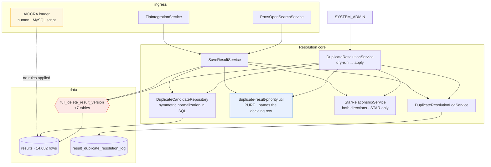

# Design — results / cross-platform-duplicate-resolution

- **Module:** results
- **Spec id:** 2026-08-cross-platform-duplicate-resolution
- **Status:** draft (**rev 3** — identity source corrected; rev 2 was re-derived after Judgment Day round 1, see [`judgment.md`](./judgment.md))
- **Owner:** ARI server squad (David Casañas)
- **Linked requirements:** [`./requirements.md`](./requirements.md)
- **Linked TRD:** [`../../../trd/trd.md`](../../../trd/trd.md)
- **Last updated:** 2026-08-05
- **Supersedes:** design.md rev 1 (2026-08-04), escalated by dual review with 8 severe findings; **rev 2 (2026-08-04), whose §0.1 baseline measured the wrong column for PRMS**
- **Rev 3 scope (2026-08-05):** §0.1 re-derived · new §0.5 · §3.1 identity model · §5.1 multi-group refusal · §5.2 in-memory identity · §7 · §10 · §11 tripwires & batching · D-dup-18…20 · §14 budget re-cut. Implements **R-RES-010**.

---

## 0. Measured baseline

Rev 1 of this design derived its facts from TypeORM entities and a `grep` over migrations, and got most of them wrong. This revision derives them from **`information_schema` and the live dev database**, read-only. Everything in this section is a measurement, not an inference.

### 0.1 The actual duplicate landscape

| Measurement | Value |
| --- | --- |
| ~~Live rows in dedup scope~~ (rev 2: TIP 8,476 · PRMS 4,357 · AICCRA 605) | **Superseded — re-measured 2026-08-05 (JD3-S-07): TIP 8,474 · PRMS 3,947 · AICCRA 584.** The rev-2 PRMS figure was overstated by 410 rows. Re-measured directly: **3,947 live PRMS rows, of which 3,947 carry a non-empty `public_link` and 0 do not** — so D-dup-18's "0 of 3,947 are handle-format" covers **100%** of the live PRMS population, not a subset. |
| STAR rows carrying a `public_link` | **0** — STAR can never be a duplicate participant |
| `results` rows total | 14,682 |
| **Cross-platform duplicate groups — rev 2 baseline, `public_link` for all three platforms** | **116** ← *superseded, see §0.5* |
| **Cross-platform duplicate groups — rev 3, corrected identity** | **2,359** |
| Platforms involved | **PRMS ↔ TIP dominates** (2,249 pairs) · PRMS ↔ AICCRA 16 · TIP ↔ AICCRA 116 |
| Groups involving PRMS | **2,254 of 2,359 (95%)** |
| Groups spanning >1 report year | **56** (rev 2 measured 11) |
| `is_snapshot IS NULL` / `is_active IS NULL` anywhere | **0** — the nullable-column hazard does not exist in data |
| AICCRA rows already soft-deleted by the current buggy path (`is_active = 0`, status 8) | 21 |

**The rev-2 rows of this table are retained deliberately.** They are not merely stale — they are the evidence for DC-9, and deleting them would erase the record of how a plausible number concealed a structural blind spot.

Two consequences reshape the whole spec — **both inverted in rev 3:**

**~~The problem is TIP↔AICCRA, not PRMS.~~ The problem is overwhelmingly PRMS↔TIP.** Rev 2 concluded PRMS participated in zero duplicate groups and therefore that *"PRMS handling is inherited correctness, not the target."* It participates in **2,254 of 2,359**. The conclusion was not a misreading of the data; the data was read from the wrong column (§0.5). AICCRA still needs a rules path — it has no sync pipeline — but it is now the *small* population, and the PRMS sync path is the one carrying nearly all deletion volume.

**OQ-1's reach shrank; OQ-10's appeared.** Rule 3 (AICCRA CS over PRMS/TIP KP) governed 30 of 116 groups — 26% — under rev 2. Against 2,359 groups it governs a low single-digit percentage, because PRMS↔TIP is decided by Rule 1. The consequential scoping decision is no longer OQ-1 but **OQ-10**: confining PRMS identity to Knowledge Product leaves 370 detectable duplicates unresolved, and that is now the largest deliberate omission in the spec.

### 0.2 Normalization buys nothing — measured

Six cumulative normalization levels were run against live data:

| Normalization | Groups found |
| --- | --- |
| `TRIM` only (today's behavior) | 116 |
| + lowercase | 116 |
| + strip scheme | 116 |
| + strip `www.` | 116 |
| + strip trailing `/` | 116 |
| + unify `dx.doi.org` → `doi.org` | **116** |

Exactly **one** normalized key has more than one raw variant. Cross-platform URL variance is **not** why duplicates are being missed.

This retires the largest and riskiest part of rev 1. The persisted `normalized_public_link` column, its index, its backfill, and two of the three migrations bought **zero additional detection** — while carrying RK-1 (a normalizer that destroys a distinct publication) as an explicitly unautomatable risk. Dropping them removes three tasks, two migrations, and the spec's only accepted-blind-spot in one move. It also dissolves the rev-1 severe finding that the index could not be created at all (`public_link` is `TEXT` → MySQL error 1170): there is no index.

Matching is therefore a **conservative normalization computed symmetrically in the query** — applied to the stored side and the incoming side alike, which is the one thing rev 1's `normalizePublicLink` genuinely got wrong (it trimmed only the incoming value and compared against raw storage). Over 14,682 rows a scan is free; rev 1's 30-second NFR was sized for a table 100× larger than this one.

### 0.3 The delete path — measured, not inferred

| Claim | Measured reality |
| --- | --- |
| FKs referencing `results(result_id)` | **38** — 37 `NO ACTION`, **1 `CASCADE`** (`project_indicators_results`) |
| Live `full_delete_result_version` | 35 DELETE targets, body 7,325 bytes — **byte-identical in coverage to migration `1783029013035`**, which is the true latest. No live drift. |
| `link_results` handling in the live function | `WHERE result_id = temp_result_id OR other_result_id = temp_result_id` — **already both directions** |
| `delete_result` (the soft path in use today) | 0 DELETE statements — pure `UPDATE`. Confirms the reported bug: the row survives with its `public_link`. |
| FK-holding tables **not** covered by the function | **7**: `result_cap_sharing_ip`, `bulk_upload_results`, `result_review_history`, `result_pool_funding_alignment`, `result_pool_funding_indicator_mapping`, `result_pool_funding_toc_alignment`, `temp_result_ai` |
| Rows in those 7 tables that would block a dedup-scope delete **today** | **0 in all seven** |
| Cross-result reference shapes (FK into another result's sub-row) | 5, of which 4 belong to `result_pool_funding_indicator_mapping` — **table is empty** |
| Live families spanning >1 report year | **0** |

So the errno-1451 hazard rev 1 built its narrative on is **real in the schema and unreachable in today's data**. That is a materially different risk statement, and it is the honest one: these are correctness gaps that become live the moment bilateral/pool-funding data lands, not present-day breakage. They are fixed here because a destructive path must be correct for the schema it runs against, not for one snapshot of its contents.

**Two hazards are active, not latent:**

1. **19 dedup-scope rows are referenced by a STAR result** via `link_results.other_result_id`, plus **7 inactive STAR link rows**. The protection rule has real work to do on real rows — and the live function clears `link_results` with no `is_active` predicate, so a hard delete destroys the recoverable inactive links too.
2. **The machine-token control asserted in rev 1 §8 does not exist, and the exposure is live.** All 4 `app_secrets` rows have **zero** `app_secret_host_list` entries, and `AppSecretsService.validation` skips the origin check entirely when the list is empty. `app_secret_id 8` resolves to user 32, who holds **`System Admin`**. A machine token that satisfies `@Roles(SYSTEM_ADMIN)` from any origin exists today. Rev 1 claimed this as one of three gates on an irreversible delete.

### 0.4 The bug, restated from source

Unchanged from rev 1 and confirmed by both judges — this part was always right:

- `deleteDuplicateResults` calls `deleteLogicalResultById` → `delete_result()` → `UPDATE is_active = FALSE`. The row and its `public_link` remain. Operators querying `results` still see the duplicate. **This is the reported failure.**
- `deleted_at` is a plain `@Column`, not `@DeleteDateColumn`, so TypeORM does not exclude soft-deleted rows → an inactive higher-priority row keeps `shouldOmit` true forever.
- Deletion runs **inside** the winner's `try`, whose `catch` calls `deleteFullResultById(createNewResult.result_id)`. Switching to a hard delete inside that block would let a cleanup failure destroy the winner.
- `duplicateResultValidation` checks `link_results.other_result_id` only, and does not require the counterpart to be STAR.
- `resolveResultDeleteTargetIds` expands a family by `{official_code, platform_code}` with **no `report_year_id`** and no `is_snapshot` predicate.
- Rule 3 currently applies to any PRMS/TIP indicator, not just Knowledge Product.
- `CounterResultsEnum` has no omission counter, and the `shouldOmit` early return skips the counter line entirely.

### 0.5 D11 — the identity field was wrong for PRMS (rev 3, measured 2026-08-05)

Read from source, then measured read-only against live dev. This is the finding that reshaped §0.1.

**Source.** `PrmsOpenSearchService.processData` sets `result.public_link = item.pdf_link` and `result.external_link = item.prms_link`. So `results.public_link` never holds the publication handle for PRMS, while the handle — the one identifier the other two platforms also store — lives in `result_evidences` for the stored corpus.

> **Rev 4 correction (2026-08-05), measured against the live wire.** This paragraph previously continued: *"The publication handle is written by `processKnowledgeProduct` into the evidence list … (line ~282)"*, and rev 3's remedy followed from it. **That is wrong twice over.** (a) `processKnowledgeProduct` is never called by `processData`, which rev 3 caught; and (b) it reads `item.result_knowledge_product_array`, a field that **does not exist on the PRMS searcher payload** — 0 of 13,507 real staged rows, and absent from a live KP item. So it could never have written the handle even if called. The handle arrives in **`item.knowledge_product_summary.handle`** (277/277 live KP items, all handle-format). Reviving `processKnowledgeProduct` is now **forbidden** — see §5.2 step 0.
>
> Also imprecise here: the observed `pdf_link` is a `reporting.cgiar.org/reports/result-details/…` URL, **not** a CGSpace bitstream URL. This does not affect the conclusion — 0 of 400 live `pdf_link` values are handle-format, so `public_link` cannot match a handle by construction — but the field's content is not what this section described.

**Measured consequence.**

| Platform | Live rows with `public_link` | Handle-format | Read as |
| --- | --- | --- | --- |
| TIP | 8,474 | **8,474 (100%)** | identity is `public_link` ✅ |
| AICCRA | 584 | 315 (54%) | identity is `public_link`, **and must not be format-filtered** — a filter drops 269 rows |
| PRMS | 3,947 | **0 (0%)** | `public_link` **cannot ever match** another platform ❌ |

So for one of three platforms in scope, the comparison was structurally incapable of matching, and it reported the only thing it could: nothing. **116 groups, zero PRMS** — a number plausible enough to build a spec on.

**PRMS identity, from evidence:**

| Measurement | Value |
| --- | --- |
| PRMS live rows | 3,947 |
| — with any evidence | 3,394 |
| — with a qualifying handle identity (role 1 · non-private · active · handle-format) | **2,792** |
| — of those, `indicator_id = 3` (KNOWLEDGE_PRODUCT) | **2,387 results / 2,387 handles — exactly 1:1** |
| Non-KP results carrying a qualifying handle | 405 (ind 1: 136 · ind 2: 161 · ind 4: 37 · ind 6: 71) |
| — of those, actually matching a live TIP/AICCRA row | **370** ← the measured cost of the KP scope (OQ-10) |

**Why the scope is KP, decided by measurement rather than preference:**

| Property | KP only (`indicator_id = 3`) | All indicators |
| --- | --- | --- |
| Groups found | 2,359 | 2,622 |
| PRMS results with >1 handle | **0** | 154 |
| PRMS results in >1 cross-platform group | **0** | 132 |
| Cross-year groups to review | 56 | 260 |

Every multi-identity row in the corpus is non-KP. On a KP row the handle *is* the result's publication; on a non-KP row it is a publication the result **cites**, and a hard delete driven by a citation is DC-10. The KP restriction is what makes group membership a **partition** — which is the precondition the pairwise resolver (§5.1) was designed against.

**Two filters that look like controls and are not.** All 4,535 PRMS evidence rows are `evidence_role_id = 1` and **zero** are private — `ResultEvidencesService` hardcodes `PRINCIPAL_EVIDENCE` (`result-evidences.service.ts:82`). The role and privacy predicates are therefore **no-ops against today's data**. They are still written, because the columns exist and a future writer may use them, but the spec must not claim them as safety controls: **the handle-format filter is the only load-bearing predicate**, and it is what discriminates the handle from the non-handle attachment that KP rows carry alongside it.

**One alternative closed by measurement.** `processKnowledgeProduct` also assigns `body.external_link = knowledgeProduct.handle`, which suggested `external_link` might carry the handle and avoid the join entirely. It does not: **0 of 3,947** live PRMS `external_link` values are handle-format. *Rev 3 first attributed this to `result.external_link = item.prms_link` overwriting it later in the same flow; the real reason is simpler and was found in round 3 — `processKnowledgeProduct` never runs, so `body.external_link = handle` never executes and there is nothing to overwrite (JD3-01).* The evidence join is the only stored identity source either way.

**Where the 2,792 stored handle evidences came from — RESOLVED in round 2 (JD3-02).** No code on the PRMS sync path writes `result_evidences`: `SaveResultService.saveAllSections` contains no reference to evidence at all, and the only production writers are `ResultsService` (`results.service.ts:939`, the AI/bulk-upload path) and the STAR authoring controller (`result-evidences.controller.ts:46`). Neither is reachable from a PRMS sync.

Measured provenance:

| Measurement | Value |
| --- | --- |
| Creation window of all 2,387 KP handle evidences | **2026-07-23, 01:36:18 → 01:45:10 UTC** |
| Distinct creation days | **1** |
| `created_by` | original PRMS author user ids (1,061 rows `NULL`, remainder spread across ~human ids) |
| Rows with `evidence_description = 'Handled'` (the mapper's marker) | **0** |
| Rows whose `result_knowledge_products.citation` is populated | **0 of 2,387** |

So the corpus is **a single bulk migration completed in nine minutes**, carrying authorship from the source system. Not the sync path, and — confirmed by the two zero rows above — not `processKnowledgeProduct` either, since both fields that method sets are empty. The stored identity corpus is **static by construction**, and this is now a measured fact rather than an inference.

Two consequences the design must carry rather than assume away:

1. **The stored corpus is static.** It will cover a shrinking share of PRMS results over time. This is the sweep's population, and it is exactly the 2,792 rows measured — not a growing set. OQ-12 is where the decision to leave it that way lives.
2. **Without the payload fix, `apply` would make the problem permanent.** Deleting ~2,249 PRMS rows and letting PRMS re-sync them would re-create rows with **no** evidence — invisible to both the sweep and the sync path, duplicated against TIP again, and undetectable forever, while the audit log recorded a successful sweep. That is strictly worse than shipping nothing, and it is why T-13 (the mapper call) is a **prerequisite for `apply`**, not an enhancement.

**Method lesson, and it is the second time this spec has learned it.** §0.2 varied six normalization levels and found no change — a real result that was silently scoped to one dimension of the matching rule, because it held the identity *field* fixed. Rev 1 derived schema facts from entity walks; rev 2 derived them from `information_schema` but derived the *identity* from an assumption (A3). **Varying one input of a matching rule proves nothing about its other inputs.** DC-9's gate is a per-platform identity assertion for exactly this reason: no amount of normalization testing can substitute for asking whether the field being read is the right field.

---

## 1. Goals & non-goals

**Goals**
1. **Match PRMS on the identifier other platforms share — R-RES-010. 2,254 groups are invisible without it.**
2. Make the loser genuinely absent, safely and auditably — R-RES-003, R-RES-004, R-RES-009.
3. Give AICCRA a rules path that needs no sync pipeline — R-RES-008. 116 TIP↔AICCRA groups are waiting for it.
4. Make winner selection a group-level decision that names *which row* satisfied each rule — R-RES-002.
5. Stop soft-deleted and snapshot rows from poisoning the candidate set — R-RES-001.
6. Close the two active hazards: incomplete STAR protection, and the non-existent machine-token gate.

**Non-goals**
- A persisted normalized link column, its index, or a backfill (§0.2: zero measured benefit).
- Performance engineering for a 14,682-row table.
- An AICCRA ingestion pipeline, or changes to the loader's MySQL script.
- A cron-scheduled sweep (OQ-2 closed: manual only).
- Hard-deleting the 21 AICCRA rows the current bug already soft-deleted (OQ-4).
- Any change to `client/`, the STAR authoring lifecycle, or `result_status_workflow`.

---

## 2. Architecture

One pure resolution core, three callers: the TIP sync path, **the PRMS sync path (rev 3: the dominant population, 2,254 of 2,359 groups — no longer "inherited correctness")**, and a new admin sweep that is the AICCRA answer.

> **Terminology — two different things are called "identity" on this page (JD3-09). They must not be confused, because both drive hard deletes:**
>
> | Term | Means | Where |
> | --- | --- | --- |
> | **publication identity** | the normalized cross-platform matching key (`public_link` or handle evidence) | rev 3: §3.1, §5.1 step 8, `rawIdentity`, `identitySource`, `identityCount` |
> | **family key** | `result_official_code` + `platform_code`, used to expand a result's family for deletion | §5.4.1, D-dup-17, and `query.service.ts:39` where it is fixed in code |
>
> Both have a refusal rule — "a result with >1 **publication identity** is refused" (§5.1 step 8) and "a **family key** with >1 live row refuses deletion" (§5.4.1) — and they are unrelated. Read every occurrence below with this table in hand; §5.4.1 and D-dup-17 use *family key* throughout.

### 2.1 Composition

**New**

| Path | Responsibility |
| --- | --- |
| `entities/results/repositories/duplicate-candidate.repository.ts` | All duplicate SQL. Owns the identity `UNION` (§3.1.2), the symmetric normalization expression, the `is_active`/`is_snapshot`/platform filters, and the group scan. One place, both callers. |
| **`shared/utils/publication-identity.util.ts`** (rev 3) | **The per-platform identity source.** Builds the two `UNION ALL` branches and the handle-format predicate, and exposes the in-memory equivalent used by the sync path (§5.2). Sole owner of "which field is the publication link" — deliberately separate from `public-link-normalizer.util.ts`, which stays platform-invariant. |
| `entities/results/duplicate-resolution.service.ts` | The sweep: scan → resolve → classify → plan → apply. Owns the run lock and plan confirmation. |
| `entities/results/duplicate-resolution.controller.ts` | Two admin endpoints (§4). |
| `entities/results/dto/duplicate-resolution.dto.ts` | Query/body DTOs + plan shape. |
| `entities/results/entities/result-duplicate-resolution-log.entity.ts` | Audit record, extends `AuditableEntity`. |
| `entities/results/result-duplicate-resolution-log.service.ts` | Sole writer of that table. |
| `shared/services/star-relationship.service.ts` | R-RES-004: both `link_results` directions, counterpart must be STAR, evaluated per `result_id` including expanded family members. |

**Reworked**

| Path | Change |
| --- | --- |
| `shared/utils/duplicate-result-priority.util.ts` | Pairwise → group resolver returning the winner **and the row that satisfied the rule**. Rule 3 narrowed to Knowledge Product. **Rev 3: gains the multi-group refusal (§5.1 step 8).** |
| `shared/utils/public-link-normalizer.util.ts` | **Rev 3: `dedupScopeSql` splits** — shared row scope stays, the platform + identity-presence predicate moves into the per-source branches (§3.1.2). Normalization itself is untouched. |
| `shared/services/save-all-sections.service.ts` | Candidate filters; symmetric normalization; incoming loser's own family deleted; deletion moved out of the winner's `try`; per-row error boundary; omission counter. |
| `shared/utils/query.service.ts` | `findResultFamilyIds` gains `report_year_id`; `deleteFullResultById` gains an ordered, wrapped execution path (§5.4). |
| `tools/tip-integration/tip-integration.service.ts` | `findOptions` keyed on raw `public_link` — reconciled with the matching change (JD-W-03). |
| `entities/sync-process-log/**` | A durable sink for the omission counter (JD-W-05). |
| `tools/tip-integration/dto/response-year-tip.dto.ts` | `CounterResults` + enum gain `OMITTED_DUPLICATE`. |
| `entities/results/results.module.ts` | Register the new pieces. Controller path resolves via its own `@Controller` — **no `main.routes.ts` change** (JD-W-12 resolved). |
| `db/migrations/<ts>-completeFullDeleteResultVersion.ts` | Redefine the function: +7 tables (§3.2). **The only migration in this spec.** |
| `db/migrations/<ts>-createDuplicateResolutionLog.ts` | Audit table. |

### 2.2 Reuse — and what is explicitly *not* trusted

Reused as-is: `LoggerUtil`/`CgiarLogger`, `ResponseUtils.format`, `RolesGuard` + `@Roles`, `SyncProcessLog`, `CurrentUserUtil`, `AuditableEntity`, the OpenSearch results service.

Rev 1 certified three components as safe that are not. This revision **re-verifies rather than inherits**:

| Component | Rev 1 said | Measured | This revision |
| --- | --- | --- | --- |
| `resolveResultDeleteTargetIds` | "family scoping is already correct" | No `report_year_id`, no `is_snapshot` | **Modified** (§5.4) |
| errno-1451 as a loud backstop | "why the current code works" | `link_results` already both directions → failure is **silent** | Guard is the only protection; treated as such |
| Machine-token gate | "not granted access" | Zero host rows ⇒ check skipped; one secret is `System Admin` | **New requirement** (§8) |

---

## 3. Data model

### 3.1 `results` + the identity model

**No schema change.** Rev 1's normalized column, index, and backfill are dropped (§0.2). Rev 3 adds **no column and no migration** — it changes which existing column supplies the matching key for one platform.

#### 3.1.1 Identity source is per-platform; normalization is not

Two concerns that rev 2 conflated into one expression, now separated:

| Layer | Varies by platform? | Owner |
| --- | --- | --- |
| **Identity source** — which field holds the publication link | **Yes** | new `publication-identity.util.ts` |
| **Normalization** — how a link becomes a comparison key | **No** | existing `public-link-normalizer.util.ts`, unchanged |

Keeping normalization platform-invariant is load-bearing: a per-platform *source* is required by the data, but a per-platform *normalization* would reintroduce the asymmetry that rev 1 shipped (normalizing one side of the comparison only). The same expression applies to a PRMS handle from evidence and a TIP `public_link` — R-RES-001 AC.6 asserts it.

**The identity source varies by *side* as well as by platform (rev 4).** The table below is the **stored** side, which is what §3.1.2's `UNION ALL` and T-15 implement. The **incoming** side (the sync path, §5.2 step 0) reads `item.knowledge_product_summary.handle` for PRMS KP items, because the payload is not the database and holds no evidence rows.

| Platform | Source (**stored** side) | Format filter |
| --- | --- | --- |
| TIP, AICCRA | `results.public_link` | **none** — AICCRA is 54% handle-format; a filter drops 269 rows (R-RES-010 AC.6) |
| PRMS | `result_evidences.evidence_url` · `evidence_role_id = 1` · `COALESCE(is_private,FALSE)=FALSE` · `COALESCE(is_active,TRUE)=TRUE` · `indicator_id = 3` | **required**: normalized value `REGEXP '^hdl\.handle\.net/[0-9]+/[0-9]+$'` |

**What this costs T-15, stated plainly.** Rev 3 planned a SQL/in-memory **equivalence** test on the premise that both sides applied one predicate to one field. They do not: stored reads an evidence row, incoming reads a payload scalar. So T-15 must assert **"both sides select the same handle for the same result"** — a cross-source agreement property — rather than predicate-for-predicate equality. Measured agreement today: **277/277** live KP items, where the KP's single `evidences[]` handle equals its `knowledge_product_summary.handle`. That is the invariant to assert and the number to re-measure, and it belongs in **T-14** (a live-data check) as much as in T-15, because it is a fact about data that no unit test can establish.

Normalization remains platform- and side-invariant: the same `public-link-normalizer.util.ts` expression applies to a PRMS handle and a TIP `public_link`, which is what R-RES-001 AC.6 asserts and what keeps the comparison symmetric even though the *sources* differ.

#### 3.1.2 Query shape: `UNION ALL`, not `LEFT JOIN`

The candidate set becomes **one row per (result, identity)** rather than one row per result. Two shapes were considered:

| Shape | Rejected / chosen |
| --- | --- |
| `LEFT JOIN result_evidences` with a `CASE` picking the source per platform | **Rejected.** The join must not multiply TIP/AICCRA rows, so it needs a platform predicate inside the `ON` *and* in the `CASE` — the condition is stated twice and can drift. It also makes `hasUsableIdentity` unexpressible as a single predicate. |
| **`UNION ALL` of two branches** — one per identity source | **Chosen.** Each branch owns its own scope predicate and reads exactly one source, so a platform can never draw identity from the wrong field, and the branches are independently testable. The PRMS branch is the only place `result_evidences` appears. |

`dedupScopeSql(alias)` splits accordingly: the shared row-scope predicates (`is_active`, `is_snapshot`) stay in one helper, and the `platform_code IN (…)` + identity-presence predicate moves into each branch. **`hasUsablePublicLinkSql` no longer expresses "this row can be deduplicated"** for PRMS — it becomes branch-local, which is why the split is a rename rather than an added condition.

**All three repository reads** take the union as their row source: `findCandidatesForIncoming` (`:97`), `findCrossPlatformGroupKeys` (`:125` — this *is* the group scan), and `findMembersByNormalizedLinks` (`:188`). *(JD3-07: an earlier draft said "all four … and the group scan", double-counting `findCrossPlatformGroupKeys`; §14's LOC figure was sized against that wrong list and is corrected below.)*

`SELECT_COLUMNS` gains two fields:
- **`identitySource`** (`PUBLIC_LINK` | `HANDLE_EVIDENCE`) — so the audit record can satisfy R-RES-009 AC.4. Under a hard delete it is the only way to reconstruct why a row was a group member.
- **`identityCount`** — distinct normalized identities per `result_id`, the carrier for §5.1 step 8's refusal (JD3-04). Without it the refusal has no expressible input.

`rawPublicLink` is renamed `rawIdentity` — the old name would be a lie on the PRMS branch.

**The PRMS branch must be `DISTINCT` on `(result_id, normalized identity)` (JD3-S-04).** `UNION ALL` does not deduplicate, `result_evidences` carries **no unique constraint** on `(result_id, evidence_url)`, and the versioning stored procedures copy evidence rows wholesale (`1783029013035:505,518`). Two identical handle rows would otherwise put one `result_id` in a group twice — duplicate audit rows and a double hard-delete attempt for one physical row — or inflate `identityCount` into a spurious refusal that freezes real groups. The "2,387 results / 2,387 handles" measurement counts distinct handles and is blind to a duplicated evidence row, so this is not covered by that number.

**Cost.** The PRMS branch joins ~4.5k evidence rows against ~3.9k PRMS rows; `evidence_url` is `text` so the format predicate cannot be indexed, exactly as with `public_link`. At this scale a scan remains free and no index is added (§0.2 reasoning carries over unchanged).

#### 3.1.3 Normalization, unchanged from rev 2

`TRIM` → lowercase the scheme+host → strip scheme → strip `www.` → strip one trailing `/` → unify `dx.doi.org`→`doi.org` → strip an empty query/fragment. Conservative by construction: **no path-case folding** (handles are case-sensitive) and **no query-parameter stripping**. Applied symmetrically to both sides of every comparison, whichever field supplied them.

Because all three platforms use the canonical `hdl.handle.net` host (A5), this expression alone brings every identity to `hdl.handle.net/<prefix>/<suffix>` — **no handle-extraction step is needed**, and none is added. A CGSpace-hosted variant (`cgspace.cgiar.org/handle/…`) would *not* normalize to the same key; none exists today, and T-14 is the check that would catch its arrival.

**The comparison MUST be explicitly binary-collated.** `results.public_link` is `utf8mb3_general_ci` (measured; the datasource default is `utf8mb4_unicode_520_ci`), and both collations fold **case and accents** — verified live: `'abc'='ABC'` → 1, `'jose'='josé'` → 1. A SQL `=` or `GROUP BY` on that column therefore folds path case no matter what the normalization expression does, which makes **R-RES-001 AC.2 unsatisfiable** and points the failure at **over-matching → hard delete of a distinct publication** (DC-5). Every comparison and grouping in the repository must carry an explicit `COLLATE utf8mb4_bin` (or `BINARY`) on the normalized expression.

This defect was introduced by dropping the persisted column: rev 1's TypeScript normalizer compared with JS `===` and satisfied AC.2 for free. Moving the comparison into SQL moved it into an engine with implicit folding. Measured mitigation: `distinct_binary = distinct_ci = 12,849`, so **no case-only variants exist today** — the 116-group conclusion holds, but the guarantee must be written into the predicate rather than inherited from the data.

### 3.2 `full_delete_result_version` — complete the coverage

A new migration redefines the function (`DROP FUNCTION IF EXISTS` + `CREATE FUNCTION`, the pattern the five prior delete-function migrations already use; no merged migration is edited). Baseline is the **live definition**, dumped first, confirmed identical to `1783029013035`.

Additions, in FK-dependency order before the `results` row:

`result_cap_sharing_ip` (keyed on `result_cap_sharing_ip_id`), `bulk_upload_results`, `result_review_history`, `result_pool_funding_alignment`, `result_pool_funding_indicator_mapping`, `result_pool_funding_toc_alignment`, `temp_result_ai`, plus `TEMP_result_external_oicrs` (no FK; hygiene).

**`project_indicators_results` — the one `CASCADE` — needs a guard, not nothing.** Rev 2 dismissed it because CASCADE means no errno 1451. That answers the FK-error question and not the data question: CASCADE means the hard delete **silently destroys** `project_indicators_results` rows that belong to a *project indicator*, which today's soft delete preserves. That is the identical class as the 7 inactive STAR links this spec already promoted to blocking OQ-7 — a reference that survives soft delete and dies under hard delete — so it gets the same treatment: the STAR guard counts a `project_indicators_results` reference as a protecting relationship, and any cascaded row is enumerated in the audit record before deletion. The table appears in **no migration**, so its FK exists only in the live schema; the `information_schema` re-derivation is what surfaces it and must not be skipped.

**Method obligation.** The table list must be re-derived from `information_schema` at implementation time, not from this list and **never from a TypeORM entity walk** — `result_cap_sharing_ip` has no entity, which is exactly why rev 1 missed it. The query is in `docs/specs/results/cross-platform-duplicate-resolution/` task notes. Verification is an e2e hard delete of a fully-populated seeded result on the `TEST` datasource.

**Amended during T-02 — the cross-result columns are deliberately NOT cleared.** This section originally required clearing `result_pool_funding_indicator_mapping`'s `result_capacity_sharing_id` / `result_knowledge_product_id` / `result_policy_change_id` / `result_innovation_dev_id` alongside its owning `result_id`. Implementation showed that to be the wrong call: those rows belong to a **different, surviving** result, all four columns are nullable, and nulling them would silently strip that result's indicator link — the row's entire purpose. T-05 treats a cross-result reference as **protecting**, so the state should never be reached; and if the guard ever has a gap, the untouched FK raises errno 1451 and fails **loudly**. On an irreversible path a loud failure beats silent mutation of someone else's data. Only the owning direction is deleted.

**Ordering discovered in T-02, and it is load-bearing:**

- `result_pool_funding_indicator_mapping` (owning direction) must be deleted **before** the sub-table deletes, because it holds FKs into `result_capacity_sharing`, `result_knowledge_products`, `result_policy_change` and `result_innovation_dev` — all of which the function deletes early. Placing it late would make those earlier statements raise errno 1451.
- **`result_pool_funding_alignment_sp` must be deleted before its parent `result_pool_funding_alignment`.** It is a **transitive** dependency (75 rows, `ON DELETE NO ACTION`) that does **not** reference `results`, so T-01's one-level inventory correctly does not name it, and it was absent from the live function. **Method refinement: completing the delete function needs the transitive closure of the FK graph, not one level of it.** T-11's seed must cover the transitive set, not just T-01's table list.

### 3.3 `result_duplicate_resolution_log`

One row per resolved group per run. Extends `AuditableEntity`. Carries: run id, source (`SYNC_TIP`/`SYNC_PRMS`/`SWEEP`), mode, group key, participants as JSON (each with `result_id`, `result_official_code`, `platform_code`, `indicator_id`, `report_year_id`, raw + normalized link), winner, **the deciding rule and the `result_id` that satisfied it**, classification, per-row outcome (`DELETED`/`PROTECTED`/`FAILED` + reason), and the confirmation digest.

Written **before** deletion — under a hard delete this is the only surviving trace, and it is what makes R-RES-003 AC.3 satisfiable.

### 3.4 OpenSearch

Hard-deleted results are removed from the results index after the DB delete succeeds. A removal failure is recorded `FAILED` and logged, but does not roll back the DB delete: the DB is the system of record, a stale index is repaired by reindex.

---

## 4. API surface

### GET `/api/v1/results/duplicate-resolution/plan`
- **Controller:** `entities/results/duplicate-resolution.controller.ts` · **Roles:** `@Roles(SecRolesEnum.SYSTEM_ADMIN)` · **Guards:** `RolesGuard`
- **Query:** `report-year`, `platform`, `indicator`, `limit` — all optional.
- **`data`:** run id, confirmation digest, counts per classification, and the group list (`groupKey`, `participants[]`, `winner`, `rule`, `decidedBy`, `toDelete[]` *fully expanded*, `protected[]` with the blocking relationship, `classification`).
- **Writes:** the audit run row only. Zero writes to `results` or any child table.
- **Errors:** `400` invalid filter · `401` · `403` non-admin · `409` sweep already running.

### POST `/api/v1/results/duplicate-resolution/apply`
- Same controller, roles, guards. **Body:** run id + confirmation digest.
- Re-derives the plan, recomputes the digest, and refuses on mismatch (`409`) — the data moved since the operator reviewed it.
- The digest covers the **fully expanded** deletion set, not loser seed ids (JD-W-01: rev 1's digest under-reported what would actually be deleted).
- Digest is valid for a bounded window (`app_config` TTL, default 30 min) — R-RES-008 asked for "reviewed recently" and rev 1 silently replaced it with a hash that never expires.
- **Errors:** `400` malformed / unknown run · `403` · `409` digest mismatch, expired, or concurrent run.

Both endpoints declare `@ApiTags`, `@ApiBearerAuth`, `@ApiOperation`, `@ApiQuery`/`@ApiBody`. Additive → `/v1`. Registered via `ResultsModule` + the controller's own path; no route-tree change.

**Mode parameter.** R-RES-008 specified one endpoint with `mode=dry-run|apply`; this design ships two endpoints. `requirements.md` R-RES-008 is amended to match rather than left contradictory (JD-W-08).

---

## 5. Workflows & business rules

### 5.1 Group resolution — pure, and it names the deciding row

Rev 1's rank conditions were written over *group membership* but applied to *individual rows*, so a condition satisfied by one row could crown a different one. Concretely: `{AICCRA CS, TIP KP, TIP INNOVATION_DEV}` — Rank 1 fired because a TIP KP existed, AICCRA CS won, and the TIP INNOVATION_DEV row became a loser, which R-RES-002 AC.6 and R-RES-005 AC.1 both forbid. Zero such groups exist today, but one group already holds three same-platform rows, so the shape is reachable.

The corrected resolver evaluates **pairwise over the group and requires a rule to name both rows it applies to**:

1. Build participants: `is_active = true`, `is_snapshot = false`, `platform_code ∈ {PRMS, TIP, AICCRA}`, non-empty normalized link.
2. All one platform → `SAME_SYSTEM_IGNORED`. No winner, no deletion, no omission (R-RES-005).
3. For every **cross-platform pair** in the group, apply in order:
   | Rule | Applies to the pair | Winner |
   | --- | --- | --- |
   | `RULE_3_AICCRA_CS_OVER_KP` | one side AICCRA + Capacity Sharing, other side PRMS/TIP + **Knowledge Product** | the AICCRA row |
   | `RULE_1_TIP` | one side TIP, other side not TIP | the TIP row |
   | `RULE_2_AICCRA` | one side AICCRA, other side PRMS | the AICCRA row |
   | `NONE` | same platform | neither — pair not comparable |
4. **Consistency check — run before anything is marked for deletion.** If **any** participant both **wins at least one pair and loses at least one pair**, the approved rules contradict each other for this composition. The group is classified `UNRESOLVED_CONFLICT`: reported in full, **nothing deleted, no omission, no winner recorded**.

   This is the correct handling, not a fallback, because the contradiction is in the acceptance criteria themselves. R-RES-002 AC.5 gives `AICCRA CS` > `TIP KP`; AC.2 gives `TIP` > `AICCRA`. In `{AICCRA CS, TIP KP, TIP INNOVATION_DEV}` both hold and they disagree — `AICCRA CS` wins its Rule-3 pair and loses its Rule-1 pair. No resolver can pick a winner here without inventing a precedence nobody approved, so it refuses and asks a human. See **OQ-9**.

   Two compositions this branch catches, both of which earlier revisions hard-deleted a protected row in:
   | Group | Contradiction | Earlier behavior | Now |
   | --- | --- | --- | --- |
   | `{AICCRA CS, TIP KP, TIP INNOVATION_DEV}` | `AICCRA CS` wins vs KP, loses vs non-KP | deleted **both** `AICCRA CS` and `TIP KP` | nothing deleted |
   | `{AICCRA CS, AICCRA non-CS, TIP KP}` | `TIP KP` loses vs CS, wins vs non-CS | deleted `AICCRA non-CS` | nothing deleted |

   **~~Measured cost: zero.~~ NOT RE-MEASURED — rev-2 figure, superseded corpus (JD3-05/JD3-S-08).** The original reading was: *"over the 116 live cross-platform groups, 0 would be classified `UNRESOLVED_CONFLICT` and all 116 still resolve."* That corpus contained **no PRMS row**, so by construction it held no three-platform composition. Rev 3's own arithmetic — 2,249 + 16 + 116 = 2,381 pair memberships across 2,359 groups — makes roughly **11–22 three-platform groups** live, which is exactly the shape this gate reasons about. **The true cost over the 2,359-group corpus is unknown and MUST be measured before `apply`** (T-14). A stated-zero baseline that turns out non-zero is how the previous two revisions' tripwires got waived, and §14's production gate ("the `UNRESOLVED_CONFLICT` count being non-surprising") has no baseline until this number exists.

   Note also that the gate's **wording** was corrected in rev 3: "wins ≥1 pair and loses ≥1 pair" fires on the middle element of any consistent total order, which the shipped resolver explicitly rejects (`duplicate-result-priority.util.ts:45-48`). See R-RES-002's consistency-gate paragraph — the normative text now follows the code's ordering semantics.

5. If the group is consistent, every participant is **loses-only** or **never-loses**. Losers are exactly the loses-only rows. The winner is a never-loses row that won at least one pair.
6. Several never-loses rows can survive together. If they are **same-platform**, that is same-system ambiguity: those rows are left untouched, **but cross-platform losers the group unambiguously produced are still deleted** — a row that lost to every survivor lost regardless of which survivor prevails, so its deletion is authorized (rev 1 froze the whole group and left genuine duplicates stored — JD-03/F-3). If never-loses rows span **platforms**, the rule set failed to decide a cross-platform pair: `UNRESOLVED_CONFLICT`, nothing deleted. The current rules decide every cross-platform pair, so this cannot fire today; it exists so a future rule change surfaces as a report rather than as arbitrary deletion.

   **Every row's fate must be asserted in tests, not only the row a prior revision got wrong.** Both defects above survived because the test and the narrative checked one row and left the others untraced (see §10).
7. Groups spanning >1 `report_year_id` in the sweep → `CROSS_YEAR_REVIEW`, reported, never auto-deleted (**56 groups today**; rev 2 measured 11).
8. **Multi-identity refusal (rev 3, R-RES-010) — the PARTICIPANT is refused, not the group.** A result that resolves to more than one identity is classified `UNRESOLVED_CONFLICT` **for itself**: never deleted, never counted as an omission, reported in full. **Every other member of each group it touches resolves normally and is still deleted if it lost.**

   The pairwise resolver assumes membership is a **partition** — each row in exactly one group, so "this row lost" is a complete statement about its fate. Multi-identity turns membership into a **graph**, and the approved rules were never given a meaning over that shape. Refusing the ambiguous row is the same move as D-dup-13.

   > **Corrected after round 3 (JD3-S-02).** The first draft refused **every group** the multi-identity row touched, which silently reversed §5.1 step 6 and D-dup-9 — "freeze *those rows only*, not the group" — and reintroduced rev 1's JD-03/F-3 defect of leaving genuine duplicates stored. Concretely, in `{PRMS-X(2 handles), AICCRA-CS, PRMS-Y}` the whole-group form kept PRMS-Y stored even though its loss is decided entirely without reference to X. One ambiguous row would have frozen every group it appeared in, giving an under-deletion whose blast radius is unbounded by the multi-identity count.

   **Where this branch lives — not in the pure resolver (JD3-04).** `resolveDuplicateGroup(participants, options)` (`duplicate-result-priority.util.ts:207`) is pure over one group's participants, and `DuplicateGroupParticipant` (`:81-84`) carries only `resultId`/`platformCode`/`indicatorId`/`reportYearId` — no identity, no group key, no cross-group input. "This row also belongs to another group" is not expressible there. The carrier is therefore an explicit field: **both `UNION` branches project `identityCount`** (distinct normalized identities per `result_id`), it is added to `DuplicateGroupParticipant`, and the refusal is applied by the two components that hold the group map — `DuplicateResolutionService` (sweep) and `SaveResultService.buildDuplicateGroup` (sync). The resolver stays identity-blind, which is what §5.1's closing paragraph intends.

   **Costs, split by side, because they differ (JD3-S-03):**

   | Side | Cost |
   | --- | --- |
   | **Stored** | **Zero.** All 2,387 stored KP handles are 1:1. |
   | **Incoming** | **Zero, and structural rather than measured (rev 4).** ~~Unmeasured and reachable today via `processKnowledgeProduct`'s `PrmsKnowledgeProductDto[]` loop.~~ That array is not on the wire; the field actually read, `knowledge_product_summary.handle`, is a **scalar**, so an incoming payload cannot present two identities through it (277/277 live KP items carry exactly one). The refusal branch stays as a net — see R-RES-010 AC.9. |

   Rev 3 first called this "a standing net for data that does not yet exist". That was a stored-side measurement stated as a general claim: **the mapper can produce a multi-handle payload on any sync run**, so the sync path needs the branch as live logic, not as a net. §5.2 step 0 states the rule — refuse, create/update normally, count no omission, delete nothing, and **never resolve on the first handle found**.

   **What the refusal is actually protecting against.** Under R-RES-002's rule table PRMS loses Rule 1, Rule 2 and Rule 3 — it **never wins a cross-platform pair** (measured counterparts: TIP 2,249, AICCRA 16). So a multi-identity PRMS row is loses-only everywhere and cannot be "the winner of group B destroyed by group A's verdict". The real hazard is narrower: a PRMS row pulled into a group by a handle it merely **cites** (DC-10), where deletion would be authorized by a membership that was never true. KP scoping is the primary mitigation; this branch is the backstop.

Resolution reads only `(platform, indicator)` per participant — never "who is incoming" — so R-RES-002 AC.7 order-independence holds by construction. **The resolver never learns which field produced an identity**, and does not receive the identity itself; it sees participants plus `identityCount`. The rules therefore cannot acquire a platform dependency through the identity change.

### 5.2 Sync path

**0. Resolve the incoming row's identity from the payload, in memory (rev 3).** The duplicate check runs *before* the result is saved, so the stored-side SQL branch is not available for the incoming row — its identity must come from the payload.

> **Corrected after Judgment Day round 3 (JD3-01). The first draft of this step was built on dead code.**
>
> It claimed the payload "already carries" the handle in `ExternalMappersDto.evidence.evidence[]`, "populated by `processKnowledgeProduct` before `SaveResultService` is called". Verified against source: `processKnowledgeProduct` is `private` at `prms.opensearch.service.ts:263` and its only references in the repository are three `(service as any)` calls in its own spec file. **`processData` — the sole producer of the `ExternalMappersDto[]` handed to `bulkSaveAllSections` — never calls it and never assigns `result.evidence`.** The field is `undefined` for every PRMS payload.
>
> The error came from reading a sibling mapper's behaviour onto this one: **TIP's mapper does populate it** (`tip-integration.service.ts:340-352`). Nothing in production reads the field, so TIP's evidence is silently dropped too — it has one writer and zero readers.
>
> **Consequence had it shipped:** the PRMS sync path would resolve no identity, fall into step 1's "none → skip", and deduplicate nothing on the path §7 calls dominant — DC-7 reintroduced by the amendment whose purpose is to remove it. No declared gate would have caught it: T-14 asserts the *stored* side, `publication-identity.util.spec.ts` feeds a synthetic evidence list, and §10's e2e seeds DB rows and exercises the `UNION`, not the mapper. Hence **R-RES-010 AC.10**, which asserts a real `processData` output carries the handle.

> ### ⚠️ Rev 4 (2026-08-05) — the fix below is NOT "one call to `processKnowledgeProduct`". That was falsified by observing the wire.
>
> **What was wrong:** `processKnowledgeProduct` reads `item.result_knowledge_product_array`. That field is absent from **0 of 13,507** real staged PRMS payloads and from a live KP item. The revival was implemented, passed a 2,253-test suite, and was a **total silent no-op** — the test fixture supplied the field the wire does not carry. Reverted.
>
> **Reviving it is now forbidden, for a second and independent reason:** `processKnowledgeProduct` also writes `body.knowledgeProduct`, which has a live production reader (`SaveResultService` → `ResultKnowledgeProductService.update`). Calling it starts issuing `UPDATE result_knowledge_products SET citation = <handle>, type = <raw PRMS string>` on every PRMS KP sync. Measured: `citation` is populated on **8,476/8,476 TIP** rows and **0/2,388 PRMS** rows, so §0.5's provenance baseline is exact today and this would destroy it — along with the DC-10 discriminator (JD3-S-06).
>
> **The correct fix:** read `item.knowledge_product_summary.handle` for KP items (`indicator_category.code = 6`) and carry it into the incoming identity. No call to `processKnowledgeProduct`; no write to `body.knowledgeProduct`. Measured: present and handle-format on **277/277** live KP items, exactly one handle each.
>
> **Why the dedicated field beats `evidences[].link`,** which also carries the handle on 277/277 KP items: **41 of 123 live non-KP items carry a handle-format link in `evidences[]`** — cited publications, i.e. DC-10. `knowledge_product_summary` exists only for the result's own publication, so KP-only scope becomes a property of the field instead of a filter to remember.
>
> Full evidence: [`./execution.md`](./execution.md) → *Pivot Record: T-13 — RESOLVED BY OBSERVATION*.

**The fix is a small, genuinely additive mapper read (T-13).** `processData` must carry `item.knowledge_product_summary?.handle` into the incoming payload for KP items. This is a mapper change — §7's earlier "the mapper is unchanged" no longer holds — but its blast radius is nil **provided it writes only the identity carrier and nothing else**: `public_link = pdf_link` and `external_link = prms_link` stay untouched, and `dto.knowledgeProduct` MUST remain `undefined` on this path. That last clause is not a style preference; it is the difference between an inert change and 2,388 overwritten rows per sync.

**Why the payload alone closes the hole, and persistence is deferred.** With the payload populated, a PRMS row that `apply` deleted and PRMS re-syncs resolves its identity in memory, is judged a loser, and is **omitted — never re-created**. That is what stops the sweep from making duplicates permanently undetectable (JD3-02). Persisting `dto.evidence` would additionally let the *sweep* see PRMS rows created after this change, but it would also write evidence for ~8,476 TIP results — outside this spec. See **OQ-12**; the accepted consequence is that the 2,792-row stored corpus is **static**, so sweep coverage of PRMS decays over time while sync-path coverage does not.

| Incoming platform | Identity taken from |
| --- | --- |
| TIP, AICCRA | `dto.public_link` (unchanged) |
| PRMS, KP (`indicator_category.code = 6`) | **`item.knowledge_product_summary.handle`**, when normalized-handle-format (rev 4) |
| PRMS, other indicators | **none** — not a dedup participant |

**Note the enum.** The payload's `indicator_category.code` is `ResultTypeEnum`, where `KNOWLEDGE_PRODUCT = 6`; ARI's `IndicatorsEnum.KNOWLEDGE_PRODUCT = 3` is the value *after* `IndicatorHomologation`. Both appear in this spec and they are not interchangeable — an earlier rev-4 probe tested `code = 3` and measured nothing, which is the same class of error as D11 itself.

> **Rev 4 — the asymmetry described below is RETIRED, not merely reduced.** It was a consequence of resolving the incoming identity from an *evidence array* whose partials lacked `evidence_role_id`, `is_private` and `is_active`. Reading `knowledge_product_summary.handle` means there is no evidence row on the incoming side at all: nothing to have a role, nothing to mark private, nothing to retract. **The handle-format filter is now the only predicate on either side, and both sides share it** — so the "accepted risk" below no longer needs accepting, and no PR may cite it as a live caveat. The three mitigations it lists are correspondingly moot.
>
> **One real asymmetry replaces it, and it is a different shape:** the two sides now read **different fields of different systems** — stored `result_evidences.evidence_url`, incoming `knowledge_product_summary.handle`. They agree on 277/277 live KP items, but that is a *measured* agreement between two sources, not one expression applied twice. **Consequence for T-15:** the SQL/in-memory equivalence it was to assert must be re-scoped from "the same predicate on the same field" to "both sides select the same handle for the same result". See §3.1.1.
>
> The paragraph below is retained as the rev-3 record of a risk that has since been designed out.

**The in-memory predicate is weaker than the SQL one.** ~~The payload's evidence partials carry only `evidence_url` and `evidence_description` — no `evidence_role_id`, no `is_private`, **no `is_active`** — so the incoming side cannot apply those three filters.~~ *(rev 3; superseded — see the block above.)* Today both sides agree anyway: all 4,535 stored PRMS evidence rows are role 1 and none is private. The writer that makes this so is `ResultEvidencesService.updateResultEvidences`, which hardcodes `PRINCIPAL_EVIDENCE` at **`result-evidences.service.ts:67`** (JD3-06 — an earlier draft cited line 82, which is the *read* filter inside `findPrincipalEvidence`; and note `is_private` **is** in that writer's field list, so the privacy predicate is empirically empty rather than structurally a no-op).

**The asymmetry fails toward over-deletion, so it is stated as an accepted risk rather than as a safe simplification.** If any future writer stores a non-principal or private handle evidence, the SQL side denies that identity while the in-memory side grants it — and an incoming PRMS row judged a loser on an identity the sweep does not recognise routes `findResult`'s whole family into the hard-delete loop (§5.2 step 4). Three mitigations, and none is a CI gate:

| Mitigation | Strength |
| --- | --- |
| `publication-identity.util.ts` owns both the SQL and in-memory forms, so they are edited together | Structural, but only against *intentional* divergence |
| **T-14** asserts the stored-side invariant against live data | Real, but it is a **manual pre-`apply` check, not a gate** — it needs the populated dev corpus, and §10's own disqualifier makes it report `INCONCLUSIVE` in any normal CI run |
| The handle-format filter, which applies identically to both sides | The only load-bearing predicate, and the only one both sides genuinely share |

The honest statement is therefore: **the invariant is currently true, its writer is known, and its only enforcement is a human check before `apply`.** The provenance caveat of JD3-02 sharpens this — the writer named above is *not* on the PRMS sync path, so it does not explain the 2,792 stored rows; those have a legacy origin and no maintained writer at all.

1. Normalize the incoming identity; none → skip (no deduplication, on any platform).
2. Load candidates via the repository (symmetric normalization, same `report_year_id`, live non-snapshot rows). **`findResult` is not excluded** — rev 1's `excludeResultId` filter is what hid the loser's own row.
3. Build the participant set. **The incoming payload and `findResult` are ONE participant, never two.** When `findResult` exists, the incoming payload *is* that row being updated: the participant carries `findResult`'s `result_id` and the **incoming** payload's `platform_code`/`indicator_id`, because the incoming data is the newer truth. When `findResult` is null, the participant is prospective and has no `result_id` yet.

   Counting them separately put two same-platform participants in the group for one physical row, which fired the same-platform ambiguity branch on **every routine re-sync of an already-stored row** — the shape of all 116 measured groups. The path then had no defined outcome for the incoming row: one reading no-ops forever (the reported bug), the other deletes the stored row on every sync (JD2-03).
4. **Resolve, then act on that single participant's verdict:**

   | Verdict | Action |
   | --- | --- |
   | **Loser** | Do not create or update. Count `OMITTED_DUPLICATE`. If `findResult` exists, its family enters the **same step-7 loser loop** as any other loser — STAR guard, audit, delete. Never a separate direct delete call. |
   | **Winner** | Create/update and write all sections as today (step 5). |
   | **Never-loses but not the winner** (same-platform ambiguity, or `UNRESOLVED_CONFLICT`) | Create/update normally, and delete **nothing**. Not an omission. |

   The verdict is the *participant's*, not "incoming is not the winner". Rev 2 keyed step 4 on the latter and then deleted `findResult`'s family unconditionally — but `findResult` is a distinct row that can itself be the winner. TIP made this reachable because `findOptions` is keyed on raw `public_link`, not on indicator: a stored TIP `INNOVATION_DEV` row reclassified upstream to `KNOWLEDGE_PRODUCT` would arrive as an incoming loser to `AICCRA CS`, and step 4 would delete the group's actual winner, then step 7 would delete the remaining loser, **leaving nothing** (JD2-02). Routing every deletion through step 7 also removes the double-delete that duplicated audit rows and guard checks for one physical deletion.
5. **Winner** → create/update and write all sections as today.
6. **Commit boundary** — the winner is durably stored before any deletion is attempted.
7. Per loser, **outside the winner's `try`**, each in its own error boundary: STAR check → audit write → delete → OpenSearch removal. Any failure records `FAILED` and continues. **Never rethrown into the winner's rollback.**

### 5.3 Sweep

1. Acquire the run lock — a row in `app_config` (or the log table) with a holder id and timestamp, **not** an in-process flag, which would pass the unit test and fail across replicas (JD-W-04). Already held → `409`.
2. Scan for groups spanning >1 platform, in batches.
3. Resolve, classify, run the STAR check per planned loser **and per expanded family member**.
4. Persist the run with `mode = DRY_RUN`; compute the digest over the ordered fully-expanded deletion set.
5. Zero groups → `INCONCLUSIVE` with the filter echoed. A run that found nothing has not proved nothing is there.
6. On `apply`: re-derive, compare digest, check TTL, then execute §5.2 step 7 per loser. Release the lock in `finally`.

### 5.4 Deletion scope and ordering

Three defects in the reused path, fixed here:

- **Year scope.** `findResultFamilyIds` matches `{official_code, platform_code}` only, one data shape away from a same-year resolution destroying another year's live row — which would defeat R-RES-006, the spec's headline conservatism control, from the deletion side while the matching side stayed correct. `report_year_id` is added to the predicate **for live rows only**. See §5.4.1: applying it to snapshots as well was a defect, corrected after measurement.
- **Guard coverage.** The STAR check ran on the seed `result_id`, then expansion deleted siblings nobody checked. The guard now runs on **every** id in the resolved target set, and the audit row records the set.
- **Ordering and atomicity.** `deleteFullResultById` issues one autocommitted `SELECT full_delete_result_version(?)` per family member, unordered. If the live row succeeds and a snapshot then fails, the live row is gone and orphan snapshots remain — and since every participant set filters `is_snapshot = false`, **no later run can ever see them**, while they keep a `public_link`. Family deletion is wrapped in one transaction with snapshots ordered **before** the live row, so a mid-family failure rolls back to a coherent state.

#### 5.4.1 Year scope applies to live rows, **never** to snapshots (correction, 2026-08-04)

The rule above originally scoped the *whole* family by `report_year_id`. **That was wrong, and the measurement below is why.** It was caught by the tripwire this design itself specified (`siblingIdsOutsideReportYear`), during T-11's validation.

| Measure (dev, 2026-08-04) | Value |
| --- | --- |
| Snapshots total | **574** |
| Snapshots no live row of their identity shares a `report_year_id` with | **469 (82 %)** |
| → of those, a live row exists under a **different** year | **451** ← would be orphaned |
| → of those, no live row exists at all | 18 (pre-existing, out of scope) |
| Snapshots with `version_id` populated | **0 of 574** — no parent link exists in the schema |
| Live rows | 14,108 |
| Identities with **more than one** live row | **4** |

The live row carries the *current* `report_year_id`; a snapshot retains the year it was taken for. So a fully year-scoped family **excludes a live row's own snapshots** — leaving them in `results` with no live counterpart, which is precisely the permanent-invisibility orphan the third bullet above exists to prevent. Four out of five snapshots are affected: the norm, not an edge case.

The root cause is one filter applied to two structurally different kinds of row. **A snapshot is a *version* of a result, not a *reporting-year row* of it.**

**Corrected scope for a live seed:**

| Component | Predicate |
| --- | --- |
| `live_siblings` | same identity · `is_snapshot = FALSE` · **year-scoped** |
| `snapshots` | same identity · `is_snapshot = TRUE` · **no year filter** |
| `targetIds` | `snapshots` first, `live_siblings` last (ordering rule unchanged) |

A snapshot seed still resolves to itself alone. This keeps the real fix — deleting a 2024 loser must not destroy the live 2025 row, since live rows stay year-scoped — while ending the orphaning.

**Guard for the 4 ambiguous identities.** With more than one live row and no parent link, snapshot ownership is undecidable, so an unscoped sweep could destroy a *surviving* live row's version history. Those identities **refuse deletion and are flagged for manual handling** rather than guessed at. 4 of 14,108 is a precisely bounded exclusion, and guessing here is unrecoverable.

**`siblingIdsOutsideReportYear` is narrowed to live rows.** As originally written it counts snapshots, so after this correction it would fire on nearly every delete and decay into noise — and a tripwire that always trips gets waived, the exact failure §11 warns about for the 116-group threshold.

Rejected: sweeping every snapshot with no guard (destroys version history for the 4); and refusing whenever `siblingIdsOutsideReportYear` is non-empty (safe, but leaves 82 % of snapshots permanently undeletable).

---

## 6. Frontend impact

None. API-only. An `/admin` page to drive dry-run → apply is a natural follow-up needing its own spec; excluded so the destructive path ships with the narrowest surface. No `client/` change.

---

## 7. Integration impact

| System | Change |
| --- | --- |
| TIP (`tip-integration.service.ts:184`) | Omissions counted; deletions hard and audited. Its `findOptions` raw-link identity key is reconciled with the normalized matching so the sync cannot manufacture a same-platform duplicate that §5.1 step 2 then declines forever (JD-W-03). **Rev 3: TIP is now overwhelmingly the *winner* side.** Its pair population is **2,365** — 2,249 PRMS↔TIP plus 116 TIP↔AICCRA — and it prevails under Rule 1 in all of the former. The pairs TIP **loses** are the Rule-3 ones inside TIP↔AICCRA (rev 2 measured Rule 3 as governing 30 of those 116 groups; **not re-measured under the rev-3 corpus**). *(JD3-S-05: an earlier draft said "2,249 of its 2,265 PRMS/AICCRA pairs" — 2,265 is 2,249 + 16, i.e. **PRMS's** two counterpart counts, and the 16 PRMS↔AICCRA pairs contain no TIP row. That reading understated where a TIP row actually gets hard-deleted, which is the one thing the runbook must not understate.)* |
| PRMS / OpenSearch (`prms.opensearch.service.ts:231`) | **Rev 3 — the dominant path, not inherited correctness.** 2,254 of 2,359 groups involve PRMS and PRMS loses every cross-platform pair, so this is where nearly all deletion volume lands. The sync path resolves identity from `dto.evidence.evidence[]` (§5.2 step 0). **The mapper is unchanged** — `public_link = pdf_link` stays; this spec reads a different field rather than rewriting what PRMS stores. Hard-deleted results are removed from the OpenSearch index. |
| AICCRA | No integration exists and none is added. The sweep is the answer, and **116 groups are waiting for it**. *Operational dependency:* the loader's runbook must require a sweep after each load, or this gap returns in a new form. |
| Socket.IO / RabbitMQ / Dynamo / CLARISA / AGRESSO | Untouched. |

No new env vars. No new secrets.

---

## 8. Security & authorization

- Both endpoints: `SYSTEM_ADMIN` via `@Roles` + `RolesGuard`.
- **Machine tokens must be blocked explicitly, and this is new work.** Rev 1 asserted they were excluded by not adding `app_secret_host_list` rows. Measured: the host list is an origin allowlist for the whole token, **zero rows skips the check**, all four secrets have zero rows, and `app_secret_id 8` resolves to a user holding `System Admin`. So a machine token satisfying `@Roles(SYSTEM_ADMIN)` from any origin exists **today**. The design must therefore add a real control — a guard or decorator that rejects a request whose principal was authenticated by machine token, on these two routes — and a test asserting a machine-token request receives `403`. This is promoted to a requirement (`NFR-RES-005` amended) rather than left as an assertion in prose.
- The JWT `exclude` list is not widened. No PII beyond what `results` holds.
- `apply` has three gates: role, a reviewed dry-run digest, and a TTL. Each covers a different failure — unauthorized caller, unreviewed plan, stale plan.

---

## 9. Observability

| Signal | Level / sink | Content |
| --- | --- | --- |
| Loser deleted | `log` | `result_id`, platform, indicator, winner, rule, **deciding row** |
| Loser protected | `warn` | both ids, link direction, counterpart platform |
| Deletion failed | `warn` | id, error, reason |
| Incoming omitted | `debug` + counter | official code, platform, winner, rule |
| Sweep run | `sync_process_log` + audit run row | filter, mode, counts per classification, duration |

The audit table, not the logs, answers "did it actually delete the duplicates?" — the question that opened this spec. The omission counter gets a durable column in `sync_process_log`; rev 1 incremented it in memory and discarded it at end of run (JD-W-05).

---

## 10. Testing strategy

| Suite | Target |
| --- | --- |
| `duplicate-result-priority.util.spec.ts` | **Composition** matrix, not a member matrix — and **every assertion names the fate of every row in the group, not just the row a prior revision got wrong.** Two revisions shipped a data-loss defect precisely because the test asserted one row was safe and left the others untraced. Each case therefore asserts the complete partition: winner, losers, untouched. Mandatory cases: `{AICCRA CS, TIP KP, TIP non-KP}` and `{AICCRA CS, AICCRA non-CS, TIP KP}` → both `UNRESOLVED_CONFLICT` with **`toDelete` empty**; `{TIP, AICCRA non-CS}` → AICCRA deleted; `{AICCRA CS, TIP KP}` → TIP KP deleted; same-platform-only → untouched; plus order-independence by permuting the participant array on every case. |
| `duplicate-candidate.repository.spec.ts` | Symmetric normalization; inactive excluded; snapshot excluded; same-platform excluded. **Rev 3: the identity `UNION` — a PRMS row draws identity from evidence and NEVER from `public_link`; a TIP/AICCRA row draws from `public_link` and never joins `result_evidences`; an AICCRA non-handle `public_link` stays in scope (AC.6); `identitySource` is projected correctly on both branches.** |
| **`publication-identity.util.spec.ts`** (rev 3) | The four negative cases of R-RES-010 AC.3 (private · non-principal role · inactive · non-handle-format), each contributing no identity; AC.4 (two principal evidences, one handle → exactly one identity); AC.5 (non-KP yields nothing); **and the SQL/in-memory equivalence** — the same evidence list must produce the same identity set through both forms, which is the assumption §5.2 step 0 rests on. |
| `star-relationship.service.spec.ts` | Both directions × counterpart platform (STAR vs mirror) × active/inactive link; **and the expanded-family case** — a STAR link on a sibling id must protect. |
| `save-all-sections.service.spec.ts` | The incoming loser's own stored family is deleted (JD-06 regression, **red before the fix**); a **genuinely throwing** deletion must not roll back the winner (KZ-001: a stub that resolves cannot prove this); inactive candidate does not block; three-way group. |
| `query.service.spec.ts` | Family expansion is year-scoped; snapshots ordered before the live row; a mid-family failure rolls back. |
| `duplicate-resolution.service.spec.ts` | dry-run writes nothing (row counts before/after); digest mismatch → 409; TTL expiry → 409; zero groups → `INCONCLUSIVE`; lock is out-of-process. |
| `duplicate-resolution.controller.spec.ts` | Allowed role, denied role, **and machine-token principal → 403**. |
| `duplicate-result-priority.util.spec.ts` (rev 3 addition) | **The three-platform composition `{AICCRA CS, PRMS KP, TIP KP}` — mandatory (JD3-05).** Rev 3 makes ~11–22 such groups live and the mandatory matrix contained no three-platform case, which is why the requirement/code divergence on the consistency gate went unnoticed. Assert the **complete partition** (AICCRA wins, TIP KP and PRMS KP both deleted) and assert that the group is **not** classified `UNRESOLVED_CONFLICT` — the ordering AICCRA > TIP > PRMS is consistent even though TIP wins one pair and loses another. |
| `duplicate-resolution.service.spec.ts` + `save-all-sections.service.spec.ts` (rev 3) | **The multi-identity refusal (§5.1 step 8)**, tested where it now lives (JD3-04) — not in the pure resolver. Sweep side: a participant with `identityCount > 1` is never in any `toDelete`, **and the other members of its groups still resolve and are still deleted**. Sync side: a two-handle incoming payload creates/updates the row, counts no omission, deletes nothing, and does **not** resolve on the first handle. |
| `prms.opensearch.service.spec.ts` (rev 3) | **R-RES-010 AC.10 — the precondition assertion.** A real `processData` run over a KP item with a populated `handle` yields a `dto.evidence.evidence[]` entry carrying that handle. This is the one test that would have caught JD3-01; every other rev-3 gate feeds a synthetic evidence list or seeds DB rows, and so is blind to whether the mapper produces one. |
| `test/` e2e | Hard delete of a fully-populated seeded result without errno 1451 (the only proof of §3.2 completeness — unmockable); dry-run row-count invariance. **Rev 3: an end-to-end PRMS↔TIP group — a seeded PRMS KP row whose handle evidence matches a seeded TIP `public_link` — resolves with TIP as winner and the PRMS row deleted. This is the D11 regression and it is unmockable: it needs the real `UNION` against real rows.** |
| **`test/` T-14 — live-data invariants** (rev 3) | The three assertions that are properties of **data**, not of code, and that no unit test can make. **(a)** DC-9: every platform in scope contributes a non-zero identity count, with the handle-format rate reported per platform. **(b)** Every PRMS evidence row is `evidence_role_id = 1` and non-private — the invariant §5.2 step 0's weaker in-memory predicate depends on. **(c)** KP handle identity is 1:1 (no PRMS KP result carries two handles) — the property that makes group membership a partition. Read-only. **A run that cannot reach a database reports `INCONCLUSIVE`, never a pass.** |

Coverage: 60% floor; the pure resolver at or near 100% — it holds the business rules and costs nothing to cover.

**What disqualifies T-14's evidence.** T-14 reads live data, so it can produce a green result that means nothing. It is **not** evidence if: the connection failed or the target database is empty (→ `INCONCLUSIVE`); the PRMS row count is zero (→ the corpus is not the one these numbers describe); or the handle-format rates differ materially from §0.5's table without an explained data change (→ the corpus moved, and the KP scope decision needs re-measuring before it can be trusted). Report the spread and stop — do not record a pass because the command exited `0`.

---

## 11. Rollout

Two deploys, not three — the backfill step is gone with the column.

1. **Deploy 1 (schema):** audit table + redefined delete function. Inert.
2. **Deploy 2 (code):** resolution core, sync path, sweep endpoints. Hard delete on the **sync** path gated off by `app_config`, default off.
3. **Verify by dry-run** on dev — **2,359 groups** (rev 2 planned for 116), human-reviewed. This is the DC-5/RK-1 gate.
4. `apply`, then enable the sync-path flag.

**Rev 3 — `apply` is batched, not one sweep (OQ-11).** The reviewable artifact grew 20× with the group count, and a 2,359-group document reviewed in one sitting is a gate in name only. `apply` runs **filtered by `report-year`**, one year per confirmed plan, which the existing query filters already support with **no code change** — the digest and TTL apply per batch, so each batch is separately reviewed and separately confirmed. Order the batches oldest-year-first: the oldest data is the most settled, so the first batch is the cheapest place to discover a surprise.

The **56 cross-year groups** are never auto-deleted (R-RES-006) and form a standing manual queue, five times rev 2's 11.

**Feature flag, fully specified** (rev 1 left the off-behavior undefined, so the shipped default could have been indistinguishable from the bug — JD-W-06): key `duplicate_resolution.hard_delete_enabled`, default `false`. When **off**, the sync path resolves, counts `OMITTED_DUPLICATE`, writes the audit row, and **skips deletion entirely** — it does *not* fall back to a soft delete, because a soft delete is the reported bug. Off is therefore "detect and report, don't delete", the state is visible in the audit table, and the flag state is recorded on every audit row.

**Backout:** code rollback restores current behavior; the schema is additive. Applied deletions are **not recoverable from ARI** — recovery is re-sync from TIP/PRMS (A1/A2), which is why `apply` has three gates.

**Rev 3 — the recoverability asymmetry is now the *reassuring* half of a much larger blast radius.** Rev 2's warning was that 86 of 116 groups made **AICCRA** the loser, and AICCRA has no automatic re-sync. That still holds and is still the sharpest edge. But the volume has moved: **PRMS is the loser in ~2,249 groups**, and PRMS *does* have an automatic sync (A2), so the overwhelming majority of what `apply` now deletes is re-syncable. Two things follow for the runbook, and they pull in opposite directions:

| | Population | Recoverable? | Operator implication |
| --- | --- | --- | --- |
| PRMS losses | ~2,249 groups | **Yes — but only once T-13 ships** | High volume, low per-row risk. Re-sync re-creates the row; the sync path then resolves its identity **from the payload** and omits it, so the cleanup holds. **Without T-13 the re-created row carries no identity and the duplicate becomes permanently undetectable** — see below |
| AICCRA losses | ~102 groups (86 of the 116 TIP↔AICCRA, plus 16 PRMS↔AICCRA) | **No** | Low volume, **irreversible per row**. Unchanged from rev 2 and still the population to be most careful with |

The second row is why batching by year does not reduce the need for care: AICCRA rows are spread across batches, so every batch carries some irreversible deletions.

**Ordering constraint discovered in round 3 (JD3-02) — T-13 gates `apply`, and this is the sharpest thing in the rollout.** Run `apply` before the mapper populates the payload and the sweep does not clean up, it **destroys the ability to ever detect the duplicate again**: the PRMS row is hard-deleted, PRMS re-syncs it, the re-created row has no handle evidence (nothing on the sync path writes one) and no payload identity (the mapper call is missing), so it is invisible to both the sweep and the sync path — a duplicate against TIP once more, now permanent, with a successful sweep in the audit log. That is strictly worse than never running the sweep at all.

Rollout order is therefore **Deploy 1 (schema) → Deploy 2 (code, including T-13) → verify by dry-run → `apply` per year**. T-13 is not an enhancement to sequence conveniently; it is what makes `apply` recoverable.

**Comms:** MEL/product (OQ-3), the AICCRA loader owner (runbook + the asymmetry above), DevOps (deploy ordering), security (the machine-token finding, which is a live exposure independent of this spec).

---

## 12. Design decisions log

| # | Date | Decision | Rationale |
| --- | --- | --- | --- |
| D-dup-1 | 08-04 | Rule 3 only against Knowledge Product | Owner decision (OQ-1). Measured: governs 30 of 116 groups. |
| D-dup-2 | 08-04 | Hard delete, audit record written first | "Must not be stored" must be verifiable by `SELECT`. Challenge in §12.1. |
| D-dup-3 | 08-04 | Group resolution, **pairwise-within-group, rule names both rows** | Rev 1's membership conditions crowned rows no rule had compared. |
| D-dup-4 | 08-04 | Sweep manual, admin-only, dry-run → digest+TTL → apply | DC-5 has no automated gate; the human review is the gate. |
| **D-dup-5** | 08-04 | **No persisted normalized column, no index, no backfill.** Normalization computed symmetrically in SQL. | **Measured: six normalization levels all find the same 116 groups; one key has multiple raw variants.** Removes 3 tasks, 2 migrations, the TEXT-index impossibility, and most of RK-1. Reverses rev 1's D-dup-5. |
| D-dup-6 | 08-04 | Complete the delete function for 7 tables + the cross-result mapping columns, derived from `information_schema` | 7 uncovered `NO ACTION` FKs. Zero blocking rows today; correctness for the schema, not for one snapshot. |
| D-dup-7 | 08-04 | Deletion after the winner commits, per-row error boundary outside the `try` | The `catch` deletes the just-created winner. |
| D-dup-8 | 08-04 | Auto-deletion same-year; cross-year reported | 11 of 116 groups span 2 years. |
| D-dup-9 | 08-04 | Same-platform ambiguity freezes **those rows only**, not the group | Rev 1 froze whole groups, leaving genuine cross-platform duplicates stored. |
| D-dup-10 | 08-04 | Family deletion is year-scoped, guard-checked per member, transactional, snapshots first | Three defects in a component rev 1 certified as correct. |
| D-dup-11 | 08-04 | An explicit machine-token block on both endpoints, with a `403` test | The control rev 1 asserted does not exist, and the exposure is live. |
| D-dup-12 | 08-04 | Flag `off` = detect, audit, **do not delete** — never soft-delete | An undefined off-behavior could ship a default indistinguishable from the bug. |
| **D-dup-13** | 08-04 | **A group whose rules contradict is `UNRESOLVED_CONFLICT`: reported, nothing deleted.** Rules are applied pairwise; a rule decides only the two rows it names. | AC.2 and AC.5 are mutually inconsistent for 3-row compositions (OQ-9). Two prior revisions each hard-deleted a protected row trying to force a winner. Refusing costs **0 of the 116 live groups** and removes the resolver's dependence on an unanswered business question. |
| **D-dup-14** | 08-04 | **The incoming payload and `findResult` are one participant.** Step 4 acts on that participant's verdict; every deletion routes through the single loser loop. | Counting them twice fired the same-platform branch on every routine re-sync; keying on "incoming is not the winner" could delete a `findResult` that was the group's winner, leaving nothing. |
| **D-dup-15** | 08-04 | **Explicit `COLLATE utf8mb4_bin` on every normalized comparison and grouping.** | `public_link` is `utf8mb3_general_ci`; case *and* accent folding are implicit, which makes R-RES-001 AC.2 unsatisfiable and points the failure at over-deletion. Created by moving comparison from JS `===` into SQL. |
| **D-dup-16** | 08-04 | **The `CASCADE` FK is a protecting relationship, not a non-issue.** | CASCADE destroys rows the soft delete preserves — the same class as the inactive STAR links already gated behind OQ-7, so it gets the same guard and audit treatment. |

| **D-dup-18** | **08-05** | **Identity source is per-platform; normalization stays platform-invariant.** PRMS identity = principal handle evidence; TIP/AICCRA = `public_link`, **unfiltered by format**. New `publication-identity.util.ts` owns the source; the normalizer is untouched. | **Measured: 0 of 3,947 PRMS `public_link` values are handle-format** — the matching key was structurally unable to match for one of three platforms, which is why rev 2 found 116 groups instead of 2,359. Splitting source from normalization keeps the symmetry property rev 1 got wrong. A format filter on `public_link` would drop **269 AICCRA rows** (54% handle-format), so it is confined to the PRMS branch. |
| **D-dup-19** | **08-05** | **PRMS identity is confined to `indicator_id = 3` (KNOWLEDGE_PRODUCT), and ownership is corroborated by title agreement — not by uniqueness.** | **Measured: KP handles are 1:1 in both directions (2,387 results / 2,387 handles); every multi-identity row in the corpus is non-KP.** That bounds *ambiguity*. **Ownership** is a separate claim and rests on a separate measurement: **2,156 of 2,266 cross-platform pairs (95.1%) share an identical title.** *Round 2 (JD3-S-06): the first draft used the 1:1 figure to justify ownership, which it cannot — a row carrying one cited handle is fully consistent with 1:1. Both mapper-provided discriminators proved unavailable (`citation` empty for all 2,387; `evidence_description = 'Handled'` on zero rows), because `processKnowledgeProduct` never runs.* The KP scope also keeps group membership a **partition**, which the pairwise resolver requires. Costs, both explicit: **370 real duplicates left undetected** (OQ-10), and **110 title-disagreeing pairs as the residual DC-10 exposure**, reported as a distinct review section rather than absorbed into 2,359 groups. |
| **D-dup-20** | **08-05** | **A participant with more than one identity is `UNRESOLVED_CONFLICT` in every group it belongs to.** | Multi-identity turns membership from a partition into a graph, and the approved rules have no meaning over that shape. Same move as D-dup-13. **Measured cost: zero live cases** — but unlike D-dup-13 the trigger is reachable by a *data* change alone (one extra handle evidence), so the branch is tested against a synthetic participant rather than left to a future rule change. |
| ~~**D-dup-22**~~ | **08-05** | ~~**`processData` must call `processKnowledgeProduct`, so the incoming payload carries the handle.**~~ **SUPERSEDED by D-dup-23.** The prerequisite-for-`apply` half stands; the mechanism was wrong. | **JD3-01/02.** Correctly established that the identity model was authored against a method that never runs. Its *remedy* was still wrong — see D-dup-23. |
| **D-dup-23** | **08-05 (rev 4)** | **`processData` reads `item.knowledge_product_summary.handle` for KP items (`indicator_category.code = 6`) and carries it into the incoming identity. `processKnowledgeProduct` MUST NOT be called. T-13 remains a prerequisite for `apply`.** Persisting the handle as evidence stays deferred (OQ-12). | **Two independent reasons, both measured against the live wire rather than read from code — the method that failed three times in this spec.** (1) `processKnowledgeProduct` reads `item.result_knowledge_product_array`, absent from **0 of 13,507** real staged payloads and from a live KP item; the revival shipped a **total no-op under a green 2,253-test suite**, because the fixture supplied the missing field. (2) It also writes `body.knowledgeProduct`, which has a live reader (`SaveResultService` → `ResultKnowledgeProductService.update`), so calling it issues `UPDATE result_knowledge_products SET citation, type` on every PRMS KP sync — measured `citation` populated on **8,476/8,476 TIP** and **0/2,388 PRMS** rows, so §0.5's provenance baseline is exact and would be destroyed. The chosen field is present and handle-format on **277/277** live KP items. Preferred over `evidences[].link` (which agrees 277/277) because **41 of 123 live non-KP items** carry a *cited* handle there — DC-10 — so the dedicated field makes KP-only scope structural. |
| **D-dup-23** | **08-05** | **The multi-identity refusal applies to the PARTICIPANT, not the group, and lives in the sweep service + `buildDuplicateGroup`, carried by a projected `identityCount`.** | **JD3-04/JD3-S-02.** Whole-group refusal silently reversed D-dup-9 and reintroduced rev 1's JD-03/F-3 under-deletion. And the pure resolver's signature — one group's participants, no identity — structurally cannot host the branch, so assigning it there would have produced either a no-op or a half-applied refusal. |
| **D-dup-21** | **08-05** | **`apply` is batched by `report-year`, oldest first.** | The human review of the plan is the only gate for DC-5, and it grew from a 116-group artifact to a 2,359-group one. Existing query filters already support this with **no code change**; digest + TTL apply per batch, so each is separately reviewed and confirmed. |
| **D-dup-17** | 08-04 | **Year scope applies to live rows only; snapshots attach by identity with no year filter. Identities with >1 live row refuse deletion.** Supersedes the year-scoping half of D-dup-10. | **Measured: 451 of 574 snapshots would have been orphaned** — the live row carries the current year while a snapshot keeps the year it was taken for, so a fully year-scoped family excludes a row's own snapshots. One filter had been applied to two different kinds of row: a snapshot is a *version*, not a *reporting-year row*. `version_id` is NULL on all 574, so no parent link exists; with 4 identities holding multiple live rows, ownership is undecidable there and is refused rather than guessed. Caught by this design's own `siblingIdsOutsideReportYear` tripwire. Full record in `execution.md` → *Pivot Record: T-07*. |

### 12.1 Reversion challenge — D-dup-2 (soft → hard delete)

| What soft delete provided | Broken? | Addressed by |
| --- | --- | --- |
| A recoverable row | **Yes, irreversibly** | Audit record pre-delete; re-sync for TIP/PRMS. **Weakest for AICCRA**, which loses 86 of 116 groups and has no automatic re-sync — hence the runbook emphasis in §11 |
| An in-table audit trace | Yes | `result_duplicate_resolution_log`, which also records *why* — a better trace |
| Referential safety by never deleting a parent | **Yes** | D-dup-6 + D-dup-7 + D-dup-10 + the STAR guard. **And the errno-1451 backstop rev 1 relied on is already gone** — `link_results` is cleared in both directions, so a guard bug now fails silently, not loudly. The guard is the only protection. |
| Recoverable *inactive* STAR links | **Yes — 7 rows** | The live function clears `link_results` with no `is_active` predicate. R-RES-004 protects only active links, so these 7 are destroyed. Rev 1's challenge table missed this entirely (JD-W-09). Either extend protection to inactive links or accept the loss explicitly — **flagged as OQ-7, blocking `apply`.** |

**Outcome: proceed, with D-dup-6, D-dup-7, D-dup-10, D-dup-11 as blocking prerequisites, and OQ-7 resolved before `apply`.** The challenge earned its keep twice: in rev 1 it promoted the delete-function work from a one-line change; here it surfaced the 7 inactive STAR links that neither judge's severity ranking caught as blocking.

### 12.2 Reversion challenge — D-dup-18 (PRMS `public_link` removed as an identity source)

D-dup-18 **takes away** behavior the shipped code has: PRMS rows currently participate in matching via `public_link`. Challenge question: *what does removing it break?*

| What PRMS `public_link` matching provided | Broken? | Evidence |
| --- | --- | --- |
| Cross-platform detection for PRMS | **No — it never provided any.** | Measured: **zero** normalized-key matches between any live PRMS `public_link` and any live TIP or AICCRA `public_link`. Checked explicitly against AICCRA's 269 **non-handle** links, the one population where a `pdf_link` collision was plausible. The path has never matched a row. |
| PRMS↔PRMS same-system detection | No | Same-platform groups are `SAME_SYSTEM_IGNORED` — reported, never deleted (R-RES-005). Nothing is lost that was ever acted on. |
| A fallback if evidence is missing | **Not a loss — a hazard avoided.** | A PRMS row with no handle evidence has no comparable identity. Falling back to `pdf_link` would compare a bitstream URL against other platforms' handles, which is the defect being fixed. 1,155 PRMS rows have no qualifying handle and correctly leave dedup scope. |

**Outcome: proceed, no mitigation required.** This is the rare reversion that removes a code path with a measured zero blast radius. Worth noting *why* the challenge was still cheap to run: the same question asked of D-dup-2 (soft→hard delete) surfaced the 7 inactive STAR links that two judges missed, and the cost of asking is one query.

---

## 13. Open questions

| id | Question | Owner | Needed by |
| --- | --- | --- | --- |
| OQ-3 | Report-year scope: **56** groups span >1 year and are reported, not deleted (rev 2 measured 11). Confirm. | MEL / product | before `apply` |
| **OQ-10** | **370 detectable PRMS duplicates left unresolved** by the KP scope (D-dup-19). Extend to non-KP indicators, at the price of 154 multi-identity rows, 132 multi-group refusals and DC-10 exposure? Recommend **hold at KP**, revisit as a separate spec once the KP sweep has run. | MEL / product | before rollout (non-blocking for `plan`) |
| **OQ-11** | **Blast radius grew 22×.** `apply` now targets 2,254 PRMS-involving groups. Batching by `report-year` is the design's answer (D-dup-21) — confirm the operator accepts per-year confirmation, and note that AICCRA's irreversible rows are spread across every batch. | ARI ops | **blocks `apply`** |
| OQ-4 | The 21 AICCRA rows already soft-deleted by the buggy path: leave, or hard-delete in the sweep? Assumed **leave**, excluded from matching. | ARI ops | before rollout |
| **OQ-7** | **7 inactive STAR link rows** will be destroyed by a hard delete of their mirror. Extend protection to inactive links, or accept? Recommend **extend** — a soft-deleted link is recoverable today. | Engineering lead | **blocks `apply`** |
| **OQ-8** | The live machine-token exposure (`app_secret_id 8` → `System Admin`, zero host restrictions) is a finding **independent of this spec**. Who owns remediating it? | Security / eng lead | before Deploy 2 |
| **OQ-9** | **R-RES-002 AC.2 and AC.5 are mutually inconsistent** for any group holding an AICCRA Capacity-Sharing row, a PRMS/TIP Knowledge Product, and a PRMS/TIP non-KP row. AC.5 gives AICCRA the win; AC.2 gives TIP the win; both apply. MEL must either declare an explicit precedence, or confirm the composition is unresolvable-by-machine. **Resolved for now as option (b)** — `UNRESOLVED_CONFLICT`, reported, nothing deleted (D-dup-13) — on the owner's instruction to proceed. **This is a safe default, not the answer**: it never deletes wrongly, but it also never resolves such a group, so an explicit precedence would strictly increase what gets cleaned. Zero live groups are affected today. | MEL / product owner | before a composition of this shape appears in data |

Closed: OQ-1 (Rule 3 = KP only), OQ-2 (manual sweep), OQ-5 (hard delete), OQ-6 (**answered by measurement — no live drift; the live function matches `1783029013035`**).

---

## 14. Budget

| Metric | Rev 1 | Rev 2 | **Rev 3 (delta only)** |
| --- | --- | --- | --- |
| Tasks | 12 | 9 | **+3** (T-13, T-14, T-15 — all three now defined below) |
| LOC | ~1,500 | ~1,050 | **+~310** (≈140 production, ≈170 tests) |
| Migrations | 3 | 2 | **+0 — no schema change** |
| Review rounds | 3 | 2 | **+1 (spent: Judgment Day round 3)** |

**The three rev-3 tasks (JD3-08 — T-15 was previously counted and never defined):**

| id | Scope | Why it is separable |
| --- | --- | --- |
| **T-13** | **The mapper read + payload identity (rev 4).** `processData` reads `item.knowledge_product_summary.handle` for KP items — **never** calling `processKnowledgeProduct` (D-dup-23); `publication-identity.util.ts` gains the in-memory identity form; `SaveResultService` resolves incoming PRMS identity and applies the multi-identity refusal (§5.2 step 0). **Prerequisite for `apply`** — without it `apply` makes duplicates permanently undetectable (§0.5). | Touches the PRMS ingestion path only; testable against a real `processData` output (R-RES-010 AC.10 part 1) — but AC.10 also requires a **recorded live-payload observation**, because a mapper test can only prove ARI is self-consistent, not that it reads the right field. |
| **T-14** | **Live-data invariant check** (§10): per-platform cross-platform *matchability* (R-RES-001 AC.7), the role/privacy invariant, and KP 1:1 in **both** directions. Read-only; reports `INCONCLUSIVE` rather than passing when it cannot reach a populated DB. | A manual pre-`apply` gate, not CI — stated as such rather than implied to be automated. |
| **T-15** | **The stored-side identity `UNION`**: `publication-identity.util.ts` SQL form, the `dedupScopeSql` split, `DISTINCT` on the PRMS branch, `identitySource`/`identityCount`/`rawIdentity` projection across the three reads, and the sweep-side refusal. | The sweep half; depends on nothing in T-13 and carries the whole 2,792-row legacy corpus. |

LOC and production-line counts were re-cut after JD3-07 (three reads, not four) and JD3-04 (the `identityCount` projection and the refusal moving into two call sites rather than one util).

Rev 2 was smaller than rev 1 because measurement retired work rather than adding it: the normalized column, its index, and its backfill are gone (§0.2), and the performance NFRs they served are moot at 14,682 rows.

**Rev 3 adds little code and a great deal of consequence.** The production delta is ~110 lines — a new identity util, the `UNION` in four existing reads, one resolver branch, and the sync path's in-memory identity — with **no migration and no schema change**. The disproportion is the point: what changed is not the size of the implementation but the size of the population it acts on (116 → 2,359 groups), and that lands in the rollout, the runbook and the review artifact, not in the diff. Rev-2 sign-off does not carry over.

Tripwires for `/akili-execute` — stop and escalate, do not push through:
- The `information_schema` FK list at implementation time exceeds the 7 named tables → the schema moved; the whole delete path needs re-derivation.
- The e2e hard delete raises errno 1451 → §3.2 is incomplete despite the re-derivation.
- **On dev only:** a dry-run returns materially more or fewer than **2,359** groups, or fewer than **2,254** involving PRMS → the identity resolution or the data moved; investigate before `apply`. This is a *dev regression check against a known baseline* (re-measured 2026-08-05), **not a production gate** — production will legitimately return a different count, and a threshold that always trips is a threshold that gets waived (the pathology DC-2 was reworded to avoid). The production gate is the human review of the plan itself, plus the `UNRESOLVED_CONFLICT` and `protected` counts being non-surprising for that environment.
- **Any platform in scope contributes zero identities** → DC-9 has recurred on a different field. This is the tripwire whose absence let rev 2 ship a wrong baseline: a per-platform count, not a total, because the total looked fine.
- **Any PRMS KP result resolves to more than one handle** → the 1:1 property behind D-dup-19 and the partition assumption no longer holds; the KP scope decision needs re-measuring before `apply`.
- **Any handle resolves to more than one PRMS KP result** — the **reverse** direction, added in round 2 (JD3-S-09). Measured clean today: all 2,387 handles map to exactly one result, and **0** shared handles also match a TIP/AICCRA row. It needs its own tripwire because the failure is not benign and no branch catches it: in `{PRMS_A, PRMS_B, TIP}` the survivor is TIP, Gate A does not protect A and B (they share no platform with the survivor), so **both PRMS rows are hard-deleted** — and if the shared handle is a data error, a distinct publication is destroyed. The 1:1 assertion must be **bidirectional**; enforcing one direction leaves the other ending in a two-row irreversible deletion.
- **Title agreement across PRMS↔counterpart pairs falls materially below 95%** → the ownership corroboration behind A6 is weakening, and DC-10's residual is growing. The 110 disagreeing pairs are the review population; a sharp rise means citations are entering the identity set.
- **`UNRESOLVED_CONFLICT` from the multi-group branch is non-zero on dev** → expected to be exactly 0 (D-dup-20); a non-zero count means live data has moved into the shape the branch refuses.

---

## 15. References

- [`judgment.md`](./judgment.md) — Judgment Day round 1, 8 severe findings, the ledger this revision answers
- `requirements.md` — R-RES-001…009, NFR-RES-001…005, DC-1…7
- Commit `21f61a44` — the first implementation, narrowed and restructured here
- `src/db/migrations/1783029013035-UpdateDeleteAndVersionSp.ts` — **the live delete-function definition** (confirmed by dump)
- `docs/specs/kaizen-log.md` — **KZ-001** shaped §10 (a deletion double must genuinely throw); **KZ-003** shaped §7 (`CounterResults` is consumed by both pipelines → full-suite run). **A candidate new lesson for `/akili-archive`: rev 1's premises came from entity walks and unsorted `grep | tail`; every one that mattered was wrong, and two independent judges plus one `information_schema` query corrected them. Derive schema facts from the schema.**
- No ADR superseded.
