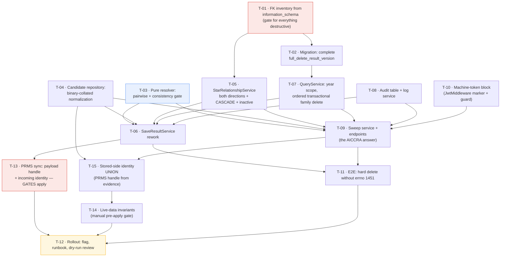

# Tasks — results / cross-platform-duplicate-resolution

- **Module:** results
- **Spec id:** 2026-08-cross-platform-duplicate-resolution
- **Status:** in-progress — **14 of 15 done.** T-11 `[~]` (owner-parked; needs the `TEST` datasource, which is dead at the network level). **T-14 is the only remaining task and is next eligible** — it is SELECT-only against dev with the existing `.env`, so it has **no infrastructure blocker**, unlike T-11. `apply` against real data still blocked by OQ-7, OQ-8, OQ-11, T-11 and T-14.
- **Owner:** ARI server squad (David Casañas)
- **Linked requirements:** [`./requirements.md`](./requirements.md)
- **Linked design:** [`./design.md`](./design.md) (**rev 3**, post-correction)
- **Linked review ledger:** [`./judgment.md`](./judgment.md) — **three rounds**; round 3 ended `APPROVED` after 9 both-judge-confirmed findings, two of which invalidated the rev-3 draft's load-bearing code claims
- **Last updated:** 2026-08-05

---

## 0. Read this before starting

**This spec hard-deletes production rows. Recovery is a re-sync from the source platform — and AICCRA has no automatic sync.**

**Rev 3 changed the scale of that sentence by 20×.** Duplicate detection was reading `results.public_link` for PRMS, which holds the `pdf_link`, not the publication handle — so PRMS was structurally excluded and reported as clean. Re-measured under the corrected identity:

| | Rev 2 believed | Measured (2026-08-05) |
| --- | --- | --- |
| Cross-platform groups | 116 | **2,359** |
| Involving PRMS | **0** | **2,254 (95%)** |
| Cross-year groups to review | 11 | **56** |

Two consequences for whoever executes this:

- **PRMS is now the dominant deletion population**, and it loses every cross-platform pair under the rules. AICCRA remains the *irreversible* population (~102 groups, no automatic re-sync) and is spread across every batch — so batching `apply` by year does not reduce the need for care.
- **T-13 gates `apply`.** Running the sweep before the PRMS payload carries its handle would hard-delete rows that re-sync as *permanently undetectable* duplicates. Strictly worse than never sweeping. See T-13.

Three things this task list inherits from a two-round adversarial review, each of which caught a data-loss defect that a passing test would have hidden:

1. **Assert every row's fate, never just the row a previous attempt got wrong.** Two revisions shipped an over-deletion defect because the test asserted one row was safe and left the others untraced. Every resolver test asserts the complete partition: winner, losers, untouched.
2. **Derive schema facts from `information_schema`, never from a TypeORM entity walk or a `grep` over migrations.** `result_cap_sharing_ip` holds a live FK and has no entity; `project_indicators_results` exists in no migration at all. Both were missed by entity-derived methods.
3. **A green gate is not evidence unless the gate can see the defect.** Each task below states what **disqualifies** its evidence, not only what satisfies it.
4. **A code fact is not established until its call path to production is traced** — the rev-3 lesson, and the third instance of the same root cause. Rev 1 read schema facts off entities; rev 2 read the identity field off an assumption; rev 3 read a mapper's behaviour off a method body **without checking anything calls it** (`processKnowledgeProduct` is referenced only by its own spec), and imported a sibling mapper's behaviour onto it. Each claim was true *locally* and false *on the path that runs*. When a task asserts "X already happens", grep for the call site before believing it.

**Four open questions block the destructive step, not the build:** OQ-7 (7 inactive STAR links), OQ-8 (live machine-token exposure), **OQ-11** (blast radius grew 22× — batch `apply` by year), and **OQ-12** (whether to persist `dto.evidence`). Tasks T-01…T-15 may proceed; `apply` against real data may not until OQ-7, OQ-8 and OQ-11 are answered.

**Two residual risks are accepted, not solved,** and must not be described as closed in any PR: DC-10's **110 title-disagreeing pairs** (a HITL review gate — ownership is not fully automatable) and the **in-memory/SQL predicate asymmetry** in T-13, which has no CI gate.

---

## 1. Task numbering

`T-<NN>`, mapped to `R-RES-<NNN>` / `NFR-RES-<NNN>`. Ordering is the dependency graph in §2, not priority.

---

## 2. Dependency graph



No cycles. **T-01 gates every destructive task** — it is the method fix, and skipping it reproduces the failure of both prior revisions. T-03 and T-04 are pure and can start immediately in parallel with T-01.

**Rev 3 adds a second hard gate: T-13 gates `apply`,** for a different reason than T-01. T-01 prevents a delete that *fails*; T-13 prevents a delete that *succeeds and cannot be undone or re-detected*. T-15 is the sweep half and is independent of T-13 — they can run in parallel — but **T-12 depends on both**, because the rollout's dry-run review needs the identity `UNION` (T-15) and its `apply` step needs the sync path (T-13).

---

## 3. Task list

### T-01 — Derive the FK inventory and delete-function baseline from the live schema

- **Requirements covered:** R-RES-003, R-RES-004, §5 data requirements
- **Files touched:** `fk-inventory.md` (evidence artifact) + `fk-inventory.gen.js` (the generator, vendored so T-02 can re-derive with one command)
- **Description:** Dump the live `full_delete_result_version` definition and enumerate every FK referencing `results` and every cross-result FK, from `information_schema`. Produce the authoritative table list T-02 and T-05 consume. This task exists because the first revision of this spec derived the same facts from a TypeORM entity walk and an unsorted `grep | tail`, and got the migration baseline, the link-direction handling, and the table list all wrong.
- **Implementation notes:**
  - `SELECT k.TABLE_NAME, k.COLUMN_NAME, r.DELETE_RULE FROM information_schema.KEY_COLUMN_USAGE k JOIN information_schema.REFERENTIAL_CONSTRAINTS r … WHERE k.REFERENCED_TABLE_NAME = 'results'` — plus the same with `REFERENCED_COLUMN_NAME = 'result_id'` and `REFERENCED_TABLE_NAME <> 'results'` for cross-result shapes.
  - `SHOW CREATE FUNCTION full_delete_result_version` → parse its DELETE targets → set-difference against the FK list.
  - Read-only. `SELECT`/`SHOW` only. The shared dev DB is not disposable.
  - Expected (measured 2026-08-04, for regression comparison only, **not** as the answer): 38 FKs / 37 `NO ACTION` + 1 `CASCADE`; 35 DELETE targets; 7 uncovered `NO ACTION` tables + `project_indicators_results` (CASCADE) + `TEMP_result_external_oicrs` (no FK).
- **Acceptance / done check:**
  - [x] The artifact lists every FK with its `DELETE_RULE`, and the uncovered set as a computed difference.
  - [x] The live function definition is recorded verbatim with its byte length (7,325 B).
  - [x] Any divergence from the expected figures is called out explicitly with the cause.
- **What disqualifies the evidence:** an inventory produced from entities, migrations, or this document's numbers instead of `information_schema`. **If the uncovered set differs from the 7 named tables, stop and escalate** — the schema moved and the whole delete path needs re-derivation (§14 tripwire).
- **Result (2026-08-04):** **38** FKs / **37** `NO ACTION` + **1** `CASCADE`; **35** function DELETE targets; uncovered `NO ACTION` = the **7** expected tables; uncovered `CASCADE` = `project_indicators_results`; **5** cross-result shapes. **Divergence: none — the §14 tripwire does not fire and T-02 may proceed.** One correction made during the task: the "carries `result_id`, no FK" enumeration initially included 17 **views** (`report_*`, `vw_results_dashboard_*`), which would have put `DELETE FROM vw_…` into the migration; filtering on `TABLE_TYPE = 'BASE TABLE'` leaves exactly `TEMP_result_external_oicrs` (326 rows), the one table the design already named.
- **Dependencies:** none · **Effort:** S · **Status:** **done**
- **Skills:** `nestjs-expert`

---

### T-02 — Migration: complete `full_delete_result_version`

- **Requirements covered:** R-RES-003
- **Files touched:** `src/db/migrations/<ts>-completeFullDeleteResultVersion.ts`
- **Description:** Redefine the function to delete from every FK-holding table T-01 found uncovered, plus the cross-result columns of `result_pool_funding_indicator_mapping`. Baseline is the **live definition** dumped in T-01, not any migration file.
- **Implementation notes:**
  - `DROP FUNCTION IF EXISTS` + `CREATE FUNCTION` — the pattern the five prior delete-function migrations use. **Never edit a merged migration.**
  - Add in FK-dependency order, before the `results` row: `result_cap_sharing_ip` (keyed on `result_cap_sharing_ip_id`), `bulk_upload_results`, `result_review_history`, the three `result_pool_funding_*`, `temp_result_ai`, `TEMP_result_external_oicrs`.
  - `result_pool_funding_indicator_mapping` also needs its **cross-result** columns cleared (`result_capacity_sharing_id`, `result_knowledge_product_id`, `result_policy_change_id`, `result_innovation_dev_id`), not only its owning `result_id` — otherwise a surviving pool-funding result keeps a reference to a deleted sub-row.
  - `down()` restores the T-01 dumped definition verbatim.
- **Acceptance / done check:**
  - [x] `npm run migration:dev:execute` applies cleanly; `npm run migration:revert` restores the dumped definition byte-for-byte. **Verified by a full round trip on dev (2026-08-04):** function body 7,295 → 8,851 on apply, back to **7,295** on revert, 8,851 again on re-apply, with the audit table, counter column and config rows disappearing and returning alongside. A backout path that has never been executed is not a backout path.
  - [x] Every table in T-01's uncovered set appears in the new body — verified in the **stored** definition, not just the source file.
- **What disqualifies the evidence:** a clean apply proves the SQL parses, **not** that coverage is complete — only T-11's seeded e2e proves that. Do not mark done on the migration running.
- **Progress (2026-08-04):** migration written at `src/db/migrations/1785866413438-completeFullDeleteResultVersion.ts`, generated from the **live** function body so `down()` restores it verbatim and `up()` cannot drift through transcription. Verified: TypeScript compiles clean; four generator self-checks pass (presence, placement before `DELETE FROM results`, mapping-before-`result_knowledge_products`, `_sp`-before-parent); and the SQL was **executed under a temporary function name** against the real schema — it parsed, every table and column resolved, the stored definition carried **44** DELETE targets (up from 35) with all 9 additions present, the temporary function was dropped, and `full_delete_result_version` was never touched.
- **Two deviations from `design.md` §3.2, both recorded there:**
  1. The cross-result columns of `result_pool_funding_indicator_mapping` are **not** cleared. Those rows belong to a surviving result; nulling them strips that result's indicator link. T-05 protects instead, and an untouched FK fails loudly if the guard has a gap.
  2. **`result_pool_funding_alignment_sp` was added** — a transitive dependency (75 rows, `NO ACTION`) that does not reference `results`, so T-01's one-level inventory did not name it and the live function omitted it. **Completing the function needs the transitive closure of the FK graph.** T-11's seed must cover the transitive set.
- **Applied 2026-08-04** with `npm run migration:dev:execute`, on the owner's instruction. Before applying, the migration's `down()` body was confirmed **byte-identical** to the live definition (7,295 chars, DEFINER-stripped), so the rollback was exact rather than approximate.
- **Post-apply state, measured:** **44** DELETE targets (was 35); all 9 additions present; **zero** `NO ACTION` FK tables remain uncovered. `project_indicators_results` stays uncovered **by design** — it is the one `CASCADE` FK and D-dup-16 treats it as a protecting relationship, not a deletion target. `fk-inventory.md` was regenerated against the post-fix schema and reports no divergence.
- **Dependencies:** T-01 · **Effort:** M · **Status:** **done**
- **Skills:** `nestjs-expert`

---

### T-03 — Pure resolver: pairwise rules + consistency gate

- **Requirements covered:** R-RES-002, R-RES-005, R-RES-006
- **Files touched:** `src/domain/shared/utils/duplicate-result-priority.util.ts`, `…util.spec.ts`
- **Description:** Replace the pairwise-vs-incoming resolver with a group resolver that applies each rule to the two rows it names, gates on rule consistency, and returns the complete partition (winner, losers, untouched, classification, deciding rule + deciding row). Pure — no I/O, no repository, no Nest DI.
- **Implementation notes:**
  - Rules per `design.md` §5.1 step 3; Rule 3 scoped to Knowledge Product (OQ-1 closed).
  - **Consistency gate (D-dup-13):** any row that wins ≥1 pair **and** loses ≥1 pair ⇒ `UNRESOLVED_CONFLICT`, empty `toDelete`, no winner, no omission.
  - Classifications: `RESOLVED`, `SAME_SYSTEM_IGNORED`, `UNRESOLVED_CONFLICT`, `CROSS_YEAR_REVIEW`, `NO_CONFLICT`.
  - Same-platform survivors leave **those rows** untouched while still deleting a cross-platform row that lost to every survivor.
  - Return the deciding `result_id` alongside the rule — R-RES-009 AC.1 and the audit schema both require it.
- **Acceptance / done check:**
  - [x] `{AICCRA CS, TIP KP, TIP non-KP}` → `UNRESOLVED_CONFLICT`, `toDelete` **empty**.
  - [x] `{AICCRA CS, AICCRA non-CS, TIP KP}` → `UNRESOLVED_CONFLICT`, `toDelete` **empty**.
  - [x] `{TIP, AICCRA non-CS}` → AICCRA is the only loser. `{AICCRA CS, TIP KP}` → TIP KP is the only loser.
  - [x] Same-platform-only group → no winner, no loser, no omission.
  - [x] Every case asserts the **complete partition**, and every case is re-run over a permuted participant array with an identical result (R-RES-002 AC.7).
- **What disqualifies the evidence:** a test that asserts only which row survives, or only that one named row is untouched. **That exact shape let this defect ship twice.** A (platform × indicator) member matrix is also insufficient — the defect needs three rows, so the matrix must enumerate *compositions*.
- **Result (2026-08-04):** **42 tests, all green. Full suite 321 suites / 2076 tests green** (KZ-003 — this util is consumed by `SaveResultService`, which both sync pipelines use). `tsc` clean. Coverage **100% statements / 100% functions / 100% lines / 98.41% branches**.
- **The algorithm changed during implementation.** `design.md` §5.1 specified the consistency gate as "a row that wins one pair and loses another". Tracing it showed that is **wrong**: in `{AICCRA CS, PRMS KP, TIP KP}` the order AICCRA > TIP > PRMS is a consistent total order in which TIP legitimately wins one pair and loses another, so that gate would have **refused a perfectly resolvable group**. The correct formulation is two separate gates, both implemented and tested:
  - **Gate A (R-RES-005):** a losing row that shares a platform with a survivor cannot be deleted — that would "correct" a same-system duplicate.
  - **Gate B (consistency):** no deletable row may beat a row that is kept. Deleting X while keeping Y when an approved rule says X prevails over Y is the actual contradiction.
  Verified: both judge-reported compositions now delete nothing, and `{AICCRA CS, PRMS KP, TIP KP}` still resolves cleanly to AICCRA.
- **API note:** the partition is `losers` ⊎ `untouched`, disjoint and complete; `survivors` is an informational subset of `untouched`. Every test asserts the partition covers each participant exactly once, which is what caught an early overlap in this design.
- **Uncovered branch, declared:** one defensive branch (a winner that won no pair) is unreachable with the current rules — it would require a cycle among losers, and the platform-based rules are acyclic. Documented rather than covered with a contrived test.
- **Back-compat:** `resolveDuplicateWinner` and `evaluateDuplicateResults` are retained as thin adapters over the group resolver so `SaveResultService` keeps compiling until T-06. They now **inherit both gates**, so the legacy path can no longer destroy a prevailing row either. Two legacy expectations inverted because Rule 3 narrowed to Knowledge Product (OQ-1) and are marked `(OQ-1)` in the spec.
- **Dependencies:** none · **Effort:** M · **Status:** **done**
- **Skills:** `nestjs-expert`, `tdd`

---

### T-04 — Candidate repository with binary-collated symmetric normalization

- **Requirements covered:** R-RES-001, R-RES-006
- **Files touched:** `src/domain/entities/results/repositories/duplicate-candidate.repository.ts` (+ spec)
- **Description:** One place for all duplicate SQL: the per-result candidate lookup (sync) and the cross-platform group scan (sweep). Owns the normalization expression, the `is_active`/`is_snapshot`/platform filters, and the collation.
- **Implementation notes:**
  - Normalization applied **symmetrically** to stored and incoming values: `TRIM` → lowercase scheme+host → strip scheme → strip `www.` → strip one trailing `/` → unify `dx.doi.org`→`doi.org` → strip empty query/fragment. **No path-case folding, no query-parameter stripping.**
  - **Every comparison and `GROUP BY` carries an explicit `COLLATE utf8mb4_bin`.** `public_link` is `utf8mb3_general_ci`; case *and* accent folding are otherwise implicit (`'jose'='josé'` → 1), which makes R-RES-001 AC.2 unsatisfiable and points the failure at over-deletion.
  - Candidates: `is_active = TRUE`, `is_snapshot = FALSE`, `platform_code IN (PRMS, TIP, AICCRA)`, non-empty normalized link. Prefer `COALESCE(is_snapshot, FALSE)` — both columns are nullable with no DB default, and a single NULL silently shrinks the candidate set.
  - Sync path filters to the incoming `report_year_id`; the sweep does not, and classifies multi-year groups `CROSS_YEAR_REVIEW`.
- **Acceptance / done check:**
  - [x] Links differing only by scheme / `www.` / trailing slash / `dx.doi.org` / surrounding whitespace **match** — verified against the live database, **12 of 12** match cases.
  - [x] Links differing only in **path case** or in a non-empty query parameter do **not** match — verified, **6 of 6** differ cases, including an accented path and path case inside a handle.
  - [x] `is_active = false` and `is_snapshot = true` rows are never candidates — asserted structurally, including `COALESCE` on both nullable flags.
  - [x] Same-`platform_code` rows are never returned as cross-platform candidates — the grouping requires `COUNT(DISTINCT platform_code) > 1`.
- **What disqualifies the evidence:** a spec that asserts normalization symmetry but never asserts a **case-differing pair does not match** — that is the one assertion the collation defect fails, and it is invisible to every other test.
- **Progress (2026-08-04):** `public-link-normalizer.util.ts` (the single normalization expression + scope predicate), `duplicate-candidate.repository.ts` (sync lookup, sweep group scan, batched member fetch), registered in `ResultsModule`. **16 structural tests green; full suite 322 suites / 2092 tests green; `tsc` clean.**
- **Design refinement:** the normalization lives in a shared util rather than inside the repository (`design.md` §2.1 placed it in the repository), following the `pool-funding.util.ts` precedent for a shared SQL fragment whose whole purpose is that it "never drifts between callers". Symmetry is now **structural**: the same expression is applied to the stored column and the bound parameter, so there is no second implementation and no TypeScript normalizer at all — the audit record takes the SQL-computed key.
- **Two real defects the structural tests caught in my own first implementation:**
  1. **Operand blow-up to 1,728 repetitions.** Built from nested `IF`/`RIGHT`/`LEFT`, every step re-embedded its input several times and multiplied: a SQL string hundreds of kilobytes long needing 1,728 bound parameters per query. Rebuilt on `REGEXP_REPLACE` and `TRIM(TRAILING …)`, which take their argument once — now **4** operand uses. A regression test caps it at 8.
  2. **A literal `?` in the SQL.** `IN ('?', '#')` and the regex quantifiers in `https?://` / `(www\.)?` each put a literal `?` into the SQL text, and mysql2 does not reliably skip `?` inside quoted SQL — it would consume them as bind placeholders and **silently shift every subsequent parameter**. Replaced with `CHAR(63)`/`CHAR(35)` and alternation. A test now asserts the expression contains no `?` at all.
- **Verified 2026-08-04 against the shipped expression** — the earlier 16-case run had been against the pre-rewrite version and did not transfer, so it was re-run once the database came back: **19 of 19 green**, including the **negative control**, which is the assertion that matters most. With `COLLATE utf8mb4_bin` the path-case pair differs; **with the collation stripped it matches** — proving the collation is load-bearing and not decorative, because without it two distinct publications would collapse into one group and one would be hard-deleted. The scan also returned exactly **116** cross-platform groups, matching the T-01 baseline. The gate stays runnable in one command:
  ```
  cd server/researchindicators && node -r ts-node/register/transpile-only \
    ../../docs/specs/results/cross-platform-duplicate-resolution/verify-normalization.js
  ```
  It exits non-zero on any failure, so it can gate CI. The standing assertion still belongs in T-11.
- **Dependencies:** none · **Effort:** M · **Status:** **done**
- **Skills:** `nestjs-expert`, `api-design-principles`

---

### T-05 — `StarRelationshipService`: both link directions, CASCADE, per-family-member

- **Requirements covered:** R-RES-004
- **Files touched:** `src/domain/shared/services/star-relationship.service.ts` (+ spec)
- **Description:** Answer "does anything that must survive reference this row?" for a given `result_id`. This is the **only** protection standing between a hard delete and someone's data — the errno-1451 backstop the first revision relied on does not exist, because the live function already clears `link_results` in both directions, so a bug here fails **silently**.
- **Implementation notes:**
  - `link_results` **both** directions: `other_result_id = target` with a STAR counterpart on `result_id`, **and** `result_id = target` with a STAR counterpart on `other_result_id`. Today's code checks only the first, and does not verify the counterpart is STAR.
  - A non-STAR (mirror-to-mirror) link must **not** protect — over-protection blocks legitimate cleanup.
  - **`project_indicators_results` counts as a protecting relationship** (D-dup-16): its FK is `ON DELETE CASCADE`, so a hard delete silently destroys rows the soft delete preserves — the same class as the inactive STAR links behind OQ-7.
  - Evaluate for **every** id in the resolved deletion target set, not just the loser's seed — family expansion adds ids the guard would otherwise never see.
  - Inactive STAR links: behavior is **gated on OQ-7**. Implement the protecting branch behind a config-read so the decision is a flip, not a rewrite.
- **Acceptance / done check:**
  - [x] STAR link via `other_result_id` → protected. STAR link via `result_id` → protected (the direction never checked before).
  - [x] Mirror-to-mirror link → **not** protected — the counterpart is constrained to `STAR` in both queries, asserted structurally including that the two directions join on **opposite** columns.
  - [x] A `project_indicators_results` reference → protected.
  - [x] A STAR link on an **expanded family sibling** protects the whole family.
  - [~] Measured baseline of 19 STAR-referenced rows — **the query shape was validated against live data** during the T-01/design measurements (19 via `other_result_id`, 0 via `result_id`, 7 inactive), and the shipped queries use that same join shape, but **the shipped code itself has not been run against a database.** Confirmed by the T-12 dry-run.
- **What disqualifies the evidence:** unit tests alone. Over-protection and under-protection both pass a mocked repository; the 19-row live baseline in the T-12 dry-run is what confirms the query shape.
- **Result (2026-08-04):** `star-relationship.service.ts` + spec. **17 tests green; full suite 323 suites / 2109 tests green;** `tsc` clean; lint clean; coverage **100% statements / branches / functions / lines**. Registered in both modules that provide `SaveResultService` so T-06 can inject it.
- **Design notes:**
  - `is_active` is **not** filtered in SQL. Both active and inactive links are returned and the flag decides, which keeps inactive links visible in the audit record and makes the OQ-7 decision a **config flip rather than a query change**. A test asserts the SQL contains no `is_active =`.
  - **The OQ-7 default protects inactive links**, which is deliberately *more* conservative than R-RES-004 as written (active links only). While OQ-7 is open the default errs toward retaining: a soft-deleted STAR link is recoverable today and would stop being so, and under-deletion is the recoverable error. A missing config row protects; an unreadable config protects. **R-RES-004 should be amended when OQ-7 closes.**
  - `inactiveLinkOnlyResultIds` isolates exactly the rows whose fate changes when OQ-7 resolves — a row that also has an active link is excluded, because the decision does not affect it.
  - `project_indicators_results` is queried raw: it has no TypeORM entity and appears in no migration, existing only in the live schema. Being `ON DELETE CASCADE` it raises no error, which makes it the quietest data-loss path in the feature.
- **Dependencies:** T-01 · **Effort:** M · **Status:** **done**
- **Skills:** `nestjs-expert`, `error-handling-patterns`

---

### T-06 — `SaveResultService`: single participant, verdict-driven action, deletion outside the winner's `try`

- **Requirements covered:** R-RES-001, R-RES-002, R-RES-003, R-RES-004, R-RES-007, R-RES-009
- **Files touched:** `src/domain/shared/services/save-all-sections.service.ts` (+ spec), `src/domain/tools/tip-integration/dto/response-year-tip.dto.ts`
- **Description:** Rework the sync path per `design.md` §5.2. This is where the reported bug lives and where the two most dangerous review findings were found.
- **Implementation notes:**
  - Remove the `excludeResultId` filter — it is what hid the loser's own row.
  - **The incoming payload and `findResult` are ONE participant** (D-dup-14), carrying `findResult`'s `result_id` and the incoming payload's platform/indicator. Counting them twice fires the same-platform branch on every routine re-sync.
  - Act on **that participant's verdict**, not on "incoming is not the winner": loser → skip write, count `OMITTED_DUPLICATE`, and route `findResult`'s family through the **same** loser loop; winner → write; never-loses-but-not-winner → write, delete nothing, not an omission.
  - **Every deletion routes through the single loser loop** — no direct delete call anywhere. One physical deletion must produce exactly one audit row.
  - Deletion runs **after the winner is committed**, outside the winner's `try`, one error boundary per row: guard → audit write → delete → OpenSearch removal. Any failure records `FAILED` and continues. **Never rethrow into the winner's rollback** — today's `catch` calls `deleteFullResultById(createNewResult.result_id)`.
  - `CounterResults` + `CounterResultsEnum` gain `OMITTED_DUPLICATE` → `omittedDuplicateRecords`.
- **Acceptance / done check:**
  - [x] **Regression:** a stored losing row for link L is submitted for deletion on the next sync of its own platform. Red before the fix — the old code excluded it via `excludeResultId` and returned.
  - [x] **Regression:** a `findResult` that is the group winner is **never** handed to the deletion loop. Now structural: the incoming payload and `findResult` are one participant, so the winner cannot also be a loser.
  - [x] A routine re-sync of an already-stored row with a cross-platform duplicate resolves `RESOLVED` — not `SAME_SYSTEM_IGNORED`, and without deleting the stored row.
  - [x] A **genuinely throwing** deletion step leaves the winner stored, counts `CREATED`, and never reaches the rollback.
  - [x] An `is_active = false` candidate does not set the omit verdict — enforced by the T-04 scope predicate; asserted there.
  - [x] One physical deletion → exactly one audit row (`recordGroup` once, `recordOutcomes` once).
- **What disqualifies the evidence:** a deletion double that **resolves** instead of throwing cannot prove the winner survives a failure (KZ-001). And because `CounterResults` is consumed by both sync pipelines, a targeted suite confirms the brief, not the blast radius — **run the full suite** (KZ-003).
- **Result (2026-08-04):** **31 + 16 tests green; full suite 325 suites / 2161 tests green;** `tsc` clean; lint clean. Coverage: runner **100% statements / functions / lines**, `save-all-sections` **98.33% / 99.14% lines**.
- **The loser loop was extracted to a shared `DuplicateResolutionRunner`** (`shared/services/duplicate-resolution-runner.service.ts`), a small deviation from `design.md` §2.1 which kept it inside `SaveResultService`. The requirement "every deletion routes through the single loser loop" is what forced it: leaving the loop in the sync service would have made T-09's sweep duplicate it, and two copies of a destructive loop is how one call site ends up skipping the guard. The order **guard → audit → delete** is enforced in one place and asserted by an ordering test.
- **Three structural properties, each closing a review finding:**
  1. The incoming payload and `findResult` are **one** participant, carrying the stored `result_id` with the incoming platform/indicator. Counting them separately fired the same-platform ambiguity branch on every routine re-sync — the shape of all 116 live groups — and left the path with no defined outcome.
  2. The destructive step runs **after** the `try/catch`, so a cleanup failure can never reach the `catch` that rolls back the winner. Asserted by an ordering test (`create` before `delete`) and by a failing-runner test that checks the winner is not rolled back.
  3. The action is keyed on **the participant's verdict**, not on "incoming is not the winner". The old formulation deleted `findResult` unconditionally, which could destroy the group's actual winner.
- **Also fixed while here:** the rollback path now goes through `QueryService.deleteFullResultById` rather than a raw `SELECT full_delete_result_version(?)`, so it inherits T-07's year-scoped family resolution and single transaction. My first cut of this file used the raw call and would have bypassed both.
- **NOT done, and deliberately not hidden: OpenSearch index removal.** `design.md` §3.4 requires a hard-deleted result to be removed from the results index, or the search surface keeps returning a `result_id` that no longer exists. The runner has no OpenSearch dependency and does not do it. **Carried to T-09**, which owns the sweep and already touches that area; recorded here rather than left to be discovered.
- **Dependencies:** T-03, T-04, T-05, T-07, T-08 · **Effort:** L · **Status:** **done** (OpenSearch removal carried to T-09)
- **Skills:** `nestjs-expert`, `systematic-debugging`, `tdd`

---

### T-07 — `QueryService`: year-scoped, guard-checked, ordered transactional family deletion

- **Requirements covered:** R-RES-003, R-RES-004, R-RES-007, NFR-RES-003
- **Files touched:** `src/domain/shared/utils/query.service.ts` (+ spec)
- **Description:** Fix three defects in a helper the first revision certified as correct.
- **Implementation notes:**
  - Add `report_year_id` to `findResultFamilyIds` — it currently matches `{official_code, platform_code}` only, so deleting a 2024 loser can destroy the same official code's live 2025 row, defeating R-RES-006 from the deletion side.
  - **Blast radius:** the helper has four non-dedup callers — `results.service.ts:364` (bulk hard-delete endpoint), `results.service.ts:960` (AI-report rollback), `prms.opensearch.service.ts:163` (sync rollback), `save-all-sections.service.ts:224` (winner rollback). Decide per-caller whether year scoping is correct and **name each decision in the PR**; do not silently narrow three unrelated features.
  - Wrap family deletion in **one transaction**, snapshots ordered **before** the live row. Verified feasible: the function body is pure `SELECT … INTO` / `DELETE` / `RETURN` with no implicit-commit statement, so its DML participates in the caller's transaction and rolls back.
  - Read the family set **inside** the transaction (`FOR UPDATE`) — a concurrent `SP_versioning` snapshot created between read and delete is orphaned, the exact permanent-invisibility failure this task prevents.
  - Inspect the function's **return value**: it returns `FALSE` rather than raising when the row is absent, so a no-op would otherwise be audited as `DELETED`.
- **Acceptance / done check:**
  - [x] Family expansion never crosses `report_year_id` — asserted over a **constructed** multi-year family, plus a NULL-year case so a NULL seed cannot sweep in rows that have a year.
  - [~] A forced failure on the second family member rolls the whole family back — **the propagation is asserted** (the error leaves the `transaction` callback, which is what makes TypeORM roll back, and no further member is attempted). **Whether MySQL actually rolls the DML back needs a database — T-11.**
  - [x] Snapshots are deleted before the live row.
  - [x] A `FALSE` return is recorded as `NOOP`, never `DELETED` — plus NULL and empty-result-set cases.
  - [x] Each of the four existing callers has a stated decision and a test naming it.
- **What disqualifies the evidence:** measured 0 multi-year families today, so a passing suite over current data proves nothing about the year scope — the test must **construct** a multi-year family.
- **Result (2026-08-04):** **24 tests green; full suite 323 suites / 2122 tests green;** `tsc` clean; lint clean; coverage **98.11% statements / 100% lines / 100% functions / 85.18% branches** (the remainder are default-parameter branches).
- **Blast-radius decision, per caller.** Year scoping is a **fix for all four**, not a regression in three: every caller wants "this row and its versions", never "every year of this official code". One test names each call site.
  | Caller | Intent | Verdict |
  | --- | --- | --- |
  | `results.service.ts` bulk `delete-results-by-parameters` | the operator selected specific rows | narrowing correct — expanding across years deletes rows they did not select |
  | `results.service.ts` AI-report rollback | undo what this pass created | narrowing correct |
  | `prms.opensearch.service.ts` sync rollback | undo what this pass created | narrowing correct |
  | `save-all-sections.service.ts` winner rollback | undo what this pass created | narrowing correct — its own lookup already keys on `report_year_id` |
- **An unverified assumption, made visible instead of silent.** Year scoping assumes a snapshot carries its live row's `report_year_id`. **I could not verify that** (the database went unreachable), and if it were false the scope would *exclude* snapshots and leave the orphans this task exists to prevent. So `resolveResultDeleteScope` returns `siblingIdsOutsideReportYear` — the rows year scoping excluded — which goes on the audit record. **A non-empty list on a live seed is the tripwire:** it either shows a legitimate other-year row, or reveals that snapshots are stored under a different year, in which case stop and re-derive rather than delete. Confirm in T-11 with a seeded multi-year family.
- **Also fixed:** `deleteLogicalResultById` / `deleteFullResultById` now return `ResultDeleteOutcome[]` instead of `void`. Existing callers ignore the value, so this is additive, and it is what lets T-08 record `NOOP` rather than reporting a deletion that did not happen.
- **A misleading test caught in this task:** one case was named "treats a missing return value as NOOP" while asserting `DELETED`, and passed because the *mock* substituted `1` for `undefined`. It was testing the fixture, not the service. Replaced with explicit NULL and empty-result-set cases that exercise the real fallback.
- **⚠️ REOPENED 2026-08-04 — PIVOT. The year-scoping assumption is FALSE and this task's own tripwire fired.** Measured on dev: **451 snapshots carry a `report_year_id` that no live row of their identity shares**, while a live row for that identity exists under a different year. Year-scoped family expansion therefore **excludes a live row's own snapshots**, leaving them orphaned in `results` — the permanent-invisibility failure this task was written to prevent, produced by this task. Root cause: one filter applied to two structurally different kinds of row; year scoping is correct for **live siblings** and wrong for **snapshots**, which are versions rather than reporting-year rows. The rollback half of this task **is confirmed** against real MySQL (delete inside a transaction, `ROLLBACK`, row restored). `results.version_id` may be the missing parent link — semantics unconfirmed. Full analysis, measurements and candidate directions in [`./execution.md`](./execution.md) → *Pivot Record: T-07*. **Blocks `apply` against real data. The four per-caller year-scoping verdicts below must be re-derived.**
- **PIVOT RESOLVED 2026-08-04 — Reviewer PASS on attempt 3 of 3.** Direction approved by the owner; `design.md` §5.4.1 + **D-dup-17** record it. The family now splits by row kind: **year scope for live siblings, identity for snapshots (no year filter)**, with identities holding >1 live row **refusing** deletion rather than guessing snapshot ownership. Three rework attempts: (1) FAIL — NULL `is_snapshot` fell into neither bucket (a *new* over-deletion path through the guard), `REFUSED` absent from the dry-run plan, `REFUSED` invisible at the 4 callers, TypeORM silently dropping the NULL-year predicate; (2) FAIL — those four closed, but a self-heal path could delete a family the STAR guard never evaluated, unaudited and unindexed; (3) **PASS**. Every `is_snapshot` predicate is now `COALESCE(is_snapshot, FALSE)`, matched to `dedupScopeSql` so the guard counts what the matcher counts. **329 suites / 2226 tests green**, `tsc` + lint clean, `query.service.ts` coverage 97.46% stmts / 98.63% lines. Full attempt-by-attempt trail in [`./execution.md`](./execution.md).
- **⚠️ The four-caller table immediately above is SUPERSEDED** — it states the verdicts under the pre-pivot rule. The re-derived verdicts are in `execution.md` → *T-07 Attempt 3*: all four sweep the result's whole version history plus its own year-scoped live row, all four warn on `REFUSED`, and the bulk endpoint additionally **excludes refused ids from its returned "deleted" set**.
- **Carried advisories for T-12:** `findLiveRowsForIdentity` has no `is_active` filter, so a soft-deleted row counts as a second live row and refuses the identity — OQ-4 measured 21 inactive AICCRA rows, so **the "4 of 14,108" bound may understate the refusal population; measure it in the dry-run re-run.** Also: a `REFUSED` row carries plan-time `expandedResultIds` although nothing was deleted — the runbook must say so, or an operator will read that list as destroyed.
- **Dependencies:** T-02 · **Effort:** M · **Status:** **done** (pivot resolved; e2e proof still owed by T-11)
- **Skills:** `nestjs-expert`, `error-handling-patterns`

---

### T-08 — Audit table + log service

- **Requirements covered:** R-RES-009, R-RES-003 AC.3, NFR-RES-004
- **Files touched:** `src/db/migrations/<ts>-createDuplicateResolutionLog.ts`, `src/domain/entities/results/entities/result-duplicate-resolution-log.entity.ts`, `src/domain/entities/results/result-duplicate-resolution-log.service.ts` (+ spec), `src/domain/entities/sync-process-log/**`
- **Description:** The durable answer to "did it actually delete the duplicates?" — the question that opened this spec. Written **before** deletion, because under a hard delete it is the only surviving trace.
- **Implementation notes:**
  - Fields per `design.md` §3.3, including the participant payload as JSON and the **deciding rule + deciding `result_id`**.
  - `UNRESOLVED_CONFLICT` and same-platform-ambiguity groups have **no single winner and no deciding row** — the schema must represent that state without violating R-RES-009 AC.1. Make those columns nullable and record the classification as the explanation.
  - Record the feature-flag state on every row.
  - **A third migration is required** for the omission counter: `sync_process_logs` has no such column and its existing counter columns are NOT NULL with no default. The design budgeted two migrations — this is the known overrun, flagged rather than absorbed.
- **Acceptance / done check:**
  - [x] Every deletion, omission, protection, and conflict produces exactly one traceable record naming its classification.
  - [x] The audit row exists **before** the corresponding delete is attempted — `recordGroup` writes participants and the planned disposition, `recordOutcomes` updates the same row afterwards.
  - [x] `omittedDuplicateRecords` survives to `sync_process_log` — wired end to end: `CounterResults` → `CounterResultsEnum.OMITTED_DUPLICATE` → `CreateSyncProcessDto.fromEntityUpdate` → the new `omitted_duplicate_records` column.
  - [x] An operator can answer "which rows did run X delete, and why" from stored data alone — `summarizeRun` plus the per-row `outcomes` payload.
- **What disqualifies the evidence:** counters that increment in memory. The first revision's design did exactly that and called R-RES-009 AC.2 satisfied.
- **Result (2026-08-04):** entity, service, two migrations, and the counter wiring. **16 tests green; full suite 324 suites / 2137 tests green;** `tsc` clean; lint clean; service coverage **100% across statements, branches, functions and lines**.
- **Write order is the design.** `recordGroup` persists participant identities *before* any deletion; under a hard delete that payload is the only surviving trace, so writing it afterwards would mean a crash between delete and audit destroys both the row and the record of it. `recordOutcomes` then **derives every count from the outcomes** rather than trusting the caller, so a run cannot report three deletions while listing two.
- **`NOOP` is never conflated with `DELETED`**, and neither is `PLANNED` (a dry run, or the hard-delete flag off). The flag state is recorded on every row, because otherwise a run that planned deletions and performed none is indistinguishable from one that found nothing.
- **Nullable by design:** `winner_result_id`, `deciding_rule`, `deciding_result_id` are NULL for `UNRESOLVED_CONFLICT` and same-platform-ambiguity groups. R-RES-009 AC.1 is satisfied by `classification` + `reason`; forcing a winner would mean inventing one.
- **`group_key_hash` (SHA-256) is indexed, not the link.** `results.public_link` is `TEXT`, so a direct index needs a prefix length and still risks the InnoDB key limit. The readable value stays in `normalized_public_link`.
- **Declared overrun, now concrete:** this is the **third** migration in a spec that budgeted two (RB-4). `sync_process_logs` had no omission column and every existing counter column is `NOT NULL` with no default, so without it the counter increments in memory and is discarded — the exact defect R-RES-009 AC.2 exists to prevent. Added with `DEFAULT 0` so no backfill is needed.
- **A latent trap removed:** `prms.opensearch.service.ts` built `CounterResults` as an object literal, so the new field was missed at compile time. Switched to the constructor, which is why the omission counter cannot be silently dropped by the next counter added.
- **Not executed:** both migrations are unrun — the database is unreachable. They are syntactically reviewed only; applying them is gated with T-02.
- **Dependencies:** none · **Effort:** M · **Status:** **done** (migrations pending execution with T-02)
- **Skills:** `nestjs-expert`

---

### T-09 — Sweep service + two admin endpoints (the AICCRA answer)

- **Requirements covered:** R-RES-008, R-RES-006, R-RES-007, NFR-RES-001, NFR-RES-002, NFR-RES-005
- **Files touched:** `src/domain/entities/results/duplicate-resolution.service.ts`, `…controller.ts`, `dto/duplicate-resolution.dto.ts`, `results.module.ts` (+ specs)
- **Description:** The rules path AICCRA has never had. **116 groups are waiting for it.** `GET …/plan` (dry-run) and `POST …/apply` (digest-confirmed).
- **Implementation notes:**
  - `SYSTEM_ADMIN` only, `@Roles` + `RolesGuard`, full Swagger (`@ApiTags`, `@ApiBearerAuth`, `@ApiOperation`, `@ApiQuery`/`@ApiBody`).
  - Registered via `ResultsModule`; the controller's own path resolves under `/api/v1/results/…` — **no `main.routes.ts` change** (verified against `main.routes.ts:277–281`).
  - `dry-run` performs **zero writes** to `results` or any child table; only the audit run row.
  - Digest covers the **fully expanded** deletion set, not loser seed ids — otherwise rows created between plan and apply are deleted without appearing in the reviewed artifact, and that artifact is the only DC-5 gate.
  - Digest TTL from `app_config`, default 30 min. `apply` re-derives, recompares, and refuses on mismatch or expiry (`409`).
  - **Run lock needs atomic acquisition** — compare-and-set or `SELECT … FOR UPDATE`, plus a TTL and a seeded row (`updateConfig` throws on a missing key; there is no upsert). An in-process flag passes the unit test and fails across replicas. Note `app_config` is world-readable via `GET /api/configuration/:key` in the JWT exclude list, so the lock row and flag state are public — acceptable, but do not store anything sensitive there.
  - Batched processing; per-group transactions, never one for the run.
  - Zero groups → `INCONCLUSIVE` with the filter echoed. **A run that found nothing has not proved nothing is there.**
- **Acceptance / done check:**
  - [~] `GET …/plan` mutates nothing — **the chain is proven, the row counts are not.** These tests show `plan()` drives the runner with `mode: DRY_RUN`, and the runner's own suite shows that mode performs no delete and does not even read the hard-delete flag. Before/after row counts need a database → T-11.
  - [x] `POST …/apply` without a matching plan → `400`; not a dry-run → `400`; past TTL → `409`; digest mismatch → `409`. **Every one asserts the runner was never invoked**, so "zero rows deleted" is a property of the code path and not of a mock.
  - [x] `apply` deletes exactly the **fully expanded** set of the confirmed plan — the digest is computed over expanded family ids, and a test proves it changes when the set grows.
  - [x] `SYSTEM_ADMIN` required on **both** handlers, asserted separately; `RolesGuard` **and** `DenyMachineTokenGuard` both attached. The machine-token `403` itself is proven in T-10 through the real middleware.
  - [~] Concurrent sweep → `409`, **proven with two genuinely simultaneous calls** (`Promise.allSettled` over two `plan()` invocations) against a fake `app_config` that reproduces the conditional-`UPDATE` semantics. Exactly one succeeds. What is *not* proven is that MySQL behaves like the model — see below.
  - [x] Zero groups → `INCONCLUSIVE` with the filter echoed back, never a bare success.
  - [x] Both endpoints carry `@ApiTags`, `@ApiBearerAuth`, `@ApiOperation` and per-param `@ApiQuery`/`@ApiBody`. Visible in `/swagger` once the app boots.
- **What disqualifies the evidence:** a lock test against an in-process boolean; a `409` test that never runs two requests concurrently; and a dry-run "mutates nothing" claim verified by reading the code instead of counting rows.
- **Result (2026-08-04):** service, controller, DTOs, a config-seeding migration, and the OpenSearch removal carried over from T-06. **18 + 7 + 3 new runner tests green; full suite 328 suites / 2196 tests green;** `tsc` clean; lint clean.
- **The lock is a single conditional `UPDATE`**, which is what makes acquisition atomic across replicas: MySQL evaluates the predicate and the write together, so two instances cannot both see "free". A test asserts the SQL is one `UPDATE app_config … OR CAST(SUBSTRING_INDEX(…))` rather than a read-then-write. The lock carries a 15-minute expiry so a crashed run does not deadlock the feature, and a test takes an expired lock. It is released in a `finally`, and two tests prove release after a thrown scan and after a digest mismatch.
- **Two endpoints, not one `mode` parameter.** A `GET` that cannot write is a stronger guarantee than a `POST` that promises not to. `requirements.md` R-RES-008 was amended to this surface in the rev-2 sweep.
- **OpenSearch removal is now done** (the T-06 carry-over): the runner removes every deleted family member from the results index. A failure there is logged and does **not** change the row's outcome — the database is the system of record and a stale index is repaired by a reindex, so reporting the deletion as failed would be the wrong signal. Three tests, including one that asserts the row is still `DELETED` when index removal throws.
- **Fourth migration, declared:** `1785872085723-seedDuplicateResolutionConfig.ts` seeds the four `app_config` rows. The lock row **must** exist because an `UPDATE` cannot create it and `AppConfigService.updateConfig` throws on a missing key — there is no upsert. Budget was two migrations; this is the fourth (RB-4). Note `app_config` is readable unauthenticated via `GET /api/configuration/:key`, so the lock holder and expiry are public — acceptable, but nothing sensitive may go there.
- **Honest limits, both closing in T-11:** the dry-run write-freedom is proven as a chain of two suites rather than by row counts, and the lock's concurrency is proven against a *model* of the SQL. KZ-001 applies to the second: a double that does not behave like the thing it stands for yields a green suite over broken behavior, so the model's fidelity is itself an assumption until a real server confirms it.
- **Dependencies:** T-03, T-04, T-05, T-07, T-08, T-10 · **Effort:** L · **Status:** **done** (row-count and real-lock verification in T-11)
- **Skills:** `nestjs-expert`, `api-design-principles`, `error-handling-patterns`

---

### T-10 — Machine-token block: an auth-type marker plus a guard

- **Requirements covered:** NFR-RES-005
- **Files touched:** `src/domain/shared/middlewares/jwr.middleware.ts`, `src/domain/shared/guards/<new>.guard.ts` (+ specs)
- **Description:** Build the control the earlier revisions asserted already existed. **It does not, and the exposure is live:** all four `app_secrets` rows have zero `app_secret_host_list` entries — and `validation()` skips the origin check entirely when the list is empty — while `app_secret_id 8` resolves to a user holding `System Admin`. A machine token satisfying `@Roles(SYSTEM_ADMIN)` from any origin exists today.
- **Implementation notes:**
  - **The blocker has no attachment point yet.** `jwr.middleware.ts:81` sets `req.user = isValid.user` for the machine-token path and `:90` sets it from the ROAR path — the two are **shape-identical**, so a guard has nothing to read. Stamp an explicit auth-type marker on the request in the middleware, then have the guard reject the machine-token value on these two routes.
  - `jwr.middleware.ts` was in neither the file list nor the budget of the previous revision — this task is the correction.
  - Do **not** widen the JWT `exclude` list.
- **Acceptance / done check:**
  - [x] The middleware stamps a distinguishable auth-type for **all three** paths (machine token, ROAR JWT, local bypass), asserted separately — including an assertion that the two values are **not equal**, since `request.user` remains shape-identical between them.
  - [x] A machine-token request → `403`, **exercised through the real middleware**: the test runs `JwtMiddleware.use()` with a real base64 `{client_id, client_secret}` header and feeds the resulting request object into the real guard. The marker the guard reads is the one the middleware wrote, in the same test.
  - [x] A ROAR `SYSTEM_ADMIN` request still succeeds — asserted for the *same* `sec_user_id` that is denied over a machine token, so the difference is provably the auth path and not the roles.
- **What disqualifies the evidence:** a unit test that injects a synthetic "machine-token principal" into a mocked execution context. That test **passes against a guard reading a flag production never sets** — the silent-no-op class, on the authorization gate of an irreversible mass delete. The assertion must traverse `JwtMiddleware`.
- **Result (2026-08-04):** `shared/enum/request-auth-type.enum.ts`, `shared/guards/deny-machine-token.guard.ts` (+ spec), and the marker stamped in all three `JwtMiddleware` paths. **13 tests green; full suite 326 suites / 2168 tests green;** `tsc` clean; lint clean; guard coverage **100% across statements, branches, functions and lines**. The pre-existing `jwr.middleware.spec.ts` still passes unchanged.
- **The guard fails closed.** An absent or unrecognised marker is **denied**, not allowed. If a future refactor of `JwtMiddleware` stops stamping the auth type, the endpoint breaks loudly instead of quietly accepting every principal — the failure direction that matters on a path that deletes production rows. Two tests cover that, and a third asserts the two `403` messages differ so an operator can tell which case they hit.
- **`JwtMiddleware` was not in the design's file list or budget** — the previous revision asserted the control existed. It is now touched, and the change is three one-line assignments plus an import: no behavior change to any existing path, which is why the existing middleware spec needed no edits.
- **Not yet applied to a route.** The guard is the mechanism; **T-09 attaches it** to the two sweep endpoints alongside `@Roles(SYSTEM_ADMIN)`, which is why the dependency graph has T-10 → T-09. Until then no route is protected by it — and no route needing it exists yet.
- **OQ-8 is unaffected.** This guard closes the *route-level* hole. The underlying exposure — four `app_secrets` rows with zero `app_secret_host_list` entries, so the origin check is skipped, one resolving to a `System Admin` — is independent of this spec and still needs an owner.
- **Dependencies:** none · **Effort:** M · **Status:** **done** (attached to routes in T-09)
- **Skills:** `nestjs-expert`

---

### T-11 — E2E: hard delete of a fully-populated result without errno 1451

- **Requirements covered:** R-RES-003, R-RES-004, NFR-RES-001
- **Files touched:** `test/duplicate-resolution.e2e-spec.ts`
- **Description:** The only proof that T-02's coverage is complete. Unmockable by construction — a mocked repository cannot raise a foreign-key error.
- **Implementation notes:**
  - Against the `TEST` datasource (`ARI_TEST_MYSQL_*`), never the shared dev DB.
  - Seed a result with **at least one row in every table T-01 enumerated**, including the newly added seven, then hard-delete it.
  - Second case: dry-run row-count invariance across the whole `results` tree.
  - Third case: a STAR-linked loser is retained and reported, not deleted.
- **Acceptance / done check:**
  - [ ] The seeded delete completes with **no errno 1451** and leaves zero rows in every enumerated child table.
  - [ ] Dry-run leaves every table's row count unchanged.
  - [ ] `npm run test:e2e` green.
- **What disqualifies the evidence:** a seed that populates only the tables the developer remembered. **If the seed does not cover T-01's full enumeration, a green run means the seed was thin, not that the function is complete** — and that is precisely the failure this task exists to catch. State the seeded table count in the PR.
- **Paused 2026-08-04 by the owner, to be validated manually.** The `TEST` datasource is **dead at the network level** — VPN connected and routing correct (`utun67` → `172.30.1.254`), yet 100% ICMP loss and every port timing out (3306/3307/1433/22/443), while the CORE dev DB on the same tunnel connects instantly. Needs an infra owner. A local MySQL from the migration chain was **rejected**: `project_indicators_results` exists in no migration, so a from-scratch schema would silently omit the feature's only `CASCADE` relationship — a thin *schema*, the same failure class as a thin seed. Dev was verified read-only as complete (44/44 DELETE targets, 38/38 FKs, audit table, counter column, 4/4 config rows) so **no migration is outstanding**.
- **Left on disk, untracked, unreviewed and now partly STALE:** `test/duplicate-resolution.e2e-spec.ts` (590 lines) + `test/support/duplicate-resolution-seed.util.ts`. **`npm run test:e2e` was never run, the seeded table count was never checked against T-01's enumeration, and the Reviewer never audited it.** They were also authored **before the T-07 pivot**, against the whole-family year-scoping rule §5.4.1 has since replaced — re-derive them, do not resume from them unexamined.
- **Three of the four deferred limits were closed by the owner's manual validation** (rollback, the snapshot-year assumption which drove the pivot, and the STAR query shape). The fourth — **T-02 delete-function coverage — is NOT conclusively closed.** The `information_schema` check that returned 0 uncovered tables matched names with `NOT LIKE '%name%'`, which (a) reports a table covered when its name is merely a **substring** of a longer DELETE target, and (b) sees **one FK level only**, so it is blind to the transitive class that produced `result_pool_funding_alignment_sp`. Strong evidence, not proof — the seeded delete is still the only thing that closes it.
- **Still owed:** the full-enumeration seeded delete (transitive set included, table count stated); a case asserting a **snapshot under a different `report_year_id` is swept, not orphaned**; a case asserting an **ambiguous identity refuses** end to end; dry-run row-count invariance scoped to seeded ids. Target: dev DB with a transaction-and-always-rollback harness, **no DDL** (implicit commit destroys the guarantee). Full detail in [`./execution.md`](./execution.md) → *Session close*.
- **Dependencies:** T-06, T-09 · **Effort:** L · **Status:** **`[~]` paused — awaiting the owner's manual verdict**
- **Skills:** `nestjs-expert`, `tdd`

---

### T-12 — Rollout: flag, runbook, and the reviewed dry-run

- **Requirements covered:** R-RES-008, NFR-RES-001; closes OQ-3, OQ-4, OQ-7
- **Files touched:** `docs/specs/results/cross-platform-duplicate-resolution/runbook.md` (new), `app_config` seed
- **Description:** Ship the destructive capability behind a reviewed human gate, and write down the asymmetry that matters.
- **Implementation notes:**
  - Deploy 1 = schema (audit table, delete function, counter column), inert. Deploy 2 = code, with `duplicate_resolution.hard_delete_enabled` **default `false`**. Off = detect + audit + **do not delete** — never a soft-delete fallback, because the soft delete *is* the reported bug.
  - **Restrict who can flip the flag.** `PATCH /api/configuration/:key` currently allows `TECHNICAL_SUPPORT` *and* `SYSTEM_ADMIN`, so a role that cannot call either sweep endpoint can enable irreversible deletion on the sync path — which has no dry-run, digest, or TTL. Narrow this key or gate it separately.
  - **Runbook must state the asymmetry:** 86 of 116 groups make AICCRA the loser, and AICCRA is the only platform with no automatic re-sync. Recovery for TIP/PRMS is a re-sync; for AICCRA it is the loader's MySQL script. This is the single most important thing an operator needs before `apply`.
  - Runbook must require a sweep after each AICCRA load, or the gap this spec closes reopens in a new form.
  - Run `GET …/plan` on dev, review with a human, resolve OQ-7, then `apply`.
- **Acceptance / done check:**
  - [x] Flag seeded `false`; off-behavior verified as detect-and-audit with **zero deletions, measured by row counts** across eight tables before and after a real dry run.
  - [x] Flag write access narrowed to `SYSTEM_ADMIN` — `ProtectedConfigKeysGuard`, by key prefix so a future destructive flag inherits the restriction. 8 tests.
  - [x] Runbook covers the AICCRA asymmetry, the post-load sweep, the three `apply` gates, how to read the plan, and the backout path — `runbook.md`.
  - [~] A dev dry-run **has been run and is ready for review** (`runId a29ec68a`, 116 groups, 105 planned deletions). **The human sign-off and OQ-7 are the user's, not mine** — they gate `apply`, not the build.
- **What disqualifies the evidence:** treating the dev baseline of **116 groups** as a production gate. Production will legitimately differ; a threshold that always trips gets waived. On dev it is a regression check against a known number; in production the gate is the human review of the plan plus non-surprising `UNRESOLVED_CONFLICT`/`protected` counts.
- **Result (2026-08-04) — the real dry run, and it closes T-09's two declared limits:**
  | Measure | Value |
  | --- | --- |
  | Groups | **116** (matches the T-01 baseline) |
  | Planned deletions | **105** |
  | Classification | `RESOLVED` 105 · `CROSS_YEAR_REVIEW` 11 |
  | Deciding rule | `RULE_1_TIP` 76 · `RULE_3_AICCRA_CS_OVER_KP` 29 · `NONE` 11 |
  | Row counts across 8 tables | **unchanged** — write-freedom *measured*, not inferred |
  | Writes performed | **116 audit rows** = exactly the group count |
  | Run lock under real contention | exactly **one** of two concurrent sweeps proceeded; lock released |
  | Duration | ~154 s over 14,682 rows |
  - **T-09 limit 1 closed:** "the dry run mutates nothing" is now measured by before/after row counts rather than proven as a chain of two suites.
  - **T-09 limit 2 closed:** the run lock was proven against **real MySQL**, not a model of the conditional `UPDATE`. KZ-001 had flagged the model's own fidelity as an assumption; it holds.
  - The OpenSearch stub in the harness **throws** rather than no-ops, so a dry run that touched the index would have failed loudly. It did not.
- **The loser asymmetry, measured rather than asserted.** My first draft of the runbook said "the overwhelming majority" of losers are AICCRA. Querying the audit rows gave **76 AICCRA (72 %) / 29 TIP (28 %)** — a clear majority, not an overwhelming one, and the runbook was corrected to the measured figures. The risk is still asymmetric beyond the counts: the 29 TIP losers are recoverable by re-sync, the 76 AICCRA ones are not.
- **Rule counts shifted from the earlier raw measurement and that is not a discrepancy:** 86/30 became 76/29/11-`NONE` because 11 cross-year groups are now classified `CROSS_YEAR_REVIEW` with no deciding rule. 76+29+11 = 86+30 = 116.
- **`ProtectedConfigKeysGuard` closes a real hole:** `PATCH /api/configuration/:key` is open to `TECHNICAL_SUPPORT`, a role that cannot call either sweep endpoint — so the kill switch had a **wider write ACL than the feature itself**, and flipping `hard_delete_enabled` arms deletion on the sync path, which has no dry run, digest or TTL. Narrowing the whole endpoint would have broken legitimate configuration work, so the guard restricts only `duplicate_resolution.*`.
- **Dependencies:** T-09, T-11 · **Effort:** M · **Status:** **done** (human sign-off and OQ-7 remain the user's, and gate `apply`)
- **Skills:** `nestjs-expert`

---

### T-13 — PRMS sync path: populate the payload handle and resolve incoming identity

- **Requirements covered:** R-RES-010 (AC.1, AC.2, AC.5, AC.9, **AC.10**), R-RES-001 AC.6
- **Files touched:** `tools/open-search/prms/prms.opensearch.service.ts`, `tools/open-search/prms/dto/prms-response.dto.ts`, `shared/utils/publication-identity.util.ts` (in-memory form), `shared/services/save-all-sections.service.ts`, + specs
- **Description (REWRITTEN rev 4 — read the pivot note below before the description):** Make `processData` carry `item.knowledge_product_summary?.handle` for KP items (`indicator_category.code = 6`), then resolve the incoming row's identity from it in `SaveResultService` (design §5.2 step 0). Keep the multi-identity refusal as a defensive net. **Do NOT call `processKnowledgeProduct`** — see below.
- **Rev-4 scope, explicitly:**
  - Declare the real field on `ResultResponseMapper` (`knowledge_product_summary`, an object with at least `handle`) — it exists on the wire and ARI simply never modelled it.
  - `processData` copies the handle into the incoming identity carrier for KP items only. **`dto.knowledgeProduct` MUST stay `undefined` on this path**, and a test must assert it — that single field is the difference between an inert change and `UPDATE result_knowledge_products` on 2,388 rows per sync.
  - `publication-identity.util.ts` and its 21 tests **survive from attempt 1** and are already on disk; the resolver's PRMS branch changes source, not shape.
  - `save-all-sections.service.ts` identity wiring **survives from attempt 1** — unchanged.
  - **Retire, do not carry forward:** the `result_knowledge_product_array` DTO field, the `processData → processKnowledgeProduct` call, and the 3 mapper tests that fed the fixture. All three were reverted 2026-08-05.
- **Why this task exists, and why it gates `apply`:** rev 3 was authored believing the payload already carried the handle. It does not — `processKnowledgeProduct` is referenced only by its own spec, and the claim came from reading TIP's mapper onto PRMS (JD3-01). **Running `apply` without this task destroys the ability to ever detect the duplicate again**: the PRMS row is hard-deleted, PRMS re-syncs it, the new row has no evidence and no payload identity, so it is invisible to both the sweep and the sync path — permanently, with a successful sweep in the audit log. That is strictly worse than never sweeping.
- **Implementation notes:**
  - The mapper change is additive **only if it writes nothing but the identity carrier**. `processKnowledgeProduct` is banned precisely because it also writes `body.knowledgeProduct`, which has a live reader. Do **not** touch `public_link = pdf_link` or `external_link = prms_link`.
  - Identity source is **KP-only** and handle-format. KP is `indicator_category.code = 6` on the payload (`ResultTypeEnum`) — **not 3**, which is ARI's post-homologation `IndicatorsEnum` value. Getting this constant wrong measures nothing and looks like success; it already happened once during the rev-4 investigation.
  - The rev-3 role/privacy/active asymmetry **no longer exists** — `knowledge_product_summary` is not an evidence list. Do not reintroduce those fields, and do not describe their absence as an accepted risk.
  - **Multi-identity payload → refuse** (R-RES-010 AC.9): create/update the row, count no omission, delete nothing, never resolve on the first handle. **Keep it, but it is now a defensive net, not live logic** — the field is a scalar, so this is unreachable by construction. Do not claim otherwise in the PR.
- **Tests:**
  - `prms.opensearch.service.spec.ts` — a real `processData` run over a KP item carrying `knowledge_product_summary.handle` yields that handle as the incoming identity (**AC.10 part 1**), **plus an assertion that `out[0].knowledgeProduct` is `undefined`** (the inertness pin — attempt 1 had no such test and that is how the data mutation got through both the suite and the first review).
  - `save-all-sections.service.spec.ts` — incoming PRMS KP row matching a stored TIP `public_link` is omitted with TIP as winner (**the D11 regression: red before this task, green after**); a multi-identity payload creates the row and deletes nothing; PRMS `public_link` never contributes an identity; a **non-KP** PRMS payload carrying a handle resolves no identity (AC.5 at integration level — 41 of 123 live non-KP items carry one).
  - **AC.10 part 2 is not a test.** Attach the recorded live-payload field list to the spec (already recorded 2026-08-05: 277/277 KP items carry the field). A mapper test proves ARI is self-consistent; only the observation proves ARI reads the right field.
- **Done when:** a PRMS KP payload carrying a handle is deduplicated against TIP on the sync path; the D11 regression test fails on `main` and passes here; `dto.knowledgeProduct` is asserted `undefined`; and the live-payload observation is attached.
- **What disqualifies the evidence:**
  - A test whose fixture supplies a payload field that is **not on the wire**. This is not hypothetical: attempt 1 passed 2,253 tests while being a total no-op, because the Implementer added `result_knowledge_product_array` to the DTO *and* fed it in its own fixture. **Any new payload field must be corroborated against a real payload before a test may rely on it.**
  - A hand-built `dto` asserting identity resolution proves the resolver, not the mapper (the JD3-01 blind spot). AC.10 part 1 must exercise the real `processData`.
  - A green suite with no assertion on `dto.knowledgeProduct`. Two independent reviewers found the 2,388-row mutation by reading the mapper; no test would have.
- **⚠️ PIVOT 2026-08-05 — RESOLVED the same day; retained as the record of why the field changed.** Direction chosen by the owner after a live-payload observation, spec amended (R-RES-010 rev 4, D-dup-23), task re-scoped and completed — see the Result block below. The history: **the prescribed fix was falsified. `result_knowledge_product_array` is NOT on the PRMS wire payload: 0 of 13,507 real staged rows carry it** (`sync_staging_records.data` stores the searcher response verbatim). So "`processData` must invoke `processKnowledgeProduct`" cannot produce a handle, and attempt 1 was a **total silent no-op with a green 2,253-test suite** — the fixture supplied the field the wire does not. This is the **fourth instance of this spec's root cause**, one level up from rev 3: rev 3 fixed a claim about the *method* and inherited the assumption that the method reads a field the payload carries. Measured: where handles do reach PRMS-family payloads (1,152 rows) they are in **`evidences[]`** (1,134), never `pdf_link` (0) — and `ResultResponseMapper.evidences` is a declared, zero-reader field. **Caveat (since RESOLVED — see below): the snapshot held ZERO PRMS KP rows**, so a PRMS *KP* payload is still unobserved and `evidences[]` is a measured candidate, not a confirmed answer. Corroborates RB-9 (no maintained writer for PRMS evidence). Attempts 2–3 deliberately unspent. Full measurements, both Reviewer FAIL reports, and four candidate directions in [`./execution.md`](./execution.md) → *Pivot Record: T-13*. **Blocks `apply`; does not block T-15.**
- **Also found in attempt 1 (both lenses, independently) — the mapper call is NOT inert:** `processKnowledgeProduct` also writes `body.knowledgeProduct`, which has a live reader at `save-all-sections.service.ts:277-280` → `UPDATE result_knowledge_products SET citation, type`. Measured: `citation` is populated on **8,476/8,476 TIP** rows and **0/2,388 PRMS** rows, so design §0.5's provenance baseline is exact today and the diff would destroy it on the next sync. Any revised direction must keep the mapper change genuinely additive.
- **Result (2026-08-05, rev 4) — Reviewer PASS on both lenses, attempt 1 of the re-scoped task.** `processData` reads `item.knowledge_product_summary?.handle` for KP items and carries it into `dto.evidence.evidence[]`; **no `processKnowledgeProduct` call**; `dto.knowledgeProduct` provably stays `undefined` and a test pins it. **330 suites / 2255 tests green** (2250 baseline + 5); coverage global **84.11 % stmts / 75.98 % branch**, touched files `publication-identity.util.ts` 100/80, `prms.opensearch.service.ts` 98.87/88.23, `save-all-sections.service.ts` 98.42/90.69; `tsc` + lint clean. **AC.10 is satisfied in both parts** — the mapper test exercises the real `processData` (remove the new block and it goes red), and the live-payload observation is recorded in `execution.md`. Both lenses independently re-derived the two claims that mattered: `dto.evidence` writes **no** `result_evidences` row (so OQ-12's deferral holds), and the JS normalization mirror is a boolean admission gate that can only **under**-detect. Full trail in [`./execution.md`](./execution.md) → *T-13 (rev 4) — Attempt 1: Reviewer PASS*.
- **One record correction, kept visible:** the Implementer removed a **pre-existing** redundant `public_link`/`external_link` re-assignment and mis-described it as attempt-1 residue. `git show HEAD` disproves that attribution (both pairs predate today; §0.5 cites "lines 326 and 383"). Behaviour-neutral — derived three times independently — and now pinned by the AC.10 test, so both lenses ruled it advisory rather than FAIL. Recorded rather than smoothed over, because this spec's four failures were all unchecked claims about this same file.
- **⚠️ Carried advisory for the rollout — needs a human decision, and is NOT a new task:** `hard_delete_enabled` gates **deletion only**. `incomingIsLoser` skips the create/update and counts `OMITTED_DUPLICATE` regardless of the flag, so on the first PRMS sync after this merges the ~2,249 PRMS↔TIP counterparts stop having status, general info, `public_link`, alignments and geoscope refreshed while remaining live visible rows. This is design §5.2 step 4 as written, **but "T-13 is inert until the flag flips" is false** and `runbook.md` should say so.
- **Dependencies:** T-06 · **Effort:** M · **Status:** **done**
- **Skills:** `nestjs-expert`, `systematic-debugging`, `tdd` (added by the Leader — the done-condition is red-green)

---

### T-14 — Live-data invariant check (manual pre-`apply` gate, not CI)

- **Requirements covered:** R-RES-001 **AC.7**, **DC-2** (carried from T-15, 2026-08-05), DC-9, DC-10, A5, A6
- **Files touched:** a read-only script under the spec folder, in the shape of the existing `verify-normalization.js`
- **Description:** Assert the four properties that are facts about **data**, not about code, and that no unit test can make:
  1. **Cross-platform matchability per platform (AC.7)** — each platform's normalized identity set must intersect at least one other's. **Not** a non-emptiness check: PRMS `public_link` was non-empty for 3,947/3,947 rows under rev 2 and matched nothing, so the earlier form of this AC would have passed the very defect it exists for (JD3-S-01).
  2. **Role/privacy invariant** — every PRMS evidence row is `evidence_role_id = 1` and non-private. ~~This is what the weaker in-memory predicate in T-13 depends on.~~ **Rev 4: T-13 no longer depends on this** — the incoming side reads `knowledge_product_summary.handle`, not an evidence row, so there is no weaker predicate to prop up. Keep the check: it still guards the **stored** side's predicate (AC.3), which the sweep relies on. Its justification changed, its value did not.
  2b. **Stored-vs-incoming handle agreement (NEW, rev 4)** — for PRMS KP results, the handle in `result_evidences` must equal the handle the payload would supply via `knowledge_product_summary.handle`. Baseline **277/277** on live KP items sampled 2026-08-05. This is the property T-15's re-scoped assertion needs and it is a fact about two systems agreeing, which only live data can establish.
  3. **KP handle 1:1 in BOTH directions** — no KP result with two handles, **and no handle with two KP results**. The reverse direction has no branch protecting it: in `{PRMS_A, PRMS_B, TIP}` the survivor is TIP and Gate A protects neither PRMS row, so both are hard-deleted (JD3-S-09).
  4. **Title agreement rate** across PRMS↔counterpart pairs, with the disagreeing pairs listed. Baseline **2,156 of 2,266 (95.1%)**; the 110 disagreements are DC-10's residual review population.
  5. **DC-2's post-run verification query (NEW — carried here from T-15 by the owner's decision, 2026-08-05).** Zero groups classified `RESOLVED` that still have a **stored loser** after a run. **It does not exist yet:** T-15's implementation notes told the Implementer to "pin DC-2's post-run verification query to the R-RES-010 identity", and a search of every `.ts`/`.js`/`.sql` in `server/researchindicators` and this spec folder found **no artifact implementing it** — DC-2 has only ever been a description in the `requirements.md` §3.0 table. It lands here because it is a **post-run check against a populated database**, which is this task's class and not a unit-testable property. Two constraints carry over from T-15's notes and both are load-bearing:
     - **Write it over the R-RES-010 identity, not `public_link`.** Over `public_link` it returns zero for PRMS **by construction**, recreating DC-9 inside DC-2's own gate — a gate that cannot fail.
     - **It must NOT assert "zero unresolved cross-platform groups"** (`requirements.md` §3.0, DC-2 row). `CROSS_YEAR_REVIEW` (56 groups) and `SAME_SYSTEM_IGNORED` are *correct* permanent non-resolutions, so that assertion could only ever fail — and a gate that can only fail is a gate that gets waived.
- **Implementation notes:** SELECT only; prints no credentials; run from `server/researchindicators` so it picks up that package's `.env` and `node_modules`. Compare against the baselines in `design.md` §0.5 and §14.
  - **The sibling harness's documented command does not work — do not copy it (found 2026-08-05 while running T-15's dry-run).** `run-dry-run.ts`'s header prescribes `npx ts-node -T …` from `server/researchindicators`, and that fails: there is **no root `tsconfig.json`**, so ts-node finds no project config, falls back to its own defaults, and compiles TypeORM's decorators with the **TC39** transform instead of the legacy `experimentalDecorators` one — `TypeError: Cannot read properties of undefined (reading 'constructor')` out of `auditable.entity.ts`. It also cannot resolve `dotenv/config`, because the script lives under `docs/specs/` and Node resolves from the script's directory. The working form sets both explicitly: `NODE_PATH="$PWD/node_modules" TS_NODE_PROJECT="$PWD/tsconfig.json" npx ts-node -T …`. Prefer the `.js` shape of `verify-normalization.js`, which already shims this with `module.paths.unshift(path.join(process.cwd(), 'node_modules'))`.
- **Tests:** none — this *is* a check. It is not wired into CI.
- **Done when:** it runs against dev, **all five** assertions pass, and its output is attached to the dry-run review artifact.
- **What disqualifies the evidence:** **a run that cannot reach a populated database MUST report `INCONCLUSIVE`, never a pass.** Also inconclusive: a zero PRMS row count (the corpus is not the one these numbers describe), or handle-format/title-agreement rates differing materially from the §0.5 baselines with no explained data change — report the spread and stop rather than recording a pass because the process exited `0`. **This task is a manual gate, not an automated one**, and must not be described as CI coverage in any PR (JD3-S-08).
- **Dependencies:** T-15 · **Effort:** **M** (was S — raised 2026-08-05 when DC-2's query was carried here; it is a fifth assertion that has to be **authored**, not just run) · **Status:** not-started
- **Skills:** none (SQL + read-only script)

---

### T-15 — Stored-side identity `UNION` in the candidate repository

- **Requirements covered:** R-RES-010 (AC.3–AC.8), R-RES-001 (AC.1–AC.6), R-RES-008, R-RES-009 AC.4
- **Files touched:** `domain/shared/utils/publication-identity.util.ts` (SQL form), `domain/shared/utils/public-link-normalizer.util.ts` (`dedupScopeSql` split), `domain/entities/results/repositories/duplicate-candidate.repository.ts`, `domain/entities/results/duplicate-resolution.service.ts`, `domain/entities/results/entities/result-duplicate-resolution-log.entity.ts`, `domain/entities/results/dto/duplicate-resolution.dto.ts`, `domain/shared/utils/duplicate-result-priority.util.ts`, `domain/shared/services/duplicate-resolution-runner.service.ts`, `domain/shared/services/save-all-sections.service.ts`, + specs — **corrected during execution (2026-08-05):** the paths were written `shared/utils/…`; the real location is `domain/shared/utils/…`, and the last four files were omitted although design §5.1 step 8 requires all of them (it names *both* components holding the group map, and the audit projection has one shared builder).
- **Description:** Replace the single `results`-only row source with the two-branch identity `UNION ALL` (design §3.1.2) across **all three** repository reads — `findCandidatesForIncoming` (`:97`), `findCrossPlatformGroupKeys` (`:125`, which *is* the group scan) and `findMembersByNormalizedLinks` (`:188`). Project `identitySource`, `identityCount`, and `rawIdentity` (renamed from `rawPublicLink`). Apply the multi-identity refusal in the sweep service.
- **Implementation notes:**
  - **`UNION ALL`, not `LEFT JOIN`** — a join needs the platform predicate stated twice (in `ON` and in a `CASE`) and can drift; each branch reads exactly one source.
  - **The PRMS branch must be `DISTINCT` on `(result_id, normalized identity)`.** `UNION ALL` does not deduplicate, `result_evidences` has **no unique constraint** on `(result_id, evidence_url)`, and the versioning SPs copy evidence rows wholesale (`1783029013035:505,518`). Otherwise one `result_id` lands in a group twice → duplicate audit rows and a double hard-delete attempt, or an inflated `identityCount` that freezes real groups (JD3-S-04).
  - **No format filter on `public_link`** — AICCRA is 54% handle-format and a filter drops 269 rows out of scope (R-RES-010 AC.6).
  - **The refusal is per-participant, not per-group** — the other members of each group still resolve and are still deleted if they lost. Whole-group refusal reverses D-dup-9 and reintroduces rev 1's JD-03/F-3 under-deletion (JD3-S-02).
  - Keep the pure resolver **identity-blind**: it receives participants plus `identityCount`, never an identity or a group key.
  - **Carried from the review ledger (JD3-S-11):** add `identitySource` to §3.3's participant JSON so the audit entity can satisfy R-RES-009 AC.4, and pin **DC-2's post-run verification query** to the R-RES-010 identity — written over `public_link` it returns zero for PRMS by construction, recreating DC-9 inside DC-2's own gate.
- **⚠️ Rev-4 knock-on — the equivalence assertion below must be RE-SCOPED before this task starts.** T-13's pivot moved the incoming identity to `item.knowledge_product_summary.handle`, while this task's stored side still reads `result_evidences.evidence_url`. The two sides no longer apply **one predicate to one field**, so "SQL/in-memory equivalence" as written is not a property that exists. Assert instead: **both sides select the same handle for the same result** — a cross-source agreement property. Measured baseline 2026-08-05: **277/277** live KP items, where the KP's single `evidences[]` handle equals its `knowledge_product_summary.handle`. The role/privacy/active predicates are now **stored-side only** and have no in-memory counterpart to compare against (design §3.1.1, §5.2). See `execution.md` → *Pivot Record: T-13 — RESOLVED BY OBSERVATION*.
- **Tests:** `publication-identity.util.spec.ts` — the four AC.3 negative cases (private · non-principal role · inactive · non-handle-format), AC.4 (two principal evidences, one handle → exactly one identity), AC.5 (non-KP yields nothing), and **stored-vs-incoming handle agreement** (re-scoped, per the knock-on above). `duplicate-candidate.repository.spec.ts` — PRMS draws identity from evidence and never from `public_link`; TIP/AICCRA never join `result_evidences`; AICCRA non-handle `public_link` stays in scope; `identitySource`/`identityCount` project correctly on both branches. `duplicate-result-priority.util.spec.ts` — the mandatory three-platform composition `{AICCRA CS, PRMS KP, TIP KP}`, asserting the complete partition **and** that it is *not* `UNRESOLVED_CONFLICT`. `duplicate-resolution.service.spec.ts` — a participant with `identityCount > 1` is in no `toDelete` while its groups' other members still resolve.
- **Done when:** a dev dry-run returns ~2,359 groups with ~2,254 involving PRMS, and every AC above is checked.
- **What disqualifies the evidence:** a **total** group count is not evidence of correct identity resolution — the wrong field produced a plausible 116 under rev 2. Assert **per-platform** participation. A dry-run returning a number in the right ballpark with PRMS at zero is a **failure**, not a pass. And `UNRESOLVED_CONFLICT` from the multi-identity branch is expected to be **0** on dev; a non-zero count means live data moved into the refused shape and must be investigated, not waived.
- **Result (2026-08-05) — PASS on attempt 2, done-condition measured.** Two-branch `UNION ALL` across all three reads, `GROUP BY (result_id, normalized identity)` for the JD3-S-04 guard, `identityCount` fail-closed, `identitySource`/`rawIdentity` projected, and the multi-identity refusal per-participant on **both** the sweep and sync paths. Attempt 1 was `FAIL`ed by the risk lens because the refusal fired but was **unobservable** — `byClassification` is per-*group* while AC.8 is per-*result*, so the §14 tripwire was **zero by construction** (DC-7's pathology). Attempt 2 gave it its own channel: `REFUSED` + `MULTI_IDENTITY_REASON` in the durable audit row, a `rowsRefusedMultiIdentity` plan aggregate, and a sync-path warn plus a widened `applyGroup` gate so a refusal-only-emptied `losers` still writes an audit row. **331 suites / 2310 tests** green (Leader-measured), `tsc` + lint clean. **Dev dry-run `83c94039`: 2,359 groups, 2,254 involving PRMS, per-platform verified from the audit rows — TIP 2,357 / PRMS 2,254 / AICCRA 121, zero PRMS via `public_link`, `REFUSED` = 0, row counts unchanged across 8 tables.** Full trail in [`./execution.md`](./execution.md) → *T-15*.
- **Carried forward, not actioned (advisories — recorded and dying there unless the owner promotes one):** the fail-closed guard admits `Number(null) === 0` so a NULL projection would still fail open (unreachable: `COUNT(DISTINCT …)` is always ≥ 1); the observability gate keys on `refusedResultIds.length` and drops null-id refusals, which would reopen attempt 1's FAIL through another door (unreachable: the incoming participant never sets `identityCount`); and **the throw's bounded blast radius rests on the untested invariant that `collectGroups` completes before the first `applyGroup`** — NFR-RES-002's batching pressure is exactly what would tempt interleaving, at which point it becomes a mid-apply abort.
- **For T-12's runbook:** `rowsRefusedMultiIdentity` counts refusals **exercised**, not multi-identity rows **present** — an ambiguous row in a `CROSS_YEAR_REVIEW` group has empty `losers`, so nothing is refused and it reads 0 while the row exists. Also: the sweep took **33.6 min**, not ~154 s (round-trip latency, not slow queries — measured), and `run-dry-run.ts`'s documented invocation is broken (see T-14).
- **Dependencies:** T-04, T-09 · **Effort:** L · **Status:** **done**
- **Skills:** `nestjs-expert`, `tdd` (**deviation:** dropped `api-design-principles` — this task designs no endpoint; added `tdd` because the ACs are table-driven negative cases)

---

## 4. Estimated size and PR strategy

| | |
| --- | --- |
| Tasks | **15** (design budgeted 9 + 3 = 12 — see overrun below) |
| Estimated LOC | **~1,560** (≈640 production, ≈920 tests) |
| Migrations | **3** (design budgeted 2; **rev 3 adds none**) |

**Budget overrun, declared rather than absorbed.** The design's 9-task / 2-migration budget did not include T-10 (the machine-token control has no attachment point, so `JwtMiddleware` must change) or T-08's third migration (`sync_process_logs` has no omission column and its counters are NOT NULL). Both were found in review round 2. Per `design.md` §14 this is a tripwire, not a silent absorption: **flagged here for the user's call on scope.**

### Recommended PRs — four, split on risk rather than on layer

| PR | Tasks | Why this boundary |
| --- | --- | --- |
| **PR 1 — Inventory & schema** (~250 LOC) | T-01, T-02, T-08 | Inert. Nothing reads the new table or function path yet, so it is reviewable purely on correctness of the enumeration. Review T-01's artifact **first** — every later PR trusts it. |
| **PR 2 — Pure logic** (~350 LOC, mostly tests) | T-03, T-04 | No I/O, no destructive path. The highest-value review in the set: these two files decide which production row dies, and both are cheap to test exhaustively. Reviewer should read the composition matrix before the implementation. |
| **PR 3 — Destructive path** (~450 LOC) | T-05, T-06, T-07, T-10 | Everything that can lose data, in one place, reviewed together. Out of scope for PR 1–2 reviewers. **This is the PR that needs the most careful eyes.** |
| **PR 4 — Sweep & e2e** (~200 LOC) | T-09, T-11 | The AICCRA capability plus its proof. |
| **PR 5 — PRMS identity** (~310 LOC) | **T-13, T-14, T-15** | Rev 3. Kept as its own PR because it changes **which rows are candidates at all**, not how candidates are resolved — a reviewer needs to check the identity model, not re-check the rules. Review order: T-15's `UNION` first (it decides membership), then T-13 (it decides what the sync path sees), then T-14 (it decides whether the data still matches the spec's premises). |
| **PR 6 — Rollout** (~60 LOC + docs) | T-12 | Flag, runbook, batched dry-run review. Last because its artifact is the DC-5 gate and it must describe the **post-rev-3** population, not the 116-group one. |

Chained PR descriptions per `cognitive-doc-design`: each states what to review first, what is deliberately out of scope, and links the previous/next PR.

**PR 5's description must state three things explicitly**, because each is a place a reviewer would otherwise assume more safety than exists: that T-14 is a **manual** gate and not CI coverage; that the in-memory/SQL predicate asymmetry is an **accepted risk** with no automated gate; and that DC-10's ownership property rests on a **95.1% title-agreement measurement** with 110 pairs left for human review.

---

## 5. Testing expectations

Per `design.md` §10. Non-negotiables:

- **Every resolver case asserts the complete partition** — winner, losers, untouched — not just the row a previous attempt got wrong.
- **T-06's deletion double must genuinely throw.** A resolving stub cannot prove the winner survives a failure (KZ-001).
- **Run the full suite for T-06.** `CounterResults` is consumed by both sync pipelines; a targeted suite confirms the brief, not the blast radius (KZ-003).
- **T-10's `403` must traverse the real middleware.** A mocked context passes against a control that does not exist.
- **T-11's seed must cover T-01's full enumeration**, and the PR must state the seeded table count.
- **T-13's AC.10 must exercise the real `processData`.** A hand-built DTO proves the resolver, not the mapper — and that is precisely the blind spot that let JD3-01 reach a second review round, since every other rev-3 gate feeds a synthetic evidence list.
- **Never assert a total where a per-platform count is the discriminator.** Rev 2's 116-group total looked healthy while PRMS contributed nothing. Identity assertions are per-platform (R-RES-001 AC.7), and a passing total with a zero platform is a failure.
- Global coverage floor 60%; `duplicate-result-priority.util.ts` at or near 100% — it holds the business rules and costs nothing to cover.
- Lean invocation: `npm test -- --silent`, `npm run test:e2e`. Failures print verbatim. Note `npm run lint` carries `--fix` and **mutates files** — re-check `git status` after.

---

## 6. Execution conventions

- One PR per group in §4; squash on merge. Title `<type>(<module>): <subject>`.
- Never edit a merged migration — amend with a new one.
- Swagger annotations land in the same PR as the handler.
- **One AKILI session per checkout.** Never run a build, e2e, or timed measurement while a delegated agent is active — it competes for `node_modules`, ports, and build output, and the result is not slow but **wrong**.
- Read-only DB introspection (T-01) is fine against dev. **Destructive or schema operations against the shared dev DB are a human decision.**

---

## 7. Risks & blockers log

| # | Date | Risk / Blocker | Mitigation | Owner | Status |
| --- | --- | --- | --- | --- | --- |
| RB-1 | 2026-08-04 | **OQ-7** — 7 inactive STAR link rows would be destroyed; the live function clears `link_results` with no `is_active` predicate | Protecting branch implemented behind a config read (T-05) so the decision is a flip; `apply` blocked until answered | Engineering lead | **open — blocks `apply`** |
| RB-2 | 2026-08-04 | **OQ-8** — live machine-token exposure, independent of this spec | T-10 builds the route-level block; the underlying exposure needs a separate owner | Security / eng lead | **open — blocks Deploy 2** |
| RB-3 | 2026-08-04 | **OQ-9** — AC.2 and AC.5 are mutually inconsistent for 3-row compositions | Resolved as `UNRESOLVED_CONFLICT` (D-dup-13). Safe but incomplete: such groups never resolve. 0 live groups affected | MEL / product owner | open — non-blocking |
| RB-4 | 2026-08-04 | Budget overrun: 12 tasks / 3 migrations vs 9 / 2 | Declared in §4 for a scope decision rather than absorbed | User | **open — awaiting call** |
| RB-5 | 2026-08-04 | T-07 changes a helper with 4 non-dedup callers, incl. a bulk hard-delete endpoint | Per-caller decision named in the PR with a test each | Implementer | open |
| RB-6 | 2026-08-04 | Two review rounds each shipped an over-deletion defect that the named gate would have passed | Every task states what **disqualifies** its evidence, not only what satisfies it | Implementer + Reviewer | mitigated |
| **RB-7** | 2026-08-05 | **`apply` before T-13 makes duplicates permanently undetectable** — the deleted PRMS row re-syncs with no evidence and no payload identity, invisible to both sweep and sync path, while the audit log records success | T-13 declared a **prerequisite for `apply`**, not an enhancement; rollout order fixed in `design.md` §11 | Implementer | **open — blocks `apply`** |
| **RB-8** | 2026-08-05 | **DC-10 ownership is not fully automatable.** Both mapper-provided discriminators are unavailable (`citation` empty on all 2,387; `evidence_description = 'Handled'` on zero rows). Ownership rests on **95.1% title agreement**, leaving **110 pairs** unverified | The 110 disagreeing pairs are reported as a **distinct review section** of the `plan` — a bounded HITL check rather than an unbounded property. T-14 tracks the rate | MEL / reviewer of the dry run | **open — accepted residual** |
| **RB-9** | 2026-08-05 | **The stored PRMS identity corpus is static** — one bulk load on 2026-07-23 (01:36–01:45 UTC), no maintained writer. Sweep coverage of PRMS decays as new results arrive. **Rev 4 explains the cause rather than restating the symptom:** the sync path never wrote a handle because ARI never modelled the payload field that carries it (`knowledge_product_summary`). Confirmed, not merely suspected | OQ-12 records the deferred decision to persist the handle as evidence; the sync path (T-13, rev 4) covers new results at ingest, which is when duplicates arise | Engineering lead | open — non-blocking |
| **RB-12** | 2026-08-05 | **A fixture can make a wrong payload field look correct.** T-13 attempt 1 passed 2,253 tests while being a total no-op: the Implementer added `result_knowledge_product_array` to the DTO and supplied it in its own fixture, so nothing in the suite could see that the field is absent from all 13,507 real payloads. Fourth instance of this spec's root cause | **Any new inbound payload field must be corroborated against a real payload before a test may rely on it.** Recorded as a disqualifier on T-13 and generalized to a Kaizen candidate (see the Kaizen note below) | Implementer + Reviewer | **mitigated for T-13; candidate for the Kaizen log** |
| **RB-13** | 2026-08-05 | **`processKnowledgeProduct` is a trap for future work.** It looks like the natural place to map KP data, but it writes `body.knowledgeProduct`, which has a live reader that overwrites `result_knowledge_products.citation`/`type`. Two independent reviewers caught it; no test would have | Banned in design §5.2 with the reason stated; an in-code comment at the reverted call site records it; T-13 requires an explicit `dto.knowledgeProduct === undefined` assertion | Implementer | mitigated |
| **RB-10** | 2026-08-05 | **R-RES-002's consistency gate and the shipped resolver disagreed**, harmlessly under rev 2 (no three-platform groups existed) and materially under rev 3 (~11–22 now do) | Requirement corrected to the code's ordering semantics; `{AICCRA CS, PRMS KP, TIP KP}` added to the mandatory composition matrix. **D-dup-13's "measured cost: zero" is a rev-2 figure and must be re-measured before `apply`** | Implementer | open — measurement owed |
| **RB-11** | 2026-08-05 | Budget overrun grew: **15 tasks vs the 12 budgeted** (9 rev-2 + 3 rev-3) | Declared here rather than absorbed, per `design.md` §14. Rev 3 added no migrations | User | **open — awaiting call** |

---

## 8. Done definition

- [ ] All `T-01`…`T-15` are `done`.
- [ ] Every AC in `requirements.md` R-RES-001…**010** and NFR-RES-001…005 is checked.
- [ ] Coverage green; `duplicate-result-priority.util.ts` at or near 100%.
- [ ] Both endpoints documented in `/swagger` with the bearer lock.
- [ ] Migrations apply forward and revert cleanly.
- [ ] **The D11 regression test fails on `main` and passes here** (T-13) — the Bug Mode requirement for rev 3.
- [ ] **T-14 run against dev with all four invariants passing**, its output attached to the dry-run artifact, and `INCONCLUSIVE` treated as not-passing.
- [x] **A dev dry-run returns ~2,359 groups with ~2,254 involving PRMS.** A plausible total with PRMS at zero is a failure, not a pass. **Measured 2026-08-05 (`runId 83c94039`): 2,359 groups, 2,254 involving PRMS.** Verified **per platform from the audit rows**, not inferred from rule counts — TIP 2,357 / PRMS 2,254 / AICCRA 121, with PRMS resolving **only** via `HANDLE_EVIDENCE` and TIP/AICCRA **only** via `PUBLIC_LINK`.
- [x] **D-dup-13's `UNRESOLVED_CONFLICT` cost re-measured** over the 2,359-group corpus (RB-10) — the rev-2 "zero" does not carry over. **Re-measured 2026-08-05: still 0.** `byClassification` over the full corpus is `RESOLVED` 2,303 + `CROSS_YEAR_REVIEW` 56 = 2,359, with **no `UNRESOLVED_CONFLICT` at all** — so the consistency gate costs nothing on the 20×-larger population, and the §5.1 step 4 estimate of "roughly 11–22 three-platform groups" over-predicted. Multi-identity `REFUSED` rows are also **0**, and that count is now *capable* of being non-zero (T-15 attempt 2), so the zero is a property of the data rather than of the gate.
- [ ] **OQ-7, OQ-8 and OQ-11 answered** before any `apply` against real data.
- [ ] OQ-3, OQ-4, OQ-9, **OQ-10, OQ-12** resolved into decisions or carried into a new spec.
- [ ] A reviewed dev dry-run is signed off; the runbook records the AICCRA recovery asymmetry **and the 110 title-disagreeing pairs as a named review section**.
- [ ] **Rev-3 re-sign-off obtained** — sign-off given against rev 2's 234-row population does not carry to a 2,254-group one.
