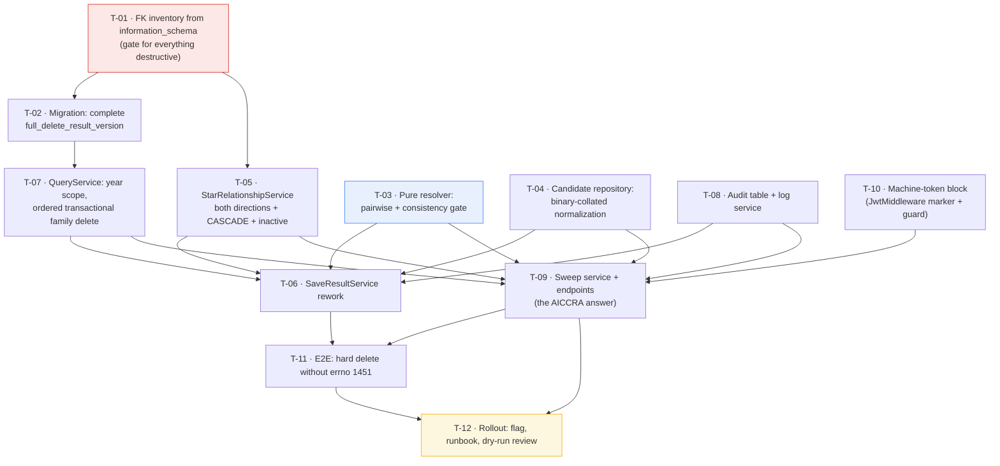

# Tasks — results / cross-platform-duplicate-resolution

- **Module:** results
- **Spec id:** 2026-08-cross-platform-duplicate-resolution
- **Status:** not-started
- **Owner:** ARI server squad (David Casañas)
- **Linked requirements:** [`./requirements.md`](./requirements.md)
- **Linked design:** [`./design.md`](./design.md) (rev 2, post-correction)
- **Linked review ledger:** [`./judgment.md`](./judgment.md) — two rounds, 8 + 8 severe findings
- **Last updated:** 2026-08-04

---

## 0. Read this before starting

**This spec hard-deletes production rows. Recovery is a re-sync from the source platform — and AICCRA has no automatic sync.** 86 of the 116 live duplicate groups make **AICCRA** the loser, so the platform that cannot be re-synced is the one losing most often.

Three things this task list inherits from a two-round adversarial review, each of which caught a data-loss defect that a passing test would have hidden:

1. **Assert every row's fate, never just the row a previous attempt got wrong.** Two revisions shipped an over-deletion defect because the test asserted one row was safe and left the others untraced. Every resolver test asserts the complete partition: winner, losers, untouched.
2. **Derive schema facts from `information_schema`, never from a TypeORM entity walk or a `grep` over migrations.** `result_cap_sharing_ip` holds a live FK and has no entity; `project_indicators_results` exists in no migration at all. Both were missed by entity-derived methods.
3. **A green gate is not evidence unless the gate can see the defect.** Each task below states what **disqualifies** its evidence, not only what satisfies it.

**Two open questions block the destructive step, not the build:** OQ-7 (7 inactive STAR links) and OQ-8 (live machine-token exposure). Tasks T-01…T-09 may proceed; `apply` against real data may not until both are answered.

---

## 1. Task numbering

`T-<NN>`, mapped to `R-RES-<NNN>` / `NFR-RES-<NNN>`. Ordering is the dependency graph in §2, not priority.

---

## 2. Dependency graph

No cycles. **T-01 gates every destructive task** — it is the method fix, and skipping it reproduces the failure of both prior revisions. T-03 and T-04 are pure and can start immediately in parallel with T-01.

---

## 3. Task list

### T-01 — Derive the FK inventory and delete-function baseline from the live schema

- **Requirements covered:** R-RES-003, R-RES-004, §5 data requirements
- **Files touched:** `fk-inventory.md` (evidence artifact) + `fk-inventory.gen.js` (the generator, vendored so T-02 can re-derive with one command)
- **Description:** Dump the live `full_delete_result_version` definition and enumerate every FK referencing `results` and every cross-result FK, from `information_schema`. Produce the authoritative table list T-02 and T-05 consume. This task exists because the first revision of this spec derived the same facts from a TypeORM entity walk and an unsorted `grep | tail`, and got the migration baseline, the link-direction handling, and the table list all wrong.
- **Implementation notes:**
  - `SELECT k.TABLE_NAME, k.COLUMN_NAME, r.DELETE_RULE FROM information_schema.KEY_COLUMN_USAGE k JOIN information_schema.REFERENTIAL_CONSTRAINTS r … WHERE k.REFERENCED_TABLE_NAME = 'results'` — plus the same with `REFERENCED_COLUMN_NAME = 'result_id'` and `REFERENCED_TABLE_NAME <> 'results'` for cross-result shapes.
  - `SHOW CREATE FUNCTION full_delete_result_version` → parse its DELETE targets → set-difference against the FK list.
  - Read-only. `SELECT`/`SHOW` only. The shared dev DB is not disposable.
  - Expected (measured 2026-08-04, for regression comparison only, **not** as the answer): 38 FKs / 37 `NO ACTION` + 1 `CASCADE`; 35 DELETE targets; 7 uncovered `NO ACTION` tables + `project_indicators_results` (CASCADE) + `TEMP_result_external_oicrs` (no FK).
- **Acceptance / done check:**
  - [x] The artifact lists every FK with its `DELETE_RULE`, and the uncovered set as a computed difference.
  - [x] The live function definition is recorded verbatim with its byte length (7,325 B).
  - [x] Any divergence from the expected figures is called out explicitly with the cause.
- **What disqualifies the evidence:** an inventory produced from entities, migrations, or this document's numbers instead of `information_schema`. **If the uncovered set differs from the 7 named tables, stop and escalate** — the schema moved and the whole delete path needs re-derivation (§14 tripwire).
- **Result (2026-08-04):** **38** FKs / **37** `NO ACTION` + **1** `CASCADE`; **35** function DELETE targets; uncovered `NO ACTION` = the **7** expected tables; uncovered `CASCADE` = `project_indicators_results`; **5** cross-result shapes. **Divergence: none — the §14 tripwire does not fire and T-02 may proceed.** One correction made during the task: the "carries `result_id`, no FK" enumeration initially included 17 **views** (`report_*`, `vw_results_dashboard_*`), which would have put `DELETE FROM vw_…` into the migration; filtering on `TABLE_TYPE = 'BASE TABLE'` leaves exactly `TEMP_result_external_oicrs` (326 rows), the one table the design already named.
- **Dependencies:** none · **Effort:** S · **Status:** **done**
- **Skills:** `nestjs-expert`

---

### T-02 — Migration: complete `full_delete_result_version`

- **Requirements covered:** R-RES-003
- **Files touched:** `src/db/migrations/<ts>-completeFullDeleteResultVersion.ts`
- **Description:** Redefine the function to delete from every FK-holding table T-01 found uncovered, plus the cross-result columns of `result_pool_funding_indicator_mapping`. Baseline is the **live definition** dumped in T-01, not any migration file.
- **Implementation notes:**
  - `DROP FUNCTION IF EXISTS` + `CREATE FUNCTION` — the pattern the five prior delete-function migrations use. **Never edit a merged migration.**
  - Add in FK-dependency order, before the `results` row: `result_cap_sharing_ip` (keyed on `result_cap_sharing_ip_id`), `bulk_upload_results`, `result_review_history`, the three `result_pool_funding_*`, `temp_result_ai`, `TEMP_result_external_oicrs`.
  - `result_pool_funding_indicator_mapping` also needs its **cross-result** columns cleared (`result_capacity_sharing_id`, `result_knowledge_product_id`, `result_policy_change_id`, `result_innovation_dev_id`), not only its owning `result_id` — otherwise a surviving pool-funding result keeps a reference to a deleted sub-row.
  - `down()` restores the T-01 dumped definition verbatim.
- **Acceptance / done check:**
  - [ ] `npm run migration:dev:execute` applies cleanly; `npm run migration:revert` restores the dumped definition byte-for-byte. — **BLOCKED, awaiting a human decision** (see below)
  - [x] Every table in T-01's uncovered set appears in the new body — verified in the **stored** definition, not just the source file.
- **What disqualifies the evidence:** a clean apply proves the SQL parses, **not** that coverage is complete — only T-11's seeded e2e proves that. Do not mark done on the migration running.
- **Progress (2026-08-04):** migration written at `src/db/migrations/1785866413438-completeFullDeleteResultVersion.ts`, generated from the **live** function body so `down()` restores it verbatim and `up()` cannot drift through transcription. Verified: TypeScript compiles clean; four generator self-checks pass (presence, placement before `DELETE FROM results`, mapping-before-`result_knowledge_products`, `_sp`-before-parent); and the SQL was **executed under a temporary function name** against the real schema — it parsed, every table and column resolved, the stored definition carried **44** DELETE targets (up from 35) with all 9 additions present, the temporary function was dropped, and `full_delete_result_version` was never touched.
- **Two deviations from `design.md` §3.2, both recorded there:**
  1. The cross-result columns of `result_pool_funding_indicator_mapping` are **not** cleared. Those rows belong to a surviving result; nulling them strips that result's indicator link. T-05 protects instead, and an untouched FK fails loudly if the guard has a gap.
  2. **`result_pool_funding_alignment_sp` was added** — a transitive dependency (75 rows, `NO ACTION`) that does not reference `results`, so T-01's one-level inventory did not name it and the live function omitted it. **Completing the function needs the transitive closure of the FK graph.** T-11's seed must cover the transitive set.
- **Blocked on:** applying and reverting against the **shared** dev database. `CLAUDE.md` makes schema operations there a human decision, and a mid-flight failure between `DROP FUNCTION` and `CREATE FUNCTION` would leave every caller of the delete path broken. The `TEST` datasource is on a different host and is unreachable from this environment, so it cannot stand in. **Needs either an explicit go-ahead on dev, or a reachable TEST/local database.**
- **Dependencies:** T-01 · **Effort:** M · **Status:** **blocked** (implementation complete and validated; execution gated)
- **Skills:** `nestjs-expert`

---

### T-03 — Pure resolver: pairwise rules + consistency gate

- **Requirements covered:** R-RES-002, R-RES-005, R-RES-006
- **Files touched:** `src/domain/shared/utils/duplicate-result-priority.util.ts`, `…util.spec.ts`
- **Description:** Replace the pairwise-vs-incoming resolver with a group resolver that applies each rule to the two rows it names, gates on rule consistency, and returns the complete partition (winner, losers, untouched, classification, deciding rule + deciding row). Pure — no I/O, no repository, no Nest DI.
- **Implementation notes:**
  - Rules per `design.md` §5.1 step 3; Rule 3 scoped to Knowledge Product (OQ-1 closed).
  - **Consistency gate (D-dup-13):** any row that wins ≥1 pair **and** loses ≥1 pair ⇒ `UNRESOLVED_CONFLICT`, empty `toDelete`, no winner, no omission.
  - Classifications: `RESOLVED`, `SAME_SYSTEM_IGNORED`, `UNRESOLVED_CONFLICT`, `CROSS_YEAR_REVIEW`, `NO_CONFLICT`.
  - Same-platform survivors leave **those rows** untouched while still deleting a cross-platform row that lost to every survivor.
  - Return the deciding `result_id` alongside the rule — R-RES-009 AC.1 and the audit schema both require it.
- **Acceptance / done check:**
  - [ ] `{AICCRA CS, TIP KP, TIP non-KP}` → `UNRESOLVED_CONFLICT`, `toDelete` **empty**.
  - [ ] `{AICCRA CS, AICCRA non-CS, TIP KP}` → `UNRESOLVED_CONFLICT`, `toDelete` **empty**.
  - [ ] `{TIP, AICCRA non-CS}` → AICCRA is the only loser. `{AICCRA CS, TIP KP}` → TIP KP is the only loser.
  - [ ] Same-platform-only group → no winner, no loser, no omission.
  - [ ] Every case asserts the **complete partition**, and every case is re-run over a permuted participant array with an identical result (R-RES-002 AC.7).
- **What disqualifies the evidence:** a test that asserts only which row survives, or only that one named row is untouched. **That exact shape let this defect ship twice.** A (platform × indicator) member matrix is also insufficient — the defect needs three rows, so the matrix must enumerate *compositions*.
- **Dependencies:** none · **Effort:** M · **Status:** todo
- **Skills:** `nestjs-expert`, `tdd`

---

### T-04 — Candidate repository with binary-collated symmetric normalization

- **Requirements covered:** R-RES-001, R-RES-006
- **Files touched:** `src/domain/entities/results/repositories/duplicate-candidate.repository.ts` (+ spec)
- **Description:** One place for all duplicate SQL: the per-result candidate lookup (sync) and the cross-platform group scan (sweep). Owns the normalization expression, the `is_active`/`is_snapshot`/platform filters, and the collation.
- **Implementation notes:**
  - Normalization applied **symmetrically** to stored and incoming values: `TRIM` → lowercase scheme+host → strip scheme → strip `www.` → strip one trailing `/` → unify `dx.doi.org`→`doi.org` → strip empty query/fragment. **No path-case folding, no query-parameter stripping.**
  - **Every comparison and `GROUP BY` carries an explicit `COLLATE utf8mb4_bin`.** `public_link` is `utf8mb3_general_ci`; case *and* accent folding are otherwise implicit (`'jose'='josé'` → 1), which makes R-RES-001 AC.2 unsatisfiable and points the failure at over-deletion.
  - Candidates: `is_active = TRUE`, `is_snapshot = FALSE`, `platform_code IN (PRMS, TIP, AICCRA)`, non-empty normalized link. Prefer `COALESCE(is_snapshot, FALSE)` — both columns are nullable with no DB default, and a single NULL silently shrinks the candidate set.
  - Sync path filters to the incoming `report_year_id`; the sweep does not, and classifies multi-year groups `CROSS_YEAR_REVIEW`.
- **Acceptance / done check:**
  - [ ] Links differing only by scheme / `www.` / trailing slash / `dx.doi.org` / surrounding whitespace **match**.
  - [ ] Links differing only in **path case** or in a non-empty query parameter do **not** match (this fails without the explicit collation).
  - [ ] `is_active = false` and `is_snapshot = true` rows are never candidates.
  - [ ] Same-`platform_code` rows are never returned as cross-platform candidates.
- **What disqualifies the evidence:** a spec that asserts normalization symmetry but never asserts a **case-differing pair does not match** — that is the one assertion the collation defect fails, and it is invisible to every other test.
- **Dependencies:** none · **Effort:** M · **Status:** todo
- **Skills:** `nestjs-expert`, `api-design-principles`

---

### T-05 — `StarRelationshipService`: both link directions, CASCADE, per-family-member

- **Requirements covered:** R-RES-004
- **Files touched:** `src/domain/shared/services/star-relationship.service.ts` (+ spec)
- **Description:** Answer "does anything that must survive reference this row?" for a given `result_id`. This is the **only** protection standing between a hard delete and someone's data — the errno-1451 backstop the first revision relied on does not exist, because the live function already clears `link_results` in both directions, so a bug here fails **silently**.
- **Implementation notes:**
  - `link_results` **both** directions: `other_result_id = target` with a STAR counterpart on `result_id`, **and** `result_id = target` with a STAR counterpart on `other_result_id`. Today's code checks only the first, and does not verify the counterpart is STAR.
  - A non-STAR (mirror-to-mirror) link must **not** protect — over-protection blocks legitimate cleanup.
  - **`project_indicators_results` counts as a protecting relationship** (D-dup-16): its FK is `ON DELETE CASCADE`, so a hard delete silently destroys rows the soft delete preserves — the same class as the inactive STAR links behind OQ-7.
  - Evaluate for **every** id in the resolved deletion target set, not just the loser's seed — family expansion adds ids the guard would otherwise never see.
  - Inactive STAR links: behavior is **gated on OQ-7**. Implement the protecting branch behind a config-read so the decision is a flip, not a rewrite.
- **Acceptance / done check:**
  - [ ] STAR link via `other_result_id` → protected. STAR link via `result_id` → protected (currently unchecked).
  - [ ] Mirror-to-mirror link → **not** protected.
  - [ ] A `project_indicators_results` reference → protected.
  - [ ] A STAR link on an **expanded family sibling** protects the whole family.
  - [ ] Measured baseline: 19 dedup-scope rows are STAR-referenced via `other_result_id`; a run reporting 0 protected rows over live data is a red flag, not a success.
- **What disqualifies the evidence:** unit tests alone. Over-protection and under-protection both pass a mocked repository; the 19-row live baseline in the T-12 dry-run is what confirms the query shape.
- **Dependencies:** T-01 · **Effort:** M · **Status:** todo
- **Skills:** `nestjs-expert`, `error-handling-patterns`

---

### T-06 — `SaveResultService`: single participant, verdict-driven action, deletion outside the winner's `try`

- **Requirements covered:** R-RES-001, R-RES-002, R-RES-003, R-RES-004, R-RES-007, R-RES-009
- **Files touched:** `src/domain/shared/services/save-all-sections.service.ts` (+ spec), `src/domain/tools/tip-integration/dto/response-year-tip.dto.ts`
- **Description:** Rework the sync path per `design.md` §5.2. This is where the reported bug lives and where the two most dangerous review findings were found.
- **Implementation notes:**
  - Remove the `excludeResultId` filter — it is what hid the loser's own row.
  - **The incoming payload and `findResult` are ONE participant** (D-dup-14), carrying `findResult`'s `result_id` and the incoming payload's platform/indicator. Counting them twice fires the same-platform branch on every routine re-sync.
  - Act on **that participant's verdict**, not on "incoming is not the winner": loser → skip write, count `OMITTED_DUPLICATE`, and route `findResult`'s family through the **same** loser loop; winner → write; never-loses-but-not-winner → write, delete nothing, not an omission.
  - **Every deletion routes through the single loser loop** — no direct delete call anywhere. One physical deletion must produce exactly one audit row.
  - Deletion runs **after the winner is committed**, outside the winner's `try`, one error boundary per row: guard → audit write → delete → OpenSearch removal. Any failure records `FAILED` and continues. **Never rethrow into the winner's rollback** — today's `catch` calls `deleteFullResultById(createNewResult.result_id)`.
  - `CounterResults` + `CounterResultsEnum` gain `OMITTED_DUPLICATE` → `omittedDuplicateRecords`.
- **Acceptance / done check:**
  - [ ] **Regression, red before the fix:** a stored losing row for link L is hard-deleted on the next sync of its own platform. On current code the row survives — that failing test is the proof the reported bug is fixed.
  - [ ] **Regression:** a `findResult` that is the group winner is **never** deleted (the reclassified-indicator scenario in `design.md` §5.2 step 4).
  - [ ] A routine re-sync of an already-stored row with a cross-platform duplicate resolves normally — not `SAME_SYSTEM_IGNORED`, not a delete of the stored row.
  - [ ] A **genuinely throwing** deletion leaves the winner stored and the run counted as success-with-`FAILED`.
  - [ ] An `is_active = false` candidate does not set the omit verdict.
  - [ ] One physical deletion → exactly one audit row.
- **What disqualifies the evidence:** a deletion double that **resolves** instead of throwing cannot prove the winner survives a failure (KZ-001 — a test double that doesn't do what it stands in for produces a green suite over broken behavior). And because `CounterResults` is consumed by both sync pipelines, a targeted suite confirms the brief was followed, not that the blast radius is clean — **run the full suite** (KZ-003).
- **Dependencies:** T-03, T-04, T-05, T-07, T-08 · **Effort:** L · **Status:** todo
- **Skills:** `nestjs-expert`, `systematic-debugging`, `tdd`

---

### T-07 — `QueryService`: year-scoped, guard-checked, ordered transactional family deletion

- **Requirements covered:** R-RES-003, R-RES-004, R-RES-007, NFR-RES-003
- **Files touched:** `src/domain/shared/utils/query.service.ts` (+ spec)
- **Description:** Fix three defects in a helper the first revision certified as correct.
- **Implementation notes:**
  - Add `report_year_id` to `findResultFamilyIds` — it currently matches `{official_code, platform_code}` only, so deleting a 2024 loser can destroy the same official code's live 2025 row, defeating R-RES-006 from the deletion side.
  - **Blast radius:** the helper has four non-dedup callers — `results.service.ts:364` (bulk hard-delete endpoint), `results.service.ts:960` (AI-report rollback), `prms.opensearch.service.ts:163` (sync rollback), `save-all-sections.service.ts:224` (winner rollback). Decide per-caller whether year scoping is correct and **name each decision in the PR**; do not silently narrow three unrelated features.
  - Wrap family deletion in **one transaction**, snapshots ordered **before** the live row. Verified feasible: the function body is pure `SELECT … INTO` / `DELETE` / `RETURN` with no implicit-commit statement, so its DML participates in the caller's transaction and rolls back.
  - Read the family set **inside** the transaction (`FOR UPDATE`) — a concurrent `SP_versioning` snapshot created between read and delete is orphaned, the exact permanent-invisibility failure this task prevents.
  - Inspect the function's **return value**: it returns `FALSE` rather than raising when the row is absent, so a no-op would otherwise be audited as `DELETED`.
- **Acceptance / done check:**
  - [ ] Family expansion never crosses `report_year_id`.
  - [ ] A forced failure on the second family member rolls the whole family back — the live row is still present.
  - [ ] Snapshots are deleted before the live row.
  - [ ] A `FALSE` return is recorded as `NOOP`, never `DELETED`.
  - [ ] Each of the four existing callers has a stated decision and a test naming it.
- **What disqualifies the evidence:** measured 0 multi-year families today, so a passing suite over current data proves nothing about the year scope — the test must **construct** a multi-year family.
- **Dependencies:** T-02 · **Effort:** M · **Status:** todo
- **Skills:** `nestjs-expert`, `error-handling-patterns`

---

### T-08 — Audit table + log service

- **Requirements covered:** R-RES-009, R-RES-003 AC.3, NFR-RES-004
- **Files touched:** `src/db/migrations/<ts>-createDuplicateResolutionLog.ts`, `src/domain/entities/results/entities/result-duplicate-resolution-log.entity.ts`, `src/domain/entities/results/result-duplicate-resolution-log.service.ts` (+ spec), `src/domain/entities/sync-process-log/**`
- **Description:** The durable answer to "did it actually delete the duplicates?" — the question that opened this spec. Written **before** deletion, because under a hard delete it is the only surviving trace.
- **Implementation notes:**
  - Fields per `design.md` §3.3, including the participant payload as JSON and the **deciding rule + deciding `result_id`**.
  - `UNRESOLVED_CONFLICT` and same-platform-ambiguity groups have **no single winner and no deciding row** — the schema must represent that state without violating R-RES-009 AC.1. Make those columns nullable and record the classification as the explanation.
  - Record the feature-flag state on every row.
  - **A third migration is required** for the omission counter: `sync_process_logs` has no such column and its existing counter columns are NOT NULL with no default. The design budgeted two migrations — this is the known overrun, flagged rather than absorbed.
- **Acceptance / done check:**
  - [ ] Every deletion, omission, protection, and conflict produces exactly one traceable record naming its classification.
  - [ ] The audit row exists **before** the corresponding delete is attempted.
  - [ ] `omittedDuplicateRecords` survives to `sync_process_log` — it is not discarded at end of run.
  - [ ] An operator can answer "which rows did run X delete, and why" from stored data alone.
- **What disqualifies the evidence:** counters that increment in memory. The first revision's design did exactly that and called R-RES-009 AC.2 satisfied.
- **Dependencies:** none · **Effort:** M · **Status:** todo
- **Skills:** `nestjs-expert`

---

### T-09 — Sweep service + two admin endpoints (the AICCRA answer)

- **Requirements covered:** R-RES-008, R-RES-006, R-RES-007, NFR-RES-001, NFR-RES-002, NFR-RES-005
- **Files touched:** `src/domain/entities/results/duplicate-resolution.service.ts`, `…controller.ts`, `dto/duplicate-resolution.dto.ts`, `results.module.ts` (+ specs)
- **Description:** The rules path AICCRA has never had. **116 groups are waiting for it.** `GET …/plan` (dry-run) and `POST …/apply` (digest-confirmed).
- **Implementation notes:**
  - `SYSTEM_ADMIN` only, `@Roles` + `RolesGuard`, full Swagger (`@ApiTags`, `@ApiBearerAuth`, `@ApiOperation`, `@ApiQuery`/`@ApiBody`).
  - Registered via `ResultsModule`; the controller's own path resolves under `/api/v1/results/…` — **no `main.routes.ts` change** (verified against `main.routes.ts:277–281`).
  - `dry-run` performs **zero writes** to `results` or any child table; only the audit run row.
  - Digest covers the **fully expanded** deletion set, not loser seed ids — otherwise rows created between plan and apply are deleted without appearing in the reviewed artifact, and that artifact is the only DC-5 gate.
  - Digest TTL from `app_config`, default 30 min. `apply` re-derives, recompares, and refuses on mismatch or expiry (`409`).
  - **Run lock needs atomic acquisition** — compare-and-set or `SELECT … FOR UPDATE`, plus a TTL and a seeded row (`updateConfig` throws on a missing key; there is no upsert). An in-process flag passes the unit test and fails across replicas. Note `app_config` is world-readable via `GET /api/configuration/:key` in the JWT exclude list, so the lock row and flag state are public — acceptable, but do not store anything sensitive there.
  - Batched processing; per-group transactions, never one for the run.
  - Zero groups → `INCONCLUSIVE` with the filter echoed. **A run that found nothing has not proved nothing is there.**
- **Acceptance / done check:**
  - [ ] `GET …/plan` mutates nothing — asserted by row counts before/after, not by inspection.
  - [ ] `POST …/apply` without a matching plan, or past TTL, or with a digest mismatch → `400`/`409`, **zero rows deleted**.
  - [ ] `apply` deletes exactly the expanded set of the confirmed plan — no more.
  - [ ] Allowed role → `200` with the plan in `ServerResponseDto.data`; **denied role → `403`**; **machine-token principal → `403`** (T-10).
  - [ ] Concurrent sweep → `409`, proven with two simultaneous calls, not a mocked flag.
  - [ ] Zero groups → `INCONCLUSIVE`, never a bare success.
  - [ ] Both endpoints appear in `/swagger` with the bearer lock.
- **What disqualifies the evidence:** a lock test against an in-process boolean; a `409` test that never runs two requests concurrently; and a dry-run "mutates nothing" claim verified by reading the code instead of counting rows.
- **Dependencies:** T-03, T-04, T-05, T-07, T-08, T-10 · **Effort:** L · **Status:** todo
- **Skills:** `nestjs-expert`, `api-design-principles`, `error-handling-patterns`

---

### T-10 — Machine-token block: an auth-type marker plus a guard

- **Requirements covered:** NFR-RES-005
- **Files touched:** `src/domain/shared/middlewares/jwr.middleware.ts`, `src/domain/shared/guards/<new>.guard.ts` (+ specs)
- **Description:** Build the control the earlier revisions asserted already existed. **It does not, and the exposure is live:** all four `app_secrets` rows have zero `app_secret_host_list` entries — and `validation()` skips the origin check entirely when the list is empty — while `app_secret_id 8` resolves to a user holding `System Admin`. A machine token satisfying `@Roles(SYSTEM_ADMIN)` from any origin exists today.
- **Implementation notes:**
  - **The blocker has no attachment point yet.** `jwr.middleware.ts:81` sets `req.user = isValid.user` for the machine-token path and `:90` sets it from the ROAR path — the two are **shape-identical**, so a guard has nothing to read. Stamp an explicit auth-type marker on the request in the middleware, then have the guard reject the machine-token value on these two routes.
  - `jwr.middleware.ts` was in neither the file list nor the budget of the previous revision — this task is the correction.
  - Do **not** widen the JWT `exclude` list.
- **Acceptance / done check:**
  - [ ] The middleware stamps a distinguishable auth-type for both paths, asserted separately.
  - [ ] A machine-token request to either sweep endpoint → `403`, **exercised through the real middleware**, not a mocked context.
  - [ ] A ROAR `SYSTEM_ADMIN` request still succeeds.
- **What disqualifies the evidence:** a unit test that injects a synthetic "machine-token principal" into a mocked execution context. That test **passes against a guard reading a flag production never sets** — the silent-no-op class, on the authorization gate of an irreversible mass delete. The assertion must traverse `JwtMiddleware`.
- **Dependencies:** none · **Effort:** M · **Status:** todo
- **Skills:** `nestjs-expert`

---

### T-11 — E2E: hard delete of a fully-populated result without errno 1451

- **Requirements covered:** R-RES-003, R-RES-004, NFR-RES-001
- **Files touched:** `test/duplicate-resolution.e2e-spec.ts`
- **Description:** The only proof that T-02's coverage is complete. Unmockable by construction — a mocked repository cannot raise a foreign-key error.
- **Implementation notes:**
  - Against the `TEST` datasource (`ARI_TEST_MYSQL_*`), never the shared dev DB.
  - Seed a result with **at least one row in every table T-01 enumerated**, including the newly added seven, then hard-delete it.
  - Second case: dry-run row-count invariance across the whole `results` tree.
  - Third case: a STAR-linked loser is retained and reported, not deleted.
- **Acceptance / done check:**
  - [ ] The seeded delete completes with **no errno 1451** and leaves zero rows in every enumerated child table.
  - [ ] Dry-run leaves every table's row count unchanged.
  - [ ] `npm run test:e2e` green.
- **What disqualifies the evidence:** a seed that populates only the tables the developer remembered. **If the seed does not cover T-01's full enumeration, a green run means the seed was thin, not that the function is complete** — and that is precisely the failure this task exists to catch. State the seeded table count in the PR.
- **Dependencies:** T-06, T-09 · **Effort:** L · **Status:** todo
- **Skills:** `nestjs-expert`, `tdd`

---

### T-12 — Rollout: flag, runbook, and the reviewed dry-run

- **Requirements covered:** R-RES-008, NFR-RES-001; closes OQ-3, OQ-4, OQ-7
- **Files touched:** `docs/specs/results/cross-platform-duplicate-resolution/runbook.md` (new), `app_config` seed
- **Description:** Ship the destructive capability behind a reviewed human gate, and write down the asymmetry that matters.
- **Implementation notes:**
  - Deploy 1 = schema (audit table, delete function, counter column), inert. Deploy 2 = code, with `duplicate_resolution.hard_delete_enabled` **default `false`**. Off = detect + audit + **do not delete** — never a soft-delete fallback, because the soft delete *is* the reported bug.
  - **Restrict who can flip the flag.** `PATCH /api/configuration/:key` currently allows `TECHNICAL_SUPPORT` *and* `SYSTEM_ADMIN`, so a role that cannot call either sweep endpoint can enable irreversible deletion on the sync path — which has no dry-run, digest, or TTL. Narrow this key or gate it separately.
  - **Runbook must state the asymmetry:** 86 of 116 groups make AICCRA the loser, and AICCRA is the only platform with no automatic re-sync. Recovery for TIP/PRMS is a re-sync; for AICCRA it is the loader's MySQL script. This is the single most important thing an operator needs before `apply`.
  - Runbook must require a sweep after each AICCRA load, or the gap this spec closes reopens in a new form.
  - Run `GET …/plan` on dev, review with a human, resolve OQ-7, then `apply`.
- **Acceptance / done check:**
  - [ ] Flag seeded `false`; off-behavior verified as detect-and-audit with zero deletions.
  - [ ] Flag write access narrowed to `SYSTEM_ADMIN`.
  - [ ] Runbook covers the AICCRA asymmetry, the post-load sweep, and the backout path.
  - [ ] A dev dry-run is reviewed and signed off; OQ-7 answered before any `apply`.
- **What disqualifies the evidence:** treating the dev baseline of **116 groups** as a production gate. Production will legitimately differ; a threshold that always trips gets waived. On dev it is a regression check against a known number; in production the gate is the human review of the plan plus non-surprising `UNRESOLVED_CONFLICT`/`protected` counts.
- **Dependencies:** T-09, T-11 · **Effort:** M · **Status:** todo
- **Skills:** `nestjs-expert`

---

## 4. Estimated size and PR strategy

| | |
| --- | --- |
| Tasks | **12** (design budgeted 9 — see overrun below) |
| Estimated LOC | **~1,250** (≈500 production, ≈750 tests) |
| Migrations | **3** (design budgeted 2) |

**Budget overrun, declared rather than absorbed.** The design's 9-task / 2-migration budget did not include T-10 (the machine-token control has no attachment point, so `JwtMiddleware` must change) or T-08's third migration (`sync_process_logs` has no omission column and its counters are NOT NULL). Both were found in review round 2. Per `design.md` §14 this is a tripwire, not a silent absorption: **flagged here for the user's call on scope.**

### Recommended PRs — four, split on risk rather than on layer

| PR | Tasks | Why this boundary |
| --- | --- | --- |
| **PR 1 — Inventory & schema** (~250 LOC) | T-01, T-02, T-08 | Inert. Nothing reads the new table or function path yet, so it is reviewable purely on correctness of the enumeration. Review T-01's artifact **first** — every later PR trusts it. |
| **PR 2 — Pure logic** (~350 LOC, mostly tests) | T-03, T-04 | No I/O, no destructive path. The highest-value review in the set: these two files decide which production row dies, and both are cheap to test exhaustively. Reviewer should read the composition matrix before the implementation. |
| **PR 3 — Destructive path** (~450 LOC) | T-05, T-06, T-07, T-10 | Everything that can lose data, in one place, reviewed together. Out of scope for PR 1–2 reviewers. **This is the PR that needs the most careful eyes.** |
| **PR 4 — Sweep, e2e, rollout** (~200 LOC) | T-09, T-11, T-12 | The AICCRA capability plus its proof and its human gate. |

Chained PR descriptions per `cognitive-doc-design`: each states what to review first, what is deliberately out of scope, and links the previous/next PR.

---

## 5. Testing expectations

Per `design.md` §10. Non-negotiables:

- **Every resolver case asserts the complete partition** — winner, losers, untouched — not just the row a previous attempt got wrong.
- **T-06's deletion double must genuinely throw.** A resolving stub cannot prove the winner survives a failure (KZ-001).
- **Run the full suite for T-06.** `CounterResults` is consumed by both sync pipelines; a targeted suite confirms the brief, not the blast radius (KZ-003).
- **T-10's `403` must traverse the real middleware.** A mocked context passes against a control that does not exist.
- **T-11's seed must cover T-01's full enumeration**, and the PR must state the seeded table count.
- Global coverage floor 60%; `duplicate-result-priority.util.ts` at or near 100% — it holds the business rules and costs nothing to cover.
- Lean invocation: `npm test -- --silent`, `npm run test:e2e`. Failures print verbatim. Note `npm run lint` carries `--fix` and **mutates files** — re-check `git status` after.

---

## 6. Execution conventions

- One PR per group in §4; squash on merge. Title `<type>(<module>): <subject>`.
- Never edit a merged migration — amend with a new one.
- Swagger annotations land in the same PR as the handler.
- **One AKILI session per checkout.** Never run a build, e2e, or timed measurement while a delegated agent is active — it competes for `node_modules`, ports, and build output, and the result is not slow but **wrong**.
- Read-only DB introspection (T-01) is fine against dev. **Destructive or schema operations against the shared dev DB are a human decision.**

---

## 7. Risks & blockers log

| # | Date | Risk / Blocker | Mitigation | Owner | Status |
| --- | --- | --- | --- | --- | --- |
| RB-1 | 2026-08-04 | **OQ-7** — 7 inactive STAR link rows would be destroyed; the live function clears `link_results` with no `is_active` predicate | Protecting branch implemented behind a config read (T-05) so the decision is a flip; `apply` blocked until answered | Engineering lead | **open — blocks `apply`** |
| RB-2 | 2026-08-04 | **OQ-8** — live machine-token exposure, independent of this spec | T-10 builds the route-level block; the underlying exposure needs a separate owner | Security / eng lead | **open — blocks Deploy 2** |
| RB-3 | 2026-08-04 | **OQ-9** — AC.2 and AC.5 are mutually inconsistent for 3-row compositions | Resolved as `UNRESOLVED_CONFLICT` (D-dup-13). Safe but incomplete: such groups never resolve. 0 live groups affected | MEL / product owner | open — non-blocking |
| RB-4 | 2026-08-04 | Budget overrun: 12 tasks / 3 migrations vs 9 / 2 | Declared in §4 for a scope decision rather than absorbed | User | **open — awaiting call** |
| RB-5 | 2026-08-04 | T-07 changes a helper with 4 non-dedup callers, incl. a bulk hard-delete endpoint | Per-caller decision named in the PR with a test each | Implementer | open |
| RB-6 | 2026-08-04 | Two review rounds each shipped an over-deletion defect that the named gate would have passed | Every task states what **disqualifies** its evidence, not only what satisfies it | Implementer + Reviewer | mitigated |

---

## 8. Done definition

- [ ] All `T-01`…`T-12` are `done`.
- [ ] Every AC in `requirements.md` R-RES-001…009 and NFR-RES-001…005 is checked.
- [ ] Coverage green; `duplicate-result-priority.util.ts` at or near 100%.
- [ ] Both endpoints documented in `/swagger` with the bearer lock.
- [ ] Migrations apply forward and revert cleanly.
- [ ] **OQ-7 and OQ-8 answered** before any `apply` against real data.
- [ ] OQ-3, OQ-4, OQ-9 resolved into decisions or carried into a new spec.
- [ ] A reviewed dev dry-run is signed off, and the runbook records the AICCRA recovery asymmetry.
